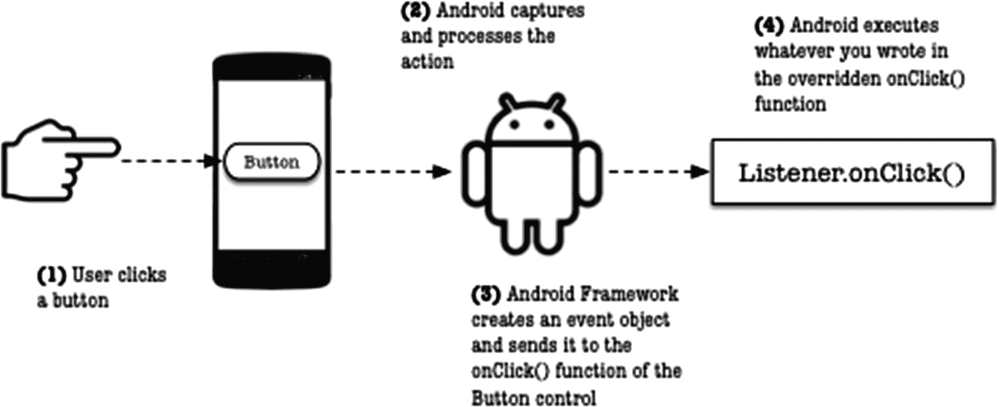
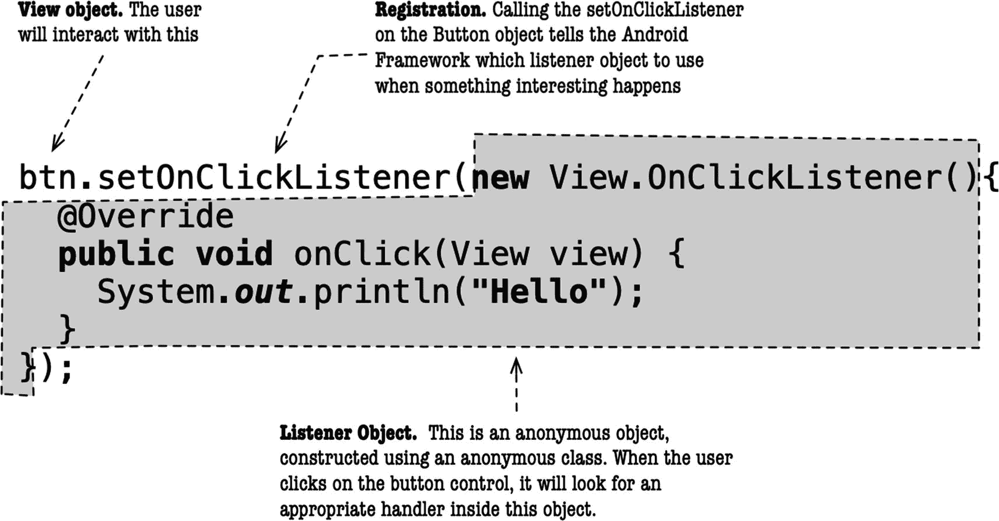
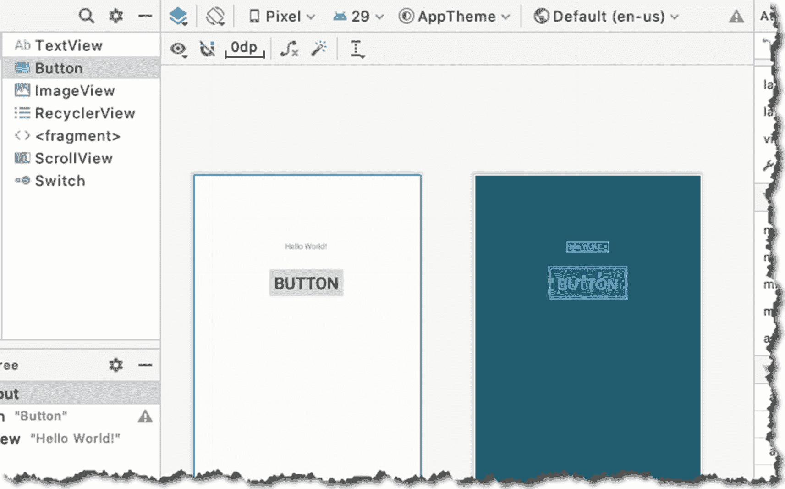
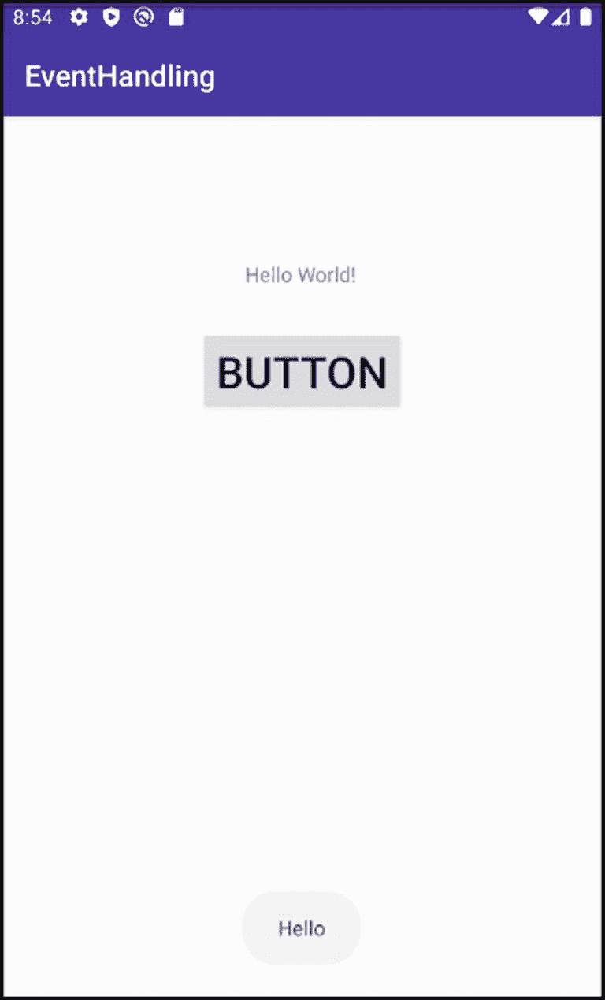
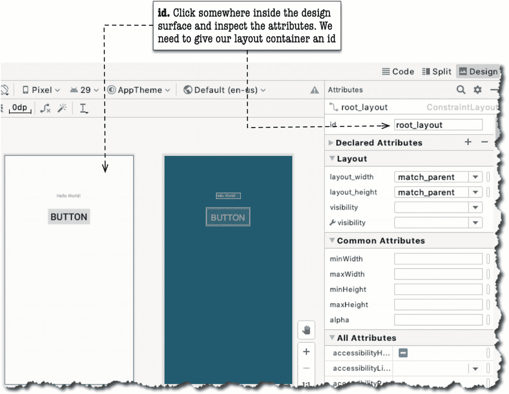
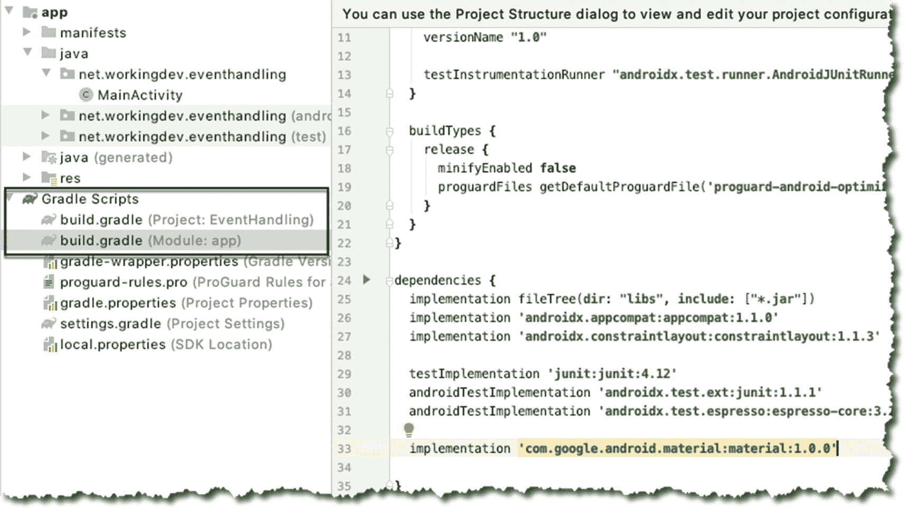
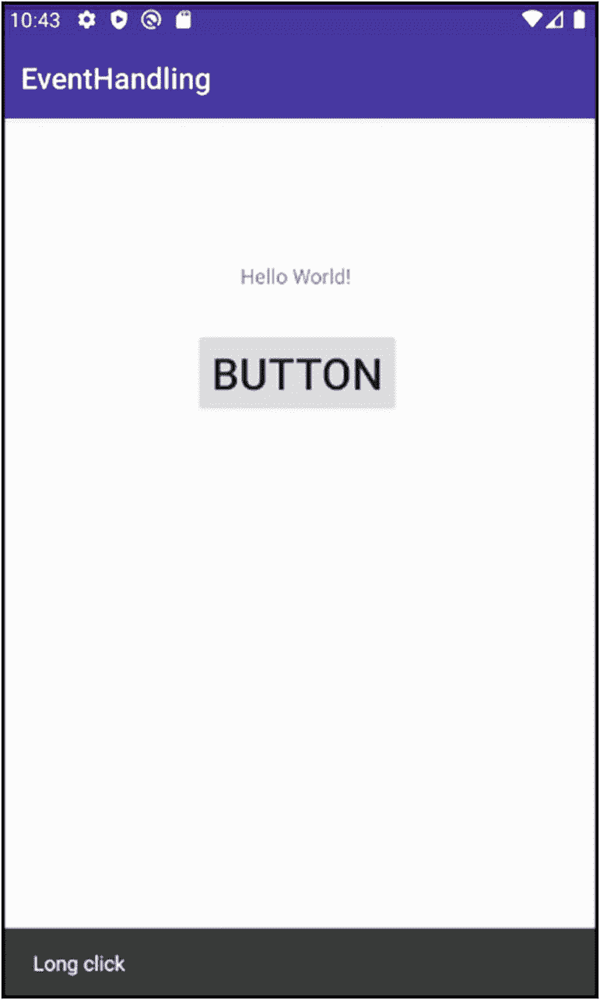

# 7. 事件处理

*本章内容：*

- 监听器对象
- 匿名内部类

在上一章中，我们已经进行了一些事件处理。其中每次点击按钮都递增 TextView 值的练习部分，就是一种*声明式事件处理*。要将方法名绑定到点击事件，我们只需将视图的`android:onClick`属性设置为关联 Activity 类中方法的名称即可。这是一种简洁直接的事件处理方式，但仅限于“点击”事件。当需要处理长按或手势等事件时，你就需要使用事件监听器——这正是本章的主题。


## 事件处理简介

用户通过触摸、点击、滑动或输入内容来与你的应用进行交互。Android 框架会捕获、存储、处理这些操作，并将其作为事件对象发送给你的应用。我们通过编写专门处理这些事件的方法来响应它们。处理事件的方法写在*监听器对象*内部——这样的对象数量不少。图 7-1 展示了一个简化的模型，说明了 Android 框架和你的应用如何处理用户操作。



**图 7-1** —— 简化的事件处理模型

当用户在你的应用中执行某个操作（例如点击按钮）时，Android 框架会捕获该操作并将其转换为一个事件对象。事件对象包含关于用户操作的数据，例如，哪个按钮被点击、按钮被点击时的位置等等。Android 将此事件对象发送给应用，然后应用会调用一个与用户操作相对应的特定方法。如果用户*点击*了按钮，Android 就会调用`Button`对象上的`onClick()`方法；如果用户点击了同一个按钮但按住的时间稍长一些，那么`onLongClick()`方法就会被调用。像`Button`这样的`View`对象可以响应一系列事件，例如点击、按键、触摸或滑动等。表 7-1 列出了一些常见事件及其对应的事件处理程序。

**表 7-1** —— 常见的监听器对象

| 接口 | 方法 | 描述 |
| --- | --- | --- |
| `View.OnClickListener` | `onClick()` | 当用户触摸并按住控件（在触摸模式下）或者使用导航键聚焦到该项然后按下 ENTER 键时，会调用此方法 |
| `View.OnLongClickListener` | `onLongClick()` | 与点击几乎相同，但按住时间更长 |
| `View.OnFocusChangeListener` | `onFocusChange()` | 当用户导航到或离开控件时调用 |
| `View.OnTouchListener` | `onTouch()` | 与点击操作几乎相同，但此处理程序能让你判断用户是向上滑动还是向下滑动。你可以用它来响应手势 |
| `View.OnCreateContextMenuListener` | `onCreateContextMenu()` | 当由于长时间持续点击而正在构建`ContextMenu`时，Android 会调用此方法 |

要设置监听器，`View`对象可以设置——或者更准确地说是注册——一个*监听器对象*。注册监听器意味着你告诉 Android 框架当用户与`View`对象交互时要调用哪个方法。图 7-2 展示了用于注册监听器对象的带注释代码。



**图 7-2** —— 带注释的事件注册与处理

`setOnClickListener`是`android.view.View`类的一个成员方法，这意味着`View`的每个子类都拥有它。该方法需要一个`OnClickListener`对象作为参数——此对象成为按钮控件的监听器。当按钮被点击时，`onClick`方法内的代码将会执行。

我们通过创建一个继承自`View.OnClickListener`的匿名类的实例来创建监听器对象；这种类型在`View`类中被声明为一个嵌套接口。

现在我们已经了解了一些关于事件的知识，让我们把它们付诸实践。让我们创建一个新项目；表 7-2 显示了项目的详细信息。

**表 7-2** —— 项目详情

| 项目详情 | 值 |
| --- | --- |
| 应用名称 | `EventHandling` |
| 公司域名 | 使用你的网站名称 |
| 语言 | `Java` |
| 设备规格 | 仅限手机和平板 |
| 最低 SDK | `API 29 (Q) Android 10` |
| 活动类型 | 空白活动 |
| 活动名称 | `MainActivity` |
| 布局名称 | `activity_main` |

该项目将只包含两个控件：使用向导创建项目时自带的`TextView`，以及我们即将添加的一个`Button`视图。`Button`将使用一个匿名内部对象来拦截点击和长按事件。

如果`activity_main.xml`文件尚未打开，请在主编辑器中打开它。你可以在项目资源管理器窗口中的`app` ➤ `res` ➤ `layout`文件夹下找到它。

在设计界面上添加一个`Button`对象，并为其添加一些约束。你可以像上一章那样，通过将`Button`从组件面板拖放到设计界面上来将其添加到布局中。图 7-3 显示了添加了`Button`对象后的项目。



**图 7-3** —— 向项目中添加一个 Button 视图

我们希望`Button`能够响应点击事件，因此我们将设置一个`OnClickListener`对象来精确地完成这项工作。在主编辑器中打开`MainActivity.java`并添加事件处理代码，如代码清单 7-1 所示。

```java
import androidx.appcompat.app.AppCompatActivity;
import android.os.Bundle;
import android.view.View;
import android.widget.Button;
import android.widget.Toast;
public class MainActivity extends AppCompatActivity {
@Override
protected void onCreate(Bundle savedInstanceState) {
super.onCreate(savedInstanceState);
setContentView(R.layout.activity_main);
Button btn = (Button) findViewById(R.id.button); ❶
btn.setOnClickListener(new View.OnClickListener(){ ❷
@Override
public void onClick(View view) { ❸
Context ctx =  MainActivity.this;
Toast.makeText(ctx, "Hello", Toast.LENGTH_LONG).show(); ❹
}
});
}
}
```

**代码清单 7-1** —— `MainActivity.java`

❶   我们获取对`Button`视图的引用；`findViewById()`可以很好地完成这项工作。

❷   在这种情况下，我们设置了一个监听器对象，即一个`OnClickListener`对象，因为我们想要监听点击事件。

❸   我们重写了`OnClickListener`的`onClick()`方法；这是我们放置当`Button`被点击时要运行的代码的地方。

❹   我们显示一条`Toast`消息。`Toast`是一个小型弹出消息，几秒钟后会自动消失。你可以用它向用户发送简短的反馈。显示`Toast`消息分为两步。第一步是使用`makeText()`函数创建一个`Toast`消息。它接受三个参数：(1) 应用的上下文，在我们的例子中是`MainActivity`的实例，(2) 要显示的消息，以及 (3) 显示的时间长度。第二步是通过调用`.show()`方法使其可见。

图 7-4 显示了点击`Button`时的应用界面。



**图 7-4** —— Toast 消息


## 处理长按点击

视图对象可以处理多种类型的事件。我们可以让`Button`同时响应单击（刚才已经实现）和长按点击（即将实现）。

我们将为`Button`对象设置另一个监听器对象，这次是用于监听长按事件的监听器。与点击监听器类似，我们会在`Activity`类的`onCreate`方法中设置长按监听器，因为在设置监听器时`Activity`无需处于可见状态。如果你觉得`onCreate`方法已经变得过于拥挤，可以随时重构该方法，将所有事件处理代码迁移到其他地方。在本示例中，我将把事件处理代码保留在`onCreate`方法内。长按监听器的代码如代码清单 7-2 所示。

```
btn.setOnLongClickListener(new View.OnLongClickListener() {
@Override
public boolean onLongClick(View view) {
return true;
}
});
代码清单 7-2
长按监听器
```

这个监听器在结构上与点击处理程序非常相似；我们调用`setXXXListener`方法，并将一个匿名监听器类的实例作为参数传递进去。然后重写同一个监听器对象的方法（这里重写的是`onLongClick`方法），并将我们的代码写入其中——仅此而已。

我们也可以在这里再次使用`Toast`消息，但我认为使用另一种反馈机制（比如`Snackbar`）可能更具启发性。`Snackbar`与`Toast`类似，但与在屏幕上方悬浮显示文本消息不同，`Snackbar`的消息会固定在屏幕底部显示。你可以让它在超时后自动消失（就像`Toast`一样），或者让用户通过滑动将其关闭。`Snackbar`的功能比`Toast`更强大，因为您可以在消息中包含一些操作选项，就像一个小对话框一样。

在继续之前，我们需要对项目进行两处修改。我们需要：

1.  更改布局容器的`id`属性值。默认情况下，布局容器没有设置`id`，这通常没问题，因为我们之前无需从 Java 代码中引用它。但现在我们需要这样做了。`Snackbar`的构造要求我们引用布局容器。
2.  在 Gradle 文件中添加一个依赖项。`Snackbar`并不能直接使用；你需要将其包含在项目的依赖文件中。

我们先处理布局文件。打开`activity_main`布局文件，然后更改主布局文件`id`属性的值。默认情况下，布局容器的`id`属性没有值；我们现在需要给它设置一个值，因为稍后需要在代码中引用它。

当`activity_main`在主编辑器中打开时，切换到设计模式；点击布局容器主体内的任意位置，如图 7-5 所示。在属性面板中，编辑`id`属性并将其值设置为`root_layout`。



图 7-5  
更改布局容器的`id`属性

接下来，打开`build.gradle`文件。这里有两个 Gradle 文件：一个位于项目的根文件夹中，另一个位于 app 文件夹内。我们需要更新的是后者。通过双击`build.gradle (Module: App)`打开模块级别的 Gradle 文件，如图 7-6 所示。



图 7-6  
`build.gradle`文件

然后，在依赖项部分添加`implementation 'com.google.android.material:material:1.0.0'`这一行，如代码清单 7-3 所示。这将使`Snackbar`对象可供使用。

```
dependencies {
implementation fileTree(dir: "libs", include: ["*.jar"])
implementation 'androidx.appcompat:appcompat:1.1.0'
implementation 'androidx.constraintlayout:constraintlayout:1.1.3'
testImplementation 'junit:junit:4.12'
androidTestImplementation 'androidx.test.ext:junit:1.1.1'
androidTestImplementation 'androidx.test.espresso:espresso-core:3.2.0'
implementation 'com.google.android.material:material:1.0.0'
}
代码清单 7-3
build.gradle 文件中的 dependencies 部分
```

现在我们已经修复了 Gradle 文件和布局容器的`id`，可以编写`Snackbar`的代码了；代码清单 7-4 展示了显示`Snackbar`的代码。

```
btn.setOnLongClickListener(new View.OnLongClickListener() {
@Override
public boolean onLongClick(View view) {
View vtemp = findViewById(R.id.root_layout);
Snackbar.make(vtemp,"长按点击", Snackbar.LENGTH_LONG).show();
return true;
}
});
代码清单 7-4
用于显示 Snackbar 的代码
```

`onLongClick`方法返回一个布尔值。我们从该方法返回`true`，是为了告知 Android 运行时我们已经处理了该事件；不需要其他处理程序（比如`onClick`）再次处理它。如果我们返回`false`，那么当`onLongClick`方法返回后，`onClick`处理程序就会立即生效。

代码清单 7-5 展示了`MainActivity.java`的完整代码，供你参考。

```
import androidx.appcompat.app.AppCompatActivity;
import android.content.Context;
import android.os.Bundle;
import android.view.View;
import android.widget.Button;
import android.widget.Toast;
import com.google.android.material.snackbar.Snackbar;
public class MainActivity extends AppCompatActivity {
@Override
protected void onCreate(Bundle savedInstanceState) {
super.onCreate(savedInstanceState);
setContentView(R.layout.activity_main);
Button btn = (Button) findViewById(R.id.button);
btn.setOnClickListener(new View.OnClickListener(){
@Override
public void onClick(View view) {
Context ctx =  MainActivity.this;
Toast.makeText(ctx, "你好", Toast.LENGTH_LONG).show();
}
});
btn.setOnLongClickListener(new View.OnLongClickListener() {
@Override
public boolean onLongClick(View view) {
View vtemp = findViewById(R.id.root_layout);
Snackbar.make(vtemp,"长按点击", Snackbar.LENGTH_LONG).show();
return true ;
}
});
}
}
代码清单 7-5
MainActivity.java 的完整代码
```

图 7-7 展示了在模拟器上对`Button`进行长按点击后应用的状态。



图 7-7  
应用显示`Snackbar`消息

## 总结

*   如果你想处理简单的点击事件，可以将`android:onClick`属性设置成一个函数名。
*   如果你打算拦截某些事件，必须将监听器对象注册到 Android 运行时。
*   有多种类型的监听器对象，它们被列为`View`类中的嵌套接口。
*   你可以将多个监听器关联到同一个`View`对象上。
*   如果你不希望其他事件处理程序处理该事件，请确保在`onLongClick`方法中返回`false`。

