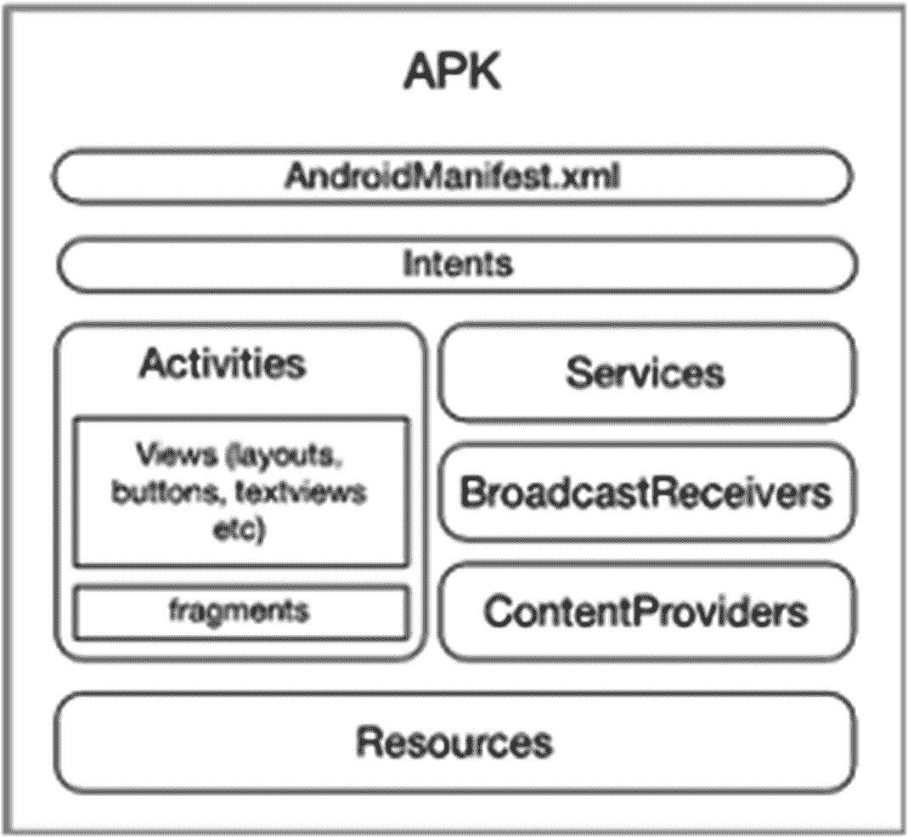
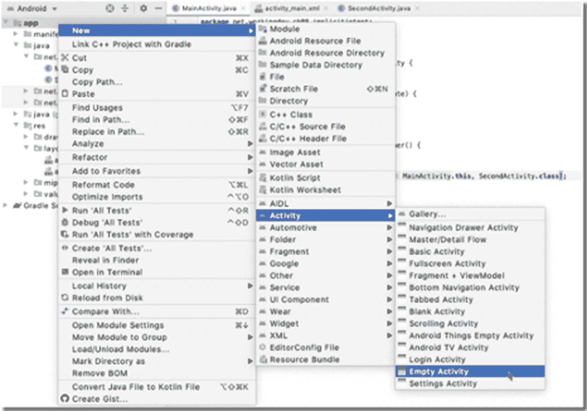
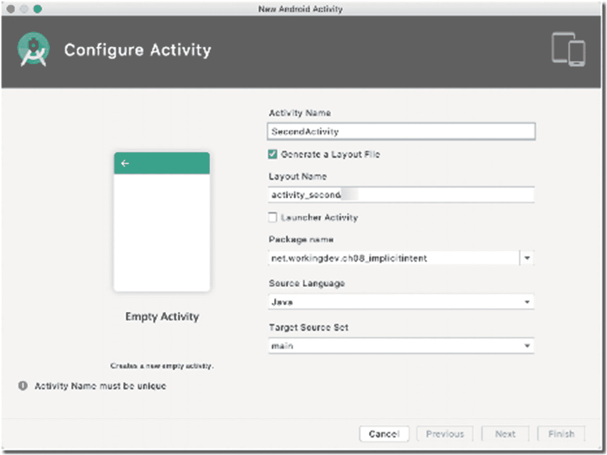
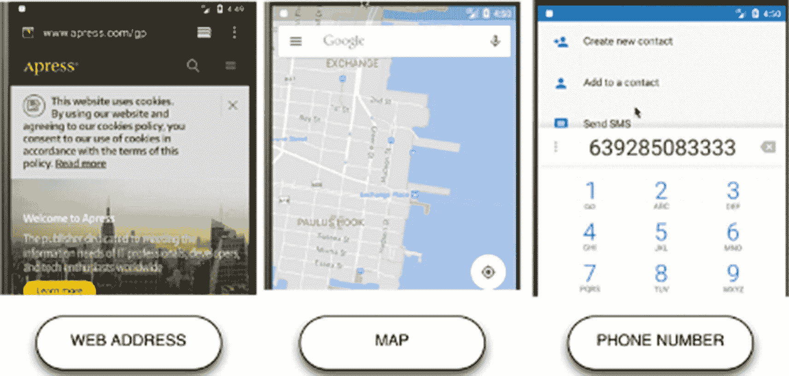

# 8. 意图

*我们将涵盖的内容：*

*   意图概述
*   显式意图和隐式意图
*   在活动之间传递数据
*   从意图返回结果

Android 在构建应用程序的方式上独一无二。它引入了组件这一概念，而不仅仅是普通对象。而 Android 让这些组件进行交互的方式是 Android 平台独有的。Android 使用意图作为其组件之间通信的方式；它通过意图在组件之间传递消息。在本章中，我们将探讨意图，了解它们是什么以及如何使用它们。


## 什么是 Intent

`Intent` 是对要执行操作的抽象描述。这是一个独特的 Android 概念，因为没有其他平台使用相同的方式作为组件激活的手段。在前面的章节中，我们了解了 Android 应用的内部结构。你可能还记得，应用只是一堆松散组合的“组件”（见图 8-1），每个组件都在 `AndroidManifest` 文件中声明。



**图 8-1** Android 应用的逻辑表示

启动一个 `Activity` 并不像创建某个特定 `Activity` 类的实例那么简单，它比这要复杂一些。`Activity` 不仅仅是一个对象，它是一个组件，而在 Android 中激活组件需要使用 `Intent`。

要启动一个 `Activity`，我们需要创建一个 `Intent` 对象，告诉这个 `Intent` 对象我们要激活什么，然后启动它。之后，Android 运行时会尝试解析这个 `Intent`，如果成功，目标组件就会被激活。在代码中，它看起来是这样的：

```
Intent intent = new Intent(context, target);
startActivity(intent);
```

其中：
- **context** — 是对要发起或启动 `Intent` 的组件的引用。
- **target** — 是一个类对象，也就是你想要启动的组件。

启动 `Activity`（通常是从 `MainActivity` 启动）的典型场景是用户点击按钮或选择菜单项时。

要尝试这个操作，你需要一个包含两个 `Activity` 的项目。你已经知道如何创建一个包含空白 `Activity` 的项目，所以直接创建一个即可；假设第一个 `Activity` 类的名称是 `MainActivity`。要添加另一个 `Activity`，我们可以使用上下文菜单。在 Project 工具窗口中，右键单击 **app** 文件夹（假设你处于 Android 作用域，这是默认设置），然后选择 **New** ➤ **Activity** ➤ **Empty Activity**，如图 8-2 所示。



**图 8-2** 新建空白 Activity

在接下来的窗口中，输入第二个 `Activity` 的名称，如图 8-3 所示。采用建议的布局名称（或根据喜好更改），确保它在同一个 Java 包中，并且源语言是 Java。点击 **Finish** 继续。



**图 8-3** 新建 Android Activity

接下来，打开 `activity_main.xml` 并进行编辑，使其与代码清单 8-1 匹配。

```
代码清单 8-1
app/res/layout/activity_main.xml
```

我在 `activity_main` 布局中所做的是移除了默认的 `TextView` 对象，并用一个 `Button` 视图（其 **id** 为 `button`）替换了它。

现在我们可以处理 `MainActivity` 了。我们需要为 `Button` 绑定一个点击处理器，并在该处理器中创建并启动一个 `Intent`。代码清单 8-2 展示了实现此功能的注解代码。

| ❶ | 获取对 `Button` 视图的引用。 |
| ❷ | 创建一个 `OnClickListener` 对象并将其绑定到 `Button` 对象。 |
| ❸ | 在 `onClick()` 方法内部，创建一个 `Intent` 对象。第一个参数是一个 `Context` 对象，应该引用 `MainActivity`。我写了 `MainActivity.this` 而不仅仅是 `this`，因为当前我们在一个点击处理器（这是一个匿名类）内部进行调用；`this` 将引用匿名类的实例，而不是 `MainActivity`。为了明确，我们将 `MainActivity` 的上下文引用为 `MainActivity.this`。或者，你也可以将应用上下文作为第一个参数传递。你可以使用 `getApplicationContext()` 方法获取应用上下文。第二个参数是我们想要启动的组件的类对象，即 `SecondActivity`；因此，我们传递 `SecondActivity.class`。 |
| ❹ | 最后，我们调用 `MainActivity` 的 `startActivity()` 方法，并将 `Intent` 对象作为参数传递；这将启动该 `Intent`。 |

```
import androidx.appcompat.app.AppCompatActivity;
import android.content.Intent;
import android.os.Bundle;
import android.view.View;
import android.widget.Button;

public class MainActivity extends AppCompatActivity {
    @Override
    protected void onCreate(Bundle savedInstanceState) {
        super.onCreate(savedInstanceState);
        setContentView(R.layout.activity_main);

        Button btn = findViewById(R.id.button); ❶

        btn.setOnClickListener(new View.OnClickListener() { ❷
            @Override
            public void onClick(View view) {
                Intent intent = new Intent(MainActivity.this, SecondActivity.class); ❸
                startActivity(intent); ❹
            }
        });
    }
}
```

**代码清单 8-2** MainActivity

如果你现在运行这个应用，当你在 `MainActivity` 上点击 `Button` 时，`SecondActivity` 将会启动。在这个例子中，我们告诉 `Intent` 对象我们想要激活哪个组件（`SecondActivity`）。这种 `Intent` 对象被称为**显式 Intent**，仅仅是因为我们非常精确地指定了要激活的内容。另一种 `Intent` 被称为**隐式 Intent**，这将在下一节中讨论。


## 隐式 Intent

`Intent` 分为两种：隐式 Intent 和显式 Intent。你可以这样理解这两种 `Intent`：假设我们请某人帮忙买些糖。如果我们只说“请帮我买些糖”，没有提供更多细节，这就相当于一个隐式 `Intent`，因为那个人可以在任何地方买到糖。反之，如果我们给出这样的指令：“请去第三街的 ABC 商店买些糖”，这就相当于一个显式 `Intent`。我们在清单 8-2 中的早期示例就是一个显式 `Intent`，因为我们明确告知了 `Intent` 要激活哪个组件。

另一方面，隐式 `Intent` 非常强大，因为它们允许应用程序利用其他应用程序的功能。你的应用可以获得并非由你自己编写的功能。例如，你可以创建一个 `Intent` 来打开相机、拍照并保存照片，而无需编写任何相机相关的代码。

隐式 `Intent` 的目的是让你使用应用中不存在的功能，因为如果该功能存在于你的应用内部，你首先就会使用显式 `Intent`。使用隐式 `Intent` 是一种请求 Android 运行时在设备上找到某个能处理你请求的应用程序的方式。

在显式 `Intent` 中，我们告诉 `Intent` 要激活哪个特定组件。而在隐式 `Intent` 中，我们告诉 `Intent` 我们想要做什么；例如，如果我们想启动一个浏览器并导航到 [`https://apress.com`](https://apress.com)，可以这样做：

1.  创建一个 `Intent` 对象。
2.  通过指定某些操作告诉它要做什么，例如“查看地图”、“拨打电话”、“拍照”、“查看网页”等。
3.  提供一些信息或数据；例如，如果我们想启动一个浏览器并导航到某个特定网页，我们需要告诉 `Intent` 该网页的 URI。
4.  最后，启动该 `Intent`。

清单 8-3 展示了如何在代码中实现这一点。

| ❶ | 使用无参构造函数创建 `Intent` 对象。 |
|---|---|
| ❷ | 设置 `Intent` 的 action。在此示例中，我们想要查看某些内容；可以是联系人、网页、地图、某处的图片等。此时，Android 运行时还不知道你想查看什么。`ACTION_VIEW` 是你可以使用的众多 Intent Action 之一。你可以在 Android 官方网站上找到其他类型的 Action：[`https://developer.android.com/guide/components/intents-common`](https://developer.android.com/guide/components/intents-common)。 |
| ❸ | 设置其数据。此时，Android 运行时已经很清楚你想要做什么。在此示例中，`Uri` 是一个网页。Android 非常智能，能识别出我们想要查看一个网页。 |
| ❹ | Android 将搜索设备上所有应用，找出最符合此请求的应用。如果找到多个应用，它将让用户选择使用哪一个。如果只找到一个，它将直接启动该应用。 |

```
Intent intent = new Intent(); ❶
intent.setAction(Intent.ACTION_VIEW); ❷
intent.setData(Uri.parse("https://apress.com")); ❸
startActivity(intent); ❹
清单 8-3
用于浏览网页的 Intent 示例
```

或者，你也可以通过将 action 和 data 传递给 `Intent` 的构造函数来设置，如下所示：

```
Intent intent = new Intent(Intent.ACTION_VIEW, Uri.parse("https://apress.com"));
```

任何能够响应此 `Intent` 的组件无需在运行中即可接收该 `Intent`。请记住，所有应用程序都需要有一个清单文件。每个应用程序都在清单文件中声明其能力，特别是通过 `<intent-filter>` 部分。Android 的包管理器拥有设备上所有已安装应用的全部信息。Android 运行时仅需清单文件中的信息，即可查看哪些应用能够或有资格响应此 `Intent`。Android 运行时检查 `Intent` 对象的内容，然后将其与所有组件的 Intent 过滤器进行比较。Intent 过滤器是 Android 组件向 Android 系统声明其能力的一种方式。

为了实际演示这一点，让我们创建另一个带有空 Activity 的项目。假设你已经创建好了，现在我们来处理 `MainActivity` 类。我们将创建三个动作触发器；我们可以使用按钮，但在此练习中，我们使用选项菜单。清单 8-4 显示了 `MainActivity` 的带注释代码。

| ❶ | 让我们重写 `onCreateOptionsMenu()` 回调；它将在 `onCreate()` 回调之后不久被调用。重写此方法允许我们以编程方式构建动态菜单。 |
|---|---|
| ❷ | 动态添加一个菜单项。 |
| ❸ | 每当用户点击某个菜单项时，`onOptionsItemSelected` 就会被调用；这是我们处理菜单点击的地方。 |
| ❹ | `item` 参数可以告诉我们哪个菜单项被点击了。我们将其转换为 `String`，以便使用 `switch` 语句来路由程序逻辑。 |
| ❺ | 创建一个 `Intent`，并设置其 action 和 data 以查看 Apress 网站。 |
| ❻ | 创建一个 `Intent`，并设置其 action 和 data 以查看一个位置。 |
| ❼ | 创建一个 `Intent`，并设置其 action 和 data 以拨打特定号码。 |

```
import androidx.annotation.NonNull;
import androidx.appcompat.app.AppCompatActivity;
import android.content.Intent;
import android.net.Uri;
import android.os.Bundle;
import android.util.Log;
import android.view.Menu;
import android.view.MenuItem;
public class MainActivity extends AppCompatActivity {
private final String TAG = getClass().getName();
@Override
protected void onCreate(Bundle savedInstanceState) {
super.onCreate(savedInstanceState);
setContentView(R.layout.activity_main);
}
@Override
public boolean onCreateOptionsMenu(Menu menu) { ❶
menu.add("View Apress"); ❷
menu.add("View Map");
menu.add("Call number");
return super.onCreateOptionsMenu(menu);
}
@Override
public boolean onOptionsItemSelected(@NonNull MenuItem item) { ❸
Intent intent = null;
Uri uri;
switch(item.toString()) {  ❹
case "View Apress":
Log.d(TAG, "View Action");
uri = Uri.parse("https://apress.com");
intent = new Intent(Intent.ACTION_VIEW, uri); ➀
break;
case "View Map":
uri = Uri.parse(("geo:40.7113399,-74.0263469"));
intent = new Intent(Intent.ACTION_VIEW, uri); ➁
break;
case "Call number":
Log.d(TAG, "Call number");
uri = Uri.parse(("tel:639285083333"));
intent = new Intent(Intent.ACTION_CALL, uri); ➂
}
startActivity(intent);
return true;
}
}
清单 8-4
MainActivity
```

图 8-4 展示了运行时的应用程序。



图 8-4

隐式 Intent 项目，运行中

### 摘要

*   Intent 用于组件激活。
*   Intent 有两种类型：隐式 Intent 和显式 Intent。
*   显式 Intent 允许我们与多个 Activity 协同工作。你可以使用显式 Intent 激活特定的 Activity。
*   隐式 Intent 扩展了应用程序的功能。它们使你的应用能够执行其自身功能范围之外的操作。


