# 9. 片段

*本章内容概要：*

* 片段简介
* Fragment 类与 Fragment 资源文件
* 向 Activity 中动态添加 Fragment

在 Android 早期，当它只在手机上运行且没有高分辨率屏幕时，Activity 足以构建用户界面并与用户交互。随后出现了平板电脑和高分辨率显示屏。创建能在手机和平板上都能良好运行的应用程序变得越来越困难。开发者面临艰难的选择：要么选择功能最弱的硬件作为目标，将其视为最低标准；要么让应用通过根据设备能力移除和添加 UI 元素来适应一系列形态因素，而事实证明手动执行此操作非常困难。当 API 11（Honeycomb）推出时，Android 使用 Fragment 解决了这个问题；这也是本章的主题。

## 片段简介

如果我们将 Activity 视为 UI 的组成单元，那么可以将 Fragment 视为一个微型 Activity——它是一个更小的组成单元。通常，你会在运行时根据用户的操作（例如倾斜设备、从竖屏切换到横屏，从而获得更多屏幕空间）来显示（和隐藏）Fragment。你甚至可以将 Fragment 用作适应设备形态因素的策略。当应用在较小屏幕上运行时，你只会显示部分 Fragment。

与 Activity 类似，Fragment 由两部分组成——一个 Java 程序和一个布局文件。其思想几乎相同：在 XML 文件中定义 UI 元素，然后在程序文件中展开 XML 文件，使 XML 中的所有视图对象都成为对象。之后，我们可以通过 `R.class` 引用 XML 中的每个视图对象。可以将 Fragment 想象成一个可以拖放到主布局文件上的普通视图对象。

要创建 Fragment，我们通常执行以下步骤：

1. 创建一个 XML 资源文件，并将其放入 `/app/res/layout` 文件夹，就像放置 `activity_main.xml` 一样。
2. 为新的资源文件赋予一个描述性名称，例如 `fragment_booktitles`。
3. 创建 Fragment 类；此类必须继承 `androidx.fragment.app.Fragment`——所有支持库现在都在 `androidx` 包中。
4. 接下来，将 Fragment 类与 XML 资源布局连接起来。你可以在 Fragment 类的 `onCreate()` 方法中展开 XML 资源文件。
5. 对 `MainActivity` 进行一些修改。默认的 `MainActivity` 继承自 `AppCompatActivity`；这通常没问题，但我们使用的是支持库中的 Fragment 类，这意味着我们需要继承 `FragmentActivity` 而不是默认的 `AppCompatActivity`。
6. 添加新创建的 Fragment。

让我们在 Android Studio 中操作。首先，创建一个带有空 Activity 的项目，就像我们之前创建的其他项目一样。

让我们创建一个 XML 资源文件并将其放入 `/app/res/layout`。你可以通过右键单击项目的布局文件夹，然后选择 **New** ➤ **Layout Resource File** 来执行此操作，如图 9-1 所示。

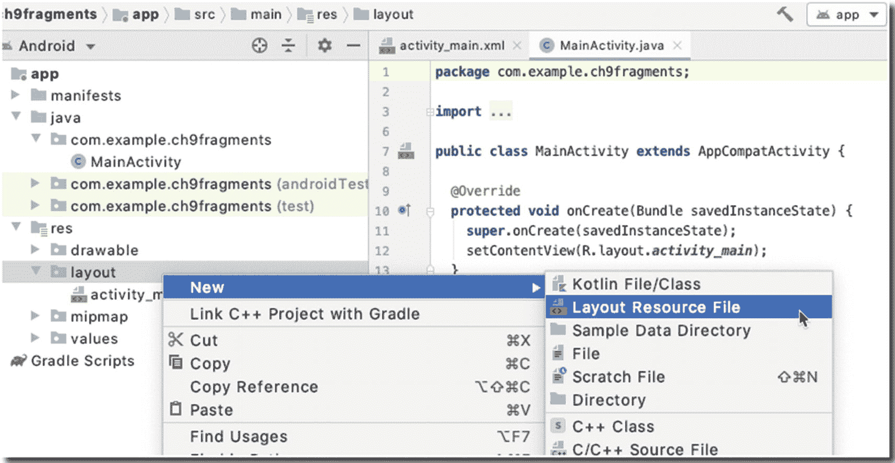

*图 9-1：新建布局资源文件*

在随之出现的窗口中，输入新资源文件的文件名（`fragment_booktitles`），如图 9-2 所示。

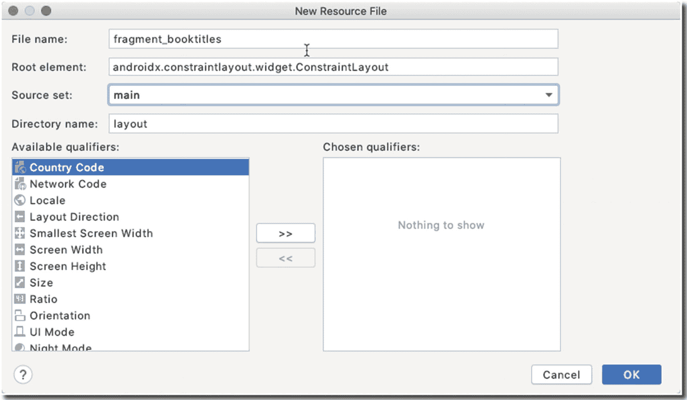

*图 9-2：新资源文件*

接下来，让我们添加一个 fragment 类。为此，通过右键单击项目的包，然后选择 **New** ➤ **Java Class** 来添加一个 Java 类，如图 9-3 所示。

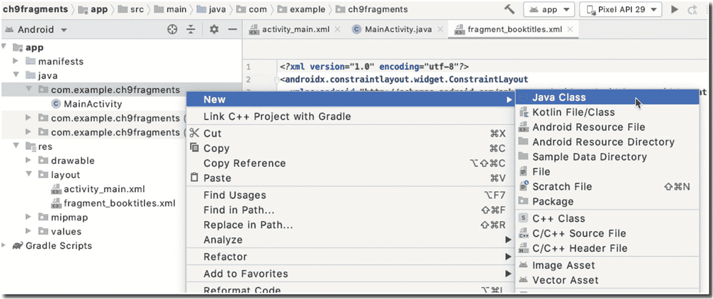

*图 9-3：添加 Java 类*

在随之出现的弹出窗口中，输入新 Java 类的名称（`BookTitle`），如图 9-4 所示。

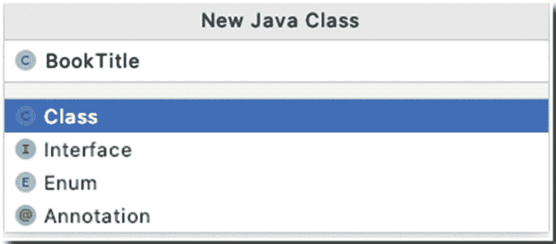

*图 9-4：新建 Java 类*

编辑 `fragment_booktitles` 布局文件以匹配清单 9-1。你可以添加任何想要的 View 组件；就我而言，我简单地添加了一个 `TextView` 对象。

```
清单 9-1
app/res/layout/fragment_booktitles.xml
```

接下来，修改 `BookTitle` 类以匹配清单 9-2。


```markdown

```
import android.os.Bundle;
import android.view.LayoutInflater;
import android.view.View;
import android.view.ViewGroup;
import androidx.annotation.NonNull;
import androidx.annotation.Nullable;
import androidx.fragment.app.Fragment;
import static com.example.ch9fragments.R.layout.*;
public class BookTitle extends Fragment {
@Nullable
@Override
public View onCreateView(@NonNull LayoutInflater inflater,
@Nullable ViewGroup container,
@Nullable Bundle savedInstanceState) {
final View view = inflater.inflate(fragment_booktitles, container, false);
return view;
}
}
```
*清单 9-2* `BookTitle` 类

我们可以通过将布局文件填充并返回给`onCreateView()`回调来关联片段布局文件（`fragment_booktitles`）与片段类（`BookTitle`）。

`onCreateView()`回调与`Activity`类的`onCreate()`方法类似，但要注意此时不能引用任何`View`元素，因为它们尚未就绪。如果需要引用片段布局文件中的任何`View`元素，则必须在`onViewCreated()`回调（此处未显示）中执行。不能在`onCreateView()`回调中引用任何`View`元素的原因是此时布局资源文件尚未填充，因此它们自然不存在。

接下来，让我们编辑`MainActivity`。我们需要将`MainActivity`的父类从`AppCompactActivity`更改为`FragmentActivity`——因为我们正在使用片段。清单 9-3 展示了`MainActivity`的代码。

```
import androidx.fragment.app.FragmentActivity;
import android.os.Bundle;
import android.view.View;
import android.widget.Button;
public class MainActivity extends FragmentActivity {
@Override
protected void onCreate(Bundle savedInstanceState) {
super.onCreate(savedInstanceState);
setContentView(R.layout.activity_main);
}
}
```
*清单 9-3* `MainActivity`

如果想显示我们创建的片段，可以编辑`activity_main`布局文件，然后从面板（如图 9-5 所示）拖放`<fragment>`元素。运行应用时，片段将像其他`View`元素一样在`Activity`中显示。

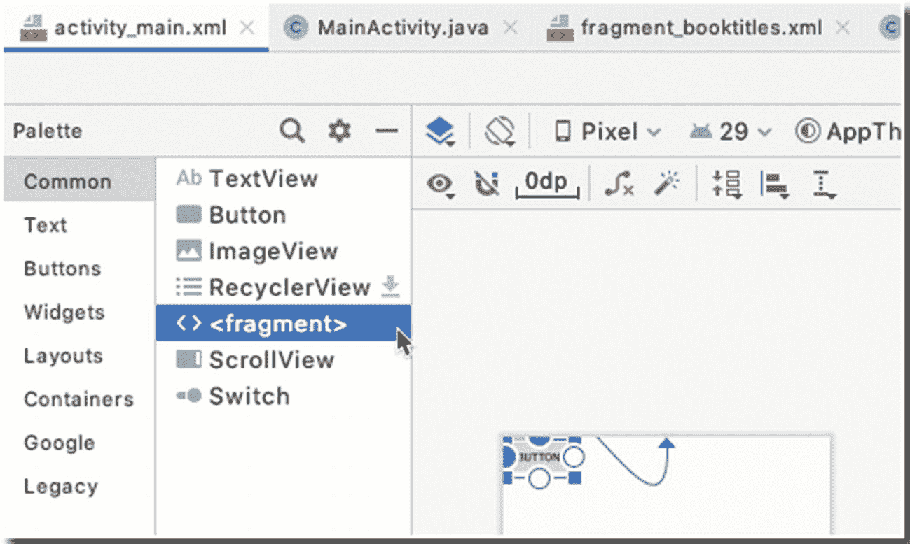

*图 9-5* `<fragment>`

或者，您可以通过编程方式显示片段。为此，我们需要为片段准备一个占位符，可能还需要一个`Button`元素（作为显示片段时的操作触发器）。编辑`activity_main.xml`以匹配清单 9-4。

```
*清单 9-4* `app/res/layout/activity_main`
```

我在`activity_main`中添加了一个`Button`和一个`FrameLayout`容器。我给了`FrameLayout`一个`id`为`fragplaceholder`（您可以随意命名），以便稍后引用它。

向`MainActivity`（动态地）添加片段需要使用`FragmentTransaction`对象。要获取`FragmentTransaction`对象，我们还需要一个`FragmentManager`对象。通常这样做：

```
FragmentManager fm = getSupportFragmentManager();
FragmentTransaction ft = fm.beginTransaction();
```

现在，我们可以进行片段事务了。要将`BookTitle`片段添加到`MainActivity`，我们需要两件事：

1.  一个`BookTitle`实例
2.  一个用于放置片段的`ViewGroup`；这就是我们的`FrameLayout`对象

在代码中，它看起来像这样：

```
BookTitle booktitle = new BookTitle();
FragmentManager fm = getSupportFragmentManager();
FragmentTransaction ft = fm.beginTransaction();
ft.add(R.id.fragplaceholder, booktitle);
ft.commit();
```

为了全面说明，将`MainActivity`编辑为清单 9-5 所示，其中包含我们片段小型演示应用的完整代码。

```
import androidx.fragment.app.FragmentActivity;
import androidx.fragment.app.FragmentManager;
import androidx.fragment.app.FragmentTransaction;
import android.os.Bundle;
import android.view.View;
import android.widget.Button;
public class MainActivity extends FragmentActivity {
@Override
protected void onCreate(Bundle savedInstanceState) {
super.onCreate(savedInstanceState);
setContentView(R.layout.activity_main);
Button btn = findViewById(R.id.button);
btn.setOnClickListener(new View.OnClickListener() {
@Override
public void onClick(View v) {
BookTitle booktitle = new BookTitle();
FragmentManager fm = getSupportFragmentManager();
FragmentTransaction ft = fm.beginTransaction();
ft.add(R.id.fragplaceholder, booktitle);
ft.commit();
}
});
}
}
```
*清单 9-5* `MainActivity`，完整代码

当应用运行时，它不会立即显示片段。当您单击`Button`时，`BookTitle`片段将显示。

图 9-6 显示了在模拟器中运行的片段应用。

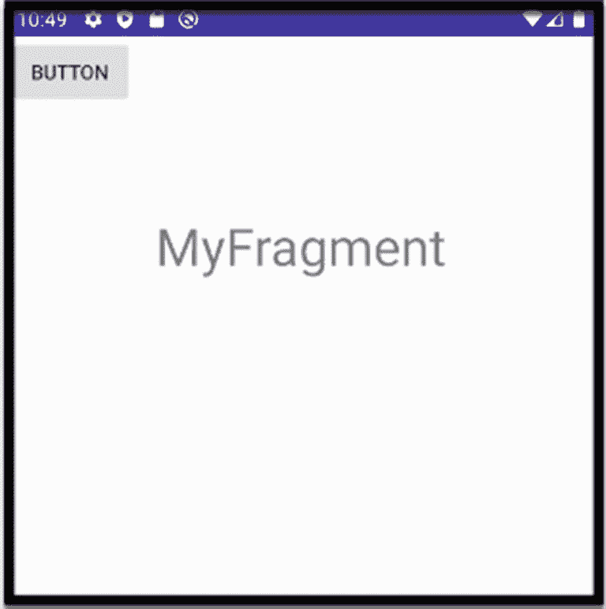

*图 9-6* 片段应用

## 总结

*   要创建片段，您需要一个布局资源文件和一个 Java 类（继承自`androidx.fragment.app.FragmentActivity`）。
*   要将`Fragment`类与片段布局文件关联，请在该类的`onCreateView()`回调方法内填充布局文件。
*   要以编程方式添加片段，您需要使用`FragmentManager`和`FragmentTransaction`对象。

# 10. 导航

*我们将涵盖：*

*   Android 导航技术回顾
*   Jetpack 中的导航组件

```


## 架构组件之前的导航方式

在 Android 开发的早期，大多数有意义的应用都包含多个屏幕，UI 被分散在多个 `Activity` 类中。这意味着你需要掌握从一个 `Activity` 导航到另一个并返回的技能。因此，在那个时期，你可能会写出类似于示例 10-1 中的代码。

```
class FirstActivity extends AppCompatActivity
implements View.OnClickListener {
public void onClick(View v) {
Intent intent = new Intent(this, SecondActivity.class);
startActivity(intent);
}
}
// SecondActivity.java
class SecondActivity extends AppCompatActivity { }
示例 10-1
如何启动 Activity
```

如果你需要将数据从一个 `Activity` 传递到另一个，可能会编写类似示例 10-2 中所示的代码片段。

```
Intent intent = new Intent(this, SecondActivity.class);
Intent.putExtra("key", value);
startActivity(intent);
示例 10-2
如何将数据传递到另一个 Activity
```

这种屏幕管理方式具有以下优势：

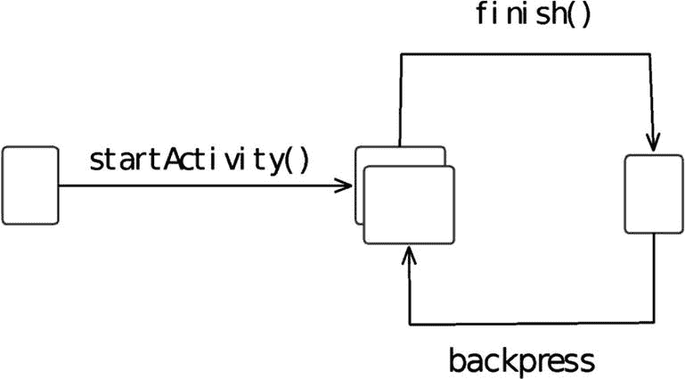

图 10-1

简单的 Activity 工作流程

*   实现简单；只需从任意 `Activity` 调用 `startActivity()` 方法即可。
*   可以通过编程方式调用 `finish()` 方法关闭当前正在运行的 `Activity`。用户也可以按返回键关闭 `Activity`。
*   返回栈完全由 Android 运行时管理；参见图 10-1。

但并非一切完美；`Activity` 导航也带来了一些负担。其缺点如下：

*   我们无法清晰了解返回栈中有哪些 `Activity` 类——因为我们不管理它；这里有一个特点既是优点也是缺点的例子。
*   每个屏幕都需要一个新的 `Activity`，这会消耗计算资源。
*   每个 `Activity` 都需要在 Android 清单文件中声明——不过当你使用向导创建 `Activity` 时，Android Studio 会自动为你完成，因此这不算大问题；在 Android Studio 出现之前确实是个问题。
*   你将难以使用更现代的导航模式，例如底部导航栏。

由于这些限制，出现了另一种屏幕导航方式。大约在 2011 年，谷歌发布 Android 4.0 时，我们有了 `Fragment` 类。我们在上一章刚刚讨论过 `Fragment` 类，所以我相信你对它还很熟悉；`Activity` 本质上是一个 UI 组合单元，而 `Fragment` 则是一个更小的组合单元。

`Fragment` 和 `Activity` 一样，由两部分组成——一个 Java 或 Kotlin 程序以及一个布局文件。其基本思想相同——在 XML 文件中定义 UI，然后在运行时加载该 XML 文件，这样 XML 文件中的所有 UI 就会变成实际的 Java 对象。

其核心思想是创建多个 fragment 并将它们包含在一个 `Activity` 中。通常，根据用户操作、设备方向或设备外形，你需要隐藏或显示某个 `Fragment`；这通常通过 `FragmentManager` 和 `FragmentTransaction` 对象来完成。示例 10-3 中的代码片段是典型的 fragment 管理代码。

```
FragmentManager fm = getFragmentManager();
FragmentTransaction ft = fm.beginTransaction();
Fragment fragment = new FirstFragment();
ft.add(R.id.fragment_container, fragment);
ft.commit();
示例 10-3
Fragment 代码片段
```

使用 `Fragment` 类时，我们确切知道导航栈中的内容，这与使用 `Activity` 导航不同；但是，如示例 10-3 所示，它可能变得笨拙，因为我们必须手动管理导航栈。

到目前为止，我们只有两种导航选择：要么使用基于 `Activity` 的导航，简单易用，但会带来一些性能开销且无法控制导航栈；要么使用 `Fragment` 类，它让我们完全控制导航栈，但 API 笨拙且容易出错。

时间快进到 2017 年，谷歌引入了导航组件（Navigation components）。现在我们可以使用 `Fragment` 类，而无需处理复杂 API 的负担。使用导航组件，我们在示例 10-3 中编写的所有代码现在都可以用一行代码替换（参见示例 10-4）。

```
findNavController().navigate(destination);
// 我们不再需要以下代码
/*
FragmentManager fm = getFragmentManager();
FragmentTransaction ft = fm.beginTransaction();
Fragment fragment = new FirstFragment();
ft.add(R.id.fragment_container, fragment);
ft.commit();
*/
示例 10-4
导航组件代码片段
```


## 导航组件

没错，上一节中那单行代码引用可能让你感到兴奋——也松了口气。但这不仅仅是减少敲击键盘次数的问题，关键在于现在我们能够兼顾基于 Activity 和基于 Fragment 的导航优势。现在，Fragment 导航也有了简洁易用的 API。

不过，我们首先要对导航组件有所了解。它是架构组件（Architecture Components）的一小部分，而架构组件又是名为 Android Jetpack 的更大体系中的一部分——这里我们不深入探讨 Jetpack 或架构组件，它们是庞大的主题，但简要的背景介绍并无坏处。

在 2017 年 Google I/O 大会上，Google 介绍了 Android 架构组件。这些库是名为 Android Jetpack 的庞大组件集合的一部分。与架构组件一同发布的还有 Foundation（基础）、Behavior（行为）和 UI（界面）等类别。

Jetpack 是一套 Android 软件组件，它能帮助我们遵循最佳实践，避免编写过多的样板代码。你可以在`androidx.*`包下的库中找到 Jetpack 的代码。

以下是 Jetpack 组件的简要说明：

**基础**

* **AppCompat**——让你编写的代码能向下兼容旧版 Android 系统
* **Android KTX**——如果你使用 Kotlin，可以编写更简洁、更地道的 Kotlin 代码
* **Multidex**——为使用多个 DEX 文件的应用程序提供支持
* **Test**——用于单元测试和运行时 UI 测试的测试框架

**行为**

* **下载管理器**——让你编写调度和管理大规模下载任务的程序
* **媒体与播放**——提供向后兼容的媒体播放与路由 API
* **通知**——提供向后兼容的通知 API，支持可穿戴设备和汽车场景
* **权限**——用于检查和请求应用权限的兼容性 API
* **偏好设置**——创建交互式设置界面
* **分享**——提供适合应用操作栏的分享操作
* **切片**——创建灵活的用户界面元素，用于在应用外部显示应用数据

**界面**

* **动画与过渡**——实现控件移动及屏幕间的过渡效果
* **汽车**——如果你开发在车辆信息娱乐系统上运行的应用，会用到它。这些组件能帮助你构建 Android Auto 应用
* **表情符号**——在旧版平台上启用最新的表情符号字体
* **Fragment**——所有 Fragment 相关代码已移至此处
* **布局**——使用不同算法进行控件布局
* **调色板**——从调色板中提取有用信息
* **电视**——帮助开发 Android TV 应用的组件
* **Google Wear OS**——如果你想开发手表等 Android 可穿戴设备应用，这就是你需要的

**架构**

* **数据绑定**——以声明方式将可观察数据绑定到 UI 元素
* **生命周期**——管理 Activity 和 Fragment 的生命周期
* **LiveData**——在底层数据库发生变化时通知视图
* **分页**——按需从数据源逐步加载信息；当用户滚动列表时，它能帮助你处理数据加载。它与 Recycler 视图配合使用
* **ViewModel**——以生命周期感知的方式管理 UI 相关数据
* **WorkManager**——管理后台任务
* **导航**——实现应用内的导航功能，在屏幕之间传递数据，并提供来自应用外部的深度链接
* **Room**——可视为 SQLite 数据库的对象关系映射（ORM）

Jetpack 值得探索的内容很多，请务必查阅相关文档。

回到我们的主题，导航组件简化了应用内各目标（destination）之间的导航实现。目标指的是应用中的任意位置，可以是 Activity、Activity 中的 Fragment 或自定义视图；这些目标通过导航图（navigation graph）进行管理。

导航图整合了所有目标，并定义了目标之间的不同连接关系，这些连接称为动作（action）。导航图本质上是一个 XML 资源文件，展示了应用的所有导航路径。你可以在应用中拥有多个导航图。


### 使用 Jetpack Navigation

为了更好地理解 Navigation 组件，最好能在一个小项目上实践。因此，请在 Android Studio 中创建一个新的空项目，如图 10-2 所示。

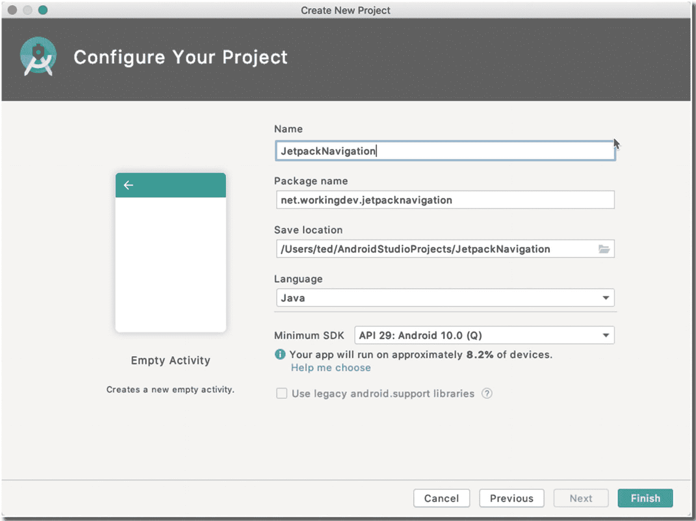

图 10-2

新建空项目

接下来，我们需要添加 Navigation 组件依赖项。你可以在模块级别的 `build.gradle` 文件中完成此操作（如图 10-3 所示）。请注意，有两个 `build.gradle` 文件，你需要选择标注了 (Module: app) 的那个。

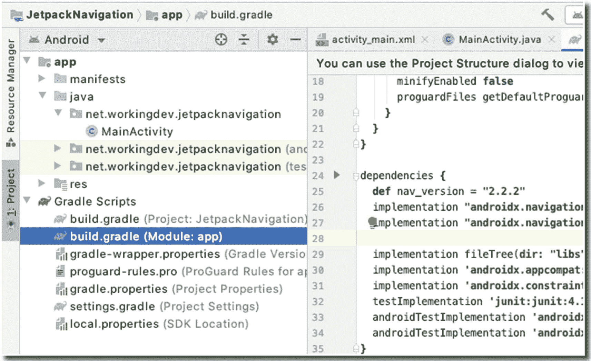

图 10-3

`build.gradle` 文件（模块级别）

编辑此文件，使其与代码清单 10-5 中的代码保持一致。

```
dependencies {
def nav_version = "2.2.2"
implementation "androidx.navigation:navigation-fragment:$nav_version"
implementation "androidx.navigation:navigation-ui:$nav_version"
implementation fileTree(dir: "libs", include: ["*.jar"])
implementation 'androidx.appcompat:appcompat:1.1.0'
implementation 'androidx.constraintlayout:constraintlayout:1.1.3'
testImplementation 'junit:junit:4.12'
androidTestImplementation 'androidx.test.ext:junit:1.1.1'
androidTestImplementation 'androidx.test.espresso:espresso-core:3.2.0'
}
```

代码清单 10-5

向 `build.gradle` 添加导航

在编写本书时，Navigation 组件的稳定版本是 `2.2.2`；此外还有一个测试版本 `2.3.0-beta01`。当你阅读本书时，版本可能已经更新。请务必查看官方 Android 开发者网站以获取最新信息： [`https://developer.android.com/jetpack/androidx/releases/navigation`](https://developer.android.com/jetpack/androidx/releases/navigation)。

接下来，让我们向项目添加导航图。你可以通过创建新的资源文件来创建导航图。右键单击项目的 `res` 文件夹，然后选择 **新建** ➤ **Android 资源文件**，如图 10-4 所示。

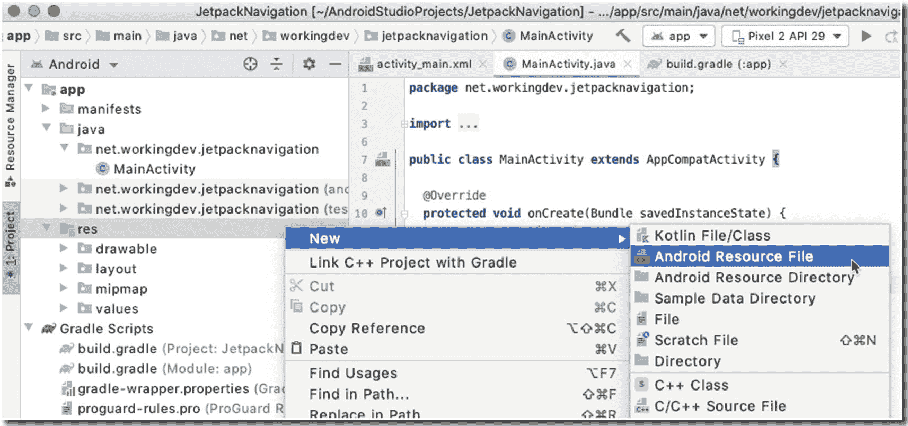

图 10-4

添加新资源文件

在“新建资源文件”对话框中，将资源类型更改为 *Navigation* 并提供文件名：

* **文件名** — `nav_graph`
* **资源类型** — *Navigation*（你必须点击下拉箭头进行选择）

在接下来的窗口中（如图 10-5 所示），点击“确定”。

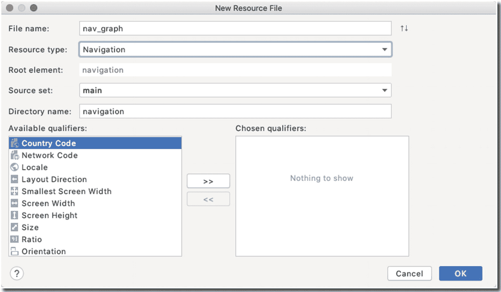

图 10-5

新建资源文件

资源创建完成后，你会看到在项目 `res` 文件夹下出现了一个新文件夹(`navigation`)和一个新文件(`nav_graph.xml`)，如图 10-6 所示。Android Studio 将在编辑器中打开新创建的导航图。图 10-6 显示了新创建的导航图——它当然是空的。

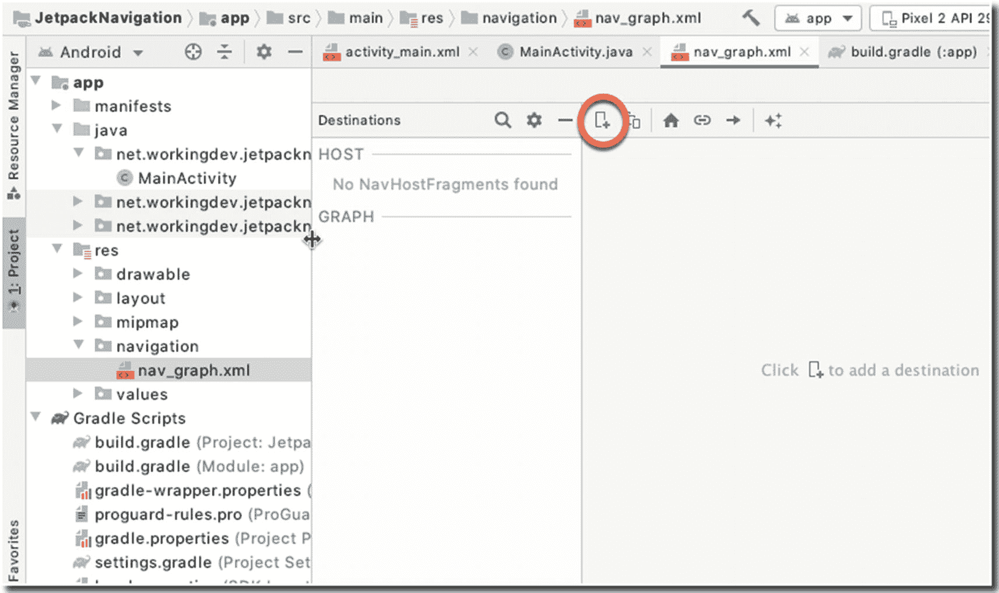

图 10-6

导航图

当你使用 Navigation 组件时，导航是通过目标之间的交互来完成的。目标是用户能够导航到的界面，而目标之间则通过*动作*进行连接。目前我们还没有任何目标，因此让我们添加一个。点击导航编辑器顶部面板上的加号，如图 10-7 所示，然后选择“创建新目标”。

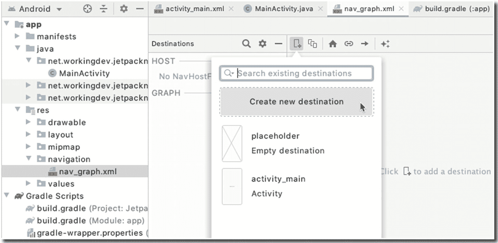

图 10-7

创建新目标


此操作将弹出用于创建新 Fragment 的对话框。在接下来显示的窗口中（图 10-8），选择一个空白 Fragment。

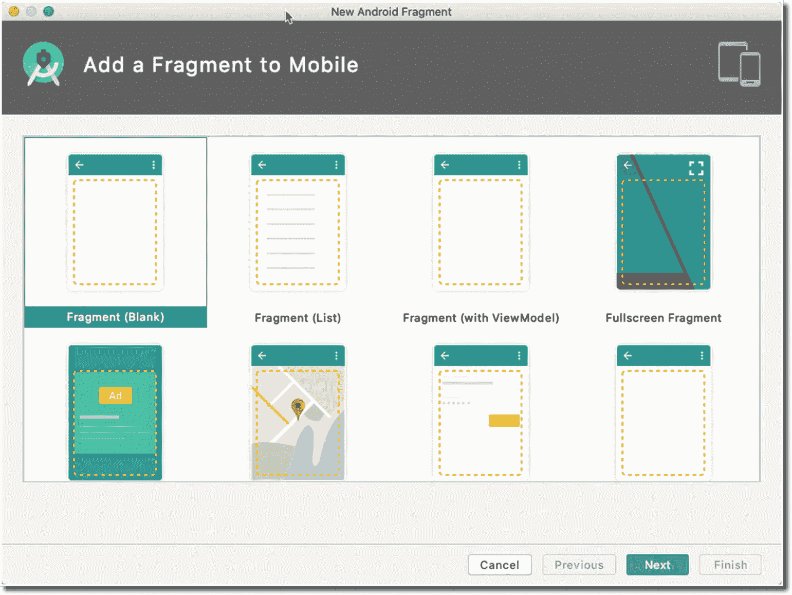

**图 10-8** 新建 Android Fragment

在接下来显示的窗口中，输入 Fragment 的名称和布局文件的名称，并选择源语言，如图 10-9 所示。

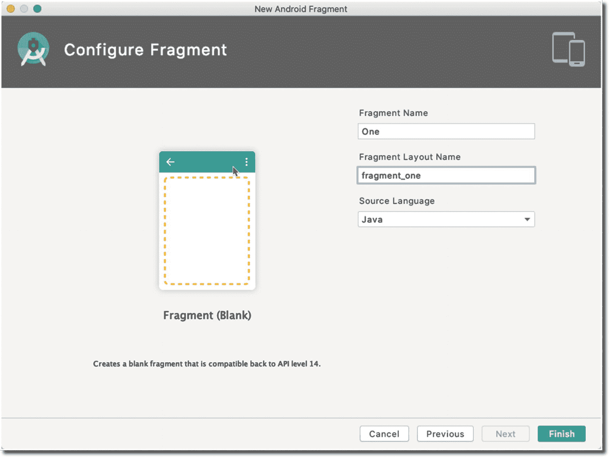

**图 10-9** 新建 Android Fragment，详细信息

*   **Fragment 名称** — `One`
*   **Fragment 布局名称** — `fragment_one`
*   将源语言保留为 **Java**

点击 **完成** 开始创建新的 Fragment；此 Fragment 将成为您应用中的一个目的地。创建另一个目的地，并将其 Fragment 名称设为 “Two”。此时，导航编辑器应如图 10-10 所示。

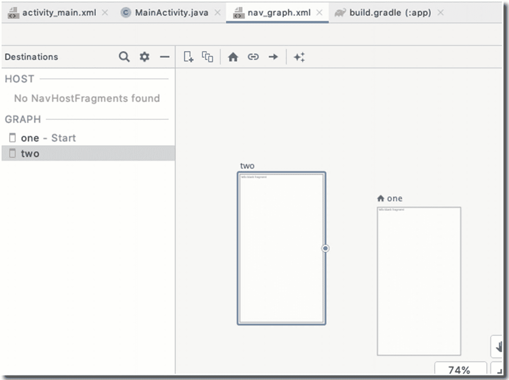

**图 10-10** 导航编辑器

另请注意，有两个新的 Java 类（`One.java` 和 `Two.java`）和两个新的布局文件（`fragment_one.xml` 和 `fragment_two.xml`）。这些文件是在我们创建目的地 `One` 和 `Two` 时生成的。请注意在图 10-10 中，fragment `one` 旁边有一个主页图标。这只是因为我们是第一个创建它的。主页目的地或起始目的地是用户将看到的第一个屏幕。您可以随时通过右键单击任何目的地，然后点击 “设为主页目的地” 来更改起始目的地；但现在，我们将保持 `one` 为起始目的地。

我们的导航图还没有 **NavHost**；它需要一个。NavHost 充当所有目的地的视口。它是一个空容器，当用户在应用中导航时，目的地可以在此容器中交换进出。NavHost 需要放在一个 Activity 中。我们将把 NavHost 放入我们的 `MainActivity`。

打开我们 `MainActivity` 的布局文件，它位于 `res/layout/activity_main.xml`，然后在文本模式下编辑。默认的 `activity_main` 包含一个 `TextView` 对象；将其删除，并替换为清单 10-6 中显示的代码片段。

| ❶ | 它需要一个 ID，就像资源文件中的任何其他元素一样。我这里选择了 `nav_container`。您可以命名任何您喜欢的名称。 |
| ❷ | 这是 `NavHostFragment` 类的完全限定名。它属于导航组件，负责使我们的 `MainActivity` 成为我们所有定义目的地的视口。 |
| ❸ | `app:navGraph` 属性告诉运行时我们想要在 `MainActivity` 中托管哪个导航图。请记住，您可以在应用中拥有多个导航图；`nav_graph` 是我们之前给导航图 XML 资源起的名字。 |
| ❹ | 当您将 `defaultNavHost` 设置为 `true` 时，这可确保 **NavHostFragment** 拦截系统返回按钮；这样，当用户点击返回按钮时，Android 将显示您应用中的上一个屏幕，而不是恰好在返回堆栈中的外部应用屏幕。 |

```
清单 10-6
在 activity_main.xml 中定义 NavHost
```

现在是时候连接我们的两个目的地了。再次打开导航图——它位于 `res/navigation/nav_graph`。

我们希望用户从目的地 `one` 导航到目的地 `two`。因此，将鼠标悬停到目的地一，直到其右侧出现一个小圆圈。单击并拖动此点到目的地二，以便两个目的地可以连接起来，如图 10-11 所示。

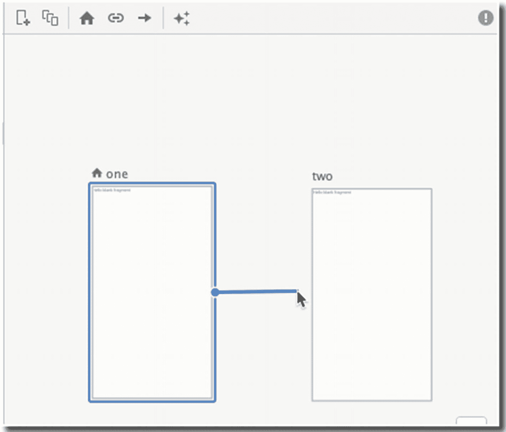

**图 10-11** 连接 one 和 two

目的地一现已连接到目的地二。如果您选择 `one` 和 `two` 之间的连接，您将看到它拥有可以设置的属性，如图 10-12 所示。我们不会处理这些属性；我们只想连接这两个目的地。

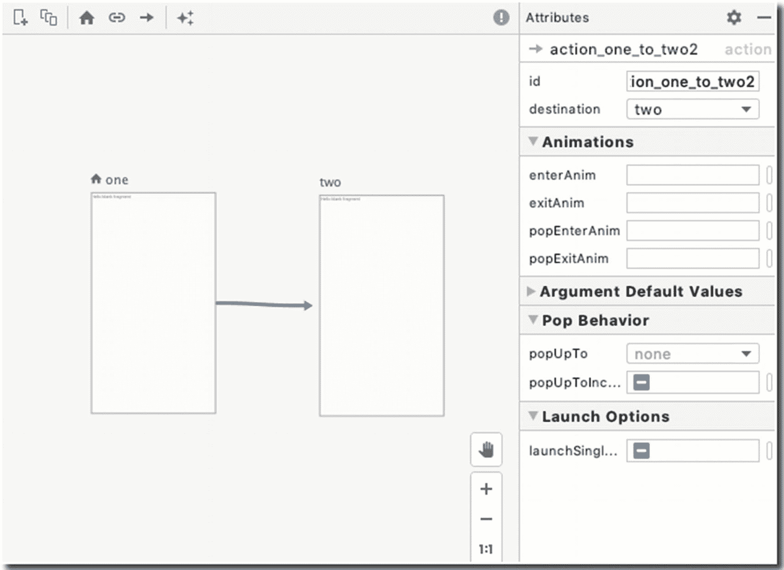

**图 10-12** 导航图

为了测试这个小应用，我需要在起始目的地中有一个能触发操作的对象，比如一个按钮（如图 10-13 所示）。我修改了两个 fragment 的布局，具体如下：

**Fragment One**

*   将布局改为 `ConstraintLayout`，只是因为使用这种布局更容易。请使用适合您的布局。
*   我删除了 `TextView`，并用一个按钮替换了它，并将其居中。

**Fragment Two**

*   像 `fragment_one` 一样，我也将布局改为 `ConstraintLayout`。
*   我更改了 `TextView` 的文本并将其居中。

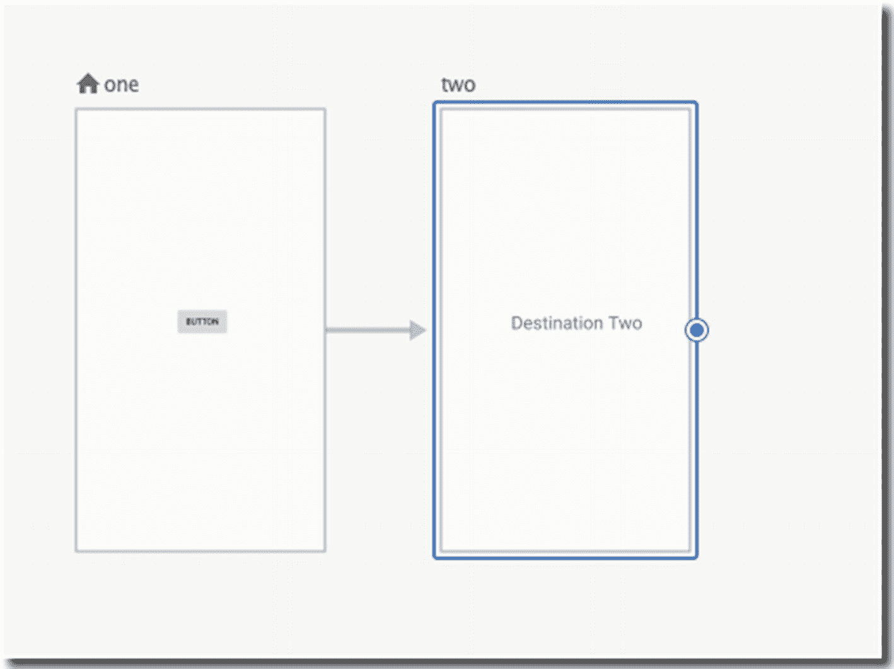

**图 10-13** 修改后的 Fragment

接下来，我们将为按钮添加一个点击处理器，然后添加代码，使得在点击按钮时，`fragment_one` 能够导航到 `fragment_two`。

导航到目的地是通过 **NavController** 实现的；它是一个在 NavHost 内管理应用导航的对象。每个 NavHost 都有自己对应的 NavController。

NavController 允许您通过两种方式导航到目的地：(1) 使用 ID 导航到目的地，这也是我们在这里将要使用的；以及 (2) 使用 URI 导航——我将留待您自行探索。

要为按钮添加点击处理器，请打开 `One.java`（其中包含我们 `One` 目的地的 Java 源文件），并修改其 `onCreateView()` 方法，使其与清单 10-7 匹配。

```java
@Override
public View onCreateView(LayoutInflater inflater, ViewGroup container,
Bundle savedInstanceState) {
// 为此 fragment 填充布局
final View view = inflater.inflate(R.layout.fragment_one, container, false);
Button btn = (Button) view.findViewById(R.id.button);
btn.setOnClickListener(new View.OnClickListener(){
@Override
public void onClick(View view) {
Navigation.findNavController(view).navigate(R.id.action_one_to_two2);
}
});
return view;
}
```
**清单 10-7** 类 `One.onCreateView()`

清单 10-7 中最重要的一行代码是 **NavController** 对象的 `navigate()` 方法。我们简单地将我们在导航图中创建的操作的 ID 作为参数传递给 `navigate()`，这就已经搞定了。您现在可以启动模拟器并测试该应用了。

本章仅仅触及了导航组件的表面；在这个领域还有很多东西有待发现，所以请务必去探索一下。


## 总结

-   你仍然可以在应用中使用基于 Activity 或 Fragment 的导航；只需记住它们的优缺点。
-   导航组件结合了基于 Activity 和基于 Fragment 的导航的最佳特性；API 易于使用，并且我们对返回栈有了更多控制。
-   导航组件引入了*目标（destination）* 的概念。*目标*可以是 Fragment、Activity 或自定义视图；它们是用户将要导航到的页面。
-   *目标*通过导航图进行分组；导航图是一个 XML 资源文件，其中包含了各目标之间的所有*动作（action）*。
-   *目标*之间通过*动作*相互连接。
-   导航的基本思路如下：
    1.  创建导航图。
    2.  创建目标。
    3.  连接各个目标；每次连接成为一个动作。
    4.  使用`NavController`对象以编程方式从一个目标导航到另一个目标。你可以通过 ID 或 URI 进行导航。

