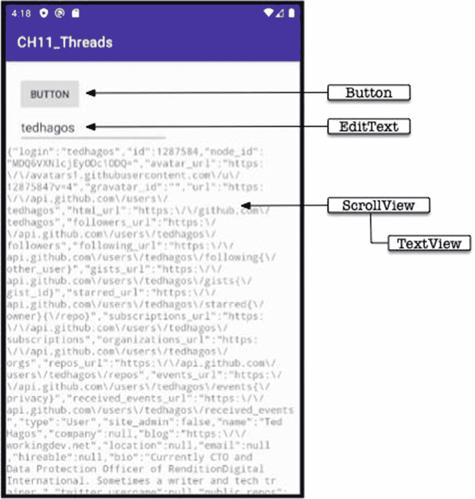

# 11. 在后台运行

*本章将涵盖：*

-   基本线程概念
-   UI 线程
-   如何创建和使用 Java 线程

知道如何在后台运行代码是每位开发者必备的基本技能。熟练运用线程可以提升应用的性能，用户对此非常满意。当前对应用性能的要求非常高。没有人愿意使用一个运行缓慢如糖浆的应用。如今，卡顿和颠簸的应用会很快被遗忘。

在本章中，我们将探索精彩的线程世界。

## 基本概念

当你启动一个应用时，系统会创建一个进程，并为它分配一些资源，例如内存等。同时，它还会获得一个线程。

通俗地说，线程是一个指令序列。它是执行你代码的东西。在应用运行期间，这个线程将使用该进程的资源。它可能会读写内存、磁盘，甚至有时会进行网络 I/O。当线程与所有这些交互时，它只是在等待。在等待期间，它无法利用 CPU 周期。我们不能让这些 CPU 周期白白浪费，对吧？我们可以创建其他线程，这样当一个或多个线程在等待某件事时，其他线程可以利用 CPU。这就是多线程应用的情况。

当 Android 运行时创建一个应用实例时，该进程会被赋予一个线程。它被称为主线程；有些开发者称其为 UI 线程，但我们只会得到这一个线程，没有更多。好消息是我们可以创建更多的线程。UI 线程可以创建其他线程。

## UI 线程

UI 线程，也称为主线程，负责启动主 Activity 并解析（XML）布局文件。解析布局文件意味着将所有 View 元素转换为实际的 Java 对象，例如 Button、TextView 等。简而言之，主线程负责显示 UI。当我们在`TextView`对象上调用`setText()`或`setHint()`等方法时，这些调用并不会立即执行；相反，流程如下：

1.  该调用被放入一个消息队列（`MessageQueue`）中。
2.  它将停留在那里，直到某个 Handler 将其取出执行。
3.  然后，它在主线程上执行。

主线程不仅用于显示 UI 元素，还用于应用中发生的所有其他事情。你可能还记得 Activity 有生命周期方法，例如`onCreate`、`onStop`、`onResume`、`onCreateOptionsMenu`、`onOptionsItemSelected`以及其他方法。每当代码在这些块中运行时，运行时无法处理队列中的任何消息。它处于*阻塞*状态；阻塞状态意味着主线程正在等待某件事完成，然后才能继续执行其任务——这对用户体验不好。

大多数情况下，我们调用的方法运行时间并不长。可以说，这些调用在计算资源方面是廉价的。所以，这通常不是什么大问题。当我们调用需要相当长时间才能完成的方法时，问题就来了。Android 开发团队的指导原则是，我们应该将调用限制在不超过 15 毫秒；如果超过这个时间，我们应该考虑在后台线程中运行这些代码。这一指导原则来自 Project Butter，它是在 Jelly Bean（Android 4.1）时期发布的；旨在提升 Android 应用的性能。当运行时检测到你在主线程上做了太多事情时，它就会开始丢弃帧。当你不进行耗时调用时，应用以非常流畅的每秒 60 帧运行。如果你占用了主线程，你会开始注意到性能变慢，因为帧率开始下降。在 Android 世界中，这被称为卡顿（jank）。在主线程上进行过多处理会导致 UI 渲染缓慢，从而导致丢帧或跳帧，进而导致应用出现明显的卡顿现象。应用变得卡顿。

> **注意**
> 在 Project Butter 之前，如果 UI 线程检测到你在 UI 线程上做得太多，例如打开一个大文件、创建一个网络 socket 或任何需要长时间的操作，运行时可能会向你显示 ANR（应用无响应）屏幕。如今很少见到 ANR 了，更多的是卡顿问题。

如果你想避免卡顿，你需要知道如何在后台运行耗时或与 I/O 相关的代码。

你不需要过度兴奋并开始在后台运行所有东西。要合理并运用你的判断。例如，以下调用不需要在后台线程中：

```
txt1.setText(String.format("%d", (2 * 2 * 2)));
```

它只是将一个`TextView`的文本属性设置为一个计算结果。这个计算并不复杂。

即使是列表 [11-1] 也不算耗时代码。它进行了一些基本的 GCF（最大公因数）计算，但使用了欧几里得算法来得到结果。这个算法运行高效。无论输入值有多大，循环次数都不会呈爆炸式增长；无论是求 12 和 15 的 GCF，还是 16,848,662 和 24 的 GCF，其时间复杂度变化不大。因此，将它放在主线程中是完全可行的。


`private void gcfCalculate(int firstNo, int secondNo) {
int rem, bigno, smallno = 1;
if (firstNo > secondNo) { bigno = firstNo; smallno = secondNo;}
else {bigno = secondNo; smallno = firstNo;}
while(!((rem = bigno  % smallno) == 0)) {
bigno = smallno;
smallno = rem;
}
String msg = String.format("GCF = %s", smallno);
Toast.makeText(this, msg, Toast.LENGTH_LONG).show();
}
清单 11-1
GCF 计算
`

`清单 11-2`，另一方面，则是一个昂贵的调用。它现在看起来有些牵强，但当你经常参加代码审查时，你会惊讶地发现这类代码实际上存在，并且可能比你想象的更常见——到时你就会明白我的意思。无论如何，你需要警惕这类代码，因为即使它没有网络或 I/O 调用，它也会占用 UI 线程来计算笛卡尔积——这是一种数学集合，是其他集合相乘的结果。结构类似的代码最好放在后台线程中执行。

```
private void nestedCall() {
for(int i = 1; i < 10000; i++) {
for(int j = 1; j < 10000; j++) {
for(int k = 1; k < 10000; k++) {
System.out.printf("%d", i * j * k);
}
}
}
}
清单 11-2
嵌套调用
```

另一个需要在后台运行的代码示例是`清单 11-3`。它使用互联网从 GitHub 获取信息。

```
private String fetch(String gitHubId) {
String userInfo = "";
String url = String.format("https://api.github.com/users/%s", gitHubId);
OkHttpClient client = new OkHttpClient();
Request request = new Request.Builder()
.url(url)
.build();
try(Response response = client.newCall(request).execute()) {
userInfo = response.body().string();
}
catch(IOException ioe) {
Log.e(TAG, ioe.getMessage());
}
return userInfo;
}
清单 11-3
获取 GitHub 信息
```

如果你尝试在 UI 线程上运行此代码，Android 运行时将会抛出`NetworkonMainThreadException`。任何使用网络连接的代码都不能在 UI 线程中运行。

当遇到以下情况时：（1）需要通过网络获取或写入数据；（2）需要通过文件 I/O 获取或写入数据；（3）执行资源密集型操作（如`清单 11-2`所示），你需要将该代码放在后台线程中运行。有几种方法可以实现这一点，请参见下面的列表：

*   **Java 线程**，来自 Java
*   **AsyncTask**，属于 Android 框架的一部分
*   **Handler 和 Message**，也属于 Android 框架的一部分

无论使用哪种技术，原理都是一样的，即：

1.  在执行长时间运行或消耗资源的任务时，生成一个后台线程。
2.  如果在后台线程中需要执行 UI 线程上的操作（例如设置 View 的属性），则在处理 View 元素之前，必须找到一种方法回到 UI 线程。

在所有后台运行代码的方法中，`Thread`对 Java 程序员来说最为熟悉，但它也是最基础的。

## 线程与可运行对象

我们可以通过生成新线程来在后台运行语句。`Thread`对象可以通过扩展`java.lang.Thread`类或实现`Runnable`接口来创建。`Thread`对象描述单个执行线程，该执行发生在`Thread`类的`run()`方法中。

扩展`Thread`类是创建线程对象最简单的方式。`清单 11-4`展示了`Thread`类的典型结构。

```
class Worker extends Thread {
public void run() {
// 你想在后台运行的内容
}
}
清单 11-4
Worker 类
```

`Worker`类简单地扩展了`java.lang.Thread`。你需要重写线程的`run()`方法，并将所有希望在后台运行的语句放入其中。之后，只需实例化`Worker`并运行它，如`清单 11-5`所示。

| ❶ | 创建一个 `Thread` 类的实例。 |
| ❷ | 调用 `start()` 方法。如果忘记这一步，线程将不会运行。调用 `start()` 方法可以启动线程。 |

```
Worker worker = new Worker(); ❶
worker.start(); ❷
清单 11-5
如何创建并运行一个线程
```

另一种创建线程的方式是实现`Runnable`接口，如`清单 11-6`所示。

```
class Worker implements Runnable {
@Override
public void run() {
// 你想在后台运行的内容
}
}
清单 11-6
Worker 类实现了 Runnable 接口
```

如你所见，这与之前的示例没有太大区别；我们没有扩展`Thread`，而是简单地实现了`Runnable`接口。你仍然需要重写`run()`方法，并将希望在后台运行的语句放入`run()`方法中。区别不在于`Worker`类的结构，而在于`Worker`类的实例化和运行方式，如`清单 11-7`所示。

| ❶ | 创建一个 `Worker` 的实例。 |
| ❷ | 通过将一个 `Runnable` 类（`Worker` 实例）的实例传递给 `Thread` 的构造函数来创建一个 `Thread` 类的实例。 |
| ❸ | 现在我们可以通过调用 `start()` 方法来启动线程。 |

```
Worker worker = new Worker(); ❶
Thread thread = new Thread(worker); ❷
thread.start(); ❸
清单 11-7
如何使用 Runnable 对象
```

现在我们对如何使用`Thread`有了概念性的了解，让我们用它从 GitHub 获取用户信息。`清单 11-8`展示了如何使用`OkHttpClient`调用 GitHub API 的步骤。

| ❶ | 我们希望将 GitHub `userid` 作为参数。 |
| ❷ | 我们来构造一个包含 GitHub `userid` 的字符串 URL。 |
| ❸ | 我们将使用来自 Square 公司的 `OkHttpClient`。`OkHttpClient` 是一个开源项目，旨在成为高效的 HTTP 客户端。它支持 SPDY 协议。SPDY 是 HTTP 2.0 的基础，允许通过一个套接字连接复用多个 HTTP 请求；你可以在 [`https://en.wikipedia.org/wiki/SPDY`](https://en.wikipedia.org/wiki/SPDY) 了解更多关于 SPDY 的信息。从 Android 5.0 开始，`OkHttpClient` 成为 Android 平台的一部分，并被用于所有 HTTP 调用。此示例取自 `OkHttpClient` 的网页 [`https://square.github.io/okhttp/`](https://square.github.io/okhttp/)。 |
| ❹ | 我们使用 `try with resources` 代码块，这样我们就不必担心后续清理工作；当 `try 代码块` 超出作用域时，我们在该块内打开的所有资源将自动关闭。 |
| ❺ | 如果之前的所有设置都顺利，我们就可以从 GitHub API 获取响应。 |


```java
private String fetchUserInfo(String gitHubId) {
  String userInfo = "";
  String url = String.format("https://api.github.com/users/%s", gitHubId);
  Log.d(TAG, String.format("URL: %s", url));
  OkHttpClient client = new OkHttpClient();
  Request request = new Request.Builder()
      .url(url)
      .build();
  try(Response response = client.newCall(request).execute()) {
    userInfo = response.body().string();
  }
  catch(IOException ioe) {
    Log.e(TAG, ioe.getMessage());
  }
  return userInfo;
}
```
清单 11-8：`fetchUserInfo()`

我们需要在后台线程中运行`fetchUserInfo()`方法，以触发`NetworkOnMainThreadException`错误。接下来创建一个小型演示项目来实现这一目的。创建一个包含空白 Activity 的项目，并构建一个包含以下元素的简单 UI：

- `EditText`——用于输入 GitHub 用户 ID。
- `Button`——用于触发用户操作。
- `TextView`——用于显示从 GitHub 获取的结果。
- `ScrollView`——包裹`TextView`，实现多行显示和可滚动效果。

图 11-1 展示了应用的布局。


图 11-1：应用布局

打开`activity_main.xml`进行编辑，并将其修改为与清单 11-9 一致。

```
Listing 11-9
activity_main.xml
```

接下来处理清单文件。在调用 GitHub API 时需要访问互联网，因此需要在`AndroidManifest`文件中声明该权限。在清单中插入`INTERNET`使用权限，如清单 11-10 所示。

```
...
Listing 11-10
AndroidManifest.xml
```

然后处理 Gradle 文件。我们需要在应用模块的 Gradle 文件中进行两处修改：首先添加`OkHttpClient`的依赖项，其次添加启用 View binding 的配置。

本示例并非必须使用 View binding，但这是介绍能简化编程生活的新特性的好方法。View binding 允许我们编写与视图交互的代码。在模块中启用 View binding 后，它会为该模块中的每个 XML 布局文件生成一个绑定类（`binding` class）。绑定类的实例包含对对应布局中所有具有 ID 的视图的直接引用。在大多数情况下，View binding 会取代`findViewByID`。编辑模块的 Gradle 文件，修改为与清单 11-11 一致。

- ❶ 插入此代码块以启用 View binding。将`viewBinding`设置为`true`即为该模块启用 View binding。
- ❷ 插入此依赖项以便使用`OkHttpClient`。

```
apply plugin: 'com.android.application'
android {
    buildFeatures {
        viewBinding = true  ❶
    }
    compileSdkVersion 29
    defaultConfig {
        ...
    }
    buildTypes {
        release {
            ...
        }
    }
}
dependencies {
    implementation 'com.squareup.okhttp3:okhttp:4.7.2'  ❷
    ...
}
```
清单 11-11：`build.gradle` (Module:app)

编辑完成后需要同步 Gradle 文件。

从 Android Studio 3.6 开始，您已经可以用 View binding 取代`findViewById`调用；当为模块启用 View binding 时，它会为该模块中的每个 XML 布局文件生成一个绑定类。每个绑定类包含对根视图和所有具有 ID 的视图的引用。绑定类的名称通过将 XML 文件名转换为驼峰式并在末尾添加"Binding"生成——例如，我们的项目中只有`activity_main.xml`，因此会生成一个名为`ActivityMainBinding`的类。

清单 11-12 展示了`MainActivity`类中使用 View binding 的注释说明。

- ❶ 将`TextView`声明为成员变量，因为我们稍后会在`onCreate()`方法之外使用它。
- ❷ 调用`inflate()`方法（静态调用），为`MainActivity`创建绑定类的实例。
- ❸ 通过调用`getRoot()`获取根视图的引用。
- ❹ 不再传递布局文件名（`activity_main`），而是传递根视图。
- ❺ 获取`TextView`对象的引用，这里将用于显示 GitHub API 调用的结果。
- ❻ 为`Button`设置点击监听器。
- ❼ 获取`EditText`的内容。
- ❽ 实例化`Thread`对象并启动它。我们尚未定义`Thread`对象，稍后将进行定义。清单 11-13 展示了在`MainActivity`中作为内部类实现的`RunBackground`类。

```
import androidx.appcompat.app.AppCompatActivity;
import okhttp3.OkHttpClient;
import okhttp3.Request;
import okhttp3.Response;
import android.os.Bundle;
import android.util.Log;
import android.view.View;
import android.widget.TextView;
import net.workingdev.ch11_threads.databinding.ActivityMainBinding;
import org.json.JSONException;
import org.json.JSONObject;
import java.io.IOException;

public class MainActivity extends AppCompatActivity {
    private final String TAG = getClass().getName();
    private TextView txtUserInfo;  ❶

    @Override
    protected void onCreate(Bundle savedInstanceState) {
        super.onCreate(savedInstanceState);
        final ActivityMainBinding binding = ActivityMainBinding.inflate(getLayoutInflater());  ❷
        View view = binding.getRoot();  ❸
        setContentView(view);  ❹

        txtUserInfo = binding.textView;  ❺

        binding.button.setOnClickListener(new View.OnClickListener() {  ❻
            @Override
            public void onClick(View view) {
                Log.d(TAG, "Click");
                String username = binding.txtName.getText().toString();  ❼
                new RunBackground(username).start();  ❽
            }
        });
    }
}
```
清单 11-12：`MainActivity`

- ❶ 我们继承`Thread`类，以便在后台运行。这里也将其实现为内部类，以便访问外部类（`MainActivity`）的成员。
- ❷ 将 GitHub 用户名作为该类构造函数的参数。
- ❸ 重写`run()`方法。该方法内的所有内容都将在后台运行。
- ❹ 调用`fetchUserInfo()`方法。
- ❺ GitHub API 将以字符串形式返回结果。如果需要将返回的对象作为 JSON 处理，则需要使用`JSONObject`，如上所示。这样，如果想提取`userInfo`的特定部分，可以调用类似`userInfo.getString("id")`的方法。
- ❻ 在后台线程中时，不能对任何 UI 元素进行调用，例如若要设置`TextView`或`EditText`的文本，将无法实现。要在后台线程运行时修改 UI 元素，必须回到 UI 线程；方法是调用`runOnUiThread()`方法。`runOnUiThread()`方法接受一个`Thread`对象作为参数；重写该`Thread`对象的`run()`方法，并在其中编写修改 UI 的代码（如上所示）。
- ❼ 现在我们可以将 GitHub 调用的结果写入`TextView`。


```java
public class MainActivity extends AppCompatActivity {
    private final String TAG = getClass().getName();
    private TextView txtUserInfo;
    @Override
    protected void onCreate(Bundle savedInstanceState) {
        super.onCreate(savedInstanceState);
        ...
    }
    class RunBackground extends Thread { ❶
        String userName;
        RunBackground(String userName) { ❷
            this.userName = userName;
        }
        public void run() {  ❸
            String userInfo = fetchUserInfo(userName); ❹
            Log.d(TAG, userInfo);
            Log.d(TAG,"Run in thread");
            try {
                final JSONObject jsonreader = new JSONObject(userInfo); ❺
                Log.d(TAG, jsonreader.toString());
                runOnUiThread(new Thread() { ❻
                    public void run() {
                        Log.d(TAG, "runOnUiThread");
                        txtUserInfo.setText(jsonreader.toString()); ❼
                    }
                });
            }
            catch(JSONException e) {
                Log.e(TAG, e.getMessage());
            }
        }
    }
    private String fetchUserInfo(String gitHubId) {
        ...
    }
}
```

清单 11-13 `RunBackground` 内部类

现在，在模拟器或真实设备上运行该应用，并尝试获取你自己的 GitHub 信息。

## 本章小结

*   当你试图在主线程上执行过多任务时，运行时可能会开始掉帧，从而导致卡顿。
*   UI 线程负责创建 UI 元素等任务。不要给这个线程过重负担。如果需要执行一些耗时或消耗资源的任务，应创建一个后台线程并在其中执行该任务。

