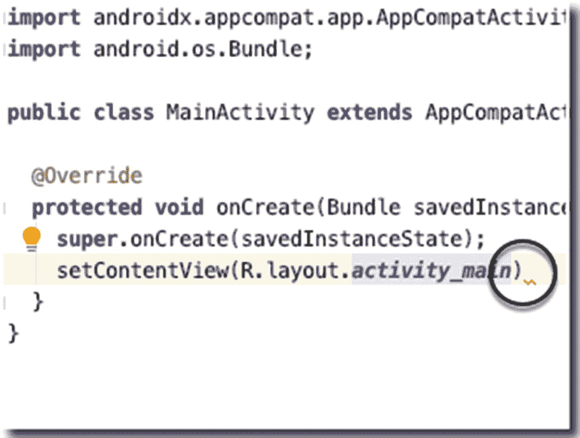
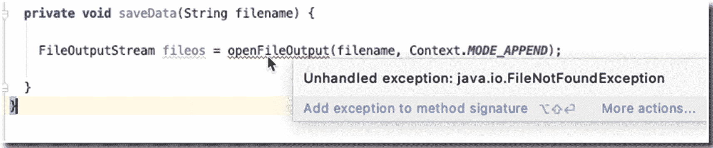
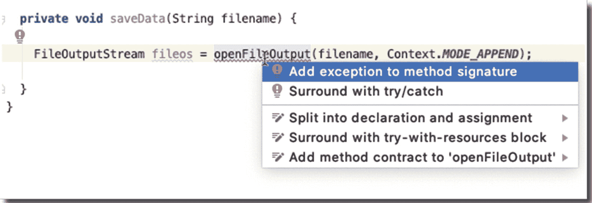
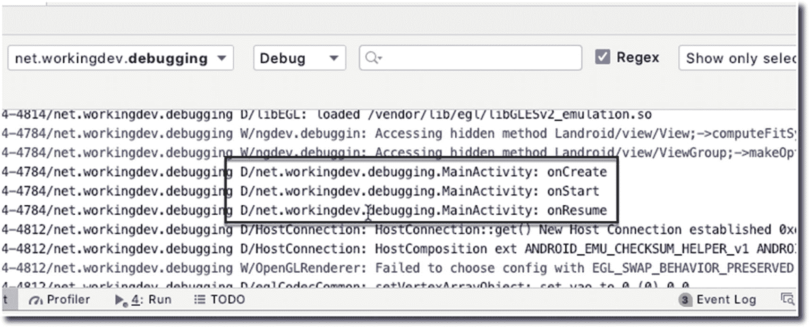
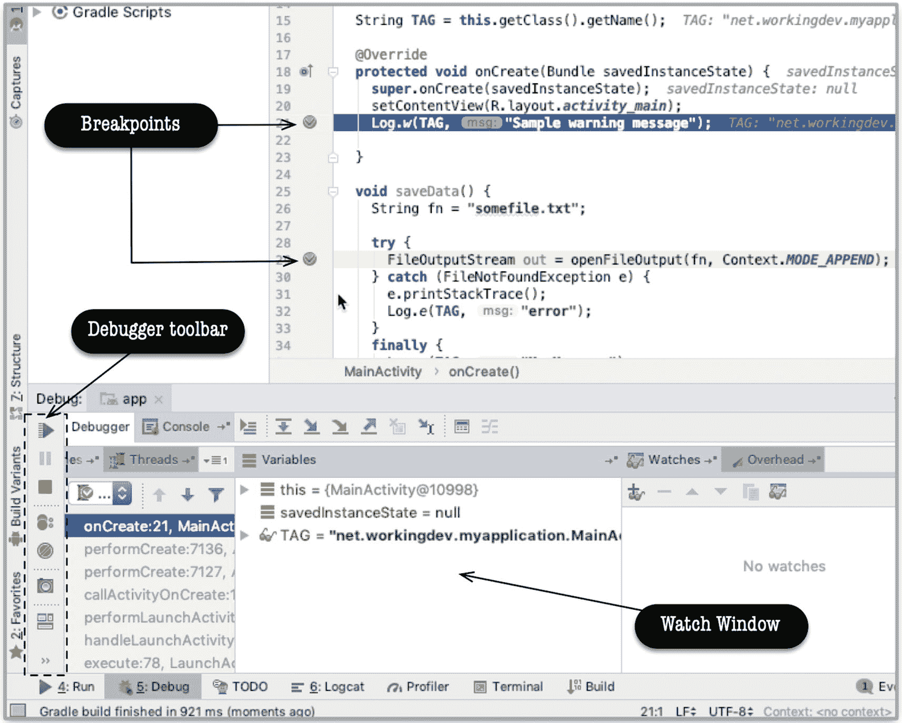
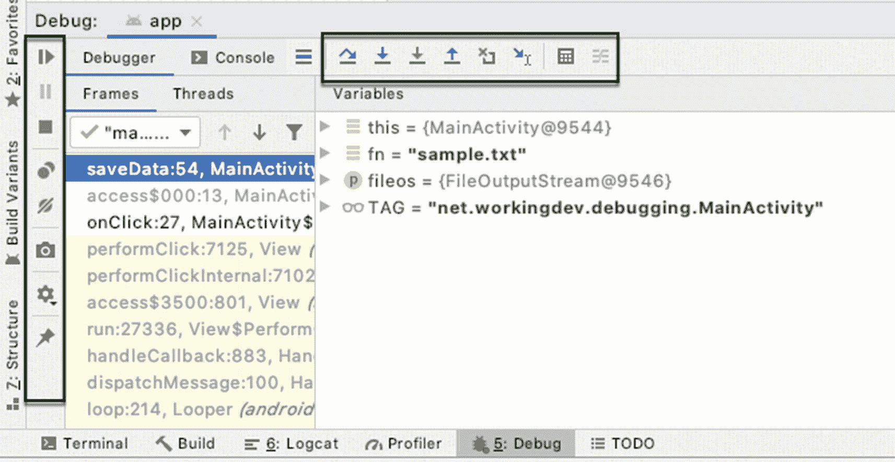

# 12. 调试

*本章涵盖内容：*

*   你将遇到的错误类型
*   记录调试语句
*   使用调试器

除了最简单的程序外，几乎所有程序都存在错误。处理错误将是你作为开发者日常工作中的重要部分。本章将讨论你过去遇到过、并且在可预见的未来仍会面对的各种错误类型。我们还将探讨如何利用 Android Studio 来简化处理这些错误的难度。

## 错误类型

编程中最常见的三种错误是：

*   语法错误
*   运行时错误
*   逻辑错误

## 语法错误

语法错误正如其名，是语法上的错误。之所以发生这种错误，是因为你在代码中编写了 Java 编译器规则集不允许的内容。编译器无法理解它。这种错误可能简单到忘记闭合括号或缺少一对花括号，也可能很复杂，例如向函数传递错误类型的参数，或在使用泛型时传递了错误的参数化类。

你可以轻松地在 Android Studio 中发现语法错误。当你在主编辑器中看到红色波浪线时（如图 12-1 所示）。



**图 12-1** 主编辑器显示的错误指示符

这意味着代码在语法上存在错误。Android Studio 会将红色波浪线放置在非常接近错误代码的位置。如果将鼠标悬停在红色波浪线上，大多数情况下，Android Studio 都能以很高的准确度告诉你代码出了什么问题。更重要的是，你可以使用一种被恰当地命名为“快速修复”的技术来快速修复这类错误。

要进行快速修复，请将光标置于红色波浪线内的任意位置，然后按 **Alt + Enter**（如果你使用的是 Windows 或 Linux）或 **Option + Enter**（如果你使用的是 macOS），IDE 会处理其余操作；如果有多种修复错误的方法，IDE 会显示一些选项供你选择。

## 运行时错误

运行时错误发生在你的代码遇到意料之外的情况时。顾名思义，这种错误只会在程序运行时发生。在编译期间你不会看到这类错误。

Java 有两种类型的异常：*受检异常* 和 *非受检异常*。Android Studio 为受检异常提供了大量帮助。图 12-2 显示了当你尝试调用一个会抛出受检异常的方法时，主编辑器中的显示情况；然而，对于非受检异常，你仍需自行处理。



**图 12-2** IDE 提醒你需要处理该异常

解决图 12-2 所示错误有两种方法：我们可以将 `openFileOutput()` 方法调用包裹在 *try-catch* 结构中，或者向方法签名中添加一个异常，如图 12-3 所示。



**图 12-3** 快速修复

清单 12-1 展示了如何通过向方法签名添加 `throws` 子句来处理 `FileNotFoundException`。

```java
import java.io.FileNotFoundException;
...
void saveData() throws FileNotFoundException {
    String fn = "somefile.txt";
    FileOutputStream out = openFileOutput(fn, Context.MODE_APPEND);
}
```

清单 12-1 在 `saveData()` 中抛出 `FileNotFoundException`

清单 12-2 展示了使用 *try-catch* 块处理相同异常的代码。

```java
void saveData() {
    String fn = "somefile.txt";
    try {
        FileOutputStream out = openFileOutput(fn, Context.MODE_APPEND);
    } catch (FileNotFoundException e) {
        e.printStackTrace();
    }
    finally {
        ...
    }
}
```

清单 12-2 使用 `try-catch` 处理异常

当我想在本地处理异常时，即在与可能抛出异常的同一代码块中处理，我会使用 *try-catch*。大多数情况下，唯一能做的事情是：(1) 记录错误日志，(2) 尽可能尝试从错误中恢复，并让用户重试。

另一方面，使用 `throws` 子句意味着你不想在本地代码块中处理错误；你希望调用方法来处理这个错误。如果调用方法也在其签名中使用了 `throws` 子句，那么错误处理将会沿着调用栈向上传递。


## 逻辑错误

逻辑错误是最难发现的。顾名思义，它是你逻辑上出现的错误。当你的代码没有按照你预期的方式执行时，那就是逻辑错误。应对逻辑错误的方法有很多种，但在本节中，我们将介绍两种方法——在代码的特定位置打印调试语句，以及使用调试器单步执行代码。

在检查代码时，你会发现有些区域你很清楚发生了什么，而有些区域则不那么确定——你可以将调试语句放置在这些区域。这就像留下面包屑供你追踪。打印调试语句有几种方法。你可以使用 `println`、`Log` 或 `Logger` 类。

当你将 Logcat 的模式设置为详细、信息或调试时，你将看到 Android 运行时生成的所有消息。如果你希望能够过滤消息，例如仅查看警告或错误，则需要使用 `Log` 或 `Logger` 类。

`Log` 类有五个静态方法；用法如下所示：

```
Log.v(TAG, message) // 详细
Log.d(TAG, message) // 调试
Log.i(TAG, message) // 信息
Log.w(TAG, message) // 警告
Log.e(TAG, message) // 错误
```

在每种情况下，`TAG` 都是一个字符串字面量或变量，通常是调用 `Log` 的类的名称。`message` 也是一个字符串字面量或变量，包含你实际希望在日志中看到的内容。清单 12-3 展示了代码中 `Log` 类的典型用法。

```
import androidx.appcompat.app.AppCompatActivity;
import android.content.Context;
import android.os.Bundle;
import android.util.Log;
import java.io.FileOutputStream;
import java.io.IOException;
public class MainActivity extends AppCompatActivity {
private final String TAG = getClass().getName();
@Override
protected void onCreate(Bundle savedInstanceState) {
super.onCreate(savedInstanceState);
setContentView(R.layout.activity_main);
Log.d(TAG, "onCreate");
}
@Override
protected void onStart() {
super.onStart();
Log.d(TAG, "onStart");
}
@Override
protected void onResume() {
super.onResume();
Log.d(TAG, "onResume");
}
private void saveData(String fn) throws IOException {
try (FileOutputStream fileos = openFileOutput(fn, Context.MODE_APPEND)) {
Log.d(TAG, "Doing something with the file");
}
catch(IOException ioe) {
Log.e(TAG, ioe.getMessage());
// 你可以在此处重新抛出异常
// 或进行一些恢复操作
}
}
}
清单 12-3
Log 类的典型用法
```

当应用运行时，你可以看到 `Logcat` 窗口中的日志消息，如图 12-4 所示。你可以通过单击 IDE 底部菜单栏中的 Logcat 选项卡，或从主菜单栏中选择 **视图** ➤ **工具窗口** ➤ **Logcat** 来打开 Logcat 窗口。



图 12-4

Logcat 工具窗口

## 调试器

Android Studio 包含一个交互式调试器，允许你在代码运行时遍历并单步执行代码。借助交互式调试器，你可以在代码的特定位置和特定时间点检查应用程序的快照——例如变量的值、正在运行的线程等。代码中的这些特定位置被称为*断点*；你可以自行选择这些断点。

要设置断点，选择包含可执行语句的行，然后单击其行号（位于行号栏中）。当你设置断点时，行号栏中会出现一个粉色圆形图标，并且整行会以粉色高亮显示——如图 12-5 所示。



图 12-5

调试器窗口

设置好断点后，你需要在调试模式下运行应用。如果应用正在运行，请先停止它，然后从主菜单栏中点击 **运行** ➤ **调试应用**。

注意

在调试模式下运行应用并不是调试应用的唯一方法。你也可以将调试器进程附加到当前正在运行的应用程序上。在某些情况下，第二种技术会很有用；例如，当你试图解决的错误发生在非常特定的条件下时，你可能希望先运行应用一段时间，当你认为接近错误点时，再附加调试器。

像往常一样使用应用程序。当执行到达你设置了断点的行时，该行会从粉色变为蓝色。这就是你知道代码执行已到达你的断点的方式。此时，调试器窗口打开，执行暂停，Android Studio 进入交互式调试模式。此时，应用程序的状态会显示在 `调试工具窗口` 中。在此期间，你可以检查变量的值，甚至查看应用中正在运行的线程。

你甚至可以通过单击带有眼镜图标的加号向监视窗口添加变量或表达式。将出现一个文本字段，你可以在其中输入任何有效的表达式。当你按下 **回车键** 时，Android Studio 将计算该表达式并显示结果。要移除监视表达式，请选中该表达式，然后单击监视窗口上的减号图标。

### 单步执行

与大多数调试器一样，Android Studio 允许你逐行单步执行程序。当调试器在断点处停止时，你可以在几个工具之间进行选择。你通常需要知道如何执行以下操作：

*   **恢复程序** — 恢复执行，直到到达下一个断点。如果没有更多断点，程序将像正常执行一样运行。
*   **步入** — 如果下一行有方法调用，此操作将跳转到该方法，并在第一行暂停。
*   **单步跳过** — 执行下一行上发生的任何操作，然后跳转到下一行。
*   **步出** — 执行当前方法的剩余部分，然后在方法之后的下一个语句处暂停。它本质上是从方法中跳出来。

你可以从主菜单栏的 `运行` 菜单下找到这些操作。你也可以从调试器工具栏（如图 12-6 所示）中找到它们。



图 12-6

调试器工具栏

最后，你可以通过键盘快捷键使用单步执行操作，如表 12-1 所示。

表 12-1

调试器键盘快捷键

|  | Windows/Linux | macOS |
| --- | --- | --- |
| 调试 | `Shift + F9` | `Ctrl + D` |
| 恢复程序 | `F9` | `Command + Option + R` |
| 步入 | `F7` | `F7` |
| 单步跳过 | `F8` | `F8` |
| 步出 | `Shift + F8` | `Shift + F8` |

你可以从 Android 开发者网站了解更多的键盘快捷键（不仅仅是用于调试）：[`https://developer.android.com/studio/intro/keyboard-shortcuts`](https://developer.android.com/studio/intro/keyboard-shortcuts)。

## 总结

*   你可能遇到的三种错误类型是编译类型错误（也称为语法错误）、运行时错误和逻辑错误。
*   语法错误最容易修复；Android Studio 本身提供了极大的便利，让你能够快速发现语法错误。使用 AS3 有多种修复语法错误的方法，但大多数情况下，`快速修复` 功能就能解决问题。
*   你可以通过设置断点并使用单步执行操作来逐行遍历代码。


