# 13. 测试

*我们将涵盖：*

* 测试类型
* 单元测试
* 测试基础
* 关于插桩测试
* 如何创建 UI 测试交互
* 基本的测试交互
* 实现测试验证
* 测试录制

在前面的章节中，我们完成了一些编程工作。接下来，我们将学习一些测试概念和技术。开发生命周期会经历一个测试阶段，以发现代码中的所有错误和不一致之处。一个完善的应用程序不应存在粗糙的边角。我们需要测试它、调试它，并确保它不会占用过多的计算资源。

## 测试类型

**功能测试**。功能测试是测试应用程序的标准方法。之所以称为*功能性*测试，是因为我们测试的是应用程序的功能（也称为功能特性），这些功能在需求规格说明书中被指定——需求说明书是你在应用程序规划阶段或业务分析师编写的。需求说明书通常会记录在文档中（通常称为功能需求规格说明书）。功能规格说明书中可能包含的示例如：“用户必须在进入应用前登录服务器”、“用户必须提供有效的电子邮件进行注册”等等。执行这些测试的测试人员，通常被称为 QA 或 QC（分别是质量保证和质量控制的缩写）。他们会创建测试资产、制定测试策略、执行测试，并最终报告执行结果。失败的测试通常会被指派回开发者（你）进行修复并重新提交。我这里描述的是拥有独立或专门测试团队的开发团队的典型做法；如果你是单人团队，那么 QA 很可能也是你。测试是一项完全不同的技能，我强烈建议你寻求其他人的帮助，最好是有测试经验的人。

**性能测试**。从名称上你可能就能猜到这类测试是做什么的。它将应用程序推向极限，观察其在压力下的表现。这里你想要看到的是应用在承受超常规条件时的响应情况。**浸泡测试或耐力测试**是一种性能测试；通常，你会让应用程序长时间运行，并在各种操作模式下运行，例如，让应用在暂停状态或标题画面长时间停留。你试图找出应用在这些条件下的响应方式，以及它如何利用系统资源，如内存、CPU、网络带宽等；你将使用 *Android Profiler* 等工具来进行这些测量。

另一种形式的性能测试是**容量测试**；如果你的应用使用了数据库，你可能想知道当数据加载到数据库时它如何响应。你检查的是系统在不同数据负载下的反应。

**尖峰测试**或可扩展性测试也是性能测试的另一种形式。如果应用依赖于中央服务器，该测试通常会提高连接到中央服务器的用户（设备端点）数量。你需要观察用户数量的激增如何影响用户体验——应用是否仍然响应迅速？对每秒帧数是否有影响？是否存在延迟？等等。

**兼容性测试**是检查应用在不同设备和硬件/软件配置下的表现。在这种情况下，AVD（Android 虚拟设备）会派上用场；因为 AVD 只是软件模拟器，你无需购买不同的设备。尽可能使用 AVD。有些应用在模拟器上难以可靠测试；当遇到这种情况时，你必须花钱购买测试设备。

**合规性或一致性测试**。如果你正在构建一款游戏应用，这是你根据 Google Play 关于应用或游戏的指南检查游戏的地方；请务必阅读 Google Play 的开发者政策中心，网址为 [`https://bit.ly/developerpolicycenter`](https://bit.ly/developerpolicycenter)。确保你同时也熟悉 PEGI（泛欧洲游戏信息组织）和 ESRB（娱乐软件分级委员会）。如果游戏应用包含与特定分级不符的不良内容，需要识别并报告。违规可能导致被拒，从而造成代价高昂的返工和重新提交。如果你正在收集用户数据，你可能需要审计应用以检查其是否符合适用的数据隐私法规。

**本地化测试**至关重要，特别是对于面向全球市场的应用。应用的标题、内容和文本需要翻译成支持的语言并进行测试。

**恢复测试**。这是将边界情况测试提升到另一个层次。在这里，强制应用失败，你观察应用在失败过程中的表现以及失败后如何恢复。它应该能让你了解是否编写了足够的 `try-catch-finally` 块。应用应优雅地失败，而不是突然崩溃。只要可能，运行时错误应由 `try-catch` 块保护；当异常发生时，尝试写入日志并保存应用状态。

**渗透测试或安全测试**。这类测试试图发现应用的弱点。它模拟潜在攻击者会采取的活动，以绕过应用的所有安全功能；例如，如果应用使用数据库存储数据，尤其是用户数据，渗透测试人员（从事渗透测试的专业人员）可能会在运行 Wireshark 的同时使用该应用——Wireshark 是一种检查数据包的工具；它是一个网络协议分析器。如果你以明文形式存储密码，它将在这些测试中显现出来。

**声音测试**。如果你的应用使用声音，检查加载文件时是否有错误；同时，听一下声音文件是否有爆裂声等。

**开发者测试**。这是你（程序员）在向应用添加一层又一层代码时所进行的测试。这包括编写测试代码（同样使用 Java）来测试你的实际程序。这被称为单元测试。Android 开发者通常执行 JVM 测试和插桩测试；我们将在后续章节中更详细地讨论单元测试。

## 单元测试

单元测试是由开发者（而非 QA 或 QC）执行的功能测试。单元测试很简单；它测试的是某个方法可能执行或产生的特定行为。一个应用通常会有许多单元测试，因为每个测试都是一组非常狭窄定义的行为。因此，你需要大量测试来覆盖完整的功能。Android 开发者通常使用 JUnit 来编写单元测试。

JUnit 是由 Kent Beck 和 Erich Gamma 编写的回归测试框架。你可能还记得他们，除了其他成就外，前者是极限编程的创始人，后者是“四人帮”（GoF，设计模式）的成员之一。

Java 开发者长期以来一直使用 JUnit 进行单元测试。Android Studio 内置了 JUnit，并且与其集成得非常好。我们无需在设置方面做太多工作。只需要编写我们的测试即可。


### JVM 测试 vs. 插桩测试

如果你查看任何 Android 应用程序，你会发现它由两部分组成：基于 Java 的部分和基于 Android 的部分。

Java 部分是我们编写业务逻辑、计算和数据转换的地方。Android 部分是我们与 Android 平台交互的地方。在这里，我们获取用户输入或向用户显示结果。将基于 Java 的行为与 Android 部分分开测试是很有意义的，因为前者的执行速度要快得多。幸运的是，Android Studio 已经采用了这种方式。当你创建项目时，Android Studio 会创建两个独立的文件夹，一个用于 JVM 测试，另一个用于插桩测试。图 13-1 展示了 Android 视图中的两个测试文件夹，而图 13-2 展示了项目视图中的相同两个文件夹。

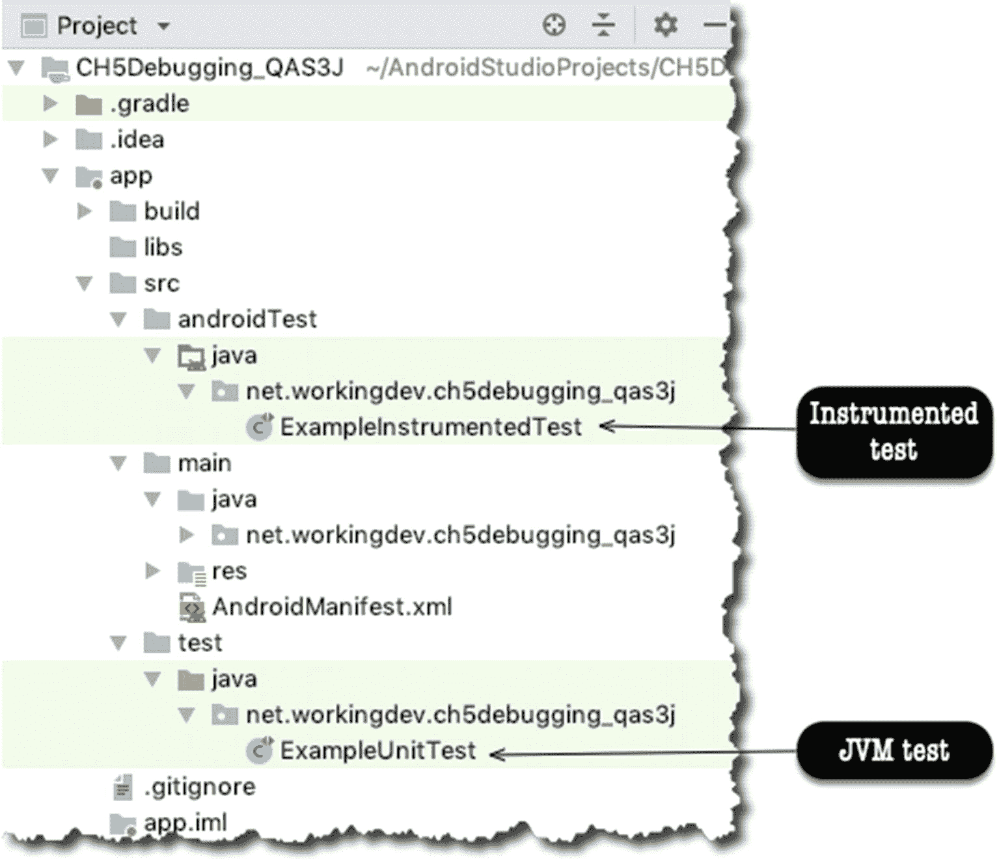

图 13-2
项目视图中的 JVM 测试和插桩测试

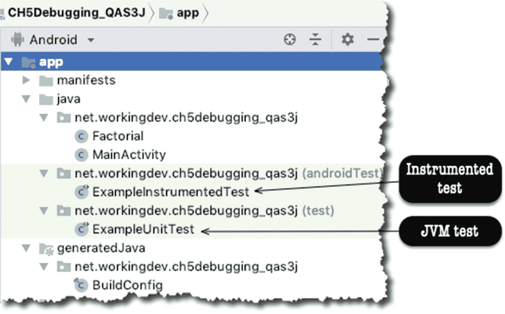

图 13-1
Android 视图中的 JVM 测试和插桩测试

从图 13-1 或图 13-2 中可以看到，Android Studio 更进一步地为 JVM 测试和插桩测试生成了示例测试文件。这些示例文件仅作为快速参考；它们向我们展示了单元测试可能的样子。

### 简单示例

为了深入探索，创建一个包含空白 Activity 的项目。向项目添加一个 Java 类，并将其命名为 `Factorial.java`；编辑此类以匹配代码清单 13-1。

```java
public class Factorial {
public static double factorial(int arg) {
if (arg == 0) {
return 1.0;
}
else {
return arg + factorial(arg - 1);
}
}
}
代码清单 13-1
Factorial.java
```

确保 `Factorial.java` 在主编辑器中打开，如图 13-3 所示；然后，从主菜单栏转到 **Navigate** ➤ **Test**。同样，你也可以使用键盘快捷键（macOS 为 **Shift + Command + T**，Linux 和 Windows 为 **Ctrl + Shift + T**）创建测试。

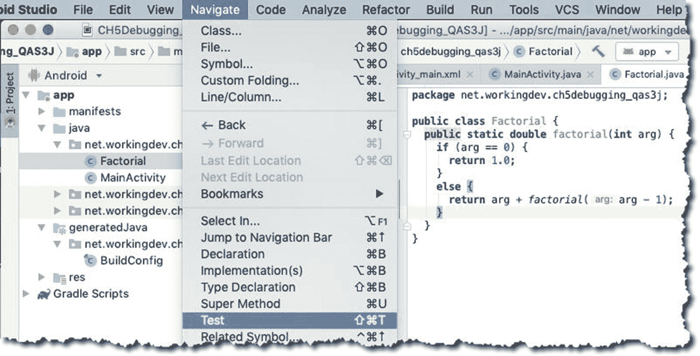

图 13-3
为 `Factorial.java` 创建测试

点击 **Test** 后，会立即弹出一个对话框（图 13-4），提示你点击另一个链接——点击 **Create New Test**，如图 13-4 所示。

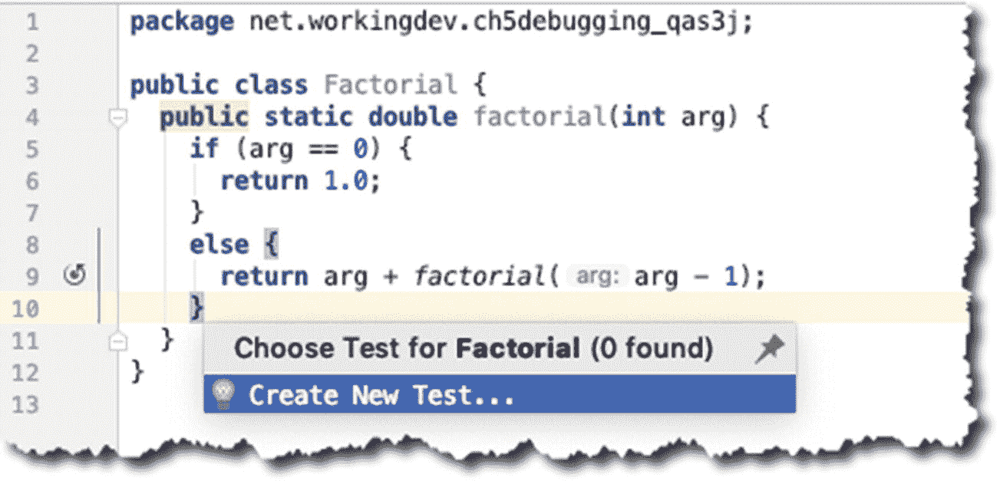

图 13-4
创建新测试弹出窗口

创建新测试后，你会立即看到另一个弹出对话框。

在接下来的窗口（如图 13-5 所示）中，创建新测试。

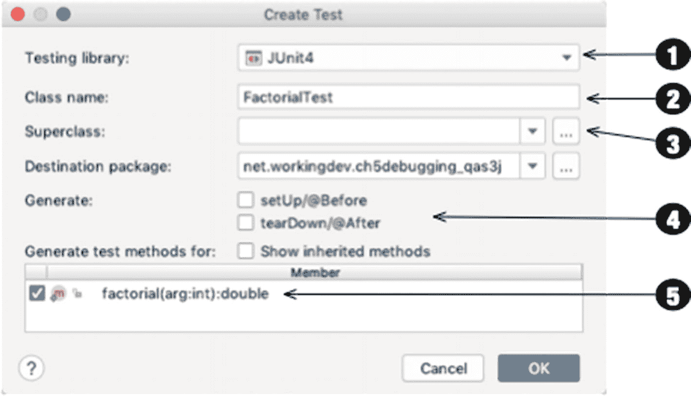

图 13-5
创建 `FactorialTest`

| ❶ | 你可以选择要使用的测试库。你可以选择 JUnit 3、4 或 5。你甚至可以选择 Groovy JUnit、Spock 或 TestNG。我使用 JUnit4，因为它随 Android Studio 一起安装。 |
| ❷ | 测试类的命名约定是“待测试类的名称” + “Test”。Android Studio 使用此约定自动填充此字段。 |
| ❸ | 此项留空；我们不需要继承任何类。 |
| ❹ | 我们目前不需要 `setUp()` 和 `tearDown()` 例程，将它们保持未选中状态。 |
| ❺ | 让我们勾选 `factorial()` 方法，因为我们想为此方法生成一个测试。 |

当你点击 **OK** 按钮时，Android Studio 会询问你想将测试文件保存在哪里。这是一个 JVM 测试，因此我们希望将其保存在“test”文件夹中（而不是 `androidTest` 文件夹）。见图 13-6。点击“OK”。

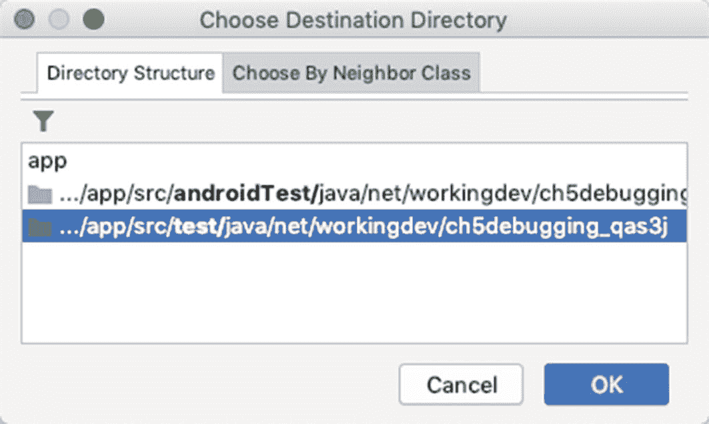

图 13-6
选择目标目录

现在，Android Studio 将为我们创建测试文件。如果你打开 `FactorialTest.java`，你将看到生成的骨架代码——如图 13-7 所示。

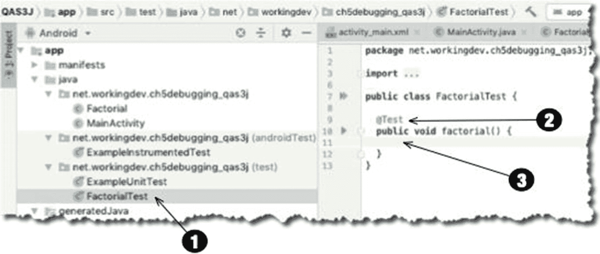

图 13-7
项目视图和主编辑器中的 `FactorialTest.java`

| ❶ | 文件 `Factorial.java` 创建在 `test` 文件夹下。 |
| ❷ | 创建了一个 `factorial()` 方法，并使用 `@Test` 进行了注解。这样 JUnit 就能知道此方法是一个单元测试。你可以为方法名添加“test”前缀，例如 `testFactorial()`，但这并非必需；`@Test` 注解就足够了。 |
| ❸ | 这是放置断言的地方。 |

看，这多简单？在 Android Studio 中创建测试用例并不涉及太多的设置和配置。我们现在需要做的只是编写测试。


### 执行测试

JUnit 提供了多个静态方法，供我们在测试中验证代码的行为。我们使用断言来展示预期结果，也就是我们的**控制数据**。该数据通常是独立计算得出的，且已知为真或正确——这便是将其用作控制数据的原因。当断言返回预期数据时，测试通过；否则测试失败。表 13-1 展示了你可能需要的常用断言方法。

**表 13-1** 常用断言方法

| 方法 | 描述 |
| --- | --- |
| `assertEquals()` | 如果两个对象或基本类型值相等，则返回 true |
| `assertNotEquals()` | `assertEquals()` 的反向操作 |
| `assertSame()` | 如果两个引用指向同一个对象，则返回 true |
| `assertNotSame()` | `assertSame()` 的反向操作 |
| `assertTrue()` | 测试布尔表达式，判断其是否为 true |
| `assertFalse()` | `assertTrue()` 的反向操作 |
| `assertNull()` | 测试对象是否为 null |
| `assertNotNull()` | `assertNull()` 的反向操作 |

现在我们已经了解了几种断言方法，可以开始编写测试了。清单 13-2 展示了 `FactorialTest.java` 的代码。

```java
import org.junit.Test;
import static org.junit.Assert.*;
public class FactorialTest {
@Test
public void factorial() {
assertEquals(1.0, Factorial.factorial(1),0.0);
assertEquals(120.0, Factorial.factorial(5), 0.0);
}
}
```

**清单 13-2** `FactorialTest.java`

我们的 `FactorialTest` 类只有一个方法，因为这仅用于演示。可以肯定的是，实际项目中的代码会有更多方法。

请注意，每个测试（方法）都带有 `@Test` 注解。JUnit 正是通过它来识别 `factorial()` 是一个测试用例。同时注意，`assertEquals()` 是 `Assert` 类的一个方法，但我们这里没有使用全限定名，因为我们已经对 `Assert` 进行了静态导入——这无疑让代码编写更简便。

`assertEquals()` 方法接受三个参数；如图 13-8 所示。

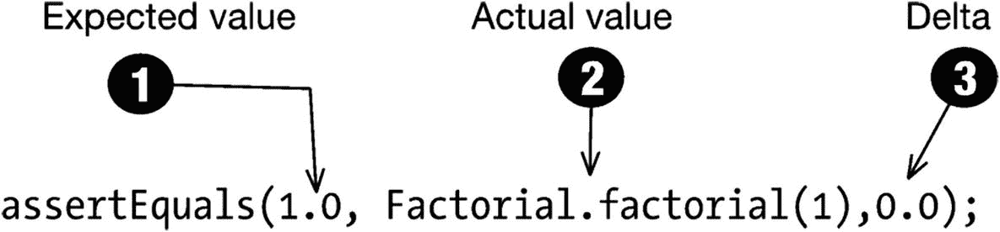

**图 13-8** `assertEquals` 方法

| ❶ | **期望值**是你的控制数据；这通常在测试中是硬编码的。 |
| ❷ | **实际值**是你的方法返回的值。如果期望值与实际值相同，`assertEquals()` 通过——你的代码行为符合预期。 |
| ❸ | **Delta** 旨在反映 *实际值* 和 *期望值* 可以有多接近仍被视为相等。有些开发者称此参数为“模糊”因子。当期望值与实际值之间的差异大于“模糊因子”时，`assertEquals()` 将失败。我这里使用了 0.0，因为我不允许任何偏差。你可以使用其他值，如 0.001、0.002 等；这取决于你的使用场景以及你的应用能够容忍的模糊程度。 |

至此，我们的代码就完成了。如果你愿意，可以在代码中再插入几个断言，以便更好地掌握要领。

在这个示例代码中，我省略了一些内容。我没有重写 `setUp()` 和 `tearDown()` 方法，因为我不需要。你通常会用 `setUp()` 方法来设置数据库连接、网络连接等。使用 `tearDown()` 方法来关闭你在 `setUp()` 中打开的所有资源。

现在，我们准备运行测试。

### 运行单元测试

你可以运行类中的单个测试，也可以运行所有测试。主编辑器左侧的绿色小箭头是可以点击的。点击类名旁边的小箭头，将运行该类中的所有测试。点击测试方法名旁边的小箭头，则只运行该测试用例。见图 13-9。

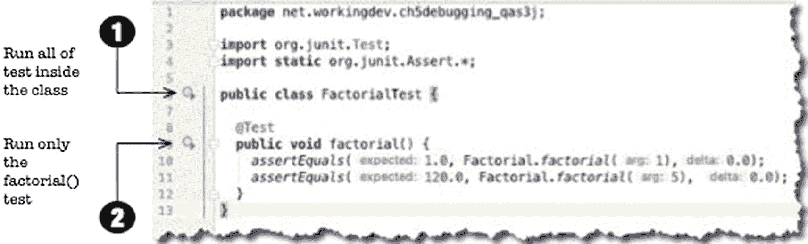

**图 13-9** 主编辑器中的 `FactorialTest.java`

类似地，你也可以通过主菜单栏运行测试，选择 **Run** ➤ **Run**。

图 13-10 显示了测试执行的结果。

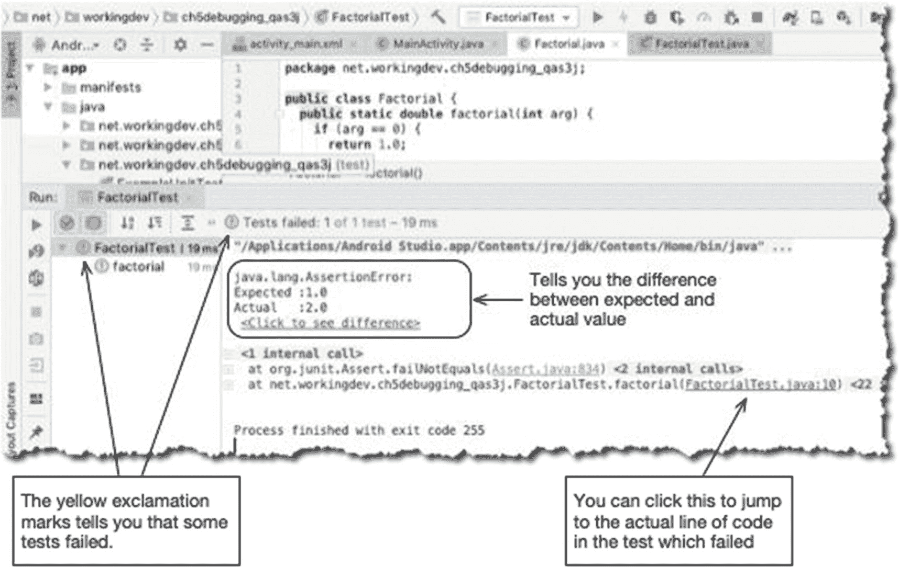

**图 13-10** 运行 `FactorialTest.java` 的结果

Android Studio 提供了丰富的提示，帮助你判断测试是通过还是失败。首次运行告诉我们 `Factorial.java` 存在问题；`assertEquals()` 失败了。

> **提示：** 当测试失败时，最好使用调试器来检查代码。`FactorialTest.java` 与我们项目中的其他类并无不同；它只是另一个 Java 文件；我们可以对其进行调试。在测试代码的战略位置设置一些断点，然后不“运行”它，而是运行“调试器”，以便能够逐步执行。

我们的测试失败，因为 1 的阶乘不是 2，而是 1。如果你仔细查看 `Factorial.java`，会发现阶乘值的计算不正确。

编辑 `Factorial.java` 文件，然后将这一行

```java
return arg + factorial(arg - 1);
```

改为这一行

```java
return arg * factorial(arg - 1);
```

如果我们重新运行测试，将会看到成功的结果，如图 13-11 所示。

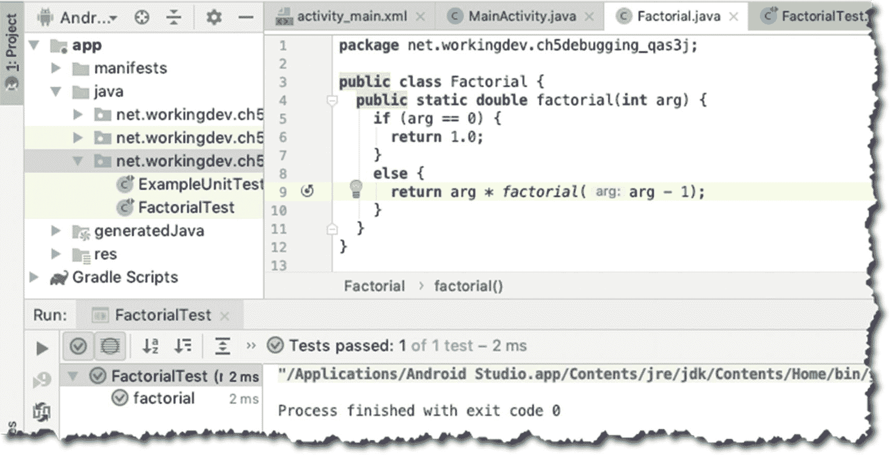

**图 13-11** 测试成功

现在，我们看到的不再是黄色的感叹号，而是绿色的对勾。不再是“测试失败”，而是“测试通过”。现在我们知道代码按预期工作了。

## 仪器化测试

与 Android 平台交互的单元测试称为仪器化测试；我们将使用 Espresso 框架来进行此类测试。

`Espresso` 是一个 Android 测试框架，旨在简化编写可靠且简洁的用户界面测试。Google 于 2013 年发布了 `Espresso` 框架。自 2.0 版本发布以来，`Espresso` 已成为 Android 支持仓库的一部分。

`Espresso` 会自动将你的测试操作与应用程序的用户界面同步。该框架还会确保你的 Activity 在测试运行之前启动。它还允许测试等待，直到所有观察到的后台活动完成。

使用 `Espresso` 测试的一般步骤如下：

* **匹配**——使用匹配器定位特定组件，例如按钮或 TextView。`ViewMatcher` 允许你在视图层次结构中查找 `View` 对象。
* **执行**——使用 `ViewAction` 对象对目标 `View` 对象执行操作，例如点击。
* **断言**——对 `View` 的状态进行断言。

假设我们有一个包含 `Button` 和 `TextView` 的简单屏幕。当我们点击 `Button` 时，会在 `TextView` 上写入文本“Hello World”。我们可以编写测试，如清单 13-3 所示。

| ❶ | 使用 `ViewMatcher` 查找 `View` 对象。我们正在寻找一个 id 为 `button` 的 `View`。请记住，当你使用 `onView()` 时，Espresso 会等到所有同步条件都满足后，才会执行相应的 UI 操作。 |
| ❷ | 找到它后，使用 `ViewAction` 对其执行操作；在本例中，我们想要点击它。 |
| ❸ | 再次使用 `ViewMatcher` 查找 `View` 对象；这次，我们试图找到一个 id 为 `textview` 的 `TextView`。 |
| ❹ | 找到它后，我们想检查其文本属性是否匹配“Hello World”。 |

```java
@Test
public void sampleTest() {
onView(withId(R.id.button))   ❶
.perform(Click());       ❷
onView(withId(R.id.textview)) ❸
.check(matches(withText("Hello World"))); ❹
}
```

**清单 13-3** `sampleTest`


### 搭建一个简单的测试

我们来搭建一个简单的项目，其中包含一个空的 `Activity`。清单 13-4 展示了 XML 布局代码，清单 13-5 展示了 `MainActivity` 代码。

```
清单 13-4
activity_main.xml
```

如你所见，布局代码相当简单；它包含一个 `TextView` 和两个 `Buttons`。当用户点击这两个 `Buttons` 中的任意一个时，都会调用 `MainActivity` 中的 `onClick()` 方法。

```
public class MainActivity extends AppCompatActivity {
    TextView txtview;
    @Override
    protected void onCreate(Bundle savedInstanceState) {
        super.onCreate(savedInstanceState);
        setContentView(R.layout.activity_main);
        txtview = (TextView) findViewById(R.id.textView);
    }
    public void onClick(View view) {
        switch(view.getId()) {
            case R.id.btnhello:
                txtview.setText("hello");
                break;
            case R.id.btnworld:
                txtview.setText("world");
                break;
        }
    }
}
清单 13-5
MainActivity
```

`MainActivity` 中的 `onClick()` 方法会尝试获取被点击的 `Button` 的 id，并据此路由程序逻辑。如果点击了 `btnhello`，我们就将 `TextView` 的文本内容设置为“hello”；如果点击了 `btnworld`，则将其内容设置为“world”——这足够简单。为了验证这一行为，我们可以建立一个仪器化测试。

在上一章中，我们在 `src/test` 下编写测试类，因为那些是 JVM 测试。接下来，我们将在 `src/androidTest` 下编写测试类；这将是一个仪器化测试。清单 13-6 展示了我们的仪器化测试类的代码。

- ❶ 你需要静态导入 Espresso 的匹配器（matchers）、动作（actions）和断言（`asserts`），这样之后在代码中就无需使用完整限定名。
- ❷ 这行代码会拦截我们的测试方法调用，并确保在执行任何测试之前 `Activity` 已被启动。
- ❸ 你需要使用 `@Test` 注解每个测试方法。
- ❹ 使用 `withId()` 方法找到 `btnhello` 对象。
- ❺ 然后我们使用 `ViewAction.click()` 模拟一次点击。
- ❻ 接着，我们再次使用 `withId()` 方法找到 `TextView`。
- ❼ 最后，我们断言 `TextView` 包含文本“hello”。

```
import android.support.test.rule.ActivityTestRule;
import android.support.test.runner.AndroidJUnit4;
import org.junit.Rule;
import org.junit.Test;
import static android.support.test.espresso.Espresso.onView;  ❶
import static android.support.test.espresso.action.ViewActions.click;
import static android.support.test.espresso.assertion.ViewAssertions.matches;
import static android.support.test.espresso.matcher.ViewMatchers.withId;
import static android.support.test.espresso.matcher.ViewMatchers.withText;
public class MainActivityTest {
    @Rule ❷
    public ActivityTestRule mActivityTestRule = new ActivityTestRule(MainActivity.class);
    @Test ❸
    public void buttonHelloTest() {
        onView(withId(R.id.btnhello)) ❹
        .perform(click());        ❺
        onView(withId(R.id.textView)) ❻
        .check(matches(withText("hello"))); ❼
    }
    @Test
    public void buttonWorldTest() {
        onView(withId(R.id.btnworld))
        .perform(click());
        onView(withId(R.id.textView))
        .check(matches(withText("world")));
    }
}
清单 13-6
MainActivityTest
```

你可以像运行 JVM 测试一样运行这个仪器化测试。你可以：

- 点击 IDE 侧边栏的箭头。
- 右键点击测试并使用上下文菜单，然后选择“Run MainActivityTest”。
- 前往主菜单栏，选择 `Run` ➤ `Run`，然后选择 `MainActivityTest`。

### 录制 Espresso 测试

Android Studio 包含一项功能，你可以运行你的应用、记录交互，并利用录制内容创建 Espresso 测试。前往主菜单栏，然后选择 `Run` ➤ `Record Espresso Test`，如图 13-12 所示。

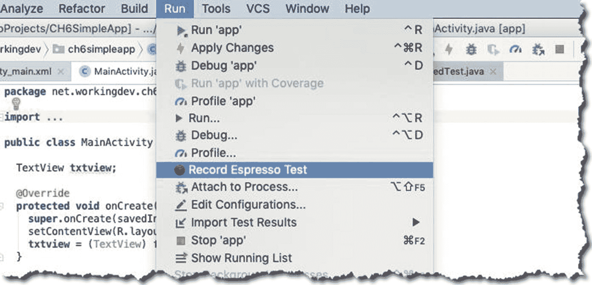

*图 13-12: 录制 Espresso 测试*

选择“Record Espresso Test”后，你现在可以像往常一样与应用交互，但这次交互会被记录下来。如果你点击其中一个按钮，比如“HELLO”按钮，测试录制器屏幕就会弹出，如图 13-13 所示。

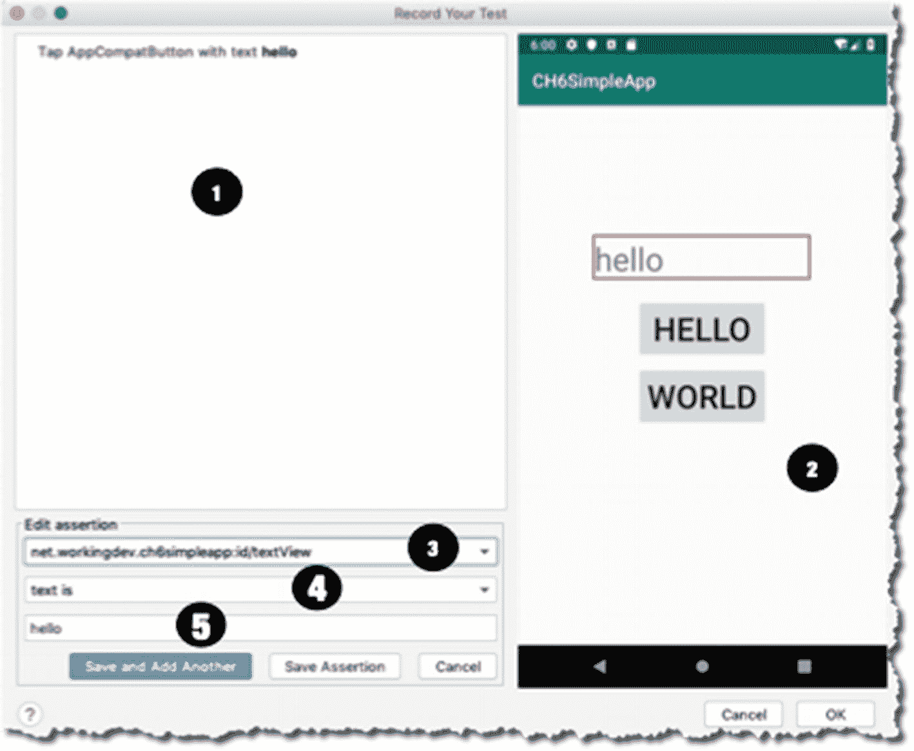

*图 13-13: Espresso 录制器*

- ❶ 这一部分显示了你与应用的每一次交互。此时，我只点击了应用一次；我点击了“HELLO”按钮。
- ❷ 这一部分是 `ViewMatcher`，但以可视化方式呈现。如果你像我一样点击 `TextView`，它就会作为一个项目添加到“Edit Assertion”部分。
- ❸ 此处选择了 `TextView`，因为我在 `ViewMatcher` 部分（第 2 项）点击了它。
- ❹ 在这里选择断言。在这个例子中，我们仅使用“text is”。
- ❺ 这显示了我们要断言的 `TextView` 的实际值。

如果你想添加另一个测试，可以点击“Save and Add Another”，或者点击“Save Assertion”完成录制。图 13-14 显示了下一个界面。

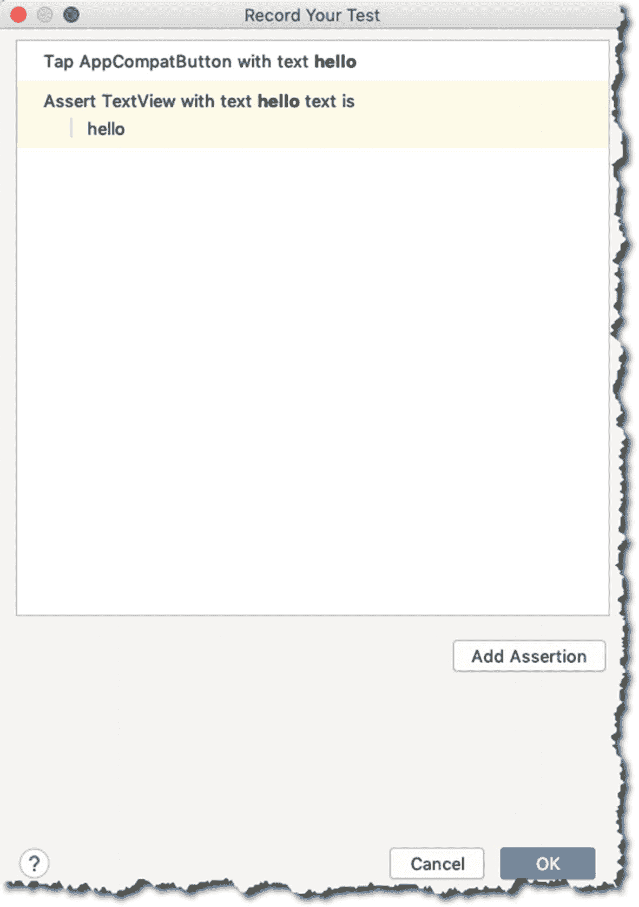

*图 13-14: Espresso 录制器，断言已保存*

当你点击 OK，录制器会提示输入类名，并将录制内容保存为一个测试类，如图 13-15 所示。

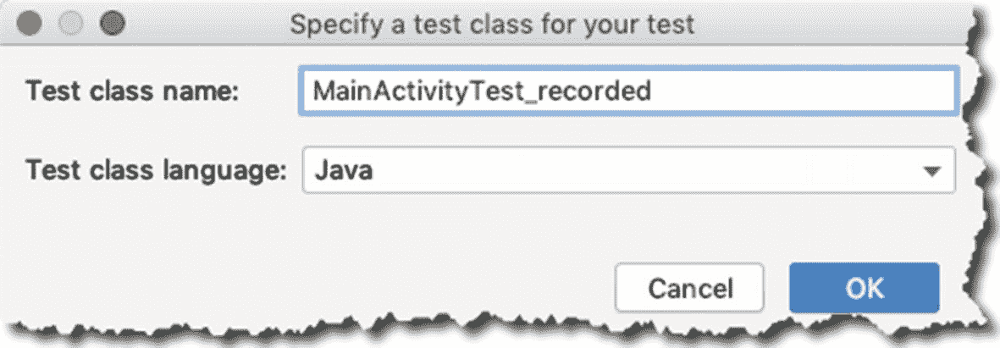

*图 13-15: Espresso 测试，测试已保存*

当你前往 `src/androidTest` 文件夹时，会发现从录制内容中新生成的测试类。现在你可以像之前运行 `MainActivityTest` 一样运行这个生成的测试。

**注意：**关于 Espresso 的两个小知识：(1) 根据 Android Studio 分析数据，Espresso 录制器是使用 Espresso 时最常用的工具之一；(2) Espresso 录制器的原名叫“cassette”。

### 更多关于 Espresso 匹配器

Espresso 有多种匹配器，但最常用的是 `ViewMatchers`——我们在之前的例子中使用的就是它。以下是 Espresso 中的其他匹配器：

- `CursorMatchers` — 可用于由 Cursor 支持的 Android Adapter Views，以匹配特定的数据行。
- `LayoutMatchers` — 用于匹配和检测典型的布局问题，例如，含有省略号或多行文本的 TextViews。
- `RootMatchers` — 用于匹配作为对话框或可以接收触摸事件的 Root 对象。
- `PreferenceMatchers` — 用于匹配 Android Preferences，并让我们根据其键、摘要文本等来查找 View 组件。
- `BoundedMatchers` — 用于为给定类型创建自定义匹配器。

在之前的示例中，我们使用 `ViewMatcher` 通过 id 查找 Views。我们还可以通过其他方式来查找 Views，例如：

- **其值** — 你可以使用 `withText()` 方法来查找与某个特定字符串表达式匹配的 View。
- **其子元素的数量** — 使用 `hasChildCount()` 方法，你可以匹配具有特定子元素数量的 View。
- **其类名** — 使用 `withClassName()` 方法。

`ViewMatchers` 还可以告诉我们一个 `View` 对象是否是：

- **已启用** — 通过使用 `isEnabled()` 方法
- **可聚焦** — 通过使用 `isFocusable()` 方法
- **已显示** — `isDisplayed()`
- **已勾选** — `isChecked()`
- **已选中** — `isSelected()`

在 `ViewMatchers` 类中还有更多方法可供使用，请务必通过 [`https://developer.android.com/reference/android/support/test/espresso/matcher/ViewMatchers`](https://developer.android.com/reference/android/support/test/espresso/matcher/ViewMatchers) 进行查阅。


### Espresso 操作

`Espresso Actions` 让你能够在测试期间以编程方式与 `View` 对象进行交互。前面我们已经使用了 `click`，但实际上 `ViewActions` 还能让你做更多事情。方法名称非常具有描述性，因此无需额外解释；你可以从名称看出它们的作用。以下列举了其中一些方法：

*   `clearText()`
*   `closeSoftKeyboard()`
*   `doubleClick()`
*   `longClick()`
*   `openLink()`
*   `pressBack()` — 按下返回键
*   `replaceText(String arg)`
*   `swipeDown()`
*   `swipeRight()`
*   `swipeUp()`
*   `typeText(String arg)`

还有更多可用的操作，请务必查阅 `ViewAction` 对象的 API 文档。

在本章结束之前，请务必访问 Android Developers 网站上关于 `Espresso` 的官方文档：[`https://bit.ly/androidstudioespresso`](https://bit.ly/androidstudioespresso)；我们在这里只是浅尝辄止地介绍了 `Espresso`。

## 总结

*   我们讨论了可以为应用进行的各种测试；你不必进行所有测试，但请确保执行适用于你应用的测试。
*   开发测试（单元测试）应作为核心开发任务；尝试养成编写测试用例和实际代码的习惯。
*   将 JVM 测试放在 `src/test` 目录下，将插桩测试放在 `src/androidTest` 目录下。
*   你可以使用 `Espresso` 创建插桩测试；在 `Espresso` 中需要两个核心组件：`ViewMatchers` 和 `ViewActions`。
*   编写 `Espresso` 测试的一般步骤如下：(1) 使用 `ViewMatchers` 找到 `View` 对象，(2) 使用 `ViewActions` 对 `View` 执行操作，(3) 进行断言。
*   创建 `Espresso` 测试的一个简便方法是使用 `Espresso` 录制器。

