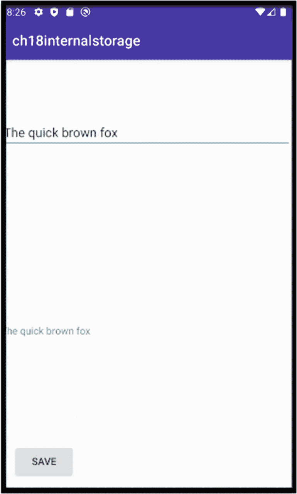
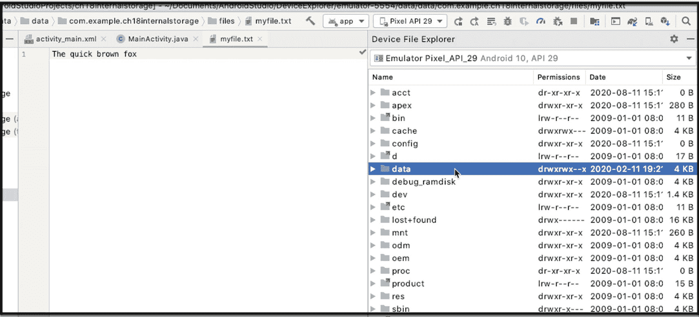

# 14. 文件操作

*本章将涵盖：*

*   Android 文件 I/O 简介
*   内部存储与外部存储
*   如何使用内部存储

当你需要处理视频、音频、json 或纯文本文件时，可以使用 Java 文件 I/O 操作本地文件。如果你之前使用过 Java 中的 `File`、`InputStream`、`OutputWriter` 以及其他 I/O 类，那么在 Android 中也会用到相同的类。在 Android 中，不同之处在于文件的存储位置。在 Java 桌面应用程序中，你可以将文件存放在几乎任何地方。但在 Android 中则不然。就像在 Java Web 应用程序中一样，Android 应用不能随意在任何地方创建和读取文件。应用只有在特定位置才拥有读写权限。

## 内部与外部存储

Android 区分内部存储和外部存储。*内部*存储指的是闪存中所有已安装应用共享的那一部分。*外部*存储指的是用户可挂载的存储空间——通常是指 sdcard，但也不一定是。只要用户能够挂载，任何设备都可以；它甚至可以是内部闪存的一部分。

两种选择各有优缺点，你需要根据应用的需求和每种存储的局限性进行权衡。以下列表展示了部分优缺点。

**内部存储**

*   应用始终可以访问该内存。不存在用户卸载 sdcard 或其他设备的风险。它能保证始终可用。
*   存储空间比外部存储小，因为你的应用只会被分配与其他所有应用共享的一部分闪存空间。这在早期的 Android 版本中是个问题，但现在已不那么令人担忧。根据 Android 兼容性定义，自 Android 6.0 起，Android 手机或平板电脑至少需要为 `/data` 分区预留 1.5GB 的非易失性空间。对于大多数应用来说，这个空间是足够的。你可以在此处阅读兼容性定义：[`bit.ly/android6compatibilitydefinition`](https://bit.ly/android6compatibilitydefinition)。
*   当你的应用在此空间创建文件时，只有你的应用能够访问这些文件；除非手机已 root（大多数用户不会 root 手机，因此通常无需担心）。
*   卸载应用时，它创建的所有文件都将被删除。

**外部存储**

*   通常比内部存储拥有更大的空间。
*   可能并非始终可用，例如，当用户移除 sdcard 或将其作为 USB 驱动器挂载时。
*   此处的所有文件对所有应用和用户都是可见的。任何人和任何应用都可以在此创建和保存文件。他们也可以删除文件。
*   当应用在此空间创建文件时，文件的寿命可以超过应用本身；卸载应用时，其创建的文件不会被删除。

## 缓存目录

无论你选择内部存储还是外部存储，可能还需要就文件位置做出另一个决定。你可以将文件放在缓存目录或更持久的位置。当空间不足时，Android 操作系统或第三方应用可能会回收缓存目录中的文件。除非你手动删除，否则不在缓存目录中的文件通常是安全的。在本章中，我们将不涉及缓存目录或外部存储。我们将只使用内部存储，并将文件放在标准位置。


## 如何使用内部存储

如前所述，在 Android 中使用文件存储就像使用 Java I/O 中的常规类一样。有几种选项可供使用，例如 `openFileInput()` 和 `openFileOutput()`，或者使用 `InputStreams` 和 `OutputStreams` 的其他方式。你只需要记住，这些调用不会让你指定文件路径。你只能提供文件名；如果你不关心这一点，那就放心使用它们吧——这也是我们在本章中将要使用的。另一方面，如果你需要更高的灵活性，你可以使用 `getFilesDir()` 或 `getCacheDir()` 来获取一个指向文件位置根目录的 `File` 对象——如果你想要使用内部存储的缓存目录，可以使用 `getCacheDir()`。当你有了一个 `File` 对象后，你就可以从中创建你的目录和文件结构。

这就是 Android 文件存储的大致情况。再次说明，在本章中，我们只会使用标准位置（非缓存）的内部存储。

写入文件需要几个简单的步骤。你需要：

1.  确定文件名
2.  获取一个 `FileOutputStream` 对象
3.  将你的内容转换为 `ByteArray`
4.  使用 `FileOutputStream` 写入 `ByteArray`
5.  不要忘记关闭文件

清单 14-1 展示了一段带有注释的代码片段，说明如何将 `String` 数据保存到文件中。

| ❶ | 选择一个文件名。 |
| :--- | :--- |
| ❷ | 这是我们要保存到文件的 `String`。在实际应用中，你可能从 `EditText` 组件的内容中获取它。 |
| ❸ | `openFileOutput()` 返回一个 `FileOutputStream`；我们需要这个对象，以便写入文件。调用的第一个参数是你要创建的文件名。第二个参数是 `Context` 模式。我们使用 `MODE_PRIVATE`，因为我们希望文件对应用程序私有。我们在这里使用了 try-with-resources 块；这样，我们就不必费心关闭文件了。当块退出时，它会自动为我们关闭文件对象。 |
| ❹ | `write()` 方法需要一个 `ByteArray`。因此，我们需要将 `String` 转换为字节数组。`getBytes()` 方法可以很好地完成这项工作。 |

```
String filename = "myfile.txt"; ❶
String str = "The quick brown fox jumped over the head"; ❷
try (FileOutputStream out = openFileOutput(filename, Context.MODE_PRIVATE)) { ❸
    out.write(str.getBytes()); ❹
} catch (IOException e) {
    e.printStackTrace();
}
清单 14-1
将字符串数据保存到文件
```

从文件读取涉及比写入更多的步骤。你通常需要执行以下操作：

1.  获取一个 `FileInputStream`。
2.  从流中读取，一次一个字节。
3.  持续读取，直到没有内容可读。如果你读取的最后一个字节的值为 `-1`，你就知道已经到达文件末尾了。这时就该停止了。
4.  当你向文件末尾读取时，需要将从流中获取的字节存储到一个临时容器中。`StringBuilder` 或 `StringBuffer` 可以完成这个任务。使用 `plus` 运算符构建 `String` 对象既浪费又低效，因为 `String` 是不可变的。每次使用 `plus` 运算符，它都会创建一个新的 `String` 对象；如果你的文件有 2000 个字符，你就会创建 2000 个 `String` 对象。如果你正在读取一个文本文件，就会发生这种情况。如果你正在阅读其他内容，比如音频或视频文件，你将使用不同的数据结构。
5.  当你到达文件末尾时，停止读取。对你已读取的内容进行必要的操作，并且不要忘记关闭它。

清单 14-2 展示了一段带有注释的代码片段，说明如何从文件读取 `String` 数据。

| ❶ | 我们无法一口气读取整个文件。我们会分块读取。当我们获取一些块时，我们将它们存储在 `StringBuilder` 对象中。 |
| :--- | :--- |
| ❷ | `openFileInput()` 返回一个 `FileInputStream`；这是我们需要从文件读取的对象。它唯一的参数是要读取的文件名。在这里使用 try-with-resources 让我们免于编写关闭文件的样板代码。 |
| ❸ | `read()` 方法从输入流中读取一个字节的数据，并将其作为整数返回。我们需要一次从流中读取一个字节，直到到达文件结束 (EOF) 标记。当没有更多字节可从流中读取时，EOF 被标记为 `-1`。我们将以此作为 `while` 循环的条件。直到 `read()` 方法不返回 `-1`，我们才继续读取。 |
| ❹ | `read()` 方法返回一个 `int`；它是文件中每个字母的 ASCII 值，以整数形式返回。在将其放入 `StringBuilder` 之前，我们必须将其转换为 `char`。 |
| ❺ | 当没有更多字节可读时，我们将退出循环，并从 `StringBuilder` 中获取 `String`。现在，你可以将文件内容作为 `String` 来处理。 |

```
String filename = "myfile.txt";
StringBuilder sb = new StringBuilder(); ❶
String output = "";
try (FileInputStream in = openFileInput(filename)) { ❷
    int read = 0;
    while ((read = in.read()) != -1) { ❸
        sb.append((char) read); ❹
    }
    output = sb.toString(); ❺
}
catch(IOException ie) {
    Log.e(TAG, ie.getMessage());
}
清单 14-2
从文件读取
```

让我们构建一个小项目来整合所有这些内容。创建一个带有空 Activity 的项目。我们的小应用将包含以下视图组件：

*   `EditText` — 这将允许我们输入一些文本。
*   `TextView` — 当我们从文件读取数据时，我们将使用此组件显示内容。
*   `Button` — 这将触发用户操作，将 `EditText` 的内容保存到文件。

编辑 `/app/res/layout/activity_main.xml` 以匹配清单 14-3 的内容。

```
清单 14-3
app/res/layout/activity_main.xml
```

接下来，编辑 `MainActivity` 以匹配清单 14-4 的内容。

| ❶ | 将 `Button`、`EditText`、`TextView`、`filename` 变量和 `TAG` 变量声明为类成员；我们稍后将引用它们。 |
| :--- | :--- |
| ❷ | 在 `onCreate()` 回调中初始化 `TextView` 和 `EditText` 变量。 |
| ❸ | 将 `Button` 绑定到一个监听器对象。当 `Button` 被点击时，我们将调用一个方法，该方法包含用于将 `txtinput` 的内容保存到文件的代码。 |

```
import android.content.Context;
import android.os.Bundle;
import android.util.Log;
import android.view.View;
import android.widget.Button;
import android.widget.EditText;
import android.widget.TextView;

public class MainActivity extends AppCompatActivity {
    private Button btn;  ❶
    private TextView txtoutput;
    private EditText txtinput;
    private String filename = "myfile.txt";
    private String TAG = getClass().getName();

    @Override
    protected void onCreate(final Bundle savedInstanceState) {
        super.onCreate(savedInstanceState);
        setContentView(R.layout.activity_main);

        txtoutput = findViewById(R.id.txtoutput); ❷
        txtinput = findViewById(R.id.txtinput);
        btn = findViewById(R.id.btn);

        btn.setOnClickListener(new View.OnClickListener() { ❸
            @Override
            public void onClick(View v) {
                // 这是我们触发保存数据的地方
            }
        });
    }
}
清单 14-4
MainActivity
```

接下来，向 `MainActivity` 添加一个方法并命名为 `saveData()`。编辑它以匹配清单 14-5 中所示的代码。这些代码与清单 14-1 中的代码基本相同；唯一的区别是我们正在从 `EditText` (`txtinput`) 组件读取 `String` 内容。


```java
private void saveData() {
    String str = txtinput.getText().toString();
    try (FileOutputStream out = openFileOutput(filename, Context.MODE_PRIVATE)) {
        out.write(str.getBytes());
        loadData();
    } catch (IOException e) {
        Log.e(TAG, e.getMessage());
    }
}
```
列表 14-5：`saveData()`

接下来，在 `MainActivity` 中添加另一个方法，将其命名为 `loadData()`；代码如列表 14-6 所示。这些代码与列表 14-2 中的代码相同，但这次，我们将 `txtinput` 和 `txtoutput` 的文本设置为刚读取的文件内容。

```java
private void loadData() {
    StringBuilder sb = new StringBuilder();
    try (FileInputStream in = openFileInput(filename)) {
        int read = 0;
        while ((read = in.read()) != -1) {
            sb.append((char) read);
        }
        txtoutput.setText(sb.toString());
        txtinput.setText(sb.toString());
    }
    catch(IOException ie) {
        Log.e(TAG, ie.getMessage());
    }
}
```
列表 14-6：`loadData()`

我们希望应用打开时能显示 `myfile.txt` 的内容。可以通过在 `MainActivity` 的 `onResume()` 回调中调用 `loadData()` 来实现。覆盖 `onResume()` 回调并调用 `loadData()` 方法，如列表 14-7 所示。

```java
@Override
protected void onResume() {
    super.onResume();
    loadData();
}
```
列表 14-7：`onResume()`

至此，我们基本完成了。图 14-1 显示了我们的应用在模拟器中的运行效果。



图 14-1：完成的应用

您可以使用设备资源管理器查看本地文件的内容。从主菜单栏中选择 **View** ➤ **Tool Windows** ➤ **Device Explorer**。设备资源管理器工具窗口将在 IDE 中弹出，如图 14-2 所示。



图 14-2：设备资源管理器

依次展开 **data** ➤ **data** ➤ （应用包名）➤ **files**。双击文件即可查看其内容；Android Studio 将显示这些内容。

## 总结

*   您可以将文件存储在始终可用但空间有限的内部存储器中，也可以存储在空间更大但可能被卸载的外部存储器中。
*   Java I/O 调用会抛出 `Exception`；请妥善处理它们。

