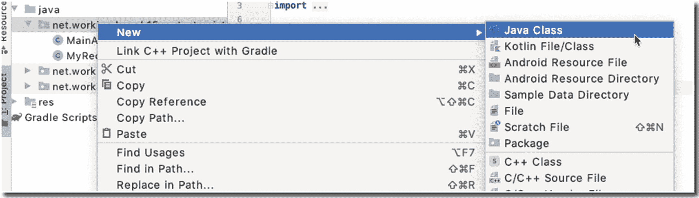
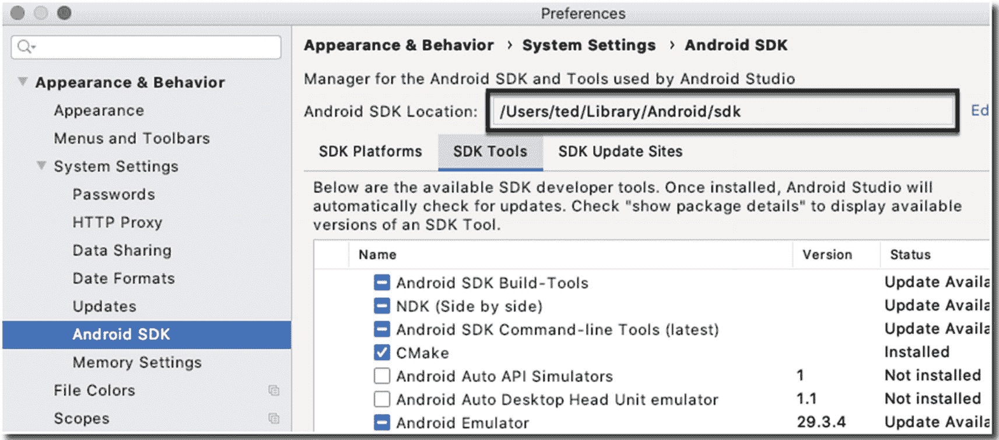

# 15. BroadcastReceivers

*我们将涵盖的内容：*

*   `BroadcastReceiver` 简介
*   自定义广播与系统广播
*   清单注册与上下文注册的接收器

Android 的应用模型在很多方面都独具特色，但其最突出之处在于，它允许您利用自己未编写的其他应用的功能来构建应用——我指的不只是库，而是完整的应用程序。在第 8 章中，我们学习了如何使用 `Intent` 来激活 `Activity`。在本章中，我们将学习如何使用 `Intent` 发送和接收广播消息。

广播是一种由 Android 运行时或其它应用（包括您的应用）发送的 `Intent`，以便每个应用或组件都能听到它。大多数应用会忽略此广播，但您可以让自己的应用监听它。您可以调谐到该消息，以便对广播做出响应。这就是本章的主题。

## `BroadcastReceiver` 简介

Android 应用可以发送或接收来自 Android 系统和其他应用（包括我们自己的应用）的广播消息。当某些有趣的事情发生时，就会发送这些广播，例如，系统启动时、设备开始充电时、文件下载完成时。这种消息传递模型被称为*发布-订阅*模式；在这种模式下，消息的发送者（称为发布者）并不针对特定的接收者（称为订阅者），而是将消息分类成不同的类别，且不知道哪些订阅者可能正在监听（如果有的话）。同样，订阅者通过注册来监听一个或多个类别的消息来表达兴趣，而无需发布者知晓。

### 系统广播与自定义广播

广播可以由操作系统（系统广播）或应用程序发送。每当发生某些有趣的事件时，操作系统就会发送系统广播，例如，WiFi 打开（或关闭）、电池电量降至指定阈值、插入耳机、设备切换到飞行模式等。以下是系统广播操作的一些示例：

*   `android.app.action.ACTION_PASSWORD_CHANGED`
*   `android.app.action.ACTION_PASSWORD_EXPIRING`
*   `android.bluetooth.a2dp.profile.action.CONNECTION_STATE_CHANGED`
*   `android.bluetooth.a2dp.profile.action.PLAYING_STATE_CHANGED`
*   `android.bluetooth.adapter.action.CONNECTION_STATE_CHANGED`
*   `android.intent.action.BATTERY_CHANGED`
*   `android.intent.action.BATTERY_LOW`
*   `android.intent.action.BATTERY_OKAY`

文档中列出了大约 150 多个此类操作。您可以在 Android SDK 的 `BROADCAST_ACTIONS.TXT` 文件中找到它们。

另一方面，自定义广播是您自己创建的。这些是您发送的 `Intent`，用于通知您的应用的某些组件（或调谐到同一频道的其他应用）发生了“有趣”的事情，例如，文件已下载完成，或您完成了质数计算等。


### 注册广播的两种方式

如果你想跟着代码示例操作，需要创建一个项目（带空 Activity）。

要响应广播，你需要先监听它，而监听广播就需要注册一个接收器。接收器是一个继承自 `BroadcastReceiver` 类的类；你需要在你的应用中添加这样一个类来响应广播消息。

注册有两种方式：通过清单文件（Manifest）或通过 `Context`（上下文）。

### 清单注册

顾名思义，清单注册是通过应用的清单文件完成的。要通过清单注册来监听广播消息，我们需要执行以下操作：



**图 15-1** – 创建一个新的 Java 类

1.  在应用的 `AndroidManifest` 文件中添加 `<receiver>` 元素；代码清单 15-1 展示了一个带有注释的清单文件。

2.  向项目中添加一个类（继承自 `BroadcastReceiver` 类），然后重写 `onReceive()` 方法。代码清单 15-2 展示了一个示例 `BroadcastReceiver` 类，它会记录并显示广播的内容。你可以通过以下两种方式之一添加 `BroadcastReceiver` 类：右键单击项目的包名（在项目工具窗口中），然后依次选择 **New** ➤ **Java Class**，如图 15-1 所示，然后添加必要的代码来创建 `BroadcastReceiver` 的子类。或者，你也可以右键单击应用的包名，然后依次选择 **New** ➤ **Other** ➤ **BroadcastReceiver**。无论你选择哪种方式添加 `BroadcastReceiver` 类，如果你想按照代码清单 15-1 和 15-2 中的代码示例操作，请确保类名为 `MyReceiver`。

| ❶ | 就像 Activity 一样，`BroadcastReceiver` 也需要在清单中声明。你必须在它的节点中声明它。与 Activity 声明一样，它需要作为 `application` 的子节点。 |
| ❷ | `.MyReceiver` 是 `BroadcastReceiver` 类的名称。可以假设你的应用中有一个名为 `MyReceiver` 的类，它继承了 `BroadcastReceiver`。我们只需像其上面的 Activity（`.MainActivity`）一样将其写为 `.MyReceiver`。完整形式实际上是 `net.workingdev.ch15_broadcast.MyReceiver`，但我们可以使用简短形式，因为包名已经在前面声明过了；查看清单的第二行，你就能找到包的完整名称。任何后续需要在清单中声明的类都可以简单地使用简短形式，比如 `.MyReceiver` 或 `.MainActivity`。 |
| ❸ | `intent-filter` 是我们注册的方式。我们告诉 Android，我们对 `android.intent.action.BOOT_COMPLETED` 和 `android.intent.action.INPUT_METHOD_CHANGED` 事件感兴趣。如果这些 Intent 被广播，我们的应用将希望响应它。 |

```
❸

代码清单 15-1
清单注册
```

| ❶ | 继承 `BroadcastReceiver` 类。这个类的名称必须与代码清单 15-1 清单文件中 `<receiver>` 节点的 `android:name` 属性一致。 |
| ❷ | 重写 `onReceive()` 方法，并实现你的程序逻辑来响应广播消息。在我们的示例中，我们只是显示一条 Toast 消息。 |

```
import android.content.BroadcastReceiver;
import android.content.Context;
import android.content.Intent;
import android.util.Log;
import android.widget.Toast;
public class MyReceiver extends BroadcastReceiver { ❶
private final String TAG = getClass().getName();
@Override
public void onReceive(Context context, Intent intent) { ❷
StringBuilder sb = new StringBuilder();
sb.append("Action: " + intent.getAction() + "\n");
sb.append("URI: " + intent.toUri(Intent.URI_INTENT_SCHEME).toString() + "\n");
String log = sb.toString();
Log.d(TAG, log);
Toast.makeText(context, log, Toast.LENGTH_LONG).show();
}
}
代码清单 15-2
BroadcastReceiver 类
```

当你在清单文件中声明一个 `BroadcastReceiver` 时，运行时将启动你的应用（如果发送广播时应用尚未运行）。

当用户在设备上安装此应用时，Android 的包管理器将注册此应用。该接收器随后成为你应用的一个独立入口点，这意味着如果应用当前未运行，运行时可以启动应用并传递广播。

系统会创建一个新的 `BroadcastReceiver` 组件对象来处理它接收到的每个广播。该对象仅在 `onReceive()` 调用期间有效。一旦你的代码从该方法返回，系统就会认为该组件不再处于活动状态。

### Context 注册

我们已经了解了如何通过清单注册 `BroadcastReceiver`，现在我们来看看如何通过 `Context` 注册 `BroadcastReceiver`。Context 注册意味着以编程方式进行注册——使用 Activity 上下文或 Application 上下文。

让我们为此创建另一个项目（带空 Activity），然后添加一个继承自 `BroadcastReceiver` 的 Java 类，就像我们在上一个项目中所做的那样。你也可以将 `BroadcastReceiver` 类命名为 `MyReceiver`。打开 `MyReceiver` 类并编辑它，使其与代码清单 15-3 匹配。

```
import android.content.BroadcastReceiver;
import android.content.Context;
import android.content.Intent;
import android.widget.Toast;
public class MyReceiver extends BroadcastReceiver {
@Override
public void onReceive(Context context, Intent intent) {
Toast.makeText(context, "Got it", Toast.LENGTH_LONG).show();
}
}
代码清单 15-3
MyReceiver 类
```

`MyReceiver` 非常简单；它会在响应广播时显示一条 "Got it" 的 Toast 消息。

要通过 `Context` 注册 `MyReceiver` 对象，我们将声明一个类型为 `MyReceiver` 的成员变量，作为 `MainActivity` 的成员，如下所示：

```
MyReceiver receiver = null;
```

我们将其设为成员变量，是因为我们需要在几个 Activity 生命周期回调中引用它。

在 `MainActivity` 的 `onCreate()` 回调中，我们将创建一个 `MyReceiver` 类的实例，如下所示：

```
receiver = new MyReceiver();
```

我们只想在 Activity 存活期间监听广播消息。当 Activity 对用户不可见时，我们不想接收消息。我们将注册代码放在 `MainActivity` 的 `onResume()` 方法中；当 Activity 对用户可见时会调用此方法。我们将取消注册接收器的代码放在 `MainActivity` 的 `onPause()` 方法中，因为当用户离开 `MainActivity` 时会调用此方法。

让我们编辑 `MainActivity` 类。代码清单 15-4 展示了带有注释的 `MainActivity` 类。


| ❶ | 让我们创建一个 `MyReceiver` 类的实例。我们将其设置为 `null`，因为暂时还不会在这里实例化。 |
| ❷ | 我们在 `onCreate()` 方法内部创建一个 `MyReceiver` 类的实例。 |
| ❸ | 该语句在程序上等同于我们之前在清单 15-1 中看到的 `<intent-filter>` 节点。要创建一个 `IntentFilter` 对象，需将一个广播动作传递给它对应的构造器。广播动作就是您希望订阅的事件。在这个例子中，我们希望收到动作名为 `com.workingdev.SOMETHINGHAPPENED` 的 `Intent` 被发送时的通知；这个 `Intent` 是自定义广播的一个示例，而非系统广播。正如我之前提到的，自定义广播动作实际上就是您自己定义的内容。如本例所示，广播动作仅仅是一个 `String` 对象。 |
| ❹ | 使用 `Activity` 的 `registerReceiver()` 方法来注册接收器。该方法接受两个参数：1. `BroadcastReceiver` 的实例 2. 一个 `IntentFilter` 的实例 |
| ❺ | 让我们在 `onPause()` 回调中调用 `unregisterReceiver()`。我们不希望在 `MainActivity` 对用户不可见时接收到广播消息。 |

```java
import androidx.appcompat.app.AppCompatActivity;
import android.content.IntentFilter;
import android.os.Bundle;
public class MainActivity extends AppCompatActivity {
MyReceiver receiver = null; ❶
@Override
protected void onCreate(Bundle savedInstanceState) {
super.onCreate(savedInstanceState);
setContentView(R.layout.activity_main);
receiver = new MyReceiver(); ❷
}
@Override
protected void onResume() {
super.onResume();
IntentFilter filter = new IntentFilter("com.workingdev.SOMETHINGHAPPENED"); ❸
registerReceiver(receiver, filter); ❹
}
@Override
protected void onPause() {
super.onPause();
unregisterReceiver(receiver); ❺
}
}
```

清单 15-4 - `MainActivity`

要测试我们的应用，需要做两件事：

1. 在模拟器中运行我们的应用
2. 发送自定义广播消息 `com.workingdev.SOMETHINGHAPPENED`

我们可以通过以下两种方式之一发送自定义广播。首先，可以通过 `Intent` 对象以编程方式发送自定义广播消息，如下所示：

```java
Intent intent = new Intent("com.workingdev.SOMETHINGHAPPENED");
sendBroadcastIntent(intent);
```

您可以将这两条语句放入 `Activity` 类中某个 `Button` 的点击处理程序里。您可以将它们放在当前项目的 `MainActivity` 中，或者专门为此创建一个单独的项目。

其次，我们可以通过 Android 调试桥（简称 `adb`）发送自定义广播消息。这是一个命令行工具，允许您与设备（物理设备或模拟设备）进行通信。`adb` 可以执行多种操作，比如安装/卸载 APK、显示日志、在设备上运行 Linux 命令、模拟电话呼叫等等。针对我们的需求，我们将使用 `adb` 来发送广播 `Intent`。您可以在 Android SDK 的 `platform-tools` 文件夹中找到 `adb` 程序。如果您忘记了 Android SDK 的位置，请前往 Android Studio 的“设置”（Windows 或 Linux）或 Android Studio 的“偏好设置”（macOS）。您可以通过按 `Ctrl + Alt + S`（Windows 和 Linux）或 `Command + ,`（逗号）（macOS）来打开它们；或者，您也可以使用主菜单栏找到它们。

随后出现的窗口会导航到 **外观与行为** ➤ **系统设置** ➤ **Android SDK**，如图 15-2 所示。



图 15-2 - Android SDK 的位置

打开一个命令行窗口，切换到 Android SDK 的目录。然后，从那里 `cd` 进入 `platform-tools`，运行以下命令：

```
adb shell: a com.workingdev.SOMETHINGHAPPENED
```

如果您使用的是 macOS 或 Linux，可能需要在命令前加上点号和斜杠，如下所示：

```
./adb shell am broadcast -a com.workingdev.SOMETHINGHAPPENED
```

## 总结

* 您可以使用 `BroadcastReceiver` 和 `Intent` 来创建真正解耦的应用。
* 您可以让您的应用监听特定的广播，并在广播发送时执行一些有趣的操作。
* `BroadcastReceiver` 可用于路由您应用中的程序逻辑。您可以针对运行时环境的变化（例如，电量低、无 WiFi 连接）让应用以特定方式运行。
* `BroadcastReceiver` 可以通过清单文件或通过 `Context` 对象进行注册。

