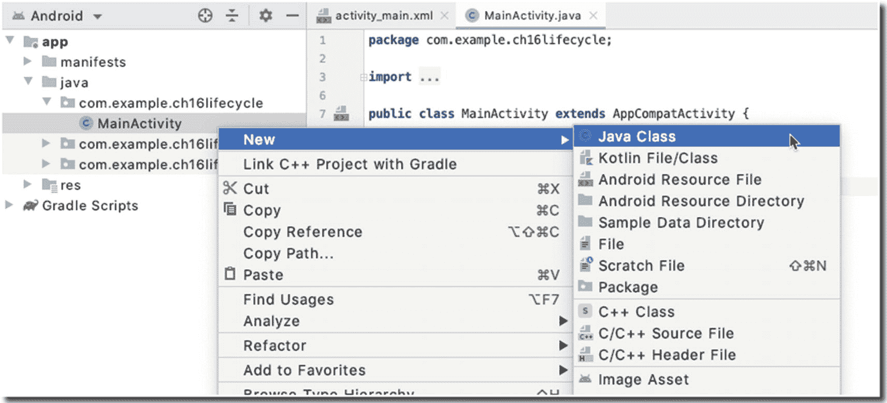
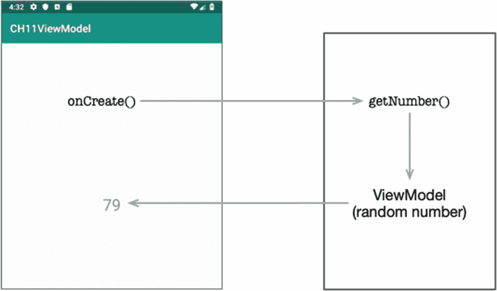
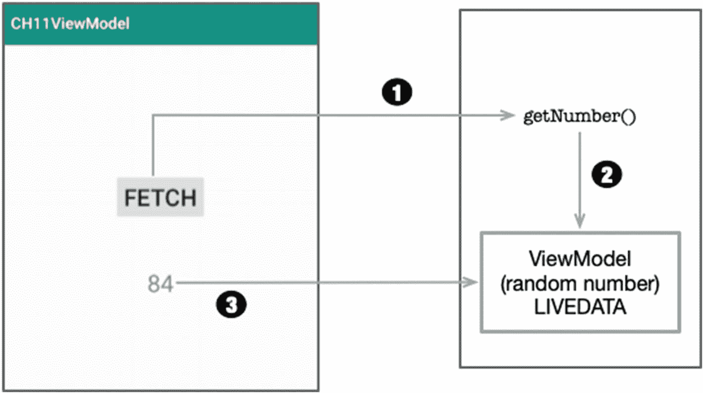
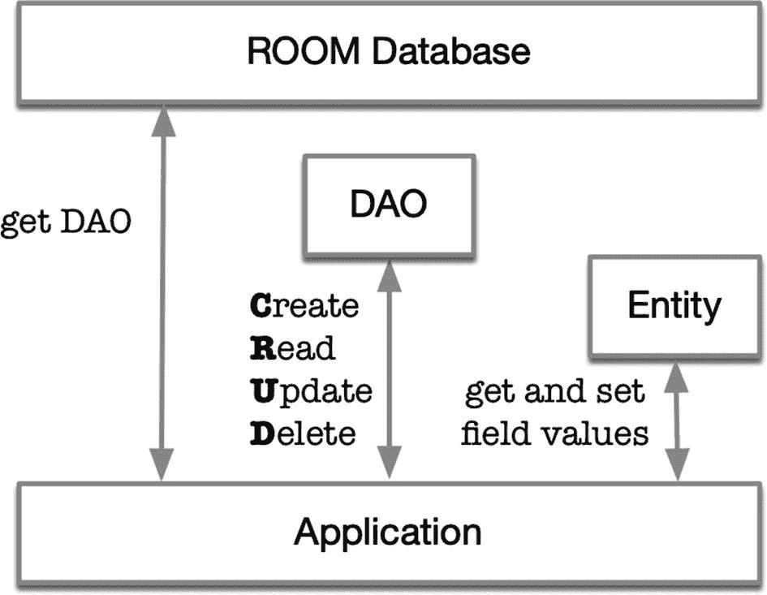

# 16. Jetpack、LiveData、ViewModel 和 Room

*本章内容概要：*

* 生命周期感知组件
* ViewModel
* LiveData
* Room

我们在第 10 章中稍微了解了一些架构组件。在本章中，我们将探讨架构组件中的其他一些库，即 Room；它是一个建立在 SQLite 之上的持久化库。如果您以前使用过 ORM（对象关系映射器），您可以把 Room 想象成类似的东西。

在本章中，我们还将探索架构组件中与 Room 库相辅相成的一些其他库。我们将研究生命周期感知组件、`LiveData` 和 `ViewModel`；这些库与 Room 一起，构成了构建流畅顺滑的数据库应用程序所需的一些基础库。


## 生命周期感知组件

生命周期感知组件会响应其他组件生命周期状态的变化而执行相应操作。如果你熟悉**观察者-被观察者**设计模式，生命周期感知组件的运作方式与之类似。

我们需要了解一些新的术语：

*   **生命周期所有者** — 一个拥有生命周期的组件，例如 `Activity` 或 `Fragment`；它在其生命周期中可以进入各种状态，例如 `CREATED`、`RESUMED`、`PAUSED`、`DESTROYED` 等。生命周期观察者可以接入生命周期所有者，并在生命周期状态发生变化时收到通知，例如当 `Activity` 进入 `CREATED` 状态时——比如在进入 `onCreate()` 之后；我有时也将生命周期所有者称为可观察对象。

*   **生命周期观察者** — 一个监听**生命周期所有者**生命周期状态变化的对象。它是一个实现了 `LifecycleObserver` 接口的类。

借助生命周期感知组件，我们可以观察诸如 `Activity` 这样的组件，并在其进入任何生命周期状态时执行相应操作。

创建一个新项目有助于你理解本章的讨论内容。创建一个包含空 `Activity` 的项目，然后创建另一个名为 `MainActivityObserver` 的类。你可以通过右键单击项目（如图 16-1 所示），然后选择 **New** ➤ **Java Class** 来创建这个类。



图 16-1 向项目添加一个 Java 类

将新类命名为 "MainActivityObserver"。

接下来，我们需要向 `build.gradle` 文件（模块级别）添加一个依赖项。编辑项目的 Gradle 文件，使其与代码清单 16-1 一致。

```
dependencies {
def lifecycle_version = "2.2.0"
implementation "androidx.lifecycle:lifecycle-extensions:$lifecycle_version"
annotationProcessor "androidx.lifecycle:lifecycle-compiler:$lifecycle_version"
...
}
```

代码清单 16-1 `build.gradle` 文件，模块级别

> **注意：** 编写本文时的 `lifecycle_version` 是 "2.2.0"；由于你阅读本文的时间较晚，版本可能会有所不同。你可以访问 `https://bit.ly/lifecyclerelnotes` 来查找生命周期库的当前版本。

编辑 Gradle 文件后，你的项目需要刷新。

为了演示生命周期的概念，我们将研究两个类：

*   **MainActivity** — 这是一个简单的 `Activity`，与使用空 `Activity` 创建项目时 IDE 生成的任何其他 `Activity` 非常相似。示例代码如代码清单 16-2 所示。

*   **MainActivityObserver** — 一个将实现 `LifecycleObserver` 接口的 Java 类；这将是我们的监听器对象。相关代码在代码清单 16-1 中列出并附有注释。

`MainActivity` 和 `MainActivityObserver` 这两个类展示了一个在**生命周期所有者**（`MainActivity`）和**生命周期观察者**（`MainActivityObserver`）之间建立**观察者-被观察者**关系的示例。编辑 `MainActivityObserver` 类，使其与代码清单 16-2 一致。

|❶| 如果你想观察其他组件的生命周期变化，需要实现 `LifecycleObserver` 接口。这一行使该类成为一个*观察者*。|
|❷| 使用 `OnLifecycleEvent` 注解来告知 Android 运行时，当生命周期事件发生时，应该调用被注解的方法；在本例中，我们正在监听被观察对象的 `ON_CREATE` 事件。装饰器的参数指示了我们正在监听哪个生命周期事件。|
|❸| 这是被装饰的方法。当它正在观察的对象进入 `ON_CREATE` 生命周期状态时，该方法将被调用。你可以随意命名这个方法；我把它命名为 `onCreateEvent()`，因为这样描述性强。否则，你可以根据自己的喜好命名；方法名无关紧要，因为你已经对它进行了注解，而且注解本身就足够了。|
|❹| 这是你响应生命周期状态变化而执行某些有趣操作的地方。|

```
import androidx.lifecycle.Lifecycle;
import androidx.lifecycle.LifecycleObserver;
import androidx.lifecycle.OnLifecycleEvent;
public class MainActivityObserver implements LifecycleObserver {  ❶
@OnLifecycleEvent(Lifecycle.Event.ON_CREATE) ❷
public void onCreateEvent() {  ❸
System.out.println("EVENT: onCreate Event fired");  ❹
}
@OnLifecycleEvent(Lifecycle.Event.ON_PAUSE)
public void onPauseEvent() {
System.out.println("EVENT: onPause Event fired");
}
@OnLifecycleEvent(Lifecycle.Event.ON_RESUME)
public void onResumeEvent() {
System.out.println("EVENT: onResume Event fired");
}
}
```

代码清单 16-2 `MainActivityObserver` 类

接下来，编辑 `MainActivity` 类，使其与代码清单 16-3 一致。

|❶| 从 `MainActivity` 的角度来看（它是被观察的对象），我们在这里唯一需要做的事情是使用 `LifeCycleOwner` 接口的 `addObserver()` 方法添加一个观察者对象——没错，`AppCompatActivity` 实现了 `LifeCycleOwner`；这就是为什么我们可以在 `Activity` 内部调用 `getLifecycle()` 方法。你只需要传递一个观察者类的实例（在我们的例子中是 `MainActivityObserver`），即可在 `Activity` 和普通类之间建立生命周期感知。|

```
public class MainActivity extends AppCompatActivity {
@Override
protected void onCreate(Bundle savedInstanceState) {
super.onCreate(savedInstanceState);
setContentView(R.layout.activity_main);
getLifecycle().addObserver(new MainActivityObserver()); ❶
}
}
```

代码清单 16-3 `MainActivity` 类

这个应用程序没有做太多事情。它只是在 `MainActivity` 的生命周期状态发生变化时，将消息记录到 Logcat 窗口。尽管如此，它演示了如何向任何 `Activity` 的生命周期添加观察者。


## ViewModel

Android 框架管理 `Activity` 和 `Fragment` 等 UI 控制器的生命周期；它可能会根据某些用户操作（例如点击返回按钮）或设备事件（例如旋转屏幕）销毁或重新创建 `Activity`（或 `Fragment`）。这些配置更改是您无法控制的。

如果运行时代决定销毁 UI 控制器，那么您当前存储在其中的任何与 UI 相关的临时数据都将丢失。

最好创建一个新项目（使用空 `Activity`）来跟随本节内容进行讨论；然后向项目中添加一个 Java 类并命名为 `RandomNumber`。清单 16-4、16-5 和 16-6 展示了一个简单的应用，每次 `Activity` 创建时都会显示一个随机数。

清单 16-4 展示了随机数生成器的代码。它只包含两个方法：`getNumber()` 和 `createRandomNumber()`；每个方法都留有一条日志语句，以便我们检查方法被调用的时间和次数。`getNumber()` 方法的逻辑很简单——如果 `minitialized` 变量为 `false`，意味着我们第一次创建 `RandomNumber` 类的实例；因此，我们将创建随机数然后直接返回它。否则，我们将返回 `minitialized` 变量的当前值。

```java
import android.util.Log;
import java.util.Random;
public class RandomNumber  {
private String TAG = getClass().getSimpleName();
int mrandomnumber;
boolean minitialized = false;
String getNumber() {
if(!minitialized) {
createRandomNumber();
}
Log.i(TAG, "RETURN Random number");
return mrandomnumber + "";
}
void createRandomNumber() {
Log.i(TAG, "CREATE NEW Random number");
Random random = new Random();
mrandomnumber = random.nextInt(100);
minitialized = true;
}
}
```

*清单 16-4 RandomNumber 类*

清单 16-5 展示了 `MainActivity` 的代码。所有操作都发生在 `onCreate()` 方法内部。当 `MainActivity` 进入 *CREATED* 状态时，我们创建 `RandomNumber` 类的实例；调用 `getNumber()` 方法，并将 `TextView` 的值设置为 `getNumber()` 方法的结果。

```java
public class MainActivity extends AppCompatActivity {
@Override
protected void onCreate(Bundle savedInstanceState) {
super.onCreate(savedInstanceState);
setContentView(R.layout.activity_main);
RandomNumber data = new RandomNumber();
((TextView) findViewById(R.id.txtrandom)).setText(data.getNumber());
}
}
```

*清单 16-5 MainActivity 类*

清单 16-6 展示了 `activity_main` 的布局代码。

```
清单 16-6 activity_main.xml
```

第一次运行此代码时，您会在 `TextView` 上看到一个随机数，这并不奇怪。您还会在 Logcat 窗口中看到 `createNumber()` 和 `getNumber()` 的日志条目，这同样不足为奇。现在，当应用在模拟器上运行时，尝试更改设备的屏幕方向——您会注意到，每次屏幕方向更改时，`TextView` 上显示的数字也会随之改变。您还会看到 `createNumber()` 和 `getNumber()` 方法的额外日志出现在 Logcat 中。这是因为运行时每次屏幕方向更改时都会销毁并重新创建 `MainActivity`。我们的 `RandomNumber` 对象也随着 `MainActivity` 被销毁并重新创建——我们的 UI 数据无法在屏幕方向更改后存活下来。

这是使用 `ViewModel` 库的好场景，这样 UI 数据可以在 `Activity` 类销毁和重新创建后继续存在。我们只需要做三件事来实现 `ViewModel`：

1.  将生命周期扩展添加到项目的依赖项中，就像我们之前做的那样。返回清单 16-1 查看说明。
2.  为了使 `RandomGenerator` 类成为 *ViewModel*，我们将扩展来自 AndroidX 生命周期库的 `ViewModel` 类。
3.  在 `MainActivity` 中，我们将使用 `ViewModelProviders` 类的工厂方法获取 `RandomNumber` 类的实例，而不是仅仅创建 `RandomNumber` 类的实例。

清单 16-7 展示了 `RandomNumber` 类中的更改；`RandomNumber` 类通过扩展 `ViewModel` 类自动转换为 *ViewModel* 对象。

```java
import java.util.Random;
import androidx.lifecycle.ViewModel;
public class RandomNumber extends ViewModel {
private String TAG = getClass().getSimpleName();
int mrandomnumber;
boolean minitialized = false;
String getNumber() {
if(!minitialized) {
createRandomNumber();
}
Log.i(TAG, "RETURN Random number");
return mrandomnumber + "";
}
void createRandomNumber() {
Log.i(TAG, "CREATE NEW Random number");
Random random = new Random();
mrandomnumber = random.nextInt(100);
minitialized = true;
}
}
```

*清单 16-7 RandomNumber 扩展 ViewModel*

该类与其先前版本（如清单 16-4 所示）大致相同；唯一的区别是现在它扩展了 *ViewModel*。

现在，让我们在 `MainActivity` 中实现更改；清单 16-8 展示了修改后的 `MainActivity`，它使用 `ViewModelProviders` 来获取 `RandomNumber` 类的实例——这就是我们的 `ViewModel` 对象。

| ❶ | 这是我们需要在 `MainActivity` 中做的唯一更改。我们不再通过直接在 `onCreate()` 方法中创建 `ViewModel` 对象（`RandomNumber` 类）的实例来直接管理它，而是让 `ViewModelProviders` 类管理我们 `ViewModel` 对象的范围。 |

```java
import androidx.lifecycle.ViewModelProviders;
import android.os.Bundle;
import android.widget.TextView;
public class MainActivity extends AppCompatActivity {
@Override
protected void onCreate(Bundle savedInstanceState) {
super.onCreate(savedInstanceState);
setContentView(R.layout.activity_main);
RandomNumber data;
data = ViewModelProviders.of(this).get(RandomNumber.class); ❶
((TextView) findViewById(R.id.txtrandom)).setText(data.getNumber());
}
}
```

*清单 16-8 MainActivity 和 ViewModelProviders*


## LiveData

回到我们的`RandomNumber`示例，我们有一个应用，每次启动时显示一个随机数。该应用已经使用了`ViewModel`，因此我们不会遇到每次`Activity`被销毁和重建时丢失数据的问题。基本数据流如图 16-2 所示。



**图 16-2** RandomNumber 示例的数据流

但是，如果你需要获取另一个数字呢？为此，我们可以在`MainActivity`中添加一个触发机制（比如一个`Button`），然后它会调用`ViewModel`上的`getNumber()`——但我们如何在`MainActivity`中刷新`TextView`呢？已经有几种方法可以实现这一点，你可能已经遇到过它们。一种促进`ViewModel`和`Activity`之间数据交换的方法是巧妙使用接口（但我们不在这里讨论），或者使用像`Otto`这样的`EventBus`（我们也不在这里讨论）——但现在，幸运的是，由于架构组件，我们可以使用`LiveData`。新的数据流如图 16-3 所示。

| ❶ | 用户点击**FETCH**按钮，该按钮调用`getNumber()`函数；实际上，我们将首先调用`createNumber()`，然后调用`getNumber()`。这样，我们获取一个新的随机数。有更优雅的方法来实现这一点，但这是最快的方式，请耐心等待。 |
| ❷ | 我们的`ViewModel`对象获取一个新的随机数。这不再是一个简单的`String`；我们将把它改为`MutableLiveData`，使其变得*可观察*。 |
| ❸ | 在`MainActivity`中，我们将从`ViewModel`对象获取`LiveData`实例，并编写一些代码来*观察*它；接下来，我们只需对`LiveData`的变化做出反应。 |



**图 16-3** 使用 LiveData 的 RandomNumber 示例

让我们看看它在代码中如何工作。列表 16-9 和 16-10 分别显示了我们的`ViewModel`和`MainActivity`的代码。

| ❶ | `mrandomnumber`的值是我们返回给`MainActivity`的内容。我们希望它是一个*可观察*的对象。为此，我们将其类型从`int`更改为`MutableLiveData`。 |
| ❷ | 我们也必须在这里进行类型更改，因为`mrandomnumber`现在是`MutableLiveData`；此函数必须返回`MutableLiveData`。 |
| ❸ | 要设置`MutableLiveData`的值，请使用`setValue()`方法。 |

```
import androidx.lifecycle.MutableLiveData;
import androidx.lifecycle.ViewModel;
public class RNModel extends ViewModel {
private String TAG = getClass().getSimpleName();
MutableLiveData mrandomnumber = new MutableLiveData(); ❶
boolean minitialized = false;
MutableLiveData getNumber() { ❷
if(!minitialized) {
createRandomNumber();
}
Log.i(TAG, "RETURN Random number");
return mrandomnumber;
}
void createRandomNumber() {
Log.i(TAG, "CREATE NEW Random number");
Random random = new Random();
mrandomnumber.setValue(random.nextInt(100) + ""); ❸
minitialized = true;
}
}
```

**列表 16-9** 带 LiveData 的 ViewModel

现在我们可以继续看`MainActivity`中的更改。列表 16-10 显示了`MainActivity`的修改和注释代码。

| ❶ | 让我们从`ViewModel`中获取随机数。随机数不再是`String`类型；它是`MutableLiveData`。 |
| ❷ | 这是按钮点击的样板代码。我们需要这个触发器来从`ViewModel`中获取随机数。 |
| ❸ | 要*观察*一个`LiveData`，我们调用`observe()`方法；该方法接受两个参数。第一个参数是生命周期所有者（`MainActivity`，所以我们传递`this`）；第二个参数是一个`Observer`对象。我们在这里使用匿名类来创建`Observer`对象。 |
| ❹ | 每次`ViewModel`中随机数（`mrandomnumber`）的值发生变化时，都会调用此`onChanged()`方法；所以，当它变化时，我们相应地设置`TextView`的值。 |

```
import androidx.appcompat.app.AppCompatActivity;
import androidx.lifecycle.MutableLiveData;
import androidx.lifecycle.Observer;
import androidx.lifecycle.ViewModelProviders;
import android.os.Bundle;
import android.view.View;
import android.widget.Button;
import android.widget.TextView;
public class MainActivity extends AppCompatActivity {
@Override
protected void onCreate(Bundle savedInstanceState) {
super.onCreate(savedInstanceState);
setContentView(R.layout.activity_main);
final RNModel data;
data = ViewModelProviders.of(this).get(RNModel.class);
final TextView txtnumber = (TextView) findViewById(R.id.txtrandom);
MutableLiveData mnumber = data.getNumber(); ❶
Button btn = (Button) findViewById(R.id.button);  ❷
btn.setOnClickListener(new View.OnClickListener() {
@Override
public void onClick(View v) {
data.createRandomNumber();
data.getNumber();
}
});
mnumber.observe(this, new Observer() { ❸
@Override
public void onChanged(String val) { ❹
txtnumber.setText(val);
}
});
}
}
```

**列表 16-10** MainActivity

很酷，对吧？如果你仍然不相信使用`LiveData`，这里有几件事需要考虑。当你使用`LiveData`时：

*   你确信 UI**始终匹配数据**状态。你已经从示例中看到了这一点。`LiveData`遵循观察者模式；当其值发生变化时，它会通知观察者。
*   **没有内存泄漏**。观察者绑定到生命周期对象。例如，如果我们的`MainActivity`进入暂停状态（无论出于何种原因，也许另一个`Activity`位于前台），`LiveData`将不会被观察；如果`MainActivity`被销毁，`LiveData`同样不会被观察，并且它会自行清理——这也意味着我们不需要手动处理`MainActivity`和`ViewModel`的生命周期。


## Room

如果你希望为应用添加数据库功能，`Room` 值得考虑。在 `Room` 出现之前，构建数据库应用的主流方式有两种：使用 `Realm` 或直接用传统的 `SQLite`。处理 `SQLite` 被认为是比较底层的操作，过于贴近硬件，因此使用起来有些繁琐。`Realm` 在开发者中相当流行，但无论多受欢迎，它毕竟不是官方第一方解决方案。值得庆幸的是，我们现在有了 `Room`。

`Room` 是在 `SQLite` 基础上的一层抽象；如果你曾使用过类似 `Hibernate` 这样的 ORM（对象关系映射），那么它与这是相似的。与直接使用原生 `SQLite` 相比，`Room` 拥有多项优势；使用 `Room`：

- 你无需为基本的数据库操作编写原始查询。
- 它在编译时验证 SQL 查询，因此你无需担心 SQL 注入——还记得这些吗？
- 数据库对象与 Java 对象之间不存在阻抗不匹配问题。`Room` 会处理这一切；你只需与 Java 对象打交道即可。

`Room` 包含三个主要组件：`Entity`（实体）、`Dao`（数据访问对象）和 `Database`（数据库）组件。它们与应用之间的关系如图 16-4 所示。



**图 16-4** Room 组件

- **Entity**——`Entity` 用于表示数据库表。你将其编写为一个由 `@Entity` 注解修饰的类。
- **Dao** 或数据访问对象是一个包含用于访问数据库中表的方法的类。这是你编写 CRUD（创建、读取、更新、删除）操作的地方。这是一个由 `@Dao` 注解修饰的*接口*。
- **Database**——此组件持有对数据库的引用。这是一个由 `@Database` 注解修饰的抽象类。

在项目中使用 `Room` 之前，你需要向 `build.gradle` 文件（模块级别）添加其依赖项，如代码清单 16-11 所示。

```
dependencies {
def room_version = "2.1.0-alpha07"
implementation "androidx.room:room-runtime:$room_version"
annotationProcessor "androidx.room:room-compiler:$room_version"
. . .
}
```

**代码清单 16-11** Room 依赖项

代码清单 16-12、16-13、16-14 和 16-15 展示了四个演示 `Room` 基本用法的 Java 源文件。

| ❶ | `@Entity` 注解使其成为一个 `Entity`。如果不传入 `tableName` 参数，表名将默认使用被修饰的类名。仅当你希望表名与修饰的类名不同时，才需要传入此参数。所以，我在这里写的内容是多余且冗余的，因为我将 `tableName` 的值设置为“person”，这与被修饰的类名相同。 |
| ❷ | 我们将 `uid` 成员变量设为主键；同时声明它不能为空。 |
| ❸ | 类的成员变量将自动成为表中的字段。除非使用 `@ColumnInfo` 注解，否则表上的列名将沿用成员变量的名称。如果你希望表字段（列）的名称与成员变量名称不同，请像这里展示的那样使用 `@ColumnInfo` 修饰，并将 `name` 设置为你偏好的列名。 |

```
import androidx.annotation.NonNull;
import androidx.room.Entity;
import androidx.room.PrimaryKey;
@Entity(tableName = "person") ❶
public class Person {
@PrimaryKey(autoGenerate = true) ❷
@NonNull public int uid;
@ColumnInfo(name="last_name") ❸
public String last_name;
public String first_name;
public Person(String lname, String fname) {
last_name = lname;
first_name = fname;
}
public Person() {}
}
```

**代码清单 16-12** Person 类，实体

| ❶ | DAO 需要通过 `@Dao` 修饰符进行注解。 |
| ❷ | DAO 必须以接口形式编写。 |
| ❸ | 使用 `@Insert` 修饰符来指示被修饰的方法将用于向表中插入记录。类似地，你将分别使用 `@Update`、`@Query` 和 `@Delete` 来修饰用于更新、查询和删除的方法。 |
| ❹ | 使用 `@Query` 来编写 SQL select 语句。每个 `@Query` 在编译时都会得到验证；如果查询有问题，会发生编译错误，而不是运行时错误。这应该能让你安心。 |

```
import java.util.List;
import androidx.room.Dao;
import androidx.room.Delete;
import androidx.room.Insert;
import androidx.room.Query;
import androidx.room.Update;
@Dao ❶
interface PersonDAO { ❷
@Insert  ❸
void insertPerson(Person person);
@Update
void updatePerson(Person person);
@Delete
void deletePerson(Person person);
@Query("SELECT * FROM person") ❹
public List listPeople();
}
```

**代码清单 16-13** PersonDAO，数据访问对象

| ❶ | 使用 `@Database` 来表示此类是数据库持有者。使用 `entities` 参数来指定数据库中的 Entities。如果有多个 Entity，请使用逗号分隔列表。第二个参数是 `version`；这是一个整数值，用于指定你的数据库版本。 |
| ❷ | Database 类是*抽象的*，并扩展了 `RoomDatabase`。 |
| ❸ | 你需要提供一个抽象方法，该方法将返回一个 DAO 对象的实例。 |
| ❹ | 你需要提供一个静态方法来获取 Database 的实例。它不必像我们这里所做的那样是单例，但我设想你不希望有多个 Database 类的实例。 |
| ❺ | 使用 `databaseBuilder()` 方法来创建 `RoomDatabase` 的实例。构建器方法有三个参数：(1) 应用上下文；(2) 由 `@Database` 注解的抽象类；(3) 数据库文件的名称。这将是 `SQLite` 数据库的文件名。 |

```
import android.content.Context;
import androidx.room.Database;
import androidx.room.Room;
import androidx.room.RoomDatabase;
@Database(entities = {Person.class}, version = 1) ❶
public abstract class AppDatabase extends RoomDatabase { ❷
private static AppDatabase minstance;
private static final String DB_NAME = "person_db";
public abstract PersonDAO getPersonDAO(); ❸
public static synchronized AppDatabase getInstance(Context ctx) { ❹
if(minstance == null) {
minstance = Room.databaseBuilder(ctx.getApplicationContext(), ❺
AppDatabase.class,
DB_NAME)
.fallbackToDestructiveMigration()
.build();
}
return minstance;
}
}
```

**代码清单 16-14** AppDatabase，数据库持有者

现在，我们所有的 `Room` 组件都已就位，我们可以从应用中使用它们了。代码清单 16-15 展示了如何从 `Activity` 中使用 `Room` 组件。

| ❶ | 要开始使用 `RoomDatabase`，请使用我们之前在 `AppDatabase` 中编写的工厂方法获取一个实例。 |
| ❷ | 让我们从 `TextViews` 中收集数据。 |
| ❸ | `Room` 遵循最佳实践，因此它不允许你在主 UI 线程上运行任何数据库查询。你需要创建一个后台线程，并在其中运行所有 `Room` 命令。这里，我使用了快速且粗糙的 `Thread` 和 `Runnable` 对象，但你也可以使用任何其他后台执行方式，例如 `AsyncTask`。 |
| ❹ | 使用来自 `TextViews` 的输入创建一个 `Person` 对象。 |
| ❺ | 让我们获取 DAO 的一个实例。 |
| ❻ | 使用我们之前在 DAO 中编写的 `insertPerson()` 方法执行一次*插入*操作。 |
| ❼ | 让我们执行一个 *SELECT*。 |
| ❽ | 并列出我们 `person` 表中的所有条目。 |


好的，作为一名高级文档工程师和翻译员，我将遵循您的注意事项和示例，对给定的英文文本进行翻译。


```java
public class MainActivity extends AppCompatActivity {
    private AppDatabase db;
    @Override
    protected void onCreate(Bundle savedInstanceState) {
        super.onCreate(savedInstanceState);
        setContentView(R.layout.activity_main);
        Button btn = (Button) findViewById(R.id.button);
        btn.setOnClickListener(new View.OnClickListener() {
            @Override
            public void onClick(View v) {
                saveData();
                System.out.println("Clicked");
            }
        });
        db = AppDatabase.getInstance(this);  // ❶
    }

    private void saveData() {
        final String mlastname = ((TextView) findViewById(R.id.txtlastname)).getText().toString();
        final String mfirstname = ((TextView) findViewById(R.id.txtfirstname)).getText().toString(); // ❷
        new Thread(new Runnable() { // ❸
            @Override
            public void run() {
                Person person = new Person(mlastname, mfirstname); // ❹
                PersonDAO dao = db.getPersonDAO(); // ❺
                dao.insertPerson(person); // ❻
                List people = dao.listPeople(); // ❼
                for(Person p:people) { // ❽
                    System.out.printf("%s , %s\n", p.last_name, p.first_name );
                }
            }
        }).start();
    }
}
```

在实际应用中，您可能不会在像 Activity 这样的 UI 控制器中直接访问数据库；您可能希望将其放入 ViewModel 类中。这样，UI 控制器的职责就仅限于展示数据，而不是充当数据模型。

如果您将 Room 与 `ViewModel` 和 `LiveData` 结合使用，它可以提供响应更快的 UI 体验。我在这里没有涉及，但学完本章后，这是值得尝试的极佳练习。

## 总结

*   `AppCompatActivity` 对象现在是生命周期所有者。您可以编写另一个类来监听生命周期所有者的生命周期变化，并做出相应的反应；`Fragment` 也是生命周期所有者——在使用生命周期感知组件时，别忘了在您的项目中使用 `AndroidX artifacts`。

*   `ViewModel` 使您的 UI 数据能够抵御 UI 控制器（如 `Activity` 和 `Fragment`）的销毁和重建。

*   `LiveData` 使您的 UI 对象和模型数据之间的关系变为双向。一方的变化会自动反映在另一方。

*   Room 是用于 `SQLite` 的 ORM。它是一个官方解决方案，也是架构组件的一部分——我们几乎没有什么理由不使用它。

