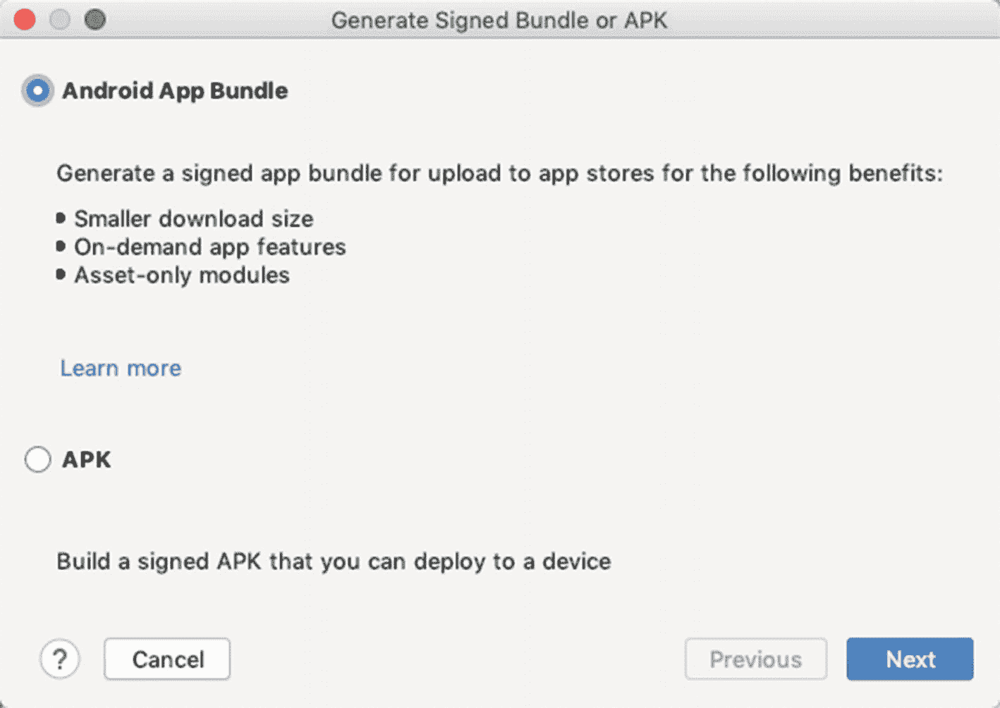
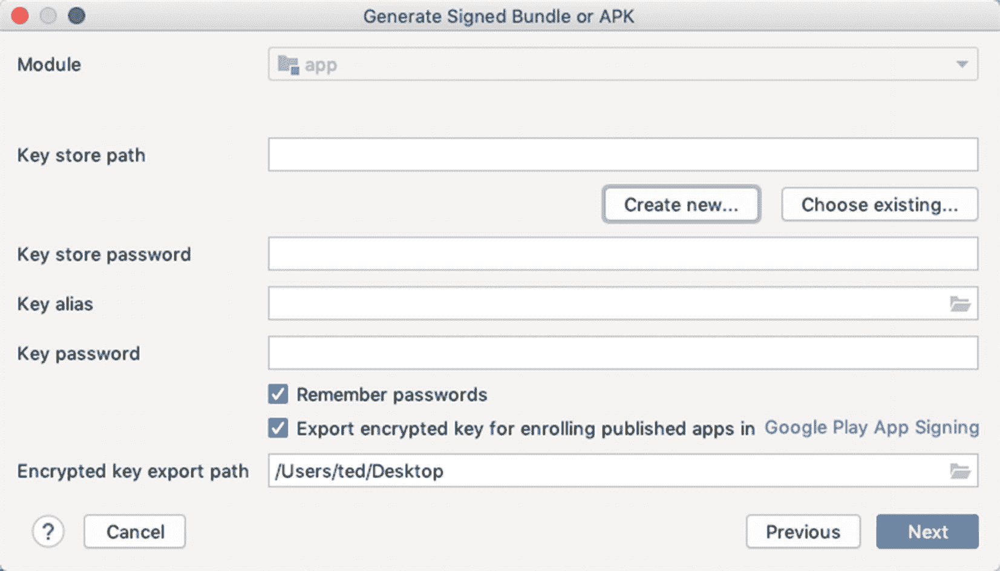
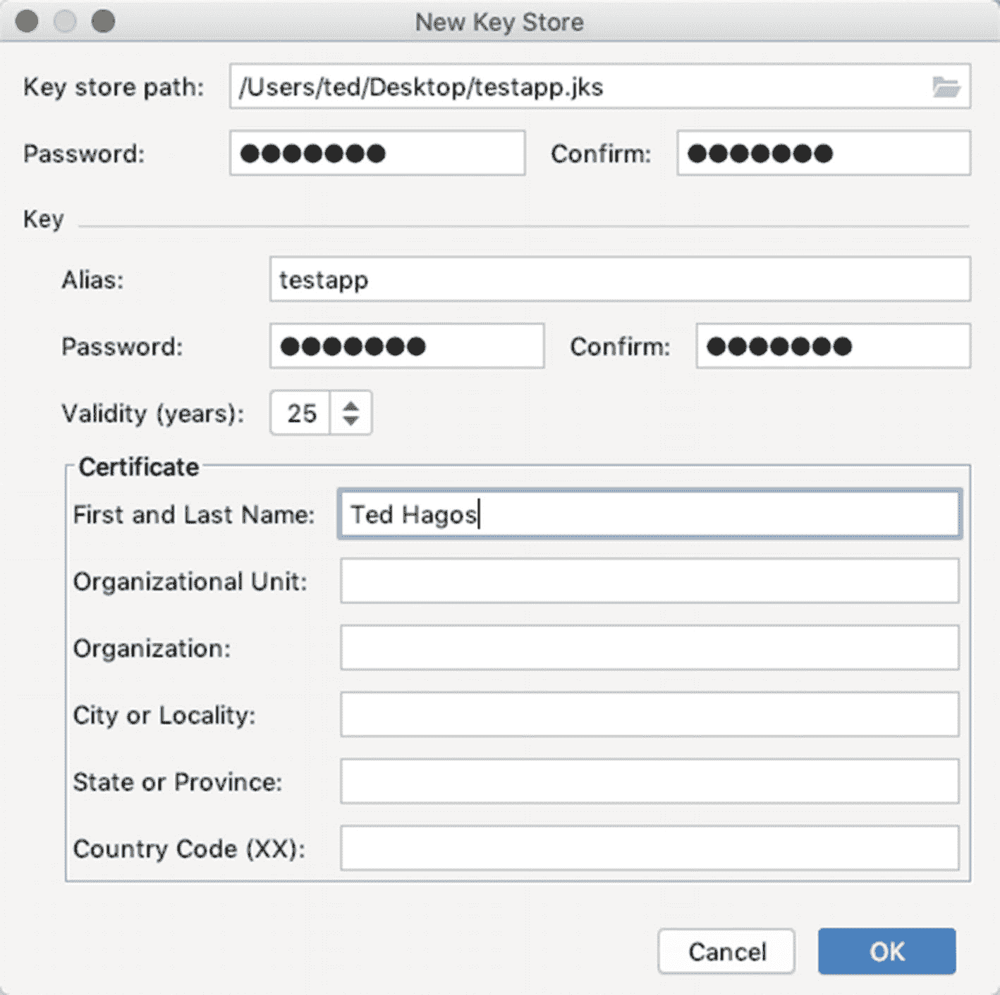
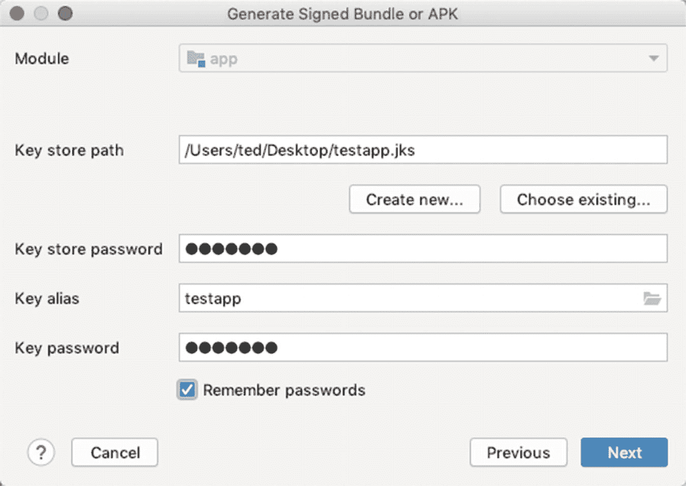
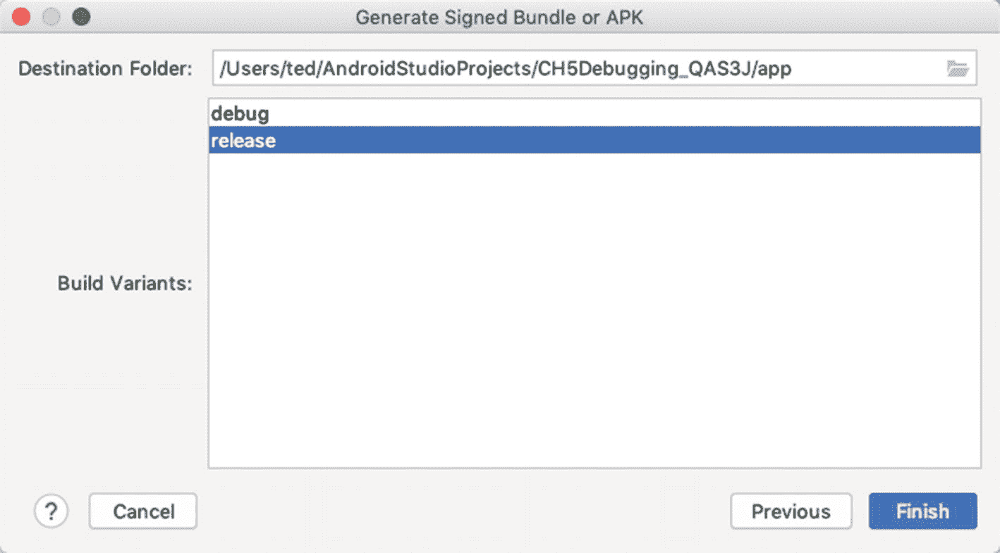
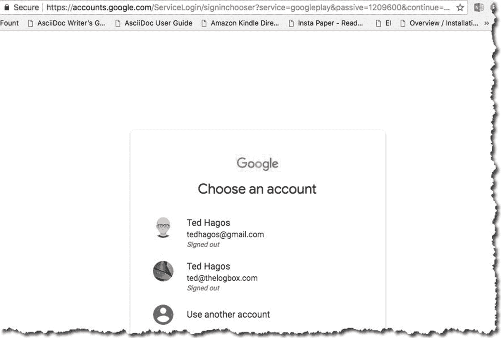
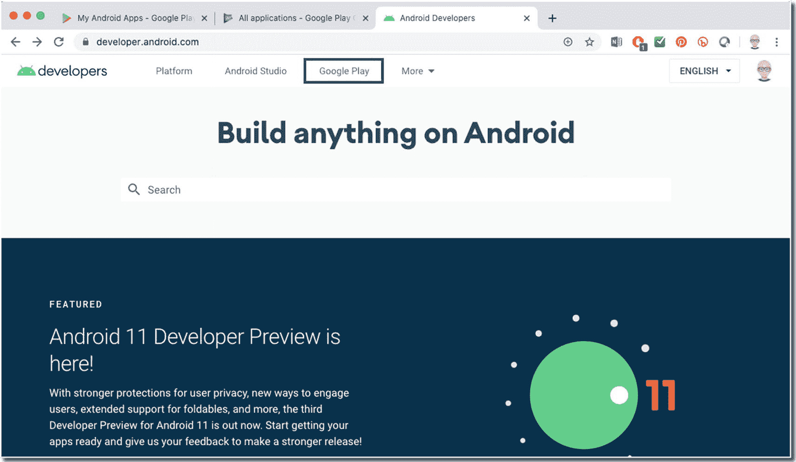
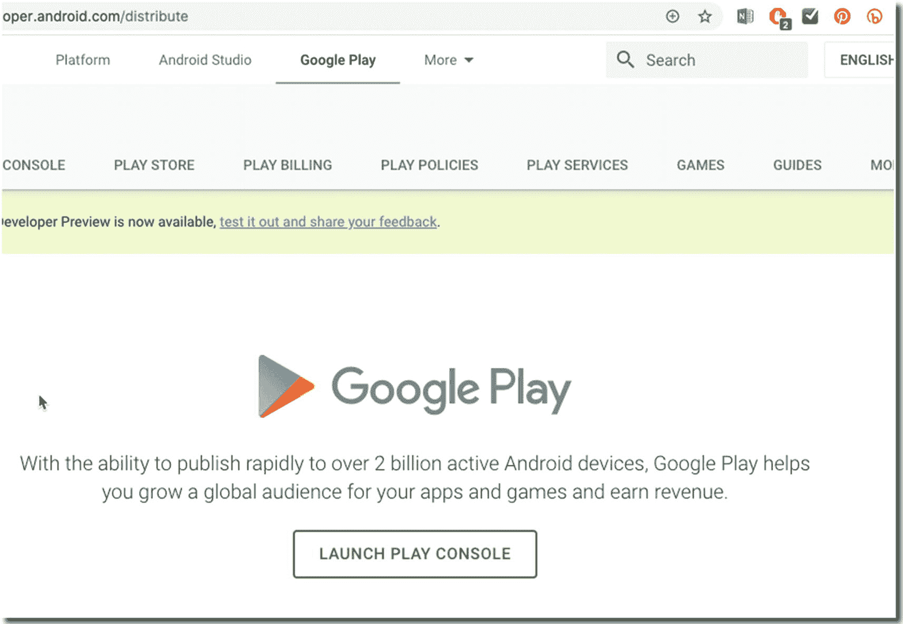
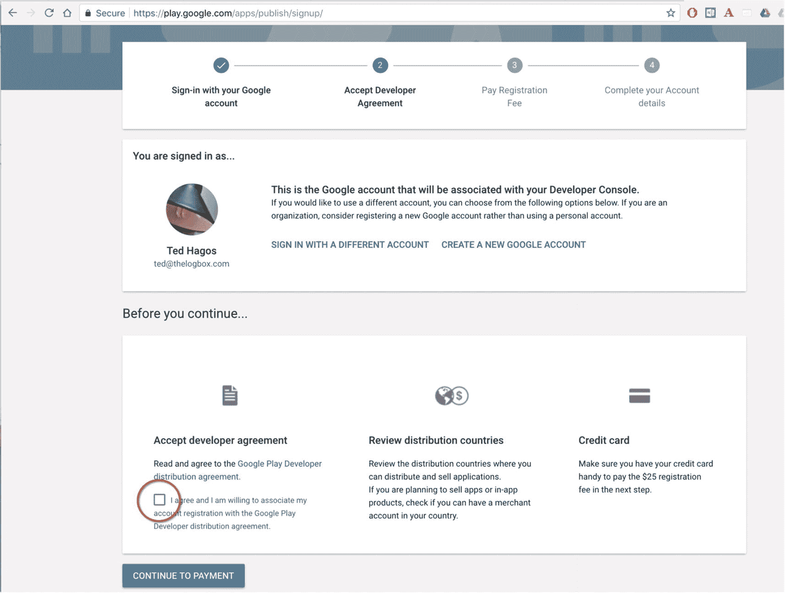
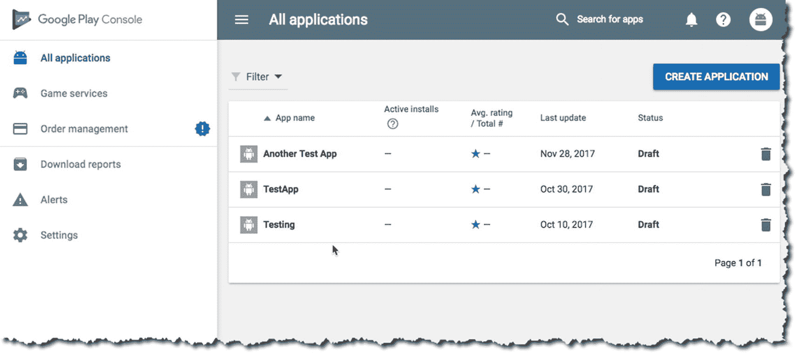

# 17. 发布应用

*本章将涵盖：*

*   发布前的准备
*   为应用签名
*   Google Play
*   App bundle

您可以相当自由且不受太多限制地分发您的应用；您可以让用户从您的网站、Google Drive、Dropbox 等渠道下载。如果您愿意，甚至可以直接通过电子邮件将应用发送给用户；但许多开发者选择在 Google 或 Amazon 等市场上发布应用，以最大限度地扩大覆盖面。将应用发布在可信的数字市场上的另一个原因是，这些市场是值得信赖的。当应用不是从可信来源下载时，它不能立即使用；用户会收到一个通知，提示该应用并非来自可信来源。

在本章中，我们将讨论将您的应用发布到 Google Play 所需完成的工作。

## 准备发布应用

在向公众发布应用时，您需要注意以下几件事：

1.  准备发布所需的材料和素材
2.  配置应用以进行发布
3.  构建一个可以发布的应用

### 准备发布材料和素材

您的代码很优秀，您甚至可能认为它很巧妙，但用户永远看不到。用户看到的是您的 `View` 对象、图标和其他图形素材。您应该完善它们。

如果您认为应用的图标无关紧要，那可能是个错误。图标有助于用户在主页屏幕上识别您的应用。这个图标还会出现在启动器窗口和下载区域等其他位置，更重要的是，它会出现在发布应用的商店中。在为用户建立对应用的第一印象时，应用图标起着很大的作用。在此方面投入一些精力并阅读 Google 关于图标的指南是个好主意；您可以访问 [`http://bit.ly/androidreleaseiconguidelines`](http://bit.ly/androidreleaseiconguidelines) 了解相关信息。顺便，也请访问 [`https://romannurik.github.io/AndroidAssetStudio/`](https://romannurik.github.io/AndroidAssetStudio/)——在为您的小应用程序生成素材时，这个资源能为您节省大量时间。

您还需要关注图形素材，如屏幕截图和宣传文案的文本。请务必阅读 Google 关于图形素材的指南；您可以在此处阅读： [`http://bit.ly/androidreleasegraphicassets`](http://bit.ly/androidreleasegraphicassets)。

### 配置应用以进行发布

1.  **检查包名**——应用开始可能只是一个练习或一次性代码，然后它逐渐发展壮大，拥有了自己的生命。您可能需要检查应用的包名。确保它不是仍然为 `com.example.myapp`。包名使应川在 Google 市场中具有唯一性；一旦您确定了包名，就无法再更改。所以，请三思而后行。您已经知道如何更改它；我们在 Gradle 章节中已经讲过，还记得吗？

2.  **处理调试信息**——确保清单文件中 `<application>` 标签内的 `android:debuggable` 属性已被移除；您只需要检查一下，因为当您将模式更改为“release”时，Android Studio 会自动将其移除。

3.  **移除 Log 语句**——不同的开发者有不同的做法。有些人会遍历代码并手动（痛苦地）删除语句。有些人会编写 `sed` 或 `awk` 程序来剥离日志语句。有些人会使用 `ProGuard`，还有其他人会使用像 `Timber` 这样的第三方工具来处理日志记录活动。使用哪种方法由您决定；但请确保您的用户不会意外看到日志信息——如果您还没想好，我强烈建议您尝试一下 `Timber`。

4.  **检查应用的权限**——在开发过程中的某个时候，您可能测试了应用的某些功能，并且可能在清单文件中设置了权限，例如使用网络、写入外部存储的权限等。请检查清单文件中的 `<uses-permission>` 标签，确保没有授予应用不需要的权限。

5.  **检查远程服务器和 URL**——如果您的应用程序依赖于 Web API 或云服务，请确保应用的发布版本使用的是生产环境的 URL，而不是测试路径。在开发过程中，您可能获得了沙盒环境和测试 URL；您需要将它们切换为生产版本。

### 构建一个可供发布的应用程序

在开发过程中，`Android Studio` 为你处理了不少事务；它负责：

1.  创建调试证书
2.  将所有项目资产、配置文件和运行时二进制文件组装成一个 `APK`
3.  使用调试证书为 `APK` 签名
4.  将 `APK` 部署到模拟器或连接的设备上

所有这些操作都在后台完成；你只需编写代码，无需操劳其他事情。而现在，你需要亲自处理这个证书了。`Google Play` 及其他类似的应用市场不会分发使用调试证书签名的应用。这需要一个正式的证书。你无需像 `Thawte` 或 `Verisign` 这样的证书颁发机构；一个自签名证书就足够了。

在接下来的步骤中，我们将生成一个签名的软件包或 `APK`。你已经知道 `APK` 是什么——它是包含你应用程序的包，也是你要上传到 `Google Play` 的文件。而软件包（Bundle）则与 `APK` 非常相似，但它是一种较新的上传格式。与 `APK` 一样，它也包含你应用程序的所有编译代码和资源，但它推迟了 `APK` 的生成。这是一种名为 `Dynamic Delivery` 的新型应用服务模型。它利用你的应用程序包，为每个用户的设备配置生成并提供优化的 `APK`——这样用户只需下载运行应用所需的代码和资源。你不再需要构建、签名和管理多个 `APK`。

在 `Android Studio` 中，生成 `APK` 和软件包的步骤几乎相同。在接下来的步骤中，我们将演示如何生成软件包和 `APK`。

启动 `Android Studio`（如果尚未打开）。打开项目，然后从主菜单栏导航到 **构建(Build)** ➤ **生成签名软件包或 APK(Generate Signed Bundle or APK)**，如图 17-1 所示。

图 17-1 生成签名的 APK

选择 **软件包(Bundle)** 或 **APK**，然后点击 **下一步(Next)**；在此示例中，我选择创建一个软件包。点击 **下一步(Next)** 后，你将看到“密钥库(Keystore)”对话框，如图 17-2 所示。

图 17-2 密钥库对话框

**密钥库路径(Key store path)** 询问的是你的 Java 密钥库 (`JKS`) 文件位置。此时，你还没有这个文件。因此，请点击 **创建新密钥库(Create New)**。你将看到用于创建新密钥库的对话框窗口，如图 17-3 所示。

图 17-3 新密钥库

表 17-1 展示了密钥库输入项的说明。

表 17-1 密钥库项目与说明

| 密钥库项目 | 说明 |
| --- | --- |
| `密钥库路径(Keystore path)` | 你希望存储密钥库的位置。这完全由你决定。请务必记住此位置 |
| `密码(Password)` | 这是密钥库的密码；不要丢失，并确保记住它——否则，你需要创建另一个密钥库文件 |
| `别名(Alias)` | 此别名用于标识密钥。它只是一个友好的名称 |
| `(密钥)密码((Key) Password)` | 这是密钥的密码。这与密钥库的密码**不同**（但如果你愿意，也可以使用相同的密码） |
| `有效期(年)(Validity, in years)` | 默认是 25 年；你可以接受默认值。如果你在 `Google Play` 上发布，证书必须在 2033 年 10 月之前有效——所以 25 年应该没问题 |
| `其他信息(Other information)` | 只有姓名(First and Last name)字段是必填的 |

填写完**新密钥库(New Key Store)**对话框后，点击 **确定(OK)**。这将使你返回到**生成签名软件包或 APK(Generate Signed Bundle or APK)** 窗口，如图 17-4 所示；但现在，`JKS` 文件已创建，并且**密钥库(Keystore)** 对话框中已填充了该文件。

图 17-4 填充后的“生成签名软件包或 APK”窗口

点击 **下一步(Next)**。现在我们选择签名软件包的目标位置，如图 17-5 所示。

图 17-5 签名的 APK，APK 目标文件夹

你需要记住“目标文件夹(Destination Folder)”的位置，如图 17-5 所示。这是 `Android Studio` 将存储签名软件包的地方。同时，请确保 **构建类型(Build type)** 设置为“release”。

当你点击 **完成(Finish)** 时，`Android Studio` 将为你的应用生成签名的软件包。这就是你将提交给 `Google Play` 的文件。

## 发布应用

在你可以向 `Google Play` 提交应用之前，你需要一个开发者账户。如果你还没有账户，可以在 [`https://developer.android.com`](https://developer.android.com) 注册。对于接下来的操作，我需要做一些假设。我假设：

1.  你已经拥有一个 Google 账户 (`Gmail`)。
2.  你正在使用 `Google Chrome` 访问 [`https://developer.android.com`](https://developer.android.com)。
3.  你的 Google 账户已登录到 `Chrome`。

如果你的 Google 账户未登录 `Chrome`，你可能会看到类似图 17-6 的提示。`Chrome` 会要求你选择一个账户（或创建一个账户）。

图 17-6 选择一个账户

当你处理好 Google 账户后，你将被带到 [`https://developer.android.com`](https://developer.android.com) 网站，如图 17-7 所示。

图 17-7 Android 开发者网站

点击 **Google Play**，如图 17-7 所示。

点击 **启动 Play 管理中心(Launch Play Console)**，如图 17-8 所示。

图 17-8 启动 Play 管理中心

你需要完成四个步骤来完成注册（如图 17-9 所示）：

图 17-9 Google Play 管理中心，注册

1.  使用你的 Google 账户登录。
2.  接受开发者协议。
3.  支付注册费。
4.  完善你的账户详细信息。

完成注册和一次性付费后，你将可以访问 `Google Play 管理中心`，如图 17-10 所示。

图 17-10 Google Play 管理中心

在这里，你可以开始将应用提交到商店的流程。点击“创建应用(Create Application)”按钮开始操作。

### 摘要

- 在用户能够体验您的应用之前，他们会首先看到图标和其他图形资源——请确保这些图形资源与您的代码一样精致。
- 在构建发布版本之前，请从代码中移除所有调试信息和日志语句。
- 对自己的代码进行审查。如果有朋友或其他人能与您一同审查代码，效果会更好。如果您的应用使用了服务器、`RESTful URL` 等，请确保它们已准备好用于生产环境，而非沙箱。
- 在将应用上传到 `Google Play` 之前，您需要使用正确的证书对应用进行签名。
- 如果您想在 `Google Play` 上销售应用，则需要一个 `Google Play` 账户。我支付了一次性费用 `25 USD`，但那是几年前的事了。
- 不要忘记在真实设备上测试您的应用。

