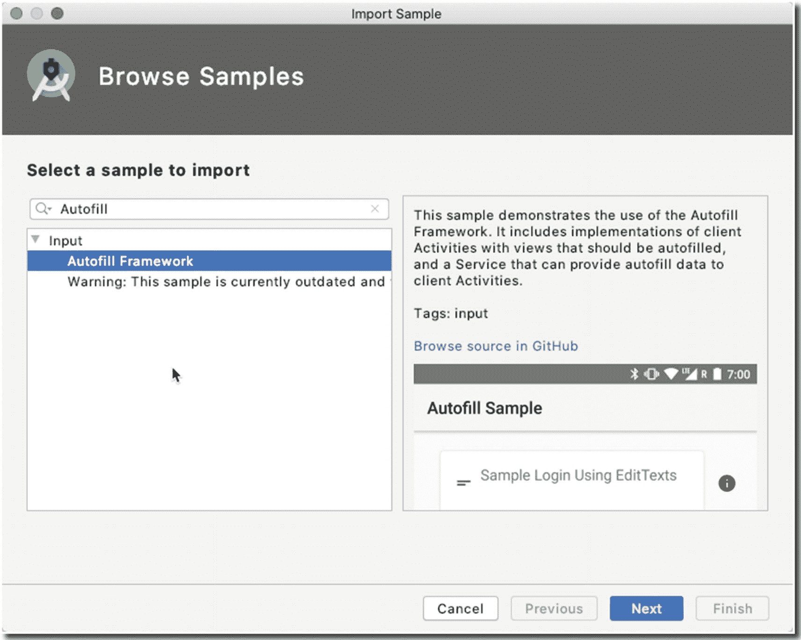
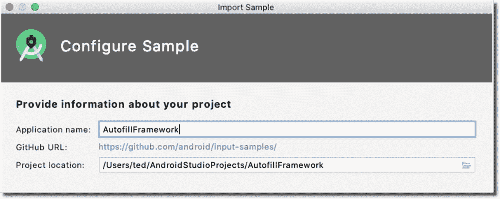
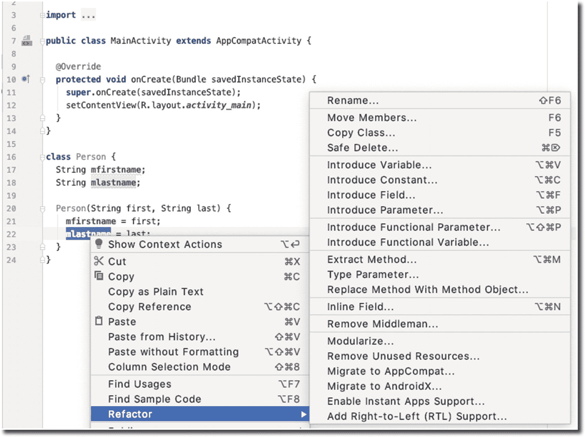
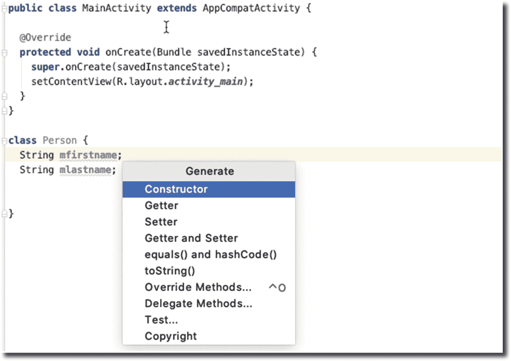
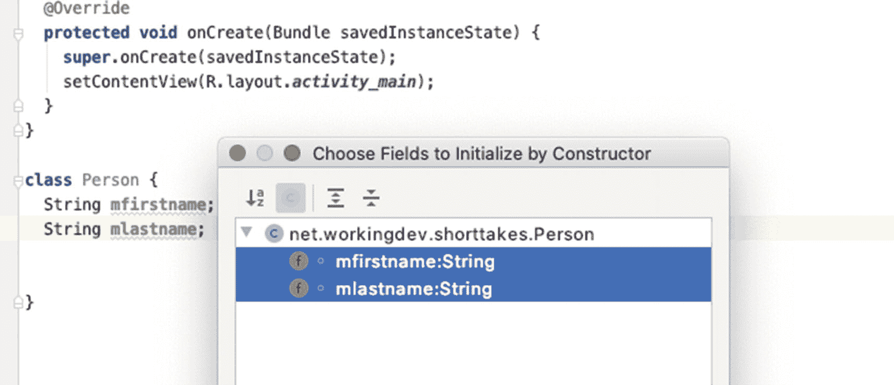
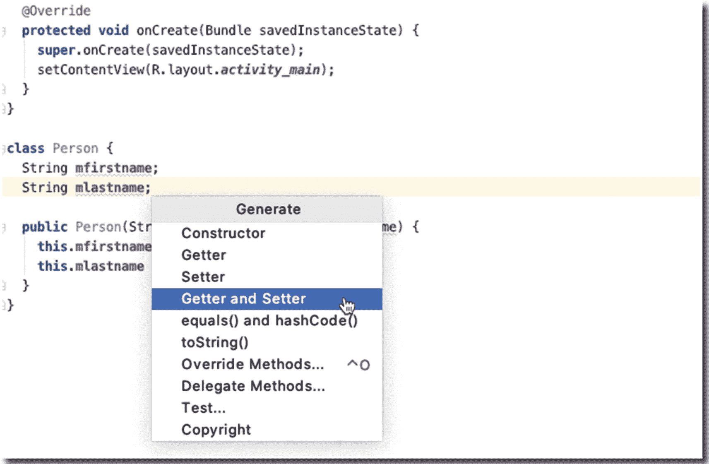
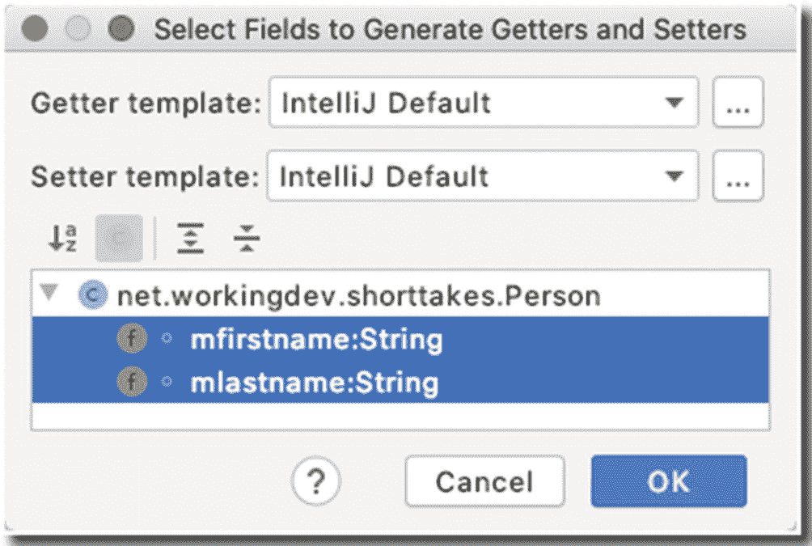
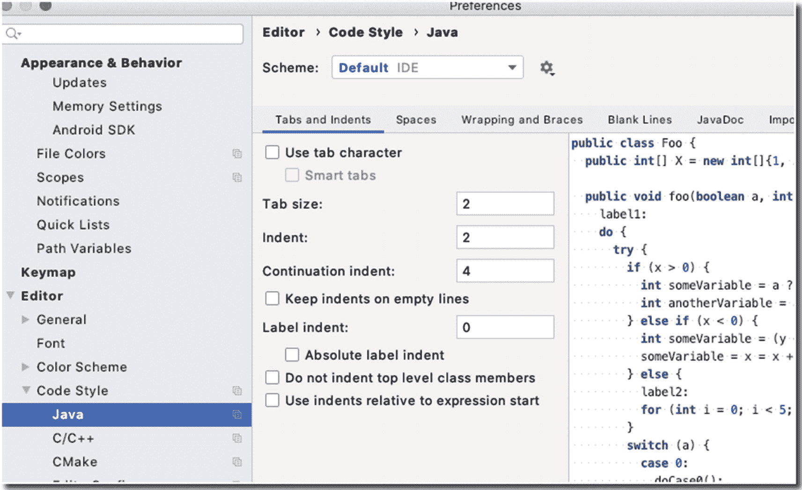
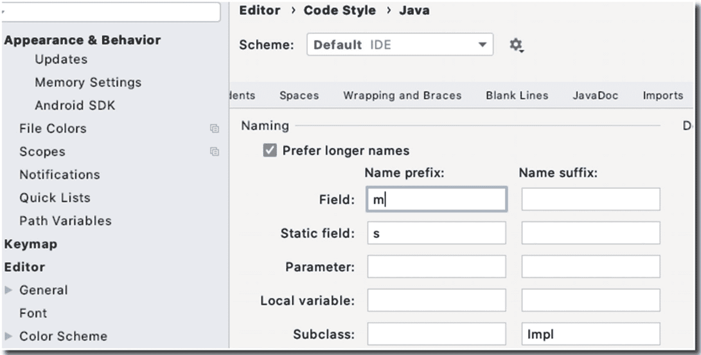
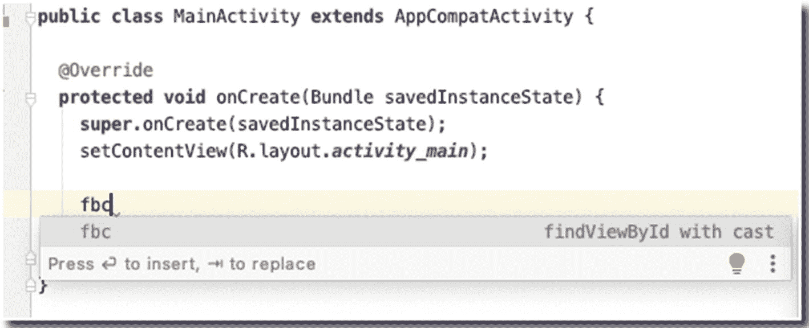

# 18. 简短说明

*本章涵盖的内容：*

- 如何导入示例代码
- 重构
- 代码生成器
- 动态模板
- 代码编辑器偏好设置
- 键盘快捷键

我们已接近本书的尾声，但在结束之前，我想指出 `Android Studio` 的一些功能，它们能让编码生活轻松一些。

## 生产力特性

我们通常所说的生产力，是指希望在尽可能短的时间内完成需要做的事情；这意味着要使用键盘快捷键、模板、代码片段等。在本节中，我们将一窥 `Android Studio` 提供的一些功能，以提升我们的生产力。我们不会深入细节，这并非目的，而是向您展示有哪些可用的功能。

### 导入示例

提高生产力的关键部分是学习如何创建事物并了解它们在 `Android` 中的工作原理。因此，我们的第一个生产力技巧是学习如何使用“导入示例”功能。您可以通过主菜单栏**文件** ➤ **新建** ➤ **导入示例**访问此功能。图 `18-1` 显示了“导入示例”屏幕。



**图 18-1** 导入示例

您在 `18-1` 中看到的是一个代码示例列表，您可以浏览这些示例，也可以将其作为本地项目创建。

假设我想了解 `Autofill Framework` 的一些知识——如图 `18-1` 所示，您可以预览其外观，还可以点击“在 GitHub 上浏览源代码”链接。当您点击**下一步**时，会看到一个与创建新项目时类似的对话框，如图 `18-2` 所示。



**图 18-2** 导入示例，下一个窗口

如果您在“导入示例”对话框中点击**完成**，`Android Studio` 将在本地创建一个新项目，并从 `GitHub` 下载示例文件，以便您可以更仔细地查看并立即开始工作。

## 重构

重构基本上是在不创建新功能的情况下重写和改进源代码；这种做法有助于使代码保持 `SOLID` 和 `DRY`（不要重复自己）原则，从而更易于维护。

> **注意**
> 我将 `SOLID` 全部大写，因为它也是一个缩写，代表**S**ingle Responsibility（单一职责）、**O**pen-Closed Principle（开闭原则）、**L**iskov Substitution Principle（里氏替换原则）、**I**nterface Segregation（接口隔离）和**D**ependency Inversion Principle（依赖反转原则）——这些是面向对象设计的原则，由 Robert C. Martin 推广。

`Android Studio` 具有一些漂亮的重构功能。开始使用很简单；只需选择一段您想要重构的代码，然后使用上下文相关的右键菜单，如图 `18-3` 所示。另外，您也可以使用键盘快捷键——macOS 上为**Ctrl + T**，Windows/Linux 上为**Ctrl + Alt + Shift + T**。



**图 18-3** 重构

我相信您之前已经多次进行过重构，但让我们在此简单回顾一下。

- **重命名**——这允许您安全地重命名变量和其他标识符等。您应该使用此功能而不是查找和替换。它适用于整个项目，而不仅仅是当前文件。
- **更改签名**——这允许您更改方法，无论是其名称还是参数。它也可以在类级别工作，例如，您可以将一个类转换为泛型类型并操作类型参数。
- **移动**——移动一个元素；如果需要，您可以将一个方法移动到另一个类。
- **复制**——允许您复制元素，例如当前选中的类。
- **安全删除**——如果您需要删除某些内容，`Android Studio` 将验证您要删除的内容在代码库中是否未被其他任何地方使用。如果正在使用，系统会提示您，以便在实际删除重要内容之前处理这些问题。
- **提取常量**——避免使用硬编码的值。硬编码会使程序在以后需要更改值时难以修改。重构的提取选项不仅适用于常量，您还可以提取字段、方法、超类、变量、参数和接口。

重构菜单中还有更多选项；请务必查看其他功能。


### 生成

Android Studio 另一个省时的功能是代码生成器；它名副其实，因为它完全符合你的预期——它会生成代码。我们举个例子；图 18-4 显示了鼠标光标位于 `Person` 类定义内部。当光标位于类体内时，启动生成器操作；从主菜单栏中，转到**代码** ➤ **生成**。



图 18-4 生成

如图 18-4 所示，选择“构造函数”。如果你在类中有成员变量（我在 `Person` 类中就有），Android Studio 会提供初始化这些变量的选项。在我们的示例中，我选择初始化两个成员变量，如图 18-5 所示。



图 18-5 选择要初始化的字段

如你所见，你可以生成大量样板代码。当你选择任意生成选项时，Android Studio 都会生成一个通用的代码存根。

让我们生成更多代码；这次，我们选择**getter 和 setter**。像之前一样再次进入生成对话框；顺便说一句，你也可以使用键盘快捷键（macOS 上为 **Command + N**，Linux 或 Windows 上为 **Alt + Insert**）打开生成对话框。图 18-6 再次显示了生成对话框。



图 18-6 生成 getter 和 setter

在接下来的窗口中，选择要为其生成 getter 和 setter 的字段，如图 18-7 所示。



图 18-7 选择用于 getter 和 setter 的字段

生成器对话框显示了 `Person` 类中所有自动检测到的字段。它向我们显示了 `mFirstname` 和 `mLastname` 成员变量；它还允许你进行多项选择。选择这两个成员变量并单击“确定”。代码清单 18-1 展示了代码生成后的 `Person` 类。

```
class Person {
    String mfirstname;
    String mlastname;
    public Person(String mfirstname, String mlastname) {
        this.mfirstname = mfirstname;
        this.mlastname = mlastname;
    }
    public String getMfirstname() {
        return mfirstname;
    }
    public void setMfirstname(String mfirstname) {
        this.mfirstname = mfirstname;
    }
    public String getMlastname() {
        return mlastname;
    }
    public void setMlastname(String mlastname) {
        this.mlastname = mlastname;
    }
}
```

代码清单 18-1 Person 类

这已经很简洁了。任何能让我们减少按键次数的事情都是好事。我猜你可能对这个示例只有一个可挑剔的地方；方法命名不正确。你可能更倾向于调用 `setLastname()` 而不是 `setmLastname()`，不是吗？我们将在下一节中修复这个问题。

### 编码风格

如果你进入 Android Studio 的偏好设置或设置，然后转到**编辑器** ➤ **代码风格** ➤ **Java**，你会发现有很多关于编辑器行为的内容可以更改。图 18-8 展示了代码风格的选项，特别是针对 Java 语言。



图 18-8 偏好设置，代码风格，Java

如果你想更改制表符和缩进的空格数，可以在“制表符和缩进”区域中进行设置；请务必查看此对话框中的其他选项。我想做的是转到“代码生成”选项卡（如图 18-9 所示）。



图 18-9 代码生成

在这里，我们可以告诉 Android Studio 我们如何命名变量。如果你回到代码清单 18-1，你会注意到我倾向于为变量添加 `m` 前缀，比如 `mLastname` 和 `mFirstname`。最初，Android Studio 并不知道这一点；这就是为什么当我为成员变量生成一些 getter 和 setter 时，它给出了 `setmLastname()` 而不是 `setLastname()`。

> **注意：** 在成员变量前加 `m` 前缀源自 AOSP（Android 开源项目）。我在这里使用它，是因为你在网上会看到很多示例代码都遵循这个约定。你可以在此处进一步了解它：[`https://bit.ly/styleguideaosp`](https://bit.ly/styleguideaosp)。

为了告诉 Android Studio 我为变量添加了 `m` 前缀，我会将 `m` 放入**字段**的**名称前缀**中，如图 18-9 所示。完成后单击“确定”。现在，如果我生成一些 getter 和 setter，我们将得到更合适的方法名称。

## 动态模板

Android Studio 另一个省时的功能是动态模板；如果你使用过一些文本扩展应用程序，它们的工作原理非常相似。基本思想是，当你输入一系列字符时，例如 `datetoday`，编辑器会将其替换为当天的实际日期文本——这就是动态模板的工作原理。

如果你过去做过一些 Android 编程，你可能至少犯过这个错误一次：

```
Toast.makeText(MainActivity.this, "no show");
```

上面的代码片段不会生效，因为 (1) `makeText()` 的第三个参数缺失，并且 (2) 实际上必须调用 `show()` 方法才能让 `Toast` 显示出来。这很容易发现，但其他一些错误可能就没那么明显了。无论如何，动态模板可以帮助你避免这些麻烦。动态模板是以代码补全选项形式显示的快捷方式；例如，尝试在 `onCreate` 方法内输入 `fbc`，如图 18-10 所示。



图 18-10 动态模板示例

你将看到代码补全选项；尝试按 ENTER 或 TAB 键来完成操作。

一些常用的内置模板列于表 18-1 中。

**表 18-1** 常用动态模板

| 缩写 | 描述 | 代码 |
| --- | --- | --- |
| `fbc` | 通过带类型转换的 ID 查找视图 | `($cast$) findViewById(R.id.$resId$);` |
| `const` | 定义一个 Android 风格常量 | `private static final int $name$ = $value$;` |
| `toast` | 创建一个新的 Toast | `Toast.makeText($classname$.this, "$text$").show();` |
| `fori` | 创建 for 循环 | `for(int $INDEX$ = 0; $INDEX$ < $LIMIT$; $INDEX++$) { $END$ }` |

请确保你查看了其他动态模板；进入“设置”或“偏好设置”窗口。如果你使用 Windows 或 Linux，请转到主菜单栏，然后选择**文件** ➤ **设置** ➤ **编辑器** ➤ **动态模板**；如果你使用 macOS，则选择**Android Studio** ➤ **偏好设置** ➤ **编辑器** ➤ **动态模板**——你甚至可以在那里创建自己的动态模板。


## 重要快捷键

Android 开发者网站维护了一个页面，你可以在其中找到 Android Studio 的快捷键；地址是 [`http://bit.ly/androidstudiokbshortcuts`](http://bit.ly/androidstudiokbshortcuts)。你真的应该认真阅读那个页面；但在结束本章之前，我想向你介绍六个我觉得非常实用的快捷键——它们可能对你也有用。表 18-2 列出了这些快捷键。

**表 18-2** 一些有用的快捷键

| 快捷键 | 功能说明 |
| --- | --- |
| 按 `Shift` 两次 | 允许你在所有位置搜索内容。它会搜索资源文件夹、gradle 文件、图片资源、代码、xml 配置文件等。如果你不知道要搜索哪个文件夹，直接使用这个即可 |
| `Ctrl + Space` &#124; `Command + Space` | Android Studio 已有代码补全和代码提示功能；这只是额外的补充。如果你忘记了某个需要大量参数的方法的参数，可以使用此快捷键预览该方法的全部变体及其期望的对应参数 |
| `Alt + Insert` &#124; `Command + N` | 我们在上一节生成代码时使用过这个。这是代码生成器的快捷键 |
| `Ctrl + O` &#124; `Command + O` | 当你想重写方法时，使用此快捷键 |
| `Ctrl + -` &#124; `Command + -` | 你可以用它来展开或折叠代码块。在处理大型代码库时，能够折叠代码非常方便；在折叠/展开代码块时，这个快捷键能让你的工作更轻松 |
| `Ctrl + Alt + L` &#124; `Command + Option + L` | 不要手动缩进或重新缩进代码——如果你搞乱了 `for` 循环或嵌套条件块的缩进，只需高亮选中代码块，然后使用此快捷键 |

## 总结

- 使用代码生成器可以避免编写样板代码，例如构造函数、getter 和 setter 等。
- Android Studio 提供了大量重构辅助工具；在使用 `查找/替换` 菜单之前，请考虑使用重构选项。
- 动态模板就像文本展开器；它们可以节省你的时间，并帮助你避免常见的编码错误——你应该使用它们。
- 你可以控制 Android Studio 编辑器的行为；前往 `设置` 或 `偏好设置`，然后选择 **编辑器** ➤ **代码样式**。


