# 2. 探索 HomeKit 世界

从 iOS 10（2016 年秋季发布）开始，HomeKit 有了一个供用户控制其 HomeKit 世界的应用程序。自 2014 年宣布以来的几年里，苹果一直在构建 HomeKit 的基础设施——开发者使用的应用程序编程接口（API）、HomeKit 开发者和用户共享的术语（家庭、房间、场景和电器）、第三方支持 HomeKit 的产品，以及最重要的，即 HomeKit 如何融入普通人所在的现实世界的理念。这些不同的线索（API、第三方产品、术语和认知）在“家庭”应用中汇聚在一起。

在安装了 iOS 10 之后（无论是通过购买预装该系统的新设备，还是从 App Store 下载），你会像图 2-1 所示在主屏幕上找到它。

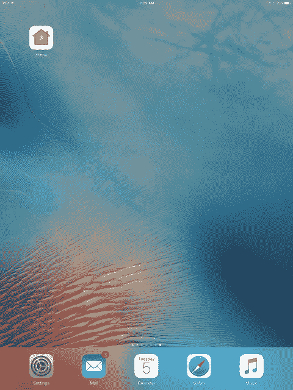

图 2-1. 主屏幕上的“家庭”应用

正如你将在本章中看到的，有了“家庭”应用，你就上路了。

## 配置你的 HomeKit 环境

`家庭` 为你提供了 HomeKit 的集中控制——你的家庭、其中的房间以及你的配件（如车库门和灯等设备）。你的家庭以及所有配件都由一个或多个始终连接电源和互联网的集中设备控制。这些设备被称为 `家庭中枢`。其中之一通常是 Apple TV；你也可以使用家里的 iPad。无论你使用哪个设备（或两者都使用），HomeKit 都基于两个假设。

第一个假设是 Apple TV 或 iPad 始终通电并保持唤醒状态（你将看到如何使用本章末尾显示的设置来保持 Apple TV 唤醒）。通常，这依赖于直接连接电源（通俗地说就是插座）。对于 iPad，可能依赖于电池。对于 Apple TV 和 iPad，你可能在设备本身并不知晓的电池电源上运行。例如，如果你有自己的备用电源系统，当电网电源不可用时，它会自动启动。这些备用设备（通常是发电机或电池供电）正变得越来越普及，价格也在下降。插入这些设备的设备通常无法知道电源是来自电网（通过墙壁插座）还是来自发电机或备用系统。

无论你的具体情况如何，HomeKit 都假设设备始终通电，以便计时器可以全天候运行。

第二个假设是你的 Apple TV 和/或 iPad 将始终有互联网连接。电源和互联网之间存在某种关联——如果你的电源中断，你的互联网连接也可能会丢失。

明智的做法是为你的电源和互联网设置自动预防措施，使其在中断时能继续运行，而现代设备也依赖于这种情况的发生——也就是说，它们依赖于你的环境提供必要的应急规划，以确保持续的电源和互联网连接。

现在来看 HomeKit 更具体的要求。

### 从 Apple ID 开始

你需要一个 Apple ID 来使用“家庭”App。Apple ID 是你的唯一标识，通常与一张有效的信用卡绑定。（在某些情况下，你可以绕过信用卡绑定——详情请参见 [`https://appleid.apple.com/cn`](https://appleid.apple.com/cn)。（请注意，此处的网址是针对美国的。请登录你所在国家的 `apple.com` 并搜索 `Apple ID`，以查找针对你所在地区的本地化信息。）

当你在“家庭”App 中创建你的“家庭”时，它是属于你个人的——也就是说，它与你的 Apple ID 相关联。在“家庭”App 中，你可以创建多个家庭、房间和配件，但它们都属于与你的 Apple ID 关联的同一个“家庭”的一部分。

许多人拥有多个 Apple ID。有时这是随着时间的推移偶然发生的，尤其是在 Apple ID 体系不断演变的过程中。其他情况下则是故意的，例如开发者和作者必须为他们用于管理应用程序和 iBooks 的账户分别使用独立的 Apple ID。

你可以使用“家人共享”功能，在多个其他家庭成员之间共享一个 Apple ID，而每个成员也都有自己的 Apple ID。“家人共享”主要是为儿童设计的，这样，组织者（作为家长或监护人的成年人）将为所有人支付账单。这使得 13 岁以下的儿童可以拥有自己的 Apple ID，并在获得许可的情况下，从家庭账户中进行购买。

如果你曾在 iTunes 或 App Store 购买过任何东西，那么你已经至少拥有一个 Apple ID。在几乎所有情况下，最好使用现有的 Apple ID 来使用“家庭”App。如果你为每种用途都创建新的 Apple ID，最终可能会弄得一团糟。

一旦你拥有了 Apple ID，并在 Apple TV 或 iPad 上安装了“家庭”App，你就可以开始使用了。

### 在 iPad 上快速开始

如果你想直接上手，以下是在 iPad 上开始使用“家庭”App 的方法。安装 iOS 10（或购买预装了该系统的 iPad）后，只需轻点“家庭”图标，如之前图 2-1 所示。

**注意**

这是你首次看到的样子。如果你之前打开过“家庭”App，你将不会看到这些步骤：别担心！此处展示的所有重要内容在“管理家庭设置”一节中也有描述。

在你第一次轻点“家庭”图标后，你会看到以下内容并执行以下操作：

1.  图 2-2 所示的屏幕是你的首次使用介绍。你只需轻点`“开始使用”`即可。

    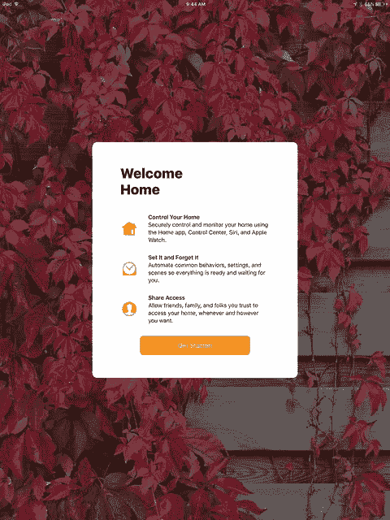
    
    图 2-2. 开始使用

2.  当你首次使用“家庭”App 时，系统会提示你允许该 App 在使用期间访问位置信息，如图 2-3 所示。你可以在不使用“定位服务”的情况下使用“家庭”的某些部分，但许多功能都依赖于你的位置，因此如果你轻点`“不允许”`，将严重限制其可用性。所以请轻点`“允许”`。（请参阅后面的提示以了解如何重置此设置。）

    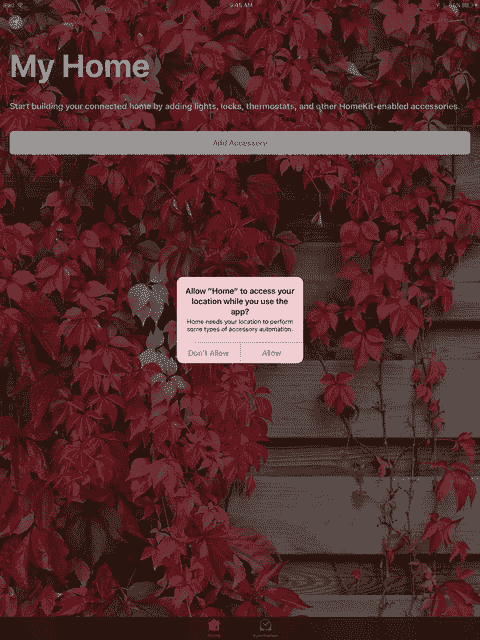
    
    图 2-3. 允许访问位置信息

3.  处理完“定位服务”后，你便进入了主界面，如图 2-4 所示。

    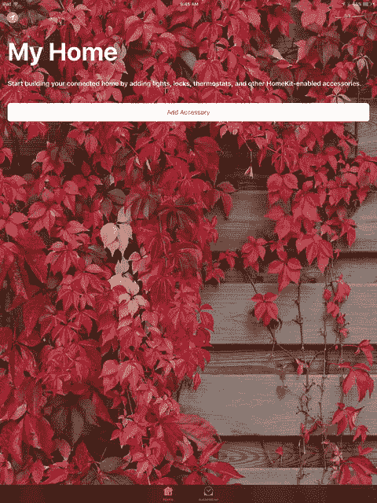
    
    图 2-4. 开始使用“家庭”App

此时你就可以探索“家庭”App 了，但如果你能抵制住直接上手的诱惑，第 3 章将为你提供一次导览。下面是一个预览以吊起你的胃口（它还能帮助你更好地在“家庭”App 中导航）。在图 2-4 所示的屏幕底部，注意带有两个标签页的标签栏：“家庭”和“自动化”。轻点“自动化”以预览即将推出的功能，如图 2-5 所示。

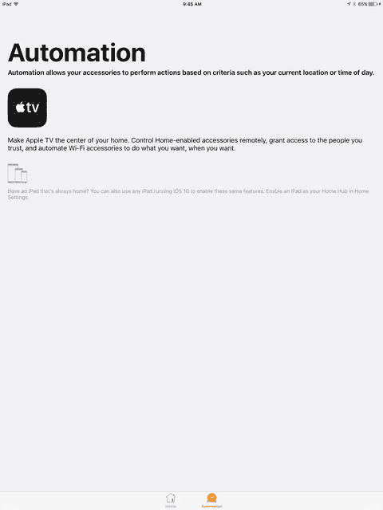

图 2-5. 预览“家庭”App 中的自动化功能

你随时可以使用底部的标签栏在“家庭”App 的不同区域之间切换。

### 管理家庭设置

与大多数 iOS 应用程序一样，你可以使用主屏幕上的“设置”来管理应用程序的设置。某些设置在此处设置，其他设置则在应用内部设置。“设置”通常管理最通用的设置，以及那些可以（有时必须）在应用外部进行设置的选项。

**提示**

关于应用内设置与“设置”应用设置的一个示例通常是 iCloud 的使用。当你首次运行一个启用了 iCloud 的应用时，通常会被询问是否要使用 iCloud。如果你之后想更改这个决定，你需要在“设置”中，而非应用内进行更改。这种结构使得当你为该应用打开或关闭 iCloud 时，应用能够进行必要的内部调整。以这种方式操作意味着，切换到或从 iCloud 切换出来的实际工作可以在后台完成，而不是在应用内。这也意味着，即使应用未运行，你也可以进行 iCloud 的开启或关闭操作。

1.  在你的 iPad 上，轻点`“设置”`，然后从内置应用列表中选择`“家庭”`，如图 2-6 所示。

    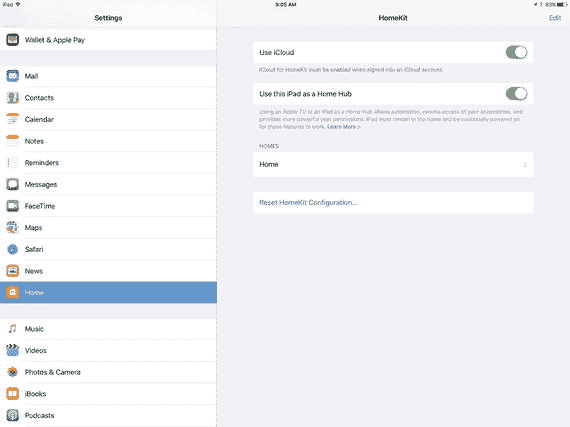
    
    图 2-6. 在“设置”中选择“家庭”
    
    你可能希望在将来的某个时候为“家庭”使用 iCloud，所以不妨在此处将其打开。请记住，你需要一个用于 iCloud 的 Apple ID。这个 ID 应该与你用于“家庭”的 Apple ID 相同。

2.  你也可以利用此机会，将你正在使用的设备（iPad 或 Apple TV）指定为家庭中枢，请记住你可以拥有多个家庭中枢。

3.  你可以从单个“家庭”开始，如图 2-6 所示。

4.  你可以轻点展开三角形以进一步配置它，如图 2-7 所示。

    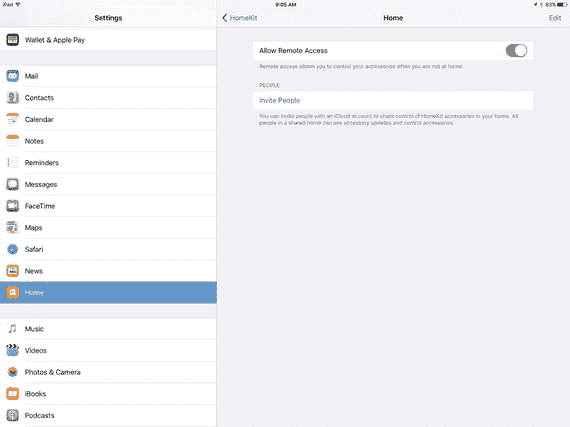
    
    图 2-7. 配置一个“家庭”

5.  请注意，你始终可以使用图 2-6 底部显示的按钮，选择完全重新开始。这将弹出如图 2-8 所示的警告。

    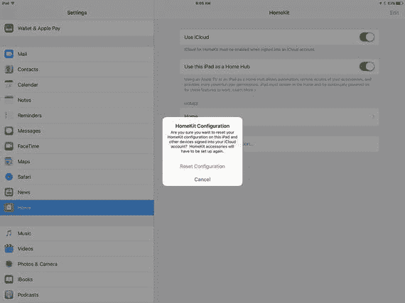
    
    图 2-8. 你始终可以重置“家庭”

**注意**

这是重置“家庭”的方法。你也可以通过从设备中移除“家庭”来达到类似效果。与移除任何应用的情况一样，你将删除其数据。这是一种重置“家庭”的粗暴方式，绝对不推荐。

### 进入你的“家”

在你配置完“设置”后启动“家庭”App（如果你现在就这样做——请记住这是可选的），你可能会看到如图 2-9 所示的基本屏幕。

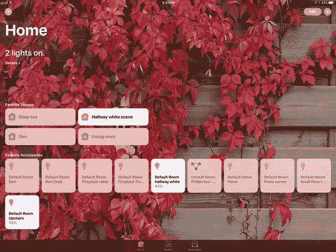

图 2-9. 探索你的“家”

这就是你在应用中看到的你的“家”。你所看到的内容将根据你的具体家庭、其房间及其电器而有所不同。你可以配置背景图像以及视图中的几乎所有内容。背景图像可以是你的家庭照片。也许你希望背景图像是从卧室窗户看到的景色。

**提示**

请记住，“家庭”（该应用程序）可以管理多个家，因此你为特定家庭选择的背景图像应该能非常清晰地提醒你这个家是什么。对于学校的宿舍房间（是的，在某些情况下，单个房间也可以是一个家），你可以选择一张校园地标的照片。对于你真正的家（正如罗伯特·弗罗斯特所写，“那个地方，当你必须去那里时，他们必须收留你”），你可以选择一张后院的照片。为什么要这样选择照片？如果你的家庭图像显示的是你的床和书桌，上面堆满了电脑、文件、午餐（午餐日期不明）等等，你可能无法快速识别出哪张照片对应的是哪个地方。

### 添加并配置家庭

您可以看到默认的家庭，并且可能已经探索过它了。现在是时候创建您自己的家庭了。要添加新家庭，请点击之前图 2-9 所示窗口左上角的箭头。您将看到如图 2-10 所示的“添加家庭”提示。

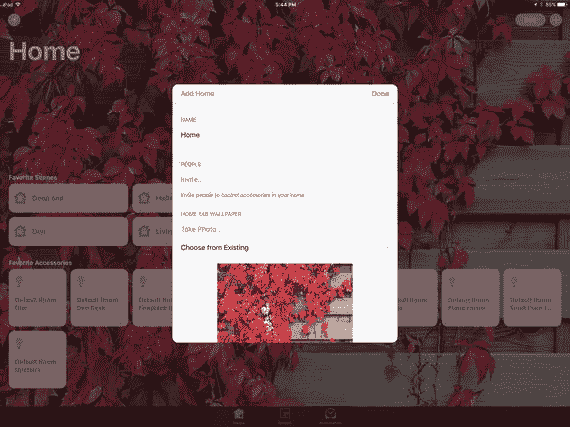

图 2-10. 添加家庭

如图 2-10 所示，您可以命名您的家庭。之后您可以邀请他人来控制家庭的配件（这将在第 3 章中讨论）。您可以为家庭墙纸拍照，或从现有图片中选择。稍后您可以返回此处重命名家庭、更改墙纸，或邀请他人控制配件。

### 编辑或添加房间

使用家庭窗口底部标签栏中的“房间”标签来查看您的房间。使用窗口左上角的列表图标查看房间选项，如图 2-11 所示。您可以配置当前查看的房间，或添加新房间。

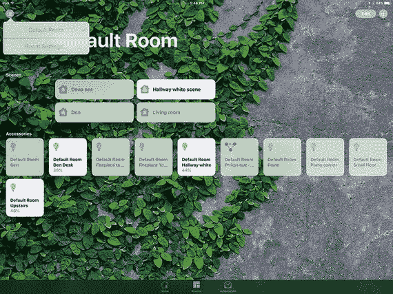

图 2-11. 管理房间

如果选择“房间设置”，您将看到如图 2-12 所示的提示，其中可以添加新房间或配置现有房间。

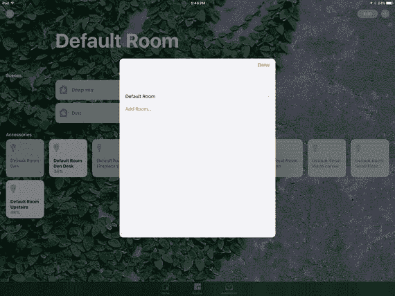

图 2-12. 添加或配置房间

请记住，默认房间的名称是“默认房间”。使用其名称右侧的展开三角形来重命名它（或任何房间）。当您点击展开三角形时，可以设置房间数据，如图 2-13 所示。

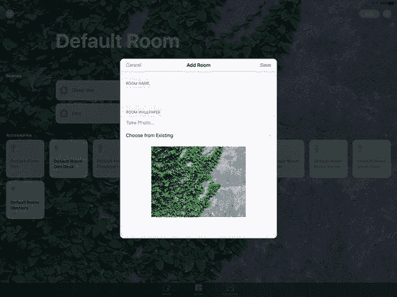

图 2-13. 配置房间

请注意这里的模式：为家庭、房间或（下一节中的）配件设置名称。从现有图片设置其墙纸或拍照。这就是常规操作：命名、墙纸、完成（右上角）或取消（左上角）。

### 添加并配置配件

配件是灯具、车库门或任何 HomeKit 可识别并控制的设备。从家庭或房间（通过屏幕底部的标签栏切换）右上角的 `+` 添加配件。图 2-14 展示了向家庭添加配件的过程。

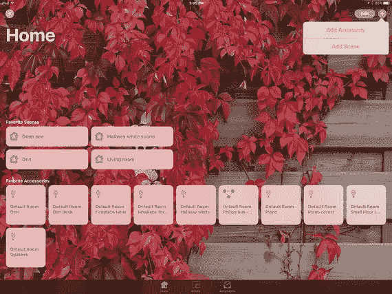

图 2-14. 添加并配置配件

注意：场景是配件与时间表的组合。您可以用它们来将家庭自动化的各个部分整合在一起。相关内容将在第 3 章讨论。

添加配件会启动一个流程，HomeKit 会搜索该配件并为其配置 HomeKit。图 2-15 显示了初始界面，第 3 章描述了后续步骤。

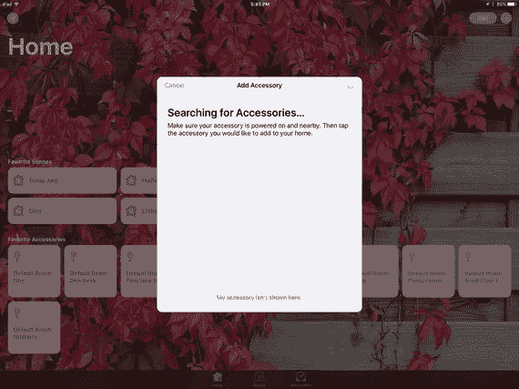

图 2-15. 开始配置配件

