# 3. 添加场景——HomeKit 的实践部分

在第 2 章中，您看到了 HomeKit 家庭非常逻辑清晰且易于识别的结构：家庭包含房间，每个房间包含配件，例如灯具、烟雾或温度传感器，以及各种各样的设备，如车库门开启器（好吧，可能不在房间内）和自动窗帘。您可以使用 HomeKit 管理所有房间和配件，将其打开或关闭，或调整其设置。您还可以使用 HomeKit 检查配件的设置，例如它们是否开启，以及它们的亮度和颜色（对于灯泡而言）。

这是一个很好的结构，也非常易于理解。随着您阅读本书的深入，您将了解如何控制这些东西，并且当您进一步阅读时，您将发现如何使它们自动化。

在许多方面，这种模式（家庭 ➤ 房间 ➤ 配件）就是您的日常生活。观察一下您在家时如何开关配件。对许多人来说，开关取决于一天中的时间、您在家中的位置以及您在做什么。当您进入一个小房间（尤其是在晚上）时，您会打开灯，而那个灯通常是天花板固定灯具。一个较大的房间可能只有一个天花板固定灯具，但在许多房间里，会有几盏灯，甚至可能根本没有天花板固定灯具。可能书桌上有一盏阅读/工作灯，安乐椅旁有一盏落地灯，也许还有一盏小夜灯，您会整夜开着它，防止人们（包括您自己）撞到家具。

许多人将这些灯组织成组，这样只需一个开关就能同时打开多盏灯。晚上走进客厅，分别打开三盏不同的灯并不特别麻烦，但有了各种机械装置（例如电源板）就没有必要这么做了。

## 什么是场景？

HomeKit 场景只是多灯场景的数字版本。一个场景是一组配件，每个配件都可以以其特定的设置添加到场景中。

### 创建基本场景

您可以创建一个用于客厅傍晚的场景，该场景会打开沙发旁的落地灯以及书桌上的阅读灯。由于配件不仅限于灯具，这个傍晚场景还可以包括一个窗帘配件。当场景由配件构建而成时，您可以设置它们的属性，以便在刚刚描述的场景中，该场景可以正式定义如下：

- 落地灯：暖白 (2550 K)，50% 亮度
- 阅读灯：标准白 (2400 K)，80% 亮度
- 窗帘：关闭

色温

色温（以开尔文为单位测量，缩写为 K）是对灯泡或其他光源发出的光线类型的描述。（实际比这更复杂——您可以在维基百科上找到极好的参考资料，网址为 [`en.wikipedia.org/w/index.php?title=Color_temperature&oldid=740585423`](https://en.wikipedia.org/w/index.php%3Ftitle=Color_temperature%26oldid=740585423)。在不深入细节的情况下，请考虑以下 K 值及其代表含义（这些表示是主观的，并非正式分类的一部分）：

- 1850 K：烛光
- 2400 K：标准白炽灯泡
- 2550 K：暖白炽灯泡
- 3000 K：暖白紧凑型荧光灯泡
- 6500 K：阴天日光
- 15,000-27,000 K：晴朗蓝天

可以创建另一个场景来结束夜晚。一个“准备睡觉”的场景可能如下所示：

- 落地灯：暖白 (2550 K)，10% 亮度
- 阅读灯：标准灯泡 (2400 K)，0% 亮度
- 窗帘：关闭

### 场景可以涉及多个房间

回想一下 家庭 ➤ 房间 ➤ 配件的模式，您可以看到这非常契合。但现在您可以以一种打破这种模式的方式来修改此场景。考虑上述傍晚场景的以下变体：

- 落地灯：暖白 (2550 K)，50% 亮度
- 阅读灯：标准灯泡 (2400 K)，80% 亮度
- 窗帘：关闭
- 床头灯：暖白 (2550 K)，75% 亮度

在 家庭 ➤ 房间 ➤ 配件 模式中被打破的是，现在这个“准备睡觉”的场景包含了另一个房间的灯具（卧室的床头灯）。这一点很重要，无论您是手动从 iOS 设备使用场景，还是将其作为自动化的一部分。场景中的配件集合不依赖于这些配件所在的房间。如果您将配件从一个房间移动到另一个房间，场景仍然会起作用。（直到您意识到咖啡桌上的灯以前是在床头柜上时，您可能会对结果感到惊讶。）

### 场景可自动化，并响应 Siri 指令

场景的另一个重要方面是每个场景都有一个名称，`Siri` 能够识别这些名称。因此，场景对于自动化（详见本书最后一章）以及 `Siri` 都至关重要。如果你想要超越构建一个简单的、成本不到一美元的灯开关替代品，那么拥有自动化和语音识别工具就是关键。

### 场景是即时生效的

关于场景，最后要考虑的一个方面是：它们是即时生效的。这并不意味着当你点击场景按钮或者到达触发器设定的时间时，场景会立即被激活：通过网络发送消息是需要时间的。更确切地说，重要的是要明白，一个场景描述的是配件在单个时间点上的状态及其设置。如果你手动打开了场景中的一盏灯，那么这盏灯会保持开启状态，直到下一个涉及它的场景被激活。这带来的一个副作用是：如果你想让灯开启一段时间（或者让门锁定/解锁一段时间），你将需要两个场景：一个用于开启/锁定，另一个用于关闭/解锁。

由于每个场景都是独立的，如果你构建了一个开启多盏灯的场景，你就必须构建另一个场景（或使用`Siri`或 iPad 控制）来关闭这些灯。

## 使用场景

要开始使用场景，请查看`Home`应用中的主屏幕，如图 3-1 所示。

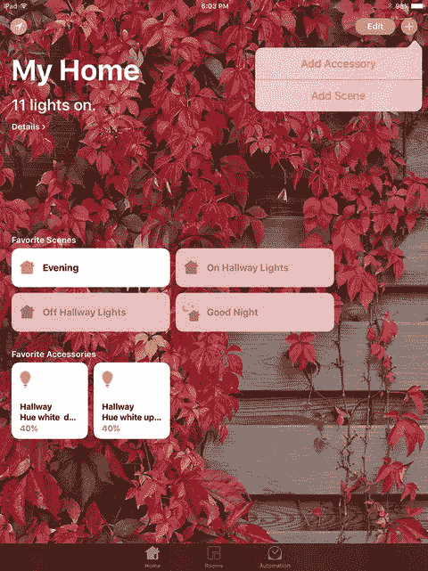

图 3-1. 在主屏幕上查看场景

此屏幕提供了你家庭的概览信息。你常用的场景会显示在这里。这是一个放置涉及多个房间的场景的绝佳位置：你只需将它们标记为常用即可。

### 创建场景

从主屏幕开始，使用右上角的 `+` 来添加一个场景，如图 3-1 所示。

在点击`添加场景`（如图 3-2 所示）后，你会看到`HomeKit`提供了几个预定义的场景。

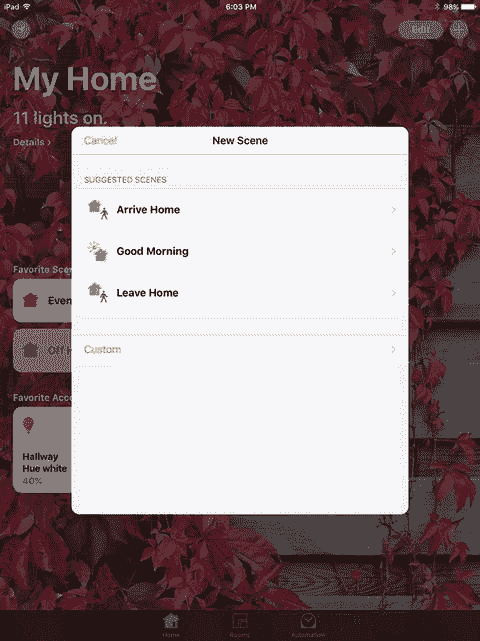

图 3-2. 创建新场景

这些场景的名称可以启发你的思考。它们除了名称之外并没有预定义其他内容，因为场景需要使用你自家的配件。你可以通过点击`自定`来创建自己的场景。如果创建自定义场景，你可以像图 3-3 中提示框所示那样为其命名。

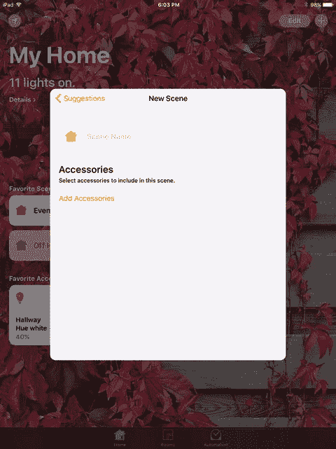

图 3-3. 为场景命名

### 添加配件

为场景命名后，你可以像图 3-4 所示那样为其添加配件。（你随时可以返回重命名场景，或添加/移除配件。）

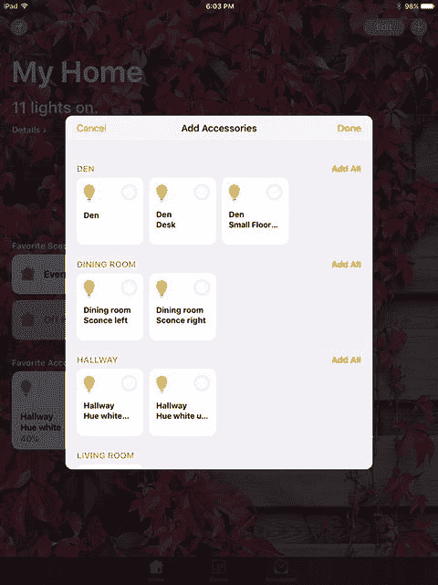

图 3-4. 添加配件

你会看到你的房间及其配件，如图 3-4 所示。你可以点击右上角的圆圈来添加任何配件。你也可以通过点击`全部添加`来添加一个房间内的所有配件。图 3-5 展示了餐厅中以此方式添加的所有配件。请注意，餐厅的`全部添加`现在已变为`全部移除`。

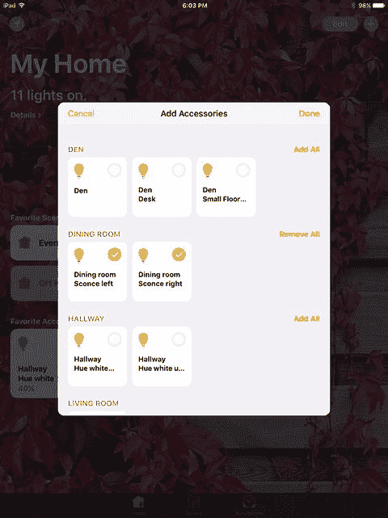

图 3-5. 添加一个房间的配件

如图 3-6 所示，你也可以通过点击配件右上角的圆形按钮来添加或移除房间内的单个配件。

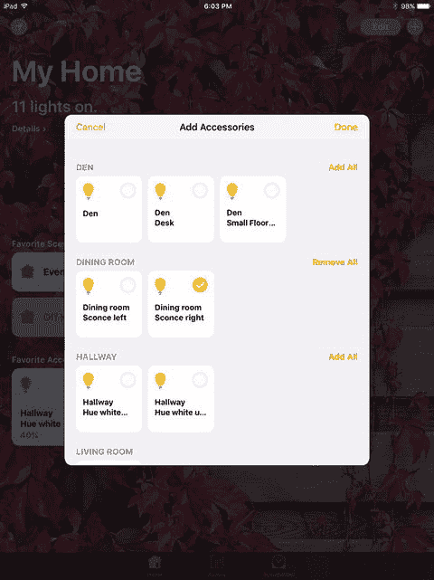

图 3-6. 添加或移除单个配件

点击右上角的`完成`来结束添加或移除配件。

### 调整配件

当你点击`完成`后，你将会回到基本的场景描述界面，如图 3-7 所示。你可以在此重命名场景，但更重要的是，你现在可以调整配件并测试场景了。

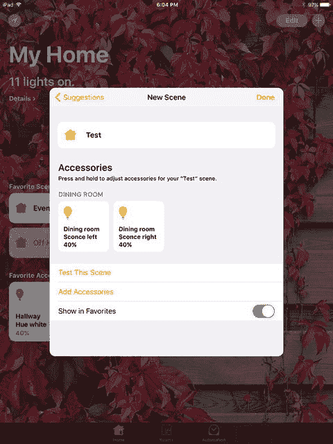

图 3-7. 调整场景和配件

提示：至少在测试阶段，你可以将场景添加到主页面的“常用”中，如图 3-7 所示。

要调整配件，请长按其以打开详情视图，如图 3-8 所示。请记住，此视图会根据你处理的配件类型而有所不同。图 3-8 显示了一个灯泡的详情视图。你可以向上或向下滑动灯泡上的分隔条来调整亮度。

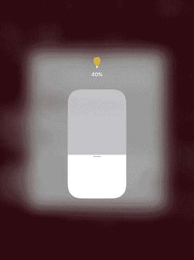

图 3-8. 调整配件

### 完成设置

完成后，你可以在主屏幕上看到你的新场景（如果你已按照图 3-7 所示将其添加为常用，则肯定可以看到）。图 3-9 显示了此时的主屏幕。

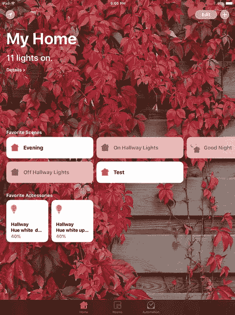

图 3-9. 主屏幕上的新场景

### 编辑场景

在主屏幕（或房间屏幕——房间屏幕会显示该房间的所有场景）上长按一个场景。长按后抬起手指，你将看到如图 3-10 所示的场景界面。点击屏幕底部的`详细信息`来编辑它。

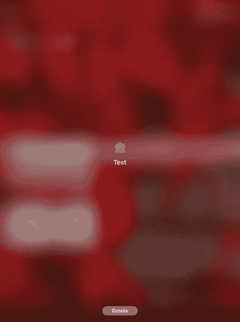

图 3-10. 开始编辑场景

如图 3-11 所示，你回到了可以编辑场景的状态。如果你只是为了测试而将其设为常用，可以在此处关闭该设置。

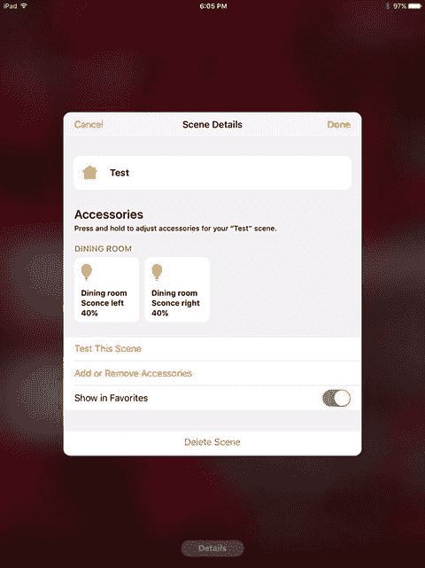

图 3-11. 编辑场景

你也可以从此处删除场景。如果执行此操作，你需要如图 3-12 所示进行确认。

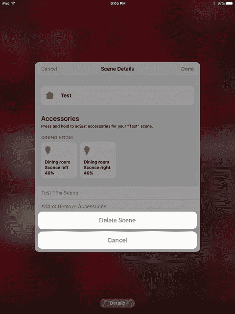

图 3-12. 删除场景

重要的是要记住，场景基于你家庭中的配件构建，但它们不会修改这些配件。这意味着你可以在不影响其他任何内容的情况下删除一个场景。（当然，如果该场景用于自动化工序，删除它会破坏自动化，但不会影响配件本身。）

