# 5. 使用 HomeKit 配件

在前几章中，你已经了解了 HomeKit 的基础及其架构。现在是时候让它真正工作起来了，这涉及各类配件——你的灯、开门器和锁机制、传感器，以及你在当地商店和互联网上发现的数量越来越多的各类支持 HomeKit 的设备。（就像那句老话：如果一棵树在森林里倒下，周围没有人听到，它是否发出声音？）如果没有配件可供控制，HomeKit 就什么也做不了。本章将向你展示如何让 HomeKit 真正工作起来。

## 搭建 HomeKit 测试实验室

你可以将本章作为概览阅读，并在需要时随时查阅。在设置好几个配件后，你就能掌握窍门，并且添加更多配件或修改已安装的配件会变得非常容易。如果你急于马上开始，深入实践的一个方法是搭建一个 HomeKit 测试实验室。别担心：这很简单，而且花费不高。事实上，你可能已经拥有所需的一切了。

HomeKit 测试实验室由一个带有 HomeKit 兼容灯泡的小台灯组成（床头灯的大小正合适）。你也可以使用兼容 HomeKit 的插座，例如 iDevices Switch（写作本文时，苹果官网售价 49 美元，网址为 `http://www.apple.com/shop/product/HJDA2LL/A/idevices-switch?fnode=7f25f48c45679a233b5f95df8a36e8c57b1a59eec22a1199de38581ece45f61e35befe08d1b8717ea467a33ece28d6f31812356449f121305b81329c67802ef1fda2f5ae7635b27545b0c648dfa77050b432ea48991f2da917f39542d5bff8e3`）。你可以将任何设备插入这个插座，然后通过 HomeKit 控制插座及所连接的设备。这两种测试实验室都能让你立即开始使用 HomeKit。

你的灯泡或开关应标有“兼容 HomeKit”的标识（如果你使用开关来控制台灯进行测试，那么开关需要兼容 HomeKit，但台灯中的灯泡可以是普通的）。不要只寻找那些适用于普通家庭自动化产品的设备。寻找如图 5-1 所示的标志。

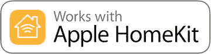

图 5-1. 检查 HomeKit 兼容性

有关最新的配件列表，请查看 `apple.com`。此列表因国家而异，因此请在您所在地区的 `apple.com` 上搜索“HomeKit”。在美国，该列表位于 `https://support.apple.com/en-us/HT204903`。

**警告（或提示）：注意集线器！**

除了兼容 HomeKit 之外，当你购买设备时，请确保它不需要外部集线器。HomeKit 本身就是你的集线器，它要么通过 WiFi 直接与你的配件通信，要么与第三方集线器通信，再由该集线器与第三方配件通信。本节中描述的 iDevices Switch 不需要集线器，因此你可以直接插上使用。飞利浦 Hue 灯泡则需要飞利浦集线器（包含在许多入门套件中）。一些较便宜的家庭自动化产品需要包装中未包含的外部集线器。

## 设置 HomeKit

现在你已经设置好了设备（就像森林中的一棵树），是时候控制它了。你已经了解了 HomeKit 的基本结构，但现在正是真正使用它的时候。

**提示**

随着苹果和第三方开发者不断改进产品并将其推向市场，HomeKit 已经发展了多年。本书中对 HomeKit 的描述，尤其是在本章中，反映的是 iOS 10 中的 HomeKit。iOS 10 实际上是 HomeKit 的首次大规模部署。它作为 iPad 和 Apple TV 标准安装的一部分被内置。此外，它还包含一些改进，使其比早期版本更容易使用。如果你需要查阅更多信息或浏览网上的讨论，请仔细检查材料的日期。寻找 iOS 10 或 2016 年的资料：更早版本和日期的资料很可能已不再准确。

HomeKit 有一个核心枢纽：一个用于集中控制所有设备的中枢。在当前的 HomeKit 中，这个枢纽通常是 Apple TV，但也可以是 iPad。无论是什么，它都应该始终保持通电状态，并具备互联网和 WiFi 连接。如果是 Apple TV，电视本身不需要开启：实际上，大多数未使用的电视屏幕会节能并关闭或休眠，而 Apple TV 则继续运行并消耗少量电量。如果你使用的是 iPad，应将其插电；当它仅保持连接且没有用户交互时，消耗的电量也相对较少。

如果你的枢纽（Apple TV 或 iPad）断电或电量耗尽，请不要担心。当电源恢复时，它应该会从上次中断的地方继续工作。唯一的例外是，如果断电发生在你调整设置的过程中。在这种情况下，你可能会丢失一些数据，但你可以随时恢复。

你的 Apple TV 或 iPad 并非必须使用不间断电源（UPS），但除了最基本的设备之外，配备电涌保护器是个好主意。

如第 2 章和第 3 章所述，你可以从默认家庭的默认房间开始。在继续设置所有内容之前，最好抵制住这种诱惑，先让一盏灯或一个插座正常工作。

**提示**

如果你有像飞利浦 Hue 桥接器这样的家庭自动化中心，你的灯、房间和场景通常会在那里描述。请查看该产品的文档，了解如何将其与 HomeKit 集成。以飞利浦 Hue 系统为例，你可以按照飞利浦网站上的说明，将桥接器本身作为 HomeKit 设备添加。添加桥接器后，再使用 Hue iOS 应用将其他设备迁移过来。一旦 HomeKit 识别了它们，你就可以将它们分配到各个房间并将其用于自动化操作。鉴于 HomeKit 现已稳定并全面部署，这些第三方产品也在不断改进，因此请查阅供应商的网站以获取指导。由于 HomeKit 和第三方集线器在功能上存在一些重叠，在集成问题尘埃落定之前，你可能需要进行一些调整。请查看 HomeKit 和你所用集线器的网站以获取进一步指导。你可能需要保持一定的灵活性和想象力。例如，在使用 Hue 应用和飞利浦桥接器时，你很快会发现，在 Hue 应用中添加灯到 Siri 意味着将它们添加到 HomeKit。一旦设置完成，效果会非常棒。你可以通过前往 `设置 -> 隐私 -> HomeKit` 来重置整个 HomeKit 环境。如果你已添加了 Hue 桥接器，你会在这里看到它。确保它在 `设置` 中已开启。同时请注意 `重置 HomeKit 配置` 按钮：从一开始就计划好你会进行实验然后清除所有内容，这并无坏处。这通常比试图将你的实验成果转换为你最终想要使用的 HomeKit 配置要好。

如果你确实想添加一些配件，最终的家庭布局可能看起来像图 5-2。其中大部分是灯，但你会注意到右下角有一个飞利浦 Hue 桥接器。请记住，在 HomeKit 主屏幕上，这些是收藏项：收藏项的实际数据存储在其他地方。

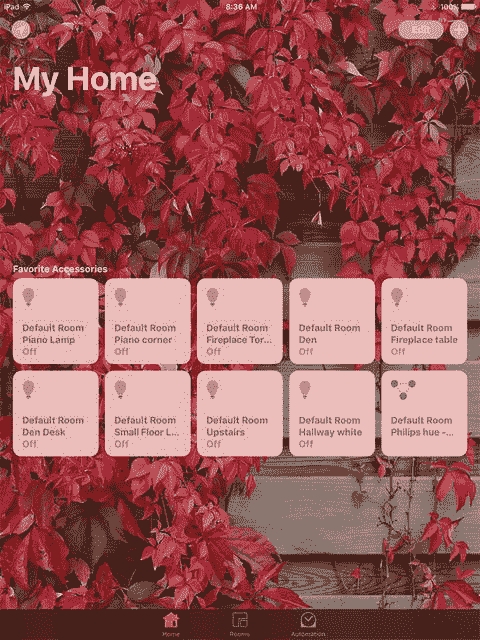

图 5-2. 主屏幕上的收藏配件

图 5-2 显示了默认的第一个屏幕：它显示的是你所有收藏的配件，无论它们在家中哪个位置（这是底部工具栏中的“家庭”按钮）。你可以通过底部工具栏中的“房间”按钮（如图 5-3 所示）来聚焦到特定房间。

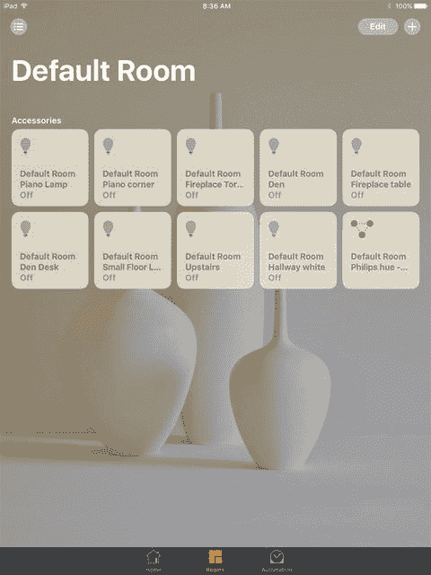

图 5-3. 单个房间内的配件

许多人会逐个房间地设置 HomeKit。然后你可以将关键配件复制到“收藏项”中，这样它们就会显示在底部工具栏的“家庭”标签页中。这是一种让 HomeKit 为你工作的简单而强大的方法，但这仅仅是个开始。

好的，作为一名高级文档工程师和翻译员，我将严格遵循您提供的注意事项和示例，将给定的英文文本翻译成中文。

## 设置房间

无论你是从系统默认创建的房间开始，还是自己创建房间（也许是一个只包含你用来做实验的测试灯和灯泡的小房间），你都可以为每个房间配置设置。

要开始配置房间，请点击底部工具栏中的 `Rooms` 按钮。使用左上角的 `List` 按钮，可以显示房间列表，如图 5-4 所示。

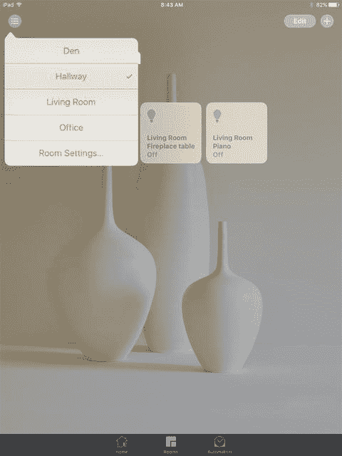

图 5-4. 显示房间列表

要为房间添加或移除配件，请点击房间名称，你将进入该房间。

如果你想编辑房间的设置，请点击 `Room Settings`。你将以不同的格式看到房间列表，如图 5-5 所示。

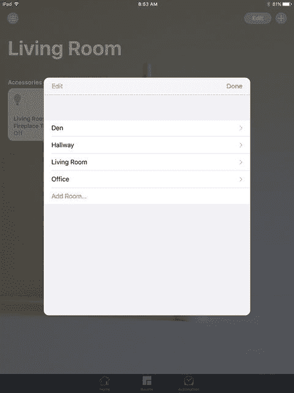

图 5-5. 选择一个房间进行编辑

点击你想要编辑的房间右侧的展开三角形。（记住，你正在编辑的是房间的描述：要编辑房间内的配件，只需从左上角的列表中选择该房间即可。）你将看到图 5-6 所示的视图。在这里，你可以重命名房间、选择墙纸（或拍摄实际房间的照片用作背景），甚至可以从 HomeKit 中移除该房间。

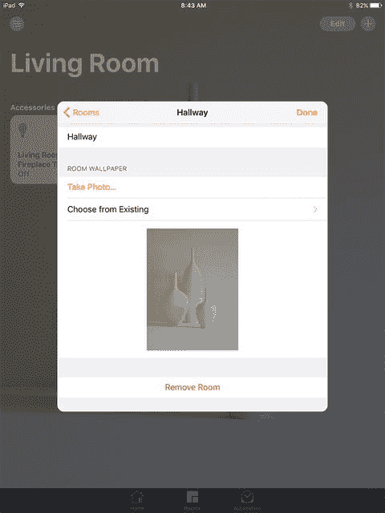

图 5-6. 编辑房间

要编辑房间内的一个配件（稍后你将了解如何添加配件），请长按该配件。（如果只是点击它，你将会打开或关闭该配件。）图 5-7 显示了 `Details` 视图。

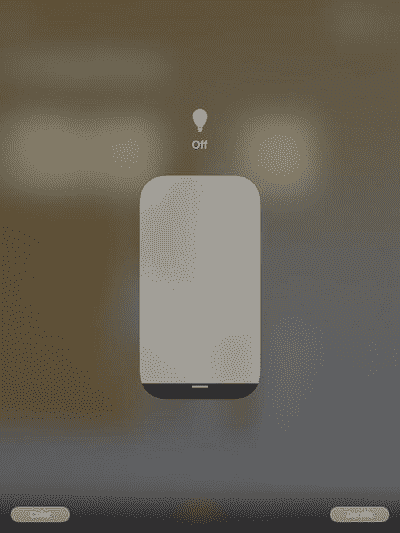

图 5-7. 编辑房间内的配件

配件的 `Details` 视图取决于其本身：HomeKit 会显示配件提供的所有信息。（在代码中支持这些配件是接下来两章的主题。）

要编辑配件的详细信息，请点击图 5-7 所示视图右下角的 `Details`，以打开图 5-8 所示的详细信息。这些主要是 HomeKit 的设置，并且对所有配件来说基本都是相同的。在这里，你可以将配件从一个房间移动到另一个房间（只需点击 `Location` 即可获得一个列表供选择）。你也可以选择在主屏幕的“收藏”中显示此配件。

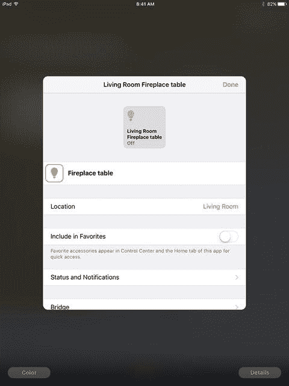

图 5-8. 编辑配件详细信息

`Status` 按钮将让你选择此配件是否在概览项目中显示。

如果你已添加了一个集线器，例如 Hue 桥接器，你可以在这里对其进行配置，如图 5-9 所示。

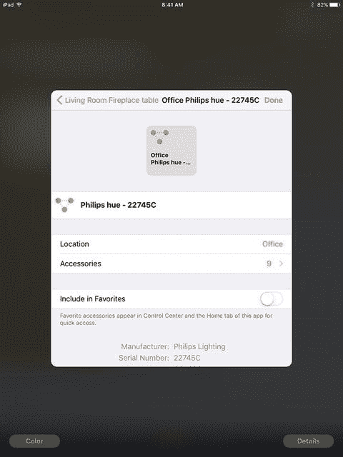

图 5-9. 配置桥接器

此时，仅按照制造商的说明连接桥接器可能就足够了。如果集线器配件没有显示出来，那么你需要从这里开始进行故障排除。你可能需要将 HomeKit 的文档与集线器制造商的文档进行对照检查。网站和推特上的在线帮助会非常有用。请保持冷静，记住，现在有很多人已经成功建立了集线器与 HomeKit 之间的连接。

## 使用自动化

底部工具栏中的 `Automation` 标签页是 HomeKit 强大功能的核心。它允许你管理自动化——即可以影响一个或多个配件（例如，某个房间内的所有配件）的命令序列。首先，点击 `Automation` 标签页，如图 5-10 所示。

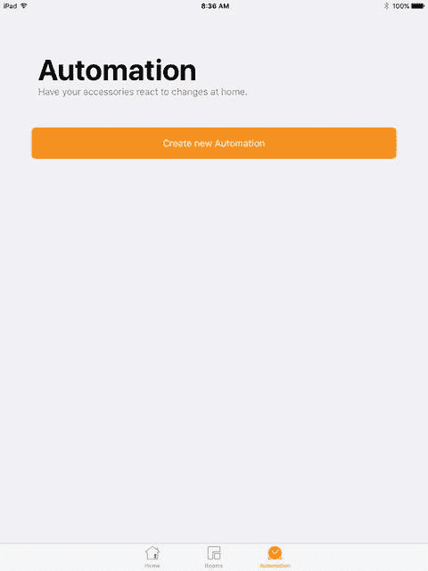

图 5-10. 创建一个自动化

正如你将在下一个屏幕（如图 5-11 所示）上看到的，自动化分为三种类型。虽然它们看起来不同，但实际上本质是一样的：它们的区别仅在于触发事件不同。（基于这个原因，该事件被称为触发器。）

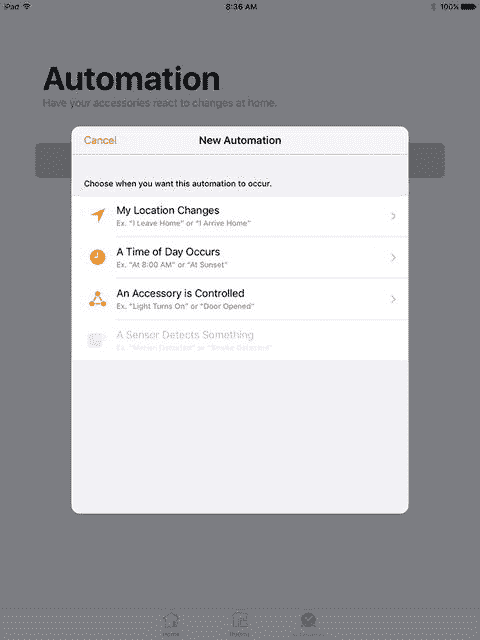

图 5-11. 设置当你离开或到达时触发的触发器

### 自动化地理位置变化

第一种触发器依赖于你的位置，这意味着它依赖于你的 iPhone。如图 5-11 所示，你可以将触发器设置为在离开或到达时触发。

虽然屏幕上的示例显示的是“家”，但实际上，你可以将自动化设置为 `Contacts` 中的任何地址。当你点击右上角的 `Next` 时，你将看到你的联系人地址列表，如图 5-12 所示。只需点击你想要使用的地址即可。

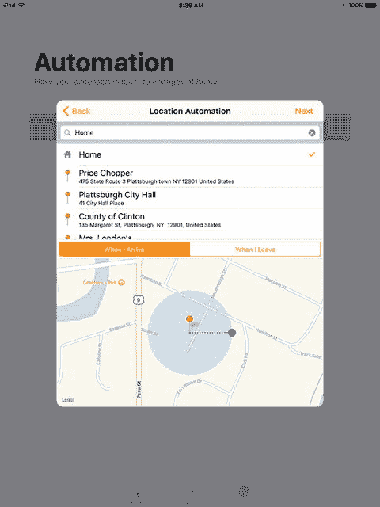

图 5-12. 选择要使用的地址

### 自动化特定时间

你也可以设置一个在一天中的某个特定时间（或几天）运行的自动化。如果你选择该选项，你将能够添加详细信息，如图 5-13 所示。日出和日落时间由 Siri 和 HomeKit 自动为你管理，你也可以自行设置时间。大多数人会重复使用自动化，因此你可以选择时间（或日出/日落），然后点击你希望自动化运行的日期（或多天）。左上角的 `Every Day` 将实现每天运行的效果。

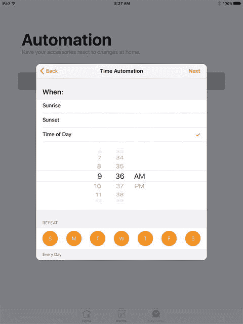

图 5-13. 管理时间和重复设置

请注意，这种类型的自动化旨在重复执行。你也可以将其用于一次性场景，但无法指定特定日期。默认情况下，它会在你选择的第二天中的设定时间运行。

### 让配件控制自动化

也许最有趣的自动化类型是由另一个配件触发的自动化。你可以通过选择你感兴趣的房间中的配件来控制这一点，如图 5-14 所示。（点击配件右上角的圆圈来选择它。）

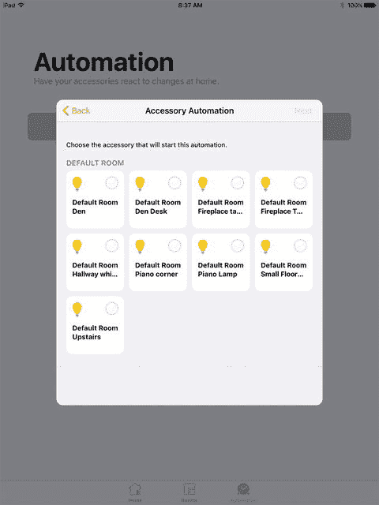

图 5-14. 让一个配件触发自动化

一旦你选择了触发配件，请设置它将执行的、用于触发自动化的操作，如图 5-15 所示。（对于不同类型的配件，可供选择的操作会有所不同。）

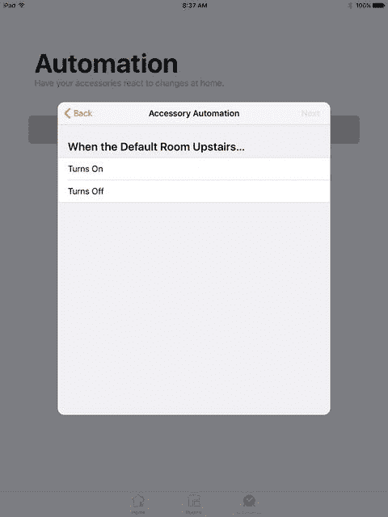

图 5-15. 选择触发操作

你已经有了配件和你想要触发自动化的操作。在下一个屏幕上，选择你想要响应该触发器的配件（或多个配件），如图 5-16 所示。（场景稍后会描述，但在当前上下文中，它们的工作方式与配件基本相同。）

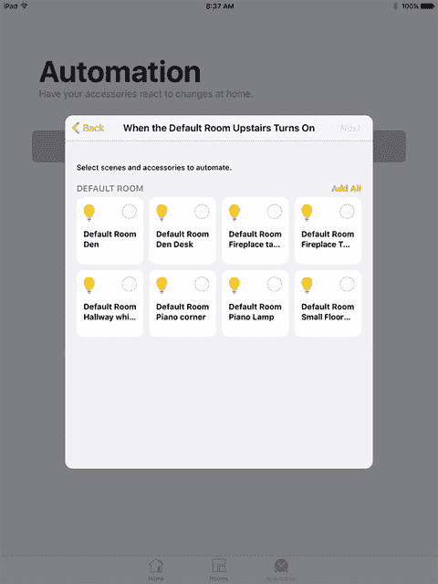

图 5-16. 选择要自动化的场景或配件

最后一步是在下一个屏幕上提供此自动化应对哪些配件执行何种操作的详细信息，如图 5-17 所示。

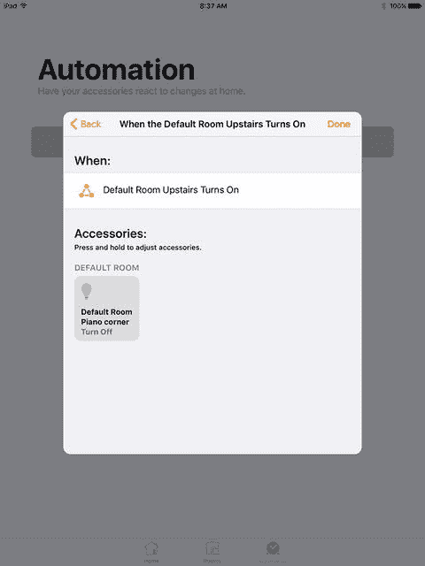

图 5-17. 指定要执行的操作

### 整合运用

现在你已经了解了 HomeKit 的整个设置流程。如果觉得有些复杂，不妨从反向视角来看，你会发现各个部分是如何紧密衔接的。一旦设置完成，实际运作流程如下：

1.  执行自动化操作：开关灯、打开车库门、调节恒温器等。
2.  当触发条件发生时：
    1.  特定时间点
    2.  其他 HomeKit 配件执行了某个操作
    3.  你到达或离开某个地点。本章中介绍的各个步骤仅仅是为了搭建这个自动化系统。在此过程中，你确实需要执行一些设置操作，但大多数情况下，这些设置可以重复多次使用。以下是需要执行的主要设置操作：
    *   对于基于位置的触发器，请确保地址已保存在你的通讯录中。如果没有，请添加。
    *   随身携带你的 iPhone，以便基于位置的触发器能够正常工作。
    *   识别你要用作触发器或执行操作的每个配件。
        *   若要识别配件，请在 HomeKit 中定义它们。
        *   若要整理配件，请将它们归入不同房间。
        *   若要将配件按房间之外的逻辑进行整理，请将它们标记为“收藏”，这样它们就会出现在底部工具栏左侧的“家庭”标签页中。
    *   确保你的家庭中枢（Apple TV 或 iPad）已开机，并连接到 WiFi 和互联网，且已设置为不会进入休眠状态。建议使用浪涌保护器，但设备应能在短暂断电后自动恢复。

