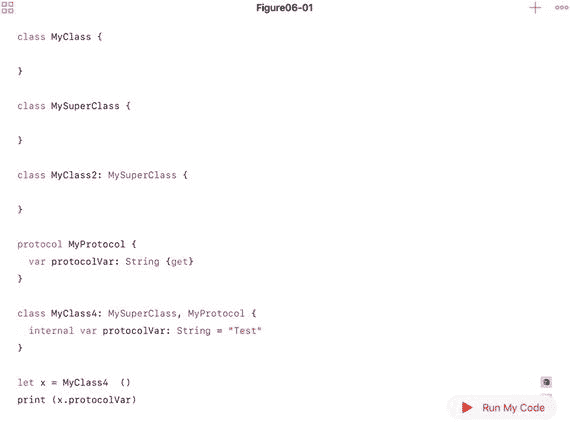
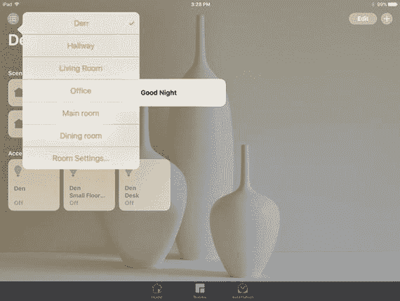
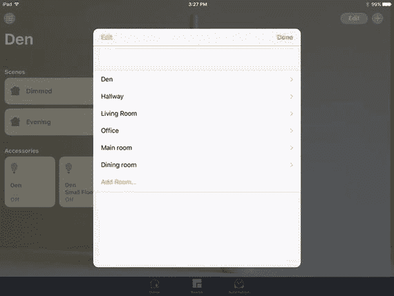
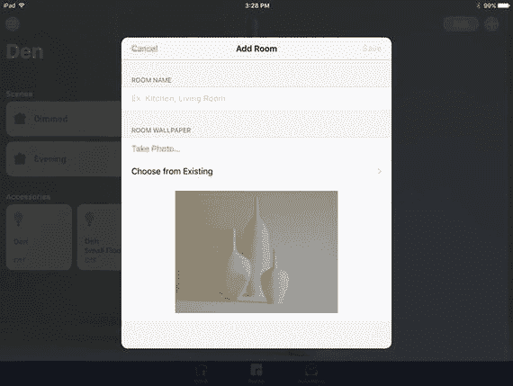
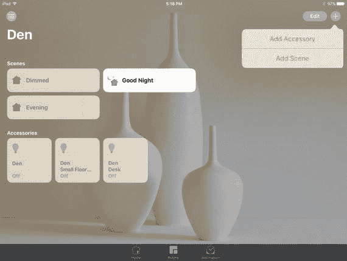
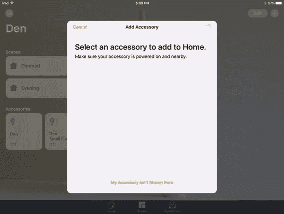
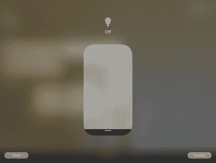
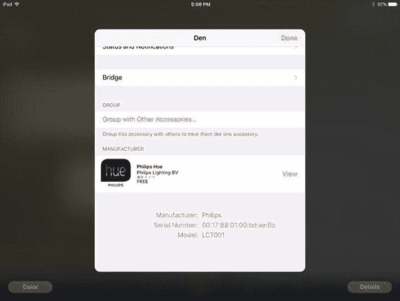
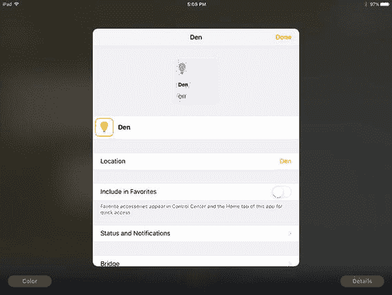

# 6. 作为开发者、设计师或设备制造商探索 HomeKit 世界

到目前为止，本书一直从外部视角审视 HomeKit，观察你能看到和用 HomeKit 控制的那些事物。现在，让我们从代码入手，由内而外地探索 HomeKit。代码是连接家居本身及其所有组件（包括第三方设备）的核心。一切都与代码对话，从许多方面来说，代码本身是对 HomeKit 组件的最佳描述。本章将为你概述 HomeKit 框架及其对象和功能。

HomeKit 是苹果公司的一个现代化框架，基于 Swift 构建。如果你是一位资深的 Swift 开发者（这意味着你已经用了两三年了！），你会感觉得心应手。如果你是 Swift 新手，可以探索一下免费的 Swift iBook，你可以从 `https://itunes.apple.com/us/book/swift-programming-language/id881256329?mt=11#` 下载。

本章探讨了使用 HomeKit 所需的基础知识。它被设计为一本参考手册，因此建议你先阅读第一节，然后在需要时再回过头来查阅其他章节。一旦你对 HomeKit 有了总体了解，在实际操作时学习细节就会容易得多。

无论你在探索 HomeKit 世界的哪个方面，代码都是其核心。HomeKit 的第三方潜力目前才刚刚开始被挖掘。“家庭”是内置于 iOS 10 系统中的 iOS 应用。我们可以轻松构想出该应用更复杂、更定制化的版本。对于设备制造商而言，在构建设备以及配置与设备及其应用紧密相关的细节方面，存在着明显的机遇。将 HomeKit 技术与其他技术、设备和建筑项目集成，仍然是一个前景广阔的领域。

在探索这些及其他可能性之前，首先需要了解你将使用的 HomeKit 代码端。

## HomeKit 概述

如果你熟悉面向对象编程，本节内容可能足以让你快速上手，将 Swift 与 HomeKit 结合使用。虽然这远非关于这两者的完整教程（所有权威文档的来源是 `developer.apple.com`），但它能帮你入门。本节将为你介绍需要了解的关键特性，这些特性与你可能已知的其他语言的面向对象编程有所不同。

### Swift 面向 HomeKit 的面向对象特性

与任何语言中的大多数面向对象框架一样，HomeKit 主要由对象和函数组成。更精确地说，对象是类的运行时实例化。换句话说，HomeKit 由在运行时作为对象创建的类组成。

函数可以在类内部声明，也可以独立声明。（在非常严格的面向对象编程中，不鼓励使用独立函数，但你仍然可以创建它们。）

在类内部声明的函数通常被称为方法。

这种术语有其历史原因，但不必担心。

HomeKit 的类通常代表物理对象（家庭、房间、配件）；它们也可以代表活动或过程。这与许多面向对象系统相同，但 HomeKit 比其他许多系统更侧重于物理对象。这对你来说应该影响不大。


#### 协议与委托：架构

Swift 与其他面向对象编程语言的区别之一在于其对协议和委托的使用。与所有面向对象编程语言一样，一个类可以继承自另一个类。子类继承父类（或超类）的功能和变量，并且可以根据需要在子类中进行重写。

面向对象编程中的一个主要挑战是多继承问题——当你想同时将某个类的部分功能和另一个类的部分功能作为超类，用于同一个子类时，该如何处理？Swift 通过协议解决了这个问题。在声明类时，你需要指定其继承的父类（如果有的话）。在 Cocoa 框架（包括 Cocoa Touch 和 Cocoa）中，大多数对象都有一个共同的基类，即 `NSObject`。你可以在 Xcode 文档中查看 `NSObject` 的结构和组成部分，但目前你只需知道它是许多 Cocoa 类的共同基类即可。

如果你想混合使用多个类的部分功能来创建一种多继承形式，可以使用协议。协议与类有相似之处，因为其定义可以包含方法，但协议不能像类那样直接实例化。相反，一个类可以声明自己遵循某个协议，这意味着该类本身实现了该协议（严格来说，是实现协议中的必需方法，因为有些方法可以标记为可选）。如果一个类遵循了某个协议，其子类也会遵循该协议。该类或其子类必须实现协议中声明的方法。声明类、超类和协议的语法清晰地体现了这种共性。例如，下面是 Swift 类的声明：

```
class MyClass {
}
```

下面是一个将作为超类的类的声明。注意，语法上没有任何指示表明它将作为超类，这只是为了代码示例的清晰性。

```
class MySuperClass {
}
```

下面是带有超类的 Swift 类声明：

```
class MyClass2: MySuperClass {
}
```

下面是一个协议的声明。

```
protocol MyProtocol {
    var protocolVar: String { get }
}
```

协议永远不会像类那样被独立实现。因此，在声明一个字符串类型的属性 `protocolVar` 时，协议将依赖于一个实际采纳该协议的类来实现 `protocolVar`。

下面是一个采纳了协议的 Swift 类声明：

```
class MyClass3: MyProtocol {
}
```

下面是一个带有超类且采纳了协议的 Swift 类声明。

```
class MyClass4: MySuperClass, MyProtocol {
    internal var protocolVar: String = "Test"
}
```

是采纳协议的类来实现它，因此在上述代码片段之后，你可以编写以下代码：

```
let x = MyClass4 ()
print (x.protocolVar)
```

图 6-1 展示了整合后的这段代码。



*图 6-1. 类、超类和协议示例*

如果你想知道编译器如何正确解释像下面这样的代码行（其中 `MySomething` 可能是协议也可能是超类），答案是编译器要求 `MySomething` 在使用前必须声明，并且它能分辨出具体是哪种。

```
class MyClass: MySomething {
}
```

通常有一种惯例（如果你喜欢用这个术语，也可以称之为设计模式）：当一个类采纳某个协议时，该协议的功能实际上可能在运行时由另一个对象实现。这个对象就是委托（Delegate）。这种结构使功能组织得井然有序，并使得代码的开发和维护更加容易。

通过使用协议，多继承问题基本得到了解决。此外，由于可以添加协议来实现相当有限的功能，Swift 中的继承树通常比其他语言扁平得多。实际上，Swift 中的许多协议都特别轻量，并根据需要被添加到多个类中。下一节将介绍在 HomeKit 类中反复出现的三个协议。

#### 协议与委托：关键角色

如前所述，使用协议的 Swift 类层次结构通常比其他语言的类层次结构扁平得多。Cocoa 和 Cocoa Touch 的共同基类 `NSObject`（它本身遵循 `NSObjectProtocol`）为框架中的许多对象完成了大量繁重的工作。大多数 HomeKit 类都是 `NSObject` 的子类（因此也遵循 `NSObjectProtocol`）。

此外，许多 HomeKit 类还采纳了三个非常常见的协议：`CVarArg`、`Equatable` 和 `Hashable`。你其实不必过于担心它们，但如果你在文档中查找信息时经常遇到它们，以下是它们的具体内容和作用。

#### `CVarArg`

该协议允许你使用可变参数列表（C 语言的 va_list）。

#### `Equatable`

该协议意味着类型可以使用 `==` 或 `!=` 进行比较。

#### `Hashable`

顾名思义，该协议意味着遵循它的对象可以被哈希，以便你可以在字典或集合中轻松定位它们。

## 创建新实例

你会发现许多 HomeKit 类不允许你直接创建它们的新实例。你必须使用某种在特定上下文中返回新实例的方法。这些方法通常被称为“工厂方法”。

例如，如果你想创建一个新房间，你需要在 `HMHome` 实例上使用 `addRoom(withName:completionHandler:)`。这意味着你添加的房间会被添加到 `HMHome` 实例的 rooms 数组中。

这种设计模式在许多地方重复出现（例如 `HMZone` 实例）。这可以最大限度地减少“孤立”对象的问题。

## 基本 HomeKit 对象

家庭中的基本对象包括：

-   房间
-   配件
-   场景
-   动作（这些动作被组织成动作集，将在本节后面描述）

它们是你将主要使用的对象（当然，除了家庭本身之外）。在 `HMHome` 实例内，你可以在数组中找到它们。

本章的其余部分将探讨这些对象。你将看到界面以及可用于实现它的代码。（请注意，Home App 中的实际实现可能使用其他代码，但功能上与你在此看到的代码相同。）

HomeKit 中几乎每个对象都有一个唯一标识符：

```
var uniqueIdentifier: UUID
```

唯一标识符是一个以特定方式生成的字符串，以确保其唯一性。（Apple 文档中显示的示例是 `E621E1F8-C36C-495A-93FC-0C247A3E6E5F`）。Swift 的 `UUID`（通用唯一标识符）桥接到了 `NSUUID`，因此两者可以互换使用。它基于 RFC 4122 版本 4 的随机字节。

### 处理房间

当你以用户身份设置 HomeKit 时，房间是你需要处理的对象，但这里展示的是后端视角。


#### 管理房间

轻点“家庭”应用中任意房间左上角的列表图标即可添加房间，如图 6-2 所示。



图 6-2. 列出并添加房间

如图 6-2 的背景所示，此房间列表可从任意房间中调出。房间列表是 `HMHome` 中存储房间的数组，因此必须显示在图 6-2 所示的视图中。该列表通过 `HMHome` 数组 `HMRoom` 数组获取。

```
var rooms: [HMRoom]
```

因此，若要添加房间，您可以从界面上得知 `HMHome` 对象（因为房间列表就在该对象中）。`HMHome` 类通过以下方法管理家中房间的添加和移除：

```
func addRoom(withName: String, completionHandler: (HMRoom?, Error?) -> Void)
func removeRoom(HMRoom, completionHandler: (Error?) -> Void)
```

图 6-3 展示了如何添加房间。



图 6-3. 房间设置

`HMHome` API（应用程序编程接口）中还有一个与房间相关的有趣特性，即一个返回家中所有未分配到其他房间的部分的方法。

```
func roomForEntireHome()
```

因此，您可以确信地假定诸如配件之类的对象将被分配到某个房间中，即使只是整个家所在的房间。

#### 编辑房间

添加或定位到某个房间后，您可以对其进行编辑。图 6-4 显示了其界面（用户可从图 6-3 底部的“添加房间”进入该界面）。



图 6-4. 房间设置

房间名称在首次使用 `HMHome.addRoom(withName: String, completionHandler: (HMRoom?, Error?) -> Void)` 创建时设定。

创建房间后，可通过 `HMRoom` 更新名称。

```
func updateName(String, completionHandler: (Error?) -> Void)
```

图 6-4 显示了用户界面。与家中房间数组相同的设计模式也适用于房间中的配件：它们存储在 `HMRoom` 的数组中。

```
var accessories: [HMAccessory]
```

## 使用配件

家中的房间是一个相当简单的案例，仅仅是因为家与房间都是物理对象，而且在实践中房间相当固定。仔细想想，家中房间的变更通常只是名称上的变化（例如，婴儿房变成了书房）。诚然，配件则有所不同，因为它们往往会被移动（曾经放在客厅的灯可能会被移到卧室）。

### 查找配件

`HMAccessoryBrowser` 类用于查找配件。如果您已经设置了一个 HomeKit 家庭，那么您已经经历过这个过程。您从添加配件开始，如图 6-5 所示。



图 6-5. 选择配件

接下来，应用会启动一个 `HMAccessoryBrowser`。它会四处搜索并尝试发现配件，如图 6-6 所示。



图 6-6. 浏览配件

这个过程是一个典型的 Cocoa 设计模式，涉及一个委托。共有三个步骤。

1.  首先，您开始搜索尚未与某个家庭关联的配件。（如果配件已与某个家庭关联，用户需要将其移除。）为了执行搜索，您需要创建一个 `HMAccessoryBrowser`。
2.  当发现某个配件时，您需要得到通知。在某些情况下，会使用一个完成例程来进行此回调处理。然而，在其他情况下（如此处），则会使用一个委托。该委托实现了一个协议——此处是 `HMAccessoryBrowserDelegateProtocol`。该协议包含两个方法：

    ```
    func accessoryBrowser(HMAccessoryBrowser, didFindNewAccessory: HMAccessory)
    func accessoryBrowser(HMAccessoryBrowser, didRemoveNewAccessory: HMAccessory)
    ```

    创建委托的对象通常会将自身设为委托，但这并非强制要求。重要的是，这是一个异步过程，可以启动（开始搜索）然后在事件发生时进行处理。

3.  设置好委托后，您使用浏览器的一个方法开始搜索。

    ```
    func startSearchingForNewAccessories()
    ```

4.  在适当的时候，您停止搜索。

    ```
    func stopSearchingForNewAccessories()
    ```

关于完成例程和委托的更多内容，请参阅第 7 章。

### 管理配件

完成搜索后，您可以使用 `HMHome` 添加配件。

```
func addAccessory(_ accessory: HMAccessory,
completionHandler completion: (Error?) -> Void)
```

不出所料，您也使用 `HMHome` 移除配件。

```
func removeAccessory(_ accessory: HMAccessory,
completionHandler completion: (Error?) -> Void)
```

您可以使用返回该房间配件数组的 `HMRoom` 方法，从房间中获取配件列表。

```
var accessories: [HMAccessory]
```

由于配件由 `HMHome` 添加和移除，您可以使用 `HMHome` 来移动它们：

```
func assignAccessory(_ accessory: HMAccessory,
to room: HMRoom,
completionHandler completion: (Error?) -> Void)
```

### 编辑配件

您可以在一个视图中查看配件信息，该视图因配件类型而异。例如，如果您在图 6-5 中长按一个配件，您可能会看到图 6-7 所示的视图，它代表一个灯泡。



图 6-7. 编辑配件详情

就“家庭”应用的界面而言，您可以通过在用户界面中长按配件来编辑其对房间可见的常规信息。图 6-8 和 6-9 向您展示了该用户界面。它适用于所有类型的配件。



图 6-9. 设置数值（底部）



图 6-8. 设置数值（顶部）

**注意：** 第 7 章将提供更多关于配件的内容。


