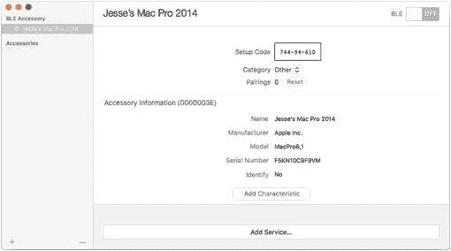
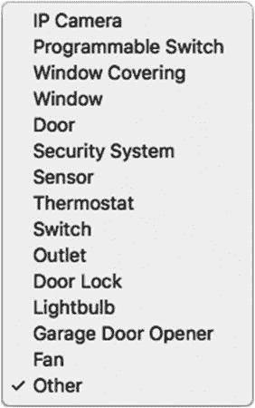
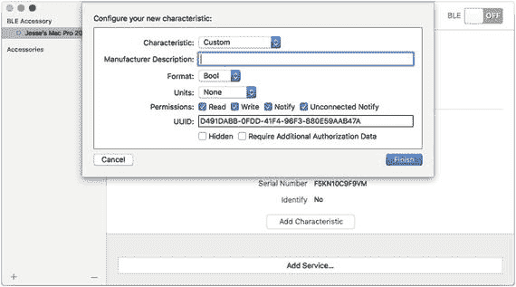
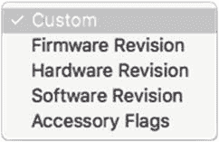
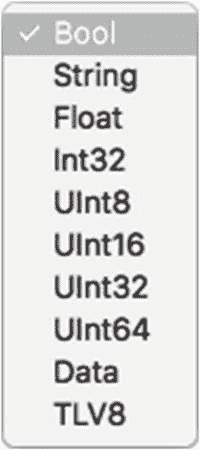
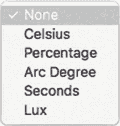
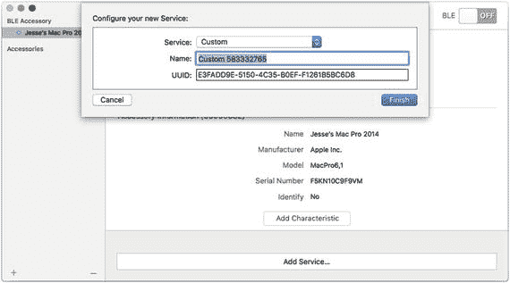
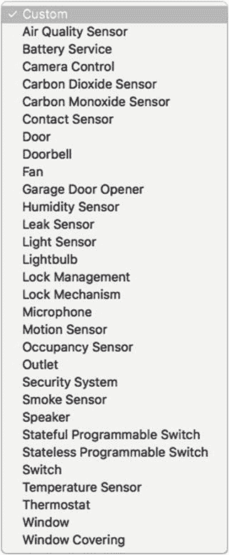

# 7. 深入探索配件

在家庭自动化领域，基础概念是家、房间和设备。这适用于任何家庭自动化环境。通常，你可以调整设备（对多数人来说最常见的是灯泡）的设置，并且可以将设备及其设置组合成场景。定时机制则可以让你自动开启和关闭场景。

HomeKit 在两个方面超越了这些基础概念。

- HomeKit 被构建为第三方设备和应用的家园。苹果从框架和数据库开始搭建，并由其他人来充实完善。目前（据传闻，未来也是如此），苹果并不开发 HomeKit 设备。对于热衷软件设计的人来说，先从逻辑入手是极好的工作方式（这也是我们日常工作的方法）。苹果在家庭自动化硬件方面的工作，体现在其对兼容 HomeKit 设备的认证程序上。
- HomeKit 被定位为其预装设备（即苹果设备）的一个组件。`Home` 应用是 iOS 10 的一部分，因此任何想要将设备连接到它的用户都可以直接使用。

第 6 章相当泛泛地描述了家庭自动化的设备。你已经了解了将配件添加到房间以及将房间添加到家庭的代码，但那里展示的基础代码并不需要深入探索支持配件的 HomeKit 类。

本章将深入讲解配件。它们是 HomeKit 中真正为用户带来好处的特性，并且通过简单、优雅且功能强大的类来实现。

如果仅仅因为家与房间都是物理对象，并且房间在实际使用中相当静态，那么房间内的处理就相对简单。仔细想想，家庭内房间的变更通常只是名称的改变（例如，婴儿房变成了书房）。诚然，配件则是另一回事，仅仅因为它们经常会被移动。（以前放在客厅的那盏灯可能会被搬到卧室。）

## 构建配件

为了构建实际的配件（而不是在网上或商店购买预制的配件），你需要加入 `MFi` 计划。一旦获得许可，你就可以访问 HomeKit 技术规格（即物理规格，不同于注册开发者获得的 API 规格）。你还可以获得硬件技术支持以及营销材料（例如 `MFi` 标志）。更多信息请访问 `MFi` 常见问题页面：[`https://mfi.apple.com/MFiWeb/getFAQ.action`](https://mfi.apple.com/MFiWeb/getFAQ.action)。

## 使用配件

到目前为止，你已经在本书中了解了配件的基本概念。在第 6 章中，你也了解到了用于设置配件的 API（应用程序接口）基础。除此之外，了解配件的最佳方式是使用 `HomeKit 配件模拟器` 创建一个配件。（请记住，如果你正在开发一个将新配件与新 HomeKit 应用结合的项目，配件本身可能还不存在。）

关于你的配件，你需要回答两个关键问题。

-   配件是什么——它的名称和一些描述信息？
-   配件做什么？显然，这与它是什么有关，但仅从配件的描述中并不总能一目了然。用 HomeKit 的术语来说，配件提供什么服务？

如果你打算为 HomeKit 开发一款应用（也许是第 8 章中你将看到的，专注于特定功能和问题的 `Home` 应用的某个版本），你可以在不购买配件的情况下（甚至在它们完全开发出来之前）模拟它们。首先，请按照开发者网站上的说明，从 [`https://developer.apple.com/library/prerelease/content/documentation/NetworkingInternet/Conceptual/HomeKitDeveloperGuide/TestingYourHomeKitApp/TestingYourHomeKitApp.html`](https://developer.apple.com/library/prerelease/content/documentation/NetworkingInternet/Conceptual/HomeKitDeveloperGuide/TestingYourHomeKitApp/TestingYourHomeKitApp.html) 下载 `HomeKit 配件模拟器`。

当你在 `HomeKit 配件模拟器` 中创建一个新配件时，你会看到如图 7-1 所示的视图。



图 7-1. 使用 `HomeKit 配件模拟器` 创建一个新配件

## 什么是配件？

通过启动 `HomeKit 配件模拟器` 并选择“文件 ➤ 新建 ➤ 配件”来创建一个新配件，会打开如图 7-1 所示的模态视图。你也可以创建一个新的桥接器，但选择“配件”是最常见的。

你可以将本节当作如何在模拟器中构建配件的操作指南来阅读，但也可以将其视为对配件本质的最终定义。在那个视图中，请记住配件还具有以下属性：

```
var uniqueIdentifier: UUID
var uniqueIdentifiersForBridgedAccessories: [UUID]?
```

与在其他情况下一样，你可以为配件分配一个委托（这是可选的，因此并非每个配件都有委托）。你可以为每个配件分配一个委托，或者所有配件共享一个委托。无论委托是什么，它都会实现这些方法。如你所见，配件的委托会在发生变更时获知，从而可以执行所需操作。该委托实现了 `HMAccessoryDelegate` 协议：

```
func accessoryDidUpdateName(HMAccessory)
func accessoryDidUpdateReachability(HMAccessory)
func accessoryDidUpdateServices(HMAccessory)
func accessory(HMAccessory, didUpdateNameFor: HMService)
func accessory(HMAccessory, service: HMService, didUpdateValueFor: HMCharacteristic)
func accessory(HMAccessory, didUpdateAssociatedServiceTypeFor: HMService)
```


### 基本配件数据

你需要在配件视图（如图 7-1 所示）的顶部区域填写基本配件信息。其功能将通过你使用图 7-1 底部的按钮添加的服务来描述。本节重点介绍描述部分——即图 7-1 中显示的配件信息。

你从模拟器为你创建的设置代码开始，但随着测试的进行，你可以修改它。在测试过程中也会使用配对。此处显示的基本信息由你决定。

#### 类别

为配件选择一个类别。界面会为你提供如图 7-2 所示的列表。



图 7-2. 选择一个类别

类别的代码如下：

```
let HMAccessoryCategoryTypeOther: String
let HMAccessoryCategoryTypeBridge: String
let HMAccessoryCategoryTypeDoor: String
let HMAccessoryCategoryTypeDoorLock: String
let HMAccessoryCategoryTypeFan: String
let HMAccessoryCategoryTypeGarageDoorOpener: String
let HMAccessoryCategoryTypeIPCamera:String
let HMAccessoryCategoryTypeLightbulb: String
let HMAccessoryCategoryTypeOutlet: String
let HMAccessoryCategoryTypeProgrammableSwitch: String
let HMAccessoryCategoryTypeRangeExtender: String
let HMAccessoryCategoryTypeSecuritySystem: String
let HMAccessoryCategoryTypeSensor: String
let HMAccessoryCategoryTypeSwitch: String
let HMAccessoryCategoryTypeThermostat: String
let HMAccessoryCategoryTypeVideoDoorbell: String
let HMAccessoryCategoryTypeWindow: String
let HMAccessoryCategoryTypeWindowCovering: String
```

唯一需要解释的类别是标识信息：该配件是否具有自我标识的能力，例如灯泡闪烁以标识自身？这是一个是/否的布尔值。

-   名称
-   制造商
-   型号
-   序列号
-   标识
-   配件类别

#### 特征

你可以添加适用于此配件的特征。你可以为一个配件添加任意数量的特征。使用图 7-1 中所示的“添加特征”按钮。它会打开如图 7-3 所示的模态视图。图 7-3 中显示的详细信息取决于你在视图顶部选择的特征类型。



图 7-3. 选择一个特征

#### 类型

对于特征，从图 7-3 顶部的弹出菜单中其类型。图 7-4 显示了可选项。



图 7-4. 特征选项

#### 格式

选择特征的格式，如图 7-5 所示。



图 7-5. 特征的单位

#### 单位

选择特征的单位，如图 7-6 所示。



图 7-6. 特征的单位

### 配件做什么？（服务）

使用图 7-1 底部的“添加服务...”按钮，为你的配件添加任意数量的服务。当你添加服务时，需要填写如图 7-7 所示的信息。



图 7-7. 配置一个服务

请注意，你可以为服务分配一个特定的 UUID（通用唯一标识符）。图 7-8 显示了服务类型的选项。



图 7-8. 选择一个服务

### 查找配件状态

以下是配件的瞬态特征，它们取决于网络和其他条件。你在 API 中而非模拟器中管理它们。模拟器提供给你基本数据，然后这些数据被修改，并且此类修改会传递给配件的委托。当你通过代码创建配件时需要设置该委托。

以下是通常用于查询配件状态的最常用函数。你可以根据需要查询其他特定属性，但这些是状态属性。

```
var isReachable: Bool
var isBlocked: Bool
var isBridged: Bool
```

