# 8. 充满想象的机会：事件、触发器和操作

你的房屋和房间，连同其中的配件、配件特征和服务，是组织 HomeKit 资产的绝佳方式，但就其本身而言，它们实际上什么也做不了。它们只是待在那里，等待你通过 Siri 命令或其他方式激活它们？（注意，Siri 是一个可以与你的 HomeKit 资产配合使用的界面，但它的使用更多是用户界面层面的问题，而非开发层面，因此本书不作介绍。）

让你的 HomeKit 资产和资源活跃起来，让你的家变得“智能”的，是事件、触发器和操作这三者组合。它们不是物理设备：它们是概念或抽象，代表着你想对你的 HomeKit 资源做什么，以及你想在什么时候做这些事情。尽管这些词代表了 HomeKit API（特别是 `HMEvent`、`HMTrigger` 和 `HMAction`）的特定方面，但它们使用的是日常含义。在本书中，当使用 API（应用程序编程接口）名称如 `HMEvent` 时，将以特殊的字体显示。

基本模式很简单。你定义一个事件（例如一天的特定时间或到达某个位置），然后触发器监视该事件的发生。当事件发生时，触发器启动一个操作。这就是“当我到家时，打开走廊场景”这种方式实现的原理。

**场景在哪里？**

场景是用户设置的，用于组合配件和设置。因此，“走廊场景”可能包括将走廊天花板灯调至特定颜色和亮度，以及打开走廊的百叶窗。场景是由用户创建的：它们基于第 6 章和第 7 章中讨论的 API。从开发者的角度来看，场景是操作的集合：一个操作集。

事件、操作和触发器协同工作。你可能希望快速扫描本章以了解概况，然后再回过头来关注细节。在这种情况下，一个可能只有单个灯泡的测试安装对于感受 HomeKit 非常有帮助。在进行实验时，请记住，触发器在你设置后并非即时生效。当你打开或关闭场景时，你可以获得即时响应，但是当你将场景与事件和触发器连接时，由于 HomeKit 需要建立设置然后执行它们，可能会存在时间延迟。用户有时需要等待一段时间（通常是一天），以便随着时间推移和日常事件的发生，检查他们的事件和触发器是否设置正确。


## 使用事件

事件通常是发生在 HomeKit 世界之外的事情（通常，但不总是如此）。它们可分为两类，分别是 `HMEvent` 的子类。这两个子类是 `HMLocationEvent` 和 `HMCharacteristicEvent`。`HMEvent` 本身包含一个名为 `uniqueIdentifier` 的通用唯一标识符 (UUID)。其他任何属性都是子类的属性。当你开始在触发器中使用事件时，你会发现这个抽象超类是触发器的关键组成部分，因为尽管地理围栏与配件的状态数据截然不同，但当地理围栏和特征成为触发器的一部分时，它们本质上是相同的。

> **提示**  
> 你可以将事件视为一个名词——即一个事物。

### 使用位置事件进行地理围栏

位置事件是一种地理围栏事件。其基本属性是 `CLRegion`（即 Core Location 框架中 `CLLocationManager` 定义的一个区域）。

`HMLocationEvent` 的核心是其区域，由它的唯一属性表示。

```
var region: CLRegion?
```

你可以通过一个区域来创建 `HMLocationEvent`，并且可以根据需要更新该区域。

```
init(region: CLRegion)
func updateRegion(_ region: CLRegion, completionHandler completion: (Error?) -> Void)
```

### 监控特征事件

特征事件是表示配件特征特定值的事件。例如，门锁的特征事件可以是已锁或未解锁。烟雾探测器的特征事件可以是感应到烟雾。再简单一点，灯泡的特征事件可以是开启或关闭。

> **提示**  
> 你可以将特征视为一个形容词——即对某个对象的修饰或描述。

因此，对于 `HMCharacteristicEvent`，涉及两个属性：特征（如锁）以及你关心的值（如已锁定/未锁定）。

`HMCharacteristicEvent` 的两个属性是：

```
var characteristic: HMCharacteristic
var triggerValue: TriggerValueType?
```

你可以通过一个特征和一个可选值来初始化 `HMCharacteristicEvent`。由于 `triggerValue` 可以为 null，你可以稍后再回来（或者由用户回来）指定一个值（这就是 Swift 中“可选”的含义——它可能没有值）。像“已锁定/未锁定”这样的二元条件不适合这种情况，但温度传感器肯定适合。

```
init(characteristic: HMCharacteristic, triggerValue: TriggerValueType?)
func updateTriggerValue(_ triggerValue: TriggerValueType?, completionHandler completion: (Error?) -> Void)
```

## 使用触发器

触发器执行操作集（`HMActionSet`），操作集本身由操作组成（下一节将介绍）。`HMTrigger` 是一个抽象类：你通常实现（或继承）主要的 `HMTrigger` 子类之一——`HMTimerTrigger` 或 `HMEventTrigger`。当特定事件发生时（即，当你进入或离开 `HMLocationEvent` 的区域，或者当 `HMCharacteristicEvent` 中配件的特征达到你等待的触发器值时），触发器就会被触发。

触发器通过名称和 UUID 来标识。两者都在创建触发器时创建。名称可以根据需要更新（更新函数允许委托注意到名称已被更改）。

```
var name: String
func updateName(_ name: String, completionHandler completion: (Error?) -> Void)
var uniqueIdentifier: UUID
```

除了静态的名称和 UUID 之外，控制触发器是否启用以及上次触发的时间也很重要：

```
var isEnabled: Bool
func enable(_ enable: Bool, completionHandler completion: (Error?) -> Void)
var lastFireDate: Date?
```

> **注意**  
> `lastFireDate` 是可选的，因为触发器可能从未被触发过。另外，请记住 `Date` 类型实际上是 Foundation 框架中 `NSDate` 的桥接。`NSDate` 表示时间线上的一个点，并不具体对应某个日历、时区或位置。

### 使用基本触发器

触发器的操作集通过以下方法管理：

```
var actionSets: [HMActionSet]
func addActionSet(_ actionSet: HMActionSet, completionHandler completion: (Error?) -> Void)
func removeActionSet(_ actionSet: HMActionSet, completionHandler completion: (Error?) -> Void)
```

### 使用谓词为触发器添加条件

事件触发器可以使用谓词来添加条件，这些条件必须为真，事件触发器才会触发。

谓词是 Cocoa 和 Cocoa Touch 基础框架的基本组成部分。它们是一种描述布尔条件的方法，可用于从数据存储中检索数据，或用于任何其他需要布尔值的场景，例如为事件触发器定义条件。


## 使用操作

作为开发者或设计师，你通常需要处理操作，以便设置用户界面，让用户能够将它们组合起来，从而能被事件触发。当触发器被激活时，操作或操作集才会实际运行。操作可用于打开或关闭配件，或调整其特性（例如亮度或颜色）。

> **提示：** 你可以将操作想象成一个动词——即日常用语中常用的“动作”一词。

大多数情况下，你会用到操作集（`HMActionSet`），而操作集本身由多个操作（`HMAction`）组成。

> **注意：** “集”在此处使用的是其技术含义，即无序的项目集合。这意味着操作集中的操作将以未指定的顺序执行。有时这些操作会按照指定的顺序执行，但这纯属偶然。在追踪明显的错误时，这一点可能非常重要。

操作集具有名称和`UUID`。Siri 能够识别操作集的名称。你的代码可以让用户在此基础上构建他们自己的 HomeKit 环境。

操作集由操作组成，而操作是`HMAction`的具体子类。`HMAction`是一个抽象类，这意味着你不会直接创建它的实例。你会创建诸如`HMCharacteristicWriteAction`等类的具体实例，此类用于将特定值写入配件的某个特性。以下是你将使用的方法声明：

```
init(characteristic: HMCharacteristic, targetValue: TargetValueType)
```

正如你在第 7 章所见，配件可以拥有特性和服务。为了找到允许用户设置操作集时使用的特定服务，你可以使用类似下面的函数来查找给定配件上的服务，该函数使用`HMAccessory`的这个属性作用于用户想要操作的特定配件：

```
var services: [HMService] { get }
```

如果你在写入特性时恰好没有特定配件，可以使用`HMHome`的以下方法，通过服务类型在整个家庭中查找服务：

```
func servicesWithTypes(_ serviceTypes: [String]) -> [HMService]?
```

请注意，此函数返回一个可选值：可能不存在特定类型的服务，你的代码必须处理这种情况。

服务与特性相互关联，因此当你拥有一个`HMCharacteristic`时，通常也会有一个相关的服务。同样，当你拥有一个`HMService`时，可以找到其特性。

以下是`HMCharacteristic`中可用于获取其服务的属性：

```
var service: HMService?
```

从`HMService`对象出发，以下是找到其配件的方法：

```
var accessory: HMAccessory?
```

请注意，无论从配件还是从特性出发，你都可以获取到另一个对象，但有一个非常重要的注意点：这两个属性都是可选的，因此它们可能不存在。尤其当用户正在设置他们的家庭但尚未完成相关任务时，这种情况经常发生。不要假设设置家庭的用户会处理好所有遗留问题。

用户尝试过程中出现“孤立”场景是有合理解释的。此外，请记住，你正在处理的设备有其自身的电源和其他因素问题。尽管如今生产的灯泡寿命估计长达数年甚至更久，但它们最终还是会坏掉。如电源或墙壁插座这样的有线连接也会受制于各种线缆问题，从被拔掉到意外插在由开关控制的插座上。

最后一点是许多人的常见问题。你经常会发现墙上插座有两个插孔，其中一个由开关控制。这意味着墙壁开关可以打开连接到受控插孔上的灯，而另一个插孔则始终保持通电，供电子钟、加湿器或其他需要一直运行的设备使用。你可能知道这一点，甚至多年后还记得，但做一次大扫除的人可能会拔掉两个插头以便移动沙发，结果你由 HomeKit 控制的灯就可能插到受控插孔上了。

## 在 HomeKit 中使用 iCloud 和用户

HomeKit 会配合其发现网络工作。最基本的通信层级是在配件与你的 HomeKit 中枢（通常是一台 Apple TV 或一台 iPad，或两者兼有）之间进行的。在短距离内（例如在家中），HomeKit 使用 WiFi 网络或蓝牙低功耗（Bluetooth LE）。

在家以外，HomeKit 会利用能找到的任何网络，通过 Apple ID 进行通信。随着 iOS 10 及 Home App（预装在 iPad 上）的推出，HomeKit 的可及性比以往任何时候都高。

本章将帮助你使用 HomeKit 的部分网络功能。

> **警告：** 你的中枢必须始终处于开机状态，HomeKit 操作才能正常工作。请记住，当你定义一个自动化来开启某个场景时（参见第 8 章），HomeKit 会使用触发器来启动场景。如果触发器本应触发（或者确实触发了但配件未通电）之后你才给设备或中枢通电，那么直到下一次触发机会出现之前，什么都不会发生。如果触发条件是每天某个时间，那么下一次机会就是第二天。

### 设置中枢

你的中枢需要始终通电，并且需要连接网络。对大多数人来说，这意味着要确保中枢本身（Apple TV 或 iPad）能够使用蓝牙和 WiFi 网络。为了实现远程访问，中枢需要连接到互联网（通常是通过 WiFi 连接）。

#### Apple TV

对于 Apple TV，你需要确保已启用 HomeKit。首先，确保 Apple TV 使用与你（或将）用于 HomeKit 中枢相同的 Apple ID。（对于许多使用单个 Apple ID 的人来说，这不是问题。）

在你的 Apple TV 上，前往“设置”，如图 9-1 所示。

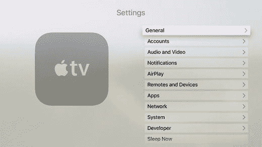

图 9-1. 在 Apple TV 上前往“设置”

选择“账户”来为 HomeKit 设置你的 Apple ID。如图 9-2 所示，你需要为“家庭共享”设置一个 Apple ID（这是系统设置中对于 HomeKit 的称呼）。

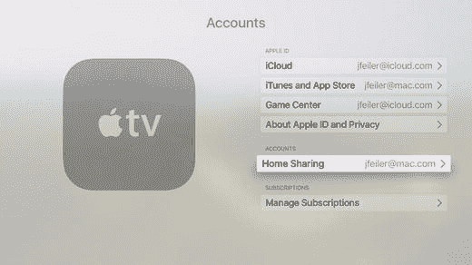

图 9-2. 设置 Apple ID 账户

如果在将来的某个时候，你想关闭 Apple TV 的中枢功能，可以如图 9-3 所示将其关闭，图中显示正在关闭家庭共享账户。

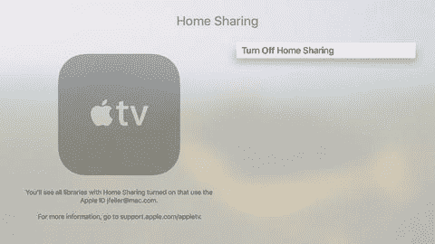

图 9-3. 关闭家庭共享

#### iPad

将 iPad 设置为中枢的过程略有不同。前往 iPad 上的“设置”，然后找到“家庭”，如图 9-4 所示。如果需要，你可以让多个 HomeKit 中枢共享同一个 Apple ID。

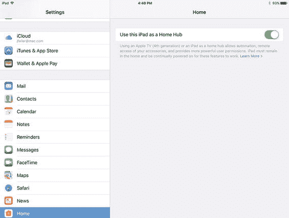

图 9-4. 将 iPad 设为 HomeKit 中枢

### 设置用户

除了中枢之外，你还可以为 HomeKit 设置用户。所有与你用于设置 HomeKit 的 Apple ID 共享的用户都可以用自己的 Apple ID 登录，但你也可以邀请其他人加入。


#### 邀请其他用户

在 iPad 上的“家庭”应用中，从`Home`标签页点击右上角的`编辑`，然后点击家庭名称旁的展开箭头（如果你使用默认设置，可能是“我的家”），即可打开图 9-5 所示的提示框。请注意，你可以使用与`Apple TV`相同的`Apple ID`进行此操作。许多人依赖`Apple TV`处理自动化的后端进程，但使用 iPad 来管理添加用户等事务。你将在“为用户设置权限”一节中了解如何管理用户的操作权限。

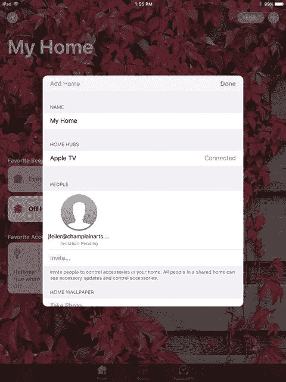

*图 9-5. 邀请其他用户*

点击`邀请`，打开图 9-6 所示的邀请提示框。在顶部输入你想要用于邀请的电子邮件地址。

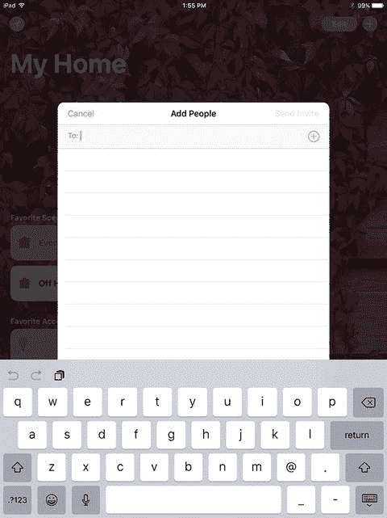

*图 9-6. 发送邀请*

#### 响应邀请

你可能不清楚被邀请者将如何收到邀请。邀请可能发送到 iPad 或 iPhone 上，因此以下是被邀请者会看到的屏幕。如果你在发送邀请之前未与对方联系，则尤其需要此信息。你也可以考虑提前联系对方（毕竟，这是基本的礼貌）。

#### 在 iPad 上响应

如果被邀请者收到邀请，邀请可能会如图 9-7 所示出现在 iPad 的锁定屏幕上。（请注意，它是以“家庭”通知而非信息或电子邮件的形式出现的。你可以通过通知上的图标判断出来。）

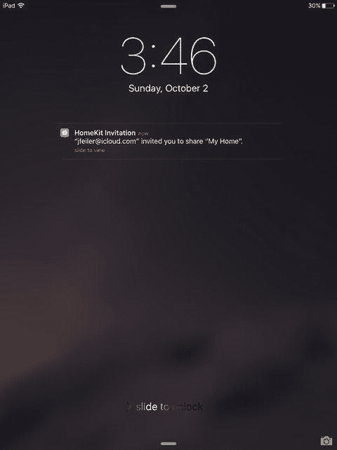

*图 9-7. 用户收到邀请*

如果用户是在 iPad 上收到邀请，解锁邀请通知后的界面如下所示。在被邀请者的`设置`中，邀请会显示在`待办事项`部分（你可能从未见过这一部分，因为此前此类邀请并不常用）。如图 9-8 所示，被邀请者可以选择查看（或不查看）邀请。

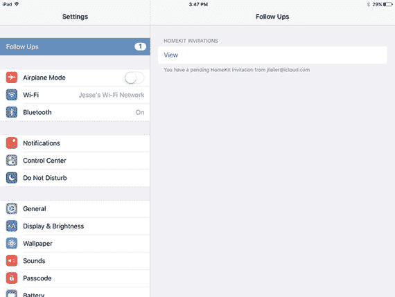

*图 9-8. 被邀请者可以选择查看邀请*

如果用户选择查看邀请，将显示图 9-9 所示的视图。请注意，必须启用`iCloud`才能接受邀请。图 9-9 中直接显示了当前设置，无需用户自行检查`iCloud`是否已启用。如果它处于关闭状态，用户可以在此处将其打开。（其他`iCloud`设置仍可在`设置`中进行调整。）

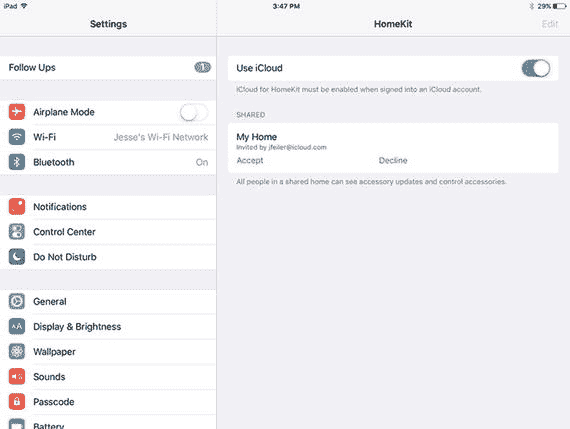

*图 9-9. 被邀请者接受或拒绝邀请*

如果用户接受邀请，此操作是可逆的。只需返回`设置`中的`HomeKit`，即可查看你拥有访问权限的（一个或多个）家庭。你可以随时离开其中任何一个，如图 9-10 所示。

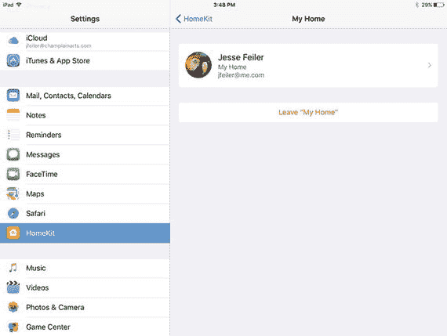

*图 9-10. 你可以随时离开一个家庭*

**提示：** 如果你要邀请他人共享你的家庭（可能是家人或家中使用不同`Apple ID`的其他人），你可能想修改该家庭的默认名称“我的家”。

#### 在 iPhone 上响应

如果被邀请者在 iPhone 上查看邀请，其界面如下所示。首先，`HomeKit`仍在 iPhone 的`设置`中，但看起来略有不同，如图 9-11 所示。（本节省略了部分与 iPad 相同的中间屏幕。）

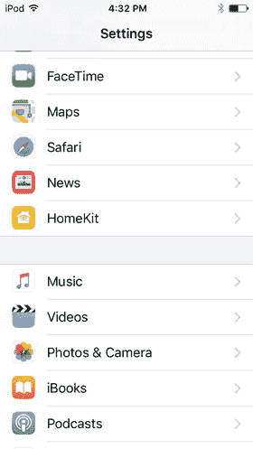

*图 9-11. 在 iPhone 上查看邀请*

选择查看邀请后（与在 iPad 上操作相同），被邀请者可以修改`iCloud`设置。如果被邀请者已经是某个家庭的成员，可以通过点击相关家庭来启动离开流程，如图 9-12 所示。

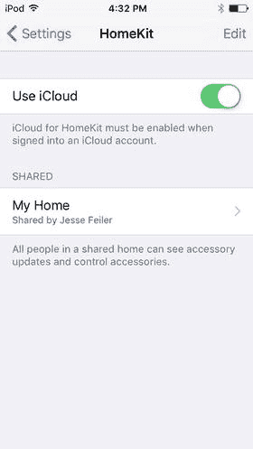

*图 9-12. 点击你想操作的家庭后，即可离开它*

如图 9-13 所示。

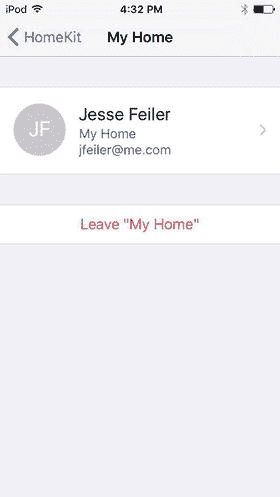

*图 9-13. 在 iPhone 上修改 HomeKit 设置*

### 为用户设置权限

要设置用户权限，请前往`家庭`应用中的`Home`标签页，点击`编辑`，然后点击家庭名称旁的展开箭头。你将看到如图 9-14 所示的提示框。

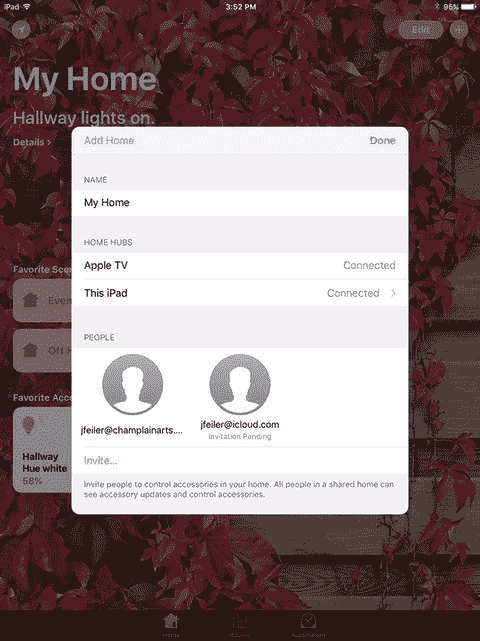

*图 9-14. 管理用户*

请注意，图 9-14 显示了两个用户：一个的邀请处于待处理状态，另一个已是家庭用户。如有需要，你可以像之前图 9-5 所示那样邀请其他人。

双击某个用户即可设置权限，如图 9-15 所示。

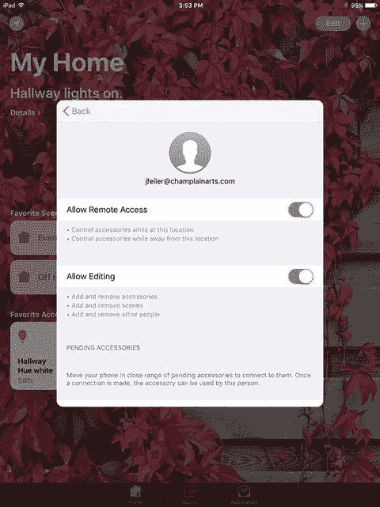

*图 9-15. 设置用户权限*


### 允许锁屏访问

最后一个设置可能对你以及与你共享家庭的人很有用。在`设置`中，进入`触控 ID 与密码`，如图 9-16 所示，然后打开`家庭控制`（即`HomeKit`）。如果已设置完成，`触控 ID`将可用于`家庭设置`。

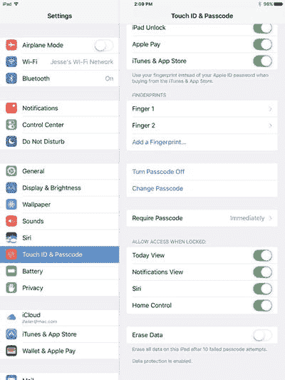

图 9-16.

允许锁屏访问 索引 A 配件 添加/移除 附加 调整 类别 特征 配置 数据 定义 编辑 探索 格式 `HMAccessoryBrowser` 类 `HMAccessoryDelegate` 协议 家庭自动化环境 `HomeKit` `HomeKit 配件模拟器` 信息 管理 重命名 房间 服务 模拟器 点击 瞬态特征 类型 单元 工作 `Apple ID` `Apple TV` `Apple Watch` `应用程序编程接口 (API)` `App Store` 自动化场景 `自动化` 配件 动作 场景 触发 类型 创建 位置 时间 日期 B `蓝牙低功耗 (Bluetooth LE)` C `CarPlay` 提示 `特性` 事件 `Cocoa` 设计模式 `色温` 应急计划 D, E `设计模式` `开发者访问` `开发者技术支持事件 (DTI)` `数字 DIOS` 冰箱 F `框架` G `车库门` `地理围栏` H `HMAccessory Browser` `HMAccessoryDelegate` 协议 `HMAction` `HMCharacteristicEvent` `HMCharacteristicWriteAction` `HMHome` API `HMHome` 数组 `HMLocationEvent` 家庭配件 背景图像 配置 中枢 图像 设置 `家庭` App 配件 自动化 主屏幕 房间 场景 用户权限 用户，设置 `HomeKit` 配件 添加用户 `Apple` `Apple ID` 账户 `Apple TV` 基础 亮度和颜色 编辑 `HMHome` 实例 家庭中枢 集成 邀请 提示 `iOS` 添加 `iPad` `iPad`，响应 管理用户 管理房间 机械设备 网络能力 面向对象编程 对象 模式 响应，邀请 响应，`iPhone` 房间 场景创建 设置权限，用户 设置用户 `Swift` iBook 第三方设备 第三方机会 `HomeKit` 配件 `Apple TV/iPad` 收藏夹 主屏幕 中枢 单个房间 `互联网` `iOS 10` `飞利浦 Hue` 桥接器 房间设置 详情视图 公开三角符号 文档 编辑 格式 中枢 列表 状态按钮 测试实验室 工具栏 `HomeKit 配件模拟器` `HomeKit` 兼容 App `HomeKit` 中枢 `主屏幕` 收藏夹 `主屏幕` 场景 `家庭` 设置 `家庭共享` 账户 `家庭` 标签页 `家庭` 窗口 中枢 I, J `iCloud` `iCloud` 同步 `iDevices Switch` `iHome Control 智能插头` 即时场景 `集成开发环境 (IDE)` `互联网` `物联网 (IoT)` 邀请 `跟进` 部分 待处理 权限 用户 `iOS 9–10` 设备 模拟器 `iPad` 访问位置 自动化 `HomeKit` `iOS 10` 定位服务 `iPhone` K “杀手级” `HomeKit` App L 语言 `锁屏访问` M `Mac App Store` 下载 N `NeXTSTEP` `NSObjectProtocol` O `Objective-C` P, Q 权限 邀请 用户 `飞利浦 Hue` 系统 R 房间 添加 配置 壁纸 S 场景 配件 自动化 创建 编辑 `家庭` App 主屏幕 命名 预设 房间 `模拟器` `Siri` 识别 `状态` 按钮 `Swift` 函数 `HomeKit` 类 协议和委托架构 `Swift` `UUID (通用唯一标识符)` T 测试实验室 `工具` `触发器` 执行动作集 `Twitter` U, V `不间断电源 (UPS)` `uniqueIdentifier` `通用唯一标识符 (UUID)` `用户邀请` `用户权限` 设置 `用户` `用户`，设置，112–123 W `全球开发者大会 (WWDC)` X, Y, Z `Xcode`
