# 2. Hello, World

**摘要**

你可能很清楚，将任何编程书籍中的第一个项目称为“Hello, World”已经成为一种传统。遵循“如果没有坏，就不要去修它”的原则，我们将坚持这一传统。

## 构建“Hello, World”

现在，你应该已经在你的机器上安装了 Xcode。你还应该将 `Learn Cocoa Projects` 文件夹安全地存放在硬盘的某个位置。如果出于某种原因你还没有这样做，请直接回到第 1 章（不要跳过，也不要试图走捷径）并重新阅读相关章节。

我们将处理的第一个项目位于 `Chapter02/Chapter2` 文件夹中。启动位于 `Applications` 文件夹中的 Xcode。以防你从未使用过 Xcode，我们将引导你完成创建新项目的整个过程。

首先从“文件”菜单中选择“新建项目”，或者输入 `⇧⌘N`。当新建项目助手出现时（图 2-1），在左栏的 Mac OS X 标题下选择“应用程序”，然后在右上方面板中选择 Cocoa 应用程序图标，并点击“下一步”。

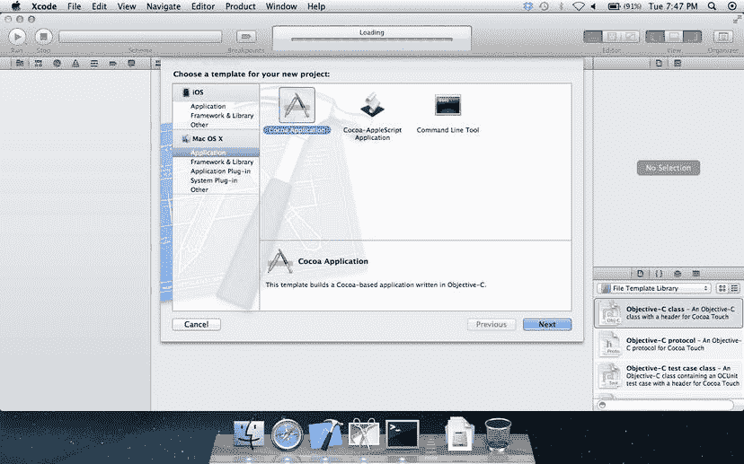

**图 2-1.** 从 Xcode 的新建项目助手中选择 Cocoa 应用程序项目模板

项目选项窗口提供了多个选择（图 2-2）。我们需要为应用程序指定一个名称。“Chapter2”是一个不错的选择。我们还需要提供一个公司标识符，其格式类似于反向域名（很像 Java 包名或 C# 命名空间）。如果我们的域名是 `megacorp.com`，那么这里就选择 `com.megacorp`。Mac OS X 使用产品名称和公司标识符的组合作为我们程序在系统以及 Mac App Store 中的唯一名称。不过，由于我们不会在本机之外分发这个应用，我们可以选择任何我们喜欢的名称。这里最后一个重要字段是类前缀。我们将看到，许多 Cocoa 类都以 `NS` 或 `CF` 开头。对于这些类，Xcode 在创建新项目时会为我们生成一些文件，并使用我们在这里提供的前缀。现在，输入 `Book`。本章中我们不会用到其他字段，因此可以保留默认值。点击“下一步”。

**图 2-2.** 从 Xcode 的新建项目助手中指定新 Cocoa 应用程序的选项

接下来会弹出标准的保存窗口，用于设置项目的位置（图 2-3）。Xcode 会在我们选择的位置（例如我们的 `Documents` 文件夹或一个新创建的用于存放我们自己构建的 Xcode 项目的独立文件夹）中创建一个以项目名称命名的新文件夹。将 Xcode 项目保存在哪里其实并不重要，但如果始终将项目保存在一个位置，以后会更容易找到。我们还可以选择让 Xcode 使用 Git（一个强大的开源分布式版本控制系统）为项目配置版本控制。目前，我们也可以保留默认设置。

**图 2-3.** 命名项目并选择保存位置

选择位置后，会弹出一个新项目窗口（如图 2-4 所示）。尽管你可能已经熟悉 Xcode，但请花点时间看看这个项目窗口。我们将在这里度过大量时间，所以让我们确保大家都能理解。与许多为 Mac OS X 10.7 Lion 及更新版本构建的应用程序一样，Xcode 包含一个全屏选项。由于 Xcode 是一个复杂的应用程序，它需要大量的屏幕空间才能发挥最佳效果，我们现在应该点击窗口右上角的箭头使其全屏显示。

**图 2-4.** Xcode 中我们项目的主窗口

好的，作为一名高级文档工程师和翻译员，我将遵循您提供的注意事项和示例，将以下英文文本翻译成中文。

## 项目窗口概览

我们的项目窗口顶部有一个工具栏，可以方便地访问一系列常用命令。工具栏下方，窗口分为三个主要部分，或称窗格。

沿着窗口左侧向下延伸的窗格称为导航器区域。构成我们项目的所有资源以及许多相关的项目设置都分组在此处。点击项目左侧的小三角形可以展开该项目，显示所有可用的子项。点击已展开项目左侧的三角形将隐藏其子项。

右侧窗格称为实用工具区域，它显示在导航器区域中选中项目的详细信息。例如，对于源代码文件，此区域会显示标识和类型信息、文件在文件系统中的完整路径、本地化信息、使用所选文件的构建目标、编码信息以及版本控制信息。其他文件则会显示适合其文件类型的信息。根据在导航器窗格中选择的文件类型，此区域顶部可能会有一排小图标，允许我们选择要在此处显示的几种不同信息视图。信息窗格下方是库。稍后我们将对此进行更深入的探讨。

中央窗格称为编辑器窗格。如果我们在导航器窗格中选择了一个文件，并且 Xcode 知道如何显示或编辑该类型的文件，那么该文件的内容就会显示在编辑器窗格中。我们将在这里编写和编辑应用程序的所有源代码。

> **注意**  
> 许多开发人员在编辑器模式下工作时，喜欢隐藏实用工具区域，以便获得更多屏幕空间来编写代码；我们可以通过按 ⌥⌘0 来切换实用工具区域的显示。

现在，让我们看看 Xcode 窗口左侧的项目导航器区域。这里会自动为我们创建一些文件夹和三个文件。我们先忽略这些文件夹和前两个文件（稍后会再介绍它们）。第三个文件名为`MainMenu.xib`。

点击`MainMenu.xib`。编辑器窗格将切换到 Interface Builder 模式，这是一种专门用于编辑`.xib`文件的编辑器（图 2-5）。在 Xcode 4 之前，Interface Builder 是一个单独的应用程序，但它已合并到 Xcode 中，这为将用户界面与底层代码连接起来带来了许多好处。文件`MainMenu.xib`被称为“nib 文件”。嗯？nib 文件？为什么不是 xib 文件？首先，“xib”这个词非常难发音。但更重要的是，“nib”这个词是早期更简单时代的遗留物。Cocoa 和现代 Xcode 开发工具的前身是由 NeXT 公司（一家由史蒂夫·乔布斯于 1985 年创立的公司）开发的。“nib”这个名称最初代表 NeXT Interface Builder。随着时间的推移，NeXT 被苹果收购，nib 格式也演变成了一种更新的、基于 XML 的格式。这种 XML 和 Interface Builder 的结合产生了新的`.xib`扩展名。尽管如此，“nib 文件”这个名称还是保留了下来，大多数开发者仍然称他们的 xib 文件为“nib 文件”。

> **警告**  
> 你会在 Xcode 中创建的每个 Cocoa 项目中找到`MainMenu.xib`文件。这是一个特殊的文件。请如此对待它。不要移动、重命名或以其他方式惹恼它。除非我们告诉你这么做。当你的应用程序启动时，它会自动将`MainMenu.xib`的内容加载到内存中。`MainMenu.xib`包含关键信息，包括你的应用程序的菜单栏和主窗口（如果有的话）。随着时间的推移，你将了解所有关于 nib 文件的知识，并会创建你自己的 nib 文件。目前，请保持耐心——并且不要触碰它。

## 探索 Nib 文件

Interface Builder 模式功能强大，所以让我们花点时间来了解其布局。Interface Builder 编辑器区域看起来像一张方格纸，顶部是我们应用程序的菜单栏（图 2-5）。沿着左侧，在方格纸边缘之外，有一系列停靠栏中的图标。这些是构成我们 Cocoa 应用程序用户界面的对象。靠近底部有一个“播放”按钮，可以将停靠栏展开为大纲模式，在此模式下我们可以获取有关这些对象的更多信息。

图 2-5. 准备编辑的`MainMenu.xib`

请注意，Xcode 窗口右侧实用工具区域顶部的一排图标已从两个扩展到八个；这些对象比文件具有更多的可配置性。每个图标都代表检查器的一种不同模式。我们稍后将详细介绍此处显示的不同类型的信息。其下方是库，有一排四个小图标，可以将视图切换到不同类型的项目。将鼠标悬停在每个图标上，会显示一个工具提示，描述每个视图显示的项目类型。检查器用于设置构成我们用户界面的对象的参数，而库则是我们为布局界面添加新对象的地方。

编辑器顶部的菜单栏是我们的应用程序的菜单栏，此处的更改将反映在应用程序启动时出现的菜单栏中。我们可以点击菜单标题，它们会展开以显示下方的菜单项；我们会在新的 nib 文件中免费获得 Mac 标准的“文件”、“编辑”、“格式”、“视图”、“窗口”和“帮助”菜单，但如有必要，我们可以添加更多菜单或修改默认菜单。停靠栏中看起来像下拉菜单的图标（从上数第四个）是代表主菜单的对象。在图 2-5 中，它有一个高亮的边框，表示它已被选中。

停靠栏中主菜单图标下方是一个看起来像窗口的图标，它实际上就是窗口。我们用于创建此项目的 Cocoa 应用程序项目模板假设我们的应用程序至少有一个窗口，并且它为我们创建了该窗口。我们将使用这个窗口来布置程序启动时显示的窗口内容。选择窗口图标，我们应用程序的新的空主窗口将出现在方格纸上。

### 库

右下角的库窗格充当一个调色板，其中包含可用于构建应用程序界面的对象集合。在 Mountain Lion 中，这里有 134 种不同的对象类型可供使用。库默认显示的是文件模板库，但这里有四种可以显示的资源类型：文件模板、代码片段、对象和媒体。我们将要使用的所有用户界面元素都在对象视图下。我们可以在库中滚动查找要使用的项目，然后将该项目拖放到合适的 Xcode 窗格中。选择代表对象库视图的图标，或按 ^⌥⌘3。屏幕应如图 2-6 所示。

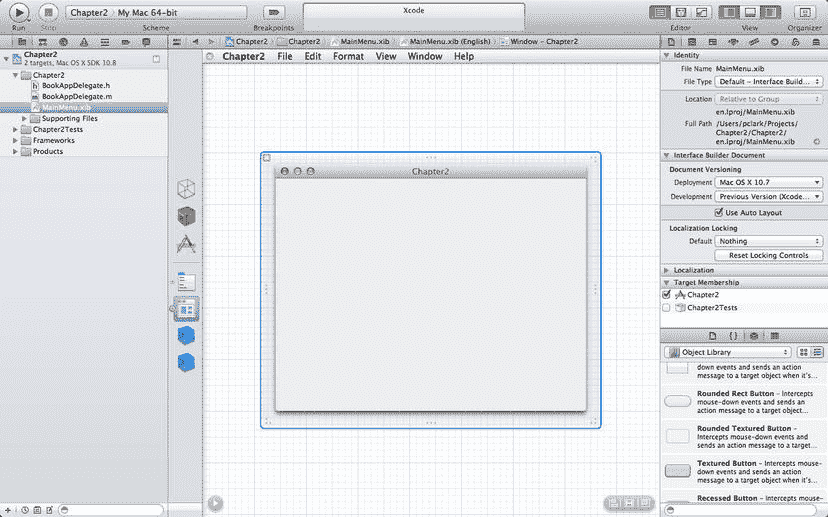

图 2-6. `MainMenu.xib` 显示了我们的新空窗口和对象库

花点时间滚动浏览库中的不同 UI 对象：按钮、滑块、文本字段、标签、浏览器，甚至还有一个 OpenGL 视图！

## 拖出标签

对象库面板会显示一个列表，其中包含可拖拽至应用程序窗口以构建界面的各类项目。现在让我们拖一个出来试试。我们将使用一个名为 `Label` 的对象，它用于显示静态文本——即用户无法编辑的文本。将一个标签拖拽到窗口中。

在对象库视图中，向下滚动大约十几个项目，找到名为 `Label` 的那个。直接点击库中的 `Label`，并将其拖拽到应用程序的主窗口（标记为 `Chapter2` 的窗口）中。这样就会在应用程序窗口上添加一个新标签（图 2-7）。

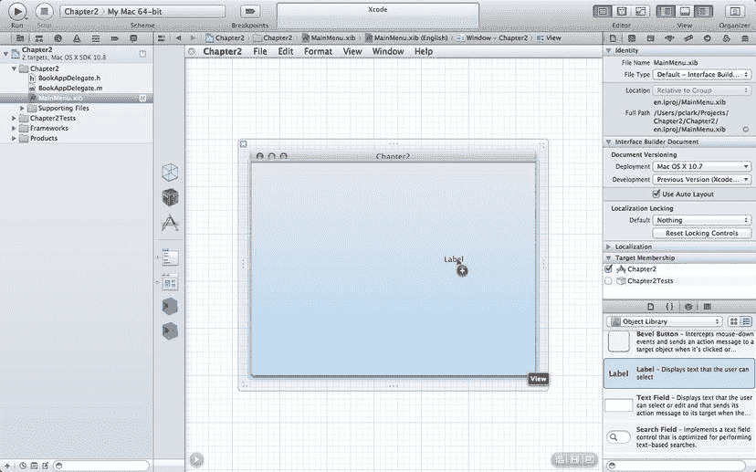

图 2-7.

将标签拖拽到窗口 提示

除了像刚才那样在列表中向下滚动，你也可以直接在库面板底部的搜索框中输入“label”这个词。这样列表就会过滤，只显示名称或描述中包含“label”的对象。

现在我们已经有了一个标签，接下来修改它。双击该标签。它应该会变为可编辑状态并被选中。由于现有文本已被选中，我们只需输入新文本，它就会替换掉原来的内容。继续输入“Hello, World!”，这可比“Label”有趣多了（如果你想要叛逆一点，也可以输入其他内容，但如果提基众神来找你麻烦，可别怪我们没提醒！）。

### 使用蓝色参考线

完成标签编辑后，按下 `return` 键确认更改，这样标签就会退出编辑模式。接下来，点击并拖拽标签，使其靠近窗口左侧。当标签接近窗口左边缘时，文本左侧会出现一条蓝色的虚线（图 2-8）。界面生成器使用这些蓝色参考线来指示拖拽的项目与周围项目对齐得当。在这个例子中，参考线表明标签与窗口左边缘的距离是合适的。

图 2-8.

当我们把对象移动到边缘附近时，会出现蓝色线条 注意

多年来，让 Mac 使用体验如此愉悦的因素之一就是用户界面的一致性。在绝大多数 Mac 应用程序中，无论你使用的是哪个程序，都可以依靠 `⌘W` 来关闭窗口，`⌘S` 来保存，`⌘P` 来打印。如果你要为 Mac 编写软件，就应该了解这些“一致性规则”。苹果公司在他们的《人机界面指南》（也称为 `HIG`）中阐述了这些规则。界面生成器的小蓝线正是为了让你更容易地遵循《人机界面指南》而存在的。你可以在 [`http://developer.apple.com/library/mac/#documentation/UserExperience/Conceptual/AppleHIGuidelines`](http://developer.apple.com/library/mac/#documentation/UserExperience/Conceptual/AppleHIGuidelines) 找到 `HIG` 的副本。

## 检查器

库区域占据了 Xcode 窗口右侧实用工具区域下方大约三分之一的空间。另一个重要的界面生成器工具正好位于库上方，占据了右侧实用工具区域上方三分之二的空间。这被称为检查器。检查器是一个上下文相关的面板，会显示当前选定对象的信息。点击窗口，检查器会显示该窗口的信息（图 2-9）。点击标签，检查器会显示该标签的信息。你应该明白意思了。

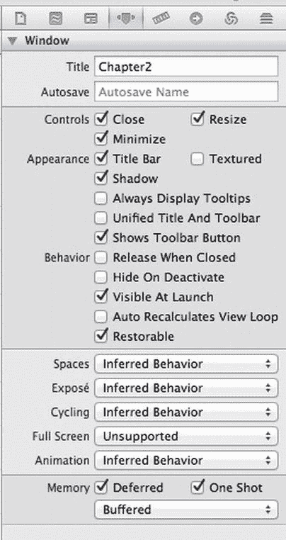

图 2-9.

检查器显示窗口的属性

查看图 2-9 中所示的检查器面板。注意面板顶部横跨的八个图标。按下每个图标，面板就会切换为八种不同检查器类型之一。

每个检查器也有对应的键盘快捷键，从 `⌥⌘1`（最左侧的文件检查器）到 `⌥⌘8`（最右侧的检查器）。在界面生成器模式下，属性检查器和连接检查器将是我们最常用的两个。表 2-1 列出了这八个检查器对应的快捷键。

表 2-1.

界面生成器检查器的快捷键

| 快捷键 | 检查器 |
| --- | --- |
| `⌥⌘1` | 文件检查器 |
| `⌥⌘2` | 快速帮助检查器 |
| `⌥⌘3` | 身份检查器 |
| `⌥⌘4` | 属性检查器 |
| `⌥⌘5` | 尺寸检查器 |
| `⌥⌘6` | 连接检查器 |
| `⌥⌘7` | 绑定检查器 |
| `⌥⌘8` | 视图效果检查器 |

### 属性检查器

我们先来看看属性检查器。（如果看不到，请按 `⌥⌘4` 在实用工具区域显示该面板，然后单击你的标签。）检查器应如图 2-10 所示。

我们可以使用属性检查器来更改标签的外观。我们可以修改文本对齐、边框和滚动行为等属性。有趣的是，其中几个字段实际上不会产生任何效果。试试在“占位符”字段中输入内容。完全不会改变标签的外观，对吧？

这是怎么回事？当我们从库中拖出一个标签时，我们抓取的是 `NSTextField` 类的一个实例。`NSTextField` 类既用于静态文本字段，也用于可编辑文本字段。在可编辑文本字段中，占位符就是我们在某些空文本字段中看到的灰色文字，它提示该字段的作用。

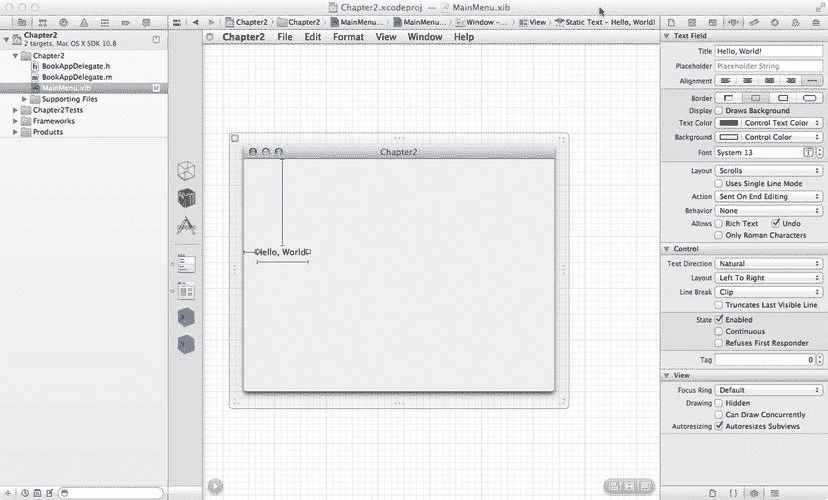
图 2-10. 属性检查器显示了在 Interface Builder 中可以编辑的标签的所有属性

当文本字段被配置为标签时，不需要占位符。提供一个占位符也无妨，但也无益。

本书记载不了所有与上下文相关的属性，但我们会逐一讲解那些不太明显的属性。随着您阅读本书的深入，您将熟悉大多常用的属性。

我们来更改标签的大小。如果标签未被选中，单击它将其选中。标签两侧会出现圆点。这些圆点是大小调整手柄，允许我们更改所选项目的大小。Interface Builder 中的大多数对象都有四个调整手柄，每个角一个，允许我们在四个方向上调整大小。但某些项目（如标签）只有两个调整手柄。标签的属性（特别是其字体的大小）决定了标签的垂直大小。我们不会通过调整大小来改变标签的高度。我们只使用调整手柄来更改标签的宽度。

我们来将标签居中。确保标签的左侧与窗口左边缘附近的蓝色参考线对齐。然后，抓住右侧的调整手柄，将标签拖至窗口右边缘附近的蓝色参考线处。完成操作后，标签应如图 2-11 所示。

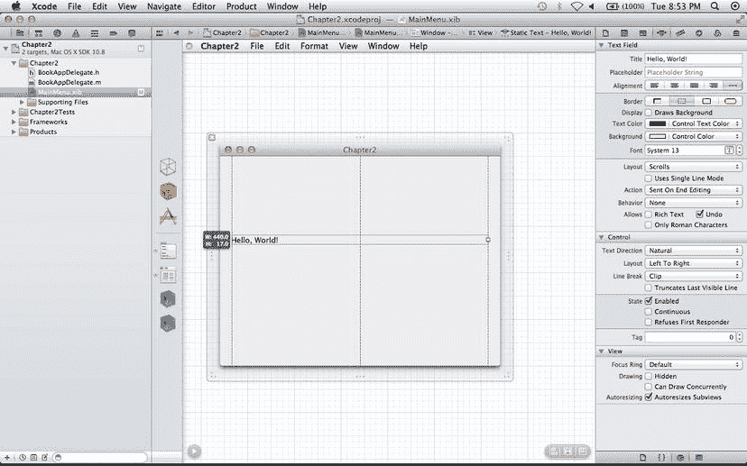
图 2-11. 调整大小后，我们的应用程序窗口在 Interface Builder 中的显示效果

现在，保持标签选中状态，在属性检查器中找到一行标有“对齐”的按钮，然后选择“居中对齐文本”按钮（图 2-12）。另外，找到一个标有“行为”的弹出式菜单，将其设置为“可选”，这告诉 Cocoa 我们希望允许用户根据需要将此标签复制到剪贴板。默认情况下，标签是不可选的，但我们刚才更改了这一设置。

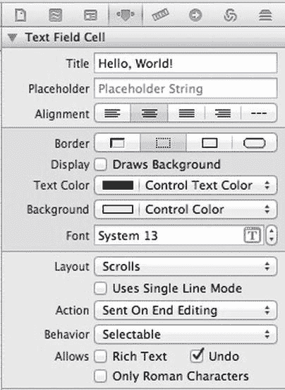
图 2-12. 标签的属性检查器中的对齐按钮，设置为居中对齐文本

### 更改标签的颜色和字体

我们对窗口内容进行最后一项更改：更改文本的字体、大小和颜色。如果查看属性检查器，我们大概能知道如何更改文本颜色，但设置字体和大小有些小窍门。

首先，设置颜色。在属性检查器中找到标有“文本颜色”的颜色井。单击它，将出现标准的 Mac OS X 颜色选择器（图 2-13），我们可以选择所需的文本颜色。现在就选择吧，挑选任意你喜欢的颜色。

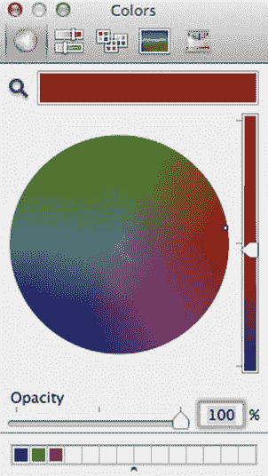
图 2-13. 在 Cocoa 应用程序中，使用标准 Mac OS X 颜色选择器来选择颜色。我们正在 Interface Builder 中使用它来设置文本颜色

Xcode 本身是用 Cocoa 构建的，并利用了许多内置的 Cocoa 功能，比如标准颜色选择器。Apple 工程师不希望像你一样重复发明轮子。当你编写自己的应用程序时，只需几行代码，甚至在某些情况下无需编写任何代码，就可以使用完全相同颜色选择器。

你可以在应用程序中使用的另一个内置 Mac OS X 功能是标准字体窗口，它允许你更改所选文本的字体、大小和属性。在创建分发给他人的应用程序时，重要的是要意识到你可能会选择用户没有安装的字体。通常，对于标准 GUI 组件，最好不要更改字体。一致的字体使用是 Mac 以 GUI 一致性著称的重要组成部分。大多数标签、按钮和其他控件默认使用 Lucida Grande 字体。你可以更改某些标签的大小，并在粗体和常规之间切换以突出显示不同内容，但保留字体本身不变。Xcode 在属性检查器的“字体”字段中提供了指导，如图 2-14 所示。尽管可以使用“字体”面板，但 Xcode 还提供了一个快速访问系统默认字体的标注窗口。如果你知道想要当前系统字体的粗体版本，可以轻松地从该标注窗口的“字体”下拉菜单中获取。通常，对于常见的用户界面元素，你会使用这种方法，而不是显式地设置字体。

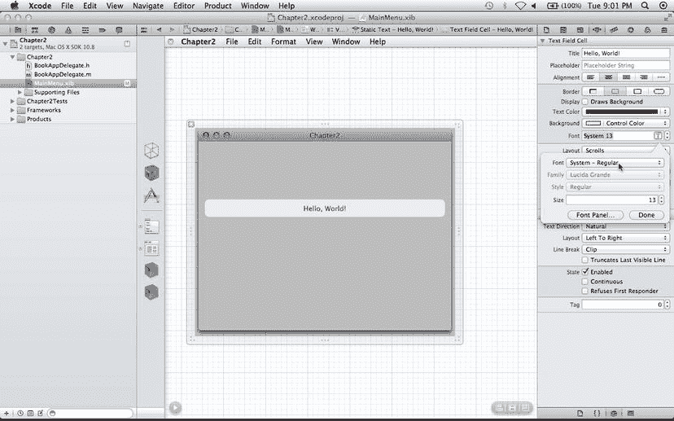
图 2-14. Xcode 有一个专门的字体选择器标注窗口，方便快速访问默认字体

按 `^⇧⌘T` 调出 Xcode 中的字体窗口。确保我们的标签仍被选中（查找调整手柄），并确保应用程序的主窗口仍是最前面的窗口。

一旦我们将标签调整到满意的样式，我们就会为应用程序进行最后的润色，然后运行它。我们就快完成了！

### 创建应用程序图标

所有应用程序都需要图标。Mac OS X 使用一种特殊格式来保存图标，该格式将多张图片打包在一起，以便在缩放时以及配备 Retina 显示屏的设备上，能够提供多种尺寸和分辨率的图片。不过，Xcode 会为我们准备好这种格式。我们只需恰当地命名图片，并将其放入一个扩展名为`.iconset`的文件夹中即可。

命名约定非常直接。例如，图片名称可以是`icon_128x128@2x.png`。每张图片的名称以`icon_`开头，接着是分辨率，然后是一个可选的标记（用于指示高分辨率作品），最后是文件扩展名，例如`.png`。Cocoa 使用的完整尺寸集包括 16×16、32×32、128×128、256×256 和 512×512。其中每种尺寸都可以选择添加`@2x`的高分辨率标记。请注意，尺寸单位是屏幕点，而不是像素；一个`512×512@2x`文件的实际像素尺寸为 1024×1024。Cocoa 会判断我们的应用程序是否运行在配备 Retina 或其他高分辨率显示屏的 Mac 上，并根据屏幕的像素密度和所需尺寸，选择最佳的位图。如果我们没有提供 Cocoa 所需的图片，它会自动对我们提供的其中一张图片进行缩放。我们可以为配备 Retina 显示屏的 Mac 提供一张细节丰富的大图，但缩放后的效果可能并不完全符合我们的预期。支持多张图片意味着我们可以针对较小的尺寸，精心调整图标的外观。

我们需要在图像编辑程序中开始制作图标，例如 Photoshop、Pixelmator 或 GIMP。原始文件的尺寸应为 1024×1024 像素，并保存为支持 Alpha 通道（透明度）的标准图像格式，如 TIFF、PSD 或 PNG。在本例中，我们将使用`.png`文件。将其保存为`icon_512x512@2x.png`。然后，我们可以使用最适合的方法对图像进行等比缩小。通常的做法是使用图像编辑器的缩放功能，然后在必要时手动进行微调。

为了省去您自己创建图标的麻烦，我们提供了一个`hello world.iconset`文件夹，其中包含您可以添加到项目中的图片。您可以在第 2 章的下载项目文件中找到这个文件夹。如果您想自己动手制作，也完全可以，请按照`hello world.iconset`文件夹中的命名规范来命名您的图片。

### 向项目中添加图标

无论您是自行创建了图标，还是使用我们提供的图标，现在需要将其添加到 Xcode 项目中。为此，请在屏幕左侧的导航器区域选择项目。它是项目导航器视图中的最顶部项；在我们的例子中，它标记为“Chapter2”。项目的概要信息将显示在窗口中央的编辑区域，并且应已选中 Chapter2 目标。将`hello world.iconset`文件夹从 Finder 拖拽到窗口中央的 Xcode 应用图标槽中，如图 2-15 所示。这告诉 Xcode 我们希望将此文件导入到项目中。

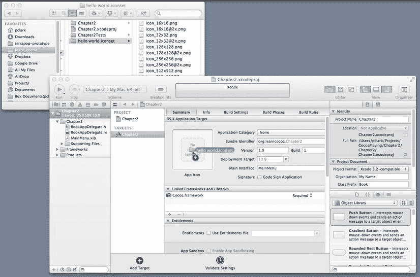

图 2-15. 将文件拖拽到应用图标槽以将图标添加到 Xcode 项目

松开鼠标按钮后，`.iconset`文件将被复制到项目目录中，并添加到文件列表中。我们也可以让 Xcode 使用项目目录之外的文件，但目前我们希望将所有内容都放在同一位置。

### 属性列表

`Info.plist`是一种特殊的文件，称为属性列表。属性列表在 OS X 中被广泛使用。虽然终端用户很少看到它们，但它们用于 Cocoa 开发的许多部分，因此您会经常遇到它们。

属性列表文件由一系列条目组成。每个条目由一个键和一个值构成。图 2-16 显示了 Xcode 内置的属性列表编辑器，正在编辑`Chapter2-Info.plist`文件。每一行代表一个单独的条目。如您所见，属性列表包含三列。左列标记为“键”，右列标记为“值”。中间列标记为“类型”，指示数据类型；大多数属性列表值是字符串，但偶尔也会看到其他类型。

> 注意：属性列表还能够在单个键下存储多个值。可以在一个键下存储一个项目数组（或列表），甚至可以在一个键下存储另一整套键值对。您暂时还不需要用到这个功能，但我们认为您应该知道它是可行的。

在图 2-16 中，键为`Icon file`的条目已被高亮显示。请注意，属性列表中的`Icon file`条目已被自动设置为我们导入的`iconset`目录。

图 2-16. 在编辑窗格中打开的`Chapter2-Info.plist`，以便我们查看此应用程序图标文件的名称

准备好编写一些代码了吗？猜猜看？实际上无需编写任何代码。我们的应用程序已经完成了。

### 运行应用程序

通过点击 Xcode 窗口左上角的“运行”按钮来构建并运行您的应用程序。Xcode 将构建我们的应用程序（可能需要一些时间），然后运行它。屏幕上应该会出现一个窗口，其中包含我们居中的彩色标签。如果我们查看 Mac 主屏幕底部的程序坞，会看到我们的应用程序以我们导入的图标显示在项目列表中。不过，等等：还有更多功能！

从 Chapter2 菜单中选择“关于 Chapter2”，关于对话框就会出现（图 2-17）。我们不仅免费获得了一个关于对话框，而且它还包含我们的图标。

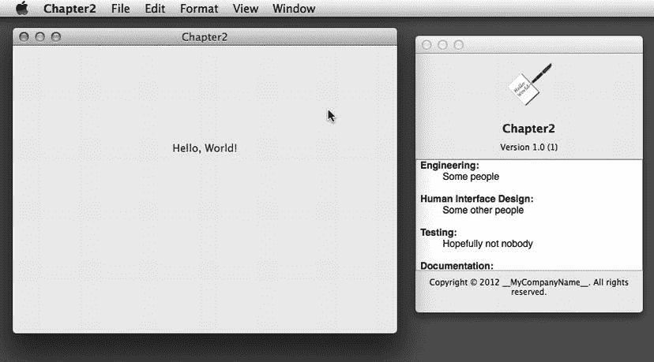

图 2-17. 我们的应用程序在多个地方使用了我们的图标，包括关于对话框

我们还没完。将鼠标移到应用程序主窗口中的“Hello, World!”文字上。光标应该会从箭头变为文本光标。因为我们使标签可选中，Cocoa 会自动改变光标，以此提示用户他们可以选择这段文本。继续双击“Hello”这个词，它会被高亮显示。现在，如果我们选择“编辑”菜单，会看到“复制”菜单项不再是灰色不可用的。如果选择它，我们的程序会将“Hello”这个词复制到剪贴板，然后我们可以将其粘贴到任何其他接受文本的应用程序中。在“Hello”仍被选中的状态下，选择“编辑”菜单，然后选择“语音”子菜单，并选择“开始朗读”。应用程序将使用您 Mac 的文本转语音功能朗读“Hello”。

无需编写任何代码，我们的应用程序就支持将文本复制到剪贴板和文本转语音功能。几乎不费吹灰之力，我们的应用程序就像真正的 Mac 应用程序一样运行，拥有窗口和菜单栏，并且能响应常见的键盘命令，例如⌘Q 退出。我们的应用程序主窗口可以被移动、最小化到程序坞，甚至可以被关闭。我们可以隐藏我们的应用程序，或者隐藏所有其他应用程序。所有这些功能，我们都可以不费吹灰之力地获得，包括运输和手续费。这就是 Cocoa 的强大之处。如果您的计算机已经知道如何做某件事，那么您很可能不需要编写很多代码就能实现它，有时甚至完全不需要编写任何代码。

## 与世界分享我们的作品

告别“你好，世界”。这是我们要介绍的最后一个内容。我们已经创建了应用程序，但它在哪里？如果我们想把应用程序赠送（或出售）给他人，让他们在自己的机器上运行，又该怎么做？

首先，如果想让别人使用我们的应用程序，我们需要以稍微不同的方式编译它。在 Xcode 中，点击 `Product` 菜单，我们会看到 Xcode 构建应用的五种不同方式：`Run`（运行）、`Test`（测试）、`Profile`（分析）、`Analyze`（剖析）和 `Archive`（归档）。要分发应用，我们需要进行 `Archive` 构建。现在选择 `Archive`，让 Xcode 再次编译应用。不过这一次，构建完成后，我们不会看到应用运行，而是会看到 `Organizer` 窗口的 `Archives` 标签页（图 2-18）。

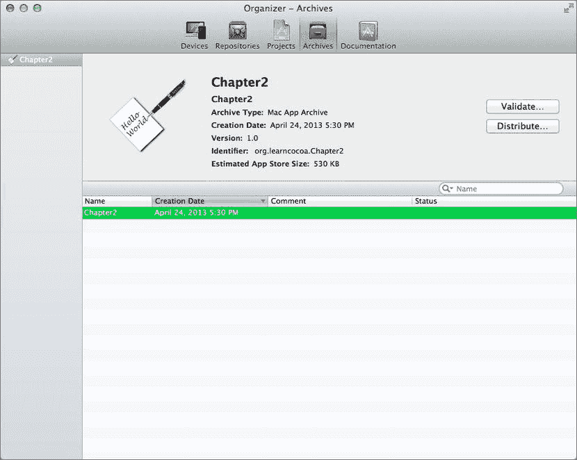

图 2-18. Xcode 的归档窗口

要准备分发应用程序，点击 `Distribute` 按钮，并选择导出为 `Application` 格式。其他选项（例如提交到 App Store 或导出为开发者 ID 签名的应用）暂时可以忽略。点击 `Next`，Xcode 会提示我们选择 `Code Signing Identity`（代码签名身份）。选择 `Don’t Re-sign`（不重新签名），再次点击 `Next`。Xcode 会询问我们保存应用的位置。在 Finder 中打开该文件夹，就能看到我们的程序了。

但这还不是全部。每次我们进行归档构建时，Xcode 都会保留该构建的副本，供我们日后参考。它不会在归档中保存源代码（源代码控制系统负责保存），但如果需要支持程序的多个发行版本，保留一份已分发版本的精确副本会非常有用。当然，当旧构建不再有用时，我们可以清理掉它们。

在结束这个话题之前，你应该对构建配置有基本的了解。`Product` 菜单下的每个不同选项都与一种构建配置相关联。Xcode 为新建项目提供了两种配置：`Debug`（调试）和 `Release`（发布）。默认情况下，我们在 Xcode 中工作时使用的是 `Debug` 配置。以这种方式构建应用时，Xcode 会加入额外的内容，方便我们对应用进行故障排查。例如，这些调试符号允许我们在程序运行时检查和更改不同变量的值，或者使用调试器逐行单步执行源代码。点击 `Run` 按钮时，我们得到的就是 `Debug` 配置。

而 `Archive` 构建过程则使用 `Release` 配置。`Release` 配置不包含调试信息，并且会对生成的程序进行更多优化。它还可以配置为进行多架构构建，以生成 32 位和 64 位的 x86 二进制文件，这也会拖慢构建过程。在准备让其他人运行应用时，我们通常需要进行此操作，但在积极开发阶段则不必。必要时我们可以定义额外的配置，但当前应用不需要这样。

恭喜！你现在是一名开发者了。你眼前的这是一个功能完整的应用程序，就像你 `Applications` 文件夹里的所有应用一样。你可以把它通过电子邮件发送给你的贝西姨妈或最好的朋友，向他们炫耀你已成为一名真正的 Mac OS X 应用程序开发者。

## 再见，“你好，世界”

在本章中，我们介绍了 Xcode，它是 Cocoa 软件开发工具的核心力量。我们在不编写一行代码的情况下，设计了一个功能完整的应用程序。我们学会了如何在应用的主窗口中添加文本标签、修改标签属性、为应用添加图标，甚至还了解了如何构建可分发的应用版本。

在本章中，我们通过观察不写代码就能完成的事情，初次体验了 Cocoa 的强大功能。在接下来的章节中，当我们真正开始编写代码时，我们将见识到它有多么强大。

