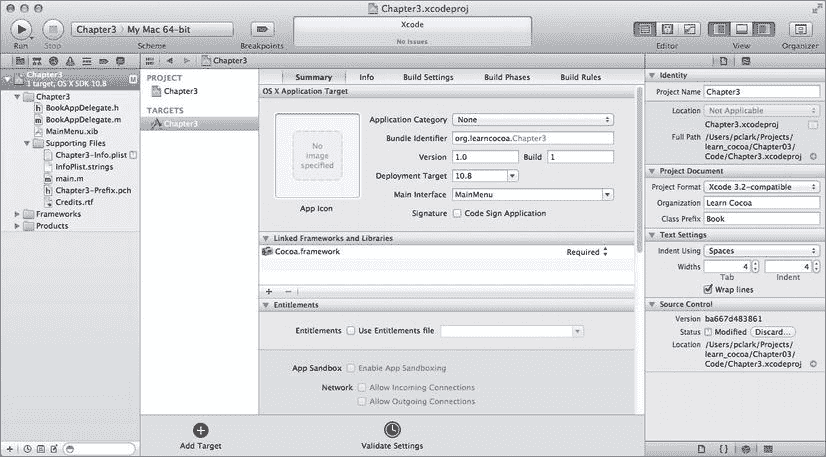
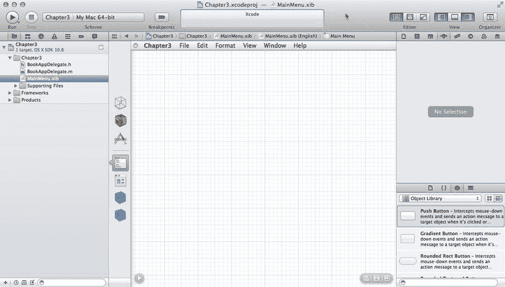
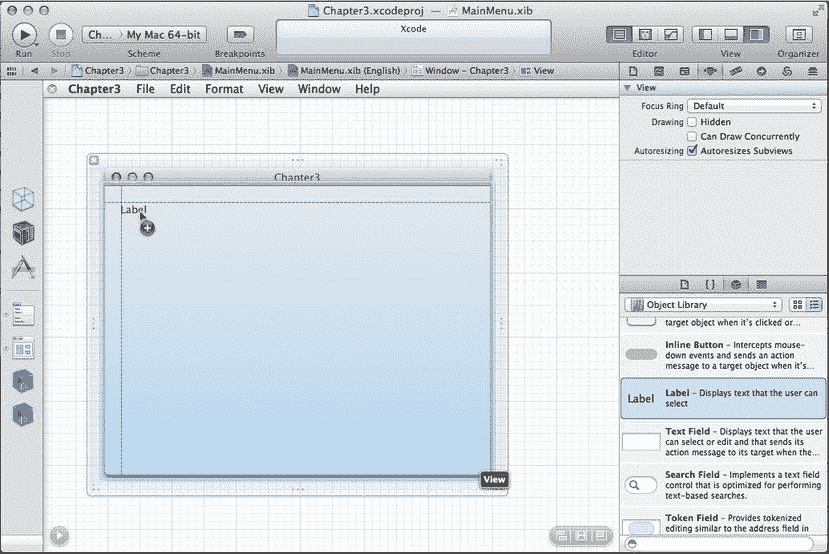
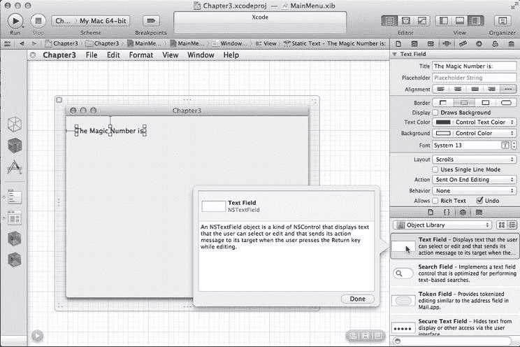
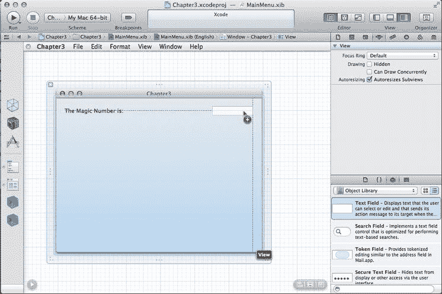
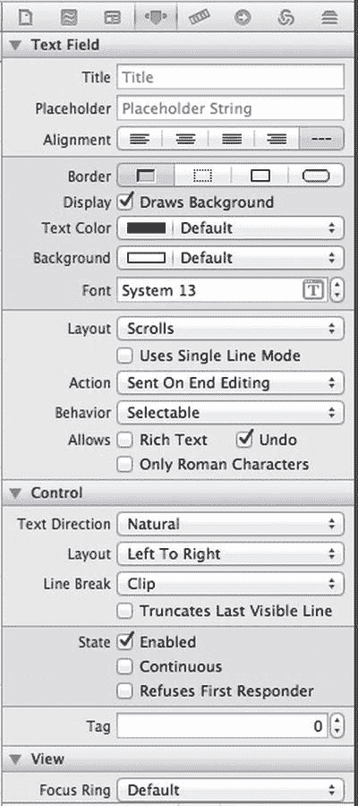
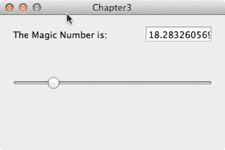
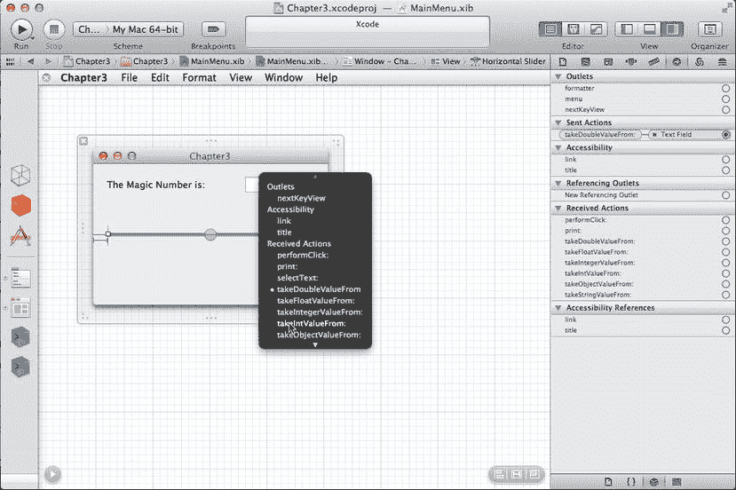
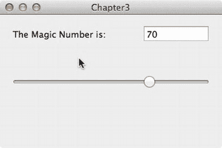

# 3. 灯光，摄像……动作！（以及输出口）

在了解一些理论之后，我们将构建一个应用程序。该应用将有一个包含标签、文本字段和滑块的单一窗口。当用户移动滑块时，文本字段会自动更新以显示滑块的值。在本章中，我们仍然不会编写任何代码；所有操作都将通过 Interface Builder 完成——但请稍安勿躁，因为我们将在下一章启用 Objective-C 编译器。Cocoa 用户界面与应用代码交互的方式，就是 Cocoa 控件彼此交互的方式。我们将首先将 Cocoa 控件相互连接，以了解其实现方法，然后在下一章中，我们将把它们连接到自己的代码上。

这个应用很简单，但用来创建它的机制与你在 Cocoa 中几乎所有用户交互中使用的机制相同，因此理解本章内容至关重要。

## 框架，无处不在的框架

在 Mac OS X 中，Apple 将代码和支持文件分组到名为 `framework` 的特殊文件夹（或包）中。`framework` 类似于大多数平台上使用的库，但它们更灵活，因为是文件夹而非平面文件。`framework` 可以包含图像、声音和影片，甚至可以包含其他 `framework`。

尽管 OS X 支持传统的 Unix 库，但操作系统的许多功能以及几乎所有使 OS X 独一无二的功能都包含在这些 `framework` 中。构成核心操作系统的 `framework` 有数十个，通常按功能分组。

**提示**：你可以通过查看 `/System/Library/Frameworks` 文件夹来了解构成 Mac OS X 的 `framework`。这些 `framework` 绝对、永远不应该被触碰，所以只看一眼，然后悄悄退出文件夹，以免被它们“发现”。如果你触碰它们，它们可能会变成讨厌的小东西。你还可以通过查看 `/Library/Frameworks` 来了解系统中安装的第三方和可选 `framework`。通常，你 Mac 上安装的程序所需的 `framework` 就位于此处。同样，只看不动，否则可能会搞乱一些重要的东西。事实上，如果你运行的是 Mountain Lion，`/Library` 目录在 Finder 中默认是隐藏的。

虽然有很多 `framework`，但在 Cocoa 编程中，绝大部分时间你只使用来自少数 `framework` 的对象。实际上，你将使用的大部分对象都来自一个单一的 `framework`，名为 **Cocoa 框架**（这并不意外）。

还记得我们说过 `framework` 可以包含其他 `framework` 吗？实际上，Cocoa 框架只是一个包装器，它封装了另外三个 `framework`，这些框架包含了编写 Cocoa 应用程序时所需的大部分功能：**Foundation 框架**、**AppKit 框架**和 **Core Data 框架**。

你会定期使用其他 `framework` 的功能。例如，你可能使用 Core Animation 框架为界面添加一些漂亮的动画，或使用 Core Image 框架进行复杂的图像处理。但绝大多数对象将来自构成 Cocoa 的三个 `framework`。我们将从第 7 章开始讨论 Core Data 框架，但让我们先花点时间简要看看另外两个框架，本章将用到它们。

### Foundation 框架

Foundation 框架名副其实。它包含了几乎所有其他部分赖以构建的对象。Foundation 框架在 Cocoa 和 Cocoa Touch 之间共享。尽管 Foundation 框架已经进化，但其中许多对象自 NeXTStep 早期就已存在，且基本用法变化不大。Foundation 包含诸如 `NSString`（用于表示 Cocoa 中文本的类）以及集合类（如 `NSArray` 和 `NSDictionary`）等对象。你从学习 Objective-C 开始就应该已经对 Foundation 框架有一定了解。

### AppKit 框架

看看你的 Mac 屏幕。你在那里看到的几乎所有内容都是 AppKit 的领域。这个框架包含用于创建或管理用户界面的所有对象。有创建按钮、窗口、文本字段、标签栏等对象。任何你在多个应用程序中见过的用户界面元素，很可能都是 AppKit 框架的一部分。上一章中你免费获得的所有酷炫功能？是的，全是 AppKit 的功劳。本章我们将构建的应用程序，也完全基于 AppKit。

### Cocoa 之道：模型-视图-控制器

在深入探讨如何使用这些框架之前，我们需要讨论一个非常重要的理论。Cocoa 的设计者遵循一个名为**模型-视图-控制器 (MVC)** 的概念，这是一种非常合理的方式来划分构成 GUI 应用程序的代码。如今，几乎所有面向对象的应用程序框架都或多或少地向 MVC 致敬，但很少有像 Cocoa 这样忠于 MVC 模型，或使用它如此之久的。

MVC 模型将所有功能划分为以下三个不同的类别：

*   **模型**：持有应用程序数据的类。
*   **视图**：用户可以看到并与之交互的窗口、控件和其他元素。
*   **控制器**：将模型和视图绑定在一起，包含决定如何处理用户输入的应用程序逻辑的部分。

MVC 的目标是使实现这三类代码的对象尽可能彼此区分开来。你编写的任何对象都应能明确识别为属于三个类别之一，并且其中几乎没有或完全没有可归类于其他两个类别的功能。例如，实现按钮的对象不应包含处理按钮点击时数据的代码，而实现银行账户的代码不应包含绘制表格以显示其交易的代码。

MVC 有助于确保最大的可复用性。一个实现通用按钮的类可以在任何应用中使用。而一个实现特定计算按钮的类，只能在最初编写它的应用中使用。

当你编写 Cocoa 应用程序时，你将主要使用 Interface Builder 创建视图组件，但有时也会通过代码修改界面，或者你可能子类化现有的视图和控件类来创建新的。

模型将通过使用 Core Data 或设计 Objective-C 类来持有应用程序数据。在本章的应用程序中，我们不会创建任何模型对象，因为我们还不打算存储数据，但我们将在下一章介绍非常简单的模型对象，并在第 8 章开始使用 Core Data 时，转向完整的模型对象。

控制器组件通常由我们创建的、特定于应用程序的类组成。控制器可以是完全自定义的类（`NSObject` 子类），这是 Cocoa 中的传统做法。几年前，Apple 开始向 AppKit 框架中引入通用控制器类，这些类为我们处理某些基本任务，例如处理要在列表中显示的对象数组。这对于最小化样板代码非常有用。

随着我们深入了解 Cocoa，你会很快开始看到 AppKit 框架的类如何遵循 MVC 原则。如果在开发时把这一概念牢记在心，你将创建出更清晰、更易于维护的代码。

## Outlets、Actions 和控制器

显然，如果无法从代码中获取数据、输出数据或更改其外观，用户界面就没多大用处。在 Cocoa 中，我们使用 `outlet` 和 `action` 来与我们在 Interface Builder 中设计的用户界面进行交互。

*   **`Outlets`**：指向 nib 文件中对象的指针。`Outlets` 允许我们从代码访问 nib 中的对象。
*   **`Actions`**：可以直接作为用户交互结果（例如点击按钮）执行的方法。它们是应用程序对象响应用户输入的方式，无论这些对象是框架类还是我们自己的代码。

`Outlets` 和 `Actions` 通常包含在控制器类中（尽管有时也在其他地方使用）。在本章中，我们将使用 AppKit 的两个类（`NSSlider` 和 `NSTextField`）暴露的 `outlet` 和 `action` 来演示如何操作。在下一章中，我们将编写自己的 `outlet` 和 `action`。

### 输出口（Outlets）

输出口是使用特殊关键字 `IBOutlet` 声明的 Objective-C 实例变量。输出口本质上只是一个可以链接到用户界面中某个对象的对象指针。由于 Cocoa 对象是 Objective-C 对象，因此它们拥有实例变量和方法。`IBOutlet` 关键字向 Xcode 的 Interface Builder 指明哪些实例变量是用于构建用户界面的。

### 动作（Actions）

动作是可直接从应用程序用户界面调用的 Objective-C 方法。它们与我们编写过的其他 Objective-C 方法一样，是普通方法，但会在用户界面控件被使用时执行。例如，如果我们将一个按钮链接到某个动作方法，那么每当该按钮被点击时，动作方法中的代码就会被触发。如果我们将一个文本字段链接到某个动作，那么每当用户通过按 Tab 键离开该文本字段或切换到其他控件时，其动作方法就会被触发。具体触发方法的条件取决于链接对象的类型，有时还取决于该对象属性的设置方式。例如，一个滑块可能仅在用户释放鼠标按钮后触发一次动作方法，也可能在滑块被拖动时反复触发该方法——具体取决于我们在 Interface Builder 中如何配置滑块实例。本章中我们将尝试这两种操作模式。

动作的创建方式与其他 Objective-C 方法完全相同，但必须使用特殊返回类型 `IBAction` 进行声明。动作必须接受一个参数（通常声明为 `id` 类型）。该参数用于告知方法是哪个界面控件调用了它。

## 输出口与动作的实际应用

理论部分已经足够，现在让我们通过编写另一个 Cocoa 应用程序来动手实践。设置新项目的步骤与上一章相同，因此这应该会让你感到熟悉。如果你尚未打开 Xcode，请将其重新打开。现在，按下 `⇧⌘N` 或从“文件”菜单选择“新建项目”。再次选择“Cocoa 应用程序”模板。确保“Core Data”和“基于文档的应用程序”复选框处于关闭状态，“使用自动引用计数”复选框处于打开状态，然后根据提示输入项目名称“Chapter3”（见图 3-1）。在本示例中，我们使用“Book”作为类前缀设置。

图 3-1. 在 Xcode 中为新 Cocoa 应用程序设置初始属性

Xcode 将为您生成一个名为 `BookAppDelegate` 的应用程序委托类，以及一个 `MainMenu.xib` 文件，并停留在项目设置视图（图 3-2）。

图 3-2. 配置项目设置

我们的所有工作都将在 `MainMenu.xib` 文件中进行，因此请在窗口左侧的导航器区域中单击该文件，它便会在 Interface Builder 模式下打开（图 3-3）。如果双击，它会在新窗口中打开，这不是我们想要的。如果发生这种情况，请关闭新窗口并再次单击 `MainMenu.xib`。

图 3-3. Xcode 中的 Interface Builder 模式

单击 Interface Builder 编辑器窗格左侧的“主窗口”图标。这将打开一个名为“Chapter3”的空白窗口。由于本章不需要导航器区域，请通过单击“视图”组中最左侧的图标将其隐藏。这可以提供更多的屏幕工作空间，并减少一些干扰。我们可以随时通过单击工具栏“视图”部分最左侧的图标来恢复显示导航器。

我们将重点关注右侧的“实用工具”区域。首先，查看 Xcode 窗口右侧底部的“对象库”窗格。滚动对象列表找到“标签”（它大约在列表顶部向下第十几个位置）。在对象库中单击“标签”，然后将其拖拽到窗口的左上角。当我们靠近左上角时，会出现蓝色对齐线，松开鼠标按钮后标签就会吸附到该位置（图 3-4）。

图 3-4. 向 第 3 章 窗口添加标签

按下 `⌥⌘4` 或单击“实用工具”区域顶部的相应按钮，将检查器窗格切换为“属性检查器”。然后，双击我们刚刚拖拽的标签，它应该会变为可编辑状态。将标签的文本修改为“神奇数字是：”（图 3-5）。

图 3-5. 编辑标签文本

这个标签有些误导性，因为页面上还没有显示任何神奇数字，所以我们需要添加一个用户界面组件来显示它。在对象库（**Object Library**）面板中，向下滚动一点找到文本字段（**Text Field**）；它应该直接位于标签（**Label**）对象的下方。如果我们在库中单击一个对象并悬停在其上，会弹出一个有用的小窗口，其中包含有关该控件的更多信息，包括该控件底层的`AppKit`类（见图 3-6）。对于文本字段，该类是`NSTextField`。当这个小弹出窗口激活时，我们可以单击对象库中的其他组件以查看每个组件的信息。如果我们单击标签，会看到标签也是一个`NSTextField`实例，但具有不同的初始显示和可编辑性设置。在学习`AppKit`类时，了解对象库中哪个类对应哪个组件非常有用；许多类承担着双重职责。

图 3-6. Xcode 可以显示关于对象库中对象的弹出信息

重新单击文本字段，将一个文本字段实例拖到我们的窗口上。将其放置在标签右侧的对面，让蓝色引导线指引你，并在引导线希望它去的位置对齐（图 3-7）。

图 3-7. Xcode 引导线有助于布局用户界面控件

看看这个文本字段的属性检查器（**Attributes Inspector**），位于实用工具区域（**Utility area**）（图 3-8）。它显示了与之前拖出的标签检查器相同的控件——这是有道理的，因为它实际上是同一个`Cocoa`对象。不可编辑的标签和可编辑的文本字段都是`NSTextField`对象的实例，只是绘制对象的参数不同。我们可以根据应用程序的需求调整对象的行为。对于这个应用，我们要防止用户通过在字段中输入内容来更改神奇数字，因为那样它就不再神奇了。要进行更改，请单击行为（**Behavior**）下拉菜单，并将其从可编辑（**Editable**）更改为可选中（**Selectable**）。现在用户无法更改它，但他们可以用鼠标选中并复制它。

图 3-8. 文本字段的属性检查器

让我们把包含神奇数字的窗口缩小一点；在非必要的情况下，我们不想占用太多屏幕空间。窗口可通过透明边框外围的调整手柄进行调整大小，如图 3-9 所示。单击其中一个调整手柄并缩小窗口；我们会看到窗口的宽度和高度指示，并且在调整大小时会看到窗口重绘，以便我们了解调整大小对内容的影响。

图 3-9. 在 Xcode 中调整应用程序主窗口的大小

窗口稍微变小后，我们可以继续布局。下一个要添加的是水平滑块（**horizontal slider**）。在对象库中查找；我们可以向下滚动对象列表直到找到它，或者在对象库下方的搜索字段中输入几个字符。输入“hor”或“sli”可以很好地缩小范围，便于找到该控件。一旦列表中出现水平滑块，将滑块拖到窗口左中部（图 3-10）。蓝色引导线会显示将其放置在哪里。

图 3-10. 向应用程序窗口添加滑块

由于滑块未填满窗口，请单击滑块一次，以显示其两侧的缩放控制柄。从滑块右侧向外拖动，将其拉伸至窗口右边距的蓝色参考线处（图 3-11）。

图 3-11. 调整滑块大小以填满窗口

查看实用工具区域中滑块的属性检查器（参见图 3-12）。默认情况下，滑块的值范围为 0 到 100，但我们可以根据需要将其更改为任意整数值。在“控件”部分下，勾选标有“*Continuous*（连续）”的复选框。

图 3-12. 滑块的属性检查器

现在，我们将施展一些魔法。我们要将滑块连接到文本字段。按住 Control 键的同时，单击滑块。同时按住 Control 键和鼠标按钮，将光标向上移动到文本字段。一条蓝色线条将从滑块延伸至鼠标指针。将此线条拖动到文本字段。当我们将鼠标拖动到文本字段上时，文本字段会高亮显示为蓝色（图 3-13）。

图 3-13. 从滑块按住 Control 键拖动到文本字段以建立连接

在文本字段高亮时，松开鼠标。此时会出现一个灰色小窗口，列出“Outlets（输出口）”、“Accessibility（辅助功能）”和“Received Actions（已接收操作）”（图 3-14）。选择 `takeDoubleValueFrom:`，文本字段会闪烁几次以确认连接。随后蓝色线条会消失。毫不意外，这种操作称为按住 Control 键拖动，是在 Interface Builder 中连接输出口和操作的主要机制。

图 3-14. 设置滑块与文本字段之间的连接操作

要查看我们刚刚建立的连接，请选择实用工具区域中的“连接检查器”。在“已发送操作”下会有一条记录，显示 `takeDoubleValueFrom:` 已连接到文本字段（图 3-15）。

图 3-15. 滑块的连接检查器，显示正在对文本字段调用的操作

我们刚才做了什么？我们刚才所做的是在滑块和文本字段之间建立了一个连接。现在，文本字段是滑块的“目标”。当滑块值发生变化时，它会调用我们设置在其目标上的方法。在此例中，我们选择的是 `takeDoubleValueFrom:`。此方法会指示文本字段向滑块请求其值（类型为 double），然后文本字段将自身值设置为从滑块获取的值并重新绘制自身。勾选滑块的“Continuous（连续）”复选框意味着，当滑块来回拖动时，它将重复调用其目标上的操作方法。

为了达到这一步，我们进行了很多设置。现在，让我们见证实际操作的效果！在 Xcode 的“Editor（编辑器）”菜单（不是“Edit（编辑）”，而是“Editor”）下，选择底部的“Simulate Document（模拟文档）”。Xcode 会运行一个名为 Cocoa Simulator 的程序，该程序会加载我们程序的 `.xib` 文件，并允许我们与之交互。单击滑块，并来回拖动。当拖动时，文本字段中的值应随之改变，以反映滑块的位置，如图 3-16 所示。由于我们指示文本字段使用滑块的 double 值，因此显示的值将包含小数点。请注意，我们仍然没有编写任何代码；我们所做的仅仅是将两个 Cocoa 控件连接在一起。

图 3-16. 当滑块移动时，文本字段自动更新

玩过滑块后，退出 Cocoa Simulator 并返回 Xcode。再次从滑块按住 Control 键拖动到文本字段，这次从灰色窗口中选择 `takeIntValueFrom:` 操作（图 3-17）。注意，实际上有两个名称相似的操作：`takeIntValueFrom:` 和 `takeIntegerValueFrom:`。它们的区别在于，文本字段是向滑块请求其值作为 `int` 类型，还是作为 `NSInteger` 类型。两者中的任何一个都适用于我们的目的。这将替换我们之前建立的连接，因为一个滑块一次只能有一个目标。

图 3-17. 将操作从 `takeDoubleValueFrom:` 更改为 `takeIntValueFrom:`

再次运行 Simulate Document，并再次拖动滑块。这次，文本字段中显示的数字应该只是一个整数，不带小数点，如图 3-18 所示。退出 Cocoa Simulator，因为我们完成了！

图 3-18. 滑块更新文本字段，但现在只显示整数值

## 总结

在本章中，我们学习了如何使用输出口和操作将对象彼此连接，了解了一些关于 OS X 框架的背景知识，并获得了更多在 Xcode 中布局用户界面的实践经验。输出口和操作是构建 Cocoa 应用程序的基本概念，在接下来的章节中我们将进行大量的按住 Control 键拖动操作。然而，这可能还不太像编程。你的耐心即将得到回报，因为在下一章中，我们将实际编写一些代码，实现我们自己的操作方法，并了解如何将 Cocoa 界面对象连接到我们自己的代码，而不仅仅是相互连接。

