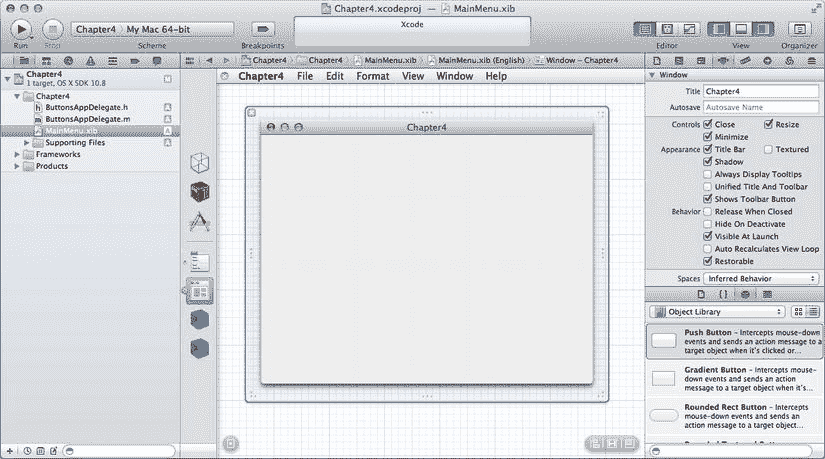
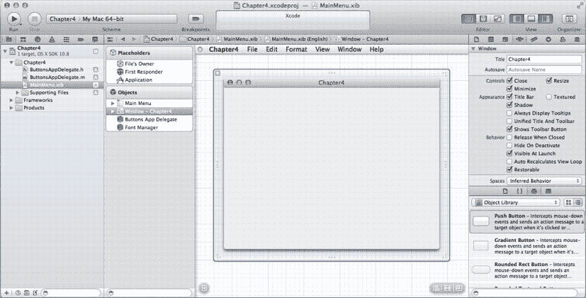
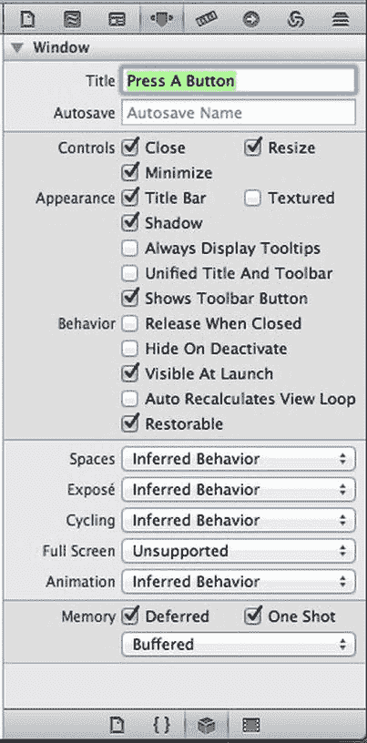
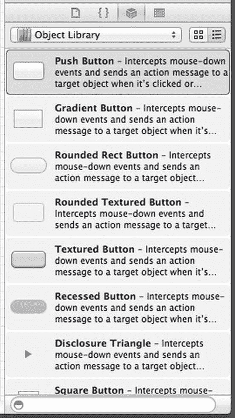
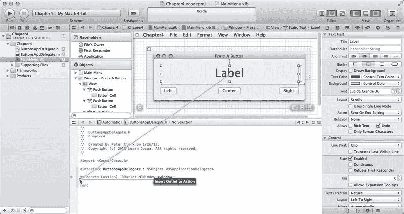
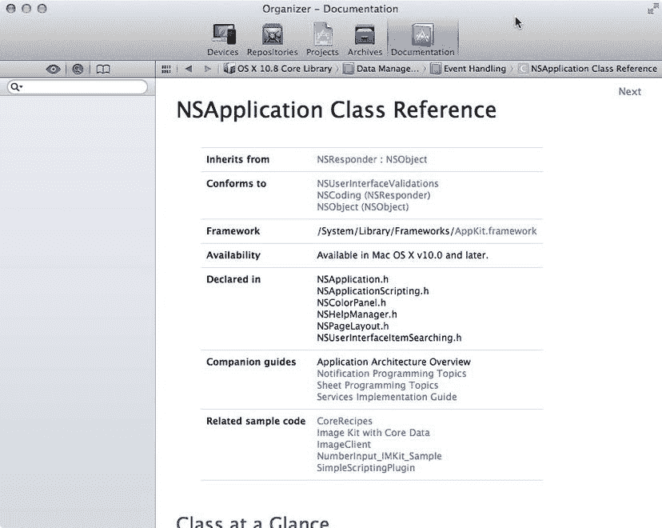

# 4.  行动的号角

正如我们在前两章中所见，Cocoa 提供给我们的一切免费功能实在令人惊叹。但前两个应用程序中缺少了一个大多数应用程序都需要的非常重要的东西：与用户交互的能力。在上一章使用 Interface Builder 时，我们看到有一个完整的库，里面装满了诸如文本字段和按钮之类的对象，我们可以用它们来组装界面，但如果我们无法获知这些用户界面对象何时被使用或无法更改它们包含的数据，那么它们就毫无用处。在本章中，我们将了解如何使用这些对象让用户与我们的应用程序进行交互——通过对象的输出口和操作。

## 声明输出口和操作

回顾上一章，Cocoa 使用称为输出口和操作的东西来连接用户界面中的对象与我们代码中的对象。输出口是指向我们 nib 文件中对象的指针，它允许我们的代码访问和操作 nib 中的对象。操作是我们编写的方法，可以因用户交互（例如单击按钮或用户选择菜单项）而直接执行。输出口和操作通常包含在我们的控制器类中（尽管有时也用于其他地方）。


### 声明输出口（Outlets）

输出口是使用特殊关键字 `IBOutlet` 声明的 Objective-C 实例变量。输出口是一个指针，可以链接到用户界面中的某个对象。例如，我们的控制器类可以像这样声明一个指向可编辑文本字段的输出口：

`@property (weak) IBOutlet NSTextField *nameField;`

在这个例子中，就代码层面而言，`nameField` 是一个指针，指向我们在 Interface Builder 中链接到的任意文本字段。它的行为与指向我们自行分配并初始化的对象的指针完全相同。一旦输出口链接到某个对象，我们就可以检索或设置其值、隐藏它、禁用它，或者执行该对象支持的任何其他操作。稍后我们将介绍如何在 nib 文件中建立输出口与对象之间的链接。

属性 `(weak)` 包含在 Xcode 在 `.h` 文件中生成输出口的代码中。这意味着控制器并不“拥有”`nameField`；`nameField` 可能会被释放，如果发生这种情况，该属性将被设置为 nil。属性上还可以设置其他属性，这些属性涉及内存语义和命名。当我们手动添加属性时，需要熟悉可用于注释属性的各种属性。目前，请保持 Xcode 生成的样式不变。

你可以通过 Mark Dalrymple 和 Scott Knaster 合著的《在 Mac 上学习 Objective-C》（Apress，2012 年）第二版，以及 Xcode 和 Apple 开发者网站 [`https://developer.apple.com/library/mac/documentation/Cocoa/Conceptual/ObjectiveC/ObjC.pdf`](https://developer.apple.com/library/mac/documentation/Cocoa/Conceptual/ObjectiveC/ObjC.pdf) 上提供的 *The Objective-C Programming Language* 一书，了解更多关于新 Objective-C 属性的信息。

### 声明动作（Actions）

如前章所述，动作是可以直接从应用程序用户界面调用的 Objective-C 方法。对象中的动作通过以下方式连接到用户界面：在 Interface Builder 中，从用户界面控件按住 Control 键拖拽到代码中的某个方法。

动作的创建方式与其他 Objective-C 方法完全相同，但它们必须符合特定的结构。具体来说，动作方法的声明必须如下所示：

`-(IBAction)doSomething:(id)sender;`

方法名称可以是任意的，但返回类型必须是 `IBAction`，并且该方法必须接受一个类型为 `id` 的参数，该参数是指向触发该动作的对象的指针。如果此方法因用户点击按钮而被调用，那么 `sender` 将是指向所按下按钮的指针。一个动作可以是多个用户界面对象的目标，而 `sender` 参数可以让我们知道正在使用的是哪个控件。

**注意**

动作方法是 Cocoa 和 Cocoa Touch 存在差异的一个领域。在 Cocoa Touch 中，动作方法可以具有三种不同的方法签名之一，分别接受零个、一个或两个参数。但在 Cocoa 中并非如此，动作方法必须且只能接受一个参数。

#### 但它们究竟是什么？

`IBAction` 和 `IBOutlet` 究竟是什么？它们是 Objective-C 语言的一部分吗？

不。它们是经典的 C 预处理器宏。如果我们进入 `AppKit.framework` 并查看 `NSNibDeclarations.h` 头文件，会发现它们是这样定义的：

```
#ifndef IBOutlet
#define IBOutlet
#endif

#ifndef IBAction
#define IBAction void
#endif
```

感到困惑吗？对编译器而言，这两个关键字完全不起作用。`IBOutlet` 会在编译器看到之前被完全从代码中移除。`IBAction` 解析为一个 void 返回类型，这仅仅意味着动作方法不返回值。那么，这到底是怎么回事呢？

答案其实很简单：`IBOutlet` 和 `IBAction` 并不是给编译器用的。它们是给 Interface Builder 用的。Interface Builder 使用这些关键字来解析可用的输出口和动作。Interface Builder 只能看到以 `IBAction` 开头的方法，并且只能看到以 `IBOutlet` 开头的变量或属性。此外，这些关键字的存在也告诉未来阅读我们代码的其他程序员，所涉及的变量和方法并不完全在代码中处理。他们需要深入相关的 nib 文件才能了解这些对象是如何连接和使用的。

## 输出口与动作实战，第二幕

亲手实践这些概念无可替代，因此我们将编写另一个 Cocoa 应用程序。在这个应用中，我们将自己编写一些代码。设置新项目的过程将遵循我们在前一章中使用的一系列相同步骤，所以应该会感到熟悉。事实上，每次创建新项目时，我们都会重复这些步骤。

如果你尚未处于 Xcode 中，请将其重新打开。现在，按下 ⇧⌘N 或从 `File` 菜单中选择 `New Project`。再次选择 Cocoa Application 模板。确保 Core Data 和 Document-Based Application 复选框处于关闭状态，Use Automatic Reference Counting 复选框处于开启状态，并在提示输入项目名称时，输入 `Chapter4`（图 4-1）。对于此示例，我们将使用 `Buttons` 作为类前缀。再次点击 Next 并为我们的项目选择一个文件夹。点击 Create，Xcode 就会让我们进入项目设置面板。Xcode 还为我们生成了一个名为 `ButtonAppDelegate` 的类和一个名为 `MainMenu.xib` 的 nib 文件。


**图 4-1.** 在 Xcode 中设置新 Cocoa 应用程序的初始属性

我们将从布局界面开始，因此请在导航器窗格中单击 `MainMenu.xib`。这将在 Interface Builder 编辑器窗格中打开 nib 文件（图 4-2）。



**图 4-2.** 在 Xcode 的 Interface Builder 编辑器中 `MainMenu.xib` 窗口的初始视图

在 Interface Builder 窗格的左下方，有一个小的灰色三角形，类似于播放按钮。点击它，Interface Builder 窗格左边框上的一组图标将展开为一组占位符和一组对象（图 4-3）。我们将使用 Objects 部分中名为 `Window - Chapter4` 的对象。



**图 4-3.** 将 nib 内容展开为占位符和对象


### 占位对象

不过，在此之前，请先花点时间看看 nib 文件中的前三个图标。这些图标在 Cocoa nib 文件中始终存在。我们无法删除它们，而且与其他图标不同，当 nib 文件被加载时，它们并不会创建对象实例。这三个被称为占位对象，它们允许此 nib 文件中的对象与某些已经存在的对象建立连接。

任何 nib 文件中的第一个图标都称为`File’s Owner`（文件所有者）。这个图标是一个占位符，指向从磁盘加载该 nib 文件的对象实例，换句话说，就是“拥有”该 nib 文件的对象实例。在应用程序的`MainMenu.xib`文件中（就像我们这里这样），`File’s Owner`图标始终指向`NSApplication`的一个实例，这是一个代表整个应用程序的类，它接收输入，并确保根据输入调用相应的代码。对于其他 nib 文件，`File’s Owner`可能是不同的类，例如文档类的实例，或者代表插件的类。

这个 nib 文件以及任何其他 nib 文件中的第二个图标称为`First Responder`（第一响应者）。我们将在第 10 章中详细讨论响应者，但简单来说，第一响应者就是用户当前正在交互的对象。例如，如果光标正在文本字段中键入内容，那么该文本字段就是当前的 first responder。当用户与界面交互时，first responder 会发生变化，而`First Responder`图标为我们提供了一种便捷的方式，可以与当前获得焦点的任何控件或视图进行交互，而无需编写代码来确定是哪个控件或视图。

第三个图标称为`Application`（或应用程序占位符），它是 Cocoa nib 文件中相对较新的添加。此对象指向此应用程序唯一的`NSApplication`实例。在`MainMenu.xib`文件中，应用程序代理和`File’s Owner`占位符始终指向完全相同的内容。应用程序占位符使我们能够从任何 nib 文件访问我们应用程序的`NSApplication`实例，即使是那些`File’s Owner`不是`NSApplication`的 nib 文件。在本章中，我们可以忽略应用程序占位符，因为这个 nib 文件的`File’s Owner`已经让我们可以访问那个对象。

### 设置窗口

现在我们可以开始布置窗口了。在“对象”部分，选择标记为`Window - Chapter4`的图标，窗口将显示在 Interface Builder 面板上，并带有蓝色边框表示已选中。实用工具区域中的“检查器”面板将显示窗口可调整的设置（图 4-4）。我们将对默认设置进行一些更改。



图 4-4.

属性检查器显示了窗口可用的选项

将窗口的标题从“Chapter4”更改为“Press a Button”。标题下方的字段标记为`Autosave`（自动保存）。如果我们在此字段中提供值，应用程序将自动在用户偏好设置中保存窗口的位置、大小和其他信息，这样当用户再次启动应用程序时，会发现窗口正好停留在上次关闭时的位置。我们在此处输入什么值并不重要，只要对应用程序中的每个窗口都是唯一的即可。如果我们对任意两个对象使用相同的自动保存名称，则其中一个将无法保存。在此处输入“mainWindow”。

在`Autosave`字段正下方，有三个复选框，用于控制窗口的一些基本行为。`Close`（关闭）复选框用于启用或禁用关闭窗口的功能。在只有一个窗口的实用工具应用程序中，我们可以取消选中此框，这样窗口就无法关闭。如果此框未选中，则窗口标题栏中的红色“关闭”按钮和`Close`菜单项都将被禁用。如果我们允许关闭窗口，则应提供一种使窗口再次可见的方法。或者，如果我们的应用程序是仅由一个窗口组成的实用工具，那么当窗口关闭时让应用程序退出也是可以接受的。在本章后面，我们将配置应用程序在关闭此窗口时退出，因此暂时保持`Close`复选框的原样。在后续章节中，我们将学习如何使已关闭的窗口重新可见。

`Minimize`（最小化）复选框控制窗口是否可以使用窗口标题栏中的黄色按钮或从`Window`菜单中选择`Minimize`来最小化到 Dock。一般来说，窗口应该能够被最小化。但也有例外，例如仅在应用程序位于最前面时才可见的实用工具窗口，但绝大多数情况下我们都应该保持此复选框处于选中状态。

第三个复选框是`Resize`（调整大小），它控制用户是否可以通过拖动右下角来更改窗口的大小。对于此应用程序，我们将禁用此窗口的调整大小功能，因此取消选中`Resize`。我们将在本书后面学习如何处理可在调整大小时变化的窗口中的控件。

暂时保持其余属性不变。代表窗口的类是一个非常灵活的类，其他属性让我们能够对应用程序的外观以及它如何响应 OS X 中一些更高级的用户功能（如 Expose、Spaces 和全屏模式）拥有极大的控制权，但对于大多数窗口来说，默认设置就是我们想要的。

现在，按下`⌥⌘5`调出“大小检查器”（图 4-5）。在这里，我们可以设置所选对象的大小以及与大小相关的属性。正如我们在上一章中看到的，可以使用鼠标移动和调整对象的大小，但此检查器让我们能够更精确地控制对象的大小和位置。


图 4-5.

应用程序窗口的“大小检查器”


将窗口的宽度设为 480 像素，高度设为 130 像素。将窗口的 `x` 值设为 100，表示我们希望窗口的初始位置位于屏幕左侧。`y` 值可能会稍显棘手，原因在于 Mac 显示器的几何特性。Mac 屏幕的坐标系以屏幕左下角为 0 点，随着我们向屏幕顶部移动，`y` 值会逐渐增大。这里的问题是，并非每个人的显示器尺寸都相同，因此对于不同尺寸的显示器，任何给定的 `y` 值相对于屏幕顶部的位置都会有所不同。

幸运的是，Cocoa 会自动调整窗口的位置，确保窗口始终显示在屏幕上，即使我们指定的位置会导致窗口部分位于屏幕之外也是如此。而且，因为我们为窗口指定了自动保存名称，用户在首次启动应用后，每次再次启动时，窗口都会显示在上次退出应用时的位置。但有时，让窗口从屏幕顶部开始的某个特定位置启动也很重要。

请注意“大小检查器”底部的小示意图；它根据您自己屏幕的尺寸，直观地展示了窗口的初始位置。白色小框代表窗口，大框代表屏幕减去菜单栏后的区域。白色框四边上的红色 I 形光标让我们可以控制窗口相对于屏幕边缘的相对位置。我们可以将窗口放置在屏幕上的理想位置，然后使用 I 形光标锁定相对于屏幕左侧和顶部的定位。点击某个 I 形光标将允许窗口相对于屏幕的那一侧按比例移动。点击底部的 I 形光标会让窗口从底部浮动，但保持与屏幕顶部的固定距离。同时点击顶部和底部的 I 形光标将使窗口在屏幕上垂直居中。

我们需要设置一个 `y` 值，使窗口靠近菜单栏，但又不紧贴它。最简单的方法是使用“大小检查器”中的屏幕表示，直接将应用的主窗口移动到我们想要的位置。然后，如有必要，我们可以通过数值微调其大小和位置。一旦窗口的初始位置符合要求，点击底部的 I 形光标，使其变为条纹状。我们也可以通过选择“初始位置”部分的底部弹出菜单，并将其从`垂直比例`更改为`固定距顶部`来进行此更改。

## 设计窗口界面

在对象库中，选择“对象库”下拉菜单，然后选择`Controls`。这将为我们提供一系列不同的按钮和文本字段供使用（图 4-6）。底部列表中的第一项应该是`Push Button`，这是一个标准的 OS X 按钮。



图 4-6.

Xcode 实用工具区域中的对象库视图

抓取其中一个并将其拖到窗口界面中。会出现蓝色参考线，指示按钮何时位于左边缘、右边缘或中心位置的合适位置。使用蓝色参考线将按钮放置在窗口的右下部分（图 4-7）。一旦按钮位于正确的位置，松开鼠标，窗口上就会出现一个按钮。现在双击该按钮，就可以编辑按钮的标题。将其标题从“Button”改为“Right”。


图 4-7.

为主窗口添加一个按钮

从库中再拖出第二个按钮，再次使用蓝色参考线将其放置在窗口的左下角。放置好这个按钮后，双击它并将其标题改为“Left”。

再拖入一个按钮，使用底部的蓝色参考线将按钮与窗口底部保持适当的距离。将其放置在窗口的水平中心位置，同样，会出现一条蓝色参考线帮助我们正确定位。放置好后，双击第三个按钮并将其标签改为“Center”。此时窗口应如图 4-8 所示。


图 4-8.

窗口应如图所示，三个按钮都已布局好

请注意，当我们向窗口添加控件时，界面生成器窗格左侧的对象显示区会展开，显示新增的控件以及视图的约束集，这在图 4-8 中同样可见。约束部分控制着控件的布局如何响应窗口大小的调整。

接下来，我们需要一个标签，以便告知用户按下了哪个按钮。标签是一种图形用户界面对象，可以用我们选择的字体和大小来显示一段文本。在我们的应用代码中，我们可以随时通过编程方式更改标签的文本。从库中抓取一个标签。您可能需要向下滚动控件列表，或者直接使用搜索框。将标签拖到窗口的左上角，并使用参考线使其与顶部和左边距正确对齐。

点击标签右侧的调整大小手柄，向右拖动直至到达窗口右侧的蓝色参考线，然后松开。保持选中标签状态，按下 `⌥⌘4` 调出实用工具窗格中的属性检查器，并使用“文本对齐”按钮将文本居中。然后点击“字体”设置右侧的小 `T` 图标。这将调出一个特殊的字体面板，如图 4-9 所示。将字号改为 36，可以直接输入数字，也可以使用 `Size` 字段右侧的小箭头按钮。完成后，剩下的就是双击标签（这会使标签进入编辑模式），然后按 Delete 键删除文本。在按下按钮之前，我们不希望这个标签显示任何内容。


图 4-9.

更改标签的字体

至此，用户界面就设计完成了，所以接下来我们需要编写一些代码，以便在按下三个按钮中的任意一个时更新标签中的文本。


## 创建控制器类

我们将向 `ButtonAppDelegate` 类中添加一些代码。该类将作为控制器，负责处理我们三个按钮的点击操作。在我们刚刚布置好的窗口中，我们设置了三个按钮和一个文本字段。当用户按下某个按钮时，文本字段的值应随之更新。由于我们需要修改文本字段显示的内容，因此需要为其创建一个输出口。同时，我们还需要一个供按钮触发的操作方法。由于操作方法会接收指向触发对象的指针，因此我们可以为三个按钮使用同一个操作方法。现在，我们就来设置这个输出口和操作方法。

为此，我们需要将用户界面元素与代码建立一些连接。在上一章中，我们讨论了如何从一个 UI 元素按住 Control 键拖拽到另一个 UI 元素。这里我们将执行类似的操作。

在 nib 文件编辑器仍处于打开状态时，我们还需要调出一个包含代码的窗格。点击 Xcode 主窗口工具栏右侧编辑器组中的“助理”按钮（其图标类似管家的上半身）。我们也可以通过键入 ⌥⌘⏎ 来打开助理编辑器。通过选择 `View` ➤ `Assistant Editor` 下的不同选项，可以将该窗格放置在 nib 编辑器窗格的侧边或下方。

助理编辑器窗格会在编辑器区域上方的跳转栏中显示当前文件的名称。点击文件名，会弹出一个菜单，显示 `ButtonsAppDelegate.h` 和 `ButtonsAppDelegate.m` 两个名称。如果未选中 `ButtonAppDelegate.h`，请选择它。我们会看到 Xcode 为我们生成的类接口。生成的代码如下所示（忽略文件顶部的注释块）：

```
#import <Cocoa/Cocoa.h>
@interface ButtonsAppDelegate : NSObject <NSApplicationDelegate>
@property (assign) IBOutlet NSWindow *window;
@end
```

在上一章中，我们从一个用户界面对象按住 Control 键拖拽到另一个对象。这次，我们要从 nib 文件按住 Control 键拖拽到我们的代码中。在 nib 编辑器窗格中，点击我们添加到窗口中的那个标签。然后，从标签按住 Control 键拖拽到 `.h` 文件中，向下拖拽到 `@property` 行下方的空白行处，此时文本编辑器中会出现一条蓝色线条，显示“插入输出口或操作”，如图 4-10 所示。松开鼠标按钮，会出现一个小弹出窗口，我们可以在其中配置这个新连接。



**图 4-10.** 从 nib 对象按住 Control 键拖拽到代码编辑器以连接输出口或操作

在此弹出窗口中，将连接类型标记为 Outlet，并将名称设置为“label”。其他字段保留默认设置，然后点击 Connect（连接）。Xcode 会在 `.h` 文件中添加一行新代码，内容如下：

```
@property (weak) IBOutlet NSTextField *label;
```

属性声明在我们的类中创建了一个名为 `label` 的新属性。该声明还包含了 `IBOutlet` 关键字，这将允许 Xcode 找到我们的输出口，并使其在 Interface Builder 中可用。Xcode 还在类实现中添加了一行代码，我们可以通过点击跳转栏中的文件名并选择 `ButtonsAppDelegate.m` 来查看。该文件现在看起来如下：

```
#import "ButtonsAppDelegate.h"
@implementation ButtonsAppDelegate
- (void)applicationDidFinishLaunching:(NSNotification *)aNotification
{
    // 在此处插入代码以初始化你的应用程序
}
@end
```

根据你的 Xcode 版本，你可能会在这里看到一行 `@synthesize label`。如果看到它，这行代码会指示编译器为 `label` 属性生成 getter 和 setter 方法。最新版本的 Xcode 根本不会生成这行代码，因为编译器现在可以自动推断何时需要为属性生成 getter 和 setter 方法，但你在旧代码（包括 Apple 的许多示例代码项目）中会看到它。无论你是否看到这行代码，因为我们已将此输出口连接到窗口中的标签，所以当 nib 文件加载时，`label` 属性将自动连接到 `NSTextField` 标签对象。

### 实现操作方法

我们将执行相同的操作为我们的类创建一个操作。在尝试运行程序之前，剩下的唯一任务就是实际编写在按钮被点击时将调用的代码，我们现在就来做这件事。这段代码将查看 sender 参数以确定被调用按钮的标题，使用该标题创建一个字符串，然后使用我们的标签输出口来显示该字符串。

在跳转栏中，选择显示 `ButtonsAppDelegate.h`。接下来，选择我们标题为“Left”的按钮。从 Left 按钮按住 Control 键拖拽到代码中，位于我们之前创建的 `@property` 行下方。这次，选择连接类型为 Action。将操作命名为 `buttonPressed:`，其他字段保留默认设置。当我们点击 Connect（连接）时，Xcode 会为我们创建一个新的实例方法，该方法遵循操作的约定。与我们添加的属性类似，当 nib 文件加载时，此操作也将自动连接。

如果我们切回 `.m` 文件，会看到一个如下所示的新空方法：

```
- (IBAction)buttonPressed:(id)sender {

}
```

我们将用代码填充此方法，以在标签中显示按下了哪个按钮。将以下代码输入到方法体中：

```
- (IBAction)buttonPressed:(id)sender {
    NSString *title = [sender title];
    NSString *labelText = [NSString stringWithFormat:@"%@ button pressed.", title];
    [self.label setStringValue:labelText];
}
```

此方法首先获取调用它的按钮的标题。然后使用该按钮创建一个新字符串，再使用该字符串更新标签。该方法使用点表示法来访问属性，这只是 `[self label]` 的简写方式。

#### 嵌套消息

一些 Objective-C 开发者会非常深度地嵌套消息调用。你在开发过程中可能会遇到如下代码：

```
[self.label setStringValue:[NSString stringWithFormat:@"%@ button pressed.",
    [sender title]]];
```

这行代码的功能完全等同于构成我们 `buttonPressed:` 方法的三个代码行。为了清晰起见，在本书的代码示例中，我们通常不会如此深度地嵌套 Objective-C 消息，除了对 `alloc` 和 `init` 的调用（根据长期以来的约定，这两者几乎总是被嵌套的）。

在上一章中，我们使用“模拟文档”命令来操作我们设置好的控件和连接。当时这样操作是可行的，因为我们没有编写代码。这次，我们已有了一些代码，因此需要实际编译和链接应用程序。点击 Xcode 窗口左上角的“运行”按钮，或按下 ⌘R。如果这是你第一次尝试运行自定义代码，可能会出现一个窗口询问是否要在本 Mac 上启用开发者模式。请继续点击启用；系统会提示你输入密码作为安全措施。你的代码应该能顺利编译，然后你会看到“按下一个按钮”窗口。如果你点击 Left 按钮，标签应更新显示为“Left button pressed。”如果你点击中间或右侧按钮，什么也不会发生，因为你尚未连接这些按钮。稍后我们会处理这个连接，但现在请注意，你已经成功运行了一个包含自己代码的、活生生的 Cocoa 应用程序！

退出该应用程序，你会返回 Xcode，并停留在你离开时的位置。你应该仍能看到窗口一侧打开着 nib 编辑器窗格，另一侧是已打开到 `.m` 文件的助理编辑器。接下来，我们将为 Center 和 Right 按钮与 `buttonPressed:` 操作建立连接。实际上，我们可以从 `.h` 或 `.m` 文件向现有操作建立连接。


在控件中选择`Center`按钮，然后按住 Control 键拖拽至`.h`或`.m`文件中的`buttonPressed:`方法。当指针触达有效操作时，该操作会以蓝色轮廓高亮显示，并出现一个显示“连接操作”的小窗口。松开鼠标，连接即告完成。对`Right`按钮执行相同操作。

与之前一样，点击 Xcode 窗口左上角的`Run`按钮，应用将编译并启动。这一次，点击任意三个按钮都会更新标签。这一个操作方法能妥善处理所有三个按钮。将窗口移动至新位置并退出应用。按下`⌘R`再次启动程序，窗口应会精确显示在我们退出程序时的同一位置。若点击标题栏中的黄色`Minimize`按钮，窗口将缩小至程序坞（点击程序坞中的图标可最大化窗口）；若按下`⌘W`或点击窗口中的红色关闭按钮，窗口将关闭。但遗憾的是，应用仍在运行，且无法重新打开窗口。现在我们通过配置应用在窗口关闭时退出，来解决这个问题。为此，我们需要使用一个名为**应用程序委托（Application Delegate）**的机制。

## 应用程序委托

每个 Cocoa 应用都有且仅有一个名为`NSApplication`的类实例。我们无需频繁直接与`NSApplication`交互。它会自动创建，并为我们处理事件循环（即应用识别来自鼠标和键盘的用户输入，并通过向相应对象发送消息来处理输入的部分）以及大多数底层事务，无需我们过多操心。

展开项目导航器窗格中的`Supporting Files`文件夹，单击`main.m`文件。该文件中包含我们应用的`main()`函数，这个函数会在应用启动时被调用。此函数仅有一行代码，用于调用一个名为`NSApplicationMain()`的函数。该函数是 Cocoa 的一部分，会自动为我们创建`NSApplication`实例。这个`NSApplication`实例会进入一个循环，持续轮询来自键盘、鼠标、操作系统以及其他应用的事件，然后响应这些事件（暂时无需担心具体细节；我们将在本书后续章节中深入了解事件）。当它检测到表示应用应退出的事件时，事件循环停止，应用的执行随之结束。

`NSApplication`允许我们指定一个可选对象作为其委托。简单来说，委托是一个代表另一个类处理特定任务的类。应用程序委托允许我们的应用在生命周期的特定时刻执行操作，从而避免了对`NSApplication`进行子类化所带来的复杂性。

应用程序委托可以是任何类的任何实例，但只能有一个对象作为应用程序委托。几乎每个应用都需要一个应用程序委托对象。由于这是一种常见模式，系统已为我们创建的`ButtonsAppDelegate`类在 nib 文件中被配置为应用程序委托。`ButtonsAppDelegate.h`文件中的`ButtonsAppDelegate`类声明表明，该类实现了`NSApplicationDelegate`协议。

### 配置应用在窗口关闭时退出

单击`ButtonsAppDelegate.m`文件，并添加一个名为`applicationShouldTerminateAfterLastWindowClosed:`的方法，如下方加粗部分所示：

```
#import "ButtonsAppDelegate.h"

@implementation ButtonsAppDelegate

- (void)applicationDidFinishLaunching:(NSNotification *)aNotification
{
    // 在此处插入初始化应用的代码
}

- (BOOL)applicationShouldTerminateAfterLastWindowClosed:(NSApplication *)sender {
    return YES;
}

- (IBAction)buttonPressed:(id)sender {
    NSString *title = [sender title];
    NSString *labelText = [NSString stringWithFormat:@"%@ button pressed.", title];
    [self.label setStringValue:labelText];
}

@end
```

这个新方法是那些特殊的应用程序委托方法之一。在应用运行的某些预定义时刻，`NSApplication`会检查其委托是否实现了某个特定方法。如果委托实现了，`NSApplication`就会调用该方法。我们刚刚实现的这个方法的存在，就是为了让我们在不进行子类化的情况下改变`NSApplication`的行为。默认行为是，即使没有窗口打开，`NSApplication`也会持续运行，直到被明确告知退出。然而，对于应用在最后一个（或唯一）窗口关闭时退出，也是可以接受的，而这个方法正是为了允许委托改变此行为而专门提供的。

再次运行应用，当应用主窗口出现时将其关闭。此时应用应会退出，因为应用的唯一窗口已被关闭。

## 使用文档浏览器

那么我们如何知道这些应用程序委托方法是什么呢？如果我们不知道这些方法，就很难去实现它们。幸运的是，它们通常很容易找到。查看我们刚添加的方法，它接受一个参数，该参数是指向调用该方法的`NSApplication`实例的指针。按住`Option`键，然后双击编辑窗格中的`NSApplication`一词。这将打开文档浏览器，并跳转到我们刚刚点击的单词的定义处，即`NSApplication`（图 4-11）。



图 4-11.

Xcode 中的文档浏览器，显示`NSApplication`类参考

然而，在这种情况下，我们不会在此文件中找到`NSApplication`的委托方法文档。从 OS X 10.6 开始，苹果公司开始将委托方法重构到单独的协议中，并将这些方法的文档移至协议文档中。许多 Cocoa 类都有相关联的委托协议——例如`NSApplication`、`NSBrowser`、`NSToolbar`、`NSWindow`等。在阅读某个类的文档时，寻找同名的关联委托协议也很重要：`NSApplication`的委托协议名为`NSApplicationDelegate`。

要浏览文档树，请在`NSApplication`类参考文档中右键单击，然后选择`Reveal in Library`。这将会显示文档树，并选中`NSApplication`。在`NSApplication`类参考下方是`NSApplicationDelegate`协议参考，其中包含我们正在查找的文档。

花几分钟浏览一下应用程序委托方法是很值得的，这样你就能知道有哪些方法可用。文档浏览器是你的好帮手。在学习 Cocoa 的过程中，你会花很多时间在这里，所以要熟悉它。还有一种更紧凑的查看文档方式。按住 Option 键单击类名或方法名，会弹出一个小的文档弹出窗口，其中包含你点击内容的简要摘要以及相关文档的链接。总而言之，Xcode 中内置的文档是关于 Cocoa、Xcode 以及所有其他苹果开发技术的终极百科全书。RTFM（阅读手册）！你会庆幸自己这么做的。


## 总结

本章延续了前两章的内容。我们学习了如何通过按住 Control 键拖拽，在 Interface Builder 中建立用户界面元素与 `outlet` 及 `target`/`action` 的关联，以及如何在代码中实现 `action`。我们用不到十几行代码就构建了一个完整的图形界面应用程序。诚然，这个应用的功能并不算多，但这些基本概念是众多 Cocoa 功能的基础，也是 Cocoa 成为如此高效开发环境的原因。在下一章，我们将处理除按钮和文本字段之外的几个额外用户界面元素，并会看到，我们可以使用与处理按钮和文本字段完全相同的方式来配置和使用它们。

