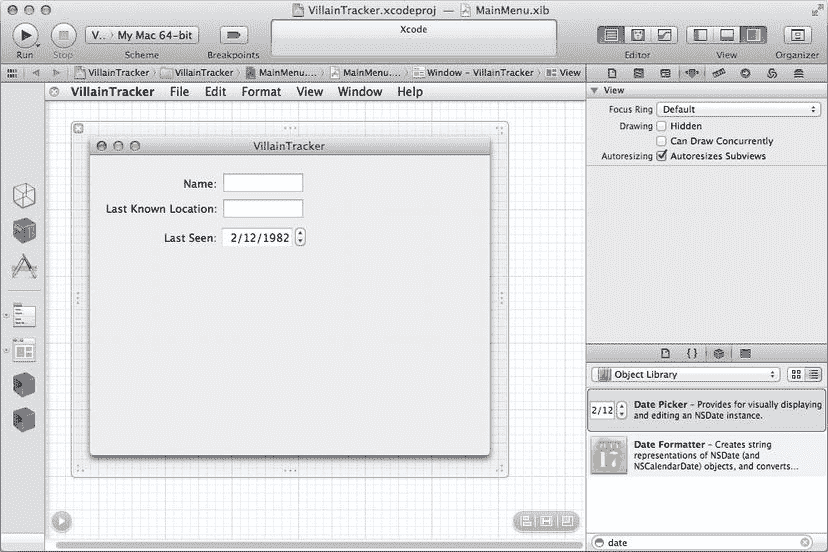
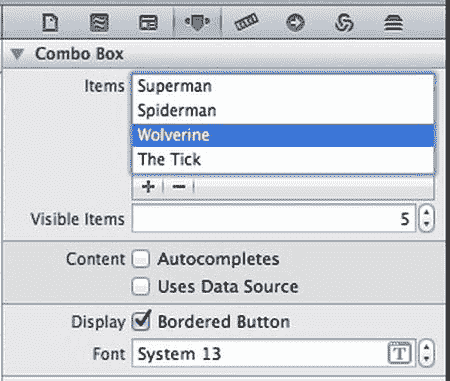
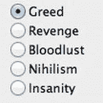
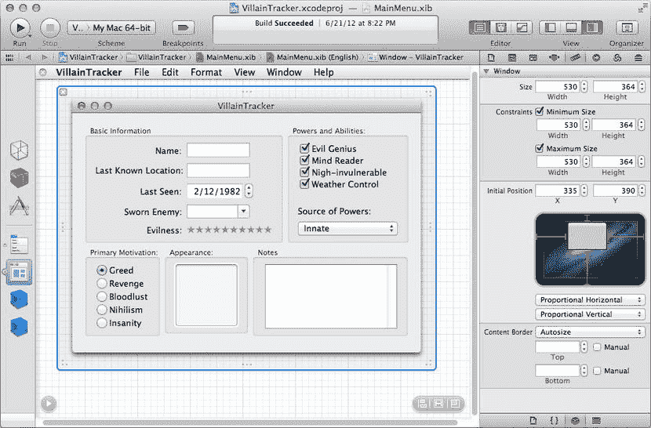
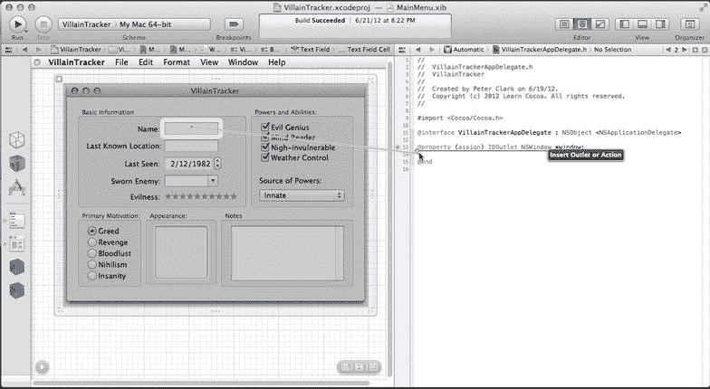
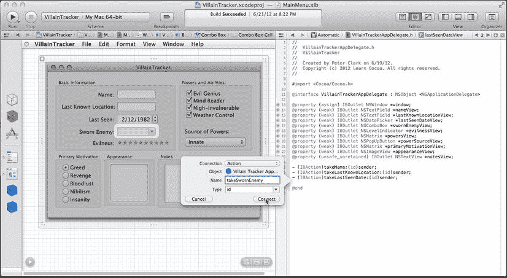
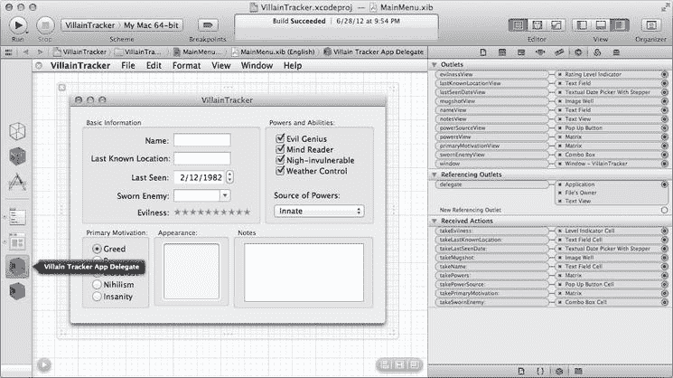

# 5. GUI 组件

在第 3 章和第 4 章中，我们介绍了在 Interface Builder 中创建用户界面以及使用 target/action 将其连接到 Xcode 中编写的应用程序代码的一些基础知识。到目前为止，我们仅仅触及了皮毛，但值得高兴的是，你在前两章中学到的 target/action 系统几乎被 Cocoa 中所有的用户界面对象所使用。如果你还不十分清楚这有什么了不起，你可能想再多看一次第 3 章，以确保你已经掌握了 target/action 的概念。

到现在为止，你一定已经注意到 Interface Builder 的对象库窗格中列出的各种用户界面对象。现在是时候深入挖掘 Cocoa 的技巧宝库，探索其中的一些类了。Cocoa 中可用的用户界面类涵盖了广泛的应用场景，并尽可能为其功能提供一致的 API，因此，一旦你学会了如何使用一个类完成某项功能，通常就能很快地推断出如何使用另一个类来实现类似的结果。特别是，你会最常使用的许多类都是 `NSControl` 的子类，并且你将主要使用在该类中声明的方法。不同的子类以不同的方式与用户交互，但大多数情况下都以相同的方式与你的代码进行交互。

本章将介绍 Cocoa 提供的一些最常用的用户界面类，展示它们的基本用法，以及如何在适当的时候根据我们的需求定制它们。在此过程中，我们还将了解一些不一定在屏幕上有形存在，但仍为我们的应用程序提供重要服务的辅助性 Cocoa 类。我们将重点关注以下类（有关这些对象在屏幕上的效果示例，请参见图 5-1）：

*   `NSTextField`：许多应用程序的基本文本输入方式。响应按键操作并渲染文本。为用户提供了极大的编辑灵活性。
*   `NSButton`：基本的鼠标触发的 GUI 组件。尽管它们在操作方式和外观上存在差异，但单选按钮、复选框和普通的旧按钮都是 `NSButton` 的实例。
*   `NSPopUpButton`：当我们有一组字符串希望用户从中选择时，`NSPopUpButton` 通常是一个好选择。
*   `NSComboBox`：类似于 `NSPopUpButton`，但其额外优势在于允许用户输入一个不在列表中的值。
*   `NSMatrix`：将一系列相似的控件分组到一个单元中的对象。
*   `NSLevelIndicator`：通常用于显示预定义范围内的数值，但它们在输入数据时也同样有用。
*   `NSImageView`：用户可以轻松地通过将图片从 Finder 或其他应用程序拖放到此对象上，将图像引入应用程序。
*   `NSTextView`：几乎是一个完整的文本编辑器集成在单个对象中，允许用户使用多种字体、格式、标尺等编辑文本。

注意

在本书中，我们有时会使用 Cocoa 的类名（例如 `NSButton`），其他时候则使用其通俗的通用名称（例如 button）。通常，在讨论代码时我们会使用类名，在其他大多数情况下会使用其通用名称，但两种情况下我们谈论的都是相同的东西。


图 5-1. Cocoa UI 元素示例

我们将使用这些类来创建一个简单的应用程序，模拟一种数据库应用程序。用户将能够通过使用一些简单的 GUI 控件来编辑和创建一些对象，但编辑的结果不会被保存（这就是“假装”的由来）。在后面的章节中，我们将学习如何使用 Core Data 将我们的对象保存到磁盘，但现在我们将专注于 GUI。


### 创建“反派追踪器”应用

本章我们将创建一个名为 `VillainTracker` 的应用。这是一个简单的应用，用于追踪超级反派的最新行踪、特殊能力等信息。任何有实力的超级英雄团队都会在自己的计算机系统中安装这类应用，因此，对我们这样的英雄来说，这显然是一个入门级应用。我们将分两个迭代阶段来开发 `VillainTracker`：在第一阶段，我们会创建一个可以编辑单个反派信息的简单应用；第二阶段（见第 6 章），我们将增加管理整个反派列表的功能。这能展示基于**模型-视图-控制器（MVC）**设计模式开发应用的基础知识——这一模式已被开发者沿用多年。无论你对此模式有经验还是初次接触，了解 MVC 在 Cocoa 应用中的典型实现方式都很重要，因为它是 Cocoa 优秀应用设计的真正基石。

与之前的应用一样，我们首先在 Xcode 中创建一个新的应用项目。我们将使用 Interface Builder 模式创建图形用户界面（GUI），然后通过**控件拖拽**的强大功能，在生成的类中创建出口（outlet）和动作（action），从而将其连接到生成的代码。接着，我们回到 Xcode，学习如何编写代码来设置和获取值——这些值显示在 GUI 控件中——我们会逐个类地学习，以便了解每个控件的工作方式。通常，在构建 Cocoa 应用时，我们会在构建和修改 GUI 与实现代码之间来回切换：布局一些 UI，编写其背后的代码，检查是否符合预期，然后迭代反复。由于这个应用相对简单，我们会先完成 GUI 布局，再实现其背后的功能。

**注意**

在讨论 GUI 问题时，“视图”（views）和“控件”（controls）这两个术语常常可以互换使用。从技术上讲，大多数 Cocoa 用户界面类既是视图也是控件，至少从 Cocoa 的角度来看如此。`NSView` 是一个允许在屏幕上绘图的类；`NSControl` 是 `NSView` 的子类，它通过响应用户事件、在目标中触发动作等方式扩展了父类的功能。因此，应用中视图层的一大部分由“控件”对象组成，但我们当然不希望将其与控制器层混淆。如果这听起来令人困惑，只需记住：“控件”是一种特殊的“视图”，而“控制器”则是控制器层中协调视图与模型对象的对象。我们保证，过一段时间你就会完全理解其中的道理。

那么，让我们创建一个新的应用项目吧。与之前章节一样，启动 Xcode（如果已运行则切换到它），按下 `⇧⌘N`，或者从“文件”菜单中选择“新建项目”。在新建项目助手中，左侧点击“OS X”下的“应用”，然后在右侧的大窗格中点击“Cocoa 应用”，再点击“下一步”。

标准的 Xcode 新项目选项面板会提示我们输入应用的标识信息。在“产品名称”中输入“VillainTracker”，并在相应文本框中输入组织名称和公司标识符。本次示例的类前缀也使用字符串“VillainTracker”。确保勾选了“使用自动引用计数”，其他复选框保持未选中状态。点击“下一步”。

接下来出现的标准保存面板让我们选择目录，并在其中创建新项目。使用控件导航到主目录或桌面上的合适位置，然后点击“创建”。Xcode 会在指定位置创建一个名为 `VillainTracker` 的新文件夹，其中包含一些默认内容（包括 `VillainTracker.xcodeproj` 项目文件），并打开一个新窗口显示我们项目的设置。

### 构建界面

我们首先使用 Interface Builder 编辑项目的主 nib 文件，来创建 `VillainTracker` 的 GUI。我们将添加 GUI 控件来收集每个反派的关键信息，学习如何将这些控件组织成逻辑分组，并确保窗口大小调整时它们能正确重新定位。我们还会将它们连接到控制器类，在控制器中创建出口，并将所有元素连接在一起。

首先，在 Xcode 的导航器窗格（位于屏幕左侧的项目导航器窗格中）中找到`MainMenu.xib`。单击`MainMenu.xib`，它将在 Xcode 中央窗格的 Interface Builder 模式下打开。我们会看到新应用的默认菜单集，以及 Interface Builder 编辑器区域左侧的停靠栏中的几个图标——三个占位对象（文件所有者、第一响应者和应用）和四个其他对象（主菜单、窗口 - VillainTracker、VillainTrackerAppDelegate 和字体管理器）。单击“窗口 - VillainTracker”对象，编辑器区域中会打开一个空窗口。


#### 调出文本字段

现在该开始构建图形用户界面了。我们将一次只处理一小部分，但可以参照图 5-2 中的完整窗口版本，以便了解布局。


图 5-2.

这是完整的“反派追踪器”窗口的最终外观

我们要设置的第一批控件是一对 `NSTextField`。`NSTextField` 是一个非常实用的类，它提供了足以媲美全功能文本编辑器的文本编辑能力，即使在某些我们只需输入几个字符的场景中也是如此。在 Xcode 窗口右侧实用工具面板的对象库区域中，确保顶部的“对象”选项卡已被选中，并在该选项卡内选择“对象库”或其子项“Cocoa”。然后点击窗口底部的搜索字段，输入“text field”。库中可用对象的列表会缩减到只剩少数几个，其中包括一个名为“Text Field”的选项。它会在列表顶部附近。将其中一个（`Text Field`，而不是 `Text Field Cell`，后者稍有不同，我们将在第 6 章和第 7 章中遇到）拖到我们空白的窗口中，并放置在窗口左上角附近的某个位置。我们将在字段的左侧添加一个项目，所以在字段与窗口边缘之间留出一些空间。现在，在新文本字段选中的状态下，按 `⌘D` 键复制一个。一个新的文本字段会出现，与之前的重叠。将新字段向下拖动一点，窗口中会出现一些蓝色参考线，帮助将其与下面的字段对齐。当它看起来大致如图 5-3 所示时松开鼠标。


图 5-3.

“反派追踪器”的前两个文本字段

现在我们需要为这些对象添加标签，以便用户了解它们代表什么。返回对象库面板，点击搜索字段（如有必要，删除已有的文本），输入单词“label”。应该会显示一个名为 `Label` 的对象。将其中的一个拖到窗口中，放在我们创建的第一个文本字段的左侧。同样，当我们将标签拖到另一个对象附近时，会出现蓝色参考线，帮助我们对齐位置；这些参考线有助于我们相对于文本字段进行顶部、中心、文本基线或底部的对齐。当我们在 Interface Builder 中编辑标签时，它会水平调整大小以匹配其内容。这没问题——只是默认情况下文本是水平居中的，这意味着在编辑时，它会向两侧扩展，并开始与右侧的 `NSTextField` 重叠。为了解决这个问题，打开属性检查器面板（`⌥⌘4`），在 `Text Field` 设置下找到并点击“Align Right”按钮（提示：它看起来和大多数文字处理器中相应的按钮一样）。这样做会使标签在更改内容时保持其右边距。

将标签中的文本编辑为“Name:”，然后按 `⌘D` 键复制此标签。将新标签向下拖动一点，使其与下方的文本字段对齐，将其编辑为“Last Known Location:”，这样就完成了！如果标签中没有为这么长的文本留出足够空间，它会与文本字段重叠。可以自由移动对象，使布局整洁。

#### 让它们选择日期

我们要准备的下一个 GUI 对象是日期选择器，它将允许用户指定反派最后一次被目击的日期。日期选择器克服了日期格式中的歧义和相互竞争的标准，这些标准在解析和呈现日期时处理起来可能很麻烦，而且我们可以使用 Cocoa 中内置的出色选择器，所以让我们直接使用它。

在对象库面板的搜索字段中，输入“date”并查看结果。应该有一个名为 `Date Picker` 的条目。选中它，将其拖到窗口中，放在我们之前创建的 `NSTextField` 下方，同样利用我们拖到目标位置附近时出现的蓝色参考线。此控件的默认宽度比其上方的 `NSTextField` 的默认宽度要小，所以它不会占用相同的水平空间，但这没关系。只需让它与其他控件的左边缘对齐即可。现在点击之前创建的某个标签，按 `⌘D` 键再复制一个。将其向下拖动，与日期选择器对齐，并将文本更改为“Last Seen:”。图 5-4 显示了窗口现在应该的样子。



图 5-4.

我们有了一个良好的开端，向窗口中添加了控件和标签

#### 创建组合框

现在轮到组合框了。如果我们有一组预定义的有效字符串值可供选择，但又希望允许用户输入他们自己的值，那么这个控件非常有用。这对于反派的 `Sworn Enemy` 属性来说非常完美。我们可以提供一些默认的超级英雄名称供选择，同时仍然允许用户输入我们未预料到的名称。

前往对象库面板，在搜索字段中输入“combo”，会看到一个 `Combo Box` 出现在列表中。将其拖到窗口中，放在 `NSTextField` 和 `NSDatePicker` 的下方。再次使用蓝色参考线，使其与上方控件的左边缘对齐。然后，再次复制一个现有的标签，将其放在组合框的左侧，并将其重命名为“Sworn Enemy:”。

现在，让我们为组合框填入一些默认值。我们希望用户能够指定任何超级英雄，甚至是我们不知道的（这就是我们选择组合框的原因），但为了方便起见，我们应该预先在这个控件中加载一些热门超级英雄的名字，因为热门的超级英雄似乎也最容易招致敌人。

点击我们刚才添加的组合框，打开属性检查器面板（`⌥⌘4`）。在面板上半部分有一个名为 `Items` 的区域，我们可以在其中添加将显示在组合框中的项目。图 5-5 展示了检查器面板的这一部分。使用 `+` 按钮添加一个新项目，然后双击出现的“Item”文字，将其改为“Superman。”现在重复此过程，使用 `+` 按钮添加多个项目，每次都编辑“Item”文字，将其改为你最喜欢的超级英雄的名字。



图 5-5.

在 Interface Builder 中配置 NSComboBox

添加完超级英雄列表后，通过从“Editor”菜单中选择“Simulate Document”来测试界面。我们的窗口应该会出现，并且我们可以验证点击组合框时，我们为其创建的项目是否会显示出来。我们还可以在任何字段（包括组合框）中键入文本，并操作日期选择器。完成后，按 `⌘Q` 返回 Xcode。


### 使用级别指示器显示评分

接下来我们要创建的控件是 `NSLevelIndicator`，用于显示和指定任意反派的邪恶程度。我们将允许用户为这个值指定 0 到 10 的星级评分，而 `NSLevelIndicator` 实际上会以一排星星的形式显示它。

返回对象库面板，在底部的搜索栏中输入“level”。出现的类之一就是 `NSLevelIndicator`，将其拖出并放入窗口中，再次使用蓝色参考线使其与之前控件的左边缘对齐，正好位于上一步添加的组合框下方。

现在我们需要对这个新对象进行一些配置。`NSLevelIndicator` 类有多种内置显示样式，适用于不同用途。在 Interface Builder 中创建的新实例，默认样式称为“离散”，但我们要将其更改为与显示内容（即某种评分）相匹配。调出属性检查器（`⌥⌘4`），我们会看到第一个选项之一是一个标记为“样式”的弹出按钮（见图 5-6）。点击该弹出按钮，选择“评分”。级别指示器会立即变为显示几颗星星的视图。


图 5-6. 将 `NSLevelIndicator` 配置为显示星级评分

我们还需要指定此控件的有效最大值和最小值，以便它知道如何显示给定的值。仍在属性检查器中，找到标记为“值”的部分，其中包含用于设置最小值和最大值的控件。将最小值设为 0，最大值设为 10，可以通过在这些字段中输入数字或使用微调按钮来实现。在这些文本字段稍下方，还有一个标记为“当前”的字段。将其设为 10，这样我们就可以看到控件中的全部星星范围。然后点击“可编辑”复选框，以便用户实际编辑这个值，而不仅仅是欣赏漂亮的星星。

也许控件没有显示全部 10 颗星。在撰写本文时，从库中拖出的新 `NSLevelIndicator` 的默认宽度只能显示略多于 7 颗星，无法显示更多。幸运的是，Xcode 提供了一个方便的快捷键，可以帮助我们调整视图大小，使其完美适应内容。从菜单中选择“编辑器”➤“使内容适配大小”，或按 `⌘=`，使级别指示器展开到刚好能显示全部 10 颗星的大小。根据我们相对于其他字段布局 `NSLevelIndicator` 的方式，我们可能创建了约束，建立了 `NSLevelIndicator` 与其他字段大小之间的关系。如果调整 `NSLevelIndicator` 大小时其他字段也同时调整大小，这没问题。我们可以按撤销（`⌘Z`）并将 `NSLevelIndicator` 移离其他字段以打破约束，然后按照上述方法调整其大小，最后再将其重新定位对齐到其他字段的左边缘。

**注意：** 对于此应用，我们可以忽略“警告”和“严重”值，因为它们对 `NSLevelIndicator` 的“评分”样式没有任何影响。这些值确实会影响 `NSLevelIndicator` 在“离散”和“连续”样式下的绘制方式；我们也可以将 `NSLevelIndicator` 改回“离散”或“连续”样式，然后使用“模拟文档”看看效果，但在继续操作前需要将其改回“评分”。

最后，又到了复制窗口中现有标签的时候了。将其拖放到级别指示器左侧，并将文本改为“邪恶程度：”。现在可能是个好时机，再次通过选择“模拟文档”来测试界面。我们应该能够点击星星行上的任意位置，使控件仅高亮显示相应数量的星星。

### 在矩阵中添加单选按钮

接下来，我们将为“主要动机”属性创建图形用户界面。多年来对漫画书的仔细研究发现，每个反派都有一个主要动机因素驱使他们作恶，而这个动机总可以归结为以下五种之一：贪婪、复仇、嗜血、虚无主义或精神错乱。当然，有些反派可能同时具有多种邪恶因素在起作用，但我们将为每个追踪的反派确定其主要动机。

我们将使用一组单选按钮让用户选择主要动机。单选按钮通常成组使用，组内按钮协同工作，选择其中一个按钮会自动取消选择其他所有按钮。如果“单选按钮”这个名称听起来非常晦涩，那么也许你太年轻了，不记得 20 世纪 80 年代之前流行的老式车载收音机调谐器控件——按下机械按钮可以选择一个电台，同时将之前按下的按钮弹回“弹起”位置。无论如何，“单选按钮”这个术语会一直沿用下去，当我们有一个预定义的小列表可供选择，并且希望始终在屏幕上显示整个列表时，这个控件是个不错的选择。

在 Cocoa 中，单选按钮通常是一组排列在 `NSMatrix` 中的 `NSButtonCell` 实例。我们可以在对象库面板的搜索栏中输入“radio”找到这些预配置好的控件。会出现一个“单选组”。将其拖出并放入窗口中，放在其他控件下方。默认的单选按钮矩阵只包含两个单选按钮，但对于这个示例，我们需要五个。简单地拖动调整手柄来调整矩阵大小在这里行不通；那只会拉伸现有按钮。相反，尝试在按住 Option 键的同时向下拖动底部居中的调整手柄。这将同时调整矩阵大小并在内部添加新按钮以填充空白空间。一直向下拖动直到出现五个按钮，然后松开鼠标按钮。

**提示：** 请注意，Cocoa 的许多 GUI 类似乎都有一个以单元格类形式存在的“影子”：`NSButton` 对应 `NSButtonCell`，以此类推。这种划分源于过去的性能问题。为了加速绘制，部分绘制职责从视图类中分离出来，放入了特殊的单元格类中。因此，在充满按钮的 `NSMatrix` 中，没有大量的完整 `NSButton` 实例，而是有一堆更简单的 `NSButtonCell` 实例。

现在该填写每个按钮标题中显示的值了。从最顶部的按钮开始；双击选中“Radio”这个词，然后输入“贪婪”。对其余按钮执行相同操作，依次输入“复仇”、“嗜血”、“虚无主义”和“精神错乱”，如图 5-7 所示。请注意，此视图不会水平扩展以容纳我们输入的文本，因此我们需要自行操作：拖动中间右侧的调整手柄，向右拖动直到所有输入的文本可见。这也是“使内容适配大小”命令能够派上用场的情况。



图 5-7. 你人生的主要动机是什么？


在完成之前，我们需要为每个单元格分配一个标签。我们可以使用任意整数作为每个单元格的标签，从而能够通过包含该单元格的矩阵来引用它，而无需为每个单元格单独建立一个出口。我们希望为刚创建的矩阵中的每个单元格分配一个唯一的标签，为了方便起见，让顶部的单元格从 0 开始，然后依次向下递增 1。这不仅是遵循一个简单的模式，而且之后我们还可以创建一个字符串数组，数组中的索引与其各自的单元格标签完美匹配（因为`NSArray`使用基于零的索引，其中第一个元素位于索引 0，第二个位于索引 1，以此类推）。

从第一个按钮“Greed”开始。通常需要多次点击才能选中矩阵中的某个单元格。第一次点击选中矩阵，第二次点击告诉矩阵我们希望聚焦于其内部，第三次点击才真正选中单元格。一旦单元格最终被选中（你可以通过高亮显示来判断），打开工具区（Utility area）的属性检查器（Attributes Inspector）（⌥⌘4），在“Cell”属性最底部找到“Tag”字段，将其设置为`0`。现在选择“Revenge”按钮并将其标签设置为`1`。继续向下遍历整个矩阵，最后将“Insanity”的标签设置为`4`。

至此，让用户指定反派主要动机的单选按钮就完成了！像我们之前做的那样，复制一个标签，将其拖拽下来，放在单选按钮组的上方并稍微靠左的位置，并将其标题改为“Primary Motivation:”。现在我们应该得到类似于图 5-8 所示的效果。


**图 5-8.** 比我们想象中还要多的反派属性！

#### 添加图像视图

没有一个反派追踪应用能少了显示反派凶残面孔的功能。在`VillainTracker`中，我们将使用`NSImageView`类的一个实例来显示反派的图片，并通过 Mac 的拖放机制接收图片输入。

回到对象库（Object Library）窗格，在搜索框中输入“image”。其中一个结果被列为“Image Well”，这实际上是`NSImageView`的一个实例。将一个这样的控件拖拽到我们的窗口中，并把它放在上一节中单选按钮矩阵的右侧。

这个图像控件现在非常小，所以我们把它放大一点。打开尺寸检查器（Size Inspector）（⌥⌘5）；请注意，图像控件的宽度和高度都是`48`。分别将它们修改为`96`，控件的大小就会在窗口中发生变化。我们希望用户能够将图片拖入此视图，所以我们还需要打开属性检查器（Attributes Inspector）（⌥⌘4），并选中“Editable”复选框。

现在，通过在窗口内稍微拖拽图像控件来调整其位置。蓝色的对齐线会出现；请注意，此控件现在与其左侧的单选按钮矩阵具有相同的垂直高度。将它们并排放置，然后复制另一个标签，将其放在图像视图的上方并稍微靠左的位置，并将其标题改为“Appearance:”。目前布局的大致效果见图 5-9。


**图 5-9.** 图像控件已经就位

#### 在矩阵中添加复选框

现在我们将添加一系列复选框，以便用户勾选每个反派的能力。与反派的主要动机类似，我们将创建一个分类系统，将所有类型的超级反派能力归入一个类别。我们将再次使用矩阵，但这次填充的是复选框而不是单选按钮。

再次进入对象库（Object Library），在搜索框中输入“check”。其中一个结果将被标记为“Check Box”。抓取一个并将其拖入窗口。这将把一个配置为复选框功能的`NSButton`放置在窗口中。我们打算要四个这样的复选框，并排列成一个矩阵，但目前我们只有这一个。现在是时候学习 Interface Builder 中的一个便捷快捷键了，它允许我们自动将任何可以出现在`NSMatrix`中的对象（例如`NSButton`）替换为一个包含与原对象配置相同的单元格的新`NSMatrix`。只需选中该对象（复选框），然后在菜单中选择“Editor”➤“Embed In”➤“Matrix”。复选框现在被包裹在一个矩阵中，我们可以使用之前为包含单选按钮的矩阵学到的调整大小技巧：按住 Option 键，点击底部中央的调整手柄，然后向下拖拽，直到出现四个复选框。

接下来，让我们配置这个新矩阵，使其能正确地与一组复选框协同工作。选中矩阵本身（而不是其内部的某个复选框），然后打开工具区（Utility area）的属性检查器（Attributes Inspector）（⌥⌘4）。通过查看检查器顶部显示的名称来确认我们选中了矩阵——它应该显示为“Matrix”，而不是“Button Cell”。在检查器窗口的顶部，有一个标记为“Mode”的弹出按钮。如果它尚未设置为“Highlight”，我们将其改为该模式，以获得正确的行为。

现在，用以下（诚然不完整）的复选框标题来填充这些能力：“Evil Genius”、“Mind Reader”、“Nigh-invulnerable”、“Weather Control”。在点击设置这些值时，我们可能会无意中打开或关闭复选框。我们不必担心这一点；所有这些复选框的状态最终将由代码本身设置。

与单选按钮矩阵一样，我们需要将矩阵稍微加宽，以便按钮的完整文本能够显示出来。将中间右侧的调整手柄向外拖拽，直到所有文本都可见。

现在是为所有这些复选框设置标签的时候了，就像我们为选择主要动机的所有单选按钮设置标签一样。点击选中“Evil Genius”单元格，然后打开属性检查器（Attributes Inspector）（⌥⌘4），将标签设置为`0`。然后点击“Mind Reader”单元格，将其标签设置为`1`。继续遍历其余的复选框，最后给“Weather Control”复选框设置标签`3`。此时，我们应该得到类似于图 5-10 所示的效果。


**图 5-10.** 为最坏的情况做准备

#### 配置弹出按钮

现在我们将处理反派的能力来源，使用一个弹出按钮让用户从预定义的列表中选择，以指定反派是如何获得能力的。我们将再次提供几个选项：“Innate”（反派天生具备）、“Freak Accident”（某种“天灾”，如实验室爆炸、流星撞击或类似事件导致变异）、“Superhero Action”（超级英雄在行动过程中意外赋予他人能力）和“Other”。

再次进入对象库（Object Library）窗口，在搜索框中输入“popup”。从搜索结果中抓取一个“Pop Up Button”，并将其拖入窗口，放置在上节中复选框矩阵的下方。通过单击然后双击这个新的弹出按钮，我们可以看到可供选择的默认值列表。双击第一个值来编辑其文本，将其改为“Innate”。继续编辑其余标题，输入上面提到的名称。输入第三个之后，我们就没有按钮值了；默认的弹出按钮只有三个值。点击这三个值中的一个，按`⌘D`复制它，然后输入最后一个值。现在，再拿一个标签，将其放在此弹出按钮的左侧，并将其标题改为“Source of Powers:”。


### 插入文本视图

现在轮到最后一个控件了，一个用于编辑反派角色相关自由格式笔记的文本视图。我们将使用 `NSTextView`，这是一个用于文本显示和编辑的强大的类，在整个 Mac OS X 界面中都有应用。抓住界面生成器画布中窗口轮廓上的调整手柄，向下拖动使窗口变大。一些字段可能会随之移动；调整大小后，将它们重新定位到应处的位置。我们可以通过按住 Shift 键点击，或者拖出一个选择矩形框住想要移动的多个元素来选中它们。

腾出空间后，在对象库面板的搜索字段中输入“text view”，然后将搜索结果中的文本视图拖入窗口，放在所有其他元素的下方。调整其大小，使其填满大部分可用空间。此时的窗口布局应类似于图 5-11。


图 5-11. 所有控件现在都位于窗口中

### 进行逻辑分组

现在所有需要的控件都已布置在窗口中，让我们退一步看看目前的状况。图 5-11 可能与你当前的操作界面相似。

界面可能功能齐全、标签清晰，但肯定称不上设计佳作。我们的界面展现了大量功能，但控件都挤在一起，这些可编辑属性难以看出任何逻辑分组。我们可以通过将相关控件分组到框视图中来改善布局；Cocoa 为我们提供了一个名为 `NSBox` 的类，它可以包含多个其他对象，并在其周围绘制出漂亮的边框。

Xcode 包含一个便捷的快捷方式，可以将现有视图放入一个大小恰好能将其全部精确包含在边框内的框中，因此为界面添加这项改进非常容易。首先，选中前五个控件（位于窗口左上角）及其所有标签。最简单的方法是点击窗口左上角，就在窗口的关闭/最小化/最大化控件下方，然后拖出一个选择框，框住所有想要选中的视图。接着从菜单中选择 Editor ➤ Embed In ➤ Box —— 一个漂亮的框会包裹住它们，带有深灰色背景和圆角。框的顶部有一个文本标签（“Box”），可以编辑为描述框内容的文字。双击该文本，将其改为“Basic Information”。

接着对“Primary Motivation”部分执行相同操作。首先，选中标签并按 Backspace 或 Delete 键将其删除。因为我们要创建的框中只有一组控件，可以直接使用框的标题来代替。现在选中单选按钮矩阵，再次从菜单中选择 Editor ➤ Embed In ➤ Box。我们的单选按钮现在被包含在一个框中。将框的标签改为“Primary Motivation”。

对头像部分重复这些步骤，同样先删除现有标签，然后通过菜单创建框，最后将框的标签设置为“Appearance”。

现在来处理能力和技能。选中“Source of Powers”弹出按钮及其标签，以及“Abilities”的复选框矩阵。同样，最简便的方法可能是“画一个框”：在窗口右上角附近的背景处点击，然后向左下方拖动，直到所有相关项目都被选中。使用菜单将这些视图放入一个框中，并将框命名为“Powers and Abilities”。

最后，选中为反派角色笔记属性创建的文本视图，将其放入一个独立的框中，标题为“Notes”。

现在我们已经创建了一堆框，但它们可能相互重叠，并且彼此之间的位置也不太理想（如图 5-12 所示）。


图 5-12. 并非我们见过的最美观的框布局

别担心；Xcode 的蓝色对齐线会帮助我们迅速将其整理好。从左上角的第一个框开始。点击框内深色背景的任意位置（但不要点击控件或标签），开始拖动整个框。当我们稍微移动它时，蓝色对齐线就会出现。这些对齐线可以帮助我们相对于彼此或相对于窗口本身来定位框或任何视图。我们总是可以通过沿着对齐线追踪到末端，看它连接了什么，来知道这条线是与什么对齐的。当它一直延伸到窗口边缘时，我们就知道它在建议我们离窗口边缘的推荐距离。

接着处理“Primary Motivation”框，将其与上方框的左边缘对齐，并相隔几个像素，再次使用对齐线来帮助精确定位。然后取出“Appearance”框，使其在垂直方向上与“Primary Motivation”框对齐，在水平方向上与“Basic Information”框的右边缘对齐。

继续处理其他框，将“Powers and Abilities”框对齐到已处理好框的右侧，然后将“Notes”框放在所有元素的下方。如果在移动过程中空间不足，或者窗口远大于所有其他视图的总体尺寸，请稍微调整窗口大小以容纳所有内容。

最后，将“Notes”框移动到右下角留下的空隙中，并调整其内部的 `NSTextView` 大小以适配新的边界和边距，或许再微调一下其他框的大小，使它们都能整齐地组合在一起。图 5-13 展示了理想的结果。如果还没保存，请务必保存 nib 文件！


图 5-13. 终于，一个值得骄傲的窗口布局！

### 调整大小

现在我们有了一个外观不错的窗口，但还有一些工作要做，以确保一切行为正常：我们需要能够处理用户调整窗口大小的情况。要理解为什么需要这样做，请通过从 Editor 菜单中选择 Simulate Document 来测试界面。现在调整窗口大小，看看会发生什么。按照我们目前的布局，当垂直调整窗口大小时，所有控件会保持不动，但我们可以将窗口垂直缩小到某些控件不可见，而且根本不能水平调整窗口大小。（取决于你在操作过程中如何布局控件，调整大小的行为可能与此不同。）我们将在下一章更深入地探讨调整大小。现在，我们通过将窗口的最小和最大尺寸设置为相同大小，来使窗口不可调整大小，然后继续编写代码。

Xcode 让这变得很容易。在界面生成器编辑画布中选中“VillainTracker”窗口，选择尺寸检查器（`⌥⌘5`）。当前尺寸、最小尺寸和最大尺寸的宽度和高度值应全部相同。勾选“Minimum Size”和“Maximum Size”约束的复选框，如图 5-14 所示。



图 5-14. 设置窗口的尺寸约束


## 连接 `VillainTrackerAppDelegate` 类

当我们创建 `VillainTracker` 项目时，Xcode 自动生成了一个名为 `VillainTrackerAppDelegate` 的类。我们将在这个类中添加代码，使其与用户界面控件建立连接，从而在模型-视图-控制器架构中成为“控制器”。更复杂的应用程序可能会有多个控制器类，但对于像这样与单个窗口及应用程序本身交互的简单应用，一个控制器就已足够。我们将添加的代码大部分会以输出口和操作的形式呈现，正如上一章所讨论的。这个控制器将包含指向 GUI 中所有对象的输出口（以便在需要时随时设置和获取视图对象中的值），以及供这些对象在用户每次编辑值时通知控制器的操作方法。

请记住，输出口不过是一个带有特殊标记的属性或实例变量，而操作则是任何符合特定签名的方法，该方法接受一个 `id` 类型的参数并返回 void。请注意，在源代码中，操作的返回类型通常标记为 `IBAction` 而非 void。`IBAction` 实际上与 void 相同，因此对编译器而言并无区别。现在，假设我们有一份设计文档，其中指定了多个反派角色的属性及其类型。根据这些属性的类型和用途，我们可以将每个属性映射到合适的 GUI 类（见表 5-1）。

**表 5-1.** 反派角色属性与 GUI 类映射

| 属性名称 | 类型 | 视图类 |
| --- | --- | --- |
| Name | 字符串（自由输入） | `NSTextField` |
| `lastKnownLocation` | 字符串（自由输入） | `NSTextField` |
| `lastSeenDate` | 日期 | `NSDatePicker` |
| `swornEnemy` | 字符串（自由输入，但可从现有列表中选择） | `NSComboBox` |
| `primaryMotivation` | 字符串（从预定义列表中选择） | `NSMatrix`（包含单选按钮） |
| Powers | 字符串数组（从预定义列表中选择） | `NSMatrix`（包含复选框） |
| `powerSource` | 字符串（从预定义列表中选择） | `NSPopUpButton` |
| Evilness | 数字（0–10） | `NSLevelIndicator` |
| Mugshot | 图像 | `NSImageView` |
| Notes | 字符串（可能较长） | `NSTextView` |

基于此规范，我们将为每个 GUI 控件在 `VillainTrackerAppDelegate` 中添加一个输出口和一个操作。输出口允许我们在必要时访问控件并设置或获取其值，而每个控件将调用相应的操作方法，在其内容发生变化时通知我们。为了使代码易于理解，我们将为输出口采用特定的命名约定：属性名称后加上字符串“View”作为后缀。例如，对于名为 `lastSeenDate` 的属性，我们将有一个名为 `lastSeenDateView` 的输出口。同样，对于操作，我们将使用动词“take”作为前缀。对于属性 `lastSeenDate`，我们的操作将命名为 `takeLastSeenDate`。

将输出口添加到代码中可以通过手动创建属性或实例变量来实现，但更简单的方法是按住 Control 键从 nib 文件拖拽到代码窗口。为此，我们首先需要一个包含代码的窗格。点击主 Xcode 窗口工具栏右侧编辑器图标组中的“助手”按钮（外观像一个管家躯干）。在此过程中，让 nib 文件在 Xcode 左侧打开，代码编辑器在右侧打开，如图 5-15 所示。我们可以通过选择“视图”➤“助手编辑器”下的首选位置，将助手窗口放置在任意一侧。如果尚未打开，请在助手编辑器窗格中打开 `VillainTrackerAppDelegate.h` 文件。为此，点击窗格顶部的小管家图标，它应出现在“自动”选项下。


**图 5-15.**


准备开始创建输出口

首先，点击标注为 `Name:` 的标签旁边的文本字段。按住 Control 键拖动到助理编辑器窗格中的代码处，拉出一条蓝色线，正好位于现有属性 `window` 下方。拖动时，任何可以作为有效连接端点的位置都会在我们的鼠标下高亮显示。当我们在助理编辑器窗格中到达正确位置时，应该会出现一个小标记，指示 `Insert Outlet` 或 `Action`，如图 5-16 所示。松开鼠标按钮，代码中的该点上会出现一个小型上下文窗口，我们可以在此处命名输出口，并在必要时修改一些默认参数。对于此应用的输出口，我们无需更改默认设置。使用上述命名约定来命名输出口：对于保存姓名字段的输出口，将其命名为 `nameView`。



**图 5-16.** 为 `VillainTracker` 添加第一个输出口

某些 UI 组件由多个元素组成：复选框矩阵、单选按钮和文本视图。对于矩阵，请确保选中整个矩阵，而不是矩阵内的某个单元格。对于文本视图，我们面临相反的问题。文本视图包含在滚动视图中。请点击文本区域内部，直到仅文本部分高亮显示，而不是边缘的滚动条。用于创建输出口的弹出窗口应指示类型为 `NSTextView`。如果显示为 `NSScrollView`，请点击取消，并在 `Notes` 框中再次点击 `NSTextView`。

完成后，助理编辑器中的代码应如下所示：

```
#import <Cocoa/Cocoa.h>

@interface VillainTrackerAppDelegate : NSObject <NSApplicationDelegate>

@property (assign) IBOutlet NSWindow *window;
@property (weak) IBOutlet NSTextField *nameView;
@property (weak) IBOutlet NSTextField *lastKnownLocationView;
@property (weak) IBOutlet NSDatePicker *lastSeenDateView;
@property (weak) IBOutlet NSComboBox *swornEnemyView;
@property (weak) IBOutlet NSLevelIndicator *evilnessView;
@property (weak) IBOutlet NSMatrix *powersView;
@property (weak) IBOutlet NSPopUpButton *powerSourceView;
@property (weak) IBOutlet NSMatrix *primaryMotivationView;
@property (weak) IBOutlet NSImageView *mugshotView;
@property (weak) IBOutlet NSTextView *notesView;

@end
```

这涵盖了输出口，现在我们来处理操作。过程大致相同；我们将再次从姓名字段开始。按住 Control 键从姓名字段拖动到代码中，但这次在松开鼠标时，将上下文窗口中的第一个字段从 `Outlet` 更改为 `Action`。完成后，为其余每个 UI 元素拖出连接。输入带有前缀 `take` 的操作名称：`takeName`、`takeLastKnownLocation` 等。对于两个按钮矩阵（Primary Motivation 和 Powers），请确保从矩阵本身连接，而不是矩阵内部的某个按钮单元格。窗口应如图 5-17 所示。



**图 5-17.** 添加 `takeSwornEnemy` 操作

完成后，助理编辑器中的代码现在应如下所示：

```
#import <Cocoa/Cocoa.h>

@interface VillainTrackerAppDelegate : NSObject <NSApplicationDelegate>

@property (assign) IBOutlet NSWindow *window;
@property (weak) IBOutlet NSTextField *nameView;
@property (weak) IBOutlet NSTextField *lastKnownLocationView;
@property (weak) IBOutlet NSDatePicker *lastSeenDateView;
@property (weak) IBOutlet NSComboBox *swornEnemyView;
@property (weak) IBOutlet NSLevelIndicator *evilnessView;
@property (weak) IBOutlet NSMatrix *powersView;
@property (weak) IBOutlet NSPopUpButton *powerSourceView;
@property (weak) IBOutlet NSMatrix *primaryMotivationView;
@property (weak) IBOutlet NSImageView *mugshotView;
@property (weak) IBOutlet NSTextView *notesView;

- (IBAction)takeName:(id)sender;
- (IBAction)takeLastKnownLocation:(id)sender;
- (IBAction)takeLastSeenDate:(id)sender;
- (IBAction)takeSwornEnemy:(id)sender;
- (IBAction)takeEvilness:(id)sender;
- (IBAction)takePowers:(id)sender;
- (IBAction)takePowerSource:(id)sender;
- (IBAction)takePrimaryMotivation:(id)sender;
- (IBAction)takeMugshot:(id)sender;

@end
```

只要属性和方法都存在，它们的顺序与这里看到的不同也没关系。你可能还会注意到这里似乎缺少了一件事：没有为用于编辑备注属性的 `NSTextView` 定义操作方法。原因是 `NSTextView` 实际上并不与目标/操作范式配合使用。相反，它会在其内容发生更改时通知其委托。我们将在稍后实现所有这些操作方法时，实现该委托调用。

将助理编辑器窗格切换到 `VillainTrackerAppDelegate.m` 文件，以便可以查看类的实现。Xcode 已为每个操作提供了空方法存根。

```
#import "VillainTrackerAppDelegate.h"

@implementation VillainTrackerAppDelegate

- (void)applicationDidFinishLaunching:(NSNotification *)aNotification
{
    // 在此处插入代码以初始化你的应用
}

- (IBAction)takeName:(id)sender {

}

- (IBAction)takeLastKnownLocation:(id)sender {

}

- (IBAction)takeLastSeenDate:(id)sender {

}

- (IBAction)takeSwornEnemy:(id)sender {

}

- (IBAction)takeEvilness:(id)sender {

}

- (IBAction)takePowers:(id)sender {

}

- (IBAction)takePowerSource:(id)sender {

}

- (IBAction)takePrimaryMotivation:(id)sender {

}

- (IBAction)takeMugshot:(id)sender {

}

@end
```

请注意，如果你必须在 `.h` 文件中进行一些编辑以使其正确，例如删除命名错误的属性或应该是操作但实际是输出口的内容，那么你可能也需要在此处进行相应的清理。

我们还有最后两个连接要做，它们不涉及创建代码。如上所述，文本视图有点与众不同。与窗口中的其他可编辑对象不同，`NSTextView` 不是 `NSControl` 的子类，这意味着它不了解目标/操作模式。然而，它确实通过对其委托的方法调用公开了许多功能。稍后，我们将在 `VillainTrackerAppDelegate` 中实现一些委托方法，以便在文本视图的值更改时获得更新。现在，只需将文本视图的委托输出口连接到 Interface Builder 编辑画布左侧对象停靠栏中的 `VillainTrackerAppDelegate` 对象。与我们创建输出口时一样，这会稍微复杂一些，因为文本视图自动包含在 `NSScrollView` 中，而 `NSScrollView` 又包含在我们之前创建的 `NSBox` 中，因此我们可能需要单击并双击一两次才能实际选中文本视图本身，并能够从中拖出连接。

最后，为了我们控制器类的需要，我们将建立另一个连接。我们希望在 nib 文件加载完成且应用程序本身初始化并准备好与用户交互时收到通知，以便可以准备初始显示。这是通过使用 `NSApplication` 的委托方法完成的，因此从对象停靠栏窗口中的 Application 对象拖动一个连接到 `VillainTrackerAppDelegate`，然后从上下文菜单中选择 Delegate。


我们已经完成了大量的“Control-拖拽”操作，确保连接按预期设置是良好的实践。检查连接的最佳方式是在 Xcode 中查看“连接检查器”。在“Interface Builder 编辑器”左侧边缘的“对象”停靠栏中，选择悬停时显示名称 `Villain Tracker App Delegate` 的蓝色框。然后选择“连接检查器”（`⌥⌘6`）以在“实用工具”区域中显示。涉及应用程序代理的连接应类似于图 5-18 中显示的内容。这显示了所有我们已连接的输出口（outlets）和动作（actions），以及引用应用代理的对象。如果建立连接时尝试了不止一次，或者创建输出口时本意是创建动作，你也可能会在这里看到一些需要删除的多余连接。你可以将鼠标悬停在此处列出的连接上，以在“Interface Builder 编辑器”窗格中高亮显示已连接的对象，也可以单击右列中的小“x”图标来断开连接。



*图 5-18*. 与 `VillainTrackerAppDelegate` 之间的连接

在开始实现动作之前，我们还需要拼图的最后一块。我们将开始为本应用将要使用的模型类铺平道路。在真实应用中，你会为反派对象拥有一个合适的模型类，比如包含从文件或数据库加载和保存的功能，在后续章节中，你将看到如何使用 Core Data 来实现这一点。但对于这个应用，我们主要关注 GUI 组件是如何连接和使用的，因此我们将保持简单，使用 `NSMutableDictionary` 来表示每个反派对象。`NSMutableDictionary` 非常适合这项任务，因为它使我们能够轻松地存储和检索任何类型的值，并且不需要为每个值预定义方法，因为值是使用简单的字符串作为键来访问的。

为了将其添加到类中，我们将在 `notesView` 属性下方声明一个名为 `villain` 的新属性。由于我们将在类内部管理这个属性，因此必须将其标记为 `strong` 而不是 `weak`。头文件应如下所示（我们现在添加的代码以粗体显示）：

```
#import <Cocoa/Cocoa.h>

@interface VillainTrackerAppDelegate : NSObject <NSApplicationDelegate>

@property (assign) IBOutlet NSWindow *window;
@property (weak) IBOutlet NSTextField *nameView;
@property (weak) IBOutlet NSTextField *lastKnownLocationView;
@property (weak) IBOutlet NSDatePicker *lastSeenDateView;
@property (weak) IBOutlet NSComboBox *swornEnemyView;
@property (weak) IBOutlet NSLevelIndicator *evilnessView;
@property (weak) IBOutlet NSMatrix *powersView;
@property (weak) IBOutlet NSPopUpButton *powerSourceView;
@property (weak) IBOutlet NSMatrix *primaryMotivationView;
@property (weak) IBOutlet NSImageView *mugshotView;
@property (weak) IBOutlet NSTextView *notesView;
@property (strong) NSMutableDictionary *villain;

- (IBAction)takeName:(id)sender;
- (IBAction)takeLastKnownLocation:(id)sender;
- (IBAction)takeLastSeenDate:(id)sender;
- (IBAction)takeSwornEnemy:(id)sender;
- (IBAction)takeEvilness:(id)sender;
- (IBAction)takePowers:(id)sender;
- (IBAction)takePowerSource:(id)sender;
- (IBAction)takePrimaryMotivation:(id)sender;
- (IBAction)takeMugshot:(id)sender;

@end
```

除了从 `weak` 改为 `strong` 之外，这与 Xcode 为输出口生成的代码看起来相同。这个声明告诉编译器，我们的类将包含 `villain` 属性的 getter 和 setter 方法（分别称为 `villain` 和 `setVillain:`），并暗示了 setter 的语义（特别是，`strong` 意味着传入 `setVillain:` 的值将被此类“拥有”，这与由 nib 文件拥有的输出口形成对比）。只要有一个对象存在 `strong` 引用，该对象就会保持存活。一旦没有更多的 `strong` 引用（但可能仍有 `weak` 引用），则该对象将被释放，并且所有剩余的 `weak` 引用都会被设置为 `nil`。请注意，Xcode 生成的所有输出口都被标记为 `weak`。我们的代码不拥有这些对象；它们由其父视图或窗口本身拥有。它还创建了一个实例变量，这将为我们节省一些打字工作。这个属性现在可以在代码中作为 `self.villain` 被引用。

现在，是时候按下 Xcode 中的“运行”按钮，确保到目前为止我们没有犯任何错误。如果我们正确输入了所有内容，应用程序应该编译通过，没有任何警告或错误，然后启动并显示我们辛苦构建的窗口。如果不是，请查看 Xcode 显示的错误消息，并尝试修复它们所指出的问题。通常，编译 Objective-C 比编译 C++ 或 Java 代码快得多，因此频繁编译不会有太多损失。在本章的剩余部分，我们将频繁编译并运行应用，以便在进入下一步之前确保编码的每个功能都能按预期工作。

现在，我们已经为应用代码在 GUI 中显示值以及响应用户操作接收更新所需的所有连接。是时候开始编写我们的应用了！

## 开始编码

现在 GUI 布局已经完成，我们将实现应用程序的“核心”，在 `VillainTracker` 中，这些都将包含在 `VillainTrackerAppDelegate` 类中。我们将学习如何使 `NSApplication` 委托（例如我们的控制器类）在应用启动时做出反应，我们将看到用于在我们创建的 GUI 对象中显示值的基本 API，并且我们将学习如何通过从相关控件中获取值来实现响应用户操作的方法。

### 标准化键名

在开始编写实际代码之前，最好想出一种方法来标准化用于从模型对象访问属性的键名。无论是在我们这样的情况下（反派存储在一个只能通过键访问属性的字典中），还是在更复杂的使用真实模型对象的情况下，标准化键名对于确保我们正确访问模型对象中的属性都至关重要。

我们这里使用的技术很简单：我们使用标准的 C 预处理器宏来定义名称，这些名称在编译时会被替换为 `NSString` 实例。这消除了输入键名错误的潜在问题，并且还带来了使用 Xcode 中代码补全功能的好处。

以下代码包含了我们应用中使用的所有反派属性的键名。有了这些，我们可以在代码中使用（并且应该使用）定义的名称，而不是使用 `NSString` 字面量来通过键名引用属性。将以下代码放在 `VillainTrackerAppDelegate.m` 文件的顶部：

```
#define kName @"name"
#define kLastKnownLocation @"lastKnownLocation"
#define kLastSeenDate @"lastSeenDate"
#define kSwornEnemy @"swornEnemy"
#define kPrimaryMotivation @"primaryMotivation"
#define kPowers @"powers"
#define kPowerSource @"powerSource"
#define kEvilness @"evilness"
#define kMugshot @"mugshot"
#define kNotes @"notes"
```


### 创建默认反派

现在，我们创建一个新的反派对象，包含用户在应用中可编辑的所有属性。如前所述，我们不会创建一个“真正的”模型类来容纳反派，而是选择使用 `NSMutableDictionary` 这一更简单的方案。我们将在名为 `applicationDidFinishLaunching:` 的 `NSApplication` 委托方法中创建它。几乎所有 Cocoa 应用都需要在启动时做一些初始化工作，因此 Xcode 在生成该类时已为我们创建了该方法的存根。现在，我们将填充其实现。

代码如下：

```
- (void)applicationDidFinishLaunching:(NSNotification *)aNotification {

  self.villain = [[NSMutableDictionary alloc] initWithObjectsAndKeys:

                  @"Lex Luthor", kName,

                  @"Smallville", kLastKnownLocation,

                  [NSDate date], kLastSeenDate,

                  @"Superman", kSwornEnemy,

                  @"Revenge", kPrimaryMotivation,

                  [NSArray arrayWithObjects:@"Evil Genius", nil], kPowers,

                  @"Superhero action", kPowerSource,

                  @9, kEvilness,

                  [NSImage imageNamed:@"NSUser"], kMugshot,

                  @"", kNotes,

                  nil];

}
```

这段代码为大多数人都熟悉的默认反派设置了所有属性。`initWithObjectsAndKeys:` 方法通过一个以 nil 结尾的键值对列表来填充字典。为了便于阅读，我们将每个值/键对单独放在一行。我们熟悉用 `@"string"` 语法创建新的 `NSString` 字面量，但 `@9` 是第一次出现。这是 `[NSNumber numberWithInt:9]` 的简写形式。请注意，`mugshot` 属性被设置为一个预先存在的 `NSImage` 实例，这是 Cocoa 内置且可免费用于任何应用的图像之一。现在适合再次在 Xcode 中编译应用，以确保到目前为止一切正确，但目前仍没必要实际运行应用。GUI 已经创建，但尚未有任何功能实际生效。

**注意**

您可能会疑惑，为什么将 `NSApplication` 委托的初始化代码放入 `applicationDidFinishLaunching:` 方法，而不是 `init` 方法。从应用主 nib 文件加载的对象始终处于一种特殊困境：它们作为应用自身初始化例程的一个子步骤被初始化，这意味着在调用主 nib 文件中任何对象的 `init` 方法时，`NSApplication` 本身可能尚未完全初始化！这会产生很多影响，尤其是在用户界面方面，因此最好将初始化推迟到一切就绪之后。因为 `VillainTrackerAppDelegate` 被设置为 `NSApplication` 的委托，所以通过实现 `applicationDidFinishLaunching:` 方法，您就能方便地获知应用何时真正准备就绪。

### 关注细节

之前的代码创建了一个反派对象，但如果现在构建并运行我们的应用，我们看不到反派的任何迹象。窗口上的所有控件都是空白的，因为我们还没有用反派属性中的值填充它们。现在，我们来改变这一点。在 `VillainTrackerAppDelegate` 类中，我们将创建一个名为 `updateDetailViews` 的新私有方法，用于设置所有 GUI 对象以显示当前反派的属性。我们将此功能封装到一个独立的方法中（而不是直接在 `applicationDidFinishLaunching:` 中设置），以便在需要时（不仅仅是应用启动时）能够刷新视图。我们将逐步完成反派属性的显示过程，并熟悉与 GUI 中各种类交互的基本知识。

首先，创建新方法的简单“存根”。我们希望该方法在类内部可访问，但对外部不可见。实现方法之一是不在 `.h` 文件的 `@interface` 声明中添加该方法。因此，在 `VillainTrackerAppDelegate.m` 文件底部的 `@end` 声明之前，插入以下代码：

```
- (void)updateDetailViews {

}
```

在开始实现新方法之前，我们需要确保已经设置了调用它的位置，方法是在 `applicationDidFinishLaunching:` 的末尾插入以下代码行：

```
// 在 applicationDidFinishLaunching: 末尾插入以下代码
  [self updateDetailViews];
```

快速编译一下，确保到目前为止的代码能顺利通过编译。现在，开始实现 `updateDetailViews` 方法，终于可以在窗口中看到反派数据了！

#### 设置简单值

我们首先显示的两个控件是包含反派名字和最后已知地点的两个 `NSTextField`。`NSTextField` 可以直接接受数字和其他类型的输入，但这里我们只是使用 `setStringValue:` 为每个控件传递一个简单的字符串。将这几行代码放在 `updateDetailViews` 的开头部分（前面我们刚用空的花括号定义了该方法）：

```
[self.nameView setStringValue:[self.villain objectForKey:kName]];
[self.lastKnownLocationView setStringValue:
                  [self.villain objectForKey:kLastKnownLocation]];
```

注意，我们复用了先前定义的预处理器宏，因此不必担心输入错误的字符串值。现在，我们应该能够编译应用、运行它，并在窗口的文本字段中看到实际数据了！

接下来，我们将设置 `NSDateView` 的值。将以下代码添加到 `updateDetailViews` 的末尾：

```
 [self.lastSeenDateView setDateValue:
                  [self.villain objectForKey:kLastSeenDate]];
```

这显然与我们为 `NSTextField` 所做的非常相似：同样使用预处理器宏，调用目标对象的相关方法（此处为 `setDateValue:`）等等。输入这段代码后，再次编译并运行，确保它正常工作，并且日期视图显示正确的日期（今天的日期）。

既然我们已经掌握了规律，那就不妨更进一步，看看如何一次性为剩余的所有“简单”控件设置值。我们可以逐一编译运行来检查工作进度，或者如果觉得自己运气不错，也可以全部输入代码，然后在最后一起编译运行。将以下代码行添加到 `updateDetailViews` 方法的末尾：

```
  [self.evilnessView setIntegerValue:
                  [[self.villain objectForKey:kEvilness] integerValue]];
  [self.powerSourceView setTitle:[self.villain objectForKey:kPowerSource]];
  [self.mugshotView setImage:[self.villain objectForKey:kMugshot]];
  [self.notesView setString:[self.villain objectForKey:kNotes]];
```

这里唯一的复杂之处在于 `evilnessView`。该视图需要一个 `NSInteger` 来设置其值，但我们的反派对象将其邪恶值以 `NSNumber` 的形式存储在字典中，因此我们需要多做一步：将对象转换为 `NSInteger`。


### 复杂控件中的值

在我们要显示的其余属性中，有两个是简单值（`swornEnemy` 和 `primaryMotivation`），而第三个属性 `powers` 是一个“复合值”，它是一个字符串数组。所有这些属性都将以比先前属性更复杂的视图显示，因此我们将花更多时间逐一处理它们。

首先，我们来处理 `swornEnemy` 属性，它显示在一个 `NSComboBox` 中。组合框维护着一个项目列表，如果我们想向其中添加新值，需要手动编辑。每当我们要显示一个反派，且其 `swornEnemy` 是我们在 Xcode 中设置组合框时未预料到的角色时，都需要这样做。在以下代码中，我们首先检查组合框是否包含与我们要显示的名称匹配的项目。如果没有，则添加一个。之后，我们告诉组合框选中相应的项目。将此代码添加到 `updateDetailViews` 方法的末尾：

```
if ([self.swornEnemyView indexOfItemWithObjectValue:
        [self.villain objectForKey:kSwornEnemy]] == NSNotFound) {
    [self.swornEnemyView addItemWithObjectValue:
        [self.villain objectForKey:kSwornEnemy]];
}
[self.swornEnemyView selectItemWithObjectValue:
    [self.villain objectForKey:kSwornEnemy]];
```

现在编译并运行，组合框应显示正确的值，在此例中为“Superman”。我们可以通过修改 `applicationDidFinishLaunching:` 方法中的相关行，将其指向 nib 文件中不存在的其他超级英雄名称，然后重新编译并运行，来验证即使对于 nib 文件中未包含的项目，此方法也能正常工作。

接下来，让我们处理显示在单选按钮矩阵中的 `primaryMotivation` 属性。`NSMatrix` 类允许我们通过指定标签来选择单个单元格，由于这些是单选按钮，其他单元格将自动取消选中。我们要做的第一件事是定义一个方法，该方法返回一个字符串数组，包含我们为反派考虑的所有动机。这些动机的顺序应与 nib 文件中复选框矩阵中单元格的顺序一致，这样它们的索引值就能匹配为每个单元格指定的标签。此方法应添加到 `updateDetailViews:` 方法之后。

```
+ (NSArray *)motivations {
    static NSArray *motivations = nil;
    if (!motivations) {
        motivations = [[NSArray alloc] initWithObjects:@"Greed",
            @"Revenge", @"Bloodlust", @"Nihilism", @"Insanity", nil];
    }
    return motivations;
}
```

关于这个新方法，有几点值得注意，每一点都可能让我们深入了解 Cocoa 中使用的设计模式和理念。

*   这是一个类方法而非实例方法（由开头的 `+` 而非 `-` 表示），因此这里发生的所有事情都适用于整个类，无论我们创建多少个实例。这在方法不处理任何特定于实例（例如实例变量）的情况下是合适的。
*   我们使用一个局部定义的静态变量来指向我们创建的对象。首次赋值为 `nil` 只会在该方法第一次被调用时发生。这与标准 C 函数中静态局部变量的使用相同，并允许我们定义一段代码（`if` 子句内的所有内容），该代码只在方法第一次被调用时执行。
*   我们遵循一个称为**懒加载**的原则。我们不是在类初始化时创建数组，而是仅在第一次需要时才创建它。这样，如果没有人调用这个方法，数组就永远不会被创建。

乍一看，遵循这些原则可能显得有些矫枉过正。毕竟，我们只需要这个控制器类的一个实例，那为什么要把它做成一个类方法？而且我们知道需要初始化那个数组，为什么还要“懒”得去做？

当然，在我们这个精心设计的示例中，我们可以选择更“简单”的路径。我们可以直接把创建 `NSArray` 的代码，扔到任何需要查看动机列表的地方！然而，从长远来看，用“简单”的方式做事往往会适得其反，最终根本不会变得简单。事实上，在整个程序中看到重复的相同代码几乎总是一个危险信号。除非无法避免，否则**不要重复自己**——保持你的代码 **DRY**！请记住，你构建的系统未来可能会增长和扩展——以你今天无法预料的方式。用“正确”的方式做事，是让你的代码面向未来的好方法，这样以后查看代码的人（例如，试图找到在哪里添加动机列表的人）就能理解发生了什么，并找到唯一需要修改的地方，而不是手动搜索和替换，寻找创建相同数组的每一个位置。

有了我们的动机方法，我们现在就可以从中获取一个索引号，用来标识我们要在 GUI 中选择的单元格的标签。以下是实现此功能的一种方法，准备添加到 `updateDetailViews:` 的末尾：

```
[self.primaryMotivationView selectCellWithTag:
    [[[self class] motivations] indexOfObject:
        [self.villain objectForKey:kPrimaryMotivation]]];
```

好吧，我们意识到，如果你不习惯，这看起来有点乱；它甚至可能让一些人回想起在计算机科学教育中不得不学习、然后花了多年时间试图忘记的 Lisp 或 Scheme（这些感觉是正常的，会随着时间的推移而消退）。为了清晰起见，我们将稍微拆解一下，并展示上述代码的另一种版本，其中一些中间值被赋值给变量。

```
NSArray *motivations = [[self class] motivations];
id primaryMotivation = [self.villain objectForKey:kPrimaryMotivation];
int motivationIndex = [motivations indexOfObject:primaryMotivation];
[self.primaryMotivationView selectCellWithTag:motivationIndex];
```

这段代码相当直截了当，所以你可能会奇怪为什么我们要展示第一种将所有内容打包在一起的版本。基本上，第一种版本是一种你在实际工作中可能会遇到的 Objective-C 风格，因此能够稍微目视解析一下是好的。不是因为它在技术上有某种优越性（它并没有），而仅仅是因为有些人认为高度嵌套的版本在某些方面更易读，并且更喜欢那样编写代码。括号的位置，结合 Xcode 文本编辑器的功能，让你可以轻松地对前一个版本做一些对后一个版本需要更多时间才能完成的操作。例如，在 Xcode 中双击一个括号会选择整个括号表达式，包括括号本身，这意味着你可以通过一次双击轻松选择一个完整的方法调用，包括接收者、方法名和所有参数。这在编辑代码以及浏览或阅读代码时都有很大帮助。

另一方面，我们展示的第二种形式在调试应用程序时可能很有用。只需设置一个断点，你就可以获得所有中间变量，它们会随时告诉你它们的内容。最终，你倾向于哪种风格是个人品味和实用性的问题。在当下情况中，使用最适合你的方式。在你获得更多 Cocoa 经验之前，最好坚持使用后一种风格，它更清晰地显示了执行的序列。现在，上述两种替代方案都应该能用在 `updateDetailViews` 方法的末尾。编译并运行，验证 GUI 中是否显示了正确的首要动机“Revenge”。


最后，终于到了显示`powers`属性的时候了。与`primaryMotivation`类似，反派的能力显示在一个由按钮单元格组成的矩阵中。但这一次，按钮单元格是复选框，并且可以选中任意数量的复选框（即“勾选”）。`powers`属性并非单个字符串，而是一个`NSArray`，其中包含当前反派的所有相关字符串。

我们将从一个与`primaryMotivation`属性非常相似的实现开始：一个名为`powers`的新类方法：

```
+ (NSArray *)powers {
    static NSArray *powers = nil;
    if (!powers) {
        powers = [[NSArray alloc] initWithObjects:@"Evil Genius",
                  @"Mind Reader", @"Nigh-invulnerable", @"Weather Control", nil];
    }
    return powers;
}
```

与`motivations`方法类似，这个方法创建了一个字符串数组，数组中字符串的索引对应于 nib 文件中矩阵中定义的标签。现在，我们只需添加一点代码来有选择地“勾选”所有合适的复选框。将这段代码添加到`updateDetailViews`方法的末尾：

```
[self.powersView deselectAllCells];
for (NSString *power in [[self class] powers]) {
    if ([[self.villain objectForKey:kPowers] containsObject:power]) {
        [[self.powersView cellWithTag:
          [[[self class] powers] indexOfObject:power]]
         setState:NSOnState];
    }
}
```

这段代码现在应该很容易理解。首先，它取消选中所有单元格，这样我们就从一个所有复选框都未选中的干净状态开始。然后，它遍历能力主列表中的每个命名能力，检查我们反派对象的`powers`属性是否包含匹配的字符串，如果包含，则将该单元格的状态设置为`NSOnState`，这意味着该复选框被选中。这里需要注意的一个新东西是特殊的`for`结构。这被称为快速枚举，是 Objective-C 最新版本中新增的特性，其工作方式与 C 语言中任何形式的`for`循环都不同，但你可能在 Java 或 C# 中将其视为`foreach`循环。它基本上获取`in`右侧的一个集合（通常是`NSArray`），然后迭代该集合，每次将集合中的一个对象赋值给`in`左侧指定的变量，然后执行随后的大括号括起来的代码。

现在编译并运行应用程序，相应的复选框应该在显示界面中被选中（对于 Lex Luthor 来说是“Evil Genius”）。

## 响应输入

既然我们已经能够显示所有反派的属性，现在该反过来编写代码，让我们能够注意到用户对这些字段所做的更改。之前我们创建了由各种 GUI 控件触发的空操作方法；现在是时候填充这些方法，让它们做一些有用的事情了！此外，我们还将实现一个委托方法，以便获取窗口中那个不使用目标/动作机制的视图（即`NSTextView`）的编辑值。

让我们从用于显示和编辑反派名称的`NSTextField`开始，它触发了`takeName:`方法。将方法修改为如下所示：

```
- (IBAction)takeName:(id)sender {
    [self.villain setObject:[sender stringValue] forKey:kName];
    NSLog(@"current villain properties: %@", self.villain);
}
```

这个方法首先从发送者（即文本字段本身）获取字符串值，并将其传递给反派对象以设置其名称。由于我们包含了`@synthesize villain`指令，我们可以直接引用`villain`，而不必输入`self.villain`。最后，我们进行一些日志记录，以显示反派的所有当前属性。这有助于调试，同时在运行时也可以作为对我们代码的一种测试，以便我们能看到它是否真的在执行预期的操作。`NSLog`函数的第一个参数是一个用于定义输出格式的`NSString`，并且为字符串中的每个格式化标签（以`%`符号开头的特殊序列）提供一个额外的参数。这与 C 语言中的标准`printf`函数非常相似，只是增加了一个`%@`标签，用于打印任何 Objective-C 对象的描述。`NSLog`的输出显示在 Xcode 的控制台窗口中，当我们在 Xcode 中启动应用程序时，该窗口通常会自动出现。

**提示**

操作方法总是会传递一个`sender`对象，它通常是用户点击或编辑并触发方法调用的对象。如果我们的操作方法可能被多个 GUI 对象触发，我们可以通过检查`sender`并将其与我们的实例变量进行比较等方式来确定它来自哪个对象。

编译并运行应用程序，然后选择包含 Lex Luthor 名称的文本字段。以某种方式更改名称，按 Tab 键（或点击窗口中的另一个控件），代码中指定的输出应打印到 Xcode 的输出面板中。如果在运行应用程序时在 Xcode 中没有看到任何输出窗口，请切换到 Xcode 并通过按 ⇧⌘C（或选择 View ➤ Debug Area ➤ Activate Console）打开控制台窗口。反派字典的输出格式使你可以看到每个键及其对应的值。你应该能够找到`Name`键，并看到其值已更改为你输入的新值。

我们其余的大部分操作方法都与`takeName:`方法类似，并且应该是不言自明的。它们每一个都只是执行我们在`updateDetailViews`方法中所做工作的逆操作，从 GUI 中获取值并将它们应用到我们的模型对象中。以下是所有“简单”操作方法的代码：

```
- (IBAction)takeLastKnownLocation:(id)sender {
    [self.villain setObject:[sender stringValue] forKey:kLastKnownLocation];
    NSLog(@"current villain properties: %@", self.villain);
}

- (IBAction)takeLastSeenDate:(id)sender {
    [self.villain setObject:[sender dateValue] forKey:kLastSeenDate];
    NSLog(@"current villain properties: %@", self.villain);
}

- (IBAction)takeSwornEnemy:(id)sender {
    [self.villain setObject:[sender stringValue] forKey:kSwornEnemy];
    NSLog(@"current villain properties: %@", self.villain);
}

- (IBAction)takePrimaryMotivation:(id)sender {
    [self.villain setObject:[[sender selectedCell] title]
                    forKey:kPrimaryMotivation];
    NSLog(@"current villain properties: %@", self.villain);
}

- (IBAction)takePowerSource:(id)sender {
    [self.villain setObject:[sender title] forKey:kPowerSource];
```


好的，作为一名高级文档工程师和翻译员，我将严格按照您提供的注意事项和示例格式，将给定的英文文本翻译成中文。


```objc
NSLog(@"当前反派属性: %@", self.villain);
```

```objc
- (IBAction)takeEvilness:(id)sender {
    [self.villain setObject:[NSNumber numberWithInteger:[sender integerValue]] forKey:kEvilness];
    NSLog(@"当前反派属性: %@", self.villain);
}
```

```objc
- (IBAction)takeMugshot:(id)sender {
    [self.villain setObject:[sender image] forKey:kMugshot];
    NSLog(@"当前反派属性: %@", self.villain);
}
```

将所有代码输入到 `VillainTrackerAppDelegate` 的 `@implementation` 部分，然后编译并运行应用。现在，我们应该能够编辑目前所有处理过的字段，并在输出日志中看到它们的值变化。要设置头像图片，只需从 Mac 上的任何地方（例如 Finder 中的图片文件、iPhoto 中的照片、Safari 中的图片等）拖拽任意图片，然后将其放入头像视图中。

请注意，对于 `swornEnemy` 组合框和 `primaryMotivation` 单选按钮矩阵，虽然设置值的过程略显复杂，但从它们那里获取值却非常简单，一行代码即可轻松搞定。

剩下的复杂视图，即 Powers 复选框矩阵，从中获取值也稍微复杂一些，因为我们必须找到所有被选中的复选框并获取它们关联的字符串。下面的代码应该可以解决这个问题：

```objc
- (IBAction)takePowers:(id)sender {
    NSMutableArray *powers = [NSMutableArray array];
    for (NSCell *cell in [sender cells]) {
        if ([cell state]==NSOnState) {
            [powers addObject:[cell title]];
        }
    }
    [self.villain setObject:powers forKey:kPowers];
    NSLog(@"当前反派属性: %@", self.villain);
}
```

编译并运行应用，在 Powers 矩阵中点击一下，输出日志应该会相应地更新。

最后，我们需要实现一个方法来从 Notes 视图（一个 `NSTextView` 实例）中获取值。`NSTextView` 提供了许多代理方法，允许我们在用户编辑文本时执行各种不同的操作来响应其行为。我们将采用一种非常简单的方法：在用户每次编辑文本时获取一份值的副本，这意味着每次按键都会触发！对于一个可能会影响性能的大型文档视图来说，这样做是极端的（且效率极低）。但对于一个用来容纳简短笔记的小型文本视图来说，这种简单的方法不会给我们带来任何麻烦：

```objc
- (void)textDidChange:(NSNotification *)aNotification {
    [self.villain setObject:[[self.notesView string] copy] forKey:kNotes];
    NSLog(@"当前反派属性: %@", self.villain);
}
```

这里发生了一件不寻常的事情：我们创建了从 `notesView` 的 `string` 方法获得结果的副本。原因在于，`NSTextView` 内部会为编辑和显示保留一个自己的字符串，而其 `string` 方法实际上返回的是指向那个内部字符串对象的指针。如果我们不创建副本，那么我们的 villain 对象最终将直接引用那个字符串，这会导致之后在这些 GUI 对象显示不同 villain 时出现混乱。结果可能是多个 villain 共享同一个字符串，编辑任意一个 villain 的备注会同时编辑所有 villain！`NSTextField` 不会引起这类问题，因为它的 `stringValue` 方法已经给了我们一个副本，而不是传递其内部的字符串对象。

另一点需要指出的是，我们实现的 `NSTextView` 代理方法有一个奇怪的函数签名，并且我们接收了一个 `NSNotification` 作为参数。这里我们可以看到 Cocoa 通用通知系统的一些端倪。通过使用名为 `NSNotificationCenter` 的类，可以配置任何对象在特定事件发生时接收来自其他对象的通知。当我们为 `NSTextView` 设置代理时（仅举一例；这种模式也出现在其他一些类中），我们可以选择实现的一些代理方法是特定于该代理的，只能在该代理中实现；但其中一些是这种通知方法，理论上也可以在有权访问 `NSTextView` 并配置好接收其通知的任何其他类中实现。我们将在本书后面部分详细介绍这个主题。

## 总结

本章我们涉及了很多内容。我们学习了一些对所有 Cocoa 应用都至关重要的基础知识：如何在应用启动时执行自己的初始化代码；如何使用 Xcode 的 Interface Builder 编辑器在窗口中布局视图，包括指定调整大小的行为；如何使用各种 Cocoa 的 GUI 类的基础知识等等。在下一章中，我们将基于目前已做的内容进行构建，扩展 VillainTracker 应用，使其能够处理列在表格中的一组反派角色。

