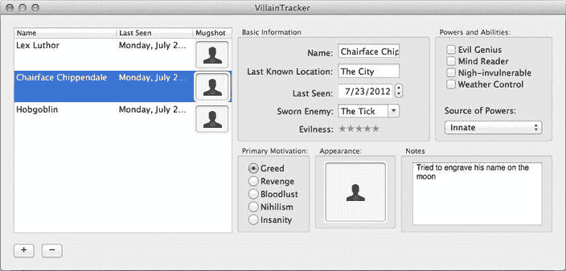

# 6. 使用表格视图

## 摘要

第 4 章和第 5 章介绍了 Cocoa 中一些最常用的 GUI 组件，从按钮和简单的输入字段到功能完备的文本编辑器。我们还没有讨论过 Cocoa 最大、最复杂的视图类之一 `NSTableView`。本章将介绍如何使用 `NSTableView` 来显示整个组件集合的数据，如何响应用户通过点击行来更改表格选择的操作，以及如何直接在表格中编辑值。

我们将通过扩展第 5 章中的 VillainTracker 应用来学习如何使用表格视图。本章创建的新版 VillainTracker 将维护一个反派数组，在表格中显示所有反派，并允许用户在点击表格中的条目时编辑所选反派的所有属性。我们将首先使用 Xcode 扩展 `VillainTrackerAppDelegate` 类的接口，使其包含一个反派数组。既然我们已经在处理这些代码，我们还将探讨另一种手动添加一些新输出口（用于连接到新的表格视图和窗口本身）以及添加和删除反派的操作方法。然后，我们将在 Interface Builder 模式下扩展 nib 文件，添加一个表格视图并将其连接起来。接着，我们将返回 Xcode 更改控制器实现以处理表格。图 6-1 显示了最终结果。

**图 6-1.** 完成的应用窗口

在前面的章节中，我们通过从 GUI 按住 Control 键拖拽到代码，并让 Xcode 生成相应的存根来创建新的输出口和操作。在本章中，由于我们要扩展现有代码，我们将手动创建这些存根。这两种方法都是完全有效的，了解这两种方式很好，这样你可以选择最方便的一种。

