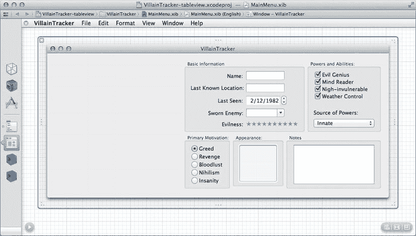
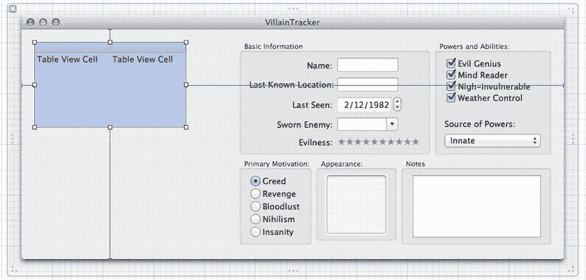
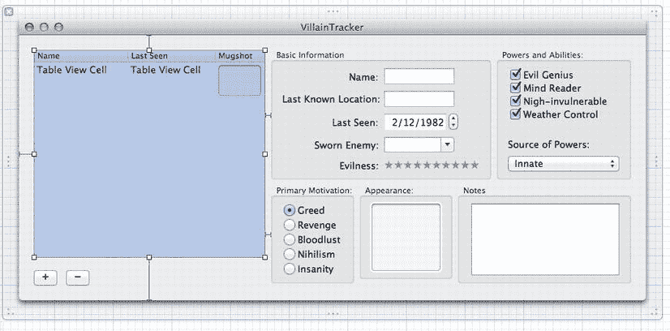
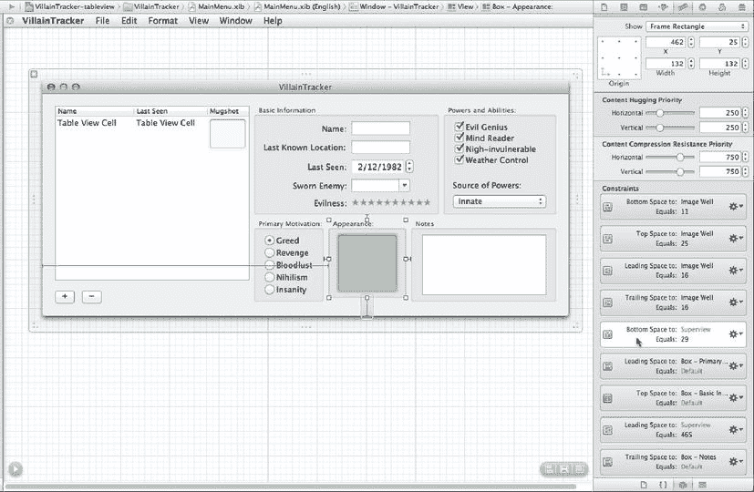
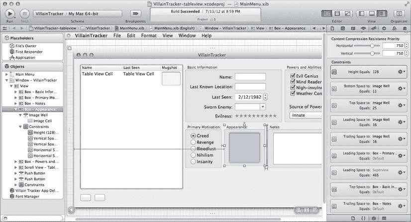
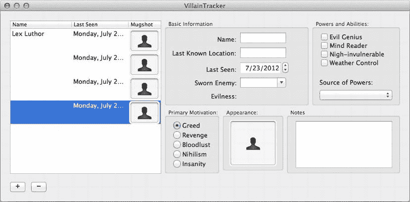

# 为多个反派准备 VillainTrackerAppDelegate

在 Xcode 中，打开我们在第 4 章创建的项目，并导航到 `VillainTrackerAppDelegate.h`，以便更新类的接口来适配即将进行的修改。首先，我们将添加所需的实例变量。因为我们要维护一个反派列表，所以需要创建一个名为 `villains` 的 `NSMutableArray` 来容纳所有反派。我们还会添加一个名为 `villainsTableView` 的出口，以便访问用于展示反派列表的 `NSTableView`。

我们还将为两个新的操作方法 `newVillain:` 和 `deleteVillain:` 添加声明。以下代码展示了完成这些修改后 `VillainTrackerAppDelegate.h` 的状态（新代码行以粗体显示）：

```
#import <Cocoa/Cocoa.h>

@interface VillainTrackerAppDelegate : NSObject <NSApplicationDelegate>

@property (assign) IBOutlet NSWindow *window;
@property (weak) IBOutlet NSTextField *nameView;
@property (weak) IBOutlet NSTextField *lastKnownLocationView;
@property (weak) IBOutlet NSDatePicker *lastSeenDateView;
@property (weak) IBOutlet NSComboBox *swornEnemyView;
@property (weak) IBOutlet NSLevelIndicator *evilnessView;
@property (weak) IBOutlet NSMatrix *powersView;
@property (weak) IBOutlet NSPopUpButton *powerSourceView;
@property (weak) IBOutlet NSMatrix *primaryMotivationView;
@property (weak) IBOutlet NSImageView *mugshotView;
@property (unsafe_unretained) IBOutlet NSTextView *notesView;
@property (weak) IBOutlet NSTableView *villainsTableView;
@property (strong) NSMutableDictionary *villain;
@property (strong) NSMutableArray *villains;

- (IBAction)takeName:(id)sender;
- (IBAction)takeLastKnownLocation:(id)sender;
- (IBAction)takeLastSeenDate:(id)sender;
- (IBAction)takeSwornEnemy:(id)sender;
- (IBAction)takeEvilness:(id)sender;
- (IBAction)takePowers:(id)sender;
- (IBAction)takePowerSource:(id)sender;
- (IBAction)takePrimaryMotivation:(id)sender;
- (IBAction)takeMugshot:(id)sender;
- (IBAction)newVillain:(id)sender;
- (IBAction)deleteVillain:(id)sender;

@end
```

这些新的声明遵循与上一章中使用 control-拖拽到 `VillainTrackerAppDelegate` 类时 Xcode 生成的属性和方法相同的结构。Xcode 会注意到这些代码已被添加，并且这些出口和操作与 Xcode 生成的一样有效。实际上，请注意代码编辑器左侧边距中出现的小圆点。这些圆点是我们可以进行 control-拖拽的连接点，表明 Xcode 识别出我们创建了一个出口或操作。在布局用户界面时，通过 control-拖拽来创建这些元素非常方便，因为我们可以同时建立连接并生成存根。然而，在调整现有代码时，手动操作可能会更快。

现在，我们将在 `VillainTrackerAppDelegate.m` 中为新的操作方法添加两个方法实现（目前只是空壳）。将这些行添加到 `@implementation VillainTrackerAppDelegate` 部分：

```
- (IBAction)newVillain:(id)sender {}

- (IBAction)deleteVillain:(id)sender {}
```

现在，我们已经向 `VillainTrackerAppDelegate` 的接口和实现部分添加了所需的内容，包括一些空存根方法。点击“运行”按钮以确保能够干净编译，然后我们将继续调整 GUI 以便为表格留出空间。

## 为表格视图腾出空间

在 Xcode 的项目导航面板中，点击 `MainMenu.xib` 以在 Interface Builder 模式下打开它（我们也可以双击 `MainMenu.xib` 文件以在新窗口中打开）。我们将使窗口变大，添加一个表格视图和几个按钮，重新组织布局，并调整所有 `NSBox` 的尺寸调整特性，使表格视图能在两个维度上完全调整大小，而其他框则相应移动。

首先，调整窗口大小，使其宽度增加约 300 像素（约为初始宽度的 1.5 倍），但高度保持不变。我们遵循西方从左到右的惯例来安排布局，使得左侧的选项（在表格视图中）决定右侧显示的内容（所有其他视图），因此你还需要将所有现有视图拖拽到窗口的右侧。请参考图 6-2 了解目标效果。选中窗口后，打开属性检查器（⌥⌘4），并勾选标记为“调整大小”的复选框。



**图 6-2.** 使你的窗口与此图相似，为表格视图做准备

现在，在实用工具区域（可能折叠在检查器面板下方）中打开对象库面板（⇧⌥⌘4），并在搜索字段中输入“table”。其中一个结果应该是表格视图，它是包含在 `NSScrollView` 中的 `NSTableView` 类实例。将表格视图拖拽到窗口左上方区域，让蓝色参考线出现，将其定位到距窗口框架边缘的推荐距离。表格视图的默认大小比我们要放置它的空间小得多，但暂时不必调整它以填满可用空间，我们稍后会处理这个问题。

首先，我们要对这个表格视图进行列配置。默认情况下，新的表格视图有两列，但我们希望它有三列，以便在列表中显示每个反派的姓名、最后目击日期和头像。要添加一列，我们需要逐层深入几个视图层级。打开属性检查器（⌥⌘4）以辅助操作；它始终会显示选中对象的一些信息，最关键的是类名。当我们第一次点击窗口中的表格视图时，会看到属性检查器顶部显示“滚动视图”。这是因为我们从库中拖拽出的表格视图实际上包含在 `NSScrollView` 中。再次点击，检查器将显示“表格视图”。

检查器中可见的一个属性是列数。将其从 2 改为 3。当列数改变时，表格视图中会短暂出现水平滚动条的闪光，但很容易忽略。除了这个闪光以及表格标题边缘的调整大小条提示外，表格视图实际上不会直观地反映出有三列存在；我们稍后会处理这个问题。同时，还需要对表格视图进行另外两项更改。第一项是将“列调整大小”行为从“仅调整最后一列大小”改为“仅调整第一列大小”。我们的第一列将显示反派的姓名，而反派的姓名宽度变化会比日期或头像更大，因此我们希望调整大小时扩展该列。默认情况下，用户将能够随意调整列宽。


```markdown

# Table View 内容模式与配置指南

第二个步骤是使用列数上方的弹出菜单，将表格视图的“内容模式”（Content Mode）从基于单元格（cell-based）更改为基于视图（view-based）。请注意，表格中占位符的名称已从`text cell`更改为`table view cell`。不幸的是，最初显示在`NSTableView`中的对象命名有些令人困惑。文本单元格（text cell）是一个`NSTextFieldCell`，它是`NSCell`的子类。然而，表格视图单元格（table view cell）是`NSTableCellView`的实例，它是`NSView`的子类，而非`NSCell`，尽管默认标题中使用了“cell”一词。在本书中，我们对表格视图的所有操作都将使用基于视图的表格视图。

> **注意**  
> 我们在前一章中简要提到了单元格。这里提供一些更深入的背景。在 33MHz 处理器被认为是快速的年代，AppKit 的设计者发现，为矩阵或表格中的每个单元格使用单独的视图对象开销太大。为了解决这个问题，他们为这些用户界面部件发明了“单元格”对象的概念。单元格只是承载数据的对象，代表控件的状态，拥有自己的目标和动作出口（target and action outlets），但没有用于绘制、文本或事件管理的开销。单元格不是`NSView`的子类，这使得它们是更轻量级的对象。这意味着基于单元格的用户界面控件必须处理视图（能够实际绘制到屏幕上并响应用户操作）与单元格（不能这样做）之间的状态协调。在 iOS 中，这种分离已经不存在，Apple 似乎也在将 Cocoa 朝着这个方向推进；`NSTableView`现在支持使用单元格（像传统 Cocoa）或使用视图（像 iOS）作为其子视图。`NSMatrix`目前还不支持这一点，但也许在未来的版本中会实现。

让我们看看是否能找到那一列。点击表格视图之外的窗口区域以取消选中它，然后点击一次表格视图以选中包含它的滚动视图。Xcode 中的 Interface Builder 面板应该类似于图 6-3。点击表格视图的右边缘并稍微展开，以便所有三列都可见。继续展开，直到它卡入相邻的、包含我们反派基本信息的框旁。蓝色对齐线将出现，仅向下延伸到“基本信息”框的高度。



**图 6-3.** 我们已经选中了滚动视图

最后一列需要一点额外的配置，因为它将显示图像而非文本。幸运的是，Cocoa 提供了一个类使这变得容易。在工具区（Utility area）中打开身份检查器（Identity Inspector，快捷键⌥⌘3），以便查看当前所在位置。点击最后一列，直到表格视图单元格被选中。这可能需要点击四次——经过滚动视图、表格视图、表格列，最后是表格单元格视图。到达后，我们将在身份检查器中看到`NSTableCellView`作为类名。然而，经过这么多努力点击到这里后，现在该删除它了。按下 Delete 键将其删除。我们将用一个图像井（image well）来替换它。在对象库搜索框中输入“Image”，顶部选项应该是一个图像井。将其从对象库拖到表格视图的第三列。当光标悬停在可放置区域时，它会变成绿色加号，并且该列会以蓝色边框高亮。松开鼠标按钮，搞定！这一表格列现在可以显示图像了。

由于图像井比其他两列中的表格视图单元格视图更高，请将每个表格视图单元格调整为与图像井相同的高度。它们的高度都应设置为 48 点。要调整大小，请点击每列中显示“Table View Cell”的文本，直到表格视图单元格本身变为蓝色，并在底部出现一个调整大小手柄。向下拖拽调整大小手柄，工具区将显示当前大小。

在完成表格视图之前，我们需要配置这些表格列，使其对应于我们反派对象中的`name`、`lastSeenDate`和`mugshot`值。我们将通过为每一列提供一个与要显示属性的键名相同的标识符（identifier）来实现这一点。稍后，我们将看到如何在代码中使用这个标识符来轻松准备要显示的值。点击表格视图中“Table View Cell”文本下方的区域，选中第一列。在身份检查器（⌥⌘3）中，类名应为`NSTableColumn`。在标识符（Identifier）字段中输入`"name"`。切换到属性检查器（Attributes Inspector，⌥⌘4），在标题（Title）字段中输入`"Name"`；这将决定列标题中显示的文本。对第二列重复此过程，输入`"lastSeenDate"`作为标识符，`"Last Seen"`作为标题；再对第三列重复此过程，输入`"mugshot"`作为标识符，`"Mugshot"`作为标题。

现在我们将添加一对按钮：一个用于向列表添加新反派，另一个用于删除选中的反派。回到对象库面板，在搜索字段中输入`"button"`；结果中会显示出数量惊人多的按钮列表。Apple 公司里有人真的很喜欢设计按钮！尽管它们外观各异，但这个列表中的几乎所有东西都只是一个`NSButton`，其核心功能始终相同。其中一些按钮被预配置为不同的模式，可以充当复选框或展开三角形（disclosure triangle），但除此之外，它们的基本功能都一样：在被点击时调用目标对象中的操作方法（action method）。

从列表中选择前几个按钮之一（可能是“Push Button”或“Rounded Rect Button”），并将其拖到我们的窗口中，放在表格视图下方。这将是我们用于“添加反派”（Add Villain）的按钮。我们不会简单地将按钮标题设置为文本“Add Villain”，而是使用 Cocoa 内置的图形图像之一，使其看起来像其他应用程序中的“添加”按钮。在按钮仍处于选中状态时，打开属性检查器，找到图像（Image）组合框。点击组合框右端的小三角形，开始输入`"nsaddtemplate"`。当你看到它自动补全为`"NSAddTemplate"`时，按下 Enter 键，你会看到新按钮现在显示一个+号图像，覆盖在“Add Villain”标签上。在图像组合框下方是另一个标记为“Alternate”的组合框。也将其设置为`NSAddTemplate`。再下方是一组标记为“Position”的按钮，指示图像（显示为正方形）相对于按钮标题（显示为一条线）的位置。选择仅显示正方形而没有文本的选项，按钮标题将消失。水平调整按钮大小，使其刚好能容纳图像，然后复制按钮（使用⌘D）制作另一个按钮。选中这第二个按钮，再次回到属性检查器中的图像组合框，开始输入`"nsremovetemplate"`，这将在你的按钮中提供—号图像。同样，将备选图像也设置为`NSRemoveTemplate`。

```


现在，请拿起`Add`按钮，将其拖拽至距离窗口底部边缘稍上方一点的位置，利用蓝色参考线使其左侧边缘与表格视图（Table View）的左侧边缘对齐，并使其底部边缘与窗口底部保持建议的距离。再将`Remove`按钮拖拽至`Add`按钮的正右侧——它会自动吸附到与`Add`按钮保持合适间距的位置。接着，调整表格视图（Table View）的大小，使其填满窗口中剩余的空间。此时，窗口应如图 6-4 所示。



**图 6-4.** 表格视图（Table View）正好位于我们想要的位置

我们需要在刚添加的按钮与`VillainTrackerAppDelegate`对象之间建立一些连接，以便当用户点击按钮时，`VillainTrackerAppDelegate`对象能够收到通知。经过前面几章的学习，你大概已经猜到我们该如何操作了。选中带有加号的按钮，按住 Control 键并从该按钮拖出一条连接线，连接到 Interface Builder 区域左侧停靠栏中的`VillainTrackerAppDelegate`对象上。此时会弹出一个工具窗口，列出`VillainTrackerAppDelegate`暴露的所有可用操作。选择我们之前添加的`newVillain:`操作。接下来，选中带有减号的按钮，按住 Control 键并拖出一条连接线到`VillainTrackerAppDelegate`。这一次，选择`deleteVillain:`操作。

我们还需要在`VillainTrackerAppDelegate`与表格视图（Table View）之间建立连接。选中左侧停靠栏中的`VillainTrackerAppDelegate`，按住 Control 键并拖出一条连接线到表格视图（Table View）上。当鼠标悬停在表格视图上方时，该视图会高亮显示。松开鼠标，会弹出一个可用出口（outlets）列表。选择`villainsTableView`。现在，我们需要在相反方向建立两个连接，即从表格视图（Table View）到`VillainTrackerAppDelegate`。选中窗口中的表格视图（Table View）（需要点击两次才能穿透滚动视图）。按住 Control 键从表格视图（Table View）拖出一条连接线到`VillainTrackerAppDelegate`，然后从选项列表中选择`dataSource`。接着重复此操作，这次选择`Delegate`。至此，所有连接就设置好了！

让我们看看运行时这一切是如何运作的。点击 Xcode 窗口左上角的`Run`按钮。尝试拖拽窗口的右下角来调整大小，看看会出现什么效果。请小心，因为接下来是……

## 一个棘手的缩放问题，或者说，约束来救场了！

第一次运行重新组织过窗口的程序时，你可能会看到类似图 6-5 中那样相当丑陋的画面。这是通过缩放手柄将窗口垂直拉伸并水平收缩的结果。观察图片中的窗口，表格视图（Table View）看起来还不错，“能力与特长”框和“主要动机”框也还算正常。“外观”框则向下扩展了。“备注”框水平方向缩小了，“基本信息”框也是如此。实际上，“基本信息”框已经有点乱了。你的布局可能以与图示不同的方式出现问题，但很可能没有完全按照你预期的方式运作。你可能希望使用本章提供的源代码来亲自尝试一下。


**图 6-5.** 唉！这太不美观了

在修复这些问题之前，我们先来思考一下我们希望达到的效果。对于这个程序，我们希望上一章中的所有原始 UI 元素（即所有位于`NSBoxes`中的项目）保持大小不变，并且始终固定在窗口的右侧。两个新按钮应保持大小不变，彼此间距固定，并固定在窗口左侧表格视图的下方。新的表格视图应在窗口扩展时同时向垂直和水平方向扩展，紧贴窗口左侧，并且无论在任何方向上都不能缩小到当前尺寸以下。表格视图右侧的几个框则应保持与表格视图的间距不变。

要使这一切正常工作，我们必须了解 Cocoa 是如何处理缩放的。从 Mac OS X Lion 开始，缩放通过一个名为 Cocoa Auto Layout 的系统进行。在 Auto Layout 中，缩放行为通过带有优先级的约束来指定，这意味着你可以声明视图的最小或最大尺寸、需要保持的子视图间关系、视图与其父视图之间的关系等。当用户缩放宽口时，一个约束求解引擎会根据优先级顺序，动态尝试确定在尽可能满足约束条件前提下的最佳布局。这些约束还处理用户界面在从右到左书写系统（如阿拉伯语和希伯来语）中的表现方式。

每个约束都表达一种关系，例如“等于”、“小于”或“大于”，并且涉及一对视图，或者一个视图和一个常量。一个非常简单的约束可能是“`myButton`的宽度 = 87”。显然，这会将按钮的宽度固定为 87 点。约束不一定是等式；一个有效的约束可以是“`myButton`的高度 >= 32”，这表示按钮的高度不能小于 32。系统会优先选择较小的尺寸而非较大的尺寸；一个宽度必须大于或等于 32 的按钮通常会被设置为 32（满足不等式的最小值）。

一个更复杂的例子是下面这对约束：“`myButton`的左侧边缘与窗口左侧边缘之间的水平间距 = 10”以及“`myButton`的右侧边缘与窗口右侧边缘之间的水平间距 = 15”。为了在缩放过程中保持这两个约束成立，按钮需要随窗口一起伸缩。请注意，我们使用了“leading”和“trailing”而不是“left”和“right”。在从左到右的书写系统中，leading 边缘是左侧。然而，在从右到左的书写系统中，leading 边缘是右侧。

每个约束还有一个优先级，范围从 1 到 1000。优先级高的约束会优先于优先级低的约束得到满足，如果两个冲突的约束无法同时满足，则优先级高的约束会胜出，而优先级低的约束会被违反。例如：“`myButton`的宽度 >= 32，优先级为 1000”以及“`myButton`的宽度 = `someField`的宽度 - 40，优先级为 750”。只要`someField`的宽度大于 72，那么两个约束都能满足，`myButton`会比`someField`小 40 点。但是，如果`someField`缩小到小于 72 点，优先级高的约束将胜出，`myButton`就不会再继续缩小了。

每个视图还具有内容拥抱优先级（Content Hugging Priority）和内容压缩阻力优先级（Content Compression Resistance Priority）。这两个属性描述了视图相对于其最合适尺寸（即固有尺寸）的缩放方式。对于按钮而言，固有尺寸是显示其标签（以及图标，如果有的话）而不发生裁剪所需的大小。内容拥抱控制的是当视图被要求大于其固有尺寸时，它将如何缩放。压缩阻力控制的是当视图被要求小于其固有尺寸时，它将如何缩放。通常，这些优先级的默认值就是不错的选择，在本章中，我们将保持它们不变。


### 创建与编辑约束

`Interface Builder` 允许我们指定控制每个视图缩放行为的约束。事实上，在我们拖拽新控件到窗口时，`Interface Builder` 显示的蓝色虚线引导线一直就在执行这项操作。约束最初基于定位控件时高亮的蓝色引导线在 `Interface Builder` 中创建，且当控件被重新定位时可以改变。例如，当我们把表格视图拖拽到窗口右上角时，靠近边缘会出现一条垂直和一条水平的蓝色虚线。这表示表格视图应固定在那个角落，并创建了一对约束，表明表格视图应保持与窗口顶部和左侧边缘固定距离的位置。像我们这样的复杂窗口，可能包含数十个约束。

为了确定哪些约束是合适的，我们首先需要为窗口确定合适的缩放行为。对于我们的窗口，假设我们希望新的表格视图在窗口放大时能同时水平和垂直缩放。我们希望所有框保持尺寸不变，并在用户缩放窗口时向右弹性移动。最后，我们希望按钮彼此尺寸相同，并固定在窗口底部。我们需要设置新的约束来实现这一点，并可能移除一些非预期的约束。顺便提一下，处理缩放是一个迭代过程。结合在 `Interface Builder` 模式下测试窗口缩放以及使用 `Xcode` 中的 `Simulate Document` 功能进行试错，通常是打磨它的方式。投入一些时间尝试缩放并观察约束如何相互作用，会比任何书本阅读更能提升你的理解能力。

这些约束可以在 `Xcode` 中编辑；我们可以在屏幕上、`Utility` 区域的 `Size Inspector` 中，以及 `Interface Builder` 面板左侧边缘的图标停靠栏中看到它们。选择隐藏在 `Interface Builder` 面板左下角的小展开三角形，图标停靠栏将展开，显示窗口中视图的完整层级。每个视图可以有一组关联的约束，而我们的窗口有很多视图。在 `Utility` 区域，选择 `Size Inspector`（`⌥⌘5`），然后选择标记为 `Appearance` 的框，并展开左侧的 `Constraints` 项。选中该框时，`Interface Builder` 面板应如图 6-6 所示。

  
*图 6-6. Appearance 框的缩放约束*

在 `Size Inspector` 中，我们可以看到影响 `Appearance` 框的九个约束，至少按我们目前的布局是这样。（根据你布局窗口的方式，约束的顺序或常量值可能略有不同。）每条从框延伸出的蓝线也代表一个与另一个视图相关的缩放约束。并非所有约束都与其他视图相关，因此实际激活的约束比蓝线所可视化的要多。

`Appearance` 框的问题在于，当窗口在缩放过程中被拉长时，它会向下扩展，同时导致 `Image` 视图也随之扩展。查看 `Size Inspector` 中的约束列表，其中一条显示“`Bottom Space to: Superview equals: 29`”。这个约束意味着 `Appearance` 框的底部应保持在窗口底部上方 29 点处。另一个处理垂直尺寸的约束显示“`Top Space to: Box – Basic Information Equals: Default`”。这意味着框的顶部边缘应保持与 `Basic Information` 框底部的系统默认距离。约束左侧的紫色图标表示这些是系统创建的约束——即我们在 `Interface Builder` 中定位框时设置的约束。当我们之前定位 `Appearance` 框以使其对齐窗口底部附近的蓝色引导线时，我们隐式创建了那个 `Bottom Space` 约束。然而，如果我们点击 `Bottom Space` 约束旁的齿轮图标，会发现 `Delete` 菜单项被禁用。为了移除它，我们需要换个思路。

让我们稍微尝试一下。在 `Interface Builder` 中，抓住窗口底部并向下拖拽放大。`Appearance` 框确实会在垂直方向放大。`Bottom Space` 约束导致框增长，以保持与窗口底部 29 点的距离。将窗口重新调整回 364 点高度，使一切恢复原状（或松开鼠标，然后按 `Undo`（`⌘Z`）撤销缩放操作）。

由于我们无法直接删除 `Appearance` 框上的约束，我们将改变导致系统最初创建它的条件，并通过利用蓝色引导线（或其缺失）来实现。最简单的方法是将 `Appearance` 框移离窗口底部边缘。请按以下步骤操作。

  
*图 6-7. 重新排列后的 Appearance 框约束*

1. 创建一个新约束来固定 `Appearance` 框的当前尺寸。为此，选择该框，然后从菜单栏选择 `Editor` ➤ `Pin` ➤ `Height`。
2. 将 `Appearance` 框移到窗口顶部附近，远离底部。这将移除将框底部固定到窗口底部的约束。
3. 向下缩放窗口以腾出更多空间。
4. 将 `Appearance` 框放回原位，使框的标题与窗口底部区域的其他两个框对齐，并均匀分布。由于窗口底部距离更远，我们应避免创建该约束。窗口应看起来类似图 6-7。
5. 将窗口缩放回原状。

在垂直缩放时，窗口的行为符合我们的预期。现在，在水平缩放方面我们需要处理两件事：表格视图没有弹性缩放，但最右侧的两个框（`Notes` 和 `Powers and Abilities`）却在缩放。我们可以通过选择 `Editor` ➤ `Simulate Document` 并观察效果来检查这种情况是否发生。

让我们先检查表格视图。在 `Interface Builder` 中选择表格视图，并查看其约束。没有前导或尾随空间约束来固定尺寸，所以问题一定出在右侧的两个框上。由于我们希望它们保持尺寸不变，而不是在窗口缩放时变大，选择 `Powers and Abilities` 框，然后选择 `Editor` ➤ `Pin` ➤ `Width`。对其他所有框执行相同操作。


选择 `Editor` ➤ `Simulate Document` 并尝试水平调整大小。窗口将纹丝不动。我们发现存在一些约束固定了窗口，需要找到并移除它们。针对每个文本框，在尺寸检查器中查看列出的约束，找到值为任意数值且描述为“前置空间到：父视图”的约束。你可以通过选中文本框来确认是否存在这些约束——查看是否有从文本框左侧延伸至窗口边缘的蓝色条。删除所有可删除的约束：要么从该文本框尺寸检查器中约束项下方齿轮图标菜单里选择“删除”，要么选中蓝色条后按 Delete 键。

移除所有约束后，再次选择 `Editor` ➤ `Simulate Document` 并尝试水平调整大小。此时窗口应该能按我们期望的方式调整大小，如图 6-8 所示。


**图 6-8.** 调整大小终于成功了！

在继续实现代码之前，关于调整大小还有几点补充说明。调试调整大小问题几乎总是一个反复试错的迭代过程。我们已经介绍了一些使其正常工作的方法：

- 在界面生成器中调整窗口大小，观察各个元素如何相对于窗口进行调整。
- 如果窗口设计已经演变，尝试重新排列用户界面元素以重置约束。
- 使用“模拟文档”功能进行实验。
- 通过蓝色条和尺寸检查器，查看约束在界面生成器中的可视化效果。

关于约束和 Cocoa 自动布局还有更多内容需要学习；以上只是基础知识。更多详情和调试技巧可查阅 Apple Developer Connection 网站上的《Cocoa 自动布局指南》以及 Xcode 文档。

> **注**  
> Cocoa 自动布局是在 Mac OS X 10.7 中引入的。在此之前，调整大小是通过一种称为“弹簧和支柱”的机制控制的，该机制控制视图如何相对于其所在的窗口调整大小。在 10.7 及更高版本中，旧的弹簧和支柱调整大小行为会在后台转换为约束；应用程序中可以同时存在使用约束的 nib 文件和使用弹簧和支柱的 nib 文件。但是，如果你遇到 2011 年之前的 Cocoa 代码，几乎肯定会遇到不使用约束的 nib 文件。

## 为表格视图让路：代码篇

在连接建立完成且调整大小已受控后，我们可以将注意力转向驱动表格视图并响应“添加”和“移除”按钮点击所需的代码。为此，我们需要离开界面生成器模式，回到代码中。打开项目导航器（⌘1），如果尚未打开的话。单击 `VillainTrackerAppDelegate.m` 文件的条目，编辑器区域应从界面生成器切换为显示我们对象代码的代码窗口。

由于已经在上一章打下了基础，为反派数组添加支持出奇地简单。基本上，我们需要创建一个数组，在希望表格视图显示其内容时（每当其内容发生变化时）通知它，实现几个 `dataSource` 方法为表格视图提供内容，并实现一个在表格视图选择发生更改时调用的 `delegate` 方法（以便更新所有其他视图以匹配所选反派）。接着，我们将添加一对方法，用于从数组中添加和删除反派，然后大功告成！

让我们从初始化一个用于存放反派的数组开始，并告知表格视图应该加载其内容。我们只需在 `applicationDidFinishLaunching:` 中添加几行代码，如下面代码中的粗体部分所示。首先，我们创建一个数组来存放所有反派（初始时仅包含之前我们在代码中创建的第一个反派），并将其赋值给我们的 `villains` 实例变量。然后，我们告诉表格视图加载其内容，并选中其第一行。

告知表格视图选择哪一行比初看起来要复杂一些。我们使用的 `NSTableView` 方法叫做 `selectRowIndices:byExtendingSelection:`。由于表格视图可以选择多行，且选中的行不必连续，因此表格视图期望在 `selectRowIndices:byExtendingSelection:` 方法中传入一个索引集合。在我们的场景中，我们只想选中一行，所以动态创建一个仅包含一个元素的集合。

```
- (void)applicationDidFinishLaunching:(NSNotification *)aNotification {

    self.villain = [[NSMutableDictionary alloc] initWithObjectsAndKeys:
                    @"Lex Luthor", kName,
                    @"Smallville", kLastKnownLocation,
                    [NSDate date], kLastSeenDate,
                    @"Superman", kSwornEnemy,
                    @"Revenge", kPrimaryMotivation,
                    [NSArray arrayWithObjects:@"Evil Genius", nil], kPowers,
                    @"Superhero action", kPowerSource,
                    @9, kEvilness,
                    [NSImage imageNamed:@"NSUser"], kMugshot,
                    @"", kNotes,
                    nil];

    /* 新代码从这里开始 */
    self.villains = [NSMutableArray arrayWithObject:self.villain];
    [self.villainsTableView reloadData];
    [self.villainsTableView selectRowIndexes:[NSIndexSet indexSetWithIndex:0] byExtendingSelection:NO];
    /* 新代码到这里结束 */

    [self updateDetailViews];
}
```

我们还需要在 `takeName:`、`takeLastSeenDate:` 和 `takeMugshot:` 每个方法的末尾添加 `[villainsTableView reloadData]` 调用，这样当用户编辑这些属性的控件时，表格视图将相应更新。只需复制该行代码并粘贴到每个方法的末尾即可。仅仅因为单个值被更改就调用一个看似要重新加载整个数据表的方法，可能显得有些过头，但别担心：`NSTableView` 使用懒加载，通常只会在某一行即将显示时才请求该行的内容。你可能拥有百万行内容，但如果你从不滚动到前 30 行之后，那么表格视图很可能只加载前 30 行。同样，通知表格视图重新加载数据只会使其立即加载可见行；其余行只会在滚动进入显示区域时才会重新加载。

此时，我们应该能够编译并运行我们的应用程序，并且会看到与上一章结尾大致相同的内容，外加一个空白的大表格视图和两个不起作用的按钮。是时候用反派来填充那个表格视图了！


### 表格视图需要协助

我们已经要求表格视图加载其内容，但在我们连接了表格视图的`dataSource`和`delegate`出口的对象——即`VillainTrackerAppDelegate`中，实现`NSTableDataSource`和`NSTableViewDelegate`协议中的某些方法之前，它无法执行任何操作。`NSTableDataSource`和`NSTableViewDelegate`是非正式协议，与大多数委托协议类似，这意味着我们无需声明自己的类符合该协议。因此，就 Objective-C 而言，实现`NSTableDataSource`和`NSTableViewDelegate`的方法是可选的。尽管如此，要让表格视图显示任何内容，实际上有几个方法是必需的：来自`NSTableViewDataSource`的`numberOfRowsInTableView:`和来自`NSTableViewDelegate`的`tableView:viewForTableColumn:row:`，表格视图会使用这两个方法来准备要显示的内容。以下是在`VillainTrackerAppDelegate.m`中实现这些方法的方式：

```
- (NSInteger)numberOfRowsInTableView:(NSTableView *)aTableView {
    return [self.villains count];
}

- (NSView *)tableView:(NSTableView *)aTableView
       viewForTableColumn:(NSTableColumn *)tableColumn
                      row:(NSInteger)row {
    NSMutableDictionary *thisVillain = [self.villains objectAtIndex:row];
    NSString *thisColName = [tableColumn identifier];
    NSView *result = nil;

    // 根据我们使用的列，需要执行不同的操作。
    // 将 [tableColumn identifier] 传递给 makeViewWithIdentifier 可以确保我们获得
    // 已在 IB 中为该列配置好的视图，AppKit 会为我们管理这一点。
    if ([thisColName isEqualToString:kName]) {
        NSTableCellView *thisCell = [aTableView makeViewWithIdentifier:thisColName owner:self];
        thisCell.textField.stringValue = [thisVillain objectForKey:kName];
        result = thisCell;
    } else if ([thisColName isEqualToString:kLastSeenDate]) {
        NSTableCellView *thisCell = [aTableView makeViewWithIdentifier:thisColName owner:self];
        thisCell.textField.stringValue = [thisVillain objectForKey:kLastSeenDate];
        result = thisCell;
    } else if ([thisColName isEqualToString:kMugshot]) {
        NSImageView *thisCell = [aTableView makeViewWithIdentifier:thisColName owner:self];
        [thisCell setImage:[thisVillain objectForKey:kMugshot]];
        result = thisCell;
    }

    // 返回结果。
    return result;
}
```

第一个方法不言自明：我们只需返回数组的大小，以便表格视图知道需要显示多少行。每当单元格即将在表格中显示时，表格视图都会调用第二个方法。表格视图会告诉我们它想要显示的列和行索引编号。行索引编号与内容数组中相关对象的索引编号相同，因此调用`[villains objectAtIndex:rowIndex]`会从`villains`中返回相应的模型对象。你可能还记得，我们使用的模型对象实际上只是`NSMutableDictionary`实例，其所有值都可通过键访问。当我们在表格视图中配置每列的标识符属性时，我们使用了与模型对象相同的键名。根据列的标识符，我们要求表格视图使用`makeViewWithIdentifier:owner:`为该列创建适当的`NSView`子类实例。然后，我们根据模型对象中的相关值配置视图，并将其返回给表格视图。

例如，当`Name`列下顶行中的单元格即将显示时，系统会调用此方法，其中`rowIndex`为 0，`TableColumn`指向`Name NSTableColumn`。我们使用 0 来指定从`villains`数组中抓取哪个反派，然后使用表列标识符方法返回的值`@"name"`，从选中的反派中检索一个值。我们要求表格视图为那列获取一个适当的`NSView`实例（我们在 Interface Builder 中配置了该实例），然后以适合该`NSView`的任何方式填充它。最后，我们返回该视图，表格视图将其绘制出来。

现在，我们应该能够编译并运行`VillainTracker`，并看到默认反派既显示在控件中，也作为表格视图中的唯一一行显示。此外，如果我们在控件中编辑反派的名称、最后目击日期或头像，我们应该会在表格视图中看到这些新值的反映。然而，我们目前仍然只有一个反派，并且没有办法追踪更多。让我们现在就来改变这一点。

### 添加更多反派

我们之前已经搭建了`newVillain:`方法的框架。现在我们来填充其实现。`newVillain:`方法会向我们的反派数组中添加一个新的“空”反派对象，通知表格重新加载，并告诉表格视图应选择哪一行（最后一行，因为这是我们刚刚添加的那一行）。

```
- (IBAction)newVillain:(id)sender {
    [_window endEditingFor:nil];
    [self.villains addObject:[NSMutableDictionary
        dictionaryWithObjectsAndKeys:
            @"", kName,
            @"", kLastKnownLocation,
            [NSDate date], kLastSeenDate,
            @"", kSwornEnemy,
            @"Greed", kPrimaryMotivation,
            [NSArray array], kPowers,
            @"", kPowerSource,
            [NSNumber numberWithInt:0], kEvilness,
            [NSImage imageNamed:@"NSUser"], kMugshot,
            @"", kNotes,
            nil]];
    [self.villainsTableView reloadData];
    [self.villainsTableView selectRowIndexes:[NSIndexSet indexSetWithIndex:[villains count]-1]
                    byExtendingSelection:NO];
}
```

我们在这里可能看到的唯一新内容是第一个方法调用`[_window endEditingFor:nil]`。我们来分析一下它的两个部分。首先，`_window`实例变量来自哪里？Xcode 根据它在`VillainTrackerAppDelegate.h`文件中生成的已声明属性，为我们构造了这个变量，并自动将其连接到窗口：

`@property (assign) IBOutlet NSWindow *window;`

由于我们没有通过`@synthesize`声明给出显式名称，Xcode 默认创建了一个带有前导下划线的新实例变量。其次是我们对窗口调用的方法`endEditingFor:`。这仅仅是告诉窗口，现在是时候结束用户当前正在进行的任何其他编辑行为（例如在文本字段中键入）。我们需要调用此方法，以便可以将编辑后的值“保存”到其底层的反派对象中，因为稍后在`newVillain:`中我们将更改表格视图的选择，这反过来会擦除各个控件中显示的值！


### 选择反派角色

目前，我们应用详情部分只显示了列表中第一个反派角色。为了更新详情视图，我们需要实现一个委托方法，该方法会在表格视图的选择状态发生改变时被调用。这能使我们获知用户选中了哪一行，从而将我们的反派角色实例变量指向反派角色数组中对应的那一行，并重新显示所有其他控件以匹配新的选择。请将此方法添加到 `VillianTrackerAppDelegate.m` 文件的 `@implementation` 部分：

```
- (void)tableViewSelectionDidChange:(NSNotification *)aNotification {
    if ([self.villainsTableView selectedRow] > -1) {
        self.villain = [self.villains
                       objectAtIndex:[self.villainsTableView selectedRow]];
        [self updateDetailViews];
        NSLog(@"current villain properties: %@", self.villain);
    }
}
```

请注意，此方法的核心代码被包裹在一个 `if` 子句中。之所以必须这么做，是因为表格视图可能会通知我们当前没有任何选中的行——其 `selectedRow` 方法会返回 –1 来表示这种情况。除此之外，你现在应该能够理解其中发生的事情了。

现在编译并运行应用，可以看到 + 按钮现在确实能触发某种操作，如图 6-9 所示。此外，我们应该能够在表格视图中点击切换不同的反派角色，并看到其他控件中的值随之改变。



图 6-9.

+ 按钮现在可以添加反派角色了

### 停止你的邪恶行径！

能够删除一个反派角色会很好。一旦我们的英雄说服了一个反派停止其邪恶行径，我们可能就想把他们从数据库中移除。或者，也可能只是我们输入有误。无论如何，让我们增加删除坏蛋的功能。我们已经有一个 `deleteVillain:` 方法的存根，下面就是这个方法应该完成的工作。（我们添加了注释来标明不同的部分，这些部分将在代码之后进行说明。）

```
- (IBAction)deleteVillain:(id)sender {
    //
    // 第 1 部分：
    //
    [_window endEditingFor:nil];
    NSInteger selectedRow = [self.villainsTableView selectedRow];
    //
    // 第 2 部分：
    //
    [self.villains removeObjectIdenticalTo:self.villain];
    [self.villainsTableView reloadData];
    //
    // 第 3 部分：
    //
    if (selectedRow >= [self.villains count]) {
        selectedRow = [self.villains count]-1;
    }
    //
    // 第 4 部分：
    //
    if (selectedRow > -1) {
        // 取消所有行的选中状态，以确保表格视图认为选择发生了“变化”，
        // 即使它可能仍然指向相同的行索引。
        //
        // 第 5 部分：
        //
        [self.villainsTableView deselectAll:nil];
        [self.villainsTableView selectRowIndexes:[NSIndexSet indexSetWithIndex:selectedRow] byExtendingSelection:NO];
        [self updateDetailViews];
    }
}
```

这个方法比我们本书迄今为止展示的大部分代码都要稍微复杂一些，因此有必要进行一些补充说明。

在第 1 部分中，我们让窗口结束任何正在进行的编辑操作，然后获取表格当前选中行的索引——也就是即将被删除的那一行。请注意，我们已经知道哪个反派被选中了，因为它被存储在一个实例变量中，但拥有行索引对于确保删除后的选择逻辑正确至关重要（我们将在第 4 部分处理这个问题）。

在第 2 部分中，我们从反派角色数组中删除选中的对象（由 `villain` 属性指向的对象），然后告诉表格视图重新加载数据。请注意从数组中移除反派角色的方法是 `removeObjectIdenticalTo:`。这个方法会让 `NSMutableArray` 通过比较对象的实际内存地址与它所包含对象的内存地址来自我扫描，以便只找到并移除我们传入的那个确切对象。否则，如果我们使用更常用的 `removeObject:` 方法，它会通过发送 `isEqual:` 方法来比较对象，而后者会比较对象的值。在这种情况下，其他与选中反派属性完全相同的反派对象也存在被一并删除的风险。

在第 3 部分中，我们做一个小调整。如果之前选中的行索引是数组中的最后一个索引，那么在我们从数组中移除一个对象之后，该索引现在就越界了。在这种情况下，我们将其重置为指向当前最后一个对象。

接下来，第 4 部分检查 `selectedRow` 是否大于等于 0。这个检查很重要，因为第 3 部分有可能将其设置为 –1！考虑一下这种情况：数组中只有一个对象，我们点击了“删除”按钮：开始时，`selectedRow` 会是 0（数组中唯一一行的索引），但在第 3 部分之后它变成了 –1，第 4 部分通过直接跳过方法的其余部分来处理这种情况。

最后，第 5 部分取消表格视图中所有行的选中状态，然后选中我们当前想要的行，并最终根据当前选择更新所有视图。这看起来可能不明显，但首先取消表格视图中所有行的选中状态很重要，否则 `tableViewSelectionDidChange:` 委托方法可能不会被调用（因为通常在删除一行后，选中的行索引本身还是同一个数字，而表格视图无法知道我们已从内容数组中删除了一个对象，导致该行索引现在指向了一个不同的对象）。

现在编译并运行应用；我们现在可以删除选中的反派角色，并且控件中的值会随之改变以匹配新的选择。

我们只剩下最后一个特性想要实现。我们的用户还不能直接在表格视图中编辑值。现在让我们来解决这个问题。


### 在表格视图中编辑

用户应能编辑反派的名字，或将新头像拖入表格视图的任意一行，并更新相应的反派。由于表格视图的列是 `NSViews`，表格视图中的每个单元格都可以在 Interface Builder 中指定目标和动作；表格视图内的用户界面元素与其他视图的工作方式完全相同。当用户在表格视图内编辑某个值时，该动作可以连接回我们的代码，以通知我们这一更改。我们受到的限制是目标必须是表格视图的委托，但对于这个应用来说，这并不是问题。此外，我们现有的 `takeName:` 和 `takeMugshot:` 方法也可以使用，但它们需要做一些小改动。这些方法作用于选中的反派，但用户若不选中行（即选中反派）就无法编辑表格视图内的值。然而，这些方法目前预期只能从详情视图中的控件调用，但现在我们要添加从多个位置设置它的能力。对于这个应用，我们只允许在行内编辑名字和头像，并禁止编辑最后出现日期。

还有另一个小障碍需要解决。默认情况下，表格视图单元格是不可编辑的。在 Xcode 中可以轻松更改这一点。

要进行连接，我们需要按住 Control 键，从每列中的视图拖出一条连接线到 `VillainTrackerAppDelegate` 实例。但是，表格视图单元格嵌套在窗口视图层次结构中的位置很深，因此我们将采用另一种方式来建立连接，以便更轻松地找到正确的用户界面组件。

回到 Xcode，打开 `MainMenu.xib` 文件，它会在 Interface Builder 画布中打开。点击屏幕左下角的小展开三角形，它会将屏幕左侧的对象停靠栏展开为窗口视图层次结构的轮廓图。同时，打开 Utility 区域中的属性检查器。

在下钻到轮廓图中，找到名称列的文本字段；从外到内，路径是：窗口 – Villain Tracker ➤ 视图 ➤ 滚动视图 – 表格视图 ➤ 表格视图 ➤ 表格列 – 名称 ➤ 表格单元格视图 ➤ 静态文本 – 表格视图单元格 ➤ 文本字段单元格 – 表格视图单元格。在下钻时，您还会在编辑器画布上方的跳转栏中看到这条路径。点击“文本字段单元格 – 表格视图单元格”，然后按住 Control 键拖拽到停靠栏中更靠下的 Villain Tracker App Delegate 实例，如图 6-10 所示。当 Utility 窗口出现时，从动作列表中选择 `takeName:`。在继续之前，查看属性检查器（也如图 6-10 所示）。那里有一个标有“行为”(Behavior) 的弹出菜单，当前值为“无”(None)。选择它并将其更改为“可编辑”(Editable)。


图 6-10. 使用停靠栏进行 Control-拖拽

最后，对图像井执行相同的操作。图像井的路径是：窗口 – Villain Tracker ➤ 视图 ➤ 滚动视图 – 表格视图 ➤ 表格视图 ➤ 表格列 – Mugshot ➤ 图像井 (Image Well) ➤ 图像单元格 (Image Cell)。按住 Control 键从“图像井”行（不是“图像单元格”行，而是其上一行）向下拖拽到 Villain Tracker App Delegate，然后选择 `takeMugshot:`。要使图像井可编辑，属性检查器顶部附近有一个复选框。如果您愿意，还可以启用“动画”(Animates)。如果您的反派头像包含动画信息或多个帧，例如来自反派 MySpace 页面的动画 GIF，那么这将在显示时播放动画。

如前所述，`takeName:` 和 `takeMugshot:` 方法都期望从详情视图中执行更新的控件调用。之前，我们在每个方法的末尾添加了对 `[villainsTableView reloadData]` 的调用。现在我们需要在该调用之后添加另一个调用。在 `takeName:` 和 `takeMugshot:` 中，在末尾添加对 `[self updateDetailViews]` 的调用。这确保了无论用户在何处进行编辑（在表格视图中还是在详情视图中），更改都会在两个地方反映出来。

是时候编译并再次运行应用，看看我们是否能在表格视图中编辑了。此时，我们应该能够添加一个新的反派、编辑其属性，然后删除他们。我们仍然无法保存任何关于反派的信息；这将是下一章的主题。

## 总结

本章提供了一个简单演示，展示了如何维护一个项目列表，在表格视图中显示它们，并在另一组独立的控件中编辑所选项目的详细信息。我们了解了一些关于 `NSTableView` 如何使用其 `dataSource` 来访问项目以进行显示和编辑的知识，并看到了当选择发生更改时，它如何通知其委托，从而允许我们手动更新依赖于表格视图选择的视图中的内容。

如果您熟悉其他桌面 GUI 开发环境，其中一些内容可能对您来说有点陌生，但我们希望您能看到 Cocoa 所支持方法中的一些优势，例如在代码和 GUI 布局之间提供清晰的划分。然而，现在是时候承认了：我们迄今为止所采用的方式不一定是 Cocoa 中处理这类事情的最佳方式。尽管到目前为止一切都很简单，但我们实际上一直在向您展示解决某些问题的困难方法！在过去的几年里，一种新的 GUI 编程方法在 Cocoa 社区中扎根，并且变得越来越普遍。这项技术称为 Cocoa 绑定，它是第 7 章的主题。


