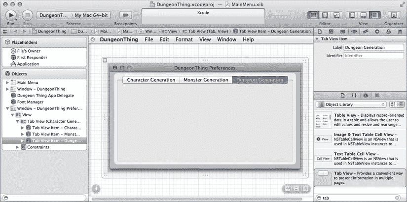
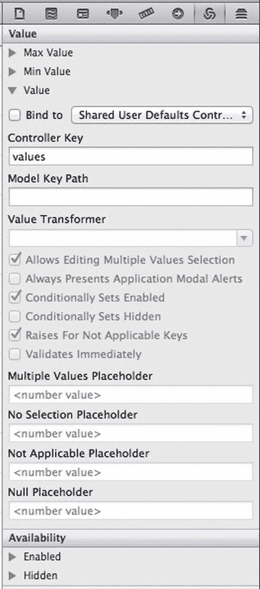
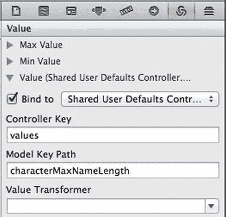
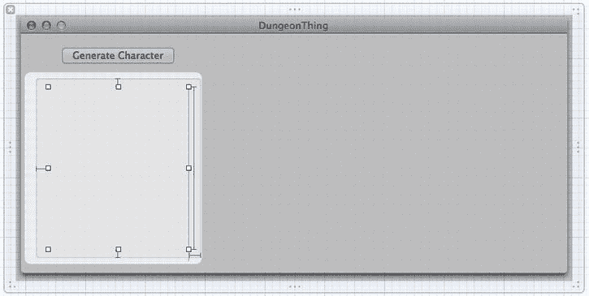
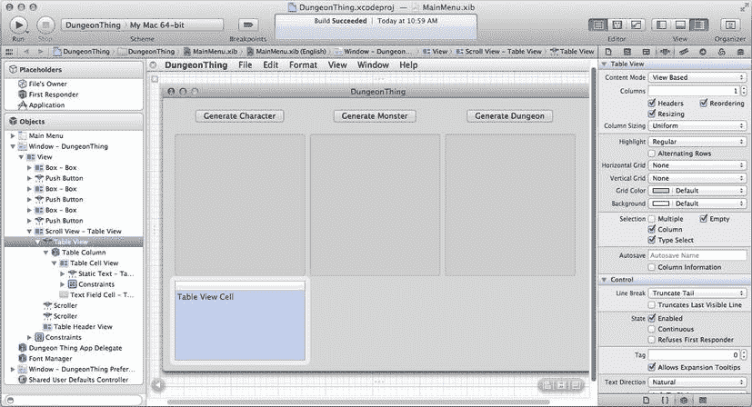
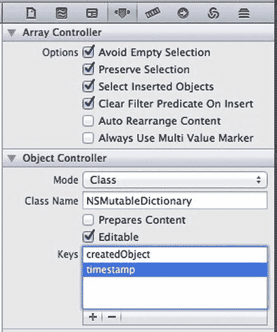

# 7. Cocoa 绑定

## 摘要

第 5 章和第 6 章介绍了如何将一个控制器对象连接到各种视图对象，以便显示值并在用户操作时获取新值。在我们的示例中，通常每个视图对应一个小型的操作方法（当用户编辑视图中显示的值时触发），再加上一个庞大的 `updateDetailViews` 方法，用于在选中项变化时一次性更新所有视图的内容。对于简单项目来说，这种方法尚可，但存在一些问题。首先，有扩展性问题。想象一下，不是十个视图，而是一百个视图。采用这种方法，控制器将包含一百个小型操作方法和一个用于向所有视图推送值的庞大方法！

此外，控制器与关联视图之间确实存在紧密耦合。例如，如果我们最初使用 `NSDatePicker` 来显示和编辑日期，但后来决定改用 `NSTextField`，该怎么办？除了修改图形界面，我们还需要修改输出口、相应的操作方法以及 `updateDetailViews` 方法。

幸运的是，苹果公司早已意识到这个问题，自 Mac OS X 10.3 起便引入了一项名为 Cocoa 绑定的技术，它解决了上述许多问题。Cocoa 绑定允许我们在 Interface Builder 中配置视图，使其能够自动获取值并将更改传回模型对象。我们只需告诉它应该与哪个控制器对象交互，以及使用哪个字符串作为键来获取和设置值。我们可以通过自定义的控制器类访问模型对象，也可以使用 Cocoa 中提供的通用控制器类。

这种架构的结果是，我们自己的控制器类通常无需了解任何关于所用视图对象的具体信息。我们不需要有指向它们的实例变量，也不需要实现操作方法来获取它们的输入！控制器最终只相当于模型对象与一组视图对象之间的简单通道，从控制器的角度来看，十个视图还是一百个视图并无区别。

在本章中，我们将学习如何将 Cocoa 绑定用于简单的控件（如复选框、滑块和文本字段）以及复杂的控件（如表格视图）。我们将通过几个苹果内置的控制器类创建连接到模型对象的绑定。我们还将介绍如何使用 `NSUserDefaults` 及其支持绑定的伴侣 `NSUserDefaultsController` 来处理应用程序中的偏好设置。

## 绑定到简单控件

本章的示例应用程序可用于角色扮演游戏中的游戏主持人，以随机创建角色、怪物和地下城。主窗口将包含按钮，用户点击这些按钮时可创建随机游戏对象，以及用于显示结果的文本字段。我们还将创建一个偏好设置窗口，用户可以在其中指定创建游戏对象的一些参数。我们不会实际“掷出”这些随机对象，而是每次用户点击按钮时显示所用参数的摘要。随机游戏对象的创建超出了本书的范围，但如果您有兴趣，这对读者来说可能是一个有趣的练习！

### 添加标签视图

我们将把应用程序偏好设置分为三组，分别对应可创建的三个游戏对象。我们将把控件放在 `NSTabView` 中，用户可以通过顶部的标签列表在不同视图之间切换。在对象库窗格中，输入“tab”，然后将出现的标签视图拖入空白窗口，并调整其大小使其几乎填满窗口（如图 7-1 所示），保留蓝色引导线显示的边距。



**图 7-1.** 添加并命名标签后的 DungeonThing 偏好设置窗口

从对象库拖出新的标签视图时，默认有两个标签，但我们希望有三个。点击标签视图，打开属性检查器（⌥⌘4）。注意“Tabs”字段，点击微小的向上箭头，将其值从 2 改为 3，即可看到三个标签。双击每个标签的标题，分别改为“角色生成”、“怪物生成”和“地下城生成”。图 7-1 显示了此时窗口应有的样子。

### 绑定到 NSUserDefaultsController

此时，窗口中已包含所有这些图形界面控件，但我们没有连接它们的输出口，也没有在用户点击时调用的操作方法。那么，接下来该做什么？现在是时候创建第一个绑定！我们将使用一个名为 `NSUserDefaultsController` 的类，它是 Cocoa 中一个支持绑定的通用控制器类。像这样的支持绑定的控制器允许我们在 Interface Builder 中直接将视图对象绑定到底层模型对象。这个类的一个好处是，它通过 `NSUserDefaults` 来维护自己的存储，而 `NSUserDefaults` 是 Cocoa 应用程序中用于保存和读取用户偏好设置的标准类。这使我们能够将每个视图对象的值绑定到应用程序偏好设置中一个唯一键对应的值。这些偏好设置在用户退出应用程序时自动保存，并在用户下次启动应用程序时重新加载。


### 角色生成界面的绑定

前往我们正在构建的偏好设置窗口，切换回“角色生成”面板。点击滑块，然后调出绑定检查器(`⌥⌘7`)。在此检查器中，我们可以看到视图对象的所有属性，这些属性都可以绑定到模型对象中的某个值。通常，我们会将 `Value`(值) 绑定到某个内容，但每个视图类都提供了自己的一组可供绑定的属性。例如，滑块可以将其 `Max Value`(最大值) 和 `Min Value`(最小值) 属性绑定到某个值，这使我们能够根据模型对象中的值来改变这些极值。其他一些视图对象可以将文本颜色和字体绑定到模型值，并且它们中的大多数都可以将其 `Hidden`(隐藏) 和 `Enabled`(启用) 状态绑定到模型值。目前，我们要绑定这个滑块的 `Value` 属性，因此请点击 Value(值) 的展开三角形来查看其配置选项。图 7-6 显示了默认设置。



图 7-6. `NSSlider` 的 `Value` 绑定选项的默认“未绑定”状态

要建立绑定，我们需要配置至少三项内容：要绑定的控制器对象、控制器键以及模型键路径（其余都是可选设置，用于在特殊情况下细化绑定的行为，我们将在后面介绍其中一些）。从“绑定到”弹出列表中选择控制器对象，该列表包含我们 nib 文件中存在的所有控制器对象，包括我们自己的任何控制器、从库中拖入的任何通用控制器，以及像 `NSUserDefaultsController` 这样的特殊控制器——它在每个 nib 文件中都自动可用（在弹出列表中显示为“共享用户默认控制器”）。控制器键让我们可以选择控制器所提供的一个或多个模型对象的不同“方面”。例如，`NSArrayController` 提供了对对象数组的绑定访问，它具有不同的控制器键来提供对整个排序数组或仅当前选中的内容的访问。模型键路径是一个字符串，用作在模型对象中获取和设置值的键。

那么，对于我们的第一个绑定，首先从弹出列表中选择“共享用户默认控制器”。该控制器在任何 nib 文件中都是自动可用的，不过我们在将其用于绑定之前是看不到它的，一旦使用，它就会出现在主 nib 窗口中。现在检查“控制器键”组合框，确保它设置为 `values`。然后点击“模型键路径”组合框，并输入 `characterMaxNameLength` 到该组合框中。此字符串定义了将用于把滑块的值存储到 `NSUserDefaults`（用户的应用程序偏好设置）中的键。按 Return 键或切换到其他字段，请注意检查器顶部的“绑定到”复选框被勾选了。就这样！我们现在无需担心任何剩余的控件；它们的默认值对我们来说已经足够。图 7-7 显示了此绑定配置完成后检查器中相关配置部分应该呈现的样子。



图 7-7. 第一个滑块完成的绑定

现在选择滑块右侧的小文本字段，并配置与滑块完全相同的绑定：“共享用户默认控制器”、`values` 和 `characterMaxNameLength`。这将使其从同一个模型对象（用户的应用程序偏好设置）中的同一个位置（`characterMaxNameLength` 的值）获取其显示值。要立即查看 Cocoa 绑定的魔力，请从菜单中选择“编辑器”➤“模拟界面”，点击并拖动滑块，观察小文本字段中的值同时更新。请注意，这与我们在第 2 章中构建的功能相同，但机制不同：当我们拖动滑块时，它的值被 `NSUserDefaultsController` 推送到我们的应用程序偏好设置中，该控制器同时将值传递给绑定到同一个键的其他对象，也就是小文本字段。真是个巧妙的手段！但这并非什么戏法。它是 Cocoa 绑定动态特性的一个简单示例。利用这项技术，我们可以从控制器类中消除大量乏味的代码，有时甚至可以完全摆脱我们的控制器类——仅使用 Cocoa 自带的控制器类。

接下来我们看看下一个 GUI 控件，中间的单选按钮矩阵。点击该矩阵，然后查看绑定检查器，我们会发现没有 `Value` 选项。对于这个控件，我们不绑定 `Value`，而是绑定 `Selected Tag`(选中标签) 属性，这意味着当用户选择一个单元格时，该单元格的标签将被推送到模型中，并且下次打开偏好设置窗口时，保存的那个标签将决定选中哪个单选按钮。展开绑定检查器的“选中标签”部分，再次确保选中了“共享用户默认控制器”并且“控制器键”是 `values`，但这次在“模型键路径”中输入 `characterStatsGenerationPolicy` 并按 Return 键。

接下来，我们来处理“允许的角色职业”复选框。对于每个复选框，我们都会创建一个新的键名，并用它将 `Selected`(选中) 状态绑定到用户应用程序偏好设置中的一个值。点击第一个单元格“圣骑士”。检查器标题应更改为“按钮单元格绑定”。如果没有，请再次点击该按钮直到标题改变。现在将这个按钮单元格的 `Value` 属性绑定到 `characterClassAllowedPaladin` 键。对剩下的每个按钮单元格重复这些步骤，通过“共享用户默认控制器”并使用相应的键名来绑定它们。“吟游诗人”应绑定到 `characterClassAllowedBard`，“战士”绑定到 `characterClassAllowedFighter`，依此类推。当处理到“魔法使用者”时，为了保持一致，请使用键名 `characterClassAllowedMagicUser`，省略掉 `-` 符号。

### 怪物生成界面的绑定

现在切换到“怪物生成”标签页。将滑块的 `Value` 绑定到 `monsterBootyFrequency`，右侧的小文本字段也同样绑定。然后，按照我们在“角色生成”标签页上的方式配置复选框。点击“兽人”复选框直到复选框本身被选中，并将其 `Value` 绑定到 `monsterTypeAllowedOrc`。继续处理其余的复选框，将每个复选框的 `Value` 绑定到相应的键名：`monsterTypeAllowedGoblin`、`monsterTypeAllowedOgre`，依此类推。

### 地牢生成界面的绑定

最后，切换到“地牢生成”标签页，其中只包含三对滑块和文本字段。在“通道曲折度”标签右侧，配置滑块和文本字段的 `Value` 绑定到 `dungeonTunnelTwistiness`。将两个“怪物频率”控件的 `Value` 都绑定到 `dungeonMonsterFrequency`，并将两个“宝藏频率”控件的 `Value` 都绑定到 `dungeonTreasureFrequency`。


### 创建主窗口

现在，该关注一下我们的主窗口了，它将包含用户可以点击的按钮以生成角色、怪物和地牢，以及用于显示结果的文本字段。点击主窗口的标题栏（如果窗口不可见，则双击主窗口中的图标），然后打开尺寸检查器（⌥⌘5）。将窗口大小更改为 731 x 321，接着切换到属性检查器（⌥⌘4），并点击关闭 `Resize` 复选框，这样我们就少了一件需要操心的事。该应用程序显示有限的数据集，因此用户没有理由将窗口放大。接下来，我们将创建三组 GUI 组件，每组对应我们正在处理的三种数据类型之一。我们将手动布局第一组，然后将其复制到其他两组。

首先，我们将在盒子内创建一个用于显示结果的文本字段。前往对象库面板，在搜索字段中输入“`nsbox`”。在结果中找到盒子，并将一个盒子拖拽到我们的窗口中。选中新盒子后，切换回尺寸检查器，将盒子的尺寸设置为宽 227、高 247。同时，将其 `X` 和 `Y` 值均设置为 20。这会将盒子置于窗口的左下角，大致相当于将其拖拽到左下角并根据蓝色辅助线建议放置的位置。然后切换回属性检查器，将 `Title Position` 设置为 `None`，这样标题就不会显示。

现在，返回对象库面板，在搜索框中输入“`label`”。搜索结果中有一个`Wrapping Label`；选中它，将其拖拽到我们刚刚创建的盒子正上方，然后松开鼠标。这样操作会将其放入盒子内部。放置好后，通过先将其左下角拖拽到盒子的左下角，再将其右上角拖拽到盒子的右上角，将标签扩展到填满整个盒子。在两种情况下，当我们与盒子边缘的距离恰好合适时，蓝色辅助线就会出现。最后，三次点击文本字段中的文字（“`Multiline Label`”）以选中它，然后按退格键或删除键清除文字。

我们来为这个盒子收尾，添加一个按钮，该按钮最终会将一些文本放入我们刚刚创建的文本字段中。在对象库中找到一个按钮（推送按钮就很好用），并将其拖拽到盒子正上方的位置。拖拽过程中，蓝色线条会出现，显示与窗口顶部的正确距离，同时还会显示按钮何时与盒子中心正对齐。那就是我们想要放置的位置！双击按钮以编辑其标题，并将其更改为“`Generate Character`”。根据缩放约束的设置方式，我们之后可能需要重置盒子的大小。图 7-8 显示了此时应该看到的效果。



图 7-8.

我们为主窗口创建了三组视图中的第一组。盒子内部的文本字段被高亮显示，以便我们能看到它的位置

现在，点击窗口中的任意位置，然后按 ⌘A 选中窗口中的所有对象，以选中我们刚刚创建的所有视图。按 ⌘D 复制它们，此时会显示一组新的相同对象，它们与原始对象重叠且位置略有偏移。将这组对象拖拽到窗口中央，使用蓝色辅助线确保它们与原始对象的垂直位置相同，并且盒子之间的水平间距恰到好处。然后再次按 ⌘D，将第三组对象拖拽到窗口右侧，再次使用蓝色辅助线帮助正确定位它们。最后，双击两个新按钮，分别将其标题更改为“`Generate Monster`”和“`Generate Dungeon`”。同样，根据缩放约束的设置方式，我们可能需要将盒子大小重新设置为 227 x 247。图 7-9 显示了此时窗口应该呈现的样子。


图 7-9.

DungeonThing 完成后的主窗口

### 设置 DungeonThingAppDelegate

既然初始绑定工作已经完成，主窗口也已全部设置好，我们可以将各项连接到 `DungeonThingAppDelegate` 了。点击工具栏中 Editor 标签组里那个类似管家的图标（或使用键盘快捷键），打开一个辅助编辑器（⌥⌘↵）面板，并从跳转栏中选择 `DungeonThingAppDelegate.h`。逐个从位于 `Generate Character` 按钮下方盒子中的标签上按住 Control 键拖拽，直至辅助编辑器中的 `DungeonThingAppDelegate.h` 文件，拖到预定义的窗口 `@property` 下方。到达那里时，应该会出现一个小窗口，提示可以创建新的 Outlet 或 Action。松开鼠标，创建一个名为 `characterLabel` 的新 Outlet。对窗口中的其它两个盒子内的标签执行相同操作，分别创建名为 `monsterLabel` 和 `dungeonLabel` 的新 Outlet。

然后，从三个按钮分别按住 Control 键拖拽回辅助编辑器中的 `DungeonThingAppDelegate.h` 文件，并创建名为 `createCharacter:`、`createMonster:` 和 `createDungeon:` 的新 Action。至此，哪个 Action 对应哪个按钮应该很清楚了。除了将 Outlet 和 Action 添加到 `DungeonThingAppDelegate.h` 文件外，这还会在 `DungeonThingAppDelegate.m` 文件中为这些 Action 添加方法存根。


### 定义常量

此时，GUI 已完成，相关绑定也已全部配置完毕，因此偏好设置窗口中的控件值都将保存到用户的应用程序偏好设置中。剩下要做的就是编写操作方法来使用 `NSUserPreferences` 检索偏好设置值并显示它们。如前所述，我们暂不实际使用这些值生成游戏物品描述，但如果你愿意，可以稍后自行增强此功能。

让我们先定义一些常量，就像我们在之前的示例中所做的那样（如果你忘了，可以查看第 4 章了解这样做的益处）。以下是匹配我们在 nib 文件中已设定的所有偏好设置键名的常量。将这些常量插入到 `DungeonThingAppDelegate.m` 的顶部某处：

```
#define kCharacterMaxNameLength @"characterMaxNameLength"
#define kCharacterStatsGenerationPolicy \
  @"characterStatsGenerationPolicy"
#define kCharacterClassAllowedPaladin @"characterClassAllowedPaladin"
#define kCharacterClassAllowedBard @"characterClassAllowedBard"
#define kCharacterClassAllowedFighter @"characterClassAllowedFighter"
#define kCharacterClassAllowedCleric @"characterClassAllowedCleric"
#define kCharacterClassAllowedRogue @"characterClassAllowedRogue"
#define kCharacterClassAllowedMonk @"characterClassAllowedMonk"
#define kCharacterClassAllowedMagicUser \
  @"characterClassAllowedMagicUser"
#define kCharacterClassAllowedThief @"characterClassAllowedThief"
#define kMonsterBootyFrequency @"monsterBootyFrequency"
#define kMonsterTypeAllowedOrc @"monsterTypeAllowedOrc"
#define kMonsterTypeAllowedGoblin @"monsterTypeAllowedGoblin"
#define kMonsterTypeAllowedOgre @"monsterTypeAllowedOgre"
#define kMonsterTypeAllowedSkeleton @"monsterTypeAllowedSkeleton"
#define kMonsterTypeAllowedTroll @"monsterTypeAllowedTroll"
#define kMonsterTypeAllowedVampire @"monsterTypeAllowedVampire"
#define kMonsterTypeAllowedSuccubus @"monsterTypeAllowedSuccubus"
#define kMonsterTypeAllowedShoggoth @"monsterTypeAllowedShoggoth"
#define kDungeonTunnelTwistiness @"dungeonTunnelTwistiness"
#define kDungeonMonsterFrequency @"dungeonMonsterFrequency"
#define kDungeonTreasureFrequency @"dungeonTreasureFrequency"
```

> **注意：** 为了适应书籍格式的限制同时显示有效代码，我们在某些行的末尾添加了反斜杠作为换行符，这样 C 预处理器就会将下一行的内容拼接在一起，仿佛它们原本就在同一行。在你的代码中，可以省略这种手动换行，将每个 `#defines` 写成一行声明。

### 创建操作方法

现在我们可以开始实现操作方法了。我们从 `createCharacter:` 开始，它将显示与角色创建相关的所有偏好设置值的摘要。首先获取 `NSUserDefaults` 的共享实例，然后创建一个空字符串来保存摘要文本，接着逐一添加每条偏好设置来生成摘要。最后，将摘要文本放入相应的 `NSTextField` 中。请注意，该方法开始时我们创建了一个指定容量的 `NSMutableString`，但这并不是大小上限；`NSMutableString` 足够智能，可以在必要时“增长”。该方法如下所示：

```
- (IBAction)createCharacter:(id)sender {
    NSUserDefaults *ud = [NSUserDefaults standardUserDefaults];
    NSMutableString *result = [NSMutableString stringWithCapacity:1024];
    [result appendString:
        @"Generating a character within these parameters:\n"
        "-----------------\n"];   // 提示：像这样跨行拆分字符串！
    [result appendFormat:
        @"Maximum name length: %ld\n",
        [ud integerForKey:kCharacterMaxNameLength]];
    [result appendFormat:
        @"Stats generation policy: %ld\n",
        [ud integerForKey:kCharacterStatsGenerationPolicy]];
    [result appendFormat:
        @"Allows Paladin: %@\n",
        [ud boolForKey:kCharacterClassAllowedPaladin] ? @"YES" : @"NO"];
    [result appendFormat:
        @"Allows Bard: %@\n",
        [ud boolForKey:kCharacterClassAllowedBard] ? @"YES" : @"NO"];
    [result appendFormat:
        @"Allows Fighter: %@\n",
        [ud boolForKey:kCharacterClassAllowedFighter] ? @"YES" : @"NO"];
    [result appendFormat:
        @"Allows Cleric: %@\n",
        [ud boolForKey:kCharacterClassAllowedCleric] ? @"YES" : @"NO"];
    [result appendFormat:
        @"Allows Rogue: %@\n",
        [ud boolForKey:kCharacterClassAllowedRogue] ? @"YES" : @"NO"];
    [result appendFormat:
        @"Allows Monk: %@\n",
        [ud boolForKey:kCharacterClassAllowedMonk] ? @"YES" : @"NO"];
    [result appendFormat:
        @"Allows Magic-User: %@\n",
        [ud boolForKey:kCharacterClassAllowedMagicUser] ? @"YES" : @"NO"];
    [result appendFormat:
        @"Allows Thief: %@\n",
        [ud boolForKey:kCharacterClassAllowedThief] ? @"YES" : @"NO"];
    [self.characterLabel setStringValue:result];
}
```

输入这段代码后，尝试编译并运行应用程序。如果一切顺利，我们应该能看到主窗口，按下**生成角色**按钮，并看到类似图 7-10 的结果。


下一步是打开偏好设置窗口，并在**角色生成**选项卡中进行一些更改。禁用一些复选框，拖动滑块等。每次更改后，再次点击主窗口中的**生成角色**按钮，显示的参数应该会随之变化，以反映偏好设置窗口的内容。

既然这个功能已经生效，让我们按照如下所示填充 `createMonster:` 和 `createDungeon:` 方法的主体。这两个方法的工作方式与已展示的 `createCharacter:` 方法完全相同。

```
- (IBAction)createMonster:(id)sender {
    NSUserDefaults *ud = [NSUserDefaults standardUserDefaults];
    NSMutableString *result = [NSMutableString stringWithCapacity:1024];
    [result appendString:@"Generating a monster within these parameters:\n-----------------\n"];
    [result appendFormat:
        @"Booty frequency: %ld\n",
        [ud integerForKey:kMonsterBootyFrequency]];
    [result appendFormat:
        @"Allows Orc: %@\n",
        [ud boolForKey:kMonsterTypeAllowedOrc] ? @"YES" : @"NO"];
    [result appendFormat:
        @"Allows Goblin: %@\n",
        [ud boolForKey:kMonsterTypeAllowedGoblin] ? @"YES" : @"NO"];
    [result appendFormat:
        @"Allows Ogre: %@\n",
        [ud boolForKey:kMonsterTypeAllowedOgre] ? @"YES" : @"NO"];
    [result appendFormat:
        @"Allows Skeleton: %@\n",
        [ud boolForKey:kMonsterTypeAllowedSkeleton] ? @"YES" : @"NO"];
    [result appendFormat:
        @"Allows Troll: %@\n",
        [ud boolForKey:kMonsterTypeAllowedTroll] ? @"YES" : @"NO"];
}
```


`[result appendFormat:`
`@"允许吸血鬼: %@\n"`,
`[ud boolForKey:kMonsterTypeAllowedVampire] ? @"是" : @"否"];`

`[result appendFormat:`
`@"允许魅魔: %@\n"`,
`[ud boolForKey:kMonsterTypeAllowedSuccubus] ? @"是" : @"否"];`

`[result appendFormat:`
`@"允许修格斯: %@\n"`,
`[ud boolForKey:kMonsterTypeAllowedShoggoth] ? @"是" : @"否"];`

`[self.monsterLabel setStringValue:result];`
`}`

`- (IBAction)createDungeon:(id)sender {`
`NSUserDefaults *ud = [NSUserDefaults standardUserDefaults];`
`NSMutableString *result = [NSMutableString stringWithCapacity:1024];`
`[result appendString:@"正在根据以下参数生成地下城：\n-----------------\n"];`
`[result appendFormat:`
`@"隧道蜿蜒程度：%ld\n"`,
`[ud integerForKey:kDungeonTunnelTwistiness]];`
`[result appendFormat:`
`@"怪物出现频率：%ld\n"`,
`[ud integerForKey:kDungeonMonsterFrequency]];`
`[result appendFormat:`
`@"宝藏出现频率：%ld\n"`,
`[ud integerForKey:kDungeonTreasureFrequency]];`
`[self.dungeonLabel setStringValue:result];`
`}`

有了这些方法，我们应该可以编译并运行`DungeonThing`，修改偏好设置窗口中每个选项卡下的所有值，并看到修改后的值反映在输出文本字段中。`DungeonThing`的第一个版本现在已经完成了！

**注意**

我们使用`NSUserDefaults`对象来保存偏好设置窗口中的设置。几乎所有 Cocoa 应用都使用`NSUserDefaults`来保存用户设置。我们还没有讨论如何使用终端程序访问 Unix 命令行，但`NSUserDefaults`系统的特性之一就是支持命令行访问。如果你对此感兴趣，请打开`Terminal.app`（在 Finder 中，你可以在应用程序的`实用工具`文件夹找到它），然后输入

`defaults read com.learncocoa.DungeonThing`

如果你输入

`defaults domains`

你将获得所有将其默认设置存储在`NSUserDefaults`系统中的应用程序列表，并且你可以查看其中任何一个应用程序存储的所有设置。祝你探索愉快！

## 绑定到表格视图

`DungeonThing`就其功能而言是不错的（当然，除了它实际上并未生成游戏对象这一点），但如果你“在生产环境中”使用这样的系统（例如在玩龙与地下城或类似游戏时），你会很快遇到一个主要问题：随机生成的游戏对象无法以任何方式保留！例如，一旦你点击创建新的随机角色，前一个角色就会被彻底抹去，而且你再也无法查看它。

对于`DungeonThing`的下一个迭代，我们将添加一些表格视图来展示所有已创建游戏对象的列表。在表格视图中点击一个游戏对象，将在相关文本字段中显示其值。与第 6 章中我们展示如何在自己的代码中处理表格视图不同，这里我们将演示如何使用`NSArrayController`类——这是 Cocoa 自带的一个通用控制器类，借助 Cocoa 绑定，我们无需任何自定义代码即可管理这些表格视图的显示。我们需要向`DungeonThingAppDelegate`类添加一些输出口和其他实例变量，用于三个`NSArrayController`实例和三个数组（每种游戏对象类型对应一个数组）。我们还将移除刚才添加的`NSTextField`输出口，因为这些输出口也将通过绑定来配置以显示其内容。最后，我们只需稍微修改操作方法，将每个创建的对象插入到相应的数组中。完成后，源代码的大小将几乎相同，因为表格视图的所有配置都是在 nib 文件中完成的。

我们将首先向`DungeonThingAppDelegate`添加一些属性，并修改我们的`create:`方法以使用这些新属性。在 Interface Builder 中使用绑定之前，我们需要先在代码中进行设置。然后我们将转到 Interface Builder 连接绑定，再回到代码进行一些清理工作。

### 使代码支持绑定

让我们从修改头文件开始。为了维护已生成对象的列表，我们的`DungeonThingAppDelegate`需要三个新的`NSMutableArray`实例变量，每个实例变量对应一种游戏对象。这些实例变量无法从 Interface Builder 内部创建；我们需要显式声明它们。每个数组将由 nib 文件中的一个`NSArrayController`管理，稍后我们将在 Interface Builder 中创建和配置该控制器。我们将这三个`NSMutableArrays`声明为属性，以便`NSArrayControllers`能够方便地访问它们。我们需要在`DungeonThingAppDelegate.h`中进行的修改如下：

```
#import <Cocoa/Cocoa.h>

@interface DungeonThingAppDelegate : NSObject <NSApplicationDelegate>

// 添加以下三个属性：
@property (strong) NSMutableDictionary *characters;
@property (strong) NSMutableDictionary *monsters;
@property (strong) NSMutableDictionary *dungeons;

@property (assign) IBOutlet NSWindow *window;
@property (weak) IBOutlet NSTextField *characterLabel;
@property (weak) IBOutlet NSTextField *monsterLabel;
@property (weak) IBOutlet NSTextField *dungeonLabel;

- (IBAction)createCharacter:(id)sender;
- (IBAction)createMonster:(id)sender;
- (IBAction)createDungeon:(id)sender;

@end
```

在添加完这三个属性声明后，我们需要在`DungeonThingAppDelegate.m`文件中完成`NSMutableArray`实例的设置。我们将初始化`NSMutableArray`实例本身，并修改操作方法，将创建的值推送到我们的数组中，而不是直接在文本字段中显示值。

首先，让我们实现一个新的`init`方法来包含数组的初始化。将以下代码放置在`.m`文件中`@implementation DungeonThingAppDelegate`部分靠近顶部的位置：

```
- (id)init {
    if ((self = [super init])) {
        self.characters = [NSMutableArray array];
        self.monsters = [NSMutableArray array];
        self.dungeons = [NSMutableArray array];
    }
    return self;
}
```

### 规范的 init 方法

前面的代码片段展示了一个`init`方法的示例，该方法为类的实例变量创建值。这种`init`方法的形式相当标准，你很可能在大多数遇到的 Objective-C 类中看到类似的写法，但它做了一些乍看起来很奇怪的事情，因此值得稍作解释。该方法以这个特殊的`if`语句开头：

```
if ((self = [super init])) {
```

这个`if`语句实际上一石二鸟（或更多）。首先，它调用了父类的`init`实现，并将其返回值赋给特殊变量`self`。然后，它检查赋值的结果本身（即赋值后的`self`的值），并且仅当其不等于评估为`false`的值（例如 nil 指针值）时，才执行后面的代码块。

这种对`self`的使用方式，即为其赋值，确实非常罕见。事实上，我们看到为`self`赋值的代码的唯一情况，就是在像这样的`init`方法中。这样做的原因是为了应对一种可能性（尽管很小），即父类的`init`方法可能返回与最初`self`所指向的值不同的值。一方面，父类可能因为某种原因无法正确初始化自身，并通过从`init`方法返回 nil 来发出信号，这是处理对象初始化失败的“标准”方式（而不是抛出异常）。在这种情况下，类会注意到 nil 值并跳过`if`语句后面的代码块，直接执行到方法末尾，并返回此时`self`所指向的值，而该值现在为 nil。


父类的`init`方法可能返回的另一个替代值是一个完全不同的实例。这种设计思路是，父类可能拥有一个巧妙的方案，用于在私有池中回收对象，而不是不断地释放和创建新对象。该方案的一部分是，`init`方法有时会返回一个旧的、二手的对象，而不是我们刚刚试图创建的崭新对象。这种情况是否现实，在 Cocoa 程序员中偶尔会有争论。在这里，我们本着谨慎的原则编写`init`方法，以允许这种可能性。

以上就是我们在 Interface Builder 中开始连接事物所需的所有代码修改！请注意，与第 6 章中的示例不同，这里的代码完全不需要对表视图做任何处理。无需实现`delegate`或`dataSource`方法，无需指向表视图的`outlet`，什么都不用做。得益于绑定和`NSArrayController`，表视图将自行处理一切。

### 配置表视图和文本视图

现在，我们可以开始操作 nib 文件了。我们将创建一些表视图，添加一些数组控制器对象，并为它们设置与添加到`DungeonThingAppDelegate`中的新数组之间的绑定。我们还会配置现有的文本字段，使其通过绑定获取数据。在 Xcode 中单击`MainMenu.xib`文件，即可返回 Interface Builder 画布。

我们将从修改主应用程序窗口开始。第一步是在窗口中为新的表视图腾出空间。我们将在每组现有视图的下方创建三个“历史记录”表视图，因此需要让窗口变得更高（但可以保持当前宽度不变）。使用窗口右下角的调整大小控件，将窗口高度增加到当前高度的大约两倍。蓝色参考线将帮助我们保持当前宽度。

在对象库面板中，搜索“table”，然后将结果中的表视图拖入窗口。将其放置，使其左上角正好位于最左侧框的左下角下方，然后抓住表视图右下角的调整大小手柄，向下拖动，直到表格填满窗口底部的大部分可用空间，并且其左右边缘与上方框的边缘对齐，如图 7-11 所示。



图 7-11. 将表格添加到窗口中

在我们的历史记录表中，我们只打算显示对象被创建的时间。用户随后可以点击某一行，以在上方的文本字段中查看相应的对象。这意味着我们只需要表格中有一列，因此请打开属性检查器（⌥⌘4）。选中表视图（它位于滚动视图内部，因此需要点击两次才能选中表视图本身）。在检查器中，将列数改为 1，并将内容模式设置为基于视图，而非基于单元格。

接下来，调整剩余列的宽度，使其填满整个表格。请点击表格标题，直到整个表格标题被选中。然后将鼠标悬停在表格列标题边缘的竖线上，向右拖动，直到该列填满整个表格。

最后，禁用剩余列的编辑功能，因为我们不希望用户更改已创建对象的时间戳。点击表格列，直到它被选中，然后打开属性检查器（⌥⌘4），并单击关闭“可编辑”复选框。接着，将调整大小方式从“两者”改为“随表格自动调整大小”，因为没有理由让用户调整表视图唯一列的宽度。

至此，表视图及其列的图形布局已完成，除了绑定之外，其他所有配置都已就绪。现在正是复制我们刚创建好的、用于显示角色的表格的绝佳时机，这样我们就可以对怪物和地下城使用完全相同的配置。点击窗口背景，然后点击一次表视图以将其选中（连同其包含的`NSScrollView`）。现在按下⌘D 来复制该表视图，并将新表视图拖到中间视图组底部的位置。然后再次按下⌘D，并将最后一个表视图拖到窗口右下角的位置。对于这两个表视图，我们当然也会使用蓝色参考线来帮助正确对齐。图 7-12 显示了最终的布局。


图 7-12. 最终的 DungeonThing 窗口布局


### 创建与配置数组控制器

现在，我们需要添加一个`NSArrayController`，以便为第一组对象（角色）配置一些绑定。在对象库面板中，搜索“array”。请注意结果中出现的数组控制器；这是`NSArrayController`对象的一个实例。将其拖拽至界面构建器画布最左侧的对象停靠区。如果该停靠区尚未展开，请点击界面构建器画布左下角的展开三角形以展开它。`NSArrayController`需要一个更有意义的名称，因此请缓慢双击“Array Controller”文本（就像在 Finder 中重命名文件一样）来编辑名称。我们将使用此控制器来提供对角色数组的访问，因此将其命名为“characters”。为这个顶级 nib 对象赋予一个独特的名称，稍后当我们向此 nib 添加另外两个数组控制器时会有所帮助。（请注意，在 Xcode 4.5 的初始版本中，更改名称后，对象停靠区中的名称可能不会刷新。如果发生这种情况，可以双击对象停靠区的展开三角形两次来使新名称显示出来。）

为了让我们的`DungeonThingAppDelegate`能够使用`NSArrayController`实例，我们需要向应用程序委托添加输出口。像之前一样，打开一个助理编辑器面板，并显示`DungeonThingAppDelegate.h`文件。从新的角色数组控制器按住 Control 键拖拽到`DungeonThingAppDelegate.h`文件中，并创建一个名为`characterArrayController`的新输出口。

接下来，再次点击数组控制器，并调出属性检查器（`⌥⌘4`）。我们会看到顶部有一些选项，可以用来微调数组控制器的行为，但现在我们保持它们不变。我们需要配置的是检查器下部，在对象控制器（Object Controller）部分。确保模式（Mode）设置为类（Class），并且类名称为`NSMutableDictionary`。此配置告诉控制器，它处理的模型对象是`NSMutableDictionary`的实例，这是一个“普通”类（而不是实体，后者将在第 7 章中作为 Core Data 的一部分进行介绍）。在此之下，我们会看到一个表格视图，列出了数组控制器应该能够在模型对象中访问的属性。点击表格视图下方的 + 按钮，输入`createdObject`，然后再次点击 + ，输入`timestamp`。图 7-13 展示了数组控制器的完整属性配置。



图 7-13。  
第一个`NSArrayController`的已配置属性

是的，这些就是我们在代码中用于每次用户点击按钮时创建`NSMutableDictionary`所使用的键。我们现在将使用这些键为我们的 GUI 对象创建绑定。

接下来，我们需要配置一个绑定，但这次不是针对 GUI 对象，而是针对数组控制器本身！实际上，`NSArrayController`不仅是一个提供绑定就绪的模型对象访问的提供者，它也是一个消费者，通过 Cocoa 绑定从另一个对象检索其内容数组。在我们的例子中，它将从`DungeonThingAppDelegate`的角色数组中获取内容。保持数组控制器被选中，调出绑定检查器（`⌥⌘7`）。点击内容数组（Content Array）旁边的展开三角形以打开它，并通过从弹出列表中选择 Dungeon Thing App Delegate，在模型键路径（Model Key Path）字段中输入`characters`，然后按回车键来设置所需的绑定。请注意，我们的`DungeonThingAppDelegate`无需特殊准备即可支持绑定。我们所要做的就是将一个实例变量作为属性公开（就像我们对三个内容数组所做的那样），然后我们就可以立即用它来绑定其他对象了！

现在，我们已经添加了一个`NSArrayController`，并将其配置为从我们的`DungeonThingAppDelegate`访问正确的数据。接下来，是时候将一些 GUI 对象绑定到这个新控制器上了。

### 通过数组控制器绑定表格显示

首先，我们将为表格视图设置一个简单的绑定。我们将把表格视图的内容（Content）绑定到角色数组（通过数组控制器），然后让表格视图单元格从每个模型对象中获取`timestamp`属性。

操作方法如下：通过点击界面构建器画布左侧对象停靠区中的层级来选中表格视图，然后在绑定检查器（`⌥⌘7`）中打开值（Value）绑定配置部分。从弹出列表中选择 characters，然后在控制器键（Controller Key）组合框中选择`arrangedObjects`。这将表格视图连接到数组控制器，并且对于数组控制器管理的每个对象，它会在表格视图中创建一行，并设置该行的`objectValue`属性。我们之前提到过，控制器键组合框允许我们选择通过其进行绑定的控制器对象的不同方面。在这种情况下，通过`arrangedObjects`绑定意味着我们绑定到整个排序后的对象数组。这种绑定通常只适用于能够显示整个内容数组的视图对象，例如表格。

接下来，展开选择索引（Selection Indices）绑定配置部分（就在值部分下方）。再次从弹出列表中选择 characters，这次在控制器键组合框中输入`selectionIndices`。这告诉数组控制器表格视图中选择了哪一行（或哪些行），并将选择状态传递给绑定到该数组控制器的任何其他对象。特别是，当选择更改时，文本字段将通过这种方式得到更新。

现在，我们需要为表格视图中包含的每个子视图建立一个绑定，以便从`objectValue`中提取适当的信息。由于我们只有一个列和一个视图——一个`NSTableCellView`——这很简单。`NSTableCellView`有一个内嵌的`NSTextField`，这正是我们需要绑定的。在表格视图中选择表格单元格视图内的“Static Text - Table View Cell”条目（从左侧展开的对象停靠区操作最容易）。在绑定检查器中，选择绑定到表格单元格视图（Table Cell View），然后在模型键路径（Model Key Path）中输入`objectValue.timestamp`。这告诉`NSTextField`使用绑定到内嵌了该文本字段的`NSTableCellView`的对象的`timestamp`属性。

### 通过数组控制器的选择绑定文本字段

角色部分需要完成的最后一个绑定是针对显示值的文本字段。这个绑定也将通过数组控制器完成，从控制器的选定对象中获取`createdObject`属性。

点击以选择左侧框中的文本字段。第一次点击可能会选中框本身，再次点击则会选中文本字段。现在再次查看绑定检查器，找到值（Value）绑定配置。从弹出列表中选择 characters，从控制器键组合框中选择`selection`，从模型键路径组合框中选择`createdObject`，然后点击以打开绑定（Bind）复选框。请注意，通过为控制器键选择`selection`，我们指定了数组控制器将只向此控件提供选定的对象，而不是像对表格列那样提供整个数组。


### 填充数组

现在我们需要回到代码中。在编辑器中打开 `DungeonThingAppDelegate.m`。为了让表格视图显示内容，我们需要向 `NSArrayController` 中放入一些数据。为此，我们将在 `createCharacter:` 操作方法末尾修改一行代码。不再将由该方法生成的摘要文本直接放入文本字段，而是将每个摘要添加到一个数组中，并使用 `NSArrayController` 来完成此操作，这样所有依赖的视图（任何通过同一个 `NSArrayController` 进行绑定的视图）也会自动更新。我们不是将纯字符串插入数组，而是创建一个包含所创建对象和当前时间的 `NSMutableDictionary`，将该字典作为最简单的模型对象，包含两个带键值。在 `createCharacter:` 末尾实现此更改，将

`[self.characterLabel setStringValue:result];`

修改为

```
[self.characterArrayController addObject:[NSMutableDictionary dictionaryWithObjectsAndKeys:
  result, @"createdObject",
  [NSDate date], @"timestamp",
  nil]];
```

回想一下，我们在 Interface Builder 中设置的 `NSArrayController` 里使用了 `createdObject` 和 `timestamp` 作为键，并且表格视图中的文本字段也使用了这些键进行绑定。通过使用这些键名将对象放入数组，我们就能让绑定将这些值再提取出来。

事实上，在处理代码的同时，我们还可以移除 `DungeonThingAppDelegate.h` 文件中的 `characterLabel` 的 `@property` 声明。代码中已经没有任何地方引用这个属性了，保持代码整洁是一个好习惯。

### 确保运行正常

好了，准备工作已经做了很多。现在启动程序看看会发生什么；构建并运行应用程序。我们应该能够创建一个新角色，并看到它出现在文本字段中，同时在下面的表格中显示一个时间戳条目。修改一些偏好设置，然后创建另一个角色，观察文本字段中出现新的参数摘要，表格视图中也出现新的时间戳。点击行进行切换，查看文本字段中的值是否相应改变。

如果以上任何功能未能正常工作，请返回 nib 文件，仔细检查绑定的配置，以及 `DungeonThingAppDelegate` 与数组控制器的连接。

### 重复操作

现在我们已经完全通过绑定来处理角色，我们可以回过头来，对怪物和地下城做同样的操作。通过复制角色数组控制器（从而保留其现有配置，包括我们已经输入的键名）创建一个新的 `NSArrayController`，并将其命名为“monsters”以保持一致性。就像之前处理角色数组控制器一样，通过创建一个名为 `monsterArrayController` 的新出口，将 monsters 连接到 `DungeonThingAppDelegate`，配置其 Content Array 和 Selected Indices 绑定以连接到 `DungeonThingAppDelegate` 中的 `monsters` 属性，并通过 monsters 数组控制器配置两个相关的 GUI 对象（表格列和文本字段），所有步骤如前所述。最后，通过将 `createMonster:` 操作方法的最后一行从

`[self.monsterLabel setStringValue:result];`

修改为

```
[self.monsterArrayController addObject:[NSMutableDictionary dictionaryWithObjectsAndKeys:
  result, @"createdObject",
  [NSDate date], @"timestamp",
  nil]];
```

构建并运行应用程序，确保一切正常，然后对地下城再重复一次全部操作。

一旦创建了所有三个 `NSArrayController` 并设置了绑定，我们就可以移除 `DungeonThingAppDelegate.h` 中引用文本字段的 `monsterLabel` 和 `dungeonLabel` 的 `@property` 声明，因为这些现在已通过绑定进行填充。

## 好了，但这是如何实现的？

现在你已经初步了解了 Cocoa 绑定，你可能会强烈感觉自己刚刚观看了一场魔术表演——并且想知道这些技巧到底是如何运作的！这种感觉完全可以理解。我们程序员习惯于需要详细说明数据的每一次移动和屏幕的每一次更新，而突然之间，我们发现在某处设置一个值就会导致某些看不见的力量将该值传播到屏幕上的其他视图。本节将尝试为你阐明这一过程，解释 Cocoa 中的键值编码和键值观察概念，以及 Cocoa 绑定如何利用它们来实现其魔法。

### 键值编码

首先，我们来谈谈键值编码（KVC）。KVC 背后的理念是，允许我们通过使用与属性名或与某些 getter 和 setter 方法名相匹配的字符串来引用对象的属性。例如，假设我们有一个名为 `Person` 的类，它包含一个 `firstName` 的概念，要么以名为 `firstName` 的实例变量的形式存在，要么以名为 `firstName` 和 `setFirstName:` 的一对方法的形式存在。使用 KVC，我们可以通过以下咒语来访问一个人的 `firstName` 属性：

```
[myPerson setValue:@"Frodo" forKey:@"firstName"];
```

给定键名 `firstName`，此方法调用首先检查该对象是否有一个名为 `setFirstName:` 的方法，如果有，则调用它来设置值。如果这不起作用，它会检查是否存在名为 `firstName` 的实例变量，并尝试直接设置它。

我们也可以类似地检索值：

```
myNameString = [myPerson valueForKey:@"firstName"];
```

这种情况下也会发生类似的查找过程。它首先查找名为 `firstName` 的方法，如果没有，则尝试查找同名的实例变量。

所有这些的结果是，KVC 为我们提供了一种以极其通用的方式讨论对象属性的方法。不仅对象的属性存储对我们来说是透明的，甚至从外部访问属性的方式我们也不需要担心。它可能会改变，甚至可能在程序运行时改变，而我们都无法察觉到差异。

`setValue:forKey:` 和 `valueForKey:` 方法是在 `NSObject` 中定义的（并为 `NSArray` 和 `NSSet` 等集合类提供了一些额外的扩展），以便在运行时根据键名确定访问值的最佳方式。这意味着它们可以在 Cocoa 中的每个类上随时使用。

关于 KVC 的另一点补充是，用作键的字符串实际上可以作为一种路径来遍历对象之间的关系。例如，假设我们的 `Person` 类也包含一个名为 `mother` 的属性，它是指向另一个 `Person` 的指针。如果我们想设置 `myPerson` 的母亲的 `firstName`，在普通代码中我们可能会这样做之一：

```
myPerson.mother.firstName = @"Anne";
[myPerson.mother setFirstName:@"Anne"];
[[myPerson mother] setFirstName:@"Anne"];
```

使用 KVC，我们有另一种方法来实现这一点：

```
[myPerson setValue:@"Anne" forKeyPath:@"mother.firstName"];
```

KVC 方法足够智能，可以查看键字符串，按路径进行拆分，并遍历路径中提到的任何对象关系，因此上一行最终会调用类似这样的内容：

```
[[myPerson valueForKey:@"mother"] setValue:@"Anne" forKey:@"firstName"];
```

虽然这两种 KVC 选项在我们自己的代码中常规使用时都不太吸引人（因为“普通”版本读起来更优雅一些），但在需要更大灵活性的场景下，它们可以发挥巨大作用，例如，一个界面允许我们仅通过输入属性的路径名称，就能配置哪些值将显示在视图对象中，而无需编译任何源代码或其他内容。听起来很熟悉吧？


### 键值观察

下一个关键概念是键值观察（KVO）。通过 KVO，一个对象可以向另一个对象注册，以便在发生变化时得到通知。例如，延续上一个示例，我们可以让 `myPerson` 在其 `firstName` 属性值发生变化时通知我们，具体操作如下：

```
[myPerson addObserver:self forKeyPath:@"firstName" options:nil context:NULL];
```

作为回应，每当 `firstName` 属性发生变化时——无论这种变化是通过 `setValue:forKey:` 方法，还是通过某人调用 `setFirstName:` 方法触发的——`myPerson` 都会在观察者中调用一个名为 `observeValueForKeyPath:ofObject:change:context:` 的方法。这种实现方式非常巧妙，涉及 Cocoa 内部的一些元编程：在运行时创建一个 `Person` 的子类，重写 `setFirstName:` 方法，并在值变化后向所有观察者传递消息。整个过程如此流畅，以至于我们几乎不会察觉隐藏的 `Person` 子类的存在，除非我们刻意去寻找——并且在正确的位置深入挖掘。因此，我们其实并不需要了解这些实现细节。只需庆幸，我们是在这项技术已经相当成熟的时期进入 Cocoa 编程世界的，因为它最初问世时还有些粗糙！

最终，我们可能完全不需要直接处理 KVO。几乎所有我们想通过 KVO 实现的功能，都可以通过构建在它之上的 Cocoa 绑定更简洁、更轻松地完成，Cocoa 绑定提供了更高层次的接口。这就是我们专注于 Cocoa 绑定的功能，而不进行任何直接 KVO 编程的原因。

### Cocoa 绑定：工作原理

虽然对 Cocoa 绑定的实现进行全面而准确的描述超出了本书的范围，但更全面地了解它如何利用 KVC 和 KVO 来工作，可能会有所帮助。现在我们已经对 KVC 和 KVO 有了简要了解，让我们来看看这些组件是如何协同工作的。

当我们在 Interface Builder 中建立绑定时（就像我们在本章中已经多次做过的那样），我们实际上是在定义一种契约。我们声明：当这个 nib 文件被加载并且这些对象被设置好后，一系列事件将会发生，以便在对象之间建立一些 KVO 关系。这些关系通过使用键路径字符串（利用 KVC）来定义每个绑定关注的属性，以及其他信息来标识“接收端”（通常是一个 GUI 控件）的哪个方面（例如显示的值、启用状态等）应受底层值变化的影响。在运行时，Cocoa 会进行设置，使得控件（或我们已建立绑定的任何其他对象）能够根据相关键来观察控制器中的变化，同时控制器也会观察控件所选方面的变化。

## 总结

绑定是一项非常强大的技术。回顾一下，你可能会发现，使用 Cocoa 绑定几乎可以实现前面几章展示的所有功能，从而创建一个几乎不需要任何自定义代码的应用程序！然而，这并不会削弱前几章所展示技术的实用性。事实上，有时你确实希望手动通过目标-动作调用的方法来访问 GUI 中的值。一个通用的经验法则是：如果你处于一种情况（一个简单的应用或一个大型应用的子组件），没有明显的模型对象可供操作，那么使用“传统方式”，即通过插座变量和目标/动作连接来处理，可能是最佳选择。但总的来说，从现在开始，Cocoa 绑定是开发 Mac 应用的推荐方法。

接下来的几章将演示如何使用 Core Data 进一步发挥绑定的作用。Core Data 的功能与 Cocoa 绑定是正交的：Cocoa 绑定让你省去了一些乏味的控制器代码，而 Core Data 则处理了许多你原本需要为模型类编写的底层基础设施，为你提供了存储后端、内置的撤销/重做支持以及更多功能。Cocoa 绑定和 Core Data 结合使用，能让你如此高效地构建大量软件，以至于会让其他人目瞪口呆！

