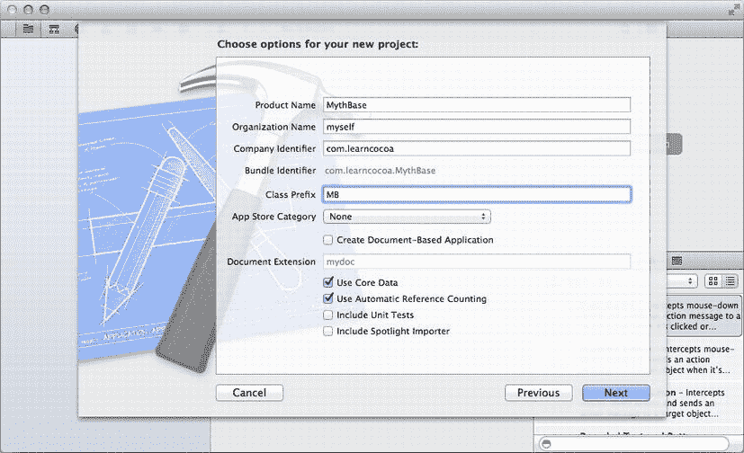
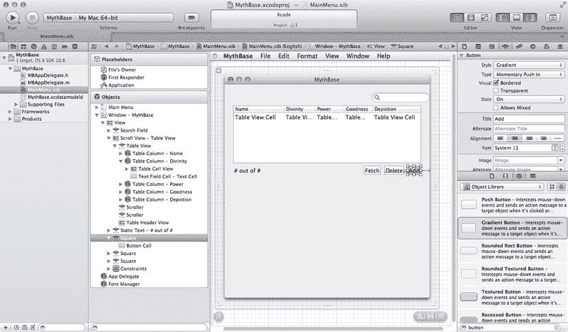
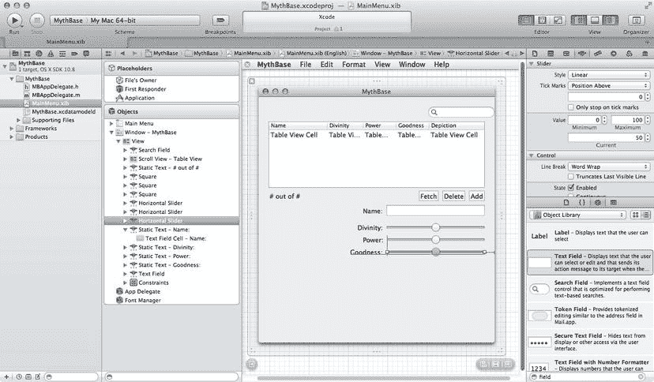
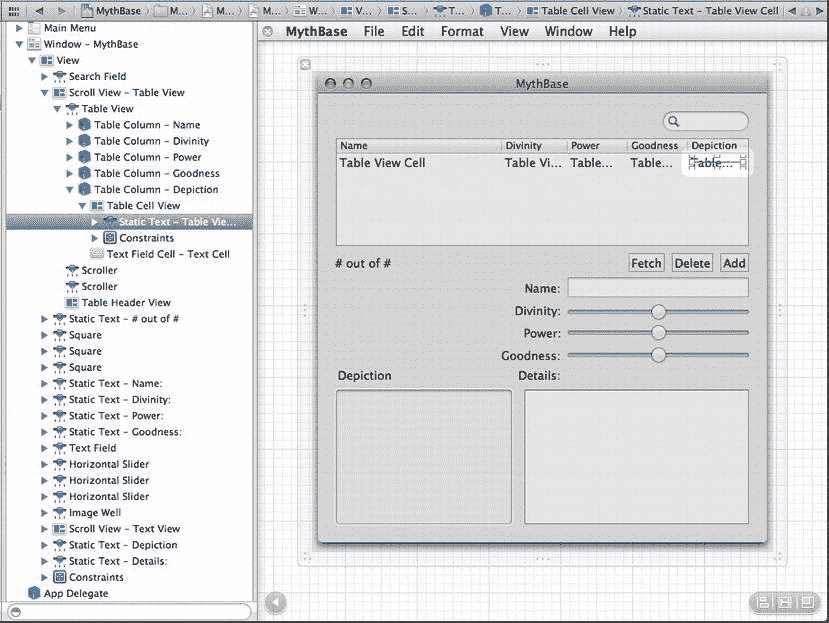

# 8. Core Data 基础

**摘要**

在前面的章节中，我们向你展示了 Cocoa 提供的各种在视图对象中显示数据的方式，从根据模型对象的内容手动获取和设置值，到使用 Cocoa 绑定让数据在模型和视图对象之间自动同步，从而省去了大量乏味的控制器代码。现在是时候了解 Core Data 了，这是一个强大的框架，为我们的模型对象提供了一套完整的内置功能。我们将首先讨论 Core Data 是什么，以及它如何与 Cocoa 的其他部分协同工作。

在前面的章节中，我们向你展示了 Cocoa 提供的各种在视图对象中显示数据的方式，从根据模型对象的内容手动获取和设置值，到使用 Cocoa 绑定让数据在模型和视图对象之间自动同步，从而省去了大量乏味的控制器代码。现在是时候了解 Core Data 了，这是一个强大的框架，为我们的模型对象提供了一套完整的内置功能。我们将首先讨论 Core Data 是什么，以及它如何与 Cocoa 的其他部分协同工作。然后，我们将使用 Core Data 创建一个名为 MythBase 的全功能数据库应用程序，包括一个允许我们创建、搜索、编辑和删除条目的 GUI，所有这一切都无需编写一行代码（参见图 8-1，MythBase 的实际运行截图）。接着，我们将探索在创建 Core Data 项目时自动生成的一些代码资源，最后演示如何向模型对象添加功能（即“业务逻辑”）。

## 我们遗漏了什么

前几章的所有示例中，我们都使用 `NSMutableDictionary` 的实例来代替真实的模型对象。所谓"真实模型对象"是什么意思呢？除了能够承载可通过字段名或键访问的数据（这点 `NSMutableDictionary` 已经做得足够好）之外，真实的模型对象还应包含以下特性：

图 8-1. 光彩夺目的 MythBase 应用

- **归档（Archiving）**：模型对象应具备内置的磁盘存储与重新加载机制。
- **业务逻辑（Business Logic）**：应能为模型对象提供针对输入值进行响应的自定义行为。
- **验证（Validation）**：每个模型对象应能自动验证输入值。

过去，遵循 MVC 原则的 Mac 应用开发者通常需要针对这些常见需求自行开发解决方案，但 Core Data 不仅提供了所有这些功能，还有更多。除了上述特性，Core Data 还提供了以下关键功能：

- **撤销/重做支持（Undo/Redo Support）**：Core Data 的值处理机制与 Mac OS X 的标准撤销功能相集成。将这一能力内置到模型类中，能省去我们自行实现这一通用功能的工作量。
- **与 Cocoa 绑定集成（Integration with Cocoa Bindings）**：结合 Cocoa 绑定，Core Data 通过通用控制器对象提供视图与模型的连接机制，从而消除大量繁琐的胶水代码。
- **持久化（Persistence）**：Core Data 提供了多种将对象持久化到磁盘的方式，使我们能够跨运行周期保存和加载对象状态。

综合来看，所有这些特性为应用核心提供了坚实的基础设施。我们可以使用 Core Data 构建 GUI 应用（无论是否使用 Cocoa 绑定）、命令行工具、游戏，或任何能够通过传统对象建模技术定义的软件系统。换言之，几乎适用于任何应用。

## 创建 MythBase

现在，让我们开始创建 MythBase——一个用于维护神话人物数据库的 GUI 应用。我们将使用 Core Data 实现模型层，并借助 Cocoa 绑定处理大部分控制器功能。在这个过程中会遇到一些新概念和术语，我们会逐一讲解。

在第一阶段，我们将使用 Xcode 中的特殊工具为应用定义模型，并利用 Xcode 的辅助工具创建简单 GUI。第二阶段，我们会优化 GUI 以提升用户体验。之后，在解释应用的其他方面后，我们将第三次推进功能开发，为应用模型层添加业务逻辑。

首先创建新应用项目。在 Xcode 中选择 **File ➤ New Project**，在窗口左侧选择 **OS X/Application**，从项目模板列表中选取 **Cocoa Application**，然后点击 **Next**。输入 `MythBase` 作为产品名称，`MB` 作为类前缀，勾选 **Use Core Data** 和 **Use Automatic Reference Counting** 复选框（见图 8-2），点击 **Next**。导航至合适目录保存项目，点击 **Create**。

图 8-2. 创建新应用项目并启用 Core Data 选项

### 定义模型

此时我们获得了一个全新的项目，与之前创建的项目类似。选择使用 Core Data 后，Xcode 会使用略微不同的项目模板，因此这个项目会包含一些旧项目中没有的元素。Xcode 导航面板中新增了名为 `MythBase.xcdatamodeld` 的文件，这是空的 Core Data 模型文件。模型文件包含应用模型层的元数据。我们通过 Xcode 内置的图形工具创建模型文件，应用在运行时读取该文件。如果深入项目导航区查看，还会发现 `CoreData.framework` 已被添加至 **Frameworks/Other Frameworks** 下。

#### 建模：是什么？

接下来，我们假设你对对象建模或数据库建模有一定了解。但如果你对此完全困惑，这里有一个非常简短的总结。其核心思想是：应用所处理的"内容"（即应用所涉及的数据）可以被分割成独立模块，并通过建模技术组织成合理结构。使用 Core Data 时，你需要按以下方式组织数据：

- **实体（Entities）**：实体用于描述应用中可唯一标识的"事物"，这些事物能独立存在、描述和识别。实体通常是系统中的主要"名词"。人、公司和货币交易都是实体。而眼睛颜色、市值和交易金额则不是。
- **属性（Attributes）**：任何描述实体特征且不涉及其他实体的内容，通常就是该实体的属性。眼睛颜色、市值和交易金额很可能是前面所述的人、公司和货币交易的属性。而某人的当前账户余额、公司 CEO 的电话号码、交易接收者的电子邮件地址则不属于我们提到的实体的属性——这些更适合通过遍历与其他实体的关系来访问对应属性。
- **关系（Relationships）**：使用关系建立实体间的连接。关系可以是一对多（一个人可能是多笔交易的接收者）、多对一（多人可受雇于同一家公司）、一对一（每人只能有一个配偶）或多对多（一家公司可以有多个客户，同时一个人也可以是多家公司的客户）。

模型文件包含的信息对任何进行过对象建模、数据库建模或实体-关系建模的人来说都不陌生。首先，实体的概念大致对应对象建模中的类或数据库建模中的表。每个实体由多个属性组成，实体间可通过关系连接。在 Xcode 和文档中，属性和关系统称为属性（properties），这与 Objective-C 2.0 中复用同一术语并非巧合。在模型对象中，每个属性和关系都可以通过同名 Objective-C 属性（property）访问。在为 MythBase 构建的模型中，我们将创建包含多个属性的单个实体。关系将在第 9 章中讨论。

#### 使用 Xcode 的模型编辑器

首先，在 Xcode 的导航面板中单击 `MythBase.xcdatamodeld` 文件。这会在 Xcode 内置的模型编辑器中打开该模型文件，编辑器列出了三个表视图：属性、关系和获取属性，左侧还包含一个实体、获取请求和配置的概要视图。同时按下 ⌥⌘3 打开数据模型检查器；由于我们尚未为实体定义任何结构，初始状态会显示“未选择”，如图 8-3 所示。模型编辑器有两种不同的视图样式：一种包含三个表视图的初始视图，另一种则类似于一张空白坐标纸。我们将使用图 8-3 中所示的默认表视图样式，因为我们只需要一个模型类。当处理复杂模型时，坐标纸视图非常有助于概览所有不同实体及其相互关系。

图 8-3. 创建任何实体之前的全新模型文件

#### 创建实体

对于 MythBase，我们将创建一个名为 `MythicalPerson` 的实体，并为其添加几个属性。首先，点击窗口底部附近的“添加实体”按钮来创建一个新实体。如您所料，这会在左侧的实体列表中创建一个名为“实体”的新实体。选中新实体后，其详细信息会显示在右侧的表视图中。将新实体的名称改为“MythicalPerson”，其余控件保持默认状态。我们的实体是一个名为 `NSManagedObject` 的类的实例，这是 Core Data 中包含的一个通用类，为 Core Data 的模型对象提供了所有基本功能。稍后我们需要为该实体编写一些代码，届时我们将创建 `NSManagedObject` 的自定义子类，不过现阶段使用这个通用类就足够了。

现在让我们创建实体。我们进行了一些对象建模，并确定了神话人物可能具备的几个特征。

`MythicalPerson` 实体将拥有六个属性。这些属性如表 8-1 所示，该表包含了每个属性的通用类型描述以及对应的 Core Data 存储类型。

**表 8-1. MythicalPerson 属性**

| 属性名称 | 通用类型 | Core Data 类型 |
| --- | --- | --- |
| name | 字符串 | String |
| details | 字符串 | String |
| divinity | 整数 (0-100) | Integer 16 |
| goodness | 整数 (0-100) | Integer 16 |
| power | 整数 (0-100) | Integer 16 |
| depiction | 图片 | Transformable |

Core Data 包含 `String` 和 `Date` 类型，以及一系列数值类型：`Integer 16`、`Integer 32`、`Integer 64`、`Float`、`Double`、`Decimal` 和 `Bool`。此外，它还包含一个 `Binary` 类型，允许通用存储我们希望附加到实体上的任何类型的数据（我们自行将其打包成二进制块），以及一个特殊的 `Transformable` 类型，允许将许多原本不支持的 Cocoa 类（例如 `NSImage`）与 Core Data 一起存储（稍后会详细介绍）。请注意，Core Data 存储类型与 Cocoa 中的值类（如 `NSString`、`NSNumber` 等）名称不同。当 Core Data 属性被读入正在运行的应用程序时，它们会被转换为最接近的 Cocoa 等价类型，这意味着，例如，所有数值类型在应用程序中都会变为 `NSNumber`，并在保存时转换回底层的存储格式。

#### 创建属性

让我们开始创建 `MythicalPerson` 的属性。在 Xcode 中打开 `MythBase.xcdatamodeld` 文件，点击选中 `MythicalPerson` 实体，然后点击窗口顶部“属性”表视图左下角的小 + 号。表视图中会出现一个新属性。将其名称设置为“name”，类型设置为 String，然后按回车键。

现在查看右侧检查器中的复选框，标记为“可选”、“瞬态”和“已索引”。默认情况下，“可选”被勾选，其他未勾选。“可选”的含义很清楚。勾选它意味着用户在创建或编辑对象时可以选择不为该属性输入值。至于其他选项，勾选“瞬态”会配置该属性不随其他数据一起保存（尽管 Core Data 仍会跟踪对该属性的更改以提供撤销/重做支持），而勾选“已索引”会为该属性启用索引，从而基于该属性实现对 Core Data 存储后端的高速搜索。对于 `name` 属性，请确保只勾选“已索引”，其他不勾选。

在复选框下方，您可以通过一个弹出列表指定属性的类型（这与表视图中的弹出菜单设置相同）。如果在主表视图中将“name”指定为 String，则会在其下方区域看到一些额外选项。在这里，我们可以指定简单的验证规则，例如字符串的长度。我们还可以指定默认值，该值会在创建新的 `MythicalPerson` 实例时出现。在默认值字段中输入“Name”，其他字段留空。

接下来，我们来处理 `details` 属性，它用于保存所述 `MythicalPerson` 的文本描述。点击“属性”表视图下方的 + 按钮添加一个新属性，并将新属性名称改为“details”。我们将以与 name 属性稍有不同的方式来配置它。它应该是一个 String（从弹出列表中选择），并且“已索引”复选框应被勾选，但在此情况下，“可选”复选框也应被勾选，以便用户可以根据需要选择将此字段留空。另外，我们将默认值留空。

现在我们来处理 `MythicalPerson` 的数值属性：`divinity`、`goodness` 和 `power`。创建一个新属性并命名为“divinity”，将其类型设置为 `Integer 16`，这是 Core Data 支持的最小的整数类型。这次配置复选框，使其为可选，但既不是瞬态也不是已索引（因为我们预计不需要通过神性值来搜索神话人物作为搜索参数）。显示界面会发生变化，显示一些适用于所选类型的额外配置。在这里，我们可以通过指定最小值和最大值来设置一些自动验证规则，也可以指定此属性的默认值。

在表 8-1 中，我们将神性定义为一个从 0 到 100 的整数值，其理念是将角色置于从凡人到神性之间的某个尺度上。例如，希腊神祇宙斯的神性值为 100，他的儿子赫拉克勒斯（其母亲阿尔克墨涅是普通凡人）为 50，而普通凡人（比如，再次以赫拉克勒斯的母亲为例）的神性值为 0。通过指定属性的最小值和最大值，我们可以让 Core Data 帮助我们确保无法保存这些属性的无效值。输入最小值 0，最大值 100，默认值 50。请参见图 8-4，以了解正在进行的实体/属性编辑过程。

图 8-4. 这是在 Core Data 模型文件中编辑实体的样子

#### 为 `goodness` 和 `power` 创建数值属性

接下来，我们要创建另外两个数值属性：`goodness` 和 `power`。这两个属性同样在 0 到 100 的范围内描述每个 `MythicalPerson` 的特征，并且其配置将与 `divinity` 完全相同（当然，属性名称不同）。创建它们并赋予相同选项的最简单方法是：在表格视图中点击 `divinity` 属性将其选中，然后复制（⌘C），再粘贴（⌘V）两次，从而得到两个名为“divinity1”和“divinity2”的新属性。将这两个属性重命名为“goodness”和“power”即可。这两个新属性将与原始属性拥有相同的最小值和最大值。

#### 不支持类型的属性

最后一个需要配置的属性是 `depiction`。如前所述，`depiction` 属性用于存储图像，而 Core Data 对 Cocoa 中通常使用的 `NSImage` 类一无所知。幸运的是，Core Data 的“可转换”（Transformable）类型提供了一种简单的方法来存储图像。创建一个新属性，将其命名为“depiction”，然后选择类型为“Transformable”。注意，检查器会发生变化，显示“可转换”类型的配置选项。在检查器中，选中“可选”复选框（并取消选中其他复选框）。“可转换”类型的配置选项非常简单：只有一个标记为“值转换器名称”的文本字段。不过，实际情况远不止表面所见。其思路是，“可转换”属性存储的是 Core Data 并不真正理解的一堆数据；当 Core Data 从存储中读取这堆数据时，会将其放入一个 `NSData` 对象（一个能够挂接任意旧数据块，并作为其 Objective-C“包装器”的对象）中，然后通过一个转换器（一种知道如何将一种对象转换为另一种对象的特殊类）进行处理。反过来，当要保存对象到存储时，Core Data 会获取新值并将其传递给同一个转换器，不过这次是进行反向转换。

在这种情况下，我们将使用一个名为 `NSKeyedUnarchiveFromData` 的转换器，它知道如何根据包含对象键归档版本的 `NSData` 对象来生成任意类型的对象。什么是键归档？这里我们不详细讨论，但基本上，键归档是一种以类似字典的格式归档或序列化对象所有实例变量的方式，使得以后可以重建该对象。这项技术以多种方式用于 Cocoa 中，并且所有 Cocoa 类都内置了此功能。这意味着我们可以获取一个 `NSImage` 或任何其他 Cocoa 类的实例，并使用 `NSKeyedUnarchiveFromData` 的反向转换将其塞入 `NSData` 对象中。此外，如果我们在自己的类中实现 `NSCoding` 协议，并以键归档的方式保存和加载其实例变量，我们也可以用同样的方式归档自己的对象。

回到 depiction 字段，思路是将转换器类的名称写入“值转换器名称”文本字段。事实证明，键归档非常普遍，以致于在 Xcode 建模工具中为属性指定转换器时，这会被用作默认值。如果我们将该字段留空，实体将配置为使用 `NSKeyedUnarchiveFromData` 来转换模型属性值，以便在存储时与 `NSData` 之间进行转换。

至此，我们已经为本章的 MythBase 应用定义了完整的模型，接下来我们将继续创建 GUI。

## 设计 GUI

由于我们已经使用 Interface Builder 设计过几个用户界面，因此我们将快速过一下基础知识，并且不会为每个检查器提供键盘快捷键。这个应用将与第 6 章中的 VillainTracker 应用类似。我们的用户界面将允许用户搜索神话人物数据库，添加和删除它们，并更改它们的特征。此外，我们将使用 Cocoa 绑定来建立连接。

### 自动生成 GUI

Xcode 3 包含一个名为“Core Data 实体界面助手”的功能，用于根据 Core Data 模型自动布局一个具有基本 CRUD（增删改查）功能的 GUI。此功能在 Xcode 4 中被移除，因此我们必须手动完成。事实证明，这非常简单，并且过程应该会让你感到熟悉，就像完成了之前的章节一样。不仅如此，Xcode 生成的 UI 通常也需要大量清理工作。

### 创建 MythBase 显示界面

首先，在 Xcode 中单击 `MainMenu.xib` 文件。在左侧的对象停靠区中，打开名为“Window - MythBase”的主窗口。我们将拖出一个表格视图和一组字段，以便创建和编辑数据库中管理的虚构人物的属性，因此我们先把窗口拉高一些。将其拖拽至 500 像素高。接下来，在对象库中，在检查器底部的搜索字段中输入“search”。对象库应显示一个对象：搜索字段。将搜索字段从对象库拖出，放到 MythBase 主窗口的右上角，让蓝色参考线指示放置位置。接着，在对象库搜索字段中输入“table”。将一个表格视图拖拽到 MythBase 窗口，使其与窗口左边缘对齐。将其拉伸至填满窗口宽度，直到与右侧的蓝色垂直参考线相接。将表格视图放置在搜索字段下方；它会自动对齐到搜索字段下方几个像素的位置。

打开属性检查器，将表格视图的“内容模式”设置为“基于视图”。将“列宽调整”设置为“仅第一列”。在“内容模式”下方，将表格视图设置为五列。将表格视图设置为五列时，你可能会注意到表格视图下方闪现出一个水平滚动条。新增的列会超出表格视图的右侧，因此请单击第二列并将其调整得窄一些，直到所有五列都可见，如图 8-5 所示。

图 8-5.

为 MythBase 布局表格视图

该表格视图将显示我们为 `MythicalPerson` 实体定义的所有属性（`details` 除外），因此我们需要在列标题中设置标签。在表格视图中，单击第一列的标题，直到它变成可编辑的文本字段。在文本字段中输入“Name”以设置列标题。单击下一列，将其名称设置为“Divinity”。将接下来三列的标题分别设置为“Power”、“Goodness”和“Depiction”。

接下来，我们将设置一个指示器，用于显示搜索时找到的结果数量。在对象库搜索字段中输入“Label”，将一个标签字段拖拽到窗口左侧，位于表格视图下方。与往常一样，蓝色参考线会指示放置位置。将标签标题设置为“# out of #”，并调整其大小以使所有文本可见。

下一组控件将是用于搜索、添加和删除记录的按钮。在对象库搜索字段中输入“Button”。Cocoa 提供了多种按钮样式，因此我们会有丰富的选择。对于这个应用，我们使用渐变按钮。拖出一个按钮，将其放置在表格视图下方，并与上一步中的文本字段对齐。将其标题设置为“Fetch”。再拖出两个按钮，将它们放置在 Fetch 按钮的右侧。将这些新按钮的标题分别设置为“Delete”和“Add”。设置好标题后，将它们放置在表格视图下方，并与窗口右侧边缘对齐。布局应与图 8-6 一致。

图 8-6.

添加结果计数器和按钮

### 显示详细信息

现在，我们需要布局控件以显示所选虚构人物的详细信息。我们的 Core Data 实体的属性包括 `name`、`divinity`、`power`、`goodness`、`depiction` 和 `details`，这就是我们的用户界面将展示的内容。首先，找到并拖出一个标签，放置在按钮下方并靠近窗口中心线。双击它，将其标题设置为“Name:”。在对象库中，找到并拖出一个文本字段（在搜索字段中输入“field”），放在“Name:”标签旁边。将其拉伸至窗口宽度的大约三分之一，即 200 像素左右。将其拖到按钮下方，并与屏幕右侧边缘对齐。蓝色参考线会指示如何对齐。将“Name:”标签拖到文本字段左侧，使其自动对齐。

单击该标签一次以选中它，按 ⌘C 复制，然后按 ⌘V 在其下方粘贴一个新标签。粘贴的标签会出现在第一个标签的下方和右侧。将其拖到第一个标签的正下方；它会自动对齐到第一个标签下方适当的距离。再重复两次此操作，使第一个标签下方并排出现三个标签。选中全部四个标签，然后选择“编辑器” ➤ “对齐” ➤ “右边缘”（⌘]）。最后，将这些标签的标题分别设置为“Divinity:”、“Power:”和“Goodness:”。标签应自动调整大小以显示完整标题，但保持右边缘对齐。

`divinity`、`power` 和 `goodness` 属性都是数值型，因此我们将使用滑块来设置它们。在对象库中搜索“slider”，然后将一个水平滑块拖到“Divinity:”标签旁边，并位于 Name 的文本字段下方。将其拉伸至与文本字段相同的宽度。像往常一样，蓝色参考线会指示方向。在属性检查器中，确保滑块的最小值为 0，最大值为 100，默认值为 50，与我们之前在 Mythical Person Core Data 实体上创建的 `divinity` 属性一致。同时，勾选属性检查器中的“连续”复选框。像处理标签一样，选中此滑块并按 ⌘C 复制，然后按 ⌘V 在其下方粘贴一个新滑块。重新调整新滑块的位置，使其与 Divinity 滑块对齐，并与“Power:”标签对齐。再次按 ⌘V 粘贴另一个滑块，将其放置在前两个滑块下方，并与“Goodness:”标签对齐。窗口应如图 8-7 所示。

图 8-7.

添加控件以管理神话详细信息

尚未有显示控件的两个属性是 `depiction` 和 `details`。我们将使用图像框和文本框来处理它们。在对象库的搜索字段中输入“image”，然后将一个图像框拖到屏幕左下角，并让其紧贴角落的蓝色参考线。将其大小调整为 150 像素高、200 像素宽。在属性检查器中，将图像框设置为可编辑。这将允许用户将图像拖入图像框。

接下来，在对象库的搜索字段中输入“text”，然后将一个文本视图拖到右下角。将其大小调整为高 150 像素、宽 250 像素，这个宽度应足以在窗口边缘和图像框之间填充，并留出视觉上舒适的间隙。当您接近正确位置时，应该会看到蓝色参考线，并且文本视图会自动对齐。我们需要对其属性做一项重要更改。`NSTextView`默认能够显示富文本，这是一个很棒的功能，但也是有代价的：在 Cocoa 中，富文本由 `NSAttributedString` 的实例表示，该类比 `NSString` 复杂得多，不是我们现在想深入讨论的内容。为了让文本视图能够将其显示值绑定到一个普通的旧字符串，我们必须关闭富文本处理。因此，在属性检查器中，单击关闭富文本复选框（如果您没有看到它，可能您选中了文本视图的父视图，即 `NSScrollView`。再单击一次文本视图以选中内部的 `NSTextView`）。您还可以将查找设置更改为“使用栏”，并勾选“增量搜索”，以便文本搜索利用 OS X 10.7 中引入的查找栏功能。

这些控件需要标签，因此在对象库搜索字段中输入“label”，然后将一个标签拖到图像框上方，与图像框的左边缘对齐。将其文本更改为“图像”。再拖出另一个标签放在文本视图上方，并将其标题设置为“详情。”将“详情”标签对齐，使其右边缘与滑块标签对齐。

最后要做的是配置表格视图的列。五列中有四列将显示文本或数字，因此默认配置就可以了。然而，对于“图像”列，我们希望显示一张图片，因此需要将当前在该列中的 `NSTextField` 替换为一个图像框。通过左侧的对象停靠区，选择“图像”列表格视图单元格中包含的“静态文本”对象，如图 8-8 所示。选中后，按 Delete 键将其删除。在对象库的搜索字段中输入“image”，然后将一个图像框拖到表格视图的“图像”列中空的表格单元格视图中。该图像框会被裁剪到表格单元格视图的高度，因此将表格视图单元格的高度扩大到 48 像素，足够显示整个图像。

图 8-8.

在对象停靠区中选择“图像”文本字段

至此，GUI 布局就完成了。它很美，不是吗？现在我们需要将其连接到一个数据源以填充内容。我们将使用前一章讨论过的 Cocoa 绑定来完成这项工作。

