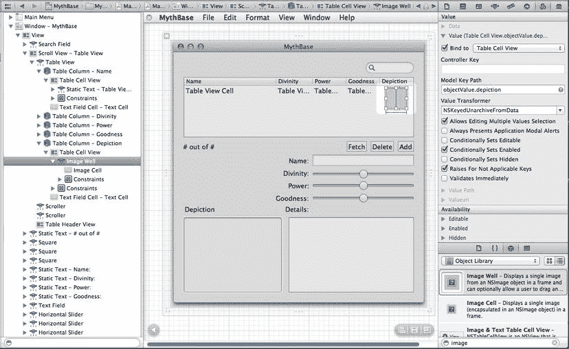
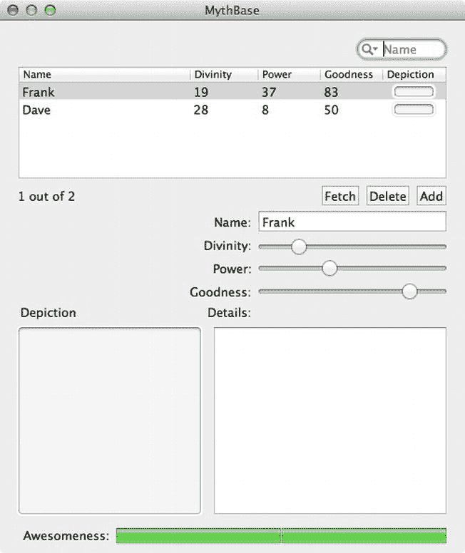
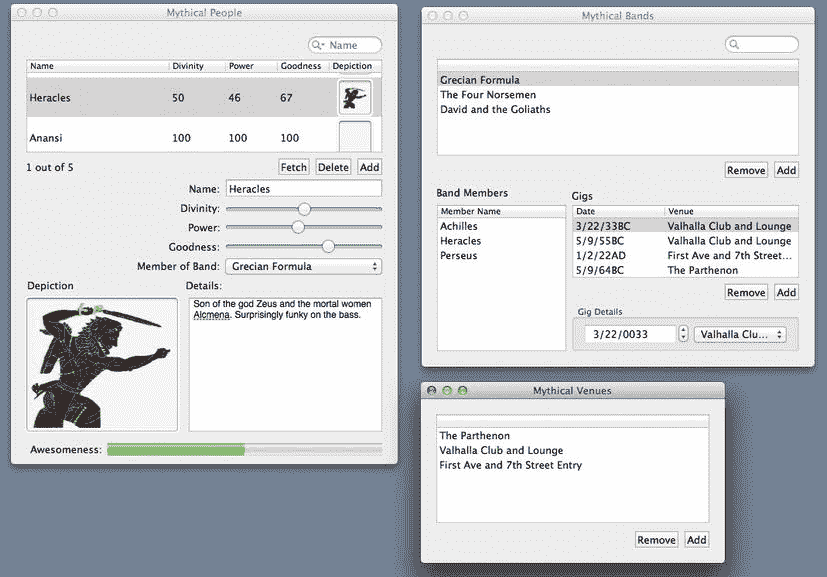
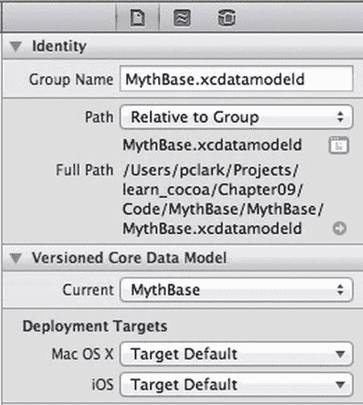
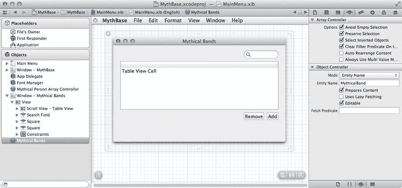

# 设置 Cocoa 绑定

当我们告诉 Xcode 我们想创建一个 Core Data 应用程序时，它生成了一个应用程序委托类（名为 `MBAppDelegate`），该类包含了对使用 Core Data 的特殊支持。这种支持的一部分是生成的 `MBAppDelegate` 类现在有一个 `managedObjectContext` 属性。托管对象上下文是一个对象，它允许数组控制器（或者，就此而言，您自己的代码）通过 Core Data 接入模型对象（`NSManagedObject` 或子类的实例）的源。稍后当我们检查创建此项目时自动生成的控制器代码时，我们将看到应用控制器如何提供这个属性。就像前一章一样，我们将使用一个 `NSArrayController` 来管理数据，但这里创建的 `NSArrayController` 将通过 Core Data 访问数据，而不是通过 `NSMutableDictionary`。并且正如我们在上一章中所做的那样，我们将使用 Cocoa 绑定将其连接到用户界面。

### 使用数组控制器进行绑定

首先，我们需要在应用中获取一个数组控制器。在对象库的搜索字段中搜索“array”。结果应该会显示一个数组控制器。将其中的一个拖到 Interface Builder 画布上；它会被放到编辑器窗格的任何位置。无论我们把它放在哪里，它都会出现在 Interface Builder 画布左侧的对象停靠区中。在对象停靠区中选择它，并将其重命名为“Mythical Person Array Controller”。打开属性检查器，并将其模式从“类”更改为“实体名称”。输入实体名称为“MythicalPerson”，这与我们在模型编辑器中使用的名称相同。最后，勾选“预置内容”复选框。这将触发数组控制器在应用启动时加载数据。

现在，我们将把数组控制器链接到 `managedObjectContext`。在对象停靠区中仍选中数组控制器的情况下，选中绑定检查器。展开“参数”部分，然后从弹出列表中选择“App Delegate”。之后，勾选弹出列表旁边的“绑定到”复选框。接下来，在“模型键路径”字段中输入“managedObjectContext”。这将数组控制器连接到应用委托中的 Core Data 管道。

既然我们已经连接好了数组控制器，我们需要开始设置 UI 控件的绑定。我们将从基本控件（文本字段和滑块）开始，然后处理更复杂的控件（图像和表格视图），最后通过连接按钮来完成。

第一个绑定将是名称文本字段的。选中名称文本框，然后打开绑定检查器。展开“值”部分，勾选“绑定到”复选框，然后从下拉菜单中选择“Mythical Person Array Controller”。确保“控制器键”框中显示“selection”，并在“模型键路径”字段中输入“name”，如图 8-9 所示。这将文本字段连接到数组控制器选定对象的 name 属性。


图 8-9.

用于将名称文本字段连接到 Mythical Person Array Controller 的绑定检查器

为滑块设置绑定将是类似的；我们将建立一个到 Mythical Person Array Controller 的 selection 的绑定，并根据控件的适当属性使用不同的模型键路径。对于这三个滑块中的每一个，这将是我们在模型文件中创建的 `divinity`、`power` 和 `goodness` 属性。要进行这些绑定，选中“神性”滑块并查看绑定检查器。展开“值”部分，勾选“绑定到”复选框，然后从下拉菜单中选择“Mythical Person Array Controller”。确保“控制器键”框中显示“selection”，并在“模型键路径”字段中输入“divinity”。对“威力”和“善良”滑块重复此操作，并相应更改模型键路径。

为“图像”和“详情”区域设置绑定会稍微复杂一些。我们先处理“详情”。选中文本视图（请记住，文本视图嵌入在 `NSScrollView` 中；您需要点击穿过滚动视图才能到达文本视图本身）。在绑定检查器中，与名称文本框和滑块相比，有不同的选择。然而，仍然有一个“值”部分，这正是我们要使用的。展开“值”部分，勾选“绑定到”复选框，并使用“details”作为模型键路径。


好的，作为一名高级文档工程师和翻译员，我将严格遵循您的注意事项和示例格式，将给定的英文文本翻译成中文。


对于“描绘”字段，我们需要获取一个 `NSImage` 供图片井显示。Core Data 并不知道 `NSImage`，但这不成问题。还记得之前关于转换器和 Core Data 使用的可转换类型的讨论吗？因为“描绘”是一个可转换属性，它的值需要在我们在 GUI 中看到的内容（一个 `NSImage`）和 Core Data 能够存储的内容（`NSData`）之间进行转换。我们将通过向此控件的 Cocoa 绑定配置添加 `NSKeyedUnarchiveFromData` 来实现这一点。选中图片井，并打开绑定检查器。与其他字段一样，展开“值”部分。勾选“绑定到”复选框，确保“控制器键”显示为“selection”，并将“模型键路径”设置为“depiction”。要完成从 `NSData` 到 `NSImage` 的转换，请点击“值转换器”弹出列表，然后选择 `NSKeyedUnarchiveFromData`。

## 为表格视图配置绑定

现在是时候为表格视图进行绑定了。为基于视图的表格视图设置 Cocoa 绑定是一个两步过程。首先，我们必须为表格视图本身设置一个绑定。接下来，我们将为行中的每个视图设置绑定。表格视图通过一些魔法来为其子视图公开一个绑定源，该绑定源名为“Table Cell View”。在该绑定中，有一个模型键路径“objectValue”，它代表该行的对象。

开始，选中表格视图本身。最简单的方法是从左侧的对象停靠区中选择。在绑定检查器中，展开“内容”部分，勾选“绑定到”复选框，确保下拉菜单显示“Mythical Person Array Controller”，并且“控制器键”显示“arrangedObjects”。对于表格视图本身，我们没有“模型键路径”设置。我们还希望表格视图中选中的行能够传回数组控制器。为此，展开绑定检查器的“选择索引”部分。在此处勾选“绑定到”复选框，将下拉菜单设置为“Mythical Person Array Controller”，并将“控制器键”设置为“selectionIndexes”。您的绑定应该像图 8-10 所示。


图 8-10. 为表格视图设置绑定

表格中有五列：名称、神性、力量、善良和描绘。我们不直接在列上设置绑定；相反，我们将为每列中包含的视图设置绑定。对于前四列，视图是包含在 `NSTableCellView` 内的 `NSTextField`。对于描绘列，视图是包含在 `NSTableCellView` 内的 `NSImageWell`。不幸的是，Xcode 将 `NSTableCellView` 中包含的文本字段的默认值设置为“Table View Cell”，这似乎是为了制造混乱而设计的。尽管有默认文本，但表格视图中的视图是 `NSTableCellView` 的实例。文本字段和图片井将绑定到表格单元格视图的 objectValue 属性。

我们从名称列开始。选中名称列中的“Table View Cell”，如果您在 UI 本身中单击，可能需要单击两次，或者通过展开左侧对象停靠区中的“Table Column - Name”条目并深入到其中的“Static Text - Table View Cell”条目来选择。在绑定检查器中，展开“值”部分。勾选“绑定到”复选框，确保下拉菜单显示“Table Cell View”，并将“模型键路径”设置为“objectValue.name”。“控制器键”应为空。

神性、力量和善良的绑定将类似。依次选中每一列，并深入到其中的“Static Text”字段。像我们为名称列所做的那样设置值绑定：打开“值”部分，勾选“绑定到”复选框，确保下拉菜单显示“Table Cell View”，并根据需要将“模型键路径”设置为“objectValue.divinity”、“objectValue.power”或“objectValue.goodness”。

现在来处理描绘列。选中描绘列中“Table Cell View”内的图片井。在绑定检查器中，打开“值”部分。和之前一样，勾选“绑定到”复选框，确保下拉菜单显示“Table Cell View”。将“模型键路径”设置为“objectValue.depiction”。就像我们上面处理描绘视图那样，点击“值转换器”弹出列表，选择 `NSKeyedUnarchiveFromData`，如图 8-11 所示。表格视图设置完毕！



图 8-11. 为描绘列设置绑定

对于表格视图下方和左侧显示匹配数量的文本字段，我们将使用一种不同的绑定方法，该方法允许我们使用格式字符串来构建文本字段的内容。在这种情况下，我们将使用“显示模式值 1”而不是“值”。展开“显示模式值 1”部分，勾选“绑定到”复选框，并像之前一样将下拉菜单设置为“Mythical Person Array Controller”。输入“selection”作为“控制器键”。这次，我们将使用一个不同的键路径。将“模型键路径”设置为“@count”，并将“显示模式”设置为“%{value1}@ out of %{value2}@。”现在，在“显示模式值 1”下方出现了另一个可用的绑定，标题为“显示模式值 2”。展开“显示模式值 2”部分，勾选“绑定到”复选框，并像之前一样将下拉菜单设置为“Mythical Person Array Controller”。这次，输入“@count”作为“模型键路径”，并输入“arrangedObjects”作为“控制器键”，而不是“selection”。“显示模式”将自动填充我们在“显示模式值 1”绑定中输入的值。

现在，我们需要连接“获取”、“删除”和“添加”按钮。为此，我们将结合使用目标-动作连接来响应单击，以及使用 Cocoa 绑定来根据需要启用或禁用按钮。让我们从目标-动作连接开始。选中“获取”按钮，并按住 Control 键拖出一条连接到“Mythical Person Array Controller”。数组控制器将位于对象停靠区中对象列表的底部；如果您看不到它，请将鼠标悬停在对象停靠区的底部，它会向下滚动以显示数组控制器。选择 `fetch:` 动作。对“删除”和“添加”按钮执行相同操作，分别选择 `remove:` 和 `add:` 动作。

接下来，我们将为“添加”和“删除”按钮的“已启用”属性建立绑定。选中“添加”按钮并打开绑定检查器。展开“可用性”下显示的“已启用”部分。你能猜到下一步是什么吗？没错；勾选“绑定到”复选框，确保下拉菜单显示“Mythical Person Array Controller”。不过这一次，将“控制器键”字段更改为“canAdd”。当您开始在“控制器键”字段中键入时，将出现一个可能履行的列表。对“删除”按钮执行相同操作，将“控制器键”更改为“canRemove”。

我们已经构建了足够多的 UI，在继续之前应该测试一下。让我们试试看。保存 nib 文件，然后点击“运行”。您应该可以点击“添加”按钮并在表格视图中得到空行。您还应该可以编辑名称和移动滑块，并且这些更改会反映在表格视图的当前选中行中。如果不是这样，请检查 nib 文件中的绑定和连接，看它们是否与说明匹配。


### 完成绑定：保存与搜索

我们的应用应该能够处理多条记录，并允许创建和删除神话人物。但目前无法保存或搜索，这使其成为一个相当糟糕的数据库。现在就来解决这个问题。

保存很简单。由 `Xcode` 生成的**应用程序委托类**替我们管理保存操作；我们只需告诉它何时执行即可。在主菜单中，有一个“文件”菜单，其中包含“保存”菜单项。“保存”菜单项已预先绑定到 `⌘S` 快捷键。我们也将在此应用中使用它。在 Interface Builder 的**对象停靠区**中，展开“主菜单”对象，然后展开“文件”菜单，再展开“菜单项 – 保存”项。请注意，我们讨论的是对象停靠区中的对象，而不是 `Xcode` 自身的菜单！按住 Control 键从该对象拖出一条连接线，连接到对象停靠区中的“App 委托”，然后从列表中选择 `saveAction` `:` 操作。搞定！

搜索就不那么直接了，首先需要了解一些术语。Core Data 的搜索支持基于**谓词**。一个谓词由属性名称、运算符和搜索值组成；一个搜索字段可以支持多个谓词。谓词的两个例子是 `name contains Heracles` 或 `goodness greater than 75`。如果你熟悉 SQL，SQL 命令中的 `WHERE` 子句就是由谓词构成的。对于 `MythBase` 来说，`MythicalPerson` 实体的所有属性除了“描绘”字段外都应可搜索，因此我们需要定义多个谓词。我们不能搜索“描绘”字段，因为二进制属性和可转换属性本质上不可搜索。谓词可以在**绑定检查器**中定义，这也是我们接下来要操作的地方。

我们将从定义一个搜索 `name` 属性的谓词开始。选择屏幕右上角的搜索字段，打开绑定检查器。在绑定检查器的底部附近有一个名为“谓词”的部分。展开它，勾选“绑定到”复选框，将其绑定到“Mythical Person Array Controller”。控制器键应设置为“`filterPredicate`”。将显示名称设置为“名称”，谓词格式设置为“`name contains[c] $value`”，其中 `$value` 表示搜索框的内容，`name` 表示要搜索的 `MythicalPerson` 实体属性。运算符 `contains[c]` 表示我们希望返回 `name` 属性包含 `$value` 所表示值的所有记录，并采用**不区分大小写**的搜索——这就是末尾 `[c]` 的含义。如果没有 `[c]`，搜索将区分大小写。

请注意，已经创建了一个名为 `Predicate2` 的新绑定。我们将使用它来定义一个谓词，以搜索实体中所有可搜索的字段。展开 `Predicate2`，与第一个一样，勾选“绑定到”复选框，绑定到“Mythical Person Array Controller”。控制器键应设置为“`filterPredicate`”。对于 `Predicate2`，将显示名称设置为“全部”，谓词格式设置为以下较长的一串：“`(name contains $value) or (divinity.description contains $value) or (power.description contains $value) or (goodness.description contains $value) or (details contains[c] $value)`”。请注意，现在又多了一个名为 `Predicate3` 的新绑定可用。

我们已经展示了如何搜索单个或多个属性。如果你希望能够搜索其他特定字段，例如 `name` 或 `details`，只需按照上述相同模式添加更多谓词，并适当更改谓词格式值中的字段名称即可。构建搜索谓词的可能性远超我们在此讨论的内容，苹果在 Xcode 文档中提供了“谓词编程指南”部分，对其进行了详细说明。

好了，完成所有这些设置后，是时候运行应用了。按下 Xcode 窗口左上角的“运行”按钮，你应该能够创建一些神话人物记录，将图像拖入大的图像框以显示图片，使用“文件 ➤ 保存”菜单项保存记录，并搜索数据库。搜索字段左侧的问号图标应允许你选择哪个搜索谓词生效。当你退出并重新运行应用时，记录应被保留并在启动时重新加载。

现在，我们仅通过定义模型和构建 GUI 就制作了一个非常酷的应用。值得注意的是，我们**没有编写任何代码**！这是 Cocoa 一直支持的可视化编程模式的一个绝佳示例，并且随着过去几年 Cocoa 绑定和 Core Data 的加入，这种模式变得更加完善。当然，所有这些功能背后，是使得在 Xcode 中实现这些“魔法”成为可能的框架和 API，并且有时你会希望或需要从代码中访问 Core Data 的功能。本章的其余部分将介绍使用 Core Data 进行编程（传统意义上的基于代码）的一些方面，首先从浏览应用程序委托类中生成的代码开始。

## 探索模板代码

当我们创建 `MythBase` 项目时，系统自动为我们生成了一个名为 `MBAppDelegate` 的应用程序委托类。这个类包含从应用内的 Core Data 模型文件中加载模型信息的代码。它还会打开 Core Data 读取和写入模型对象的磁盘存储，如果该存储尚不存在，则会创建它。最后，它通过一个 `NSManagedObjectContext` 提供对数据存储的访问，其他对象可以绑定到该上下文（例如我们的 nib 文件中的数组控制器），以便从存储中读取数据和向其写入数据。

此处显示的所有代码均已重新格式化，以便更好地适应本书的排版格式，因此你的版本可能看起来略有不同，但在语法上应该是相同的。


### App Delegate 接口

我们直接来看头文件 `MBAppDelegate.h`，如下所示。这是 Xcode 4.5 在 Mountain Lion 系统上自动生成的代码。不同版本的 Xcode 生成的代码可能略有不同，如果你愿意，也可以修改代码以匹配此处显示的版本：

```
#import <Cocoa/Cocoa.h>

@interface MBAppDelegate : NSObject <NSApplicationDelegate>

@property (assign) IBOutlet NSWindow *window;

@property (readonly, strong, nonatomic) NSPersistentStoreCoordinator *persistentStoreCoordinator;

@property (readonly, strong, nonatomic) NSManagedObjectModel *managedObjectModel;

@property (readonly, strong, nonatomic) NSManagedObjectContext *managedObjectContext;

- (IBAction)saveAction:(id)sender;

@end
```

这段代码声明了一个包含四个属性和一个方法的简单类。`window` 变量在其属性声明中还带有 `IBOutlet`，使其成为可在 Interface Builder 中连接窗口的出口。另外三个属性是一些重要的 Core Data 类的实例：

- `NSPersistentStoreCoordinator` 负责管理后端存储，提供对一个或多个 `NSPersistentStore` 实例的访问，每个实例代表一个存储位置（在文件中或内存中）。协调器的目的是让应用程序像访问一个持久存储那样访问多个持久存储。有些应用程序可能希望利用这一点将应用程序数据分区到多个存储中。例如，你可能希望区分普通实体（其对象保存到磁盘）和临时实体（其对象仅保存在内存中，用户退出应用时消失）。即使不保存到磁盘，临时对象仍将受益于 Core Data 的其他功能（简单的撤销支持、与 Cocoa 绑定的集成等）。

- `NSManagedObjectModel` 从一个或多个模型文件（通常包含在应用程序包中）加载实体及其属性的信息，并作为包含应用程序托管对象结构的元数据仓库。许多应用程序永远不需要直接与它交互。

- `NSManagedObjectContext` 负责处理所有托管对象（我们通过 Core Data 存储的模型对象）的生命周期。它通过 `NSPersistentStoreCoordinator` 访问对象本身，并提供用于创建、读取、更新和删除对象的高级功能。大多数应用程序都会在某个时候使用 `NSManagedObjectContext` 来创建对象、保存更改等。

在查看实现文件时，我们将看到每个对象是如何使用的。头文件中的最后一个声明是 `saveAction:` 方法，当用户在 MythBase 菜单中选择“文件 ➤ 保存”时会调用该方法。我们将在下一节中了解它的工作原理。

### App Delegate 实现

现在让我们切换到 `MythBase_AppDelegate.m`，看看它做了什么。除了实现接口中声明的 `saveAction:` 方法外，它还需要确保为其声明的属性实现适当的访问器。这包括 `window` 的 getter 和 setter，以及其他属性（声明为只读）的 getter。与头文件一样，此代码是使用 Xcode 4.5 在 Mountain Lion 上自动生成的。如果你使用其他版本，可能会看到略有不同的代码。

#### `applicationSupportDirectory` 方法

文件开头如下：

```
#import "MBAppDelegate.h"

@implementation MBAppDelegate

@synthesize persistentStoreCoordinator = _persistentStoreCoordinator;
@synthesize managedObjectModel = _managedObjectModel;
@synthesize managedObjectContext = _managedObjectContext;

- (void)applicationDidFinishLaunching:(NSNotification *)aNotification
{
    // 在此处插入代码以初始化您的应用程序
}

// 返回应用程序用于存储 Core Data 存储文件的目录。此代码在用户的 Application Support 目录中使用名为 "com.learncocoa.MythBase" 的目录。
- (NSURL *)applicationFilesDirectory
{
    NSFileManager *fileManager = [NSFileManager defaultManager];
    NSURL *appSupportURL = [[fileManager URLsForDirectory:NSApplicationSupportDirectory inDomains:NSUserDomainMask] lastObject];
    return [appSupportURL URLByAppendingPathComponent:@"com.learncocoa.MythBase"];
}
```

类的实现中首先展示了一些 `@synthesize` 指令，它们负责处理头文件中声明的属性的 getter 和 setter。接下来是 `applicationDidFinishLaunching:` 方法的存根，我们之前见过，这是任何应用程序委托类的标准实现。之后是 `applicationFilesDirectory` 方法的实现，它返回一个 `NSURL`，其中包含应用程序可保存数据的目录名称（在我们的例子中，是 Core Data 应保存其持久存储的位置）。通常，此方法返回 Application Support 目录子目录的完整路径，该子目录位于用户主目录的 Library 目录中（`/Users/somebody/Library/Application Support/MythBase`）。

`applicationFilesDirectory:` 方法是一个“辅助”方法，在类的实现中其他地方调用。请注意，此方法既未在头文件中声明，也未在私有类别或类似结构中声明。在 Objective-C 的实现块中，代码可以调用同一实现块中较早出现的任何方法，即使它们未在任何地方声明。当你想要重构代码，将某些功能提取到自己的方法中，但又不需要在当前类实现之外访问它时，这有时是一个方便的快捷方式。


### `managedObjectModel` 访问器方法

接下来是 `managedObjectModel` 方法。该方法作为 `managedObjectModel` 属性的 getter。

```
// Creates if necessary and returns the managed object model for the application.
- (NSManagedObjectModel *)managedObjectModel
{
    if (_managedObjectModel) {
        return _managedObjectModel;
    }
    NSURL *modelURL = [[NSBundle mainBundle] URLForResource:@"MythBase" withExtension:@"momd"];
    _managedObjectModel = [[NSManagedObjectModel alloc] initWithContentsOfURL:modelURL];
    return _managedObjectModel;
}
```

该方法会检查 `managedObjectModel` 是否已被创建。如果已创建，则直接返回；否则，通过读取应用程序包中的 `MythBase.momd` 资源文件来创建它。该文件由 Xcode 根据我们在本章开头创建的模型文件生成。`managedObjectModel:` 方法可被任何需要访问模型元数据的代码片段调用。特别地，在创建 `NSPersistentStoreCoordinator` 时会调用它，因为该协调器需要读取或为我们的模型创建存储，因此需要了解详细的模型信息。

### 使用 `NSError` 进行错误处理

此处展示的部分代码使用了 `NSError` 对象来处理可能发生的错误。我们尚未涵盖 `NSError`，因此在此简要说明。

`NSError` 的基本思想是：某些方法需要能够向调用者告知可能发生的错误，而不使用返回值作为此用途。要实现这一点，你传入一个指向 `NSError` 指针的指针（用 C 语言的术语有时称为“句柄”），这样方法可以创建一个 `NSError` 对象并让指针指向它，大致如下：

```
NSError *error = nil;
[someObject doSomething:&error];
if (error) {
  // handle the error somehow!
}
```

关于 `NSError` 的更多细节，请参阅第 14 章。

### `persistentStoreCoordinator` 访问器方法

接下来是相当长的 `persistentStoreCoordinator` 方法：

```
// Returns the persistent store coordinator for the application. This implementation creates and returns a coordinator, having added the store for the application to it. (The directory for the store is created, if necessary.)
- (NSPersistentStoreCoordinator *)persistentStoreCoordinator
{
if (_persistentStoreCoordinator) {
return _persistentStoreCoordinator;
}
NSManagedObjectModel *mom = [self managedObjectModel];
if (!mom) {
NSLog(@"%@:%@ No model to generate a store from", [self class], NSStringFromSelector(_cmd));
return nil;
}
NSFileManager *fileManager = [NSFileManager defaultManager];
NSURL *applicationFilesDirectory = [self applicationFilesDirectory];
NSError *error = nil;
NSDictionary *properties = [applicationFilesDirectory resourceValuesForKeys:@[NSURLIsDirectoryKey] error:&error];
if (!properties) {
BOOL ok = NO;
if ([error code] == NSFileReadNoSuchFileError) {
ok = [fileManager createDirectoryAtPath:[applicationFilesDirectory path] withIntermediateDirectories:YES attributes:nil error:&error];
}
if (!ok) {
[[NSApplication sharedApplication] presentError:error];
return nil;
}
} else {
if (![properties[NSURLIsDirectoryKey] boolValue]) {
// Customize and localize this error.
NSString *failureDescription = [NSString stringWithFormat:@"Expected a folder to store application data, found a file (%@).", [applicationFilesDirectory path]];
NSMutableDictionary *dict = [NSMutableDictionary dictionary];
[dict setValue:failureDescription forKey:NSLocalizedDescriptionKey];
error = [NSError errorWithDomain:@"YOUR_ERROR_DOMAIN" code:101 userInfo:dict];
[[NSApplication sharedApplication] presentError:error];
return nil;
}
}
NSURL *url = [applicationFilesDirectory URLByAppendingPathComponent:@"MythBase.storedata"];
NSPersistentStoreCoordinator *coordinator = [[NSPersistentStoreCoordinator alloc] initWithManagedObjectModel:mom];
if (![coordinator addPersistentStoreWithType:NSXMLStoreType configuration:nil URL:url options:nil error:&error]) {
[[NSApplication sharedApplication] presentError:error];
return nil;
}
_persistentStoreCoordinator = coordinator;
return _persistentStoreCoordinator;
}
```

这个方法看起来有些吓人，但我们逐段分析。它首先检查 `persistentStoreCoordinator` 实例变量中是否已存在对象，有则返回。否则，需要自行初始化协调器，于是继续通过调用同名方法查找 `managedObjectModel`。如果该模型不存在，则应用程序不包含模型，此方法会记录错误，有效放弃并返回 `nil`。

否则，继续检查应用 Core Data 存储应加载的目录（由 `applicationFilesDirectory` 方法的返回值指定）是否存在。它通过对 `applicationFilesDirectory` 返回的 `NSURL` 调用 `resourceValuesForKeys:error:` 来实现，该方法返回一个包含请求属性信息的 `NSDictionary`。在此例中，我们请求 `NSURLIsDirectoryKey` 键对应的资源值，询问该 URL 是否代表一个目录（而非文件）。


`resourceValuesForKeys:error:`方法可能会返回`nil`，如果目录根本不存在（例如应用程序首次运行时）。如果是这种情况，代码会检查`NSError`的内容以确认路径是否不存在。如果路径不存在，它会尝试创建该目录，然后检查目录创建是否成功。如果不成功，它会报告错误并返回`nil`。另一方面，如果`resourceValuesForKeys:error:`确实返回了一个属性对象，那么它会检查该属性对象的内容，以确认路径存在但不代表一个目录。如果存在同名文件，就可能出现这种情况。如果是这种情况，该方法会在查找本地化错误消息后报告错误并返回`nil`。

如果通过了所有这些边界情况（通常都会通过），该方法会构建一个指向存储文件应处位置的`URL`，创建一个`NSPersistentStoreCoordinator`，并告诉协调器在给定`URL`处添加一个新存储。协调器足够智能，它会查看`URL`，判断那里是否已有一个持久存储，如果没有则为我们创建一个。如果在过程中遇到任何错误，它会告知我们，应用程序会向用户报告错误。

关于此方法有几点值得注意：首先，这里是应用程序数据存储的实际文件名（当前为`MythBase.storedata`，尽管在早期版本的 Mac OS/X 中默认为`MythBase.xml`）的指定位置。如果你想为文件使用其他名称，可以在此处更改。

此外，后援存储的类型是在调用`addPersistentStoreWithType:configuration:URL:options:error:`方法时指定的。当前设置为`NSXMLStoreType`，这意味着存储的数据将采用 XML 格式文件。这种存储方式在开发应用程序时很方便，因为生成的文件易于使用其他工具解析，甚至可以用肉眼阅读。然而，在交付最终应用程序之前，你可能需要考虑为数据存储更改其他类型，以兼顾大小、速度等因素。

我们可用的其他选择包括`NSBinaryStoreType`（它以二进制格式保存数据，占用更少磁盘空间且读写更快）和`NSSQLiteStoreType`（除了具备`NSBinaryStoreType`的优势外，还使持久存储无需一次性在内存中保存整个对象图；它只在访问对象时加载它们）。这种差异在处理大数据集时变得至关重要。基于这一优势，我们建议在发布应用程序之前，将`NSXMLStoreType`更改为`NSSQLiteStoreType`。还有一种额外的存储类型`NSInMemoryStoreType`，可用于维护从未保存到磁盘的内存中对象图。

默认的 Core Data 应用程序模板很好地为你隐藏了数据存储，使你不必过多考虑它，但在发布应用程序之前的某个时刻，你必须决定为应用程序存储使用哪种格式。我们已给出建议，但你可能希望查阅 Xcode 中的文档（搜索"core data programming guide"以获取更多理解），然后再决定如何处理此问题。

关于`persistentStoreCoordinator`最后要指出的一点是：如果你希望将数据分区存储到不同的存储中（例如，一个存储在磁盘上，另一个仅在内存中，应用程序终止时消失），则需在此处进行更改，将每个持久存储添加到协调器中。

#### managedObjectContext 访问器方法

现在让我们来看`managedObjectContext`方法，它是同名只读属性的 getter 方法：

```
// Returns the managed object context for the application (which is already bound to the persistent store coordinator for the application.)
- (NSManagedObjectContext *)managedObjectContext
{
    if (_managedObjectContext) {
        return _managedObjectContext;
    }
    NSPersistentStoreCoordinator *coordinator = [self persistentStoreCoordinator];
    if (!coordinator) {
        NSMutableDictionary *dict = [NSMutableDictionary dictionary];
        [dict setValue:@"Failed to initialize the store" forKey:NSLocalizedDescriptionKey];
        [dict setValue:@"There was an error building up the data file." forKey:NSLocalizedFailureReasonErrorKey];
        NSError *error = [NSError errorWithDomain:@"YOUR_ERROR_DOMAIN" code:9999 userInfo:dict];
        [[NSApplication sharedApplication] presentError:error];
        return nil;
    }
    _managedObjectContext = [[NSManagedObjectContext alloc] init];
    [_managedObjectContext setPersistentStoreCoordinator:coordinator];
    return _managedObjectContext;
}
```

与我们见过的作为属性 getter 的其他方法类似，此方法首先检查实例变量是否已设置，如果已设置则返回它。否则，它会通过调用`persistentStoreCoordinator`方法来检查持久存储协调器是否存在。如果该方法返回`nil`，则此方法报告错误并返回`nil`。如果存在，它只需创建一个托管对象上下文，设置其持久存储协调器，然后返回该上下文。

这段代码相当直接，除了可能自定义错误报告外，你可能永远不会过多关注它。

#### NSWindow 委托方法

接下来是一个名为`windowWillReturnUndoManager`的`NSWindow`委托方法。

```
// Returns the NSUndoManager for the application. In this case, the manager returned is that of the managed object context for the application.
- (NSUndoManager *)windowWillReturnUndoManager:(NSWindow *)window
{
    return [[self managedObjectContext] undoManager];
}
```

此方法允许我们指定处理包含 GUI 窗口的撤销/重做操作的对象。我们将在后续章节讨论撤销/重做系统，但目前你需要知道的是，此方法告诉系统使用通过托管对象上下文访问的 Core Data 撤销管理器。

#### saveAction: 操作方法

接下来是`saveAction:`方法，当用户点击相关菜单项时调用。

```
// Performs the save action for the application, which is to send the save: message to the application's managed object context. Any encountered errors are presented to the user.
- (IBAction)saveAction:(id)sender
{
    NSError *error = nil;
    if (![[self managedObjectContext] commitEditing]) {
        NSLog(@"%@:%@ unable to commit editing before saving", [self class], NSStringFromSelector(_cmd));
    }
    if (![[self managedObjectContext] save:&error]) {
        [[NSApplication sharedApplication] presentError:error];
    }
}
```

此方法相当直接。它首先告诉上下文确保任何待处理的编辑已提交到底层模型对象，并在提交失败时打印一条警告。无论提交成功还是失败，它随后会继续告诉上下文将所有模型对象保存到存储中。如果保存失败，它会向用户显示错误。


### `NSApplication` 代理方法

现在我们来介绍这个类的最后一个方法，即 `NSApplication` 的代理方法 `applicationShouldTerminate:`。当用户从菜单中选择"退出"时，应用程序会调用此方法，给代理一个保存更改、检查状态、询问用户是否真的要退出等机会。此方法的返回值决定了应用程序是否真的会终止。代码如下：

```
- (NSApplicationTerminateReply)applicationShouldTerminate:(NSApplication *)sender

{

    // 在应用程序终止前，保存托管对象上下文中的更改。

    if (!_managedObjectContext) {

        return NSTerminateNow;

    }

    if (![[self managedObjectContext] commitEditing]) {

        NSLog(@"%@:%@ unable to commit editing to terminate", [self class], NSStringFromSelector(_cmd));

        return NSTerminateCancel;

    }

    if (![[self managedObjectContext] hasChanges]) {

        return NSTerminateNow;

    }

    NSError *error = nil;

    if (![[self managedObjectContext] save:&error]) {

        // 自定义此代码块以包含特定于应用程序的恢复步骤。

        BOOL result = [sender presentError:error];

        if (result) {

            return NSTerminateCancel;

        }

        NSString *question = NSLocalizedString(@"Could not save changes while quitting. Quit anyway?", @"Quit without saves error question message");

        NSString *info = NSLocalizedString(@"Quitting now will lose any changes you have made since the last successful save", @"Quit without saves error question info");

        NSString *quitButton = NSLocalizedString(@"Quit anyway", @"Quit anyway button title");

        NSString *cancelButton = NSLocalizedString(@"Cancel", @"Cancel button title");

        NSAlert *alert = [[NSAlert alloc] init];

        [alert setMessageText:question];

        [alert setInformativeText:info];

        [alert addButtonWithTitle:quitButton];

        [alert addButtonWithTitle:cancelButton];

        NSInteger answer = [alert runModal];

        if (answer == NSAlertAlternateReturn) {

            return NSTerminateCancel;

        }

    }

    return NSTerminateNow;

}
```

与 `persistentStoreCoordinator` 方法类似，我们将逐段分析此方法。首先，它检查是否真的存在需要处理的 `managedObjectContext`。如果不存在，它会立即返回 `NSTerminateNow`，应用程序终止。如果存在 `managedObjectContext`，它会通知上下文提交所有待处理的更改。如果提交失败，它会记录一条错误消息并返回 `NSTerminateCancel`，这会使应用程序中止当前的终止过程并继续正常运行。接着，它检查 `managedObjectContext` 是否确实有未保存的更改；如果没有，则返回 `NSTerminateNow`。

最后，它执行关键步骤，即通知上下文保存更改。如果保存失败，则会触发最后一个大的条件判断块。该块构造了一个 `NSAlert`，这是一种特殊类型的窗口，会显示在所有其他应用程序窗口前面，强制用户通过点击按钮做出选择（你将在第 11 章中了解更多关于 `NSAlert` 和其他窗口的内容）。在此情况下，它会告知用户更改未保存，并请用户选择是无论如何都要退出应用程序，还是取消终止并恢复正常状态。根据此请求的返回值，它要么返回 `NSTerminateCancel`，要么"穿透"并返回 `NSTerminateNow`。

现在指出此方法中的一个微小错误：在接近末尾处，当方法检查是否按下了取消按钮时，它实际上将 `answer` 与错误的值进行了比较。应该使用 `NSAlertSecondButtonReturn` 而不是 `NSAlertAlternateReturn`。这也许不是什么大问题，我们也不会费心去修复示例应用程序中的这个错误，但此逻辑错误使得当应用程序处于特定无效状态时无法避免退出。哎呀！

一个值得注意的有趣点是此方法中使用了 `NSLocalizedString`。`NSLocalizedString` 是一种简单的方式，让我们的代码在资源存在时使用本地化资源。它是一个 C 函数，接受两个参数：一个默认字符串和一个用于查找本地化字符串的键。例如，在 `NSLocalizedString(@"Cancel", @"Cancel button title")` 这样的调用中，`NSLocalizedString` 会首先检查用户偏好的语言，然后检查是否存在以 `@"Cancel button title"` 为键的该语言本地化字符串；如果存在，则返回它。否则，它只会返回第一个参数 `@"Cancel"`。

## 添加业务逻辑

既然我们已经了解了使用 Core Data 构建应用程序的基本思路，包括定义模型、配置 GUI 以及熟悉项目中模板提供的代码，现在是时候学习如何利用 Core Data 在我们的模型对象中实际实现一些"有趣"的功能：即应用程序的"业务逻辑"。

部分业务逻辑直接在模型文件中指定，例如整数的 `min` 和 `max` 值，而某些方面则需要一些代码。幸运的是，`NSManagedObject` 提供了多个"钩子"点，我们可以通过这些点来测试对象的属性以验证其正确性。然而，要使用这些钩子，我们首先需要创建一个 `NSManagedObject` 的子类来表示 `MythicalPerson` 实体。到目前为止，我们一直使用 `NSManagedObject` 本身，但为了添加代码，我们需要创建子类。

### 创建 `MythicalPerson` 类

Xcode 可以为我们方便地创建 `NSManagedObject` 的子类。为此，请点击 **文件 ➤ 新建 ➤ 文件**（或按 `⌘N`）。在模板选择器中，从左侧 **OS X** 部分选择 **Core Data**。然后，在主窗口中选择 **NSManagedObject subclass**。点击 **下一步**。在出现的表格视图中，勾选 **MythBase** 的复选框，这表示我们正在创建一个 `NSManagedObject` 子类，该子类将用于 `MythBase` 数据模型中描述的实体。点击 **下一步**。接下来的选择是指定我们要为哪个实体创建 `NSManagedObject` 类。由于我们只定义了一个实体，这里只有一个选项：`MythicalPerson`。勾选它，然后点击 **下一步**。最后，系统会询问我们将文件保存在何处。文件面板应该默认指向 `MythBase` 的主目录，这正是我们想要的位置。保持其他选项为默认值，点击 **创建**。现在，我们有了可操作的 `MythicalPerson.h` 和 `MythicalPerson.m` 文件。

`MythicalPerson.h` 文件如下所示：

```
#import <Foundation/Foundation.h>
#import <CoreData/CoreData.h>

@interface MythicalPerson : NSManagedObject

@property (nonatomic, retain) id depiction;
@property (nonatomic, retain) NSString * details;
@property (nonatomic, retain) NSNumber * divinity;
@property (nonatomic, retain) NSNumber * goodness;
@property (nonatomic, retain) NSString * name;
@property (nonatomic, retain) NSNumber * power;

@end
```

我们为在模型中定义的每个实体属性都设置了属性，并为其内容指定了合适的类。

在 `MythicalPerson.m` 文件中，我们发现如下内容：

```
#import "MythicalPerson.h"

@implementation MythicalPerson

@dynamic depiction;
@dynamic details;
@dynamic divinity;
@dynamic goodness;
@dynamic name;
@dynamic power;

@end
```

我们之前没有见过 `@dynamic` 指令。该指令告诉 Xcode，即使我们没有包含 `@synthesize` 指令，也要抑制因找不到存取方法实现而产生的警告，并且不要自动合成这些方法。Core Data 会在运行时生成适当的存取方法。


### 验证单个属性

假设我们想为 `MythBase` 添加一个特殊约束，以确保没有 `MythicalPerson` 可以被命名为“Bob”。为此，我们只需在 `MythicalPerson.m` 的 `@implementation` 部分添加如下方法：

```
- (BOOL)validateName:(id *)ioValue error:(NSError **)outError
{
  if (*ioValue == nil) {
    return YES;
  }
  if ([*ioValue isEqualToString:@"Bob"]) {
    if (outError != NULL) {
      NSString *errorStr = NSLocalizedString(
        @"You're not allowed to name a mythical person 'Bob'.  "
          " 'Bob' is a real person, just like you and me.",
        @"validation: invalid name error");
      NSDictionary *userInfoDict = [NSDictionary dictionaryWithObject:errorStr
        forKey:NSLocalizedDescriptionKey];
      NSError *error = [[NSError alloc] initWithDomain:@"MythicalPersonErrorDomain"
        code:13013 userInfo:userInfoDict];
      *outError = error;
    }
    return NO;
  }
  return YES;
}
```

请注意此方法的名称 `validateName:error:`。该命名约定源自 Cocoa 中普遍存在的键值编码模型。Core Data 中的属性验证通过使用名为 `validate<Key>:error:` 的方法实现，当需要将更改保存到数据存储时，系统会为每个托管对象调用这些方法（如果存在）。在此方法中，我们应检查提议的值，如果有效则返回 `YES`。如果无效，则返回 `NO`，同时应创建一个描述错误的 `NSError` 对象，并将传入的 `NSError **` 指向它。请注意，在创建错误时，我们需要指定一个字符串来标识错误名称，以及一个整数来指定具体是哪个错误。在大型应用程序中，最好以某种方式标准化这些值。这样做既可以帮助我们追踪用户可能报告的错误，也可以让我们捕获一些重复出现的错误并逐一处理（例如，在应用程序控制器的 `saveAction:` 方法中）。我们将在第 12 章中对此进行更多讨论。

至此，我们可以编译并运行 `MythBase`，一切应该与之前相同……直到我们将某个 `MythicalPerson` 的名字改为“Bob”并尝试保存更改时，系统才会警告我们这是一个无效值。

### 验证多个属性

有时我们需要同时验证多个属性，确保它们彼此之间是合理的。例如，假设我们为每个 `MythicalPerson` 设定一个新约束：只有当 `divinity` 属性的值为 100 时，`power` 属性的值才能超过 50（这意味着只有完全处于“神模式”下的人，其 `power` 等级才能高于 50）。推荐的做法不是在 `validatePower:error:` 或 `validateDivinity:error:` 中检查这一条件，而是在创建或编辑新托管对象时调用的另外两个验证方法中进行检查：`validateForInsert:` 和 `validateForUpdate:`。由于我们要在两个位置检查同一个内部一致性问题（即 `power > 50` 且 `divinity < 100`），我们将该检查放入一个自定义方法 `validateConsistency:` 中，并由另外两个方法调用。首先，我们在 `MythicalPerson.m` 中实现这两个 Core Data 验证方法：

```
- (BOOL)validateForInsert:(NSError **)error
{
  BOOL propertiesValid = [super validateForInsert:error];
  BOOL consistencyValid = [self validateConsistency:error];
  return (propertiesValid && consistencyValid);
}

- (BOOL)validateForUpdate:(NSError **)error
{
  BOOL propertiesValid = [super validateForUpdate:error];
  BOOL consistencyValid = [self validateConsistency:error];
  return (propertiesValid && consistencyValid);
}
```

这两个方法的工作方式相同。首先，它们调用父类的同名方法；这一点非常重要，因为正是这个方法实际调用了每个已更改属性的所有 `validate<Key>:error:` 方法。然后，调用我们自己的 `validateConsistency:` 方法。如果这两个调用的返回值都是 `YES`，则该方法本身返回 `YES`；否则返回 `NO`。

现在让我们看看 `validateConsistency:` 是什么样的。

```
- (BOOL)validateConsistency:(NSError **)error
{
  int divinity = [[self valueForKey:@"divinity"] intValue];
  int power = [[self valueForKey:@"power"] intValue];
  if (divinity < 100 && power > 50) {
    if (error != NULL) {
      NSString *errorStr = NSLocalizedString(
        @"Power cannot exceed 50 unless divinity is 100",
        @"validation: divinity / power error");
      NSDictionary *userInfoDict = [NSDictionary dictionaryWithObject:errorStr
        forKey:NSLocalizedDescriptionKey];
      NSError *divinityPowerError = [[NSError alloc]
        initWithDomain:@"MythicalPersonErrorDomain" code:182
        userInfo:userInfoDict];
      if (*error == nil) {
        // 之前没有错误，返回新错误
        *error = divinityPowerError;
      }
      else {
        // 将之前的错误与新错误合并
        *error = [self errorFromOriginalError:*error
          error:divinityPowerError];
      }
    }
    return NO;
  }
  return YES;
}
```

此方法比单个属性验证方法稍微复杂一些。我们用类似的方式检查问题，如果有效则返回 `YES`，否则构造一个 `NSError`，将错误参数指向它，并返回 `NO`。然而，为了“友好地”与 Core Data 协作，我们必须检查是否存在预先存在的错误，如果存在，则将其与我们自己的错误合并成一种特殊类型的错误。这使得 Core Data 在尝试保存时能够最终报告它发现的所有错误。这种错误合并是通过我们自定义的另一个方法 `errorFromOriginalError:error:` 完成的，我们应该将其添加到类中。

```
- (NSError *)errorFromOriginalError:(NSError *)originalError
  error:(NSError *)secondError
{
  NSMutableDictionary *userInfo = [NSMutableDictionary dictionary];
  NSMutableArray *errors = [NSMutableArray
    arrayWithObject:secondError];
  if ([originalError code] == NSValidationMultipleErrorsError) {
    [userInfo addEntriesFromDictionary:[originalError userInfo]];
    [errors addObjectsFromArray:[userInfo
      objectForKey:NSDetailedErrorsKey]];
  }
  else {
    [errors addObject:originalError];
  }
  [userInfo setObject:errors forKey:NSDetailedErrorsKey];
  return [NSError errorWithDomain:NSCocoaErrorDomain
    code:NSValidationMultipleErrorsError
    userInfo:userInfo];
}
```

基本上，此方法检查 `originalError` 参数是否已包含多个错误，如果是，则仅将新错误添加到列表中。否则，它将两个单独的错误合并成一个新的多错误对象。

完成所有这些后，我们现在应该能够编译并运行，选中一个 `MythicalPerson`，将其 `power` 设为高于 50，`divinity` 设为低于 100，然后尝试保存。我们会看到一个错误，告诉我们问题所在。我们还可以通过保持此 power/divinity 不一致状态，将名字改为“Bob”，并尝试保存，来确保多个错误的报告功能正常工作。此时应出现一个警告面板，告诉我们发生了多个验证错误，但我们不会看到其中任何一个错误的详细信息。这为将来扩展应用委托的 `saveAction:` 和 `applicationShouldTerminate:` 方法提供了一个好思路：设计一种方法来显示多个错误，而不是像当前这样仅调用 `presentError:`。这可是个值得在空闲时攻克的问题！


### 创建自定义属性

另一种常见的简单“业务逻辑”需求是创建基于对象属性值的自定义属性。例如，如果有一个包含 `firstName` 和 `lastName` 属性的实体，我们可能想要创建一个名为 `fullName` 的自定义属性，将两者合并。

在 Core Data 中，这类操作易如反掌。假设我们想为 `MythicalPerson` 添加一个名为 `awesomeness` 的属性，该属性将根据 `MythicalPerson` 的 `power`、`divinity` 和 `goodness` 计算得出。首先，我们在 `MythicalPerson` 的实现中定义一个 `awesomeness` 方法：

```
- (int)awesomeness
{
  int awesomeness = [[self valueForKey:@"divinity"] intValue] * 10 +
    [[self valueForKey:@"power"] intValue] * 5 +
    [[self valueForKey:@"goodness"] intValue];
  return awesomeness;
}
```

设置完成后，我们可以在任意 `MythicalPerson` 对象上调用 `awesomeness` 方法并获取结果。当然，这同样适用于 Cocoa 绑定，因此我们可以轻松地将 GUI 控件的值绑定到这个新属性。回到 Xcode，将窗口和盒子放大一些，然后从库窗口中添加一个标签和一个水平进度指示器，如图 8-12 所示。



**图 8-12.** MythBase，现已增加“Awesomeness”功能

现在选中 Awesomeness 控件，打开属性检查器。将样式设置为“连续”，最小值设为 0，最大值设为 1600。然后切换到绑定检查器，通过神话人物数组控制器（Mythical Person Array Controller）绑定水平进度指示器的值，控制器键为 `"selection"`，模型键为 `"awesomeness"`。Xcode 不认识 Awesomeness，所以我们得手动输入，而不是从下拉框中选择；相信您会同意，为了获得 Awesomeness，这点代价微不足道。

保存更改，回到 Xcode，点击“运行”，然后启动程序。在表格视图的不同行之间切换，观察 Awesomeness 的进度条变化。拖动滑块，等等——Awesomeness 的值居然没有变化！原因在于，Core Data 的任何一个部分——无论是我们的模型文件、`MythicalPerson` 类，还是所使用的控制器——都不知道 Awesomeness 依赖于其他值，且当这些值发生变化时需要重新计算。要解决这个问题，只需在 `MythicalPerson` 中再实现一个方法：

```
+ (NSSet *)keyPathsForValuesAffectingAwesomeness {
  return [NSSet setWithObjects:@"divinity", @"power", @"goodness",
    nil];
}
```

这是另一个基于访问器名称动态构建的方法名。我们在验证单个属性时也见过这种模式。在这个方法中，我们返回一个属性名称集合，这些属性是 `awesomeness` 所依赖的。有了这个方法，Core Data 会在应用程序生命周期的早期自动调用此方法并进行处理，这样，集合中任意属性发生更改时，都会触发控制器更新任何绑定到 `awesomeness` 属性的对象。注意方法签名中的加号而非减号——这表明 `keyPathsForValuesAffectingAwesomeness` 是一个类方法，而不是实例方法。这是 Cocoa 键值观察系统的一部分。Cocoa KVO 会查找这种结构的方法，并在存在时调用它们。

构建并运行应用程序，现在拖动其他滑块时，绿色进度条就会随之变化。太棒了！

## 小结

在本章中，我们涵盖了关于 Core Data 的相当广泛的内容。我们学习了如何在 Xcode 中创建模型文件，以及如何使用 Core Data 和 Cocoa 绑定的组合快速构建一个像样的 GUI。我们还初步了解了 Core Data 存储数据的底层机制，并学习了一些实现自定义业务逻辑的基础知识。在第 9 章中，我们将基于这些知识，学习如何通过添加关系来完善数据模型。

### Core Data 关系

**摘要** 上一章介绍了 Core Data 的许多基础知识，但我们使用的只是一个包含单一实体的极其简单的数据模型。在本章中，我们将扩展数据模型，使其包含多个实体，并定义这些实体之间的关系。我们还将创建一个能够展示这些关系并允许我们编辑它们的 GUI。在此过程中，我们将初步了解 Core Data 如何处理数据模型的多个不兼容版本，以及如何将数据存储从一个模型版本迁移到下一个版本。

上一章介绍了 Core Data 的许多基础知识，但我们使用的只是一个包含单一实体的极其简单的数据模型。在本章中，我们将扩展数据模型，使其包含多个实体，并定义这些实体之间的关系。我们还将创建一个能够展示这些关系并允许我们编辑它们的 GUI。在此过程中，我们将初步了解 Core Data 如何处理数据模型的多个不兼容版本，以及如何将数据存储从一个模型版本迁移到下一个版本。

我们将通过扩展第 7 章中的 MythBase 项目来完成所有工作，加入一些在讨论神话英雄和神灵时常被忽略的数据：他们参与演出的传奇乐队！阿喀琉斯和希腊配方乐队在旧帕台农舞厅震翻全场的故事本身就是传奇，又有谁能忘记四北欧人在克朗塔夫 Supper Club 的告别演唱会呢？本章中我们将对 MythBase 进行的增强（见图 9-1），将帮助我们记录这些关键信息。

我们将首先在数据模型中添加所有需要的新实体和关系，然后设置 GUI 以便编辑所有内容。为准备本章剩余内容，请在 Finder 中复制上一章最终的 MythBase 项目目录，然后进入新目录，双击 `MythBase.xcodeproj` 在 Xcode 中打开它。



**图 9-1.** 本章将创建的全新改进版 MythBase 应用程序

## 建模新实体与关系

我们将为 MythBase 添加三个新实体：`MythicalBand`、`MythicalGig` 和 `MythicalVenue`。我们还会在它们之间添加关系。完成后，我们的数据模型将如图 9-2 所示。


**图 9-2.** 新的数据模型

### 模型版本控制与迁移

在我们开始对数据模型进行更改之前，有一个重要问题需要解决：迁移。我们说的不是人们从一个国家搬到另一个国家，也不是鸟儿南飞过冬；我们说的是数据迁移。如果您开发过数据库应用程序，您应该熟悉将数据从一个部署版本“迁移”到下一个版本的概念。这通常涉及编写某种脚本，用于修改数据库结构本身（添加、删除或更改表和列），并用适当的值填充新字段。在 Core Data 中，您不需要确切地编写脚本，但原理是相同的。在您的数据存储中，Core Data 会保存一些关于数据模型结构的元数据。当您的应用程序运行时，Core Data 会尝试从数据存储中读取数据。如果它检测到应用程序有一个结构不同的新版本数据模型，它会自动更新数据存储以匹配最新的数据模型。让我们看看这是如何实现的。


### 准备多个模型版本

我们需要做的第一件事，是将当前模型转换为一种特殊的多版本格式。这将允许我们在 Xcode 项目中以及 `MythBase` 本身内部存储数据模型的多个版本。在 Xcode 的导航窗格中，打开 `Models` 分组，然后选择 `MythBase.xcdatamodeld`。接下来，从菜单栏中选择 `Editor` ➤ `Add Model Version`。此时会出现一个对话框，要求您为新版本命名，默认名称为 `MythBase 2`。这个默认名称没问题，直接点击 Finish 即可。Xcode 为我们创建了数据模型的一个副本，因此我们可以在保留旧模型的同时对其进行扩展。在导航窗格中，`MythBase.xcdatamodeld` 的名称左侧会显示一个小披露三角形。

点击该三角形展开内容，可以看到其中包含模型文件的两个版本：`MythBase.xcdatamodel` 和 `MythBase 2.xcdatamodel`。`MythBase.xcdatamodel` 是原始数据模型，它在导航窗格中旁边有一个绿色的复选标记，表示 Xcode 认为它是当前版本。文件名末尾带有“2”的版本是我们将要进行修改的新模型。首先，我们需要将 `MythBase 2` 设置为模型的当前版本。选中 `MythBase.xcdatamodeld` 文件（即包含披露三角形的父级行，而不是其下的两个数据模型之一）。在文件检查器中，有一个名为“版本化 Core Data 模型”的章节，如图 9-3 所示。将“当前版本”设置为 `MythBase 2`。完成此操作后，导航窗格中的绿色复选标记将移至 `MythBase 2.xcdatamodel` 文件。下次构建 `MythBase` 时，这个包含多个模型版本的新复合模型将被复制到应用中，并且应用会尝试使用我们已设置为当前版本的模型。



图 9-3. 文件检查器中的版本化 Core Data 模型控制选项

### 添加新实体

我们希望能够追踪的，不仅仅是一些虚构人物曾效力过的乐队，还包括他们演出过的场地，甚至具体演出的日期。因此，我们将添加三个新实体：`MythicalBand`、`MythicalVenue` 和 `MythicalGig`。概览请参见图 9-4。


图 9-4. 以下是我们将要定义的所有实体及其属性

确保已选中新的模型文件，然后创建一个新实体并将其命名为 `MythicalBand`。为该实体添加一个名为 `name` 的属性，将其类型设置为 `String`，然后点击以关闭“可选”复选框，并开启“已索引”复选框。

现在创建另一个名为 `MythicalVenue` 的新实体，它同样只有一个名为 `name` 的 `String` 类型属性，该属性也应为“已索引”但非“可选”。

最后，创建一个名为 `MythicalGig` 的实体。与我们添加的其他实体不同，演出没有名称。`MythicalGig` 的唯一区别特征是其与乐队和场地的关系（我们稍后会讲到），以及表演的日期。添加一个新属性，命名为 `performanceDate`，并将其类型更改为 `Date`。我们可以将 `performanceDate` 保留为“可选”（因为某些古老演出的确切日期可能已被遗忘），同样也无需为其开启“已索引”。

### 添加关系

现在是时候添加关系了，以便每个对象都能关联到其他相关对象。我们将定义一个从 `MythicalBand` 到 `MythicalPerson` 的一对多关系，一个从 `MythicalBand` 到 `MythicalGig` 的一对多关系，以及最后一个从 `MythicalVenue` 到 `MythicalGig` 的一对多关系。概览请参见图 9-5。


图 9-5. 添加关系后，模型将如下图所示

此时，我们应该稍微澄清一下术语。在 Core Data 中，每个关系实际上都是单向的，并且它们不是用“一对多”、“一对一”、“多对多”等术语来定义的。相反，每个 Core Data 关系要么是“对一”的，要么是“对多”的。为了创建通常所说的（如果您认为任何形式的计算机程序员行话都属于“正常”用法）Core Data 中的一对多关系，我们实际上需要创建两个关系：一个根植于第一个实体并指向第二个实体的“对多”关系，以及一个根植于第二个实体并指向第一个实体的“对一”关系。然后，我们在模型中指定这两个关系互为反向关系，这样 Core Data 就能理解我们所配置的双向性质。这种设置允许我们（如果需要的话）创建一个真正单向的关系，尽管在实践中，这样做是否真的可取尚存疑问。本书中的示例均使用双向关系。

那么，让我们来创建这些关系，从 `MythicalBand` 到 `MythicalPerson` 的一对多关系开始。选择 `MythicalBand`，然后点击关系表视图左下角的小 + 按钮。这会创建一个新关系，其配置选项（见图 9-6）与我们创建属性时看到的略有不同。


图 9-6. 新关系的配置选项

这里有一个“名称”字段，以及用于“可选”和“瞬态”的复选框，但其他方面都不同。“目标”弹出菜单让我们可以选择关系的另一端指向哪里，设置后，“反向”弹出菜单让我们可以选择应使用哪个其他关系（如果有的话）来创建双向关系。一个复选框允许我们指定这是一个“对多”关系，如果勾选，则会启用两个字段，让我们可以设置便利约束以及另一端可以关联的对象的最小和最大数量。最后，“删除规则”弹出菜单让我们决定，如果关系的“源”被删除，关系的另一端对象应如何处理。最常见的选项是 `Nullify`（表示源对象将从目标元素中的任何反向关系中移除）、`Cascade`（表示目标对象也将被删除）和 `Deny`（表示如果存在此关系，源对象将完全拒绝被删除）。第四种选择是 `No Action`，它会保持反向关系不变，将处理它的任务留给开发者（否则可能面临数据完整性问题）。我们不会使用这个选项。


将我们刚刚创建的关系命名为“members”，并将其目标实体设置为`MythicalPerson`。点击打开“To-Many Relationship”复选框，并将删除规则保留为`Nullify`（默认值）。太好了，我们刚刚创建了第一个单向关系！完成这个简单的步骤后，`MythicalBand`实体就有了一个新的`members`属性，并且附带了一系列新功能。每个乐队现在都可以提供一个`MythicalPerson`对象数组，并且该数组将根据我们配置的选项自动维护。在图表纸视图中，有一条从`MythicalBand`指向`MythicalPerson`的、带有双箭头的单向箭头。

现在，让我们创建这个关系的反向关系。选择`MythicalPerson`实体，并添加一个新关系。将其命名为“memberOf”，目标实体设置为`MythicalBand`，然后将其反向关系设置为`members`。其余默认值保持不变。现在，`MythicalPerson`和`MythicalBand`之间出现了一条双向箭头，在乐队端是单箭头。

接下来，我们继续处理`MythicalBand`和`MythicalGig`之间的一对多关系。选择`MythicalBand`，创建一个名为“gigs”的新关系，目标实体设置为`MythicalGig`，并勾选“To-Many Relationship”。因为一场没有乐队的演出对我们毫无用处，所以将删除规则设置为`Cascade`。这样，如果一个乐队被删除，它所有的演出也都会被删除。现在，选择`MythicalGig`并创建一个名为“band”的新关系，目标实体设置为`MythicalBand`，并选择`gigs`作为其反向关系。在这里，我们可以将删除规则保留为默认值`Nullify`。这仅仅意味着，如果一场演出被删除，该演出在与乐队关系另一端的所有痕迹都会被清除，但乐队本身将保持不变。

最后，我们来处理`MythicalVenue`和`MythicalGig`之间的一对多关系。选择`MythicalVenue`，创建一个名为“gigs”的新关系，目标实体设置为`MythicalGig`，并勾选“To-Many Relationship”。因为一场没有场地演出的演出与一场没有乐队的演出一样毫无意义，所以在这里我们也把删除规则设置为`Cascade`，这样删除一个场地也会删除其所有演出。现在，选择`MythicalGig`并创建一个名为“venue”的新关系，目标实体设置为`MythicalVenue`，并选择`gigs`作为其反向关系。

我们现在已经创建了新版本 MythBase 所需的所有关系，我们的模型应该看起来与之前在图 9-4 中看到的类似。

### 创建一个简单的迁移

假设您之前已经学习了第 8 章，并使用该版本的 MythBase 保存了一些数据，那么在此阶段直接运行新版本会遇到一些问题。启动时，您会看到一些关于数据存储版本不匹配的错误消息，并且在原本应该显示您之前创建的`MythicalPerson`对象的地方，您只会看到一个空白的表格视图。如果您尝试添加一些新对象并保存它们，您只会得到更多的错误！原因是当前版本应用程序的数据模型与之前用于保存数据的版本有较大差异；Core Data 足够智能，能够检测到这一点，通知应用程序委托，并阻止您用新数据覆盖旧版本。不仅如此，它还足够智能，可以自动“升级”现有的数据存储以适配您的新模型版本。这个过程称为迁移。

Core Data 提供了两种迁移方式。第一种是轻量级迁移，由 Core Data 自动推断。Core Data 能够识别数据模型版本之间的许多常见更改（例如添加、删除或重命名属性、实体和关系），并能够自动找出向前迁移的方法。如果您使用 iCloud 存储数据，这是唯一可用的迁移方式。对于更复杂的数据模型演变，Core Data 可能无法推断更改之间的映射关系，您需要创建一个映射模型，甚至可能需要编写一些 Objective-C 代码来处理迁移。映射模型描述了旧模型中的实体和属性在新模型中是如何表示的，但如果进行了大幅度的更改，您可能还需要编写代码。在本例中，我们将采用轻量级迁移策略，无需任何额外配置。

### 运行时间

在迁移发生之前，我们需要对应用程序的源代码做一个小改动。在当前版本中，应用程序会尝试从其数据存储中加载数据，如果存储数据的结构与应用数据模型最新版本描述的结构不匹配，就会出现问题，并且应用程序会向用户显示错误。要解决这个问题并使应用程序升级数据存储，我们只需要在加载数据存储的方法中传入一个配置选项即可。打开`MBAppDelegate.m`，找到`persistentStoreCoordinator`方法。在该方法的末尾附近，有以下一组代码行：

```
if (![coordinator addPersistentStoreWithType:NSXMLStoreType
configuration:nil
URL:url
options:nil
error:&error]){
```

我们要做的是创建一个选项字典，并将其传递给该方法调用。这个字典包含两个键值对，告诉存储协调器它应该尝试更新现有数据以匹配当前数据模型，并且应该尝试自动推断映射关系。将上面显示的代码行替换为以下内容：

```
NSDictionary *optionsDictionary = [NSDictionary dictionaryWithObjectsAndKeys:
[NSNumber numberWithBool:YES], NSMigratePersistentStoresAutomaticallyOption,
[NSNumber numberWithBool:YES], NSInferMappingModelAutomaticallyOption, nil];
if (![coordinator addPersistentStoreWithType:NSXMLStoreType
configuration:nil
URL:url
options:optionsDictionary
error:&error]){
```

有了这段代码，我们应该能够构建并运行我们的应用程序，它会正常工作！我们将看到之前使用第 8 章版本 MythBase 存储的旧数据现在已经转换为我们应用程序最新的数据模型。当然，我们不会看到我们创建的任何新实体——实际上，如果一切按计划进行，我们根本看不到与第 8 章相比有任何不同，但底层结构已经被修改，以包含新的实体和关系。

那么，这是如何发生的呢？您可能还记得第 8 章中`MBAppDelegate`的`persistentStoreCoordinator`方法里的以下方法调用：

```
[persistentStoreCoordinator addPersistentStoreWithType:NSXMLStoreType
configuration:nil
URL:url
options:optionsDictionary
error:&error]
```

可能不太明显，但正是这个方法调用触发了数据迁移。当上面显示的代码被执行时，通常会发生的情况是数据存储被打开并准备使用。然而，如果数据存储的结构与协调器的数据模型的结构（即您在 Xcode 中指定的当前版本）不匹配，那么就会触发一套完全不同的事件链。


Core Data 会首先寻找与磁盘上数据存储中编码的版本信息匹配的模型。如果找到匹配的模型，Core Data 就会在应用 bundle 内查找是否存在可以将数据存储从旧结构转换为新结构的映射模型。如果找不到这样的映射模型，它将尝试通过推断映射来执行轻量级迁移。如果无法推断出映射，则该过程将停止，方法会返回`nil`，并在`error`参数中返回错误信息。如果发生这种情况，下一行代码将是`[[NSApplication sharedApplication] presentError:error]`，这会导致应用弹出一个错误提示，内容为：“用于打开持久化存储的托管对象模型版本与用于创建该持久化存储的版本不兼容。”不过，在我们的案例中，MythBase 确实有两个可用的模型，并且映射可以被推断出来，因此系统会自动执行轻量级迁移。旧的数据库文件会先备份，以防出现严重问题。得益于这一自动流程，我们的用户无需担心导入或转换数据。当他们运行新版本的应用时，之前存储的数据会自动完成转换，并且除非数据存储非常大，否则转换速度很快。

## 更新图形用户界面

既然我们已经准备好了更新后的数据模型，接下来就该创建图形用户界面（GUI）了。我们将保留现有窗口几乎不变，并添加几个新窗口，一个专注于`MythicalBands`，另一个专注于`MythicalVenues`。

### 创建乐队窗口

首先，我们将创建一个新窗口来显示`MythicalBands`的列表。与第 8 章中展示的过程类似，我们将使用一些`NSTableView`、一个`NSArrayController`以及 Cocoa 绑定来连接所有元素。我们首先将一个表格视图连接到乐队列表，确保其能正常工作，然后再考虑将一些`MythicalPersons`连接到这些乐队上。

首先，在 Xcode 中打开`MainMenu.xib`。从对象库中拖出一个新的`NSWindow`。使用属性检查器将此窗口命名为“Mythical Bands”。从对象库中拖出一个`NSTableView`，并将其放入窗口的左上角，让蓝色参考线指示放置位置。在属性检查器中，将其设置为基于视图（View-based）的表格视图，并且只有一列（而不是两列）。向右拉伸表格视图，直到其右边缘碰到窗口右侧的蓝色参考线，使其宽度几乎填满整个窗口。将其稍微向下移动，以便为即将添加的搜索字段留出空间。

现在，将搜索字段拖到表格视图上方的空间中，靠近窗口的右边缘。定位它，使其底部边缘和右边缘出现蓝色参考线。这将设置好尺寸调整行为，使得搜索字段始终固定在窗口顶部，而表格视图则在其下方调整大小。

接下来，我们需要“删除”和“添加”两个按钮。保持外观一致很重要，因此请使用与主窗口中相同的渐变按钮。将渐变按钮拖到表格视图正下方的空间中。将按钮的右边缘与表格视图的右边缘对齐。会出现蓝色参考线，将其定位在表格视图下方适当距离处，并与右边缘对齐。双击按钮内的文本，将标签更改为“Add”。在“添加”按钮左侧再拖出一个按钮。当它与“添加”按钮垂直对齐时，会出现一整套蓝色参考线，并会自动吸附到距左侧正确的距离位置。双击按钮内的文本，将其重新标记为“Remove”。

这样我们就获得了足够操作乐队列表的 UI 元素，但还需要一个对象将所有内容串联起来，那就是`NSArrayController`。从对象库中拖出一个数组控制器（在搜索框中输入“array”以缩小列表范围），并将其放到乐队窗口下方的网格纸上。它会消失，并显示在 Interface Builder 面板左侧的对象停靠栏中。缓慢双击新的数组控制器，将其重命名为“Mythical Bands”。选中“Mythical Bands”对象后，打开属性检查器。在“对象控制器”部分，将模式从“类”改为“实体名称”。在“实体名称”字段中输入字符串“MythicalBand”，并勾选“准备内容”复选框。完成后，Xcode 窗口应该类似图 9-7 所示。



图 9-7. 神话乐队窗口的初始形态


