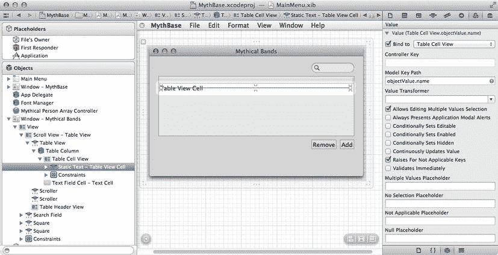
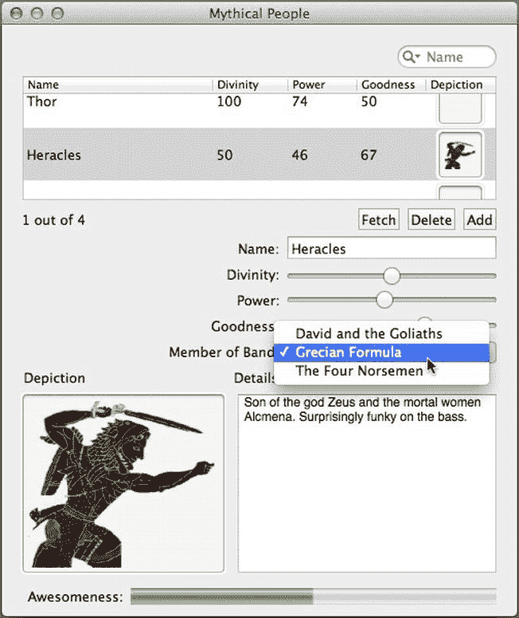
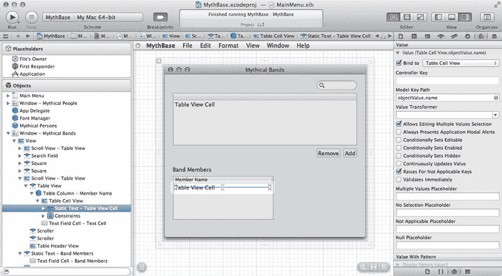

# 设置 Cocoa 绑定

现在我们已经布局好了对象，需要设置相应的 Cocoa 绑定，以将 UI 控件与 Core Data 管理的乐队列表实际连接起来。我们将从数组控制器开始，因为它已经被选中了。切换到绑定检查器，展开“参数”部分。勾选“绑定到”复选框，然后从下拉菜单中选择“App Delegate”。接着，在“模型键路径”字段中输入 `managedObjectContext`。这样就将数组控制器连接到了“App Delegate”中的 Core Data 机制。

接下来是处理表视图的绑定。由于这个表视图只有一列，所以比“神话人物”窗口中的那个要省事一些。首先选中表视图本身。最简便的方法是在左侧对象停靠区的大纲视图中进行选择。选中后，转到绑定检查器（从上一步操作后应该仍处于打开状态），并展开“表格内容”标题下的“内容”部分。勾选“绑定到”复选框，确保下拉菜单显示为“Mythical Bands”，并且“控制器键”显示为 `arrangedObjects`。和之前一样，我们还需要将表视图中选中的行传回给数组控制器。为此，展开绑定检查器中的“选择索引”部分。在这里勾选“绑定到”复选框，将下拉菜单设置为“Mythical Bands”，并将“控制器键”设置为 `selectionIndexes`。这与上一章的图 8-10 非常相似。

表视图本身的绑定设置好后，我们可以设置列的绑定。在对象停靠区中，展开表视图的子视图，直到看到标记为“静态文本 - 表格视图单元格”的视图。在绑定检查器中，展开“值”部分，勾选“绑定到”复选框，将下拉菜单设置为“Table Cell View”，并将“模型键路径”设置为 `objectValue.name`。这应该类似于图 9-8。然后，切换到属性检查器，将“行为”弹出菜单从“无”更改为“可编辑”。如果不做此更改，我们将无法在表视图中实际输入新乐队的名称。

最后，我们来处理搜索框。选择屏幕右上角的搜索字段，并打开绑定检查器。在绑定检查器靠近底部的位置，有一个名为“谓词”的部分。展开它，勾选“绑定到”复选框，将其绑定到 `Mythical Bands`。“控制器键”应设置为 `filterPredicate`。将“显示名称”设置为 `Name`，并将谓词格式设置为 `name contains[c] $value`，其中 `$value` 表示搜索框的内容，`name` 表示应被搜索的 `MythicalBand` 实体属性。这就像我们在第 8 章中为搜索字段所做的绑定一样。

**图 9-8.** 设置神话乐队表视图的绑定

对于按钮，我们将使用与上一章相同的过程，结合使用目标-动作和 Cocoa 绑定。我们将使用目标-动作来处理按钮按下事件，并使用 Cocoa 绑定来适当地启用或禁用按钮。我们先从动作开始。选择“添加”按钮，按住 Control 键拖拽到“Mythical Bands”数组控制器。从弹出菜单中选择 `add:` 动作。然后，选择“删除”按钮，按住 Control 键拖拽到同一位置。这次，选择 `remove:` 动作。要根据表视图中的选择来启用或禁用按钮，我们需要使用绑定检查器。选择“添加”按钮，打开绑定检查器，并展开“可用性”下的“已启用”部分。勾选“绑定到”复选框，将下拉菜单设置为“Mythical Bands”，并将“控制器键”字段改为 `canAdd`。对于“删除”按钮，执行相同操作，但“控制器键”字段使用 `canRemove`。

现在保存更改并运行应用程序。新窗口会出现，我们可以添加一些乐队，直接在表视图中编辑它们的名称，并保存更改。

## 为数组控制器赋予有用的名称

我们建议您对 nib 文件做一处更改，这在配置我们即将创建的新绑定时会很有帮助。它不会影响应用程序的行为，但您很可能会庆幸做了这个更改，并且后续的文本将假定您已经进行了此更新。

Core Data 基础设施与 UI 之间的连接都通过一个 `NSArrayController` 运行。我们在上一章中设置的 `NSArrayController` 名为 `Mythical Person Array Controller`。这个名字很长，比 Xcode 中的绑定检查器实际设计用来显示的长度要长一些。事实上，它几乎无法完全放入绑定检查器的弹出按钮中，并导致每个绑定属性显示的摘要信息溢出，部分文本被省略号代替。而对于 `Mythical Bands` 数组控制器，我们没有在名称中加入“Array Controller”，这使得它更容易使用。

您可以通过更改控制器的名称来改善这种情况。更改名称不会修改您已配置的任何绑定，也不会为应用程序的用户更改任何内容。唯一能看到这个变化的人就是您自己，但请记住，您也很重要。正如以一种易于浏览和查找所需内容的方式格式化您的源代码很重要一样，尽您所能优化在 Interface Builder 中的编辑体验将为您节省时间和避免挫折。

因此，如果您想进行此更改，请转到主 nib 窗口，确保您正在查看左侧的对象停靠区，找到您的 `Mythical Person Array Controller`。点击其名称，将其改为仅 `Mythical Person`。这样做将消除一些无实际价值的词语（例如，“Array”和“Controller”），这些词语原本可能会大量散布在您的 nib 文件和代码中，从而让您得到一个希望更容易被眼睛和大脑快速扫描和理解的显示界面。

### 将人物关联到乐队

现在，让我们通过在 `MythicalPerson` 显示界面中添加一个简单的弹出按钮，来实现将人物关联到乐队的功能。通过这个按钮，我们可以为选中的 `MythicalPerson` 选择一个 `MythicalBand`。该弹出按钮将通过 Cocoa 绑定进行连接，这意味着除了能像其他控件一样自动更新以显示选中人物的正确值外，它还会自动更新以始终展示当前的乐队列表——当用户在“神话乐队”窗口中进行更改时，其内容会自动变化。这只需在弹出按钮上配置几个绑定，并同时使用“神话人物”和“神话乐队”控制器即可实现。

首先，对原始窗口进行一些调整，使其与新窗口更加匹配。打开原始窗口（标题为 MythBase 的那个），然后点击其标题栏选中该窗口，使用属性检查器将其重命名为“Mythical People”。这样一来，两个窗口就具有了相同的外观风格。每个窗口都围绕一个特定实体居中布局，且两者中没有任何一个被标记为“主窗口”。

现在，选中滑块下方的所有视图，将它们整体向下拖动一点。在我们腾出的空间中，从对象库中拖出一个标签（将其命名为“所属乐队：”）和一个弹出按钮。将它们排列整齐，使其大致如图 9-9 所示。

**图 9-9.** 全新改进后的“神话人物”窗口

剩下的工作就是为弹出按钮配置一些绑定。与文本字段或滑块不同，弹出按钮的显示需要多个绑定才能使其行为符合预期。考虑一下，一个弹出按钮需要有一个待显示的字符串数组（这里我们将显示所有可用的乐队名称），一个这些字符串所对应的底层对象数组（即乐队本身），以及一些用于指示列表中哪一项被选中的信息（通过选中人物的乐队关系）。前两个绑定将通过“神话乐队”控制器实现，通过该控制器我们可以轻松绑定到所有乐队或所有乐队名称的数组。第三个绑定则通过“神话人物”控制器实现。

首先选中弹出按钮，并打开绑定检查器。展开列表顶部的“内容”（Content）绑定配置，在弹出列表中选择“Mythical Bands”，在“控制器键”（Controller Key）中选择 `arrangedObjects`，然后勾选复选框。这将告诉弹出按钮去哪里寻找底层对象的列表。

接下来，展开“内容值”（Content Values）绑定的配置。再次在弹出列表中选择“Mythical Bands”，在“控制器键”中选择 `arrangedObjects`，但这次在“模型键路径”（Model Key Path）中填入 `name`。这将告诉弹出按钮，它应该通过获取同一个数组（`arrangedObjects`）并调用每个元素的 `name` 属性结果来填充其显示值。

最后，展开“选中对象”（Selected Object）绑定配置。在这里，从弹出列表中选择“Mythical Persons”，在“控制器键”中选择 `selection`，在“模型键路径”中填入 `memberOf`。弹出按钮会自动连接这些关系，使得当“神话人物”控制器的选中项发生变化时，弹出按钮会注意到新选中项的乐队，并在 `Content`（从“神话乐队”控制器获取）数组中查找该乐队，然后显示 `Content Values` 数组（同样来自“神话乐队”控制器）中对应的字符串。要验证此功能是否正常，请保存更改，在 Xcode 中点击“运行”，然后进行尝试。对于我们选择的每一个 `MythicalPerson`，我们都可以为其选择一个 `MythicalBand` 进行关联（见图 9-10）。

**图 9-10.** 将赫拉克勒斯设置为乐队“希腊配方”的成员

### 显示乐队成员

现在我们已经能把人添加到乐队了，那么如何查看乐队所有成员的列表呢？让我们把这个功能添加到“神秘乐队”窗口中。这很简单：我们将手动添加一个表格视图和一个数组控制器，然后将它们全部连接起来。

首先，从对象库中拖拽一个 `NSArrayController` 到主 nib 窗口。就像我们处理其他数组控制器一样，我们需要给这个控制器起一个简短而有意义的名字。这个控制器将处理一个 `MythicalPersons` 列表，但我们已经有名为“神秘人物”的数组控制器了，并且我们希望它能清晰地体现上下文（它只会显示所选乐队的成员），所以我们在主 nib 窗口中将其命名为“乐队成员”。

接着，保持新数组控制器的选中状态，打开属性检查器，在对象控制器部分将模式设置为“实体”，实体名称设置为“MythicalPerson”。点击选中“准备内容”复选框。这确保当 nib 加载时，控制器的内容会被自动获取。

现在切换到绑定检查器，我们将在此配置两个绑定，以便该控制器能根据所选 `MythicalBand` 自动获取其内容。首先，在最底部，展开“托管对象上下文”的配置。在弹出的菜单中选择“App Delegate”，并在模型键路径中选择“managedObjectContext”，这应该会自动开启“绑定到”复选框。此配置与我们所有数组控制器的配置相同，允许它们连接到 Core Data 存储。接下来，在控制器内容部分，展开内容集绑定配置，在弹出的菜单中选择“Mythical Bands”，控制器键选择“selection”，模型键路径选择“members”。这样做会使控制器的内容依赖于所选的乐队。

现在，为成员列表腾出空间。调出“神秘乐队”窗口，将其拉得更高一些，几乎是原来的两倍高，这样我们就能在当前内容下方再放一个表格视图。然后，从对象库中拖入一个表格视图，并点击以选中表格视图本身（而不是包含它的滚动视图，拖拽后默认选中的是滚动视图）。我们这里只显示乐队成员的名字，所以表格只需要一列。调出属性检查器，找到顶部的“内容模式”设置，将内容模式改为“基于视图”。接着，找到内容模式下方的“列”设置，将其改为 1。然后，像之前章节那样优化列标题，将其标题设置为“成员姓名”，并使其填满表格的宽度。最后，为整个表格添加一个“乐队成员”标签，让用户知道他们在看什么。图 9-11 展示了您需要实现的布局。

剩下的就是为“乐队成员”表格配置绑定。我们将把表格绑定到 `NSArrayController`，然后将列绑定到表格。首先，选中表格本身。在绑定检查器中，展开表格内容下的“内容”部分。然后，勾选“绑定到”复选框，并将下拉菜单设置为“乐队成员”。默认的控制器键 `arrangedObjects` 就可以了。接下来处理列。使用左侧的对象停靠栏大纲视图，向下展开到表格视图内部的“静态文本 - 表格视图单元格”。在绑定检查器中，展开“值”部分。下拉菜单应显示为“表格视图单元格”。勾选“绑定到”复选框，并将模型键路径设置为“objectValue.name”，同时保持控制器键字段为空。图 9-11 窗口右侧的绑定检查器展示了这在 Xcode 中的样子。

图 9-11.

向“神秘乐队”窗口添加乐队成员

好了，这个窗口就应该这样了。是时候保存我们的工作了，点击 Xcode 中的“运行”，然后看看新功能：为一个人指定乐队会将此人添加到该乐队的成员数组中，当我们选择“神秘乐队”窗口中的某个乐队时就能看到这些成员。

