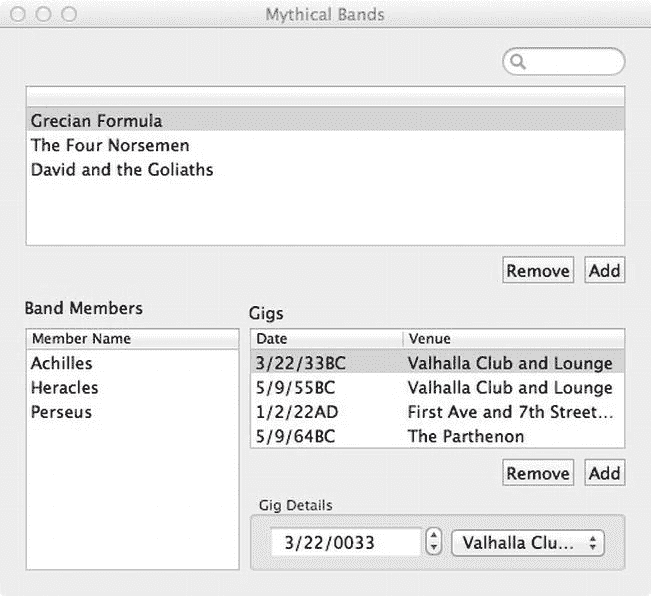

# 为乐队窗口添加演出列表

我们需要添加的最后一个功能是创建 `MythicalGigs` 的能力。`MythicalGigs` 位于 `MythicalBands` 和 `MythicalVenues` 之间，每个乐队或场馆可能有多场演出。而每场演出则恰好对应一个乐队和一个场馆。我们将添加另一个包含所需功能的表格视图，放置在 Mythical Band 窗口中的成员表格视图旁边。该表格视图的每一行都将包含用于显示演出的 `performanceDate` 和场馆的字段。我们还会在表格视图下方设置一个详细信息区域，用于编辑这些字段（参见图 9-12）。

图 9-12. 最终 Mythical Bands 窗口的外观

首先，在对象库中找到 `NSArrayController`。将其拖到主 nib 窗口中，并命名为“Gigs”。打开属性检查器，将模式设置为“Entity”，在“Entity Name”中输入“MythicalGig”，然后点击勾选“Prepares Content”复选框。现在切换到绑定检查器。将新数组控制器的托管对象上下文（Managed Object Context）绑定到 App Delegate 的 `managedObjectContext`，并将其内容集（Content Set）通过 Mythical Bands 进行绑定，控制器键设置为“selection”，模型键路径设置为“gigs”。

接下来，我们要设置 GUI 本身。从对象库中将另一个表格视图拖到 Mythical Bands 窗口，同时拖入一个“Gigs”标签，并按图 9-12 所示进行布局。这个表格视图将显示一列日期和一列场馆名称。默认的表格视图单元格就能很好地满足这一需求。首先，在属性检查器中将表格视图的模式设置为基于视图（view-based）。然后，切换到绑定检查器，展开“Table Content”下的“Content”区域。将其绑定到“Gigs”，控制器键保持为“arrangedObjects”，模型键路径留空。我们还需要绑定选择索引（Selection Indices）。同样将其绑定到“Gigs”，控制器键设置为“selectionIndices”，模型键路径留空。

表格列的标题应该有文字——左侧列标题为“Date”，右侧列标题为“Venue”，现在就来设置它们。然后，在对象停靠栏中展开对象层级，深入找到“Date”列的“Static Text – Table View Cell”对象。在绑定检查器中，将其绑定到“Table Cell View”，模型键路径设置为“objectValue.performanceDate”。接着，展开“Venue”列下的对象层级，找到该列中的“Static Text – Table View Cell”。在绑定检查器中，将其绑定到 `objectValue.venue.name`。这样，我们就完成了表格视图所需的所有操作！

我们还需要添加和删除按钮，以便用户创建和删除演出。选中窗口上部的两个按钮并进行复制，将新按钮拖到演出表格视图的下方。按住 Control 键从“Add”按钮拖拽到“Gigs”控制器，选择 `add:` 操作；然后按住 Control 键从“Remove”按钮拖拽到“Gigs”控制器，选择 `remove:` 操作。最后，通过使用一些简单的绑定，我们可以让这些按钮根据表格视图内容和选择的变化自动启用或禁用。选择“Add”按钮，打开绑定检查器，将其 Enabled 属性绑定到 Gigs 控制器的 `canAdd` 控制器键。然后选择“Remove”按钮，将其绑定到 Gigs 控制器的 `canRemove` 控制器键。

现在，我们需要在其下方设置详情区域。首先从日期显示开始。从对象库中拖出一个日期选择器，将其置于左侧表格视图的下方。在属性检查器中，将日期选择器设置为“文本型步进器”而非“图形化”，将元素设置为“月”、“日”和“年”，并勾选“纪元”复选框（因为部分演出可能发生在公元前）。在绑定检查器中，展开“值”部分。从下拉菜单中选择`Gigs`，并勾选“绑定到”复选框。保留默认的“selection”作为控制器键。在“模型键路径”字段中输入`"performanceDate"`。

接下来是场馆菜单。从对象库中拖出一个弹出按钮，将其放置在日期选择器旁边，即表格视图下方的右侧。这个按钮的绑定稍微复杂一些。我们需要为弹出按钮配置三个绑定。首先，将“内容”绑定到神话场馆控制器的`arrangedObjects`。接着，将“内容值”绑定到神话场馆控制器的`arrangedObjects`，这次在“模型键路径”中指定`"name"`。最后但同样重要的是，将“选定对象”绑定到演出控制器，使用`"venue"`作为模型键路径，并将控制器键保留为`"selection"`。

最后，将这两个字段放入一个框中，以便在视觉上将它们分组在一起。这不会影响它们的行为，纯粹是为了美观。为此，同时选中日期选择器和弹出按钮。从“编辑器”菜单中，选择“嵌入” ➤ “框”将这两个字段组合在一起。将框的标题设置为`"演出详情"`。调整框的宽度，使其与演出表格视图的宽度一致。完成这一步后，我们可能需要调整框内控件的大小，以充分利用空间。根据需要对尺寸进行清理，这样就完成了！

现在保存这项工作，在 Xcode 中按下`运行`，然后等待结果！假设一切配置正确，我们现在应该能够为每个乐队的信息添加演出了。

## 总结

在本章中，我们扩展了旧的数据模型，将其从一个单一的实体发展为一组通过关系相互关联的完整实体。我们还看到了这些关系如何通过 GUI 表达（例如，使用弹出列表选择对一关系的远程端，使用表格视图显示对多关系的所有内容），并通过 Cocoa 绑定进行配置和完全管理。

尽管不想在这个可视化编程的话题上老调重弹，但仍需重申的是，本章中的所有操作都是在我们一行代码都没写的情况下完成的。请注意，我们使用的“可视化编程”一词与微软在其开发工具中使用“可视化”一词并无关联。可视化编程的理念是允许程序或其部分通过图形组件进行构建，而无需使用传统软件编写中那种文本化、程序化的编程方式。Cocoa 在一定程度上拥抱了可视化编程，让你仅通过 Xcode 数据建模器和 Interface Builder 就能构建应用原型甚至整个应用。然而，它并不旨在构成一个完整的可视化编程系统，因此对于你构建的每个 Cocoa 应用，你最终都不可避免需要编写一些代码！

此外，这些使用模式同样适用于你自己的应用程序。仅仅是建模问题域、定义实体和关系这一行为，往往就能让你开始对如何构建 GUI 有所感觉。随着你在应用开发过程中不断深入，你肯定会找到更多方法，利用 Cocoa 绑定将不同类型的控件连接到你的数据上，有时你也会发现需要通过编写代码来连接对象并在对象之间传递数据。

当你阅读本书后续章节时，你会看到更多将 Core Data 和 Cocoa 绑定作为架构核心部分的应用示例，因此你将看到更多使用这些技术的方法。下一章是最后一章专门讨论 Core Data 的章节，将展示如何限制 GUI 中显示的数据范围，这对于任何处理大量数据的应用程序来说都是绝对必要的。

