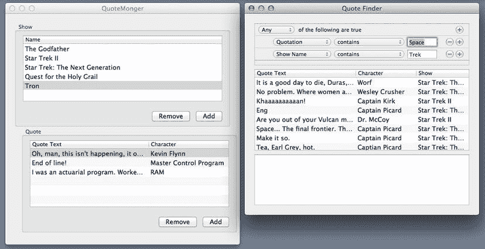

# 10. 使用条件进行搜索和检索 Core Data

## 摘要

第 8 章和第 9 章中的 MythBase 示例展示了 Core Data 工作原理的基础，让我们能够轻松地从后端存储中创建、检索、更新和删除对象。到目前为止，我们主要在 MythBase 中处理完整的数据集。对于我们使用的大多数实体（`MythicalPerson`、`MythicalBand` 和 `MythicalVenue`），每个实体的所有对象在应用启动时加载，并在应用的整个生命周期内保存在内存中。对于像 MythBase 这样维护小型数据库的应用来说，这没问题，但如果其中一个主要实体在后端存储中包含数千或数百万个实例呢？我们的应用在启动时会从存储中加载所有数据，这可能导致应用填满所有可用内存、使用磁盘交换等。除了这个问题，我们可能还会遇到糟糕的用户体验，因为一个在显示 20 个对象时能够顺畅导航的 GUI，在有数千条条目时可能变得难以有效使用。

此问题的解决方案涉及一个重要功能：提供搜索条件的方法，以便我们可以限制控制器从存储中拉取的对象。本章将介绍如何使用 `NSPredicate` 将搜索限制为给定 `Entity` 的所有对象中的子集。我们将在 Interface Builder 和源代码中指定硬编码的 `NSPredicate`，并让用户使用 `NSPredicateEditor` 定义谓词的值。

## 创建 QuoteMonger

我们将通过创建一个名为 QuoteMonger 的应用来演示 `NSPredicate` 的使用，该应用允许我们跟踪所有最喜欢的节目及其中的经典名言。它将包含一个带有两个实体的 Core Data 应用，以及一个支持数据输入和灵活查询的 GUI。图 10-1 展示了完成后的应用视图。

图 10-1. QuoteMonger 的数据输入和搜索窗口

> 注意  
> 到现在为止，您应该已经掌握了创建 Xcode 项目和文件的基础知识，因此对于您已经重复多次的操作，我们将不再提供精确的逐步点击说明，而是将最详细的步骤保留给每章介绍的新主题。

