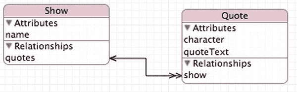

# 创建项目及其数据模型

首先在 Xcode 中创建一个新的 Core Data 项目，并将其命名为 `QuoteMonger`。然后编辑 `QuoteMonger.xcdatamodel` 文件，添加两个名为 `Show` 和 `Quote` 的实体。我们在前两章中已经介绍过这些步骤，如果遇到困难，请翻阅前面几页复习。

为 `Show` 设置一个名为 `name` 的属性，类型为 `String`。取消勾选"可选"复选框，然后勾选"索引"复选框。接着为 `Quote` 添加两个 `String` 类型的属性：`quoteText` 和 `character`。对这两个属性都勾选"索引"复选框，但仅对 `quoteText` 取消勾选"可选"复选框，`character` 则保留勾选（因为可以想象，有时你无法完全记住或确定某句话是谁说的，但仍想将其作为引文存储）。

最后，从 `Show` 到 `Quote` 建立一对多关系（请记住，这意味着需要设置两个关系——一个是 `Show` 到 `Quote` 的多向关系，名为 `quotes`；另一个是 `Quote` 到 `Show` 的单向关系，名为 `show`——并将它们配置为互逆关系）。最终的数据模型应类似图 10-2 所示。

图 10-2. QuoteMonger 的数据模型

