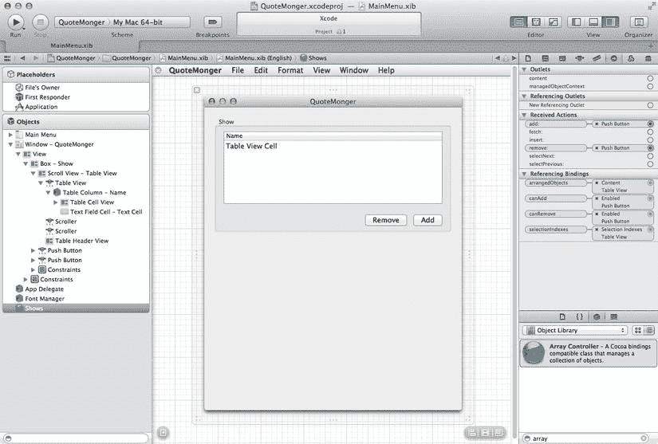
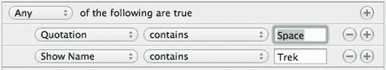

# 数据录入窗口

数据模型就绪后，是时候开始构建图形用户界面了。本章主要介绍的"搜索窗口"是其中的亮点。但在有数据可供搜索之前，我们无法进行任何搜索，因此我们将从创建用于数据录入的 GUI 部分开始。为此，我们将制作一个非常基础的 GUI——在单个窗口中显示节目和引文，并且仅显示与当前选中节目关联的引文。

## 分两部分的窗口

在 Xcode 项目中双击 `MainMenu.xib`，在 Interface Builder 窗格中打开它。这会打开之前使用过的标准空白应用程序 Nib 文件。在主 Nib 窗口中选择 `NSWindow` 实例，然后使用大小调整控件使其变高（大约为原始高度的两倍）。我们需要这个空间，因为将在此放置两组视图，一组用于 `Show` 实体，另一组用于 `Quote` 实体。

## 显示节目

首先从 `Show` 的视图开始。从对象库中拖出一个 `NSTableView`，将其放置在窗口顶部附近。调整其大小以占据大部分空间。这次不必担心蓝色参考线；实际上，使其比参考线建议的尺寸稍小。我们将把它与一些其他控件一起分组到一个方框中，因此尺寸问题暂时不关键。打开属性检查器，将表格视图设置为基于视图的，并带有一列。调整列本身以占据表格视图的宽度，并将列名称设置为"名称"。拖出一个按钮，将其放置在表格视图右下角的下方，并将其标签设置为"添加"。再拖出另一个相同类型的按钮，将其放置在"添加"按钮的左侧，并将其标签设置为"移除"。选中这三个控件，然后将它们分组到一个方框中（选择"编辑器"➤"嵌入到"➤"方框"）。将方框的标题设置为"节目"。现在，我们可以根据窗口调整方框的大小，然后调整方框内的表格视图，以获得令人满意的布局。

现在我们已经有了一个列出节目的位置，需要将它们连接到 Core Data 模型，我们将使用 Cocoa 绑定和 `NSArrayController` 作为中间件。从对象库中拖出一个数组控制器，并将其标题设置为"Shows"。在属性检查器中，将"模式"弹出菜单设置为"实体名称"，然后在"实体名称"字段中输入"Show"，以将其连接到模型编辑器中的 `Show` 实体。勾选"准备内容"复选框，这将指示数组控制器在启动时加载所有 `Shows`。切换到绑定检查器。将"托管对象上下文"（位于绑定列表底部）绑定到"App Delegate"，并将"模型键路径"设置为 `managedObjectContext`。

对于绑定，我们从表格视图开始。选择表格视图，然后打开绑定检查器。展开"表格内容"下的"内容"部分，勾选"绑定到"旁边的复选框。弹出菜单应显示"Shows"。默认的控制器键 `arrangedObjects` 正是我们需要的，且"模型键路径"无需填写。我们还需要数组控制器知道选中的行，因此将"选择索引"绑定到"Shows"，并在此将控制器键设置为 `selectionIndexes`。然后，使用对象停靠栏，深入表格视图内的视图层次结构，找到"静态文本 - 表格视图单元格"。在属性检查器中，将"行为"更改为"可编辑"。然后，在绑定检查器中，将"值"绑定到"表格单元格视图"，并将其"模型键路径"设置为 `objectValue.name`。

至此，表格视图的部分就完成了。要完成窗口中与 `Shows` 相关的部分，我们需要连接按钮。这类似于上一章的做法——结合目标-动作来处理点击，以及使用 Cocoa 绑定来适当启用或禁用按钮。我们先进行目标-动作设置。按住 Control 键从"添加"按钮拖拽到 Shows 数组控制器，然后选择 `add:` 作为接收的动作。对"移除"按钮重复相同操作，这次选择 `remove:` 作为接收动作。再次选择"添加"按钮，转到绑定检查器。勾选"绑定到"复选框，将按钮连接到 Shows 控制器，并输入 `canAdd` 作为控制器键。对"移除"按钮重复操作，将其绑定到 `canRemove` 控制器键。

窗口应如图 10-3 所示。请注意实用工具区域中的"插座检查器"视图，它显示了数组控制器的绑定和目标-动作连接。当出现意料之外的问题时，这个视图对于故障排除非常有用！



图 10-3. 数据录入窗口的部分布局


#### 引用引文

现在，我们将在“显示”框的下方，为“引文”重复大部分相同的设置。与之前一样，拖拽出一个表格视图和两个按钮，将它们放置在窗口的下半部分，并按之前的步骤为按钮添加标题。不过，对于这个表格视图，我们将保留两列。像之前一样将其改为基于视图的模式，并勾选标记为“交替行”的复选框，这会使内容更易于阅读。将左列标题设为“引文文本”，右列标题设为“角色”，并调整它们的大小，为“引文文本”列留出更多空间。在“引文文本”列中，双击列内的“表格单元格视图”文本，并将其改为“引文”。对“角色”列中的“表格单元格视图”文本执行相同操作，将其改为“角色”。这将帮助我们稍后区分这两列。像之前一样，将这三个控件分组到一个框中，并将该框的标题设为“引文”。

窗口的这一部分也将使用一个`NSArrayController`，但其配置方式将与“显示”数组控制器略有不同。拖拽出一个控制器，并将其标题设为“引文”。在属性检查器中，将其模式设置为实体名称，然后将实体名称字段设置为 Quote（与我们在模型编辑器中定义的实体名称相同）。然后，切换到绑定检查器。默认情况下，每个数组控制器将获取对应实体的所有对象。我们将修改此设置，使其仅基于选中的“显示”来获取引文。打开内容集绑定，在下拉列表中选择“显示”，在控制器键组合框中选择“selection”，并在模型键路径组合框中输入“quotes”。最后，按 Return 键以启用该绑定。我们还需要将其连接到一个托管对象上下文，该上下文由应用委托提供。将托管对象上下文（位于绑定列表底部）绑定到应用委托，并将模型键路径设置为`managedObjectContext`。

现在，我们可以将此表格视图绑定到“引文”控制器。选择表格视图，然后打开绑定检查器。展开表格内容下的内容部分，并勾选绑定到旁边的复选框。下拉菜单应显示为“引文”。默认的控制器键`arrangedObjects`正是我们需要的。与之前一样，数组控制器应被通知所选行，因此将选择索引绑定到“引文”，并将此处的控制器键设置为`selectionIndexes`。

要绑定这两列，请使用对象停靠区在表格视图内的视图层次结构中向下钻取，直至“静态文本 – 引文”条目。在属性检查器中，将行为更改为可编辑。然后，在绑定检查器中，将值绑定到表格单元格视图，并将其模型键路径设置为`objectValue.quoteText`。切换到对象停靠区中的“静态文本 – 角色”条目，将其模式更改为可编辑，然后将其绑定到表格单元格视图，并将其模型键路径设置为`objectValue.character`。

最后，我们需要连接按钮。从每个按钮控制拖拽到“引文”控制器，并根据情况将操作设置为`add:`或`remove:`。将每个按钮的启用绑定分别绑定到“引文”控制器上相应的`canAdd`或`canRemove`控制器键。

布局应类似于图 10-4。


图 10-4.

数据录入窗口的完整布局

### 输入一些初始引文

保存更改并点击运行。应用应启动并显示数据录入窗口。点击上方表格视图下方的“添加”按钮以添加一个节目，并在表格视图中高亮显示的区域双击以编辑节目名称。重复此操作几次以创建几个`Show`实例。现在，选中其中一个节目，在下方的表格中添加一条引文，直接编辑表格中的文本和任何角色的名称。如果您添加的引文包含两个或多个角色之间的对话，请在“角色”字段中输入所有涉及角色的名称。当我们稍后启用基于角色名称的搜索时，它将适用于您输入的所有名称。再添加几条引文，分布在几个不同的节目中。请注意，当您选择不同的节目时，引文列表会发生变化；如果您退出并重新启动 QuoteMonger，您应该会看到您输入的所有内容都已保存。

另一方面，如果一切似乎都不起作用，请检查 Xcode 中的调试器日志，看应用程序是否抛出了异常。常见的问题包括：忘记在数组控制器上设置托管对象上下文的绑定，或者错误地键入了控制器键或模型键路径绑定的名称。


### 创建引用查找器窗口

现在是为搜索窗口奠定基础的时候了。回到 Xcode 中的 Interface Builder 面板，从对象库中拖出一个新窗口，放到画布上。Xcode 提供了多种窗口类型，但我们需要的只是一个普通的普通窗口。（你可能还想关闭 QuoteMonger 窗口，以免干扰工作——只需点击 Interface Builder 画布上窗口左上角的小“x”即可。）

选中这个新窗口，然后转到属性检查器。将新窗口的标题设置为“引用查找器”。这个窗口将有两个可见控件：一个表格视图和一个文本视图。表格视图会显示匹配的引用列表，而文本视图则会显示所选引用的具体内容。稍后，我们还会使用一个名为谓词编辑器的新控件来定义搜索条件。这个谓词编辑器在 `Mail.app` 中用于定义过滤规则，在 iTunes 中用于创建智能播放列表。它是一个通用的 Cocoa 组件，我们也可以用它来玩一玩。不过，我们现在还不会用到它。

让我们开始吧！从对象库中拖出一个表格视图，并将其放置在窗口顶部附近。在属性检查器中，将其设置为基于视图模式，并给它三列。分别将这三列的标题设置为“引用文本”、“角色”和“剧目”。此外，编辑每个字段中的文本以反映列的名称。我们还可以为此表格视图勾选“隔行变色”复选框，以便在搜索返回大量匹配结果时使用。这个表格视图不会放入框中，因此我们可以调整其大小以填满窗口宽度，让蓝色参考线告诉我们该在哪里停下。

现在，从对象库中拖出一个文本视图（在库区域底部的搜索字段中输入“文本视图”），并将其放置在表格视图下方。将其宽度扩展到与表格视图相同。在属性检查器中，关闭“可编辑”和“富文本”复选框。对于“查找”项，将弹出菜单设置为“使用搜索栏”，并勾选“增量搜索”复选框。这将允许大的文本视图使用 Mac OS/X 10.7 中引入的嵌入式搜索栏。窗口看起来应该像图 10-5 那样。


图 10-5. 查询查找器窗口的初步设计

接下来，拖出一个数组控制器，并将其命名为“FoundQuotes”。在属性检查器中，将其模式设置为“实体名称”，并将“Quote”作为要使用的实体名称。同时勾选“准备内容”复选框。在这些设置的上方，即属性检查器的数组控制器区块中，勾选“自动重新排列内容”复选框。这样，每当用户在引用控制器中进行更改时，它都会正确重新加载并重新过滤其内容。在绑定检查器中，将其托管对象上下文绑定到 App Delegate，并将模型键路径设置为 `managedObjectContext`。

现在，我们需要为用户界面控件（表格视图和文本视图）设置绑定。和往常一样，我们从表格视图开始。将表格视图的“内容”和“选择索引”绑定绑定到 FoundQuotes 控制器。将“内容”绑定绑定到 `arrangedObjects` 控制器键，并将“选择索引”绑定绑定到 `selectionIndexes` 控制器键。然后，深入表格视图中的“静态文本 - 引用文本”字段。将其值绑定配置为指向表格单元格视图，并使用 `objectValue.quoteText` 作为模型键路径。将“静态文本 – 角色”字段的值绑定配置为指向表格单元格视图，并使用 `objectValue.character` 作为模型键路径。最后，选择表格视图中的“静态文本 – 剧目”字段，并将其值绑定设置为指向表格单元格视图，使用 `objectValue.show.name` 作为模型键路径。

对于文本视图，操作稍微简单一些。选择文本视图，将其值绑定绑定到 FoundQuotes。使用 `selection` 作为控制器键，并使用 `quoteText` 作为模型键路径。

现在点击“运行”，注意观察两个窗口。新的查询查找器窗口只是简单地显示了我们在数据录入窗口中输入的所有引用。本章的其余部分将介绍如何使用 `NSPredicate` 来改变这一点，以便只有用户搜索的引用才会显示在此窗口中。

## 使用 `NSPredicate` 限制结果

如前所述，我们可以通过使用 `NSPredicate` 来限制 `NSArrayController` 准备显示哪些记录。我们可以直接在 Interface Builder 中为数组控制器分配谓词；可以在应用程序代码初始化期间或当条件发生变化需要重新获取时进行分配；也可以通过 Cocoa 绑定来实现，这意味着对谓词的更改可以自动传播到控制器。本章我们将探讨所有这些选项。


### 创建谓词

创建 `NSPredicate` 最简单的方法是使用包含属性名称、比较运算符和待比较值的格式字符串。谓词的定义看起来很像 SQL 中的 `WHERE` 子句，其用途也大致相同。谓词不仅限于 Core Data 使用，还可应用于 Mac OS X 的其他领域，例如 Spotlight。在其最基本的形式中，我们可以像这样定义一个 `NSPredicate`：

```
NSPredicate *p = [NSPredicate predicateWithFormat:
    @"(quoteText CONTAINS[cd] 'missed') OR "
     "(character CONTAINS[cd] 'kramer') OR "
     "(show.name CONTAINS[cd] 'trek')"];
```

> **注意：** 在 C 语言中，如果代码中有多个仅由空白字符（包括回车符）分隔的内联字符串常量，它们会被拼接成单个字符数组，这有助于格式化代码中的长字符串。这个技巧同样适用于内联的 `NSString` 常量——只需在第一个字符串前放一个 `@` 符号，如上所示。

在这个例子中，我们实际上有三个条件，通过 `OR` 连接并用括号包裹，就像我们在应用代码中可能做的那样。每个条件都使用了 `CONTAINS` 比较运算符（其作用正如你所猜测的那样），并在方括号内指定了一些选项。`c` 使比较不区分大小写，而 `d` 使比较不区分变音符号。例如，同时指定这两者的相等性比较会将 `"ramon"` 和 `"Ramón"` 视为相等。

`CONTAINS` 只是谓词中可用的几个比较运算符之一。所有属性都可以使用 `=`、`<`、`>`、`>=`、`<=`、`!=` 和 `BETWEEN` 比较运算符。（注意 `==`、`=>`、`=<` 和 `<>` 分别等价于 `=`、`>=`、`<=` 和 `!=`。）字符串属性可以使用 `BEGINSWITH`、`CONTAINS`、`ENDSWITH`、`LIKE` 和 `MATCHES` 比较运算符。

> **注意：** 这些大多应该不言自明，但有几点值得注意：`BETWEEN` 允许我们指定一对上下界，因此其右侧的值应该用一个包含两个元素的 `NSArray` 来替代；`LIKE` 允许我们进行通配符匹配；`MATCHES` 允许我们使用正则表达式进行高级比较。然而，`MATCHES` 无法与 SQLite 后端配合使用，因此从 Core Data 存储中获取值时作用不大。

如果我们的应用确实需要一个用于特殊目的的固定查询，硬编码选项是可以的，但有时我们想根据用户输入或其他当前数据来创建查询。幸运的是，`NSPredicate` 类提供了一种简单的方法，使用我们刚才看到的同一个 `predicateWithFormat:` 方法来插入值。例如：

```
// 假设这些变量存在并指向有效对象
NSString *quoteInput;
NSString *characterInput;
NSString *showNameInput;

NSPredicate *p = [NSPredicate predicateWithFormat:
    @"(quoteText CONTAINS[cd] %@) OR "
     "(character CONTAINS[cd] %@) OR "
     "(show.name CONTAINS[cd] %@)",
    quoteInput, characterInput, showNameInput];
```

当这段代码运行时，三个变量的值将被放入生成的谓词中。请注意，格式字符串中的 `%@` 标记没有被单引号包围，而在前面的例子中，裸值是被单引号包围的。

### 在 Xcode 中指定 NSAppController 的谓词

让我们尝试一种最基础的谓词使用方法：直接在 Xcode 中将其附加到控制器上。回到 Xcode 中的 `MainMenu.xib` 文件，在主 nib 窗口中选择 `FoundQuotes` 控制器，然后打开属性检查器。底部有一个标有 **Fetch Predicate** 的文本视图，我们可以在此添加一些文本来定义一个谓词。尝试输入以下内容：

```
show.name CONTAINS[cd] 'trek'
```

然后保存更改，切换回 Xcode，点击 **Run**。现在搜索窗口不一定显示你输入的所有引语。如果你输入了一些《星际迷航》的引语，它将只显示这些；如果你没有输入任何《星际迷航》的引语，那么搜索窗口中将什么也看不到。当然，也有可能你只输入了《星际迷航》的引语，在这种情况下，这个视图将与之前完全相同。如果是这样，请输入来自其他剧集的一些引语，以验证谓词正在过滤掉它们（同时也是因为，说实话，电视节目远不止《星际迷航》这一部）。

### 用户自定义谓词

在 nib 中定义的谓词适用于特殊用途，即 GUI 的某些部分应始终显示数据的特定子集，但我们的目标是让用户自己定义搜索参数。理想情况下，用户应该能够选择多个搜索参数、编辑要比较的值，甚至更改比较运算符本身（而不只是始终使用 `CONTAINS`）。幸运的是，Cocoa 提供了一个名为 `NSPredicateEditor` 的 GUI 控件，正好可以实现这一点！

正如我们之前提到的，使用 `NSPredicateEditor`，我们可以制作一个类似于 iTunes 中的智能播放列表或 Mail 中的智能邮箱功能的 GUI。用户可以添加和删除搜索条件，结果会实时更新。见图 10-6。



**图 10-6.** QuoteMonger 的谓词编辑器实际效果

`NSPredicateEditor` 和 `NSArrayController` 都可以通过绑定来设置和获取其 `NSPredicate` 属性的值，因此我们要做的是将一个 `NSPredicate` 作为应用代理的一个属性，并建立适当的绑定。然后，当用户在谓词编辑器中做出任何更改时，更新后的谓词将自动传递给数组控制器。


