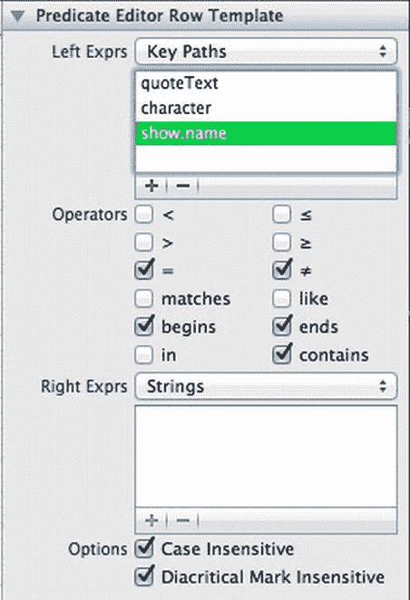

# 配置谓词编辑器

现在是时候将编辑器绑定到应用委托的谓词实例上。选中 `NSPredicateEditor`（别忘了多点击一下以选中编辑器本身，而不是包含它的滚动视图），打开绑定检查器，然后查看“值”绑定信息。在弹出的菜单中选择“应用委托”，然后在“模型键路径”组合框中输入 `searchPredicate`，并按 Return 键激活该绑定。

至此，要启用此谓词编辑器的搜索功能，我们还需要做一件事：必须根据我们想要搜索的属性对其进行定制。`NSPredicateEditor` 是一个相当复杂的控件，幸运的是，它的大多数有趣功能都可以直接在 Xcode 中进行配置。谓词编辑器会显示一个或多个 `NSPredicateEditorRowTemplate` 对象，每个对象都可以配置为以多种方式进行搜索。我们可以创建行模板，让用户指定要与对象值进行比较的数字或日期，或者从预定义字符串列表中选择。在我们的例子中，我们将配置一个行模板，让用户可以在文本字段中输入字符串，以搜索角色名称、剧集名称和引用内容。这个行模板可以被重复使用，允许用户同时指定多个搜索条件。此外，另一个行模板将让用户选择是必须满足所有搜索条件（布尔“与”运算），还是只要任意一个匹配成功（布尔“或”运算），即可在结果中显示某条引用。

在 Interface Builder 画布中，点击两个可见行中下面的那个（包含显示“名称”和“包含”的弹出按钮的行），深入编辑谓词编辑器。选中该行模板后，打开属性检查器。注意，其中的复选框允许我们选择允许用户使用哪些比较器，而弹出按钮则允许我们选择比较器两侧表达式的性质（键路径、字符串、常量值等）。默认设置（左侧为键路径，右侧为字符串）非常符合我们的需求，但我们确实需要根据搜索需求调整键路径。

编辑“左侧表达式”键路径下列出的三个默认值，将它们改为 `quoteText`、`character` 和 `show.name`。接下来，点击启用“忽略大小写”和“忽略变音符号”复选框（参见图 10-8）。

**图 10-8.** 配置 `NSPredicateEditorRowTemplate`

然后，检查行模板中的弹出按钮。这将显示三个条目，其名称与我们刚才为键路径输入的内容相同。将它们更改为更易读的名称：*引用文字*、*角色名*和*剧集名*。

现在点击上面的行模板，即显示“以下条件任意一条为真”的那个。其配置非常简单。复选框允许我们选择是否允许用户使用布尔“与”、“或”和“非”进行搜索。将所有选项都启用，以提供最大的实用性。

现在，我们还需要进行最后一项配置。默认情况下，`NSPredicateEditor` 允许用户删除所有行，直至最后一行，此时将不再有添加新行的“+”按钮。要更改此设置，请选择谓词编辑器本身（而非某个行模板），然后在属性检查器中点击关闭“允许移除所有行”复选框。

保存工作，在 Xcode 中点击“运行”，尽情享受 QuoteMonger 的强大功能吧！现在，我们可以使用在谓词编辑器中配置的三个条件，轻松地在所有已保存的引用中进行搜索。

