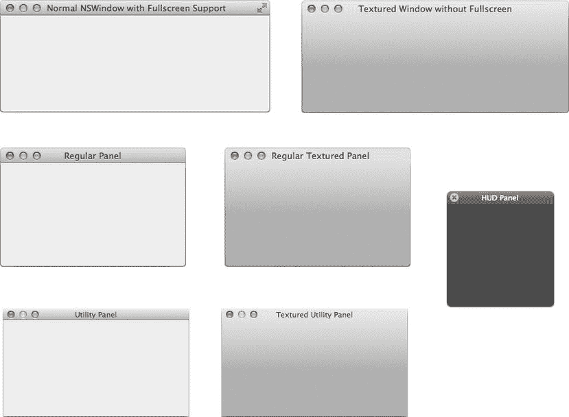
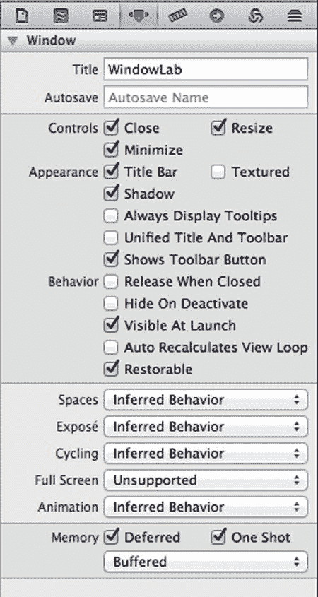
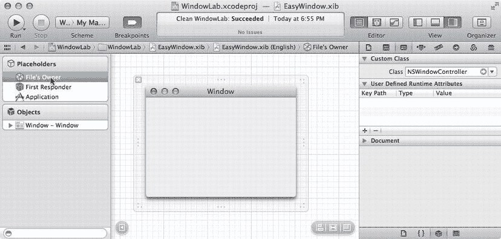
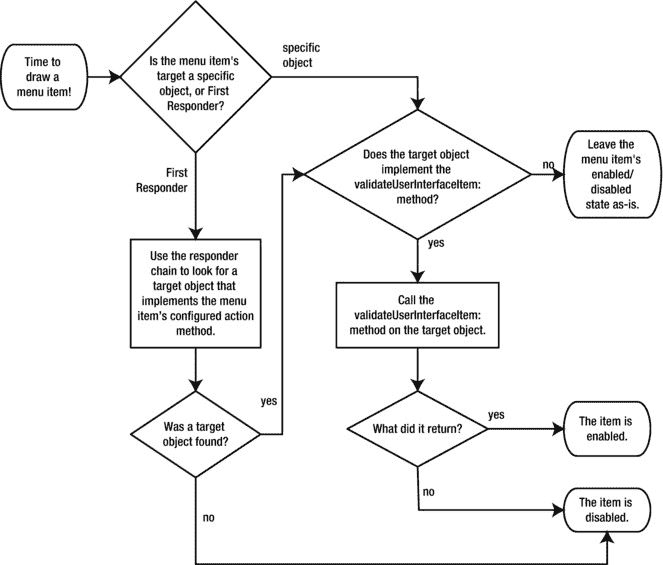

# NSWindow 与 NSPanel

首先，使用 Cocoa 应用程序模板创建一个新的 Xcode 项目，并将其命名为 `WindowLab`。我们将把这个项目作为演示各种窗口功能的测试平台。

在 Mac OS X 中，屏幕上几乎所有的内容都是通过窗口来呈现的。许多窗口很容易识别，它们顶部有标准控件，背后带有投影。

但有些窗口并没有那么明显。例如，如果我们启动一个游戏，它占据了整个屏幕进行显示，即使它呈现的是自定义的、与 Cocoa 无关的控件，这一切也都是在某个窗口中发生的。屏幕底部的 Dock 毫无疑问也是一个窗口。而且，如果我们把一个文件图标从一个 Finder 窗口拖到另一个 Finder 窗口，我们拖动的图标实际上是被"装"在一个小小的透明窗口里！

在所有这些情况下，我们看到的并与之交互的都是 `NSWindow` 及其子类的实例。`NSWindow` 是一个非常通用的类，它允许我们开箱即用地配置多种行为，并且通过子类化实现更多功能。通常，如果我们想要改变窗口本身的外观，无论是其"镀铬装饰"（标题栏和左上角控件）、透明度还是形状，我们可能都需要对 `NSWindow` 进行子类化。但除此之外，我们几乎永远不需要这样做。在本书中，我们将只使用那些可以直接使用且符合苹果人机界面指南的窗口类型，并且不会对 `NSWindow` 进行子类化来改变其外观。

**提示**

人机界面指南（通常简称为 "HIG"）是苹果公司为应用程序开发者提供的一套建议。当你担心你的应用程序看起来有些"不对劲"时，HIG 可以作为一种你可以参考的风格指南。它并不是一套严格的规则，也没有人会阻止你违反 HIG。事实上，许多应用程序，包括苹果自家的，都会以各种方式偏离指南。然而，它提供了一个良好的基线，描述了各种组件应该如何被使用。

我们已经在第 2 章提到了 HIG，但值得再次指出。你可以在网上找到 HIG，网址是 [`http://developer.apple.com/library/mac/#documentation/UserExperience/Conceptual/AppleHIGuidelines/Intro/Intro.html`](http://developer.apple.com/library/mac/#documentation/UserExperience/Conceptual/AppleHIGuidelines/Intro/Intro.html)。

图 11-1 展示了当今大多数 Cocoa 应用程序中常见的主要窗口类型。`NSWindow` 有两种绘制风格："正常"外观和"纹理"外观（有些类似于闪亮的金属片）。任何一种风格的 `NSWindow` 都可以配置为支持全屏模式，这会在标题栏的右端添加箭头。`NSPanel` 可以配置为实用工具模式（这种情况下，它的标题栏更小，投影更小，并且浮动在应用程序的其他窗口之上），或者看起来像一个普通的窗口，并且在这两种情况下，也适用正常与纹理的选择，就像 `NSWindow` 一样。`NSPanel` 还有一个额外的选项是运行在 HUD（即平视显示器 heads-up display 的缩写）模式下，在这种情况下，面板的配色方案会反转，其标题栏和底部边缘会被修改，并且整个窗口会变得略微透明。这种模式（没有纹理选项）旨在让用户能够透过界面的部分区域看到其背后的内容，并且在 iPhoto 等应用程序中得到了很好的应用，你可以调出一个包含可调节颜色设置的 HUD 面板，透过它，你正在查看的照片仍然可见。



**图 11-1.** Cocoa 中可直接使用的主要窗口类型示例

与其他一些 GUI 工具包（你在创建新应用程序时首先要做的事情之一就是对某种 Application 类和某种 Window 类进行子类化）不同，Cocoa 允许真正分离你应用程序的模型、视图和控制器部分。窗口只需要知道如何显示自身并为它的视图提供图形上下文，因此它的作用仅限于此。任何处理应用程序运行时窗口所发生事件的代码（例如，从 nib 文件加载、被拖拽到屏幕另一侧、或被用户关闭）通常都可以由窗口的委托对象（即其控制器）来处理。

## 处理输入

除了为视图提供显示内容的框架，`NSWindow` 还处理来自鼠标和键盘的用户输入。在 `NSWindow` 中的任何鼠标操作（点击、拖拽、移动、释放等）都会触发 `NSWindow` 中的一个方法，该方法会在其内容中找到合适的视图对象，并在该视图中调用相同的方法。这种对称性之所以有效，是因为 `NSWindow` 和 `NSView` 都继承自 `NSResponder`，而处理这些事件的方法正是在 `NSResponder` 中定义的。同样地，当用户在键盘上按下或释放一个键时，应用程序会调用该应用程序的"关键窗口"（即当前拥有键盘焦点的窗口；通常是用户最后点击过的窗口）中的方法，该方法进而确定当前哪个视图拥有键盘焦点，并传递责任，在获得焦点的视图中调用相同的方法。

## 使用面板，还是不用面板

由于我们不会修改窗口的基本外观，我们将使用 `NSWindow` 或其子类 `NSPanel` 来在我们的应用程序中显示控件和其他视图。我们应用程序的核心元素通常放在一个 `NSWindow` 中，而 `NSPanel` 则用于辅助窗口，例如 Finder 中的"显示查看选项"面板。从用户的角度来看，`NSWindow` 和 `NSPanel` 之间仅有几个关键的区别：

*   当另一个应用程序成为活动应用程序时，`NSPanel` 实例通常会变得不可见，并在其自己的应用程序再次变为活动状态时重新出现。
*   可以设置一个 `NSPanel` 使其"浮动"在其应用程序中的所有其他窗口（包括主窗口）之前。
*   可以轻松地将一个 `NSPanel` 配置为不会不必要地成为关键窗口，这样用户可以在辅助面板中点击一个按钮，然后继续在主窗口中输入。


### Window Attributes

在 Xcode 的 WindowLab 项目中，导航到 `MainMenu.xib` 文件并单击以在 Interface Builder 画布中打开它。应用程序 nib 文件中包含的对象之一，和往常一样，是一个窗口。在主要的 nib 窗口中点击选择它，然后打开 Attributes Inspector 以便我们进行一些探索（参见图 11-2）。在前面的章节中，我们使用这个 Inspector 来设置窗口的标题，但当然我们在这里可以做更多事情。



图 11-2. 针对 `NSWindow` 的 Attributes Inspector

我们已经熟悉了 Title 文本字段。就在它下面的是 Autosave 字段，它提供了一个非常好的功能：在此字段中输入一个文本字符串，窗口将使用该字符串作为 `NSUserDefaults` 系统中的键，并基于该键存储和检索窗口的位置和大小。这意味着，当用户重新排列我们应用程序中的窗口时，窗口位置会保存在用户的偏好设置中，并且下次用户运行我们的应用程序时，窗口将出现在相同的位置。而我们要做的，就是为应用程序中的每个窗口填写这个文本字段，并为每个窗口输入一个唯一的值。

接下来，有一些复选框允许我们关闭一些标准的窗口控件。请注意，关闭这些复选框并不会从窗口标题栏中移除相应的按钮；它只会让这些按钮在我们的应用程序运行时永久变灰并且不可用。在它们下面是一些用于微调窗口外观的复选框，包括启用纹理模式、禁用窗口背后的阴影等等。这里提到 Toolbar 的选项指的是可以附加到窗口的可选 `NSToolbar`，我们将在本章稍后解释这一点。我们还可以移除窗口的标题栏。这通常是一个坏主意，因为用户将无法重新定位窗口，但对于像游戏这样占据整个屏幕的应用程序来说，这可能是有用的。

下一组复选框让我们以多种方式微调窗口的行为，其中大部分是见名知义的。一个例外是 Auto Recalculates View Loop 复选框，其名称充其量令人费解。思路是这样的：每个窗口维护一个它包含的所有视图对象的列表，用户可以通过使用 Tab 键在这些视图之间切换。如果我们打开这个复选框，那么在应用程序运行时添加到窗口的任何视图都将自动插入到这个“循环”中的某个位置。另一个例外是 Restorable 复选框。打开 Restorable 告诉 Cocoa 我们的窗口应该在应用程序启动之间尝试恢复到相同的状态。在我们的帮助下，我们的应用程序可以重新打开用户在退出时打开的窗口，甚至可以将它们恢复到用户退出时的滚动位置和选择状态。

在它下面，你会找到一系列关于窗口如何与桌面交互的菜单。Mac 桌面环境有一个名为 Mission Control 的功能（位于“系统偏好设置”应用程序中），它允许用户拥有多个桌面（或空间）并在它们之间移动窗口，以及显示所有窗口或单个应用程序的所有窗口。在 Mac OS/X 的早期版本中，Mission Control 是两个独立的功能，分别称为 Spaces 和 Exposé，在 Attributes Inspector 中它们仍然以此称呼。

一般来说，我们会将这些选项保留为 `Inferred Behavior`，这意味着窗口行为正常。对于 Spaces，其他选择是 `Can Join All Spaces`，这意味着窗口将始终可见；或者 `Move To Active Space`，这意味着窗口在变为活动状态时会移动到当前空间，而不是将活动桌面切换到窗口所在的桌面。对于 Exposé，`Inferred Behavior` 等同于 `Managed Behavior`，这意味着窗口会对 Exposé 操作做出正常响应。其他选择包括 `Transient`，这会导致窗口在 Exposé 被激活时隐藏（这是面板的默认行为）；以及 `Stationary`，这意味着窗口完全忽略 Exposé。下一个选项涉及此窗口是否应包含在用户可以通过 Window ➤ Cycle Through Windows（⌘-`）命令循环切换的窗口集合中。接下来是窗口是否支持全屏选项，其中窗口会扩展到自己的空间并占据整个显示器，就像 iOS 应用程序一样，包括隐藏菜单栏。如果将此设置为 `Primary Window`，则标题栏右侧会显示一个特殊控件来激活全屏模式。

最后，有一些与窗口内存使用相关的选项。最好保持 `Deferred` 开启，因为这会跳过为窗口分配一些内部内存，直到窗口即将实际显示。此外，我们应该保持 `One Shot` 关闭。如果它开启，那么一旦窗口关闭，同一内部内存就会被释放，因此只有在相关窗口是每个会话只能显示一次的临时窗口时才应开启，例如启动画面。最后，弹出窗口为我们提供了将窗口的“后备存储”从 `Buffered` 切换为 `Retained` 或 `Unretained` 的能力。永远不要那样做！`Retained` 和 `Unretained` 选项仅用于支持特定类型的遗留代码，所有新的 Cocoa 应用程序都应针对每个窗口将此设置保留为 `Buffered`。

现在，从 Object Library 窗口中拖出一个 `NSPanel`，再次查看 Attributes Inspector；注意 Style 弹出菜单以及我们在检查 `NSWindow` 时看到的一些额外复选框。这里的样式选项包括 `Utility`，如果选择，它会赋予面板独特的外观，并使其浮动在应用程序的其他窗口之上；以及 `HUD`，它赋予窗口更具特色的“平视”外观。尝试其中一些样式，看看它们如何影响面板的外观。面板的行为也可能与窗口不同。面板可以在全屏下拉菜单中标记为 `Auxiliary Window`，这意味着它在全屏模式下，会在同一空间中浮动于另一个窗口之上。这对于诸如影响另一个窗口中文档的“查找”或“信息”面板非常有用。探索完毕后，从 nib 文件中删除该面板。

### 标准系统面板

除了旨在让我们填充自己的视图和控件的通用窗口类之外，Cocoa 还包含一些专门化的窗口子类，供我们在应用程序中使用。这些子类旨在满足各种应用程序的需求，因此使用它们可以免费获得许多功能，同时为我们的用户提供他们可能在其他应用程序中使用过的熟悉界面。


### 颜色面板

首先，让我们看一下 `NSColorPanel`。这个面板提供了一个让用户选择颜色的界面。我们将通过在我们的控制器类中实现一个方法，每当用户在颜色面板中选择一种颜色时，该方法就会被调用，从而使用颜色面板来设置屏幕上文本的颜色。

假设我们之前在 Xcode 中创建的 WindowLab 项目里的 `MainMenu.xib` 文件仍然处于打开状态，让我们看一下 nib 文件中的主窗口对象。从对象库中拖出一个换行标签（也称为多行标签），并将其放到窗口上。同时拖出一个按钮，放置在标签下方。将按钮标题设为“显示颜色面板”。布局应如图 11-3 所示。


图 11-3. 一个非常简单的窗口布局

Xcode 还会为我们创建一个 App Delegate 类。如果我们使用 WL 作为类前缀，那么它将被命名为 `WLAppDelegate`。在 Xcode 中，在 Interface Builder 面板旁边打开一个辅助编辑器面板（我们在第 5 章中讨论过辅助编辑器面板；点击 Xcode 工具栏中标记为“编辑器”的图标组里那个看起来像管家背心和领结的图标）。当我们打开这个面板时，`WLAppDelegate.h` 文件很可能会被预加载，但如果没有，请使用面板顶部的导航栏将其打开。我们将添加一个名为 `title` 的出口和一个名为 `showColorPanel:` 的动作。为此，从多行标签按住 Control 键拖拽到 `WLAppDelegate.h` 文件中，目标位置是现有 `@property` 声明的正下方。添加一个新的出口并将其命名为 `title`。然后，从“显示颜色面板”按钮按住 Control 键拖拽到刚刚添加的出口下方，并添加一个名为 `showColorPanel:` 的动作（我们需要将连接类型更改为“动作”）。

完成后，`WLAppDelegate.h` 文件应如下所示：

```
#import <Cocoa/Cocoa.h>

@interface WLAppDelegate : NSObject <NSApplicationDelegate>

@property (assign) IBOutlet NSWindow *window;

@property (weak) IBOutlet NSTextField *title;

- (IBAction)showColorPanel:(id)sender;

@end
```

现在切换到 `.m` 文件，并添加 `showColorPanel:` 方法的以下实现，以及一个名为 `changeColor:` 的方法，如下所示：

```
#import "WLAppDelegate.h"

@implementation WLAppDelegate

- (void)applicationDidFinishLaunching:(NSNotification *)aNotification
{
    // 在此处插入代码以初始化你的应用程序
}

- (IBAction)showColorPanel:(id)sender
{
    // 创建颜色面板
    NSColorPanel *panel = [NSColorPanel sharedColorPanel];
    // 将颜色面板带到屏幕最前方
    [panel orderFront:nil];
}

- (void)changeColor:(id)sender
{
    // 在此方法中，"sender" 参数就是 NSColorPanel
    // 本身。我们只需向其请求颜色，并将其传递给
    // "title" 对象。
    [self.title setTextColor:[sender color]];
}

@end
```

**注：** 尽管我们之前已经见过，但请仔细观察 `WLAppDelegate.h` 文件中的 `@property` 声明。大多数情况下，当添加一个连接到用户界面元素的属性时，该属性会包含 `weak` 注释。但对于窗口的引用来说并非如此。那个被标记为 `assign`。这有一个很好的理由：这些注释控制着自动引用计数如何处理这些引用。被标记为 `strong` 的引用表示拥有该对象的所有权。被标记为 `weak` 的引用不表示所有权，并且当一个对象的所有强引用都被释放且该对象被解除分配时，弱引用会被清零。然而，ARC 不能与重写了 `release` 和 `retain` 方法的类一起工作，这包括 `NSWindow`。由于 `NSWindow` 不支持 ARC，该属性被赋予了 `assign` 注释。这实际上与 `weak` 含义相同，但适用于非 ARC 启用的类。应用程序代理并不拥有窗口，因此应用程序代理对窗口的连接不应阻止窗口在适当时被释放和解除分配。

`showColorPanel:` 方法将通过我们 GUI 中的一个简单按钮点击来调用，Xcode 在我们从按钮进行 Control-拖拽时已经为我们建立了连接。但是，`changeColor:` 方法将在用户点击颜色面板中的颜色时被调用，即使颜色面板和我们的代码之间没有任何直接连接。这种“神奇”的效果要归功于一个名为响应者链的 Cocoa 概念（见侧边栏）。

### 响应者链

响应者链是一个临时的对象集合，在应用程序的生命周期中，当需要时会动态收集，可以查询它们是否实现了特定的动作。这允许某些动作以通用方式配置，以便在运行时在最有意义的对象上被调用。该链按照特异性顺序排列，从“最靠近”动作的对象开始，一直延续到最通用的对象。在 Interface Builder 中，通过将动作连接到 nib 文件中的“第一响应者”图标来配置对象以使用响应者链，该图标不过是响应者链中第一个对象的代理，该对象会在运行时被询问是否实现了某个特定方法时回答“是的，我能”。

每个窗口都有自己的“第一响应者”概念，这通常是用户最后与之交互的控件或视图（从而使其成为接收按键等操作的可能候选对象），这一事实让事情变得更加令人困惑。

让我们尝试通过一个例子来澄清这一点。考虑一个按钮，其目标/动作被配置为在第一响应者上调用一个名为 `showThing:` 的方法。当用户点击该按钮时，会按顺序询问一个对象列表中的每个对象是否实现了 `showThing:` 方法，直到其中一个对象回答 `YES`，此时该对象的 `showThing:` 方法被调用，响应者链的工作就完成了。以下是响应者链可能的样子示例：

-   窗口的“第一响应者”（当前处于焦点并接受键盘输入的视图）、其父视图、父视图的父视图，依此类推，向上遍历窗口内的视图层次结构
-   窗口本身
-   窗口的委托
-   应用程序对象 `NSApp`
-   应用程序对象的委托

响应者链还可能包含其他对象，特别是当我们处理基于文档的应用程序时，在这种情况下，已打开的文档及其控制器也会在链中占据一席之地。更多内容请参见第 12 章。

一旦这些对象中的任何一个声明它实现了 `showThing:`，那么该方法就会在该对象上被调用，并且搜索结束。


现在保存工作并点击运行。我们的新应用将会出现，点击按钮会弹出颜色面板。在不同颜色上点击，所选文本的颜色会立即改变以反映新的选择。

那么，鉴于颜色面板与我们应用的委托没有直接联系，我们自然会好奇：这是如何工作的？应用委托中的`changeColor:`方法是如何被调用的？关键在于响应者链的运用，如前所述。`NSColorPanel`通过响应者链寻找实现了`changeColor:`方法的对象。作为应用委托，我们的小控制器对象是最后一个被查询是否实现该方法的对象之一，由于它确实实现了，因此被调用。请注意，如果窗口本身实现了该方法，或者它有实现了该方法的委托，那么这些方法中的其中一个会被调用。

现在我们需要用一个现实的检验来结束这一节。实际上，我们刚才所做的事情可以通过使用`NSColorWell`来更轻松（也更美观）地完成，这是一个特殊的控件，点击时会启动`NSColorPanel`。我们只需要编写代码在控制器类中声明一个属性来包含`NSColor`，然后使用 Cocoa 绑定将`NSColorWell`的 Value 属性和`NSTextField`的 Text Color 属性绑定到控制器中的属性。这个示例原样包含在此处，主要是为了向你展示如何从自己的代码中使用颜色面板，并让你初次了解响应者链的概念。

### 字体面板

我们要看的下一个特殊面板是`NSFontPanel`。与颜色面板不同，字体面板没有关联的控件来启动它。但是，它可以相当容易地与系统**格式**菜单的内容集成，稍后我们将看到这一点。

我们要做的是在 WindowLab 窗口中添加一个按钮，该按钮将触发一个动作方法来打开字体面板，以及另一个更新文本字段的方法。首先，将 WindowLab 窗口拉高一些。然后选择打开颜色面板的按钮，并复制它。将新按钮的标题改为 Show Font Panel。打开一个辅助编辑器窗格，显示`WLAppDelegate.h`文件，从按钮按住 Control 键拖拽到辅助编辑器窗格，目标定在现有动作方法下方。插入一个新的动作，并命名为`showFontPanel`。

添加该动作将导致在`WLAppDelegate.h`文件的类`@interface`块内添加以下方法声明：

`- (IBAction)showFontPanel:(id)sender;`

以下存根将添加到`WLAppDelegate.m`文件的`@implementation`中：

`- (IBAction)showFontPanel:(id)sender {`

`}`

切换到`.m`文件，并在`@implementation`部分填写以下代码：

`- (IBAction)showFontPanel:(id)sender`

`{`

  `NSFontPanel *panel = [NSFontPanel sharedFontPanel];`

  `NSFontManager *manager = [NSFontManager sharedFontManager];`

  `[manager setSelectedFont:[self.title font] isMultiple:NO];`

  `[panel orderFront:nil];`

`}`

`- (void)changeFont:(id)sender`

`{`

  `// 这里，'sender' 是共享的 NSFontManager 实例`

  `NSFont *oldFont = [self.title font];`

  `NSFont *newFont = [sender convertFont:oldFont];`

  `[self.title setFont:newFont];`

`}`

这与颜色面板的使用模式相同。当用户点击字体时，字体面板使用响应者链寻找实现了`changeFont:`动作方法的对象，并成功在我们的应用委托中找到了它。这里的情况稍微复杂一些，因为在两个方法中我们都使用了`NSFontManager`类的共享实例。运行中应用关于选定或当前字体的概念保存在这个共享实例中，我们首先在`showFontPanel:`中使用它来间接告诉`NSFontPanel`应开始显示哪种字体，然后在`changeFont:`中再次使用它来获取新选定的字体。我们通过将旧字体传递给字体管理器的`convertFont:`方法来获取新字体，该方法将旧字体的特性与用户在字体面板中的选择状态相结合（例如，如果旧字体是 Lucida Grande/Bold/36，而用户选择了 Times New Roman 并保持其他设置不变，转换后的字体将是 Times New Roman/Bold/36）。

现在，保存工作，回到 Xcode，并点击运行。我们现在可以同时更改显示文本的颜色和字体（见图 11-4）。


**图 11-4.** 设置标签的颜色和字体

## 拥有独立 Nib 的控制器

接下来，我们将演示一个在 Cocoa 开发中常见的简单模式：创建一个加载自己 nib 文件的控制器类，成为文件中所有对象的“所有者”。到目前为止，我们创建的所有应用程序中，所有 GUI 元素都包含在应用的单个`.xib`文件中。这对于简单应用来说效果不错，但有其局限性。首先，我们在 nib 中只有每个窗口和每个控制器的一个实例。其次，整个主 nib 文件在应用程序启动时一次性加载，而 nib 中的内容越多，启动阶段的速度就会越慢，占用的内存也越多。诚然，在现代拥有数 GB RAM 的计算机上，这可能不是什么大问题，但作为程序员，始终不浪费 CPU 和 RAM 是个好习惯。最后，将过多的顶层对象（窗口、控制器等）放入一个 nib 文件中，会让程序员（你）的工作更加困难，因为很难看出哪些控制器和窗口属于同一组。

这两个问题的解决方案是将一些 GUI 对象分发到其他 nib 文件中，并通过加载这些 nib 的控制器类来管理它们的使用。许多 Cocoa 应用都使用了这种技术，通常将偏好设置、文档、工具等窗口拆分到独立的 nib 文件中。接下来的章节将以递增的复杂度演示两种实现此目的的不同方法。


### 使用 `NSWindowController` 加载 Nib 文件

第一种也是最简单的方法是使用 Cocoa 的 `NSWindowController` 类来加载 nib 文件并成为其所有者。我们将在主窗口中添加一个按钮，用于触发加载新的 nib 文件，并在 `WLAppDelegate` 中添加一个 `NSMutableArray`，用于持有对新加载 nib 文件的引用。如果没有东西持有对新加载 nib 文件的引用，ARC 系统将导致它们被立即释放。

首先，打开 `WLAppDelegate.h` 文件，并添加以下属性（以粗体显示）：

```
@interface WLAppDelegate : NSObject <NSApplicationDelegate>

@property (assign) IBOutlet NSWindow *window;
@property (weak) IBOutlet NSTextField *title;
@property (strong) NSMutableArray *subWindows;
```

然后在 `.m` 文件的 `applicationDidFinishLaunching:` 方法中添加以下行：

```
- (void)applicationDidFinishLaunching:(NSNotification *)aNotification

{

self.subWindows = [[NSMutableArray alloc] init];

}
```

接下来，打开 `MainMenu.xib` 文件，并在主窗口中已有两个按钮的下方添加一个新按钮。将其标签设为“Load Easy Window”。打开助理编辑器窗格（如果尚未打开），并在其中打开 `WLAppDelegate.h` 文件。从新按钮按住 Control 键拖向 `.h` 文件，并添加一个名为 `loadEasyWindow` 的新操作。然后，在 `.m` 文件中为 `WLAppDelegate` 填充存根，实现如下内容：

```
- (IBAction)loadEasyWindow:(id)sender

{

NSWindowController *easyController = [[NSWindowController alloc]
initWithWindowNibName:@"EasyWindow"];

// 需要持有对此对象的引用
[self.subWindows addObject:easyController];
[easyController window];

}
```

在该方法中，我们首先初始化一个新的控制器，并告知它要使用的 nib 文件名。然后，我们在 `applicationDidFinishLaunching:` 方法中创建的 `subWindows NSMutableArray` 中存储对该控制器的引用，这样新控制器就不会在方法结束时被释放。如果我们没有持有其引用，当它超出作用域时就会被释放，新加载的 nib 文件也会随之被释放。当然，在实际应用中，我们需要一种机制来适时地从该列表中移除对象，但我们暂时忽略这一点。接着，我们调用其 `window` 方法，该方法实际加载 nib 文件并显示窗口。当然，我们还没有创建 EasyWindow nib 文件，所以现在就来创建。

在 Xcode 中创建一个全新的 nib 文件：选择 File ➤ New ➤ New File。在模板选择器中，选择 OS X 下的 User Interface，然后选择 Window 模板，该模板包含一个可直接使用的 `NSWindow`。将新文件命名为 EasyWindow，并在 Group 弹出菜单下选择 WindowLab 文件夹。Group 弹出菜单将显示五个项目，前三个分别是带有 Xcode 项目图标的 WindowLab、带有文件夹图标的 WindowLab 以及带有文件夹图标的 Supporting Files。这些对应于 Xcode 导航区域中的文件组。选择带有文件夹图标的 WindowLab 条目，然后点击 Create。

我们新创建的 xib 文件将在 Xcode 的导航区域中显示为一个新文件，因此请从此处打开该文件。选择 nib 文件中的 Window，然后打开属性检查器。将窗口标题设为“Easy Window”。

在之前的章节中，我们创建的每个控制器都被作为顶级对象添加到 nib 文件中，但当你自己加载 nib 文件时，可以指定一个对象作为其“所有者”，在 Interface Builder 中，这由主 nib 窗口中的 File’s Owner 对象表示。我们的控制器类 `NSWindowController` 在加载文件时已经将自己设置为 nib 文件的所有者，但我们仍需要在 Interface Builder 中手动配置，以便能够使用它。为此，选择 File’s Owner 图标并打开标识检查器。在此检查器的顶部，我们可以设置希望成为文件所有者的对象的类。默认情况下，它设置为 `NSObject`，但通常我们希望它是 `NSWindowController` 本身或 `NSWindowController` 的自定义子类。现在，将其自定义类设置为 `NSWindowController`，如图 11-5 所示。最后，按住 Control 键从 File’s Owner 图标拖向窗口，并将其分配给 File’s Owner 的 `window` 插座变量。我们需要这样做，以便 `NSWindowController` 知道众多可能的 `NSWindow` 对象中哪一个是该 nib 的“主”窗口。



图 11-5.

设置 File’s Owner 的类

保存并点击 Run。应用的新按钮将允许我们每次按下按钮时创建新窗口（参见图 11-6）。


图 11-6.

一些简易窗口

每次它都会创建一个新的 `NSWindowController` 实例，该实例会加载一份全新的 nib 文件副本，包括其中的所有对象。在此例中，我们只有一个窗口，但你可以在这些 nib 文件中放置任何你喜欢的内容，例如用于访问 Core Data 的控制器对象。


### 子类化 `NSWindowController`

当然，通常情况下你需要在自己的控制器类中编写部分代码。你也可以轻松地子类化 `NSWindowController` 以满足需求。接下来的步骤是创建一个子类，并为其新建一个 nib 文件供其加载，同时设置一种从主窗口和控制器中调用它的方法。

在 Xcode 的 WindowLab 项目中创建一个新类，命名为 `NotSoEasyWindowController`：选择菜单中的 "File" ➤ "New" ➤ "File"，然后在模板选择器的 OS X 区域选择 "Cocoa"。接着选择 "Objective-C class"，并指定我们要创建 `NSWindowController` 的子类。Xcode 会建议命名为 `WLWindowController`，但你应该将其改为 `WLNotSoEasyWindowController`。勾选 "With XIB for user interface" 复选框，Xcode 还会为我们生成一个 `WLNotSoEasyWindowController.xib` 文件，该文件的 File's Owner 设置为我们的新子类，并且窗口插座（window outlet）已预先连接好。Xcode 会提示你保存 nib 文件，并询问将其添加到哪个组中。请使用与上面 Easy Window nib 文件相同的组，即 WindowLab 文件夹。Xcode 会生成 `WLNotSoEasyWindowController.h` 和 `WLNotSoEasyWindowController.m` 文件，其中包含一些方法，但我们还需要对这些文件进行一些处理。

我们在这里创建自己的类，并且它只管理一个 nib 文件。因此，我们可以将 nib 文件名内建到类中，这样任何使用此类的人只需知道类名，而无需了解 nib 文件名本身。我们还可以让调用者使用起来更简便：假设任何创建此类实例的人都希望加载 nib 文件，那么我们可以将对 `window` 的调用直接内建到 `init` 方法中。通过创建以下 `init` 方法来实现：

```
- init
{
    if ((self = [super initWithWindowNibName:@"WLNotSoEasyWindowController"]))  {
        [self window];
    }
    return self;
}
```

这是标准 `init` 方法的推荐形式：我们调用父类中的另一个 `init` 方法，如果成功则执行实例特定的操作，最后返回指向 `self` 的指针。在此过程中，我们还要移除 Xcode 为我们生成的 `initWithWindow:` 方法，因为永远不需要调用它。

现在切换到 `MainMenu.xib`。再次将窗口调高一些，复制最后一个按钮，并将其命名为 "Not So Easy"。然后在 Assistant Editor 中打开 `WLAppDelegate.h`，按住 Control 键从按钮拖拽到 `WLAppDelegate.h`，并添加一个名为 `loadNotSoEasyWindow` 的新操作（Action）。打开 `WLAppDelegate.m` 文件，为该操作添加以下实现代码：

```
// 添加到 WLAppDelegate.m 中：
- (IBAction)loadNotSoEasyWindow:(id)sender
{
    WLNotSoEasyWindowController *notSoEasyController = [[WLNotSoEasyWindowController alloc] init];
    [self.subWindows addObject:notSoEasyController];
}
```

我们还需要在 `WLAppDelegate.m` 的顶部添加以下 `#import` 指令，以便编译器在编译应用委托（app delegate）时知道新类的存在：

```
#import "WLNotSoEasyWindowController.h"
```

完成这些后，让我们为窗口控制器类添加一点功能，这样在 nib 文件创建后，我们可以确保窗口正确连接：一个简单的方法，当它被调用时让计算机发出蜂鸣声。遗憾的是，我们需要手动添加它，但这很容易做到。

将以下方法声明添加到 `WLNotSoEasyWindowController.h` 中：

```
- (IBAction)beep:(id)sender;
```

`WLNotSoEasyWindowController.m` 的完整内容应如下所示，并添加了新的 `beep:` 操作方法：

```
#import "WLNotSoEasyWindowController.h"

@interface WLNotSoEasyWindowController ()
@end

@implementation WLNotSoEasyWindowController

- init
{
    if ((self = [super initWithWindowNibName:@"WLNotSoEasyWindowController"])) {
        [self window];
    }
    return self;
}

- (void)windowDidLoad
{
    [super windowDidLoad];
    // 在此方法中处理窗口控制器从 nib 文件加载后的任何初始化操作。
}

- (IBAction)beep:(id)sender
{
    NSBeep();
}

@end
```

在 Interface Builder 的画布中打开 `WLNotSoEasyWindowController.nib` 文件，从对象库中拖出一个按钮，并将其标题设置为 "Beep!"。按住 Control 键从 "Beep!" 按钮拖拽到 Object Dock 中的 File's Owner 图标，并选择我们刚刚添加的 `beep:` 操作。Xcode 会自动检测到我们添加了新的操作，并使其可用。保存更改并点击运行；最新的按钮将允许我们创建窗口，当按下按钮时窗口会发出蜂鸣声，如图 11-7 所示。


图 11-7. 这些窗口的按钮会向我们发出蜂鸣声

### 模态窗口

现在我们将介绍一种特殊的 GUI 元素：模态窗口。每个人都曾用过模态窗口，但如果你刚接触桌面 GUI 编程，这个术语可能对你来说比较陌生。基本上，模态窗口会将我们的应用程序置于特定的“模式”中。具体来说，在这种模式下，应用程序只接受通过模态窗口本身的控件进行输入，而在应用程序的其他地方点击只会发出蜂鸣声。由于模态窗口具有干扰性，应谨慎使用——仅在应用程序确实需要用户回答某些问题（例如，“有五个打开的文档包含未保存的更改。您确定要退出吗？”）后才能自行推进的情况下使用。如果应用程序需要用户提供的信息仅与单个窗口或文档相关，则最好使用表单（sheet），这将在本章后面介绍，它可以锁定单个窗口而不是整个应用程序。


### NSAlert 函数

Cocoa 中最简单的模态窗口是警报面板，它们通过单个函数调用来创建和运行。当用户点击其中一个按钮时，函数会返回，然后我们可以检查返回值以确定他们点击了哪个按钮。根据我们调用函数的方式，面板上可能会显示一个、两个或三个按钮。

最常用的模态警报函数是 `NSRunAlertPanel`。它还有几个变体，名为 `NSRunCriticalAlertPanel` 和 `NSRunInformationalAlertPanel`，它们用于 Apple 用户界面指南中概述的特定目的，但我们可以安全地使用 `NSRunAlertPanel`。这些函数中的每一个都接受五个或更多参数：首先是显示在面板顶部的标题，然后是显示的全文本（用于呈现某些信息或向用户提问），然后是三个包含按钮标题的字符串（可能为 `nil`）。设为 `nil` 的按钮标题将不会显示，除非它们全部为 `nil`，在这种情况下，面板上会包含一个单一的“确定”按钮。

要查看一些警报面板的实际效果，请在一个 Interface Builder 窗格中打开 `MainMenu.xib`，然后在 Assistant Editor 窗格中打开 `WLAppDelegate.h`。向 WindowLab 窗口添加一个新按钮，并将其标题设为“运行模态警报”。从新按钮 Control-拖拽到 Assistant Editor 以添加一个新的操作。将新操作命名为 `runModalAlerts`。然后，在 Xcode 生成的存根内部的 `WLAppDelegate.m` 中实现以下方法：

```
- (IBAction)runModalAlerts:(id)sender
{
  NSRunCriticalAlertPanel(@"基本用法", @"这是一个普通的警报面板。", nil, nil, nil);
  NSRunAlertPanel(@"三个按钮", @"我们可以设置按钮标题：",
    @"真的吗？", @"哦，太棒了！", @"随便。");
  NSRunAlertPanel(@"格式化字符串", @"我们也可以进行一些格式化，%@ %@",
    nil, nil, nil, @"将需要插入的值放在末尾，", @"放在三个按钮值之后。");
  switch (NSRunAlertPanel(@"注意选择",
            @"当然，我们可以检测点击了哪个按钮。",
            @"默认", @"备用", @"其他")) {
    case NSAlertDefaultReturn:
      NSRunInformationalAlertPanel(@"结果：", @"你按下了默认按钮",
         nil, nil, nil);
      break;
    case NSAlertAlternateReturn:
      NSRunInformationalAlertPanel(@"结果：", @"你按下了备用按钮",
        nil, nil, nil);
      break;
    case NSAlertOtherReturn:
      NSRunInformationalAlertPanel(@"结果：", @"你按下了其他按钮",
        nil, nil, nil);
      break;
    default:
      break;
  }
}
```

试试这些！保存，点击“运行”，然后试一试。

### 打开面板与保存面板

Cocoa 中其他最常用的模态面板可能是用于打开和保存文件的 `NSOpenPanel` 和 `NSSavePanel`。使用这些面板通常不仅仅是一行代码那么简单。我们首先需要在面板上配置各种选项（例如，是否允许用户选择多个文件打开，或者仅允许一个），然后运行面板，检查返回值（指示用户最终点击了“打开”或“保存”按钮，还是取消了），然后从面板获取生成的文件名。请注意，这些面板实际上并不执行任何文件 I/O 操作；它们只是提示用户输入文件名并返回结果。Cocoa 使用 `NSURL` 来表示文件路径，而不是 `NSString`，这使得“打开”和“保存”对话框能够引用本地文件系统之外的内容（例如 iCloud）。

要了解如何实现这一点，请考虑以下方法，它模拟了复制文件的操作。此方法使用 `NSOpenPanel` 提示用户选择要复制的文件，然后使用 `NSSavePanel` 让用户指定文件的目标位置：

```
- (IBAction)copyFile:(id)sender
{
    NSOpenPanel *openPanel = [NSOpenPanel openPanel];
    [openPanel setTitle:@"选择要复制的文件："];
    if ([openPanel runModal] == NSOKButton) {
        // 获取第一个（且唯一）选中的文件名
        NSURL *openPath = [[openPanel URLs] objectAtIndex:0];
        // 只提取文件名，不包含目录路径
        NSString *openFilename = [openPath lastPathComponent];
        NSSavePanel *savePanel = [NSSavePanel savePanel];
        [savePanel setTitle:@"输入目标文件名："];
        [savePanel setNameFieldStringValue:openFilename];
        // 在默认目录下运行保存面板，并将打开的文件名作为建议。
        if ([savePanel runModal] == NSOKButton) {
            NSURL *savePath = [savePanel URL];
            NSString *message = [NSString stringWithFormat:
                                 @"你已打开此文件：\n\n%@\n\n 并将其保存到此处：\n\n%@\n\n",
                                 openPath, savePath];
            NSRunAlertPanel(@"复制文件（并非真的复制）", message, nil, nil, nil);
        }
    }
}
```

和之前一样，在主窗口中添加一个按钮（将其命名为“复制文件”），然后 Control-拖拽到 `WLAppDelegate.h` 文件以添加一个操作。将该操作命名为 `copyFile`。然后将上面的代码复制到 `WLAppDelegate.m`，替换 Xcode 生成的操作存根。保存更改，点击“运行”，然后尝试新按钮。标准的“打开”面板会出现，接着是标准的“保存”面板。请注意，“保存”面板甚至内置了在选中现有文件时发出警告并询问是否真的要覆盖的功能（请记住，在此示例中确认覆盖文件是完全安全的，因为我们实际上并没有复制任何内容）。

这里可能有必要提一下一个不那么显而易见的事实：`NSOpenPanel` 实际上是 `NSSavePanel` 的子类。这意味着，如果你在 `NSOpenPanel` 的文档或头文件中找不到所需的功能，你可能还需要查看 `NSSavePanel`。

## 系统菜单

现在我们已经了解了 Cocoa 中窗口的一些基本用法，让我们花些时间讨论一下 Mac OS X 的另一个无处不在的功能：应用程序菜单。与大多数其他当前操作系统不同，Mac OS X 的菜单位于屏幕顶部，而不是每个窗口的顶部。这种布局有一些不错的优点：由于每个打开的窗口顶部不再需要一个水平条来占用空间，而只是在顶部有一个单一的水平条来显示活动应用程序的菜单，因此节省了屏幕空间。此外，用鼠标“点击”菜单更加容易和快捷，因为我们只需将鼠标向上甩动，就知道会碰到菜单，剩下的只需要精细地左右移动来找到想要选择的最顶部项目。

然而，这种布局并非没有复杂性。在典型的 Windows 应用程序中，可能会有多个不同的窗口，每个窗口都有自己的菜单，其中包含仅与该窗口内容相关的项目。虽然在技术上是可行的，可以在 Mac OS X 应用程序中做类似的事情，即当选择不同窗口时更改菜单结构，但这种用法是不受欢迎的，并且可能会困扰一些用户，因为 Mac 用户已经习惯了行为一致的应用程序。相反，我们可以实现一个完全受支持并被推荐的行为：根据当前选中的窗口（或者更确切地说，窗口内当前选中的对象）来启用或禁用菜单项。在本节中，我们将演示如何做到这一点，但首先我们将简要介绍一下 Cocoa 自带的、并且在大多数应用程序中都是标准的系统菜单。


### 标准应用程序菜单项

苹果的指南定义了一组应出现在大多数应用程序中的菜单和菜单项。在 Xcode 中创建一个新应用程序，并将其命名为 `MenuLab`，使用 `ML` 作为类前缀。我们将在此处对菜单项进行一些实验。打开新建的 `MainMenu.xib` 文件，界面构建器画布将显示顶部预定义的菜单集。该集包含应用程序本身的顶层条目，其后依次是文件、编辑、格式、视图、窗口和帮助，每个菜单都包含各自的菜单项。打开连接检查器，以便我们检查其中一些项目，并查看它们的连接对象。只需依次点击各个不同的菜单项，并在每次点击后留意检查器。除了少数例外情况，例如“显示字体”菜单项，大多数项目都连接到我们之前讨论过的**第一响应者**代理。请注意，通过将菜单项连接到第一响应者，该*项目*不仅会在最相关的对象中调用其操作方法，还会根据响应者链的内容自动启用或禁用。

### 自定义菜单

标准菜单包含大量功能：从调出应用程序的“关于”对话框，到编辑和格式化文本，再到处理窗口，所有功能都已预设。然而，许多应用程序需要一些额外的功能——有些功能不适合附加到窗口，或者会占用窗口过多空间。一种常见的解决方法是添加一个或多个额外的顶层菜单项，通常位于“视图”和“窗口”菜单之间。例如，访达中有一个“前往”菜单，而 Xcode 有三个额外的顶层菜单：“导航”、“编辑器”和“产品”。在我们的应用程序中，我们只需添加一个额外菜单，将其加入到 `MenuLab` 项目中即可。

### 通过绑定启用/禁用

我们要做的第一件事是设置一对菜单项来控制应用委托中的布尔属性。我们可以用它们来控制某个影响应用程序全局设置的开关。在这里，我们将创建一个名为 `turbo` 的属性，它应该能让一切运行得更快（在 `MenuLab` 中很容易实现，因为它实际上不执行任何操作）。我们将创建两个菜单项，分别标记为“Turbo 开”和“Turbo 关”，并将它们分别连接到应用委托中的一个操作方法，以执行实际的切换操作。然后，我们将使用绑定来适当地启用和禁用它们，这样当 `turbo` 为 `YES` 时，只有“Turbo 关”项可点击；当 `turbo` 为 `NO` 时，只有“Turbo 开”项可点击。

首先在 Xcode 中，将 `turbo` 属性添加到应用委托中，并添加一个操作方法用于切换该属性的值。我们需要对 `MLAppDelegate.h` 和 `MLAppDelegate.m` 进行的更改如下所示，格式稍作简化并移除了空行。我们只需添加加粗显示的行。

```
#import <Cocoa/Cocoa.h>

@interface MLAppDelegate : NSObject <NSApplicationDelegate>

@property (assign) IBOutlet NSWindow *window;

@property (assign) BOOL turbo;

- (IBAction)toggleTurbo:(id)sender;

@end
```

以及 `MLAppDelegate.m` 的内容：

```
#import "MLAppDelegate.h"

@implementation MLAppDelegate

- (void)applicationDidFinishLaunching:(NSNotification *)aNotification
{
    // 在此处插入代码以初始化应用程序
}

- (IBAction)toggleTurbo:(id)sender {
    self.turbo = !self.turbo;
}

@end
```

现在切换回界面构建器画布中的 `MainMenu.xib`。打开 nib 文件的空白窗口，将其标题更改为“Turbo 开关”，然后从对象库中拖入一个复选框，放置到位后将其标题更改为“Turbo!”。我们放置此复选框是为了直接查看应用委托的 `turbo` 属性中存储的值，从而方便地检查并确认我们的菜单项是否按预期工作。打开绑定检查器，配置复选框的“值”绑定，使用 `turbo` 键路径连接到 `MLAppDelegate`。

接下来，是时候创建一些菜单项了（图 11-8 显示了完成后的效果）。为此，首先在对象库中搜索“菜单”，以限制显示内容。将一个“子菜单菜单项”拖入菜单中，放置在“视图”和“窗口”菜单之间。双击我们刚刚添加的新顶层菜单项，并将其标题更改为“工具”。再次点击它，会发现它已经包含一个项目（标题为“项目”）。点击选中它，然后按 ⌘-D 复制，会在其下方放置一个完全相同的项目。


图 11-8. 设置用于切换布尔属性的菜单项

此时，两个新菜单项中的下方那个应处于选中状态。双击以选中标题文本，并将其重命名为“Turbo 关”。按住 Control 键从它拖拽到主窗口中的“应用委托”图标，并连接到 `toggleTurbo:` 动作。现在打开绑定检查器，配置菜单项的“启用”绑定，使用 `turbo` 键路径连接到应用委托。这可以确保只有当应用委托的 `turbo` 属性值为 `YES` 时，该菜单才被启用。

现在回到上方那个菜单项，将其重命名为“Turbo 开”，并像对“Turbo 关”所做的那样，将其连接到应用委托的 `toggleTurbo:` 动作。由于此菜单项应启用或禁用的条件与“Turbo 关”菜单项的条件相反，因此绑定会略有不同。它的“启用”绑定也应该配置为应用委托和 `turbo` 键路径，但除此之外，还需要指定 `NSNegateBoolean` 作为值转换器。

保存更改并点击“运行”。应该会出现一个包含复选框的“Turbo 开关”窗口。我们的应用程序应该有一个包含“Turbo 开”和“Turbo 关”项目的“工具”菜单，每次只有一个应处于启用状态；点击启用的项目应该切换复选框的状态，并同时改变两个菜单项的状态，使得另一个项目变为启用状态。此外，点击复选框应该相应地影响每个菜单项的启用/禁用状态。

这是通过使用绑定来启用和禁用菜单项的一种简单方法，但我们需要指出，这种用法有些刻意，并不是处理菜单中应用程序范围布尔值的常规方式。在这种情况下，与其使用两个菜单项（其中一个始终被禁用），更常见的做法是使用一个带有复选框的菜单项来指示状态，就像我们窗口中的复选框那样。事实证明，这比我们已经完成的操作还要简单。返回 `MainMenu.xib`，在界面构建器画布中打开“工具”菜单，从对象库中将一个新的菜单项拖到“工具”菜单上。将此新菜单项命名为“Turbo”，并配置其“值”绑定，使用 `turbo` 键路径连接到应用委托。就这样！我们不需要通过 Control-拖拽来设置菜单项的动作；Cocoa 绑定会替我们处理所有事情。保存、运行并尝试一下。请注意，这种快速方法甚至不需要 `toggleTurbo:` 方法，因此如果需要，我们可以删除该方法以及“Turbo 开”和“Turbo 关”菜单项。


### 通过第一响应者启用/禁用

接下来，我们将展示一种更常见的自动启用和禁用菜单项的方法，这种方法能提供更精细的控制，使得每个菜单项的启用状态可以根据选中的窗口、窗口中选中的文本字段或其他控件等自动更新。该方法依赖于响应者链，与本章前面描述的颜色面板寻找对象以传递选中颜色的方式有些类似。在此场景下，沿着响应者链查找的方法是 `validateUserInterfaceItem:`，其声明如下：

```
- (BOOL)validateUserInterfaceItem:(id <NSValidatedUserInterfaceItem>)anItem;
```

如果该方法在响应者链的对象中实现了，它会在适当的时候被调用，用以判断用户界面项（此处即菜单项）是否应被启用。在实现此方法时，我们可以通过 `anItem` 获取将要被启用或禁用的对象的相关信息；我们可以询问它的 action（以便与我们自己的某个方法进行比较），也可以询问它的 tag（以便与我们设置在对象上的控件 tag 进行比较）。通常我们只需要使用 action。稍后我们将演示其工作原理，但首先需要澄清一下该方法在何时被调用。

基本思路如下：每当 Cocoa 即将绘制菜单时（通常是在用户点击菜单栏时），它会对每个菜单项进行检查，以决定是启用还是禁用。图 11-9 中的流程图大致勾勒了这一事件序列。



图 11-9. 菜单系统如何决定菜单项是否应启用

所有这些的要点是：无论是显式配置还是在响应者链中找到的菜单项目标对象，都由它来决定菜单项在当前时刻是否应被启用。这意味着我们可以对每个菜单项进行完全动态的控制。通过在包含由菜单项直接或通过响应者链调用的方法的各个类中实现 `validateUserInterfaceItem:`，我们可以定义一些逻辑，让菜单系统在适当的时候调用它，并根据我们的返回值自动启用或禁用每个菜单项。

让我们通过一个例子来说明这一点。我们将在 nib 文件中创建一个新窗口，并为其匹配一个新的委托类，该类将实现 `validateUserInterfaceItem:` 来处理菜单项的状态。在实际应用中，你可能会基于模型对象的内容来进行判断，但为了简单起见，我们将根据窗口中选中的内容来启用或禁用菜单项。

首先，在 Xcode 中创建一个新类，一个普通的 `NSObject` 子类，命名为 `MLListWindowDelegate`。为此，选择 File ➤ New ➤ File，然后在左侧的 OS X 标题下选择 Cocoa。选择 Objective-C Class。将类名设置为 `MLListWindowDelegate`，并将其设为 `NSObject` 的子类。在其头文件顶部添加一行 `#import <Cocoa/Cocoa.h>`，然后定义一个名为 `selectedTag` 的整型属性，稍后我们将把它绑定到一个 GUI 对象上（添加以粗体显示的行）：

`// MLListWindowDelegate.h`

```
#import <Foundation/Foundation.h>
#import <Cocoa/Cocoa.h>

@interface MLListWindowDelegate : NSObject
@property (assign) NSInteger selectedTag;
@end
```

在对应的 `MLListWindowDelegate.m` 文件中，我们将实现 `specialAction:` 方法（菜单项将通过第一响应者代理以 target/action 方式连接到该方法），并实现 `validateUserInterfaceItem:` 方法。Xcode 会自动为 `selectedTag` 属性合成 getter 和 setter 方法。

`// MLListWindowDelegate.m`

```
#import "MLListWindowDelegate.h"

@implementation MLListWindowDelegate

- (BOOL)validateUserInterfaceItem:(id <NSValidatedUserInterfaceItem>)anItem
{
    // 如果 action 不是我们关心的，则默认返回 YES
    BOOL result = YES;
    SEL theAction = [anItem action];
    if (theAction == @selector(specialAction:) ) {
        if (self.selectedTag != 13013) {
            result = NO;
        }
    }
    return result;
}

- (void)specialAction:(id)sender
{
    NSRunAlertPanel(@"哎呀呀！",
                    @"你触发了相当特殊的操作！",
                    nil, nil, nil);
}

@end
```

关于 `validateUserInterfaceItem:` 方法，有两点需要说明。首先，注意我们使用该项的 action 来判断它被点击时会调用哪个方法。在代码中，一个 action（或任何类型的方法）可以通过 Objective-C 的 `SEL` 类型来引用。从技术上讲，`SEL` 不是方法，而是一个“选择器”，它是对方法名称的一种哈希值（出于性能考虑稍作修改），Objective-C 运行时可以用它来查找方法的实际实现。除了查找方法，`SEL` 还可以与另一个 `SEL` 进行比较，例如代码中由 `@selector(specialAction:)` 结构返回的那个。在我们的方法中，我们测试当前菜单项是否指向我们关心的 action 方法，如果是，则进行更深入的检查。如果 action 匹配，我们就对某个内部状态（即 `selectedTag` 属性）进行简单检查，以确定是否允许启用该菜单项。如果选择器不匹配，则默认返回 `YES`。

现在，我们来创建一个 GUI 来使这段代码生效。打开 `MainMenu.xib` 文件到 Interface Builder 画布，从对象库中拖一个普通的 `NSObject` 到 nib 窗口（在对象库搜索框中搜索 `NSObject`）。它将出现在屏幕左侧的对象停靠栏中。使用身份检查器将其类改为 `MLListWindowDelegate`。然后从对象库中拖出一个新窗口，并将其 `delegate` 出口连接到我们刚设置的 `MLListWindowDelegate` 对象。接下来，在对象库中找到 Radio Group（单选按钮组），并将其拖入新窗口。将这个组件包含在窗口中，为窗口及其委托提供一种基础的选择机制。将单选按钮组的 Selected Tag 绑定到 `ListWindowDelegate` 的 `selectedTag` 属性。这样，每当有人点击某个单选按钮时，委托就会得到通知。现在，通过按住 Option 键并向下拖动按钮组的缩放控制柄，将单选按钮组展开，使其包含更多按钮，直到有七八个按钮。然后，点击中间附近的一个按钮，使用属性检查器将其标题改为“特殊选项”，并将其 tag 改为 `13013`，即我们将在代码中查找的“魔法数字”。

剩下的工作就是配置一个新的菜单项，通过第一响应者来调用 `specialAction:` 方法。首先，在 nib 窗口中选择 First Responder 项，并调出属性检查器。这里我们可以手动添加任何我们希望该代理对象知道的 action 方法。我们会看到一个用户定义 action 列表，初始为空。点击 + 按钮添加一个自定义 action，将其名称改为 `specialAction:`（别忘了冒号！）。然后是菜单项：在对象库中找到一个普通的 Menu Item（菜单项），将其拖入我们之前创建的 Tools 菜单中。将其标题设置为“特殊操作”，并通过按住 Control 键拖拽到 nib 窗口中的 First Responder 项上，然后从结果列表中选择 `specialAction:`，来配置其 target/action。


现在来看看实际效果。保存工作并点击`Run`。应用现在会有一个新窗口，其中我们可以选择某个单选按钮。点击一些单选按钮，每次都点一下顶层的`Tools`菜单项，看看`Special Action`项是否被启用。它应该仅在`Special Selection`按钮被选中时才启用。如果选中了其他单选按钮，或者应用的另一个窗口（带有`Turbo`复选框的旧窗口）被选中，则该菜单项应被禁用。

这个基本概念可以根据需要无限扩展。关键在于，启用和禁用菜单项实际上非常简单。你永远不需要在应用发生某些事件时手动启用或禁用单个菜单项；只需编写在菜单项即将显示时自动调用的代码，然后进行处理即可。

## 表单

本章要介绍的最后一个主题是表单（sheet）的概念。表单就是一个临时依附于另一个窗口并以半模态方式运行的窗口，使得“另一个窗口”不会接收任何事件。其思想是，一个应用可以拥有多个窗口，而这些窗口不会因彼此需要用户关注而相互影响。例如，在 Mac OS X 自带的`TextEdit`应用中，你可以在一个文档上以表单形式显示`Save As`面板，在另一个文档上显示`Print`面板，同时在第三个文档中继续输入。

你可能不会在构建的每个 Cocoa 应用中都使用表单，但在应用需要某种与特定窗口相关的用户输入，而你又不希望使用会阻止应用其余部分输入的模态面板时，它们就很有用。例如，在刚刚展示的例子中，如果不使用表单，那个`Save`面板可能会以模态方式运行，在所有用户关闭它之前阻止对其他所有窗口的输入。而使用表单，用户可以在提交`Save`之前，暂时搁置正在进行的保存操作，并与应用进行其他交互。

在 Cocoa 中，表单并不由某个特定的类表示。相反，它们是以特殊方式使用的普通窗口。每个`NSWindow`都可以附加一个表单，通常以模态方式使用的每个窗口或面板也可以用作表单。

让我们通过在一个名为`SheetLab`的新应用中将`NSOpenPanel`附加到一个普通窗口，来了解一下使用表单的基本方法。在 Xcode 中创建一个新的 Cocoa 应用项目，使用`SL`作为类前缀，并将其保存为`SheetLab`。现在，编辑`SLAppDelegate.h`，添加一个`openDocument:`操作方法：

```
#import <Cocoa/Cocoa.h>

@interface SLAppDelegate : NSObject <NSApplicationDelegate>

@property (assign) IBOutlet NSWindow *window;

- (IBAction)openDocument:(id)sender;

@end
```

然后编辑`SLAppDelegate.m`，添加以下方法实现：

```
#import "SLAppDelegate.h"

@implementation SLAppDelegate

- (IBAction)openDocument:(id)sender {
    NSOpenPanel *panel = [NSOpenPanel openPanel];
    [panel setCanChooseDirectories:NO];
    [panel setAllowsMultipleSelection:NO];
    [panel setMessage:@"请选择一个要导入的文件。"];

    // 将面板附加到文档的窗口上显示。
    [panel beginSheetModalForWindow:self.window completionHandler:^(NSInteger result){
        if (result == NSFileHandlingPanelOKButton) {
            // 将窗口标题设置为所选文件的文件名。
            NSArray* urls = [panel URLs];
            NSString *selectedFile = [[urls lastObject] lastPathComponent];
            [self.window setTitle:selectedFile];
        }
    }];
}

@end
```

我们在这个类中声明了一个名为`openDocument:`的方法。`openDocument:`是`File` ➤ `Open`菜单项使用的操作。当用户点击`File` ➤ `Open`（或`⌘-O`）时，会沿着响应者链查找，直到找到一个能响应`openDocument:`的对象。由于应用委托在响应者链中，而应用中没有其他对象响应`openDocument:`，因此我们的代码会被调用。`openDocument:`方法获取标准的打开面板，将其设置为只允许选择一个文件（不能是目录，也不能是多文件），并为面板添加一条消息。然后，它使用`beginSheetModalForWindow:completionHandler:`方法，让该面板以模态方式附加到一个窗口（使用`window`属性）上运行。该方法的第二个参数是一个 Objective-C 块，这是之前未见过的新概念。它指定了面板运行完成后应采取的操作。在本例中，如果用户选择了一个文件并点击`OK`，我们将获取所选文件的 URL，然后将窗口的`title`设置为路径的最后一部分，即文件名本身。

**注意**

块（block）是一段代码（除其他功能外）可以作为参数传递给方法。在其他语言中，它被称为闭包或 lambda。在 Cocoa 中，块的使用正变得越来越普遍，以取代传递指向回调函数的指针。块可以访问声明作用域内的所有变量，并且具有在使用点声明的优点。块是在 OS X 10.6 和 iOS 4 中引入的。你可以从 Xcode 中的 Apple Developer Documentation 阅读更多关于块的信息，或访问 [`https://developer.apple.com/library/mac/#documentation/Cocoa/Conceptual/Blocks/Articles/00_Introduction.html#//apple_ref/doc/uid/TP40007502`](https://developer.apple.com/library/mac/#documentation/Cocoa/Conceptual/Blocks/Articles/00_Introduction.html%23//apple_ref/doc/uid/TP40007502)。

保存更改，点击`Run`，应用将启动。按下`⌘-O`会弹出模态打开面板，作为表单附加在应用窗口之上。当我们选择一个文件时，窗口的名称会设置成该文件的名称！

## 总结

本章介绍了 Cocoa GUI 体验的几个关键部分，以及响应者链如何使用的几个示例。这些特性对于制作专业质量的 Mac 应用至关重要。Mac 用户在应用没有充分理由而使用非标准行为时往往相当苛刻，因此了解如何以用户能够识别的方式处理窗口和菜单非常重要。在下一章中，我们将基于这些知识，探索 Cocoa 用于处理文档及其关联窗口的类。


