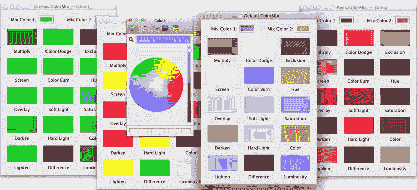
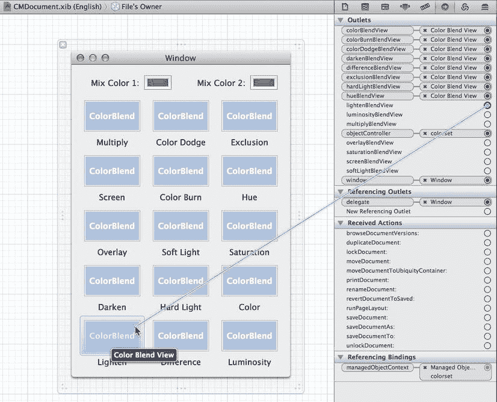
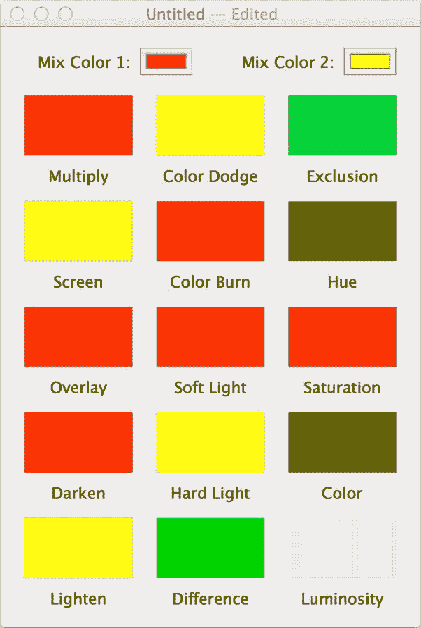

# 12. 基于文档的应用程序

## 摘要

到目前为止，我们在本书中构建的应用程序都有一个共同的重大缺陷：它们的行为方式都类似于"全有或全无"。对于应用程序使用的某个特定数据（如果它确实使用了存储），要么它存在于唯一的后端存储中，要么它根本不存在于任何地方。这些应用程序都没有提供任何概念，允许我们将数据分割成我们称之为"文档"的、离散且互不相关的存储单元。虽然将所有内容放在一个数据库中对某些目的有好处，但对其他目的而言却是一个巨大的障碍。如果我们想只与某人分享部分数据该怎么办？如果我们想能够并排地在多个窗口中查看同一种 Core Data 实体的多个详情，以便进行比较，该怎么办？大多数人都通过使用几乎任何支持同时打开多个文档、且对一个文档的操作不会影响其他文档的现代应用程序，熟悉了这些可能性。

事实证明，苹果公司的高管们多年前就考虑到了这一点，并将文档支持直接构建到了 Cocoa 中，其核心是 `NSDocument` 和 `NSDocumentController` 类。Cocoa 的文档架构为我们提供了大量基础设施，否则我们不得不自行构建，例如管理窗口及其标题栏、处理打开面板和保存面板等等。如果你的应用程序使用了 Core Data，它甚至会自行处理实际的打开和保存操作，因此你的应用程序代码甚至无需接触文档文件。

本章将通过创建一个名为 `ColorMix` 的应用程序，介绍如何创建基于文档的 Cocoa 应用程序的基础知识，包括使用 Core Data。`ColorMix` 允许用户使用标准系统颜色面板选择两种颜色，然后显示一个色样网格，展示将这两种颜色混合在一起的不同方法。每组选定的两种颜色（以及其 15 种混合颜色）都可以保存到一个文档中，该文档就像任何其他文件一样，可以保存到你喜欢的任何位置，并在以后重新打开。在学习 Cocoa 如何处理文档的同时，我们还将构建一个简单的视图类，用于绘制彩色矩形，并在代码中与 Core Data 交互。图 12-1 展示了 `ColorMix` 应用程序完成后的样子。



**图 12-1.** 完成后的 ColorMix 应用程序

如果你使用过 Photoshop 或 Gimp 等图形软件，你可能已经熟悉其中一些混合模式。每种模式都使用特定的公式，取两种颜色的红、绿、蓝分量，并生成一种输出颜色。我们在此不描述混合模式，但你可以在 [`http://en.wikipedia.org/wiki/Blend_modes`](http://en.wikipedia.org/wiki/Blend_modes) 和其他地方找到它们的详细描述和示例。我们在这里要做的是，展示如何构建一个应用程序，让用户以实践的方式探索所有这些模式，每次针对两种选定的颜色。

我们将使用的混合模式都内置于 Core Graphics 中，这是 Cocoa 图形架构的重要组成部分，我们将在第 13 章中进一步讨论。使用这种内置功能让我们可以免去自行进行任何颜色计算；我们只需调用 Core Graphics 函数来设置混合模式并绘制矩形即可。

## 创建 ColorMix 应用程序

首先在 Xcode 中创建一个新应用程序，使用新建项目向导中 "OS X / 应用程序" 部分的 Cocoa 应用程序模板。点击 "下一步" 后，将新应用程序命名为 `ColorMix`，并将类前缀设置为 `CM`。这个新应用程序将同时使用 `NSDocument` 架构和 Core Data，因此我们需要在创建应用程序时正确配置项目。确保勾选了 **创建基于文档的应用程序** 和 **使用 Core Data** 复选框。请注意，启用文档复选框也会激活 **文档扩展名** 文本字段。这允许我们设置应用程序在保存文件时将使用的默认文件名扩展名。在此处也输入 `ColorMix`，以便我们能够轻松识别创建的文档。

`ColorMix` 应用程序将有一些我们之前未见过自动创建的内容。特别是，它将有一个名为 `CMDocument` 的类（`NSPersistentDocument` 的子类，而 `NSPersistentDocument` 本身是 `NSDocument` 的子类，我们稍后会解释这两个类），以及一个对应的 `CMDocument.xib` 资源。这是我们扩展以定义文档行为和外观的两个关键元素。除此之外，我们还会看到一个模型文件，我们将在其中设置此应用程序的 Core Data 实体和属性信息。

### 检查默认的 Nib 文件

在我们开始创建任何内容之前，请在 Interface Builder 中打开 `MainMenu.xib` 文件。注意到这个 nib 文件与我们之前创建的所有其他 `MainMenu.xib` 文件有何不同吗？它不包含窗口！打开文件会显示各种代理对象、菜单本身，仅此而已。这是另一个提示，表明我们在创建基于文档的应用程序时面对的是不同类型的东西，因为这样的应用程序（例如 Xcode、Microsoft Office、Garage Band 等）通常没有"主窗口"的概念，而是将应用程序的主体放在一个或多个文档窗口中。

打开连接检查器，花一些时间点击一些菜单项，看看它们是如何连接的。文件菜单中的许多项都连接到第一响应者，调用名称中包含"document"（`newDocument:`、`openDocument:` 等）的操作。事实证明，其中一些操作是在 `NSDocumentController` 类中实现的。这是一个特殊的类，在运行时有一个共享的实例，用于管理应用程序所有打开的文档。我们不会在这个 nib 文件或任何其他地方看到这个共享实例，甚至看不到它的代理。`NSApplication` 在应用程序启动期间创建此对象，并将其添加到响应者链中，以便它可以处理这些操作。

四处查看之后，我们基本上可以忘记这个应用程序的 `MainMenu.xib`，因为我们永远不需要再打开它。请记住，其中唯一的实际内容是菜单，并且大多数菜单项都连接到第一响应者上的操作，这意味着它们会在适当的时候找到通往相关窗口控制器或共享 `NSDocumentController` 的路。

现在打开 `CMDocument.xib`，看看它提供了什么。一个 `NSWindow` 已准备好供我们填充一些内容，如果我们打开身份检查器，会发现文件所有者是 `CMDocument` 的一个实例。除此之外，它是一块白板，我们稍后将在其上留下我们的印记。


### 定义模型

在开始构建任何类型的图形界面之前，我们先创建用于表示文档的数据模型。这是一个极其简单的模型，包含一个实体和两个属性。我们将在每个文档中只创建该实体的一个实例，但你在本章学到的关于文档的所有知识，同样适用于大型复杂的数据模型。

打开 `CMDocument.xcdatamodeld` 文件。创建一个实体并将其命名为 `ColorSet`。保持新实体的选中状态，创建一个属性，命名为 `color1`，将其类型设置为 `Transformable`，然后点击关闭可选复选框。接着创建第二个属性，命名为 `color2`，并按第一个属性进行相同配置：类型为 `Transformable`，且可选选项应关闭。这些属性代表用户将为每个文档选择的两种颜色。它们各自包含一个 `NSColor` 实例，这不是 Core Data 支持的标准类型之一，因此如第 8 章所述使用了 `Transformable` 类型。

保存模型，我们的工作就完成了。这是一个极其简单的模型，不是吗？

### 设置两种颜色

现在是时候开始组装图形界面了。请记住，这发生在文档窗口中，因此请切换回 Interface Builder 中的 `CMDocument.xib` 文件。默认窗口包含一个 `NSTextField`（内容为"Your document contents here"），我们应在继续之前将其删除。接下来，我们将向 nib 文件添加一个 `NSObjectController`，用于将一些图形界面对象连接到底层文档。请按照以下步骤进行设置。

使用库面板找到 `NSObjectController`，将其拖放到停靠栏中，它将与文件所有者、窗口以及其他顶层对象合并。保持这个新对象（现在标记为"Object Controller"）的选中状态，打开属性检查器。检查器最顶部是模式弹出菜单。将其从类模式更改为实体名称模式，然后在下方出现的实体名称字段中输入"ColorSet"。

保持新对象控制器的选中状态，切换到绑定检查器。我们需要通过将其 `managedObjectContext` 绑定到一个合适的值来告知此控制器数据来源，因此在参数标题下找到托管对象上下文项。如果此绑定的详细信息不可见，请点击其展开三角形以显示它们。使用绑定到弹出菜单选择文件所有者，然后在模型键路径文本字段中输入"managedObjectContext"，按回车键创建绑定。作为此对象控制器的最后优化步骤，在停靠栏中选中它并将其名称更改为"colorset"。这不会在应用程序运行时改变任何内容，但能为将来查看此 nib 文件的程序员（很可能就是你）增加清晰度（现在边做边记录文档，将来你会感谢自己的）。

### 最简单的图形界面

是时候构建一个简单的图形界面了，让我们能够查看 `ColorSet` 对象的核心细节，即它包含的两种颜色。使用库找到 `UILabel` 对象，将其拖入窗口。选中其文本，将其更改为 `混合颜色 1`。然后按 `⌘D` 复制标签，将其稍微移开，并将文本更改为 `混合颜色 2`。现在在库中找到 `NSColorWell`，将其拖到我们正在构建的文档窗口中。放置好后，按 `⌘D` 复制它，然后重新排列标签和颜色选择器，使其看起来类似于图 12-2。


图 12-2 选择两种颜色的最简图形界面

现在选中左侧的颜色选择器，打开绑定检查器，将其值绑定配置为使用 `colorset` 控制器，控制器键为 `selection`，模型键路径为 `color1`。选中右侧的颜色选择器，将其值绑定配置为使用 `colorset` 控制器，控制器键为 `selection`，这次模型键路径为 `color2`。保存工作，然后点击运行按钮。应用程序启动，出现一个新的空白"无标题"文档窗口，但颜色选择器无法点击！由于急于在屏幕上显示内容，我们忽略了一个非常重要的步骤：创建一个模型对象！

### 创建默认 ColorSet

我们需要编写一些代码，以便在创建新文档时向对象控制器插入一个新的 `ColorSet` 对象。我们将在 `CMDocument` 类中通过添加一些功能来实现这一点，这些功能用于访问我们在 nib 文件中添加的对象控制器，并跟踪文档是从头创建还是从文件加载的。选择将添加此新代码的 `CMDocument.m` 文件。首先，我们将添加一个属性，一个名为 `objectController` 的插座，用于指向我们刚才添加到 nib 文件中的 `NSObjectController`。与其将其添加到头文件中，我们可以使用类扩展在 `.m` 文件中声明此属性。类扩展看起来就像类别声明，但括号中没有类别名称。将以下代码添加到 `@implementation` 块之前：

```
@interface CMDocument ()

@property (weak) IBOutlet NSObjectController *objectController;

@end
```

任何我们可以在类的 `@interface` 块中声明的内容（实例变量、属性、方法等）都可以在类扩展中声明。这样做的好处是保持类接口的简洁。我们可以选择只公开其他类真正需要的那部分，而将剩余部分作为仅在类内部可用的私有 API。

我们还将添加一个实例变量，一个名为 `isNew` 的 `BOOL` 类型变量，用于跟踪每个文档是刚创建的还是从文件加载的。沿着刚才使用类扩展时遵循的信息隐藏路径，我们将展示另一个巧妙技巧：实例变量可以在类的 `@implementation` 块中声明，而不是在头文件的 `@interface` 中。通过添加以下加粗代码来实现：

```
@implementation CMDocument
{
    BOOL isNew;
}
```

现在快速浏览一下此 `.m` 文件的其余部分。该文件包含一些现成的方法，并附有注释说明我们可以在何处扩展其行为。我们将在 `init` 和 `windowControllerDidLoadNib:` 方法中实现一些功能，同时实现 `initWithType:error:` 方法，稍后将对此进行说明。这里预定义的方法都来自 `NSDocument`，它为我们处理了大部分与文档相关的功能。然而，`CMDocument` 的直接父类是 `NSPersistentDocument`，它实现了将文档存储为 Core Data 存储后端所需的额外功能。首先添加以下方法：

```
- (id)initWithType:(NSString *)typeName error:(NSError **)outError
{
    if (self = [super initWithType:typeName error:outError]) {
        isNew = YES;
    }
    return self;
}

- (NSString *)windowNibName
{
    return @"CMDocument";
}
```

然后，将以加粗显示的行添加到 `windowControllerDidLoadNib:` 方法中：

```
- (void)windowControllerDidLoadNib:(NSWindowController *)windowController
{
    [super windowControllerDidLoadNib:windowController];
    // 在此处添加需要在 windowController 加载文档窗口后执行的任何代码。

    if (isNew) {
        id newObj = [_objectController newObject];
        [newObj setValue:[NSColor redColor] forKey:@"color1"];
        [newObj setValue:[NSColor yellowColor] forKey:@"color2"];
        [_objectController addObject:newObj];
    }
}
```


## 排版后的文本

加粗的代码段在创建新文档时执行。第一个方法 `initWithType:error:` 仅在从头创建新文档时被调用。这是我们理想中初始化模型对象的地方，但对模型对象的所有访问都需通过位于 nib 文件中的 `NSObjectController` 进行，而此时 nib 尚未加载。因此，我们仅将 `isNew` 标志设置为 `YES`，然后继续执行。稍后，在 nib 加载完成后，`CMDocument` 会调用 `windowControllerDidLoadNib:`。在这里，我们使用 `objectController` 创建一个新的模型对象，为其两个属性设置值，并将新对象添加到控制器中。

完成上述设置后，剩下的工作就是将 `CMDocument` 的 `objectController` 插座连接到 `CMDocument.xib` 中。因此，切换回该文件，按住 Control 键从“文件所有者”拖拽到颜色集对象控制器，然后选择 `objectController` 插座。保存工作，然后点击运行按钮。两个颜色井中的红色和黄色应该可见，点击其中任意一个应会弹出颜色面板并允许我们更改颜色。

不仅如此，现在还可以通过菜单使用全套文档功能。我们可以保存文档、关闭文档、访问最近使用的文档、打开文档等。

## 确定文件格式

到达这一步后，您可能已经注意到，在保存文档时，一个弹出列表允许您选择将文件保存为二进制、SQLite 或 XML 格式，并且文件扩展名会相应设置。尽管这种灵活性在开发过程中可能有用，但对于发布的产品，您最好只选择一种格式并坚持使用，以免混淆用户。通常，SQLite 对于大多数应用来说可能是最佳选择。您还应该将文件扩展名更改为能体现应用用途的名称，而不是使用默认扩展名。所有这些选项都在 Xcode 的目标设置中配置。返回 Xcode，在导航窗格中选择最顶层的 `ColorMix` 组，点击 `ColorMix` 目标，然后点击视图顶部的“信息”标签以查看目标设置。展开“文档类型”组，会看到一个包含所有三种预配置文件格式的视图。删除二进制和 XML 选项（使用每个部分右上角的“x”按钮），仅保留 SQLite 选项。通过编辑“扩展名”列中显示的值，将此保留格式设置一个合适的文件名扩展名，将其更改为 `ColorMix`。现在保存工作，构建并运行，然后保存一个颜色集，验证我们现在已无法选择保存文件的格式类型。

## 添加颜色

现在文档功能已按预期工作，但我们拥有的是一个非常无聊的应用，它什么有趣的事情也做不了。让我们让应用实现本章开头承诺的功能：使用 Core Graphics 所有预定义的混合模式，显示通过混合两种选定颜色生成的一系列颜色。

为此，我们将创建一个名为 `CMColorBlendView` 的新类，它将直接成为 `NSView` 的子类。在 `NSView` 子类中，通常会做的主要事项之一是重写 `drawRect:` 方法，以精确指定应绘制的内容。我们将执行此操作，并用混合颜色填充每个视图。为了实现混合，`CMColorBlendView` 的每个实例都需要知道要使用的混合模式以及要混合的两种颜色。我们将手动为每个 `CMColorBlendView` 设置混合模式，但两种颜色的值将通过 Cocoa 绑定进行填充，这样一旦用户更改了其中一种选定颜色，窗口中所有的 `CMColorBlendView` 对象都会立即重绘。

### CMColorBlendView 类

首先在我们的项目中创建一个新类。在“新建文件”向导中，从“OS X - Cocoa”部分选择“Objective-C 类”，然后点击“下一步”。将新类命名为 `CMColorBlendView.m`，并使其成为 `NSView` 的子类。

现在编辑 `CMColorBlendView.h`，添加以下所示加粗的行：

```
#import <Cocoa/Cocoa.h>

@interface CMColorBlendView : NSView

@property (strong, nonatomic) NSColor *color1;
@property (strong, nonatomic) NSColor *color2;
@property (assign, nonatomic) CGBlendMode blendMode;

@end
```

这为我们的类提供了两个 `NSColor` 对象（将通过 Cocoa 绑定填充）和一个 `CGBlendMode`（将在 `MyController` 类加载 nib 文件时设置）。我们对所有这些属性使用了 `nonatomic` 关键字，这是一种声明方式，表示这些属性的 getter 和 setter 方法不会采取额外措施来保证线程安全。由于我们知道在这个简单应用中，所有代码都只会在主线程上使用，因此使用 `nonatomic` 足够安全，并且能带来略微更好的性能。

现在切换到 `CMColorBlendView.m`，我们首先要做的是为已声明的属性定义方法。本书中之前声明的大多数属性，其方法都是通过显式的 `@synthesize` 行创建的，但这里情况有点特殊，因为我们希望视图在每次属性值更改时都重绘自身。因此，我们将为每个属性提供显式的 setter 方法。如果存在显式方法，它们总是会取代任何合成的方法。实际上，这也引出了我们在属性声明中使用 `nonatomic` 的另一个原因：如果没有它，编译器不允许我们将合成的 getter 与显式的 setter 混合使用，从而会产生警告。

在我们进行所有这些新操作的同时，我们将介绍 LLVM 编译器中的一个漂亮的新功能。任何时候我们在接口中声明一个属性，实际上都可以完全省略 `@synthesize` 行！如果我们这样做，编译器仍然会为我们创建一个实例变量，其名称将是属性名前加下划线。我们可以在以下代码中看到这一点，这段代码应添加到我们类的 `@implementation` 部分：

```
// 将这些放在 @implementation 块的开始处

- (void)setBlendMode:(CGBlendMode)bm
{
    if (_blendMode != bm) {
        _blendMode = bm;
        [self setNeedsDisplay:YES];
    }
}

- (void)setColor1:(NSColor *)c
{
    if (![c isEqual:_color1]) {
        _color1 = c;
        [self setNeedsDisplay:YES];
    }
}

- (void)setColor2:(NSColor *)c
{
    if (![c isEqual:_color2]) {
        _color2 = c;
        [self setNeedsDisplay:YES];
    }
}
```

需要注意的一点是 `[self setNeedsDisplay:YES]` 调用。我们将在后面关于 Cocoa 绘图的章节中更详细地讨论这一点，但其基本思想是，当我们要在 `NSView` 中绘制一些内容时，会调用此方法，该方法会设置一个标志，而当我们的应用程序完成处理当前正在处理的任何事件后，它会遍历打开的窗口以检查是否有任何窗口被标记为需要重绘，这最终会导致调用 `drawRect:` 方法。

说到这个，我们在这个类中需要实现的另一个方法就是 `drawRect:` 方法本身。

```
- (void)drawRect:(NSRect)dirtyRect
{
    // 如果没有两个有效的颜色，则不绘制任何内容。
    if (!self.color1 || !self.color2) return;

    CGColorRef cgColor1 = genericRGBWithNSColor(self.color1);
    CGColorRef cgColor2 = genericRGBWithNSColor(self.color2);

    CGContextRef myContext = [[NSGraphicsContext currentContext] graphicsPort];
    CGContextSaveGState(myContext);

    CGContextSetFillColorWithColor(myContext, cgColor1);
    CGContextSetBlendMode(myContext, kCGBlendModeNormal);
    CGContextFillRect(myContext, NSRectToCGRect(dirtyRect));

    CGContextSetFillColorWithColor(myContext, cgColor2);
    CGContextSetBlendMode(myContext, self.blendMode);
```


```markdown

```
CGContextFillRect(myContext, NSRectToCGRect(dirtyRect));
```

```
CGContextRestoreGState(myContext);
```

```
CGColorRelease(cgColor1);
```

```
CGColorRelease(cgColor2);
```

```
}
```

请尽量别纠结于此处的细节。只要您阅读了注释并相信代码确实按照注释所述运行即可。在后续几章处理图形时，我们还会深入探讨。到那时，这些内容就会更容易理解。目前请注意，在完成下一步之前，这段代码会产生一些编译器错误。

为了让这个类能够正常工作，还需要添加一个转换例程，以便将用户在颜色面板中选择的`NSColor`转换为 Core Graphics 函数所需的`CGColorRef`类型。不知何故，Cocoa 并未提供任何单行函数或方法调用来实现此功能，但下面的函数巧妙地完成了任务。请将其插入`.m`文件顶部附近。放在`drawRect:`方法之前的任何位置均可，但为了保持结构清晰，建议将其放在`@implementation`块的上方，以明确表明该函数不属于该类。

```
static CGColorRef genericRGBWithNSColor (NSColor *color)
{
    CGColorRef cgColor = NULL;
    NSColorSpace *nsColorSpace = [NSColorSpace genericRGBColorSpace];
    NSColor *deviceRGBColor = [color colorUsingColorSpace: nsColorSpace];
    if (deviceRGBColor != nil) {
        CGFloat components[4];
        [deviceRGBColor getRed: &components[0] green: &components[1]
                          blue: &components[2] alpha: &components[3]];
        cgColor = CGColorCreate([nsColorSpace CGColorSpace], components);
    }
    return cgColor;
}
```

完成上述步骤后，`CMColorBlendView`类就编写完毕了。保存工作并点击构建，应该可以顺利编译。此处之所以要求您点击构建，只是为了确保到目前为止没有拼写错误。由于尚未设置 GUI，现在点击“构建并运行”是没有意义的。

## 向 GUI 添加混合颜色

现在是将混合颜色色板添加到文档窗口的时候了。首先，在`CMDocument.h`文件中为每个色板添加一个出口（outlet）。这里显示的每个新出口最终都将连接到`CMColorBlendView`的实例。我们还在文件顶部附近添加了一行`@class`声明，这仅仅是告诉编译器下一个标记（`CMColorBlendView`）是一个类的名称。有了这些信息，编译器就能处理指向该类实例的实例变量和方法参数，而无需导入该类的头文件本身。在头文件中始终使用这种前向声明，而不是`#import`，可以略微缩短编译时间，并且使头文件更稳健，因为它们之间的依赖关系更少。然而，在实现文件中，由于我们要在这些类上调用方法，则需要导入头文件。

```
#import <Cocoa/Cocoa.h>
@class CMColorBlendView;

@interface CMDocument : NSPersistentDocument
@property (weak) IBOutlet CMColorBlendView *multiplyBlendView;
@property (weak) IBOutlet CMColorBlendView *screenBlendView;
@property (weak) IBOutlet CMColorBlendView *overlayBlendView;
@property (weak) IBOutlet CMColorBlendView *darkenBlendView;
@property (weak) IBOutlet CMColorBlendView *lightenBlendView;
@property (weak) IBOutlet CMColorBlendView *colorDodgeBlendView;
@property (weak) IBOutlet CMColorBlendView *colorBurnBlendView;
@property (weak) IBOutlet CMColorBlendView *softLightBlendView;
@property (weak) IBOutlet CMColorBlendView *hardLightBlendView;
@property (weak) IBOutlet CMColorBlendView *differenceBlendView;
@property (weak) IBOutlet CMColorBlendView *exclusionBlendView;
@property (weak) IBOutlet CMColorBlendView *hueBlendView;
@property (weak) IBOutlet CMColorBlendView *saturationBlendView;
@property (weak) IBOutlet CMColorBlendView *colorBlendView;
@property (weak) IBOutlet CMColorBlendView *luminosityBlendView;
@end
```

现在回到`CMDocument.xib`，将窗口放大到大约 350×500，并将两个颜色选择器保留在顶部。在对象库中找到`自定义视图`（实际上是一个普通的`NSView`实例），将其拖入窗口，并使用身份检查器将其类更改为`CMColorBlendView`。然后使用大小检查器将`CMColorBlendView`调整为约 90×50。由于需要知道视图代表哪种混合模式，因此从对象库中拖一个标签到窗口中，放在`CMColorBlendView`的正下方。使用控制手柄使标签与其上方的视图宽度相同，并使用属性检查器将标签文本居中（参见图 12-3）。


**图 12-3.** 放置第一个`CMColorBlendView`

同时选中`CMColorBlendView`和标签，按⌘D 组合键进行复制，并将新复制的一组向右对齐。再次按⌘D 组合键，将新的一组继续向右对齐。现在选中全部三个`ColorBlendView`和全部三个标签，按⌘D 组合键，并将新复制的一组放在原有组的下方。重复此操作，直到有五行、每行三个标签。然后依次设置所有标签的标题，如图 12-4 所示。


**图 12-4.** 即将呈现混合颜色的网格布局

```


布局就绪后，接下来就是大量的连接工作了。最简便的方法是调出连接检查器（Connections Inspector），然后选择“文件所有者”对象，该对象是我们文档类的代理。这样做会在检查器中显示文档的所有输出口。只需根据标签名称的指引，从每个输出口的圆圈拖拽至我们在窗口中创建的对应`CMColorBlendView`即可，如图 12-5 所示。



图 12-5.

连接列表大概进行到一半时，事情终于开始明朗起来！

接下来，需要返回`CMDocument.m`文件。我们将添加代码，为每个`CMColorBlendView`配置正确的混合模式，并手动配置绑定，以便用户拾取颜色时，每个`CMColorBlendView`都能随之更新。首先，导入`CMColorBlendView`类的头文件，以便调用其方法。在`CMDocument.m`顶部附近添加以下这行代码：

```
#import "CMColorBlendView.h"
```

然后，按如下所示修改`windowControllerDidLoadNib:`方法：

```
- (void)windowControllerDidLoadNib:(NSWindowController *)windowController
{
    [super windowControllerDidLoadNib:windowController];
    if (isNew) {
        id newObj = [_objectController newObject];
        [newObj setValue:[NSColor redColor] forKey:@"color1"];
        [newObj setValue:[NSColor yellowColor] forKey:@"color2"];
        [_objectController addObject:newObj];
    }
    _multiplyBlendView.blendMode = kCGBlendModeMultiply;
    _screenBlendView.blendMode = kCGBlendModeScreen;
    _overlayBlendView.blendMode = kCGBlendModeOverlay;
    _darkenBlendView.blendMode = kCGBlendModeDarken;
    _lightenBlendView.blendMode = kCGBlendModeLighten;
    _colorDodgeBlendView.blendMode = kCGBlendModeColorDodge;
    _colorBurnBlendView.blendMode = kCGBlendModeColorBurn;
    _softLightBlendView.blendMode = kCGBlendModeSoftLight;
    _hardLightBlendView.blendMode = kCGBlendModeHardLight;
    _differenceBlendView.blendMode = kCGBlendModeDifference;
    _exclusionBlendView.blendMode = kCGBlendModeExclusion;
    _hueBlendView.blendMode = kCGBlendModeHue;
    _saturationBlendView.blendMode = kCGBlendModeSaturation;
    _colorBlendView.blendMode = kCGBlendModeColor;
    _luminosityBlendView.blendMode = kCGBlendModeLuminosity;

    NSArray *allBlendViews =
        @[_multiplyBlendView, _screenBlendView, _overlayBlendView,
          _darkenBlendView, _lightenBlendView, _colorDodgeBlendView,
          _colorBurnBlendView, _softLightBlendView, _hardLightBlendView,
          _differenceBlendView, _exclusionBlendView, _hueBlendView,
          _saturationBlendView, _colorBlendView, _luminosityBlendView];

    for (CMColorBlendView *cbv in allBlendViews) {
        [cbv bind:@"color1"
          toObject:_objectController
          withKeyPath:@"selection.color1"
              options:nil];
        [cbv bind:@"color2"
          toObject:_objectController
          withKeyPath:@"selection.color2"
              options:nil];
    }
}
```

这段代码的第一部分逐个为每个视图设置了混合模式。第二部分则为每个`CMColorBlendView`配置了绑定。由于所有视图的绑定方式相同，我们遍历一个包含所有`ColorBlendView`的数组（在`for`循环前临时创建），并为每个视图执行绑定操作。

这确实是我们第一次要求大家在代码中进行大量的 GUI 配置。使用 Cocoa 内置的对象，可以在 Interface Builder 中直接完成很多配置，但对于自定义类来说，事情并不总是那么直接。

请注意，`bind:toObject:withKeyPath:`的调用与在 Interface Builder 中配置绑定实现了相同的效果。实际上，你在 Interface Builder 中配置的每个绑定更像是一个动词而非名词。当你的应用程序加载包含绑定的 nib 文件时，每个保存的绑定都会触发一个如你所见的调用。同样要注意的是，在 Interface Builder 中表示为“控制器键”和“模型键路径”的内容，最终会被合并成一个单一的字符串，用于`bind:toObject:withKeyPath:`调用。

好了，理论部分就先讲到这里。现在保存工作，点击“运行”，你应该会看到类似图 12-6 的画面。



图 12-6.

终于，我们看到了混合后的颜色。如果你正在看这本纸质书的黑白印刷版，请自行脑补这里有一片令人眼花缭乱的色彩。

点击其中一个颜色井，打开颜色面板，然后在其中拖动滑块，你就会发现所有 15 个混合色都会与你正在设置的颜色同步更新。非常酷！

现在，应用程序已成功启动并运行。我们可以使用标准菜单项来创建多个文档，为每个文档指定不同的颜色，保存文档，关闭文档，管理它们的窗口等等。Cocoa 的文档架构负责处理实例化文档和文档控制器、加载 nib 文件、使用保存面板等细节。所有这些功能都可以由开发者进行增强（例如，我们可以通过多种方式自定义文档的保存过程），但即便只使用开箱即用的基本功能，我们也能完成很多工作。

## 关于撤销和重做

在这一点上，我们应该提一下`NSUndoManager`，它负责处理 Cocoa 中的撤销/重做支持。请注意，我们在 ColorMix 中执行的操作（实际上只是改变颜色）都可以通过“编辑”菜单中的项目进行撤销和重做。此外，这些撤销和重做操作是针对特定文档的；在一个文档中进行更改和撤销，与其他文档中发生的任何事情完全独立。然而，可能不太清楚的是，究竟是什么在启用这个功能；我们并没有编写任何处理撤销和重做的代码，但它确实存在。简而言之：在一个 Core Data 应用程序中，基本的撤销/重做通常由系统为我们处理，我们无需做任何事。处理模型对象的托管对象上下文能够在对象被编辑时察觉到变化，并向“撤销堆栈”添加一个逆操作。其结果是，对于大多数现代的 Cocoa 应用程序，我们可以免费获得撤销和重做功能。

然而，这是一本关于编程的书，而不是罗列框架酷炫特性的书。至少，我们需要了解底层部件是如何工作的一些皮毛，这样我们在必要时才能知道在哪里进行调整。因此，这里是一个关于撤销/重做支持如何在 Cocoa 中工作，以及 Core Data 和`NSDocument`如何协同使其自动运行的速成课程。


### 撤销栈

许多程序员可能从未深入思考过应用程序中撤销和重做功能的典型实现方式。这已成为一种被普遍接受和期待的机制，以至于人们觉得它就像是自然秩序的一部分。基本前提如下：每次在应用中编辑内容时，都需要创建一个代表该编辑操作反向操作的条目。因此，如果用户在文本末尾添加了字母"X"，就需要有一段代码来创建相反的操作，即一个能够删除这个"X"的操作。这个表示被放置在某处的同类条目栈中（即"撤销栈"）。执行"撤销"命令时，会从撤销栈顶部弹出最近的条目，并执行其所描述的操作。同时，执行撤销命令还会创建另一个条目，即撤销栈中反向操作的反向操作（实际上就是原始编辑操作），并将其放置在"重做栈"上，以备用户之后想要撤销这次的撤销操作。

这种架构存在多种变体，例如限制栈的大小，或根本不使用栈而只保留单个撤销条目，但在大多数平台上基本架构都非常相似。Cocoa 实现这一功能的一个特别之处在于，它并非以某种特殊形式表示每个撤销条目（这种形式后续需要用特定方式解码），而是通过目标对象、要调用的方法选择器以及所需的任何参数来隐式构建每个撤销条目。当撤销命令被触发时，无需任何解码或查找操作，该方法就像其他 Objective-C 方法一样被直接调用。

让我们看一个例子。假设以下方法位于一个包含可设置名称的类中：

```
- (void)setName:(NSString *)newName {
    if (![newName isEqual:name]) {
        name = newName;
    }
}
```

现在设想我们希望使设置名称这一操作变得可撤销。这可以通过添加以下加粗显示的行轻松实现：

```
- (void)setName:(NSString *)newName {
    if (![newName isEqual:name]) {
        NSUndoManager *undoManager = ...
        [undoManager registerUndoWithTarget:self
                selector:@selector(setName:)
                object:name];
        [undoManager setActionName:@"Name Change"];
        name = newName;
    }
}
```

请注意，我们省略了实际获取撤销管理器的代码部分。在实际应用中，撤销管理器可能来自多个位置，具体取决于应用是否支持 Core Data 和 `NSDocument`。在 Core Data 应用中，我们可以随时向共享的 `NSManagedObjectContext` 对象请求一个撤销管理器；在同时支持 Core Data 和文档的应用中，每个文档都有自己的撤销管理器。

这种模式的最终体现出现在 Core Data 应用中，它实际上替我们实现了类似上述的功能。注意上面的 `setName:` 方法相当公式化。Core Data 在幕后实现了一些魔法，使得我们不必实现那个 `setName:` 方法。一旦模型对象发生任何编辑，Core Data 就会察觉并为我们设置好撤销操作。

## 总结

我们刚刚从头创建了第一个基于 `NSDocument` 的应用程序。我们还学习了一些关于向 `NSView` 绘图以及处理颜色的知识，这些对于各种应用领域都是有用的技能。在后续章节中，我们将进一步深化这些技能，尤其是那些 Cocoa 真正大放异彩的有趣图形编程。然而，在下一章中，我们得暂别这些乐趣，学习当应用中出现问题时会发生什么——以及如何使用 `NSError` 和 `NSException` 来处理它们。

