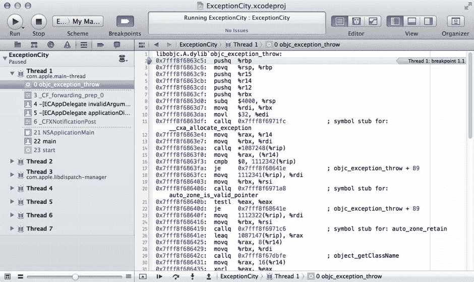
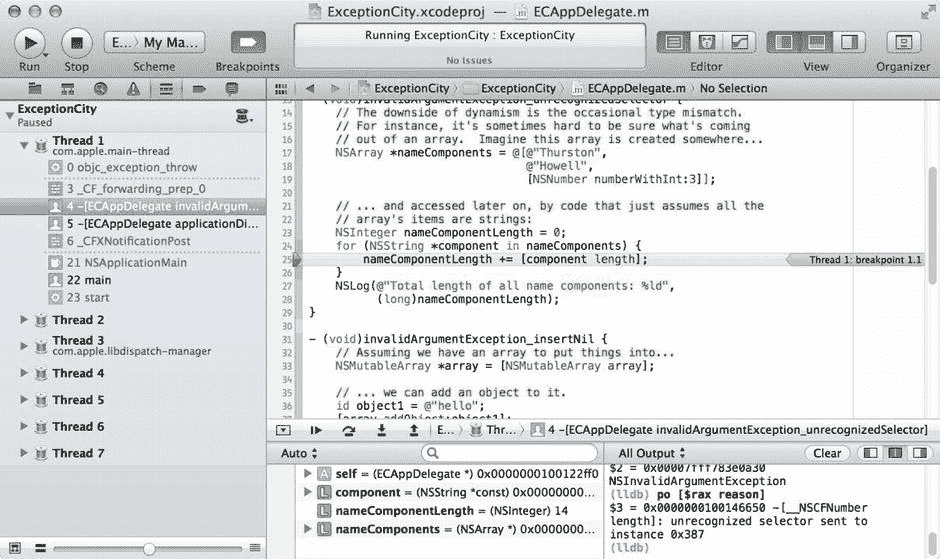

# 13. 异常、信号、错误与调试

**摘要**

任何做过编程的人都知道，事情有时并不会按计划进行。你忘记处理某个特定的边界情况，或者系统调用以一种你从未想到的方式失败，突然之间你的程序就在你面前崩溃了。每种编程语言和开发环境都有处理这些问题的方法，Cocoa 也不例外。

本章将涵盖 Cocoa 用于创建和处理异常与错误的机制——这两个系统听起来相似，但在概念上却截然不同。我们将了解它们各自不同的使用方式、如何处理它们，以及如何自行触发它们。我们还将学习某些内存滥用如何导致信号发生，通常会导致崩溃。最后，我们会简要了解一下 Xcode 内置的调试器，它可以帮助我们应对这些问题。

## 异常处理

让我们从异常处理开始。异常是一种特殊对象，可以在程序的一个部分创建，以告知另一部分发生了问题；这被称为"抛出"异常，在代码中可能看起来像这样：

```
// 假设我们正在一个方法中，该方法有一个参数 "index"，
// 其值不能为负数。
if (index < 0) {
  [NSException raise:NSRangeException format:
    @"我无法承受这种负能量！（索引 == %d）", index];
}
```

在这个例子中，我们使用 `NSException` 类的类方法，在一步之内创建并抛出了一个异常。该方法的第一个参数是异常名称的字符串（这里使用的是 `NSRangeException`，它是 Cocoa 中预定义的异常名称），用于对异常进行通用分类。与许多其他异常处理环境不同，`NSException` 很少被继承，因此其名称用于区分不同类型的异常。我们传入的第二个参数是异常"原因"的格式字符串，这是一个人类可读的描述性字符串。此格式与我们可以传递给 `NSLog` 的参数列表类型相同，其中第一个是 `NSString`，其余参数根据字符串中的指定进行插值。


### 捕获异常

当上述代码执行时，如果 `index < 0`，程序的正常流程将被中断。程序不会继续执行该方法剩余部分，而是会沿着调用栈向下寻找一种被称为异常处理器的特殊代码结构。异常处理器会执行 `@try` 关键字后花括号内的所有代码，如果在执行过程中抛出了异常，执行流程将跳转到相邻的、以 `@catch` 关键字标记的代码块，并执行其中的代码。这被称为处理异常。最后，我们还可以选择性地包含一个以 `@finally` 关键字标记的第三个代码块，无论 `@try` 和 `@catch` 部分发生什么，它都会被执行，以执行任何必要的清理工作。

以下示例抛出了与之前相同的异常，但这次是在 `@try` 代码块中。我们在 `@catch` 代码块中捕获它并输出一条错误信息，然后继续执行 `@finally` 部分，该部分无论发生什么都会执行。在这个简单的例子中，我们并不需要 `@finally` 部分，完全可以省略它，但在某些资源在 `@try` 块中初始化并需要被释放的情况下，它会非常有用。

```
@try {
  if (index < 0) {
    [NSException raise:NSRangeException format:
      @"我无法承受这么多消极情绪！（索引 == %d）", index];
  }
}
@catch (NSException *e) {
  NSLog(@"遇到了异常 %@，原因为 %@",
    [e name],
    [e reason]);
}
@finally {
  // 我们这里实际上无事可做。
}
```

这个例子在抛出异常的同一个方法内处理了异常，但实际上这种情况相当少见。更常见的是，本地找不到异常处理器，系统便会遍历调用栈来寻找异常处理器，首先在当前方法的调用者中查找，然后是该方法的调用者，以此类推。这种搜索会沿着调用栈一直向下进行，直到找到异常处理器为止。如果找不到，则可以配置一个特殊场景来处理未捕获的异常。默认情况下，遇到未捕获异常的 Cocoa 应用会向控制台日志打印一些关于该异常的信息，然后尝试继续照常运行。

### 异常在 Cocoa 中的有限作用

在 Cocoa 中，异常用于在程序运行时不应发生的严重问题出现时，使方法脱离其正常的操作流程。一般来说，如果你的代码导致了异常被抛出，那就说明存在一个 Bug。除极少数例外情况，一个正确编写的 Cocoa 程序应该能够永远运行下去，而不会抛出任何异常。

如果你有 Java、Ruby、Python 或 C++ 的背景，这可能会显得有些限制性。在许多其他环境中，异常的使用更加自由，例如文件读取方法抛出异常来告诉调用者它已经读到了文件末尾（仔细想想，这根本就不是什么异常状态，因为每个文件都有结尾）。在 Python 中，一种遍历数组的常见写法是递增索引，尝试从数组中读取索引对应的值，并在读取越界时捕获由此产生的异常。然而，在 Cocoa 中，这种做法是不被提倡的，异常通常仅用于报告可能由程序 Bug 引起的意外结果。

由于异常在 Cocoa 中的作用相当有限，你很少会在 Cocoa 应用中看到大量的异常处理代码。与 Java 不同，Objective-C 不要求（甚至不允许）其方法指定它们可能抛出何种异常，并且理论上你根本不需要处理它们。默认情况下，你创建的每个 Cocoa 应用都会有一个顶层的异常处理器，它只是将有关异常的一些信息输出到系统日志，然后尽力让应用继续运行。不幸的是，这算不上什么好策略，因为应用在异常发生时正在做的事情，很可能是对上一次用户操作（点击按钮、按键等）的响应，而该操作之后应该做的其他事情就被直接跳过了，这可能会使应用处于未定义或不一致的状态！

某些应用会安装自己特殊的顶层异常处理器来处理这些情况。例如，Xcode 偶尔会遇到异常（是的，就连 Xcode 也有 Bug！），此时它通常会为用户提供退出应用的机会，因为它认识到某些东西可能已经乱套了。


### 创建测试平台

让我们构建一个小型应用程序，演示 Cocoa 程序员可能遇到的几种异常。在 Xcode 中，创建一个新的 Cocoa 应用程序（这次不涉及 Core Data 或文档），命名为“ExceptionCity”，并将类前缀设为“EC”。我们创建的应用程序将自动包含一个名为 `ECAppDelegate` 的类。

我们的应用程序委托将是一个非常简单的类，包含 `applicationDidFinishLaunching:` 委托方法，该方法会调用三个不同的“工具”方法，每个方法都演示了一个常见的 Cocoa 陷阱，这些陷阱可能导致运行时引发异常。如果这三个方法都能成功执行并返回，我们将看到一个祝贺性的警告面板（这正是我们一直想要的）。然而，每个工具方法都存在一个会引发异常的问题。我们的目标是找到并修复每个问题。以下是 `ECAppDelegate.m` 文件的完整内容：

```
#import "ECAppDelegate.h"

@implementation ECAppDelegate

- (void)invalidArgumentException_unrecognizedSelector {
    // 动态性的缺点在于偶尔会出现类型不匹配。
    // 例如，有时很难确定从数组中取出的到底是什么。
    // 想象这个数组是在某处创建的...
    NSArray *nameComponents = @[@"Thurston",
                                @"Howell",
                                [NSNumber numberWithInt:3]];
    // ... 并在稍后被访问，而代码只是假设数组中的所有项都是字符串：
    NSInteger nameComponentLength = 0;
    for (NSString *component in nameComponents) {
        nameComponentLength += [component length];
    }
    NSLog(@"所有名称组件的总长度：%ld",
          (long)nameComponentLength);
}

- (void)invalidArgumentException_insertNil {
    // 假设我们有一个用于存放内容的数组...
    NSMutableArray *array = [NSMutableArray array];
    // ... 我们可以向其中添加一个对象。
    id object1 = @"hello";
    [array addObject:object1];
    // 但假设我们有一个方法参数或实例变量，
    // 其值我们未检查以确保它不是 nil...
    id object2 = nil;
    // ... 然后尝试将其添加到数组中？
    [array addObject:object2];
    NSLog(@"已插入我能插入的所有对象！");
}

- (void)rangeException {
    // 假设我们有一个包含内容的数组...
    NSArray *array = @[@"one", @"two", @"three"];
    // ... 我们可以查询某个项的索引...
    NSUInteger indexOfTwo = [array indexOfObject:@"two"];
    // ... 稍后我们可以使用相同的索引来检索该值。
    NSLog(@"找到了索引项 %@", array[indexOfTwo]);
    // 但是，如果我们尝试查找某个不存在的项的索引呢？
    NSUInteger indexOfFive = [array indexOfObject:@"five"];
    // 并且我们忘记检查返回值以确保它不是 NSNotFound？
    NSLog(@"找到了索引项 %@", array[indexOfFive]);
}

- (void)applicationDidFinishLaunching:(NSNotification *)aNotification
{
    [self invalidArgumentException_unrecognizedSelector];
    [self invalidArgumentException_insertNil];
    [self rangeException];
    NSRunAlertPanel(@"成功", @"太棒了，你修复了所有问题！",
                    nil, nil, nil);
}

@end
```

运行这段代码。之前承诺的警告面板不会出现（但默认 nib 文件中包含的空窗口会出现）。不过，Xcode 的调试输出中会出现类似以下的内容：

`2013-02-07 00:25:12.756 ExceptionCity[43532:303] -[__NSCFNumber length]: 向实例 0x387 发送了无法识别的选择器`

如果你回头看 `invalidArgumentException_unrecognizedSelector` 方法及其注释，你大概能看出问题出在哪里：我们的数组中包含一个 `NSNumber`，它没有 `length` 方法，因此引发了异常。我们没有做任何明确处理异常的操作，结果这个异常一直沿着调用栈向下传递，最终未被处理，导致了前面提到的默认行为：记录异常的一些信息（具体来说是它的 `reason`），并且应用程序跳过当前事件的剩余部分。在这种情况下，正在处理的事件是应用程序启动，而此时启动已经完成。

如果我们没有特意向你指出那个方法，情况就不会这么清晰了。记录的异常信息没有告诉我们异常来自何处、异常的名称，或者任何有助于我们找到触发异常的代码部分的线索。这时，我们的新朋友——Xcode 调试器——就派上用场了。调试器允许我们为所有异常设置断点，这样我们就可以在异常引发的那一刻暂停程序，并尝试定位问题。

### 调试器

大多数开发者可能都熟悉调试器的概念，它允许你在应用程序运行时检查其状态，以便诊断问题。如果你之前没有接触过调试器，下面是对一些关键概念的快速介绍：

*   断点允许你指定程序应暂停的位置，可以是源代码中的行号，也可以是方法或函数的名称。你当前设置的所有断点都会显示在项目窗口左侧的断点导航器中。当程序在断点处停止时，你可以检查程序执行到该点时所有 CPU 寄存器的状态。如果你有程序的源代码，你还可以访问在该点相关的所有变量（局部变量、实例变量或其他变量）。所有 CPU 寄存器和可用的变量都会显示在项目窗口底部 Xcode 调试区域的表格视图中。
*   调用栈是某个时间点上所有正在运行的嵌套方法或函数的列表。这显示在项目窗口左侧 Xcode 调试导航器的表格视图中。当程序暂停时，当前的方法或函数显示在调用栈的顶部，调用它的方法或函数显示在其下方，以此类推。你可以选择调用栈中的特定项或“帧”来切换焦点，此时调试区域将显示当该方法或函数调用调用栈中上一级方法或函数时的 CPU 寄存器和变量状态。
*   调试器包含一些按钮，允许你对当前高亮显示的代码行执行某些操作。你可以“单步跳过”当前行（执行当前行的剩余部分，然后在下一行暂停），“单步进入”下一个方法或函数（在调用的下一个方法或函数的开头暂停），“单步跳出”当前方法或函数（在刚返回的调用者处暂停），或者“继续”或“停止”程序。
*   调试器包含一个名为 `lldb` 的命令行界面（它是历史上大多数基于 UNIX 的操作系统上标准的 `gdb` 命令的一个现代分支/重写），它允许你使用前面提到的所有功能，还可以执行任意代码并检查结果。你可以像在源代码中一样输入 C 函数和 Objective-C 方法的名称来调用它们，并使用正在运行的程序的变量值作为消息接收者和参数。

有关使用 Xcode 调试器的更多详细信息，请参阅 Xcode 文档中包含的《调试和优化你的应用》文档。


好的，作为一名高级文档工程师和翻译员，我将严格遵循您提供的注意事项和示例，为您翻译如下内容。


在 Xcode 中，通过选择 `View ➤ Navigators ➤ Show Breakpoint Navigator` 或按 `⌘6` 打开断点导航器。这会使导航面板显示所有当前断点（见图 13-1）。


图 13-1. Xcode 的断点导航器，显示了一些断点。第一次使用时，左侧列表为空。

断点导航器显示了 Xcode 为项目配置的所有断点。因为我们刚创建了一个新项目，列表应该是空的！我们将通过添加异常断点来改变这一点，以捕获应用中抛出的任何异常。记住，每个抛出的异常都是 bug 的结果，很可能是我们的 bug，我们应该抓住每一个机会停下来查看异常来源。

点击断点导航器左下角的 `+` 符号来创建新断点。会出现一个小弹出菜单，询问要创建哪种类型的断点。选择 `"Add Exception Breakpoint"`，然后会有一个更大的弹出视图显示新断点的选项。将 `Exception` 弹出菜单设置为 `Objective-C`，确保 `Break` 弹出菜单设置为 `On Throw`，然后点击 `Done`。

现在我们有了一个断点，它会在任何 Objective-C 异常抛出时停止 Xcode。完美！通过从菜单中选择 `Product ➤ Run` 重新启动 `ExceptionCity` 应用，如果它仍在运行则先退出。这次，当应用遇到问题代码时，它会在异常抛出处停止执行。图 13-2 大致展示了此时 Xcode 的样子。


图 13-2. Xcode 在断点处停止

左侧导航面板更改为调试导航器，并显示调用栈，顶部是我们断点位置（一个名为`objc_exception_throw`的函数，这是 Xcode 实际放置异常断点的地方），下方是所有调用者。注意，我们有源代码的帧以黑色文本显示，而封闭源代码库中的帧以灰色文本显示。灰色帧仍然可访问，但只能以汇编语言形式。通过查看左侧的帧编号序列，我们还可以看到并非所有帧都显示。默认情况下，Xcode 显示我们有源代码的帧，其他帧则压缩成水平虚线。我们可以使用调试导航器底部的水平滑块来更改此设置，根据需要显示更多或更少的帧。

项目窗口底部是调试区域，分为两部分。左侧显示所有可用变量和寄存器值，我们可以立即看到一些简单值。右侧显示 `lldb` 控制台界面，我们可以在其中查看程序输出（由 `NSLog` 等生成）并在 `lldb` 提示符下输入命令。如果您看不到底部视图，可以通过选择 `View ➤ Debug Area ➤ Activate Console` 使其显示。

主编辑器视图显示所选栈帧的源代码或编译后的汇编代码，并用箭头和高亮标记停止的行。

此时，在异常被抛出的那一刻停止，看看异常是什么将会很有趣。但怎么做呢？当 Xcode 暂停时，它指向包含我们源代码的最上层栈帧。那是我们程序中问题所在的位置，但我们无法在那“看到”异常。也就是说，那里没有局部变量或任何可访问的全局结构来显示异常本身。

相反，我们需要关注程序真正停止的最上层栈帧，即 `objc_exception_throw` 函数。点击它以查看详情。它看起来应该像图 13-3。



图 13-3. 源代码？谁需要它！

我们只看到一堆汇编代码，没有变量名或其他任何东西来指导我们。幸运的是，有一个我们可以利用的调用约定。在为 Mac OS X（64 位 Intel 硬件）编译的代码中，任何函数的返回值都临时存储在名为`rax`的 CPU 寄存器中，在 `lldb` 中可以通过名为`$rax`的特殊变量访问。当我们的程序在 `objc_exception_throw` 函数中停止时，`$rax` 寄存器恰好包含新的异常，所以我们准备好了！`lldb` 调试器包含 `po` 命令，用于以可读格式打印对象的值（它实际上调用对象的 `description` 方法，该方法返回一个 `NSString`，并打印该字符串值）。在 `lldb` 提示符下尝试以下操作：

```
(lldb) po $rax
$1 = 4296302928 -[__NSCFNumber length]: unrecognized selector sent to instance 0x387
```

看起来熟悉吗？这基本上和我们之前在输出中看到的文本相同。知道我们可以在这里访问 `NSException`，我们可以利用 `lldb` 的实时 Objective-C 方法执行来询问更多信息：

```
(lldb) po [$rax name]
$2 = 0x00007fff783e0a30 NSInvalidArgumentException
(lldb) po [$rax reason]
$3 = 0x0000000100136650 -[__NSCFNumber length]: unrecognized selector sent to instance 0x387
```

这里我们看到 `reason` 方法的返回值与 `description` 的返回值相同，但 `name` 方法返回的名称，你可能记得通常用作异常的类型或类别。在这种情况下，我们看到了 Cocoa 中最常见的异常类型之一：`NSInvalidArgumentException`。


### `NSInvalidArgumentException`

理论上，任何检测到参数无效的方法都可能抛出此异常。实际上，大多数 Cocoa 开发者迟早都会遇到两种典型情况，而我们现在就遇到了第一种。回顾一下，我们的代码遍历数组中的所有元素，并尝试对每个元素调用 `length` 方法，如下所示：

```
for (NSString *component in nameComponents) {

nameComponentLength += [component length];

}
```

在这种情况下，问题出现在尝试对一个没有 `length` 方法的对象调用该方法时。我们的代码尝试对 `NSCFNumber`（`NSNumber` 的具体子类，当我们以常规方式创建 `NSNumber` 时会用到它）调用 `length` 方法，而该类并未实现该方法，所有这些我们都可以从异常的 `reason` 中合理推断出来。我们当然可以吹毛求疵，抱怨 Apple 应该在这里使用不同的异常名称，明确告诉我们异常与方法名有关，但看样子我们只能接受现状了。

无论如何，我们可以使用 Xcode 的图形化调试器进一步探究。在显示调用堆栈的表中，点击标记为 “`-[ECAppDelegate invalidArgumentException_unrecognizedSelector]`” 的行，切换回异常抛出前最后执行的代码。编辑器窗格会切换回相关的源代码文件，变量视图现在会显示该程序点可用的变量（参见图 13-4）。



图 13-4.

选择调用堆栈中的不同条目，可以访问正在运行程序的不同部分。请注意，底部的命令行界面显示了在调用堆栈顶层、`objc_exception_throw` 内部执行的命令。如果我们聚焦当前堆栈帧并输入相同的命令，`$rax` 的值将会不同。

根据我们对异常及其触发代码位置所获取的信息，我们应该能够找出问题所在。我们甚至还可以采取额外步骤来检查程序的当前状态，例如通过输入 `po component` 来打印 `for` 循环当前正查看的对象的摘要信息。我们也可以使用左下角的变量视图来检查可用的变量。例如，点击 `nameComponents` 变量旁边的披露三角形查看其内容。本例中非常简单：我们的数组包含一个 `NSNumber`，而它没有 `length` 方法。

此时，我们必须决定如何修复这个问题。我们仍然想实现相同的基本算法，即累加每个组件的字符串长度；我们只需要让 `NSNumber` 的值（本例中为 `3`）被转换为字符串（`@“3"`）。这里我们可以利用 `description` 方法，该方法在 `NSObject` 上定义，因此所有 Cocoa 对象都可使用。顺便提一句，当你发出 `po` 命令查看对象值时，lldb 使用的正是 `description` 方法。对于大多数类，调用 `description` 会得到 `NSObject` 实现所定义的结果（通常是类似 `<NameOfObjectClass: 0x10cdb0>` 这样的内容），但某些类（如 `NSString` 和 `NSNumber`）会重写此方法以返回其他内容。`NSString` 的实现仅返回 `NSString` 本身，而 `NSNumber` 的实现则将数值转换为 `NSString` 并返回。

因此，要使其正常工作，请编辑 `invalidArgumentException_unrecognizedSelector` 方法，将 `for` 循环内的行修改为以下内容：

```
nameComponentLength += [[component description] length];
```

因为我们知道 `NSObject`（因此每个对象）都实现了 `description` 方法并返回一个字符串，所以我们知道这个调用现在总能成功。即使有人混入了另一种对象，无法像 `NSString` 和 `NSNumber` 那样返回简洁紧凑的结果，至少我们知道这个方法存在且会被调用！

因此，进行修复，重新运行应用，看看 Xcode 输出控制台中显示的内容。

```
2013-02-10 23:51:08.291 ExceptionCity[71675:303] Total length of all name components: 15

(lldb)
```

糟了，又来了一个！我们的应用执行了一些代码，引发了另一个异常。由于我们已经设置了异常断点，程序会暂停并将我们带回 lldb 提示符。像之前一样，在调试导航器中选择顶部堆栈帧（`objc_exception_throw`），然后我们可以在 lldb 提示符处再次输入一些命令来获取异常信息：

```
(lldb) po $rax
$0 = 4327021824 *** -[__NSArrayM insertObject:atIndex:]: object cannot be nil

(lldb) po [$rax name]
$1 = 0x00007fff783e0a30 NSInvalidArgumentException
```

如果我们往下扫视调用堆栈，寻找第一个显示为黑色而不是灰色的位置，我们会发现 `-[ECAppDelegate invalidArgumentException_insertNil]`，即触发异常的代码所在位置。点击该行，会看到代码编辑器窗口高亮显示了 `invalidArgumentException_insertNil` 中的这一行：

```
[array addObject:object2];
```

查看紧接其上的代码，问题就在那里：`object2` 是一个指向 `nil` 的指针，而 `NSMutableArray` 不允许我们向其中插入 `nil`。在复杂的应用中，你可能需要追根溯源（`nil` 指针从何而来，`nil` 对于该变量是否是有效值？），但在这个例子中，我们通过在添加对象之前添加安全检查来解决这个问题，如下所示：

```
if (object2 != nil) {
    [array addObject:object2];
}
```

这样就解决了问题。`NSInvalidArgumentException` 是 Cocoa 中最常遇到的异常之一，我们刚刚看到了触发它的两种最常见情况：在未实现该方法的类上调用方法，以及尝试向数组中插入 `nil`。

再次运行应用，为下一个问题做好准备。


### NSRangeException

之前的异常已经处理完毕，但看看现在发生了什么：

```
2009-09-16 23:44:33.038 ExceptionCity[8881:10b] Total length of all name components: 15
2009-09-16 23:44:33.065 ExceptionCity[8881:10b] inserted all the objects I could!
2009-09-16 23:44:33.066 ExceptionCity[8881:10b] found indexed item two
2009-09-16 23:44:33.066 ExceptionCity[8881:10b] *** -[NSCFArray objectAtIndex:]: index
(2137483647( or possibly larger)) beyond bounds (3)
2013-02-10 23:57:55.575 ExceptionCity[71731:303] Total length of all name components: 15
2013-02-10 23:57:55.576 ExceptionCity[71731:303] inserted all the objects I could!
2013-02-10 23:57:55.576 ExceptionCity[71731:303] found indexed item two
(lldb)
```

由于另一个异常，我们再次中断了。和之前一样，在调试导航器中点击 `objc_exception_throw` 这一行，检查异常以找出问题所在。

```
(lldb) po $rax
$0 = 4300330528 *** -[__NSArrayI objectAtIndex:]: index 9223372036854775807 beyond bounds [0 .. 2]
(lldb) po [$rax name]
$1 = 0x00007fff783e0a10 NSRangeException
```

天哪！这个索引值也太大了。现在再看一下调用栈，点击我们代码中最顶层的条目：`-[ECAppDelegate rangeException]`。这将在文本编辑器中高亮显示下面这一行：

```
NSLog(@"found indexed item %@", array[indexOfFive]);
```

这一行实际上进行了两次调用：首先调用 `objectAtIndex:` 方法（隐含在 Apple 从 Xcode 4.5 开始引入的新的 Objective-C 数组访问器语法中），然后调用 `NSLog` 函数。快速查看调用栈会发现，`objectAtIndex:` 方法正是报错的那个。显然它不喜欢 `indexOfFive` 中包含的值。如果我们查看变量视图，或者输入 `p indexOfFive`（注意对标准 C 类型使用 `p`，而对 Objective-C 对象则使用 `po`），我们将看到 `9223372036854775807`。这确实看起来有点高！如果我们查看设置该值的代码，就在上面两行处，会看到这行代码：

```
NSUInteger indexOfFive = [array indexOfObject:@"five"];
```

这行代码正在向 `array` 请求一个它实际上并不包含的对象的索引。在这种情况下，`NSArray` 会返回一个名为 `NSNotFound` 的特殊整型值，该值被定义为可能的最大整数值。在运行于 64 位模式的 Mac OS X 上，这个值就是 `9223372036854775807`。这个值用来告诉调用者：“嘿，你想要索引的那个对象？我这儿没有。”知道这一点非常有用！这样做的后果是，每当我们从 `indexOfObject:` 获取到一个值时，我们实际上都必须检查以确保它不是 `NSNotFound`。在我们的例子中，我们确切地知道问题出在哪里，所以可以只检查第二次调用，但养成总是检查该返回值的习惯是很好的，因此我们像这样更新整个方法：

```
- (void)rangeException {
    // 假设我们有一个对象数组...
    NSArray *array = @[@"one", @"two", @"three"];

    // ... 我们可以请求某个条目的索引...
    NSUInteger indexOfTwo = [array indexOfObject:@"two"];
    if (indexOfTwo != NSNotFound) {
        // ... 之后我们可以使用同一个索引来检索该值。
        NSLog(@"found indexed item %@", array[indexOfTwo]);
    }

    // 但是，如果我们试图查找一个不存在的对象的索引呢？
    NSUInteger indexOfFive = [array indexOfObject:@"five"];
    if (indexOfFive != NSNotFound) {
        // 并且我们忘记检查返回值以确保它不是 NSNotFound？
        NSLog(@"found indexed item %@", array[indexOfFive]);
    }
}
```

做出这些更改，运行应用程序，并注意观察祝贺性的提示面板作为奖励。哦，甜蜜的成功！

解决了这些问题后，我们现在已经经历并修复了每个 Cocoa 程序员在某个时候都会遇到的主要运行时异常类型。就是这样！对于来自其他异常较多环境的开发者来说，这可能会令人惊讶，但正如我们所说，在 Cocoa 中，异常被很少使用，而且几乎总是用来指示程序员犯了错误。`NSRangeException` 和 `NSInvalidArgumentException`（针对上面显示的两种情况）实际上构成了你可能要处理的大部分异常。

### 其余异常

好吧，在 Cocoa 应用程序中还可以引发更多异常。例如，`NSException.h` 中定义了更多的预定义异常名称，但你很可能不会遇到它们。`NSGenericException` 有时会在使用 SQLite 或 Apple Events 时出现，而 `NSInternalInconsistencyException` 很少会在你覆盖了不该覆盖的方法时露出其丑陋的头部（例如文档警告你不要这样做的情况），但在实际开发中，这些情况的例子相当少见。

你最有可能看到异常发生的一种情况是，当你使用 Apple 的 Distributed Objects（DO）技术时，该技术使用异常的方式比 Cocoa 的其他部分要自由得多。例如，如果 DO 与连接到的进程失去连接，它会引发异常来警告你。实际上，Cocoa 定义的大多数预定义异常名称都是专门供 DO 使用的。本书不描述 DO 的使用，因此我们不再对这些异常多说什么，但如果你将来走上这条路，了解这一点是好的。


