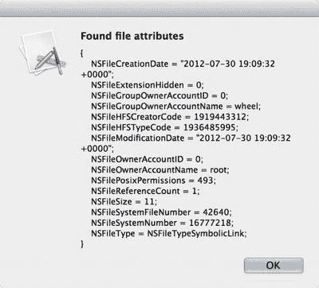
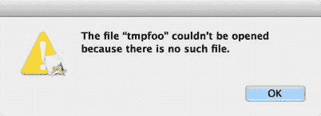

# 比异常更糟：信号致死

既然我们已经了解了某些 bug 可以通过代码级操作（如捕获异常）来处理，那么是时候看看另一种因错误使用对象指针而引发的问题了。在 Cocoa 中，每个 Objective-C 对象都通过指向一种特定 C 结构体的指针来引用，该结构体定义了 Objective-C 对象的基本结构。如果指针没有指向包含有效对象的内存块，或者不是指向 `nil`，那么几乎必然会发生某种形式的内存访问错误，从而产生一个信号，最终导致应用崩溃。

Cocoa 程序员会无意中导致信号杀死应用的情况有两种。第一种是试图向未初始化的对象指针发送消息。默认情况下，当我们在 Objective-C 方法中将新指针声明为局部变量时，不能指望它会自动指向 `nil` 或其他无害的东西。事实上，我们常常会遇到它指向完全不恰当内容的情况，比如一个甚至未被映射到系统中的内存地址（但对于实例变量、静态局部变量和全局变量来说情况则不同，它们实际上会被初始化为 `nil` 值）。

刻意用未初始化的指针触发此行为很困难，因为这类指针有可能恰好包含零值，而零值会被视为 `nil`，这当然是有效的消息接收者。不过，我们可以通过向应用委托添加以下方法来人为构造这种场景：

```
- (void)uninitializedObject {
    NSMutableString *string = (__bridge NSMutableString *)(void *)0xdeadbeef;
    [string appendFormat:@"foo"];
}
```

由于我们使用的是 ARC，而它对此类操作非常敏感，所以必须绕点弯路才能将垃圾值插入指针：先将其转换为 `void*`，然后再转换为 `NSMutableString*`。添加 `__bridge` 限定符可以告诉编译器忽略这次赋值的内存管理影响。

现在，我们有了一个指向垃圾内存位置的 `NSMutableString` 指针。因此，当它尝试调用 `appendFormat:` 方法时，接收者并不是一个有效的对象，这就会导致问题。要查看实际效果，请将下面这行代码添加到 `applicationDidFinishLaunching:` 方法中：

```
[self uninitializedObject];
```

运行应用并进行观察。程序将会停止，并显示类似于图 13-5 的内容。


**图 13-5.** 程序在收到信号时停止运行

根据这个垃圾指针所指向的具体内容，你可能会看到不同的信号名称，例如 `SIGSEGV` 或 `SIGILL`。更糟糕的可能性是，它甚至可能指向我们程序中的另一个有效对象，甚至可能是一个 `NSMutableString`，这使得追踪问题变得异常棘手。具体细节并不重要；关键是我们有一个未初始化的指针（或者在这个特定演示案例中，是一个指向错误内存位置的指针）。这个问题可以通过应用一个通用规则轻松解决：每当你在方法内部声明一个 Objective-C 对象指针时，立即为其赋值，即使只是赋值为 `nil`。

因此，通过将字符串声明行改为以下内容来修复这个问题：

```
NSMutableString *string = nil;
```

构建并运行应用，应用就能正常运行了。在 Objective-C 中向 `nil` 指针发送消息是完全安全的（这基本上是一个空操作，向 nil 发送消息的返回值通常是 `nil`、`0` 或 `NO`），因此，虽然修复后的方法实际上不会执行任何操作，但它也不会导致崩溃。

现在，还有另一个内存问题的来源需要提及：向一个已经被释放的对象发送消息。在本书中，我们创建的所有应用都使用了 ARC，这几乎彻底消除了这类 bug。但如果你将来某个时候需要处理使用手动引用计数（使用 `retain` 和 `release`）的项目，了解这类问题的成因还是很有好处的。

在没有 ARC 的情况下，Objective-C 对象的内存管理是通过手动引用计数来处理的。长话短说：任何时候我们通过 `alloc` 或 `copy` 方法创建一个对象，或者通过向对象发送 `retain` 消息将其标记为“正在使用”，其引用计数就会增加。在某个时刻（当我们不再需要该对象时），我们必须向对象发送 `release` 或 `autorelease` 消息，这两种消息都会减少其引用计数。当引用计数归零时，对象就会被释放。

当我们使用 ARC 时，相同的 `retain` 和 `release` 调用会被内置到应用中，但并不是由我们将其写入源代码，而是由编译器替我们完成。事实证明，计算机比我们更擅长始终如一地遵循 `retain`/`release` 规则！

如果不使用 ARC，可能出现的问题是：如果我们没有正确处理，可能会陷入这样一种情况——变量中包含一个指向内存空间的指针，该空间以前曾被一个“活跃”对象占据，但现在可能包含一个已释放的对象，或者已被重新用于其他目的。ARC 处理这类问题的能力非常强，以至于很难在启用 ARC 的情况下构造出它发生的场景。因此，对于下面的演示，让我们暂时关闭 ARC。为此，选择项目导航器中的顶级 ExceptionCity 项，然后选择“构建设置”标签页。使用顶部的搜索字段搜索“automatic”，然后关闭 Objective-C 自动引用计数。图 13-6 展示了操作后的界面。


**图 13-6.** 修改构建设置。你知道你想这么做

现在，向应用委托类添加以下方法。这展示一个简化的不良行为版本，在 ARC 出现之前，这种操作可能让我们陷入困境。

```
- (void)freedObject {
    NSString *object = [[NSString alloc] initWithCString:"hi there"
                                                encoding:NSUTF8StringEncoding];
    [object release];
    NSLog(@"Where is my object? %@", object);
}
```

然后在 `applicationDidFinishLaunching:` 方法中添加一行 `[self freedObject];`，运行应用，看看会发生什么。程序将会停止，并显示类似于图 13-7 的内容。


**图 13-7.** 绿色条显示了程序停止的位置。这没什么帮助！好在还有其他栈帧可供查看

与之前产生信号的 bug 一样，程序收到的信号可能与这里显示的不同，但它肯定会收到某个信号。如果我们查看调用栈中最高层包含我们代码的栈帧，我们会看到它同时包含了 `freedObject` 方法和它调用的 `NSLog` 函数。

与之前的情况一样，解决这个问题的方法也在于自律：任何时候我们向一个对象发送 `release` 或 `autorelease` 消息后，如果变量中仍然存在指向该对象的指针，请立即将该变量指向 `nil`！发送 `release` 或 `autorelease` 可能不会总是立即导致对象被释放（因为其他代码可能也增加了它的引用计数），但在每个方法内部，我们应该将任何已释放的对象视为不可用，并尽快清除所有指向它的悬垂指针。

在本例中，解决方案是在 `[object release];` 这行代码后面加上以下代码：

```
object = nil;
```


添加该行，重新运行应用，一切恢复正常！不过再次强调，这类错误只有在不使用 ARC 时才会出现。除了在释放对象后将指针设为`nil`这一相对简单的经验法则外，非 ARC 应用也可能因其他方式陷入类似困境，例如忘记保留需要长期使用的对象。这些错误是最难定位的，这也是尽可能使用 ARC 的最有力理由之一。

继续之前，我们需要在项目中重新启用 ARC。再次在项目导航器中选择顶层项目项，在“Build Settings”选项卡中找到“Objective-C Automatic Reference Counting”并将其开启。我们还需要从应用代理的`freedObject`方法中删除`[object release];`这行代码，因为 ARC 不允许我们显式调用`release`。

## NSError

现在我们了解到，Cocoa 中的异常通常不用于流程控制，而主要用于指出错误。如今使用的其他一些语言和框架会将异常用于各种并非错误、但可能是开发者无法直接控制的条件所产生的副作用，例如访问文件时的文件相关错误，或尝试从套接字读取数据时的网络错误。在 Cocoa 中，这类情况通常使用名为`NSError`的类来处理。在本节中，我们将学习`NSError`对象的内容、导致其创建的常见场景，以及在代码中如何处理它，包括让应用能够重试某些触发错误的操作。

### 域与代码

传统上，每个操作系统都有自己报告系统错误的方式，通常提供一个整数值，我们可以与头文件中的预定义列表进行比较，以决定如何处理。例如，在基于 UNIX 的系统中，我们可以在每次系统调用（包括打开文件、读取文件、写入文件等函数）后检查`errno`的值（`errno`可能是全局变量，也可能是调用函数的符号，具体取决于多种因素，我们在此不深入讨论）。其思路是，如果任何系统函数遇到问题，它将把一个整数放入`errno`，以告知我们错误的性质。

在“经典 Mac OS”编程（所有早于 OS X 的系统）中，情况略有不同。许多系统函数不会填充全局变量，而是返回`OSStatus`类型，这同样归结为一个整数，我们应在调用每个函数后检查它，以确保没有意外情况发生。

OS X 是一种混合操作系统。其底层深深植根于 UNIX，并且如你所知，它包含了构成 Cocoa 的所有 Objective-C 框架。它还包含了 Carbon，这是一套从旧版 Mac OS 改编而来的庞大 API 和技术集。此外，还有完全用 C 编写的现代 API，同时适用于 OS X 和 iOS。这些“世界”中的每一个都包含需要以某种方式报告错误代码的函数和/或方法，并且由于这些世界是独立发展的，错误代码集之间当然存在一些重叠。在某个时刻，Apple 意识到，用一种通用方式处理来自这些不同世界的错误消息可能带来一些好处，让它们各自继续使用一直以来的错误代码（确保与现有软件的二进制兼容性），同时通过用字符串标记每个错误的域来消除混淆风险。

这就是我们在`NSError`类中所拥有的，它基本上将系统级别的错误代码封装在一个 Objective-C 对象中。每个`NSError`实例都有一个`NSString`来指定其“域”的名称（通常指它来自哪个库或框架），一个整数来指定相关的错误代码，以及一个可选的`NSDictionary`，它可以包含关于该错误的额外信息。由于这些是普通的 Objective-C 对象，它们可以像任何其他对象一样被处理：传递、放入`NSArray`等等。

Cocoa 包含一些预定义的字符串常量，用于对 Cocoa 框架中`NSError`对象的主要来源进行分类。作为 Cocoa 程序员，你最可能遇到的域如下：

*   `NSPOSIXErrorDomain`：UNIX 错误（属于 POSIX 标准的部分）。
*   `NSOSStatusErrorDomain`：来自 Carbon 函数的错误（通常返回一个`OSStatus`）。
*   `NSCocoaErrorDomain`：直接源自 Cocoa 自身类的错误。

每当一个 Cocoa 方法给我们一个`NSError`时，其域很可能就是其中之一。如果你开始在代码中创建自己的`NSError`实例，可能需要定义自己的域和错误代码，以便在应用程序中更容易处理它们。

每个预定义的错误域还关联了一个错误代码列表，定义在一个或多个头文件中。适用于`NSPOSIXErrorDomain`的错误代码位于`errno.h`中。`NSOSStatusErrorDomain`的错误代码位于`MacErrors.h`中；而`NSCocoaErrorDomain`使用的错误代码包含在`FoundationErrors.h`、`AppKitErrors.h`和`CoreDataErrors.h`中。在 Xcode 中，通过打开“Open Quickly”窗口（⌘⇧O）并输入文件名，可以轻松找到这些头文件。


### 识别错误

现在我们对 `NSError` 这个类有了一些了解。但是，`NSError` 实例从哪里来，它们又如何在应用运行期间影响我们的应用呢？与异常不同，`NSError` 对象不会改变我们代码的执行流程。通常情况下，`NSError` 实例是通过方法调用返回给我们的，但不是作为返回值，而是通过引用我们传入的一个指针。这种参数修改的方式在 C 语言中并不罕见，但在 Objective-C 中却相当少见。其核心思想是，容易出错的方法应该接收一个指向 `NSError` 指针的指针作为参数。这意味着我们传入的不是一个指向 `NSError` 的指针，而是一个指向指针的指针（即我们指针的地址），这样接收方法就可以创建一个 `NSError` 实例，并将我们的指针指向它！（这听起来可能有些令人困惑，但一旦你看到这种模式，事情就会清晰起来。）

举个例子，考虑一下 `NSFileManager` 这个类。文件管理器允许我们执行某些磁盘操作，比如创建目录、访问文件属性等等。它有一个方法，其签名如下所示：

```
- (NSDictionary *)attributesOfItemAtPath:(NSString *)path
error:(NSError **)error
```

我们可以使用这个方法来获取一个字典，其中包含关于 `path` 参数所指定的文件或目录的大量相关文件系统信息。请注意，第二个参数 `error` 的类型是 `NSError**`，这意味着我们传入的是一个指向变量的指针，而这个变量本身可以指向一个 `NSError` 对象。如果该方法确实遇到了错误情况，它会创建一个 `NSError` 对象，并将其地址存入 `error` 指定的位置。如果我们想忽略此类方法产生的任何错误，可以将特殊的 `NULL` 指针作为最后一个参数传入。

下面的方法展示了从调用者角度来看这是什么样子的。我们创建一个用于指向 `NSError` 的变量，并将其初始化为指向 `nil`。然后，我们将该变量的地址传给一个可能产生错误的方法，之后再检查该变量，看它是否仍然指向 `nil`。如果不是，我们就知道该方法遇到了错误，于是请求应用向用户显示该错误。

```
- (void)fileError {
    NSFileManager *fileManager = [NSFileManager defaultManager];
    // 声明一个变量并将其指向 nil
    NSError *fileError = nil;
    // 将 fileError 变量的地址传递给方法
    NSDictionary *attributes = [fileManager
        attributesOfItemAtPath:@"/tmp" error:&fileError];
    // 检查之前的方法调用是否给了我们一个 NSError 对象
    if (fileError == nil) {
        // 显示属性
        NSRunAlertPanel(@"找到文件属性",
            [attributes description], nil, nil, nil);
    } else {
        // 报告错误
        [NSApp presentError:fileError];
    }
}
```

为简单起见，在探索 `NSError` 的过程中，我们将继续在我们已有的项目基础上进行构建。将前面所示的 `fileError` 方法添加到应用委托类中，并在 `applicationDidFinishLaunching:` 方法中添加一行 `[self fileError];`。运行该应用，我们将看到类似于图 13-8 所示的警告面板。



**图 13-8. 这里没有错误！**

现在，返回并编辑 `fileManager` 调用，将字符串参数从 `@"/tmp"` 改为 `@"/tmpfoo"` 或其它不存在的路径。这将导致 `fileManager` 遇到一个错误，并将其传回给我们，存储在 `fileError` 变量中（我们传入了该变量的地址）。它会注意到这个错误，并将其传递给 `NSApp`，最终显示如图 13-9 所示的警告面板。



**图 13-9. 错误出现了**

效果不错，但看看那个警告面板里的文字：“无法打开文件“tmpfoo”，因为不存在此文件。” 是不是感觉有点…… 不够技术化？我们是不是习惯了在计算机系统中看到一些更专业的术语？毕竟，这个错误是由一个底层系统例程触发的，它只报告了一个错误代码，别的什么都没有。这些文字是从哪来的呢？

原来，`NSError` 有一个叫做 `localizedDescription` 的方法，它能提供对错误的人性化、可读的解释。而 `reportError:` 方法最终显示的就是这个描述。

让我们通过调试器来进一步探索这一点。在 Xcode 中，点击文本编辑器中包含 `[NSApp presentError:fileError]` 这一行左侧的边距（边距是显示行号的位置）来设置一个断点。这是在我们代码中设置断点最直接的方式。然后再次运行应用。应用会在选定的那一行暂停，我们可以在输出控制台中看到 lldb 提示符。让我们深入挖掘一下，通过在 lldb 提示符下执行命令来询问错误的域和错误代码：

```
(lldb) po [fileError domain]
$0 = 0x00007fff7cdab110 NSCocoaErrorDomain
(lldb) p (int)[fileError code]
(int) $1 = 260
(lldb) po [fileError localizedDescription]
$2 = 0x0000000102327470 The file "tmpfoo" couldn't be opened because there is no such file.
```

请注意，我们可以使用 `po` 命令打印 `NSString` 的值，使用 `p` 命令打印任何基本 C 类型的值。通常在使用 `p` 命令时，lldb 会抱怨不知道我们要显示的值类型，所以我们在方法调用前加了一个 `(int)` 来告诉 lldb 它期望的是什么类型。

现在我们知道错误代码和域了。快速查看 `FoundationErrors.h` 文件，会发现如下信息：

```
NSFileReadNoSuchFileError = 260,    // 读取错误（无此文件）
```

你可能仍然对这一切是如何联系起来的感到困惑。回想一下，当你创建一个 `NSError` 时，你需要指定一个域、一个代码，以及一个可选的包含附加信息的字典。这个字典是拼图的关键部分。如果你传递给这个方法的字典中有一个键为 `@"NSLocalizedDescriptionKey"` 的值，那么每当调用 `localizedDescription` 时，就会返回该值。

那么，我们来看看 `userInfo` 字典里包含了什么。

```
(lldb) po [fileError userInfo]
$3 = 0x0000000102118850 {
    NSFilePath = "/tmpfoo";
    NSUnderlyingError = "Error Domain=NSPOSIXErrorDomain Code=2 \"The operation couldn\U2019t be completed. No such file or directory\"";
}
```

嗯，显然这不是答案。`userInfo` 字典没有指定本地化描述，但它确实包含了一些其他内容：我们试图访问的文件路径，以及看起来像是另一个 `NSError` 对象的东西。一个错误被包裹在另一个错误里面！让我们看看这个内部错误的 `domain`、`code`、`userInfo` 和 `localizedError` 是什么。我们首先使用另一个 lldb 命令 `expression`，它只是执行该行后面的语句，就像执行源代码一样，但不会像 `po` 或 `p` 命令那样打印结果。在这个例子中，我们将内部错误对象的地址赋值给一个新变量，我们称它为 `$inner`。这是 lldb 的一个很好的特性，它允许我们保留所执行查询的结果，让值持续存在，并在之后节省一些打字时间。我们将从 `fileError` 中获取 `userInfo` 字典，然后立即使用 Objective-C 的新字典查询语法来访问底层错误。

```
(lldb) expression id $inner = [fileError userInfo][@"NSUnderlyingError"]
(lldb) po $inner
$inner = 0x000000010210a9e0 Error Domain=NSPOSIXErrorDomain Code=2 "The operation couldn't be completed. No such file or directory"
```


将对象的地址赋给新变量后，使用 `po` 命令即可查看新变量的地址及其内容（即它所指向的对象）。从现在开始，我们可以将那个内部错误简称为 `$inner`，就像这样：

```
(lldb) po [$inner domain]
$9 = 0x00007fff7cdab0b0 NSPOSIXErrorDomain
(lldb) p (int)[$inner code]
(int) $10 = 2
(lldb) po [$inner userInfo]
$11 = 0x00000001001039d0 {
}
(lldb) po [$inner localizedDescription]
$12 = 0x000000010011d2c0 操作无法完成。没有这样的文件或目录。
```

这又给我们带来了一个谜题。当我们查看底层错误时，它根本没有任何 `userInfo` 字典，却仍然提供了一个人类可读的 `localizedDescription`，而仅仅查看 domain 和 code 似乎并不能直接看出这个描述。事实上，我们可以像这样创建自己的内部错误和外部错误：

```
NSError *innerError = [NSError errorWithDomain:NSPOSIXErrorDomain
code:2 userInfo:nil];
NSDictionary *outerInfo = @{NSUnderlyingErrorKey: innerError,
NSFilePathErrorKey: @"/tmpfoo"};
NSError *outerError = [NSError errorWithDomain:NSCocoaErrorDomain
code:260 userInfo:outerInfo];
```

这些错误的行为将与 `NSFileManager` 生成的错误完全一致，包括显示我们并未在任何地方指定的人类可读文本！事实证明，这种神奇能力的源头似乎是 `NSError` 类本身。它显然内置了足够多的关于 Cocoa 错误域和错误代码的特定知识，能够为程序可能遇到的许多错误生成有意义的描述语句。这意味着，通常情况下，Cocoa 方法调用提供给我们的错误无需额外美化，就可以直接展示给用户。

### 呈现错误

既然说到这个，我们该如何向用户展示错误呢？在这里，我们一直通过调用 `[NSApp presentError:e]` 来让应用程序显示一个模态窗口，但还有一些其他选择。实际上，`presentError:` 方法是在 `NSResponder`、`NSDocument` 和 `NSDocumentController` 中实现的，这意味着无论何时发生错误，我们都可以将其传递给最近或最相关的对象，然后它就会沿着责任链向上传递（类似于响应者链），直到某个对象实际显示该错误。这为以不同方式显示错误信息（例如使用文档模态的弹出式警告）提供了可能性。

## 总结

现在我们已经了解了 Cocoa 应用处理各种不良情况的主要方式、如何避免一些常见错误，以及如何使用 lldb 来帮助排查问题。我们还了解了方法如何利用 `NSError` 实例以可控的方式处理问题。在我们深入探究 Cocoa 编程的过程中，这些知识都将派上用场。

