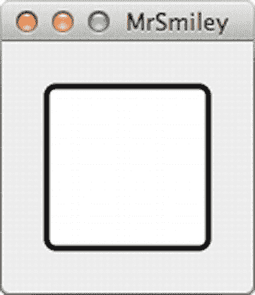
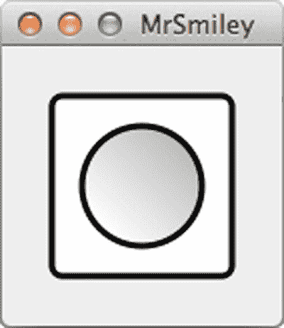
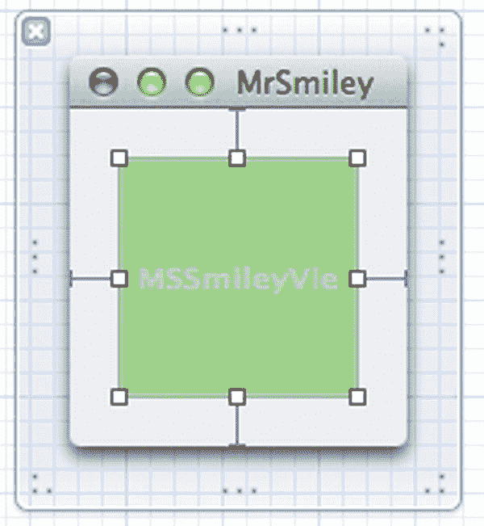
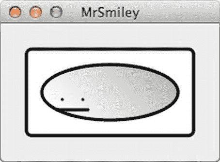

# 路径辅助工具

为了绘制本节开头展示的视图，我们首先绘制背景，然后绘制脸部本身。对于这两个元素中的每一个，我们先填充背景，再绘制边缘。所有这些操作都通过 `NSBezierPath` 类完成。贝塞尔路径允许我们定义任意复杂度的路径，包括直线、点、曲线等。`NSBezierPath` 类的一个便利之处在于，它提供了创建表示常见形状（如矩形、椭圆等）的贝塞尔路径的便捷快捷方式。

让我们从创建一个定义视图可见边缘的路径开始，使用 `NSBezierPath` 的一个类方法来生成圆角矩形。下方以**粗体**显示的行创建了一个路径，用白色填充它，然后用黑色“描边”（绘制其边缘）：

```
- (void)drawRect:(NSRect)dirtyRect
{
  [NSGraphicsContext saveGraphicsState];
  NSRect bRect = CGRectInset([self bounds], 5, 5);
  NSBezierPath *border = [NSBezierPath bezierPathWithRoundedRect:bRect
    xRadius:5 yRadius:5];
  [[NSColor whiteColor] set];
  [border fill];
  [border setLineWidth:3];
  [[NSColor blackColor] set];
  [border stroke];
  [NSGraphicsContext restoreGraphicsState];
}
```

第一步使用 `CGRectInset` 函数将我们的边界矩形缩小一点，留出一些余量，以便我们可以绘制带有粗线条的圆角矩形，而不会被边缘裁剪。然后，我们创建一个表示圆角矩形的路径，指定矩形的基本几何形状以及两个定义用于圆角的椭圆曲线大小的数字。之后，我们发出简单的命令来设置颜色、线宽并进行一些绘制。

## 颜色与图形上下文

请注意，指定绘图操作使用的颜色与绘图操作本身是分开的步骤，设置线宽也是如此。此外，虽然设置线宽是通过路径本身的方法完成的，但设置颜色看起来像是一种自由浮动操作。我们只需向任何颜色发送 `set` 消息，它立刻就变成了当前颜色！发生的情况是，`NSColor` 的 `set` 方法与底层图形上下文交互，设置将用于后续绘图操作的颜色。这带来的一个后果是，`NSColor` 的 `set` 方法仅在存在当前图形上下文时（例如在 `drawRect:` 方法内部）才会执行有用的操作。另一个后果是，当前颜色是图形上下文的一个属性（在一般意义上，而非 Objective-C 语言意义上），因此无论之前设置了什么颜色，都会在方法开始时通过调用 `[NSGraphicsContext saveGraphicsState]` 保存，并在方法结束时通过调用 `[NSGraphicsContext restoreGraphicsState]` 恢复，从而使一切恢复原状。

此时，如果在 Xcode 中运行应用程序，我们会看到它绘制了一个带有黑色轮廓的白色矩形（图 14-4）。



图 14-4.

未来形状的雏形

## 超越颜色

现在让我们开始绘制头部。将以下行添加到 `drawRect:` 方法的末尾附近，但仍在 `[NSGraphicsContext restoreGraphicsState]` 调用之前：

```
NSRect hRect = CGRectInset([self bounds],20,20);
NSBezierPath *head = [NSBezierPath bezierPathWithOvalInRect:hRect];
NSGradient *faceGradient = [[NSGradient alloc]
  initWithStartingColor:[NSColor whiteColor]
  endingColor:[NSColor lightGrayColor]];
[faceGradient drawInBezierPath:head angle:45];
[head setLineWidth:3];
[head stroke];
```

这里我们再次使用 `CGRectInset` 创建一个比边界矩形更小的新矩形，这次是为笑脸先生的头部创建一个椭圆形。在创建贝塞尔路径后，我们创建了一个新东西——`NSGradient` 的实例，它知道如何获取两种或多种颜色并在它们之间绘制平滑渐变。在这个例子中，它可以在贝塞尔路径的内表面绘制自身。运行这段代码；视图现在包含一个带有渐变阴影的圆形“头部”（图 14-5）。



图 14-5.

基本的头部特写

## 手动路径构建

现在剩下的就是绘制面部特征（一个简单的嘴巴和眼睛）。将以下行添加到 `drawRect:` 的末尾（但在最终的 `[NSGraphicsContext restoreGraphicsState]` 调用之前）：

```
NSBezierPath *features = [NSBezierPath bezierPath];
[features moveToPoint:NSMakePoint(35, 30)];
[features lineToPoint:NSMakePoint(65, 30)];
[features moveToPoint:NSMakePoint(40, 40)];
[features lineToPoint:NSMakePoint(40, 40)];
[features moveToPoint:NSMakePoint(60, 40)];
[features lineToPoint:NSMakePoint(60, 40)];
[features setLineCapStyle:NSRoundLineCapStyle];
[features setLineWidth:3];
[features stroke];
```

这里，我们没有使用 `NSBezierPath` 的便捷类方法来直接获取一个完整的形状，而是使用一些更基本的方法从头构建一个路径。`moveToPoint:` 方法将虚拟的“笔”定位到指定点，而不绘制线条到该点。而 `lineToPoint:` 方法从路径的当前点绘制一条线到新点。实际上，这些方法并不执行任何绘制；它们只是构建贝塞尔路径结构，稍后由 `stroke` 方法绘制。

这里的一个额外技巧是设置了线条端点样式。此设置定义了线条末端的外观。这对于绘制为单个点的眼睛尤其重要。使用默认设置（精确地在线段末端截断所有内容），眼睛将完全不可见，但使用 `NSRoundLineCapStyle` 则为每只眼睛提供了完美的小圆点。点击运行查看最终结果（图 14-6）。


图 14-6.

笑脸先生。他真的很开心！


### 突破界限

既然 `MSSmileyView` 已经能完美绘制出一张笑脸，我们自然希望能调整其大小以适应不同位置。当窗口适配内容时，`MSSmileyView` 自定义视图本应自动设置约束，以便视图随窗口大小变化。我们可以通过观察从自定义视图边缘延伸到窗口的蓝色线条来确认这一点，如图 14-7 所示。如果不是这种情况，我们可以使用边缘的调整手柄来调整 `MSSmileyView` 的大小，直到四条边都出现蓝色参考线。这样就将自定义视图定位在了距离窗口边框四周各 20 点的内嵌位置上。



图 14-7. 调整大小约束已就位

保存工作，点击运行，然后调整视图大小。它应该看起来像图 14-8 所示。



图 14-8. 哎呀，头都大了！

这看起来似乎不对劲，对吧？问题在于，在 `drawRect:` 方法中，我们指定路径几何图形时采用了一种混合搭配的方式。对于轮廓和头部形状，我们基于边界矩形来处理，但对于面部特征，我们却硬编码了数值化的像素宽度。当视图调整大小时，我们的边界矩形会自动随之调整。这导致轮廓和头部拉伸以适应新的边界，而面部特征却仍被困在它们僵化的小世界里。

另外，请注意，调整大小后线条的绝对粗细完全相同，这意味着相对于视图整体尺寸的相对粗细发生了变化。如果我们将此视图变得非常大，线条会显得异常纤细。

幸运的是，有一个简单的方法可以解决所有这些问题。还记得本章前面我们提到视图的框架和边界矩形之间的区别吗？框架定义了视图在其父视图中的位置和大小。而边界则决定了视图内部坐标系的范围和位置。如果我们能配置好，使得视图的边界矩形永不改变，那么它总会绘制出完全相同的内容，但会完美拉伸以匹配其实际绘制所在的框架！

为此，我们只需在每次视图调整大小时，手动将边界设置回原始矩形即可。因此，让我们在 `MSSmileyView.h` 中添加一个属性（用于保存我们想要的边界），完善 `initWithFrame:` 方法，并实现 `setFrameSize:` 方法，如下所示：

```
// MSSmileyView.h 的一部分：
#import <Cocoa/Cocoa.h>
@interface MSSmileyView : NSView
@property NSRect preferredBounds;
@end

// MSSmileyView.m 的一部分：
- (id)initWithFrame:(NSRect)frame
{
    self = [super initWithFrame:frame];
    if (self) {
        self.preferredBounds = NSMakeRect(0, 0, 100, 100);
    }
    return self;
}

- (void)setFrameSize:(NSSize)newSize
{
    [super setFrameSize:newSize];
    [self setBounds:self.preferredBounds];
}
```

`setFrameSize:` 方法是在用户调整窗口大小时，在实时拖拽过程中被调用的方法。我们在这里做的是，在每一步都重置视图的边界矩形，这样当需要绘制时，所有绘制操作都将基于原始边界进行。现在点击运行，调整窗口大小，见证奇迹的发生（图 14-9）。


图 14-9. 真正的拉伸

如您所见，一切都会完美地拉伸，包括线条的宽度。此外，所有内容都会根据实际显示分辨率进行渲染。我们可以将其拉伸到任意大小，并且总能看到完美抗锯齿的曲线。我们为其边界指定的任何几何图形都会被调整以匹配当前的框架。我们在这里看到的，实际上是一个二维变换。

除了作为处理调整大小的好方法之外，这种内置变换能力意味着，我们只需设置边界矩形，就可以在我们感到舒适的任何比例下进行绘制。如果我们想以像素分辨率绘制图形，我们完全可以做到；但如果我们正在绘制一个范围从 0.0 到 0.1 的数学曲线细节，我们可以相应地设置边界，而不必将所有显示值乘以一个系数来匹配屏幕坐标。

## LOLmaker

现在，我们对如何在 `NSView` 中绘图以及操作其几何图形有了基本了解，让我们进入一个新项目：LOLmaker。LOLmaker 是一个简单的应用程序，它让我们只需拖入一张图片并输入我们想要的文字，就能创建自己的 LOLcat 风格图像。这并非什么高科技，但它会向我们介绍一些关于在 `NSView` 中绘图的更多问题。

关于 LOLCAT 的几句话

如果你完全错过了 LOLcat 这个网络迷因，或者是在 LOLcat 已被遗忘的未来世界里读这本书，那么简单来说，LOLcat 就是一张带有幽默文字的猫咪（或其它动物）图片，其文字风格通常是模仿 21 世纪早期的网络俚语。

我们喜欢 LOLcat，仅仅是因为它们是能让我们开怀大笑的猫咪图片。请千万不要以为我们会为了多卖几本书而屈尊到在书中加入 LOLcat 内容的地步！众所周知，大多数 LOLcat 粉丝同时也是盗版者，他们只会以盗版 PDF 的形式阅读这本书。


