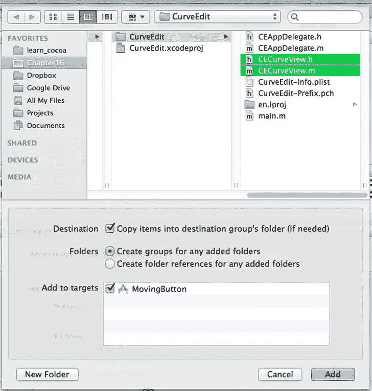

# 核心动画：入门指南

苹果在 Mac OS X 中包含的最激动人心的技术之一就是名为**Core Animation**的图形系统，它让我们能够在应用程序中轻松创建动画效果。我们可以让视图平滑而简便地滑动、淡入淡出、旋转和缩放，通常只需几行代码即可实现。本质上，Core Animation 让我们能够指定对象的变化——例如将其位置改到窗口中的另一个位置——从而使得这种变化不再是瞬间完成，而是被自动分割成多个微小的动作，由 Core Animation 随时间逐步渲染出来。我们可以指定转场效果的时长（以秒为单位），以及变化的时间或节奏。我们还可以将多个动画分组，使它们完美同步地执行。

## Core Animation 基础

从技术角度来看，这一切的核心基础单元是一个名为 `CALayer` 的类（Core Animation 的预发布版本甚至曾被称作 Layer Kit）。每个 `NSView` 都可以选择性地附加一个 `CALayer`，这既可以在 Interface Builder 中通过一个开关来启用，也可以在代码中设置。将图层分配给视图的过程实际上会递归地遍历该视图的所有子视图，因此当一个视图拥有图层时，其所有子视图（以及它们的子视图，依此类推）也会获得图层。一旦图层就位，我们就可以开始对视图进行动画处理。

在底层，每个 `CALayer` 都与一些用于渲染其图形的 OpenGL 结构相关联。OpenGL 在快速将矩形绘制到屏幕上方面表现出色，即使是经过调整大小、旋转等操作的矩形也是如此，因此使用 `CALayer` 可以让我们的视图在屏幕上施展各种花招，而不会拖慢应用程序。Core Animation 的 API 将我们与 OpenGL 完全隔离开来，因此它会在后台静默工作，我们无需过多操心。唯一需要牢记的是，每个图层都会占用计算机图形硬件的一部分可用内存，因此我们最好仅对应用程序中实际需要执行动画的部分使用图层，而不是将其应用到每个窗口的每个视图中。

### 隐式动画

任何支持图层的视图都可以通过其 **animator** 代理来生成动画。这是一个特殊对象，充当视图本身的替身，它会根据所接收的方法来设置动画，而不是立即进行更改。例如，如果我们想要动画化视图的移动，那么与其直接设置其 frame 属性：

`[myView setFrame:newFrame];`

我们可以这样设置：

`[[myView animator] setFrame:newFrame];`

为了演示效果，创建一个新的 Cocoa 项目，将其命名为 **MovingButton**，并使用 **MB** 作为类前缀。首先，我们来设置用户界面。在 Interface Builder 画布中打开 `MainMenu.xib`，打开 **MovingButton** 窗口，并在空窗口中放置一个名为 **Move** 的按钮。接下来，打开助理编辑器，并在其中打开 `MBAppDelegate.h` 文件。从按钮控制拖拽到 `MBAppDelegate.h` 文件，在窗口的 `@property` 声明正下方添加一个操作。将这个新操作命名为 `move`。

现在，我们来填写 `move:` 操作的实现，如下所示：

```
- (IBAction)move:(id)sender {

  NSRect senderFrame = [sender frame];

  NSRect superBounds = [[sender superview] bounds];

  senderFrame.origin.x = (superBounds.size.width -

    senderFrame.size.width) * drand48();

  senderFrame.origin.y = (superBounds.size.height -

    senderFrame.size.height) * drand48();

  [sender setFrame:senderFrame];

}
```

这个简单的操作方法只是为 sender 在其父视图中计算一个新的随机位置，并将其移动过去。保存更改，运行项目，你会看到每次点击 Move 按钮，它都会跳到窗口中的另一个位置。

现在，让我们让移动过程动起来。我们只需编辑一行代码，将

`[sender setFrame:senderFrame];`

改为

`[[sender animator] setFrame:senderFrame];`

再次点击运行，点击 Move 按钮，看看会发生什么。现在，每次我们点击按钮，它都会平滑地滑动到新位置，而不是瞬间切换。`animator` 方法返回的对象是一个代理，它会响应 `NSView` 的每个 setter 方法，并调度动画来逐步应用更改。在幕后，Core Animation 负责完成所有工作，一点一点地修改相关值，直到达到调用 setter 时指定的目标值。

每个线程都持有一个动画上下文，其形式为 `NSAnimationContext` 的实例。该上下文允许我们设置隐式动画的时长（以秒为单位），方法如下：

`[[NSAnimationContext currentContext] setDuration:1.0];`

如果这就是我们对动画所需的全部控制，那么使用隐式动画就能走得很远。但如果我们需要更精细的调整，例如确保多个动画同步发生，或者在动画完成时触发某些活动，那么我们就需要更进一步，比如……


### 显式动画

Core Animation 提供了一种在代码中显式设置动画的技术，而不是使用 `NSView` 的 `animator` 方法那层“魔法”。我们创建的每个显式动画都由负责开始和结束动画代码段的方法界定，这让整个过程更加清晰。再加上显式动画所具备的额外功能，很明显，除了最简单的动画之外，所有动画都适合采用这种方法。

要使用 Core Animation，我们首先需要将 `QuartzCore` 框架添加到 Xcode 项目中。在 Xcode 中，在项目导航器窗格中选择 `MovingButton` 项目本身：这是项目导航器中的最顶层项。在“目标”部分下选择 `MovingButton`，如图 15-2 所示。在“已链接的框架和库”部分，点击表格视图底部的 + 按钮来添加一个新框架。在列表中找到 `QuartzCore.framework`（使用顶部的搜索字段），然后添加它。


图 15-2. 向项目中添加新框架

然后，在 `MBAppDelegate.m` 的顶部添加以下行：

`#import <QuartzCore/QuartzCore.h>`

现在，我们可以在自己的代码中引用 Core Animation 类了。让我们先修改之前的示例，用显式动画替代隐式动画。为此，我们需要创建一个名为 `CABasicAnimation` 的 Core Animation 类实例，它可以对任何可动画化的 `CALayer` 属性的值进行动画处理。在我们的例子中，我们将对图层的 `position` 属性进行动画处理，而不是对其 frame 进行动画处理。我们使用动画的 `toValue` 和 `fromValue` 属性显式设置位置的起点和终点。请注意，这些属性期望的是一个对象，而不仅仅是像 `NSPoint` 这样的结构体，因此我们必须将每个 `NSPoint` 值包装到 `NSValue` 实例中。创建动画后，我们将其连同键一起添加到视图的图层中。该键与我们正在动画处理的属性无关，它仅用于帮助我们在之后识别该动画。最后，我们在视图对象本身上更改其 frame，因为动画仅影响视图图层的绘制效果。我们希望视图实际也进行移动，因此我们必须手动设置其目标 frame。实现所有这些功能的代码如下：

```
- (IBAction)move:(id)sender {

    NSRect senderFrame = [sender frame];

    NSRect superBounds = [[sender superview] bounds];

    CABasicAnimation *a = [CABasicAnimation
        animationWithKeyPath:@"position"];

    a.fromValue = [NSValue valueWithPoint:senderFrame.origin];

    senderFrame.origin.x = (superBounds.size.width -
        senderFrame.size.width)*drand48();

    senderFrame.origin.y = (superBounds.size.height -
        senderFrame.size.height)*drand48();

    a.toValue = [NSValue valueWithPoint:senderFrame.origin];

    [[sender layer] addAnimation:a forKey:@"position"];

    [[sender animator] setFrame:senderFrame];

    [sender setFrame:senderFrame];

}
```

请注意，我们还从这个方法中移除了 `[[sender animator] setFrame:senderFrame];` 这一行，因为这次我们不希望触发隐式动画。在这段代码工作之前，我们还需要完成隐式动画为我们处理好的一个步骤：为需要动画处理的视图建立图层。使用 animator 代理可以自动完成此操作，但现在我们必须为所有将要进行动画处理的视图（包括将要移动的视图的父视图）自行启用此功能。在我们的例子中，这意味着按钮的父视图（窗口的内容视图）需要被赋予一个图层，然后它反过来又会为其子视图层次结构（即按钮本身）建立图层。最简单的方法是返回 `MainMenu.xib`，选择窗口中的按钮，然后打开“视图特效检查器”（`⌘⌥8`）。该检查器的顶部有一个标题为“Core Animation 图层”的部分，其中显示了视图对象列表（见图 15-3）。


图 15-3. 建立动画图层

选中的对象（按钮）位于底部，其所有父视图（本例中只有一个视图，即窗口的内容视图）堆叠在其上方。点击复选框为该视图启用图层。我们可以将按钮的复选框保持未选中状态，因为父视图会为其建立图层。

现在保存所有内容，运行应用程序，我们将看到完全一样的行为。因此，这个新版本以增加几行代码为代价实现了相同的结果。到目前为止，这似乎并没有多大优势。但是等等，还有更多！通过像 `CABasicAnimation` 这样的动画类实现的显式动画，让我们能够做几件使用隐式动画无法做到的关键事情。

首先，我们可以设置动画的持续时间。在将动画添加到图层（使用 `[[sender layer] addAnimation:a forKey:@"position"]`）之前添加以下这行代码，可以使该动画运行得更慢一些：

`a.duration = 1.0;`

将此代码放入后运行，我们会看到按钮的过渡变得更慢了。我们还可以更改动画的节奏，使其不严格按线性方式从一点移到另一点。让我们将其设置为“缓入、缓出”的运动，如下所示：

`a.timingFunction = [CAMediaTimingFunction functionWithName:`
`kCAMediaTimingFunctionEaseInEaseOut];`

现在运行，我们会看到，当我们点击按钮时，它开始缓慢移动，然后逐渐加速，移动得更快，等到接近目标时速度又降下来。在底层，这些时间函数通过为从 `0.0` 到 `1.0` 的值变化提供一个简单的映射来工作，使用一对控制点来描述两者之间的曲线。这听起来是不是很耳熟？这似乎正是我们本章前半部分实现的曲线编辑控件用武之地！我们可以使用曲线编辑器来定义每次点击按钮时将应用于按钮移动的时间函数。

首先，从之前的项目中添加 `CECurveView` 类文件。在 `MovingButton` 项目中，右键单击 `MovingButton` 文件夹，然后从上下文菜单中选择“将文件添加到‘MovingButton’”。导航到 `CECurveView.h` 和 `CECurveView.m` 所在的位置，选中它们，然后单击“添加”按钮。在出现的表单中，点击以打开“将项目复制到目标组的文件夹中”复选框，并确保在下部选中 `MovingButton` 目标（见图 15-4）。



图 15-4. 将现有文件添加到项目

这次，我们不在控制器定义中设置指向此控件的绑定，而是添加一个出口属性，以便能够访问我们将要设置的 `CECurveView`。修改 `MBAppDelegate.h`，添加以下粗体行：


