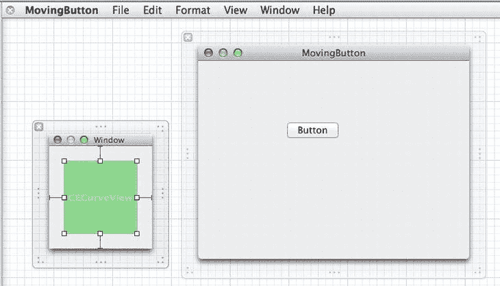

# import <Cocoa/Cocoa.h>

@class `CECurveView`;

@interface `MBAppDelegate` : NSObject `<NSApplicationDelegate>`

@property (assign) IBOutlet `NSWindow *window`;

@property (weak) IBOutlet `CECurveView *curveView`;

- (IBAction)`move:(id)sender`;

@end

现在，在 Interface Builder 画布中重新打开 `MainMenu.xib`。我们将添加一个小的 `NSPanel`，作为按钮动画的一种检查器。从对象库中，拖出一个 `NSPanel`，然后将一个自定义视图拖入新面板中。将自定义视图的大小调整为 100×100，并将其类更改为 `CECurveView`。此时 Interface Builder 中的 GUI 应如图 15-5 所示。



图 15-5. 添加一个 `CECurveView` 用于配置我们的动画

现在，将应用程序委托的 `curveView` 出口连接到我们刚刚创建的 `CECurveView` 实例，然后切换回 `MBAppDelegate.m` 文件。在应用程序委托实现文件的顶部某处导入 `CECurveView` 头文件，添加以下代码行：

`#import "CECurveView.h"`

按如下方式更新 `move:` 方法：

```
- (IBAction)move:(id)sender {
    NSRect senderFrame = [sender frame];
    NSRect superBounds = [[sender superview] bounds];
    CABasicAnimation *a = [CABasicAnimation
                           animationWithKeyPath:@"position"];
    a.fromValue = [NSValue valueWithPoint:senderFrame.origin];
    senderFrame.origin.x = (superBounds.size.width -
                            senderFrame.size.width)*drand48();
    senderFrame.origin.y = (superBounds.size.height -
                            senderFrame.size.height)*drand48();
    a.toValue = [NSValue valueWithPoint:senderFrame.origin];
    a.duration = 1.0;
    a.timingFunction = [CAMediaTimingFunction
                        functionWithControlPoints:self.curveView.cp1X
                        :self.curveView.cp1Y
                        :self.curveView.cp2X
                        :self.curveView.cp2Y];
    // 将其添加到图层
    [[sender layer] addAnimation:a forKey:@"position"];
    [sender setFrame:senderFrame];
}
```

现在，每次用户点击“移动”按钮时，生成的动画时间函数将由 `CECurveView` 控件中的值决定。保存文件，运行应用程序，我们应该能看到实际效果。拖动控件手柄以创建不同的曲线形状，点击“移动”按钮，观察其移动方式。

