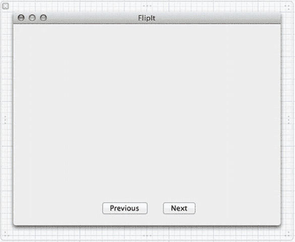
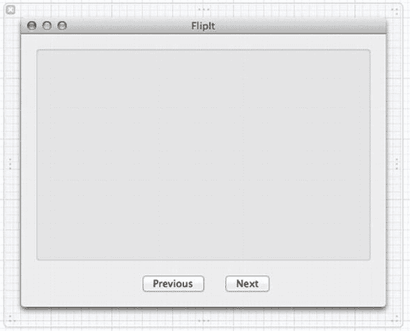

# 动画分组

我们已经初步了解了 Core Animation 的工作原理，但上述示例略显滑稽——只是在屏幕上随机移动一个按钮。这并非我们推荐的 GUI 设计！在真实开发中，Core Animation 最常用于视图之间的过渡动画。你可能已经在 iPhone 上反复看到过这种用法（Core Animation 最初就是为了 iPhone 平台构建的，随后才“回溯”到 Mac OS X）。iPhone 界面中所有流畅的滑动、缩放和淡入淡出效果都是用 Core Animation 实现的。在 Mac OS X 中，Core Animation 虽不如此无处不在，但在“日历”应用的周视图切换和 Mission Control 中的屏幕切换等场景中得到了很好的应用。在本节中，我们将学习如何通过将动画分组，使其同时运行，来实现一些漂亮的过渡效果。

在 Xcode 中，创建一个名为 `FlipIt` 的新 Cocoa 项目，类前缀设置为 `FI`。我们要做的是呈现一个 GUI，用户可以在多个“页面”之间翻转，而 Core Animation 将负责它们之间的流畅动画。我们将在 nib 文件的空窗口中使用一个盒子来显示内容页面，这些页面本身将保存在一个 `NSTabView` 中。我们不会显示选项卡视图本身，只是将其作为内容页面的便捷容器。

我们将从在 `MainMenu.xib` 中布局视图开始，因此在 Interface Builder 画布中打开该文件。从对象库中拖一个按钮到 GUI 的空窗口底部。然后复制该按钮，并将两个按钮的标题分别设置为**上一页**和**下一页**。将两个按钮并排放置在窗口底部中央。打开 `FIAppDelegate.h` 文件的助手编辑器窗格。在接下来的几个步骤中，我们将使用此助手编辑器来连接各个部分。首先，按住 Control 键从每个按钮拖拽至助手编辑器窗口，创建名为 `next` 和 `previous` 的新动作，与两个按钮对应。最终结果应该如图 15-6 所示。

图 15-6. 准备窗口

现在，在对象库中找到 `NSBox`，并将其拖入空窗口，放置在按钮上方，调整大小以填满大部分屏幕。使用属性检查器移除盒子的标题，将标题位置弹出菜单设置为**无**（见图 15-7）。然后，按住 Control 键从盒子拖拽至助手编辑器中的 `FIAppDelegate.h` 代码，创建一个名为 `box` 的新输出口，这样我们就可以从类中访问该盒子。

图 15-7. 显示窗口现已准备就绪

我们的下一步操作是设置一组视图，用于在主视图中切换进出。我们将使用 `NSTabView` 来实现这一点，这仅仅是因为它提供了一种便捷的方式，让我们可以在 Xcode 中构建一系列视图，并在应用程序运行时将这些视图作为屏幕外视图的列表来维护。在对象库中找到 `NSTabView`，但将其一直拖到左侧，放入对象停靠栏中，位于应用程序委托和字体管理器对象下方。请注意，选项卡视图作为 nib 窗口中的顶级图标出现，与应用程序委托、窗口和其他项目并列（见图 15-8）。

图 15-8. 在不太寻常的位置发现了一个选项卡视图，但它就在那里

