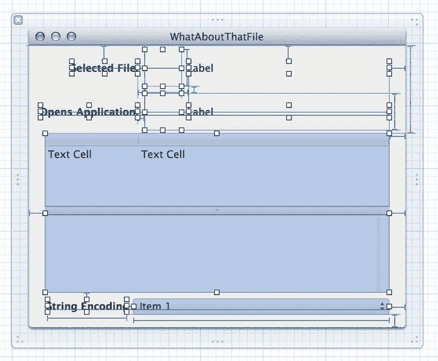
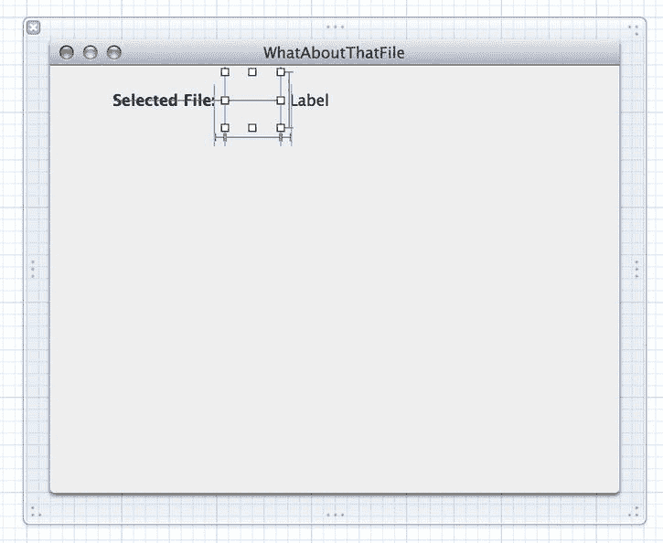
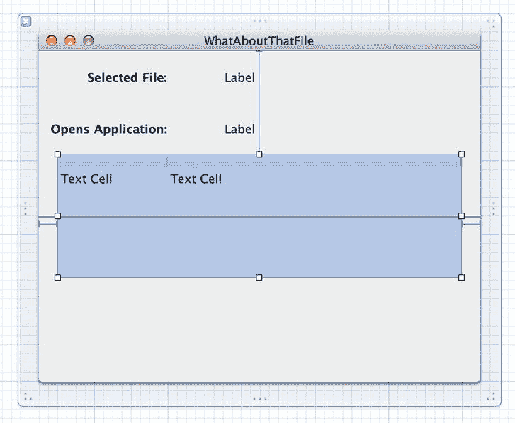
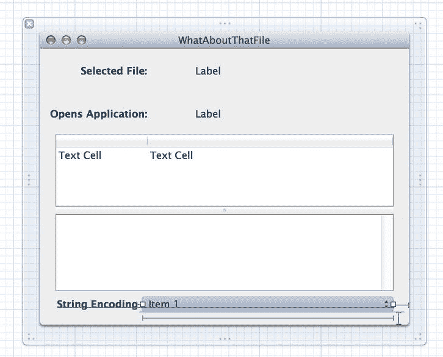

# 16. 文件操作

## 摘要

大多数应用程序都需要以某种方式处理存储在磁盘上的文件。到目前为止，本书中我们并没有太多涉及这个主题（除了对 Core Data 及其数据存储的一些讨论），所以现在我们来弥补这一点。实际上，Cocoa 包含几个有用的类，可以通过多种方式处理文件。有些类提供了模仿用户在 Finder 中通常能执行的操作的 API，而另一些类则以抽象方式表示文件。还有一些类内置了读写文件的功能。本章将概述这些机制的工作原理。

## 隐式文件访问

Cocoa 中的几个类，例如 `NSString`、`NSData`、`NSArray` 和 `NSDictionary`，都提供了直接从文件读取数据或将内容直接写入文件的方法，只需使用包含相关文件完整路径的字符串即可。例如，如果我们想将文件的全部内容读取到一个字符串中，可以像下面这样简单地实现：

```
NSError *myError;
NSStringEncoding encoding;
NSString *myString = [NSString stringWithContentsOfFile:@"/path/to/something"
                                                 usedEncoding:&encoding error:&myError];
```

这段代码将处理打开文件和读取内容的所有繁琐工作。它甚至能告诉我们用于将文件内容解释为字符串的文本编码，并告知发生的任何错误。但前提是我们为第二个和第三个参数传入非 `NULL` 的值。除了与文件相关的错误（例如权限不足无法访问文件）之外，该方法还能报告与将数据作为字符串处理相关的错误，例如如果文件包含二进制数据，则可能出现文本编码错误。本章后面部分我们将看到它的实际应用。

`NSArray` 和 `NSDictionary` 有类似的方法，但出于某种原因，它们没有像 `NSString` 那样包含错误报告功能，因此如果操作失败，它们只会返回一个 `nil` 指针，让你摸不着头脑。这些方法也更具有专用性，因为它们旨在从以 Apple 专有属性列表格式存储的文件中读取值。`NSDictionary` 的 `dictionaryWithContentsOfFile:` 类方法的一个常见用途是读取在文本编辑器或 Xcode 的 plist 编辑器中创建的配置文件中的数据。Cocoa 还包含一个名为 `NSPropertyListSerialization` 的专用类来处理属性列表格式。如果我们需要以通用方式解析属性列表，并获得完整的错误报告和更多控制权，可以使用它的类方法 `propertyListWithData:options:format:error:`（试着连续说五遍）。

在本节开头提到的类中，`NSData` 提供了最通用的文件访问。它可以读取磁盘上任何类型的数据，并将其表示为字节数组供我们按需使用。这是处理二进制数据的理想方式。`NSData` 甚至提供了一个选项，用于提示文件应映射到虚拟内存中（以防我们知道文件太大，不想一次性全部加载到内存中），如下所示：

```
NSData *myData = [NSData dataWithContentsOfFile:@"/path/to/something"
                                          options:NSDataReadingMappedIfSafe error: &myError];
```

这里提到的每个类还包含一个名为 `writeToFile:atomically:` 的方法，其第二个参数是一个 `BOOL` 值，指定是否应先将数据写入一个辅助文件，待所有数据写入完成后，该辅助文件再替换原始文件。此方法的 `NSString` 版本实际上已被弃用，因此我们应改用 `writeToFile:atomically:encoding:error:`，这迫使我们指定要使用的文本编码，并让我们有机会检查可能发生的任何错误。`NSData` 提供了类似的 `writeToFile:options:error:`，也让我们有机会查看写入文件时发生的任何错误。

## 高级文件操作

除了读写文件的基础功能外，Cocoa 还提供了许多类，让我们能够以类似于 Finder 处理文件的方式来处理文件。我们可以访问文件系统属性、获取文件图标、查看哪个应用程序将默认打开此文件，以及更多功能。本章的剩余部分将在名为“这个文件怎么回事？”（见图 16-1）的新应用程序的背景下，探讨其中一些功能。

此应用程序允许用户选择一个文件，然后显示该文件的一些信息，以及以字符串形式显示的文件内容。如果文件包含无法表示为字符的数据，它会告知用户。否则，用户可以使用内置的弹出列表更改读取文件时使用的文本编码，并显示结果字符串。


图 16-1. 完成的“这个文件怎么回事？”应用程序


### 关于那个文件：代码部分

使用 Xcode 创建一个新的 Cocoa 应用（这次不启用 Document 支持或 Core Data），命名为 `WhatAboutThatFile`，然后执行常规步骤，确保启用了 ARC，并为项目指定一个类前缀，此处为 `WAT`。这会创建一个简单的项目，仅包含一个 `WATAppDelegate` 类和一个名为 `MainMenu.xib` 的 xib 文件。在之前的章节中，我们一步步地构建应用程序，但既然我们已经走到了这一步，不如来接手更大的应用代码块。我们将展示应用的完整代码，并穿插一些注释说明，然后描述如何使用 Cocoa 绑定在 Interface Builder 中将所有内容连接起来。首先，这是应用委托的头文件，它声明了大量用于通过 Cocoa 绑定访问值的属性。它还声明了一个动作方法，让用户可以从菜单中打开一个文件。

```
//
//  WATAppDelegate.h
//

#import <Cocoa/Cocoa.h>

@interface WATAppDelegate : NSObject <NSApplicationDelegate>

@property (assign) IBOutlet NSWindow *window;
@property (strong) NSFileWrapper *fileWrapper;
@property (strong) NSURL *fileURL;
@property (assign) NSStringEncoding chosenEncoding;
@property (readonly) NSDictionary *fileAttributes;
@property (readonly) NSString *filename;
@property (readonly) NSImage *fileIcon;
@property (readonly) NSImage *opensAppIcon;
@property (readonly) NSString *opensAppName;
@property (weak) NSString *stringEncodingName;
@property (readonly) NSString *fileStringValue;
@property (readonly) NSDictionary *encodingNames;
- (IBAction)chooseFile:(id)sender;

@end
```

现在，我们来看一下 `.m` 文件。默认情况下，它包含了 `applicationDidFinishLaunching:` 方法，但我们在应用运行时不需要配置任何东西，所以可以忽略它，继续做我们自己的事情。

`chooseFile:` 方法使用 `NSOpenPanel` 类来让用户选择一个要检查的文件。如果用户确实选择了一个文件，我们会根据选择设置所有实例变量。`chosenEncoding` 属性的类型是 `NSStringEncoding`（本质上就是一个无符号整数），被设置为 0。这不是一个有效的字符串编码类型，这样在后续阶段我们可以让系统尝试为我们推断字符串编码类型。之后，我们根据打开面板中的选择设置 `fileURL`，最后设置 `fileWrapper`，它是 `NSFileWrapper` 类的一个实例，只是简单地包装一个文件，让我们可以获取一些关于它的元数据，这些元数据基于 `fileURL` 的值。其中还包含一些错误处理逻辑，以防所选文件出现问题。

```
- (IBAction)chooseFile:(id)sender
{
    NSOpenPanel *openPanel = [NSOpenPanel openPanel];
    [openPanel setCanChooseFiles:YES];
    [openPanel setCanChooseDirectories:NO];
    [openPanel setResolvesAliases:NO];
    [openPanel setAllowsMultipleSelection:NO];

    if ([openPanel runModal] == NSFileHandlingPanelOKButton) {
        self.chosenEncoding = 0;
        self.fileURL = [openPanel URL];
        NSError *fileError;
        self.fileWrapper = [[NSFileWrapper alloc] initWithURL:self.fileURL
                                                      options:0
                                                        error:&fileError];
        if (!self.fileWrapper) {
            NSRunAlertPanel(@"无法访问文件",
                            [fileError localizedDescription], nil, nil, nil);
        }
    }
}
```

接下来，我们有 `filename` 和 `fileIcon` 方法，它们将被窗口中最上层的 GUI 对象读取。请注意，这种读取是通过 Cocoa 绑定发生的，因此我们按照约定提供了名为 `keyPathsForValuesAffectingFilename` 和 `keyPathsForValuesAffectingFileIcon` 的类方法，以确保对一个绑定友好值的更改会导致另一个值被重新获取。我们上次在 Core Data 模型类中使用了这种方法，但在这里它同样适用，确保每当 `fileURL` 或 `fileWrapper` 值发生变化时，任何将内容绑定到 `filename` 或 `fileIcon` 的视图都会自动重新加载其内容。`filename` 和 `fileIcon` 方法都使用之前创建的 `fileWrapper` 来获取要显示的值。

```
+ (NSSet *)keyPathsForValuesAffectingFilename
{
    return [NSSet setWithObjects:@"fileURL", @"fileWrapper", nil];
}

- (NSString *)filename
{
    return [self.fileWrapper filename];
}

+ (NSSet *)keyPathsForValuesAffectingFileIcon
{
    return [NSSet setWithObjects:@"fileURL", @"fileWrapper", nil];
}

- (NSImage *)fileIcon
{
    return [self.fileWrapper icon];
}
```

我们提供了类似的功能来显示关于某个应用的信息，这个应用是用户在 Finder 中双击所选文件时会被启动的。这次，我们使用了 `NSWorkspace` 类，它代表类似 Finder 本身的东西。`NSWorkspace` 可以执行许多操作，例如启动应用程序和操作文件。在 `opensAppName` 中，我们使用工作空间来获取作为所选文件默认“打开程序”的应用的名称。在 `opensAppIcon` 中，我们做同样的事情，然后向工作空间请求该应用的图标。再次，我们使用 `keyPathsForValuesAffectingXxx` 约定来确保这些值在选择新文件时被正确刷新。

```
+ (NSSet *)keyPathsForValuesAffectingOpensAppName
{
    return [NSSet setWithObjects:@"fileURL", @"fileWrapper", nil];
}

- (NSString *)opensAppName {
    NSWorkspace *workspace = [NSWorkspace sharedWorkspace];
    NSString *appName = nil;
    [workspace getInfoForFile:self.fileURL.path application:&appName type:NULL];
    return appName;
}

+ (NSSet *)keyPathsForValuesAffectingOpensAppIcon
{
    return [NSSet setWithObjects:@"fileURL", @"fileWrapper", nil];
}

- (NSImage *)opensAppIcon
{
    NSWorkspace *workspace = [NSWorkspace sharedWorkspace];
    NSString *appName = nil;
    [workspace getInfoForFile:self.fileURL.path application:&appName type:NULL];
    return appName ? [workspace iconForFile:appName] : nil;
}
```

在接下来的代码片段中，`fileAttributes` 访问器返回一个字典，它从 `fileWrapper` 获取。这个字典包含十几个或更多的文件系统属性，并将通过使用 `NSDictionaryController` 在 GUI 的表格视图中显示。

```
+ (NSSet *)keyPathsForValuesAffectingFileAttributes {
    return [NSSet setWithObjects:@"fileURL", @"fileWrapper", nil];
}

- (NSDictionary *)fileAttributes {
    return [self.fileWrapper fileAttributes];
}
```

现在我们进入字符串编码这一比较棘手的问题。如前所述，`NSString` 提供了从文件读取字符串并猜测应使用哪种字符串编码的功能。大多数时候这可能是正确的，但有时换个角度看待字符串的内容可能会很有用。例如，看看一个现代的 UTF8 文档，如果在一个其他平台上不识别字符串编码且始终使用它唯一可用编码的古老应用中查看，会是什么样子，这可能会带来一些启发。


我们首先定义`encodingNames`方法。这个方法将向 GUI 中的弹出按钮提供所有系统定义的编码名称列表，同时还将作为内部查找机制，用于在编码名称及其代码级表示（`NSStringEncoding`类型）之间进行映射。对于键，该字典使用每个编码的数值，并将其包装在`NSString`中。你可能会认为，鉴于这些值的数值性质，将它们包装在`NSNumber`对象中会更有意义，你是对的，但有一个小小的例外：如果你在键值观察（KVO）上下文中使用`NSDictionary`，例如 Cocoa Bindings，则必须使用字符串作为键！因为我们正通过 Cocoa Bindings 使用这个字典来填充对象，所以这就是我们这样做的原因。

```
- (NSDictionary *)encodingNames

{

static NSDictionary *encodingNames = nil;

if (!encodingNames) {

encodingNames = @{@"1" : @"NSASCIIStringEncoding",

@"2" : @"NSNEXTSTEPStringEncoding",

@"3" : @"NSJapaneseEUCStringEncoding",

@"4" : @"NSUTF8StringEncoding",

@"5" : @"NSISOLatin1StringEncoding",

@"6" : @"NSSymbolStringEncoding",

@"7" : @"NSNonLossyASCIIStringEncoding",

@"8" : @"NSShiftJISStringEncoding",

@"9" : @"NSISOLatin2StringEncoding",

@"10" : @"NSUnicodeStringEncoding",

@"11" : @"NSWindowsCP1251StringEncoding",

@"12" : @"NSWindowsCP1252StringEncoding",

@"13" : @"NSWindowsCP1253StringEncoding",

@"14" : @"NSWindowsCP1254StringEncoding",

@"15" : @"NSWindowsCP1250StringEncoding",

@"21" : @"NSISO2022JPStringEncoding",

@"30" : @"NSMacOSRomanStringEncoding",

@"2415919360" : @"NSUTF16BigEndianStringEncoding",

@"2483028224" : @"NSUTF16LittleEndianStringEncoding",

@"2348810496" : @"NSUTF32StringEncoding",

@"2550137088" : @"NSUTF32BigEndianStringEncoding",

@"2617245952" : @"NSUTF32LittleEndianStringEncoding"};

}

return encodingNames;

}
```

继续我们在字符串编码方面的工作，我们现在将定义`stringEncodingName`的存取器，这次在混合中增加了一个设置器（因为这个值可以通过弹出按钮设置）。和之前一样，我们实现了`keyPathsForValuesAffectingStringEncodingName`，这次将`chosenEncoding`添加为要监视的键之一。

`stringEncodingName`方法有两个主要执行路径。如果`chosenEncoding`已被设置（即用户从弹出列表中选择了编码的情况），我们只需在我们之前定义的字典中查找所选编码的名称。否则，我们实际上使用`stringWithContentsOfFile:usedEncoding:error:`来读取文件内容，并使用得到的编码来查找所发现编码的名称（如果未发现任何编码，则返回一个简短的问题描述）。

`setStringEncodingName:`方法非常简单。我们在字典中进行反向查找，以找到与所选编码对应的键（一个包含编码整数值的字符串）。当用户在弹出窗口中选择一个编码名称时，将调用此方法。

```
+ (NSSet *)keyPathsForValuesAffectingStringEncodingName

{

return [NSSet setWithObjects:@"fileURL", @"fileWrapper",

@"chosenEncoding", nil];

}

- (NSString *)stringEncodingName

{

if (!self.fileURL) return nil;

if (self.chosenEncoding != 0) {

return [[self encodingNames] objectForKey:

@(self.chosenEncoding).stringValue];

} else {

NSStringEncoding encoding = 0;

NSError *err = nil;

[NSString stringWithContentsOfFile:self.fileURL.path

usedEncoding:&encoding error:&err];

if (encoding==0) {

return @"未检测到编码，可能是一个二进制文件？";

}

return [[self encodingNames] objectForKey:

@(self.chosenEncoding).stringValue];

}

}

- (void)setStringEncodingName:(NSString *)name

{

NSString *key = [[[self encodingNames] allKeysForObject:name]

lastObject];

self.chosenEncoding = [key longLongValue];

}
```

最后是`fileStringValue`及其匹配的`keyPathsForValuesAffectingFileStringValue`方法。这里我们也有两个主要的代码路径。在第一种情况下，当`chosenEncoding`已被设置时，我们尝试使用所选编码从所选文件中读取一个字符串值。在另一种情况下，当未选择编码时，我们尝试读取一个字符串值，但让系统尝试找出使用哪种编码。无论哪种情况，我们都会做一些错误检查，并在遇到特定字符串编码错误时显示一个警告面板。

```
+ (NSSet *)keyPathsForValuesAffectingFileStringValue

{

return [NSSet setWithObjects:@"fileURL", @"fileWrapper",

@"chosenEncoding", nil];

}

- (NSString *)fileStringValue

{

if (!self.fileURL) return nil;

NSError *err = nil;

NSString *value = nil;

if (self.chosenEncoding != 0) {

value = [NSString stringWithContentsOfFile:self.fileURL.path

encoding:self.chosenEncoding error:&err];

} else {

NSStringEncoding encoding = 0;

value = [NSString stringWithContentsOfFile:self.fileURL.path

usedEncoding:&encoding error:&err];

}

if (err)  {

if ([err code]==NSFileReadInapplicableStringEncodingError &&

[[err domain] isEqual:NSCocoaErrorDomain]) {

NSRunAlertPanel(@"无效的字符串编码",

[err localizedDescription], nil, nil, nil);

}

NSLog(@"遇到错误: %@", err);

}

return value;

}
```


### 关于那个文件：图形界面

就代码层面而言，就是这样了。现在我们来设置图形界面。打开 `MainMenu.xib`，我们首先要建立一个连接，以便菜单项能调用我们应用委托的 `chooseFile:` 方法。在主 nib 编辑区内打开菜单，进入“文件”菜单，按住 Ctrl 键从“打开”项拖出一条连接线，指向主 nib 窗口中代表应用委托的图标。然后从弹出的小菜单中选择 `chooseFile:`。

现在是时候处理窗口本身了，所以双击 dock 中的窗口图标，使其出现在编辑区。这个图形界面完全由 Cocoa 绑定驱动。我们的控制器没有任何插座指向此窗口中的任何对象，窗口中也没有任何对象调用我们控制器中的任何动作方法。我们将逐一讲解所有绑定，但首先，图 16-2 展示了在 Interface Builder 中看到的完整窗口视图，所有对象均已选中。



**图 16-2.** 我们所有的窗口组件，已高亮显示以便查看

注意，在表视图和大的文本视图之间有一个小的“凹痕”。这实际上是 `NSSplitView` 的可拖动控件，它允许我们垂直或水平堆叠两个视图，并通过一次拖拽同时调整两者的大小。它常在 Xcode 及其他地方使用，稍后我们将看到如何在这里设置它。

现在，让我们开始逐步创建这个窗口，一边创建一边连接所有绑定。前几个对象最终应看起来像图 16-3，因此可以提前查看以获得一些指导。在窗口顶部附近，放置几个标签，并将左侧标签的标题改为“所选文件：”。然后在其间放置一个 `NSImageView`。要找到此类，请在库中搜索“`NSImageView`”、“image well”或“image view”。通过选中左侧标签，然后从菜单中选择“编辑”➤“格式”➤“字体”➤“粗体”，使其以粗体显示，并将右侧标签拉宽，使其几乎延伸到窗口的右边缘。我们希望图像视图显示的文件图标看起来像是浮在窗口背景上，因此选中图像视图，并使用属性检查器，从“边框”弹出菜单中选择“无”来移除其边框。同时，将“缩放”弹出菜单改为“按比例上下缩放”，这样无论系统提供的是小图标还是大图标，它都会被缩放以适应可用空间。此时图形界面应如图 16-3 所示。



**图 16-3.** 用于显示所选文件图标和路径的图形界面。此截图选中了图像视图；否则它是不可见的

现在是时候设置图像视图和右侧标签的绑定了。选中图像视图，打开绑定检查器，使用 `self.fileIcon` 键路径将其值绑定到应用委托。然后选中右侧的标签，使用 `self.filename` 键路径将其值绑定到应用委托。

窗口的下一部分看起来就像我们之前创建的一样。实际上，添加这些对象最快的方法是，拖一个框选中上面显示的三个对象，按 ⌘D 复制所选对象，然后将新对象拖下来，排列在其他对象下方。将新左侧标签的标题改为“打开应用：”，并根据需要调整其位置。图 16-4 展示了效果。


**图 16-4.** 图形界面的这一部分将让我们看到文件是用哪个应用打开的。此处两个图像视图都已显示，因为否则，就像之前一样，它们是不可见的

重新配置新图像视图的绑定，使用 `self.opensAppIcon` 键路径将其值连接到应用委托，然后使用 `self.opensAppName` 键路径将右侧标签的值连接到应用委托。

接下来，我们继续处理表视图。从库中拖出一个表视图，并将其加宽，使其与图 16-5 相符。



**图 16-5.** 我们将在此处显示文件的所有属性

这个表视图将包含系统提供给我们的所有文件属性。这些属性以字典形式提供，这正好适合使用 Apple 的 `NSDictionaryController` 类。使用 `NSDictionaryController`，只需通过 Cocoa 绑定进行连接，我们就能够在表视图中将所有选中文件的属性显示为键值对。

在库中搜索 `NSDictionaryController`，并将其拖到 Interface Builder 的 dock 中，以便将其添加到 nib 文件中。然后点击 dock 中其图标旁边的文本，将其重命名为 `attrDict`，以便稍后绑定时能轻松识别。与其他包含的控制器类一样，字典控制器类能够通过绑定获取其内容。使用绑定检查器，将其“内容字典”（位于“控制器内容”组中）绑定到应用委托的 `self.fileAttributes` 键路径。

现在我们只需将表视图的列绑定到新的控制器。选中左列，使用绑定检查器，将其“值”列绑定到 `attrDict`，使用 `arrangedObjects` 作为控制器键，`key` 作为键路径。这将使得左列显示字典中每个键值对的键。现在选中右列，将其“值”列绑定到 `attrDict`，使用 `arrangedObjects` 作为控制器键，`value` 作为模型键路径。

接下来，从库中选取一个 `NSTextView`，将其拖入我们正在创建的窗口中，放置在靠近底部的位置。我们的窗口开始变得有点拥挤了！同时减小表视图和文本视图的高度，使它们能够舒适地上下堆叠，并在下方留出相当大的空间，因为我们后面会用到。然后调整文本视图的大小，使其宽度与表视图相同。所有这些如图 16-6 所示。


**图 16-6.** 将文本视图正确放置在表视图下方之后，窗口应呈现的样子

当我们从库中拖出一个文本视图时，它实际上包含在一个滚动视图中，因此需要额外点击一下以选中滚动视图内部的文本视图。然后使用属性检查器取消选中“可编辑”复选框（我们只想在这里显示文件，而不是编辑它）以及“富文本”复选框。现在正是引入 `NSSplitView` 的好时机，正如之前所提示的那样。确保表视图和文本视图（实际上是包含它的滚动视图）大小大致相同，并将它们上下对齐。然后选中两者，从菜单中选择“编辑器”➤“嵌入”➤“分割视图”。这样做会将它们紧密排列，并在其间绘制出那个小凹痕。

现在再次只选中文本视图。请记住，我们可以通过按住 Shift-Ctrl 键并点击文本视图，然后从显示的对象堆栈中选择文本视图，来避免选择视图层次结构中正确对象时的歧义和额外步骤。切换到绑定检查器，将文本视图的值绑定到应用委托的 `self.fileStringValue` 键路径。


好的，这是根据您的要求翻译的中文版本：


最后，我们将为字符串编码列表提供一个图形界面，用于重新解释所选文件的内容。为此，我们需要从库中添加一个标签和一个弹出按钮。按照图示布局它们，包括一个特别宽的弹出按钮，因为列表中的某些条目会很长（见图 16-7）。



**图 16-7.**

说真的，谁会不希望自己的弹出按钮宽到足以完整显示“NSUTF32LittleEndianStringEncoding”呢？

弹出列表的值将从应用委托的`encodingNames`方法中获取，因此我们无需在 Interface Builder 中输入它们。这里我们将再次使用`NSDictionaryController`，但这次仅显示`encodingNames`字典中的值。为此，我们需要先从库中拖拽另一个`NSDictionaryController`到 nib 窗口中，同时将其重命名为`strEncs`，并将其 Content Dictionary 绑定到应用委托的`self.encodingNames`键路径。然后，将弹出按钮的 Content 绑定到`strEncs`，使用`arrangedObjects`作为控制器键，`value`作为模型键路径。

最后，我们需要建立一个绑定，以便用户在弹出按钮中设置的值能被应用委托感知，从而让应用委托使用所选编码重新显示文本。通过将弹出按钮的 Selected Object 绑定到应用委托，并使用`self.stringEncodingName`作为键路径来实现这一点。

现在保存所有更改，并构建并运行（Build & Run）应用。我们应该能看到构建好的 GUI，其中包含一个“文件 ➤ 打开”菜单项，允许我们选择文件，并显示文件的属性及其内容。从弹出列表中选择另一种编码将让应用使用所选编码在文本视图中重新显示数据。

## 总结

在本章中，我们学习了如何使用 Cocoa 访问文件及其元数据。我们还了解了一些关于字符串编码的知识，以及 Cocoa 如何处理它们。更重要的是，我们看到了另一个由 Cocoa 绑定驱动的 GUI 示例。除了打开文件的菜单项外，这里发生的一切都是通过绑定实现的，包括在弹出列表中设置值，最终导致文本字段重新加载。这是一个相当复杂的交互过程，在你适应之前，它的工作原理并不明显，因为部分操作在幕后进行，这要归功于 Cocoa 绑定。如果你还不太理解它的工作方式，不妨重读本章，看看是否能更接近那个豁然开朗的“啊哈！”时刻。否则，请继续阅读下一章，学习如何使用并发来让我们的应用程序响应更迅速。

