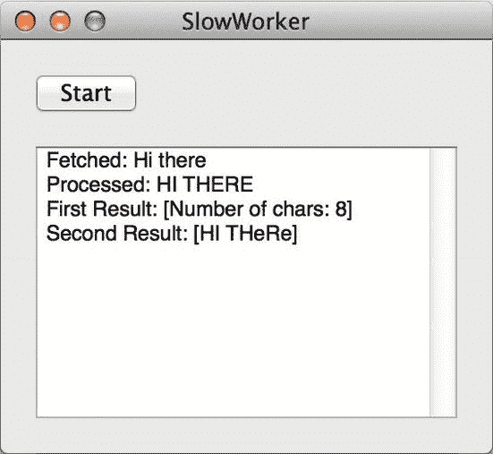

# SlowWorker

作为展示这些并发选项的平台，我们将创建一个名为 `SlowWorker` 的简单应用程序，它模拟执行一些长时间运行的操作，例如从服务器获取数据和执行计算。该应用为用户提供一个按钮来启动某项工作，并在文本视图中显示结果（见图 17-1）。



图 17-1. SlowWorker 的运行状态（或者说“静止状态”？）

首先，在 Xcode 中创建一个新的 Cocoa 应用程序。将其命名为 `SlowWorker`，并使用 `SW` 作为类前缀。不需要 Core Data 或文档支持。完成后，将以下粗体代码添加到 `SWAppDelegate.h` 中：

```
#import <Cocoa/Cocoa.h>

@interface SWAppDelegate : NSObject <NSApplicationDelegate>

@property (assign) IBOutlet NSWindow *window;
@property (weak) IBOutlet NSButton *startButton;
@property (assign) IBOutlet NSTextView *resultsTextView;
@property (assign) BOOL isWorking;

- (IBAction)doWork:(id)sender;

@end
```

这定义了两个指向 GUI 中可见对象的输出口、一个名为 `isWorking` 的布尔标志（我们稍后将用它来跟踪后台是否有任务正在运行），以及一个将由按钮触发的操作方法。

**注意：** 目光敏锐的读者会发现 `resultsTextView` 属性使用了 `assign` 而非 `weak` 声明。这是因为 `NSTextView` 禁止我们在弱引用上下文中使用它，就像第 11 章中讨论的 `NSWindow` 一样。在 OS X 中，没有多少类有这种限制，但你可以放心，当你尝试对不支持的类使用弱引用时，Xcode 会给出令人困惑的“不允许合成弱引用不可用的属性”错误。这就是向后兼容的代价。

现在，将以下代码块中的粗体方法添加到 `SWAppDelegate.m` 中：

```
#import "SWAppDelegate.h"

@implementation SWAppDelegate

- (void)applicationDidFinishLaunching:(NSNotification *)aNotification
{
    // 在此处插入代码以初始化您的应用程序
}

- (NSString *)fetchSomethingFromServer
{
    sleep(1);
    return @"Hi there";
}

- (NSString *)processData:(NSString *)data
{
    sleep(2);
    return [data uppercaseString];
}

- (NSString *)calculateFirstResult:(NSString *)data
{
    sleep(3);
    return [NSString stringWithFormat:@"Number of chars: %ld",
            [data length]];
}

- (NSString *)calculateSecondResult:(NSString *)data
{
    sleep(4);
    return [data stringByReplacingOccurrencesOfString:@"E"
                                          withString:@"e"];
}

- (IBAction)doWork:(id)sender
{
    NSDate *startTime = [NSDate date];
    NSString *fetchedData;
    NSString *processed;
    NSString *firstResult;
    NSString *secondResult;

    self.isWorking = YES;

    fetchedData = [self fetchSomethingFromServer];
    _resultsTextView.string = [_resultsTextView.string stringByAppendingFormat:
                              @"Fetched: %@\n", fetchedData];

    processed = [self processData:fetchedData];
    _resultsTextView.string = [_resultsTextView.string stringByAppendingFormat:
                              @"Processed: %@\n", processed];

    firstResult = [self calculateFirstResult:processed];
    secondResult = [self calculateSecondResult:processed];
    _resultsTextView.string = [_resultsTextView.string stringByAppendingFormat:
                              @"First Result: [%@]\nSecond Result: [%@]\n\n",
                              firstResult, secondResult];

    NSDate *endTime = [NSDate date];
    NSLog(@"Completed in %f seconds",
          [endTime timeIntervalSinceDate:startTime]);

    self.isWorking = NO;
}

@end
```

注意，这个类的工作（实际上就是这样）被拆分成若干小块。这段代码只是为了模拟一些缓慢的活动，这些方法本身实际上并没有耗费多少时间。所以，为了使其更有趣，每个方法都包含一个对 `sleep()` 函数的调用，这使得程序（具体来说是调用该函数的线程）在给定的秒数内暂停并什么都不做。`doWork:` 方法还在开头和结尾处包含了计算所有工作完成所需时间的代码。

现在，打开 `MainMenu.xib`，将一个 `NSButton` 和一个 `NSTextView` 放入空窗口中，按图 17-1 所示进行布局。将应用委托的两个输出口连接到相应的控件，并将按钮的动作连接回应用委托的 `doWork:` 方法。然后稍微配置一下 `NSTextView`，删除视图中的示例文本，并在属性检查器中取消选中 **Editable** 复选框。

现在保存工作，并在 Xcode 中点击 **Run**。应用程序应启动，点击按钮后，它将运行大约十秒钟（所有 sleep 时间的总和），然后才显示结果。大约五六秒后，鼠标光标将变成旋转的磁盘光标，并一直保持到工作完成。我们放置在窗口中的 `NSTextView` 直到最后都是空白的，尽管我们的代码偶尔会尝试更新其内容，这是因为需要重绘显示的主线程“卡住”了，正在处理所有后台任务。此外，在整个过程中，应用程序的菜单以及窗口控件都无法响应。实际上，除了通过 Mac OS X 的“强制退出”窗口来终止它之外，我们唯一能与应用程序交互的方式就是移动它的窗口，因为操作系统本身会处理这个操作。这正是我们要避免的状况！在这种特定情况下，情况并不算太糟，因为应用程序似乎只是挂起了几秒钟。但是，如果您的应用经常以这种“沙滩球”方式挂起远超过这个时间，那么您最终将招致一些不满的用户——甚至可能是一些前用户！


