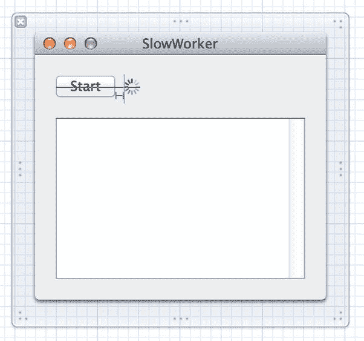

# 线程基础

在开始实现解决方案之前，我们先来回顾一下并发编程中的一些基础知识。这远非 OS X 或通用线程技术的完整描述，如需深入了解，请参考其他资料。这里仅讲解足够理解本章内容所需的知识。

在大多数现代操作系统（当然包括 OS X）中，除了包含磁盘上程序运行实例的进程概念外，还有执行线程的概念。每个进程可由多个并发运行的线程组成。如果仅有一个处理器核心，操作系统会在多个线程间切换执行，就像在多个进程间切换一样。如果存在多个核心，线程会像进程一样分布在各个核心上。

进程内的所有线程共享相同的可执行程序代码和全局数据。每个线程还可以拥有自己独有的数据。线程可以使用一种称为互斥锁（mutex，mutual exclusion 的缩写）或锁（lock）的特殊结构，它能确保某段代码不会同时被多个线程执行。当多个线程同时访问相同数据时，这种机制通过在某个线程更新值（即代码的"临界区"）时锁定其他线程，来确保结果的正确性。例如，假设我们的应用程序实现了一个银行系统，账户余额可以在交易中被修改。在多线程系统中，我们需要保护对账户余额进行加减操作的代码段，以消除两个线程同时修改余额的可能性。否则，两个线程可能会几乎同时读取旧余额，然后各自写回自己计算的新余额，而完全忽略对方所做的更改（即"竞态条件"），最终导致状态错误：最后设置值的线程成为"赢家"，另一个线程对余额的更改就此丢失。

处理线程时一个常见问题是代码的线程安全性。有些软件库在设计时就考虑了并发性，其所有临界区都恰当地用互斥锁保护。而有些代码库则没有这样做。例如，在 Cocoa 中，AppKit 框架（包含构建 GUI 应用程序专用的类，如 `NSApplication`、`NSView` 及其所有子类等）大部分都不是线程安全的。这意味着在运行的 Cocoa 应用程序中，所有涉及 AppKit 对象的方法调用都应在同一线程（通常称为主线程）中执行。如果从其他线程访问 AppKit 对象，后果不可预测，很可能会遇到看似无法解释的错误。默认情况下，Cocoa 应用程序的所有操作（例如处理用户事件触发的操作）都在主线程中进行，因此对于简单应用无需担心。用户触发的操作方法本身就运行在主线程中。本书至此，我们的代码一直仅在主线程中运行，但这个情况即将改变。

## 工作单元

刚才描述的线程模型的问题是，对于普通程序员而言，编写无错误的多线程代码几乎是不可能的。这并不是对我们行业或普通程序员能力的批判，而是一个客观观察。在多线程间同步数据和操作时，代码中需要考虑的复杂交互对大多数人来说实在太难应对。试想一下，在所有人群中只有 5% 的人有能力编写软件。而这 5% 中仅有一小部分真正有能力编写高负载的多线程应用。即使是成功实现过多线程开发的人，也常常建议他人不要效仿他们的做法！

幸运的是，希望犹存。无需过多涉及底层线程操作，也能实现一定的并发性。就像我们无需直接操作视频 RAM 的位就能在屏幕显示数据，无需直接与磁盘控制器交互就能从磁盘读取数据一样，存在一些软件抽象层，让我们可以在多个线程上运行代码，而无需直接处理线程本身。Apple 鼓励我们使用的解决方案，核心思想是将长时间运行的任务拆分为工作单元，并将这些单元放入队列中执行。系统为我们管理队列，在多个线程上执行工作单元。我们无需直接启动和管理后台线程，也无需处理通常实现并发应用时所需的许多"簿记"工作。系统会替我们处理这些。

## 操作队列

自 OS X 10.5 发布以来，Apple 为我们提供了 `NSOperation` 和 `NSOperationQueue` 这对类，它们协同工作以实现操作队列。其理念是将计算任务拆分为块或工作单元，将每个单元封装在 `NSOperation` 中，然后将每个操作放入 `NSOperationQueue`。我们还可以建立操作间的依赖关系，指定某个操作必须等另一个操作完成后才能开始执行。`NSOperationQueue` 会尽其所能处理这些单元，根据操作添加到队列的顺序以及我们指定的依赖关系来决定执行方案。如果我们指定的依赖关系允许某些操作同时执行，且有足够的核心可用，操作队列将使用多个线程同时执行多个操作。


### 成为代码块高手

无论是使用 `NSOperationQueue` 还是 GCD，利用 Apple 并发 API 最直接的方式之一就是使用代码块。代码块与 GCD 一同发布，是 Apple 添加到 C 语言本身（并由此扩展到 Objective-C 和 C++）的一种新语法。这种新语言特性（在其他一些语言中也称为闭包）对于充分发挥 GCD 的能力至关重要。

代码块的核心思想是让一段特定的代码能够像其他 C 语言类型一样被处理。代码块可以赋值给变量，作为参数传递给函数或方法，并且通常可以像其他 Objective-C 对象一样被处理。与 C 语言中大多数其他类型不同，代码块还可以被执行。我们可以在一个对象中创建代码块，并将其传递给另一个对象，由后者稍后执行。通过这种方式，代码块可以作为 Objective-C 中委托模式或 C 语言中回调函数的一种替代方案。

与方法或函数非常相似，代码块可以接受一个或多个参数，并指定一个返回值。为了声明一个代码块变量，我们使用脱字符号（`^`）以及一些额外的括号来声明参数和返回类型。要定义代码块本身，我们大致采用相同的方式，但随后要用花括号包裹的实际代码来定义它。以下是我们讨论的一些示例：

```
// 声明一个名为 "loggerBlock" 的代码块变量，无参数，无返回值。
void (^loggerBlock)(void);

// 为上面声明的变量赋值一个代码块。像这样一个没有参数且没有返回值的代码块，
// 不需要像前面变量声明中那样使用 void 等“装饰”。
loggerBlock = ^{ NSLog(@"我很高兴他们没把它叫做闭包"); };

// 执行代码块，就像调用函数一样。
loggerBlock();  // 这会在控制台产生一些输出
```

如果你做过很多 C 语言编程，可能会意识到这类似于 C 语言中函数指针的概念。然而，两者之间存在一些关键区别。也许最大的区别在于，代码块可以在函数或方法体内联定义。我们可以在将代码块赋值给变量或传递给另一个方法或函数的地方直接定义它。另一个重要的区别是，代码块可以访问其创建时所在作用域中的变量。

默认情况下，代码块对我们通过这种方式访问的任何变量都会创建只读副本，保持原始变量不变。同时，它会自动增加从周围作用域使用的任何 Objective-C 对象的引用计数，并在代码块执行完毕后再次减少引用计数。然而，我们可以通过在外部变量的声明前加上 `__block`，使其变为可读写。

```
// 定义一个可以被代码块修改的变量
__block int a = 0;

// 定义一个试图修改其作用域内变量的代码块
void (^sillyBlock)(void) = ^{ a = 47; };

// 在调用代码块前检查变量的值
NSLog(@"a == %d", a); // 输出 "a == 0"

// 执行代码块
sillyBlock();

// 在调用代码块后再次检查变量的值
NSLog(@"a == %d", a); // 输出 "a == 47"
```

如前所述，代码块与 GCD 结合使用时才能真正大放异彩。GCD 包含一组函数，这些函数可以完成与 `NSOperation` 和 `NSOperationQueue` 类似的任务，但采用了不同的思路。主要区别在于，GCD 无需显式创建一堆操作、可选地声明操作间依赖关系、然后将操作添加到队列中；我们只需调用一个函数，该函数接受一个代码块，并在单一步骤中将其添加到队列。我们稍后会讨论这一点，但首先，我们将展示如何使用操作队列来处理并发。

### 让 `SlowWorker` 焕发活力

为了了解操作队列的工作原理，让我们在 `SlowWorker` 项目中对它们进行测试。在开始之前，请复制包含 `SlowWorker` 项目的整个文件夹。在本章后面，我们将使用 `SlowWorker` 的原始版本作为实现并发的另一种方式的起点，所以请保留一份副本。

回想一下，这个应用的问题在于，单一的动作方法按顺序调用了多个其他方法，这些方法的总耗时足以让应用感觉反应迟钝。我们要做的是将每个其他方法放入一个操作中，将所有操作放入一个队列，然后让队列自行处理这一切。

`doWork:` 方法是我们进行所有修改的地方。首先，我们为所有本地 `NSString` 变量添加 `__block` 存储限定符。然后，我们将每一小段工作封装在代码块内，声明一些依赖关系以确保它们按正确顺序执行，最后将它们传递给一个新队列执行。请看下面加粗的行（当然，也请将它们添加到我们的方法中），然后我们将更详细地讨论细节：

```
- (IBAction)doWork:(id)sender {
    NSDate *startTime = [NSDate date];
    __block NSString *fetchedData;
    __block NSString *processed;
    __block NSString *firstResult;
    __block NSString *secondResult;

    self.isWorking = YES;

    NSBlockOperation *fetch = [NSBlockOperation blockOperationWithBlock:^{
        fetchedData = [self fetchSomethingFromServer];
        _resultsTextView.string = [_resultsTextView.string stringByAppendingFormat:
            @"已获取: %@\n", fetchedData];
    }];

    NSBlockOperation *process = [NSBlockOperation blockOperationWithBlock:^{
        processed = [self processData:fetchedData];
        _resultsTextView.string = [_resultsTextView.string stringByAppendingFormat:
            @"已处理: %@\n", processed];
    }];

    NSBlockOperation *calcFirst = [NSBlockOperation blockOperationWithBlock:^{
        firstResult = [self calculateFirstResult:processed];
    }];

    NSBlockOperation *calcSecond = [NSBlockOperation blockOperationWithBlock:^{
        secondResult = [self calculateSecondResult:processed];
    }];

    NSBlockOperation *showResults = [NSBlockOperation blockOperationWithBlock:^{
        _resultsTextView.string = [_resultsTextView.string stringByAppendingFormat:
            @"第一个结果: [%@]\n 第二个结果: [%@]\n\n",
            firstResult, secondResult];
        NSDate *endTime = [NSDate date];
        NSLog(@"在 %f 秒内完成",
            [endTime timeIntervalSinceDate:startTime]);
        self.isWorking = YES;
    }];

    [process addDependency:fetch];
    [calcFirst addDependency:process];
    [calcSecond addDependency:process];
    [showResults addDependency:calcFirst];
    [showResults addDependency:calcSecond];

    NSOperationQueue *queue = [[NSOperationQueue alloc] init];
    [queue addOperations:@[fetch, process, calcFirst, calcSecond, showResults]
        waitUntilFinished:NO];
}
```

我们做的第一件事是为一些本地变量添加了 `__block` 存储限定符。这样，每个 `NSString` 指针都保持为一个单一的、唯一的指针，每个代码块都可以对该指针进行读写操作。在此上下文中，“写入”意味着将指针赋值为指向一个不同的对象。如果没有 `__block`，每个代码块都会获得一个属于自己的新指针，所有指针都指向同一个初始对象，并且它们完全不可写！所以，`__block` 为我们提供了一种在代码块之间共享某些数据的方法。

接下来，我们创建了一些操作。现在不再直接执行每个工作方法，而是为每个方法创建一个 `NSBlockOperation`。`NSBlockOperation` 只是 `NSOperation` 的一个子类，专门设计用于从代码块创建。

然后，我们在这些操作之间定义了一组依赖关系，以便 `process` 仅在 `fetch` 完成后执行，`calcFirst` 和 `calcSecond` 仅在 `process` 完成后执行，而 `showResults` 仅在所有其他操作完成后执行。


最后，我们创建一个新的`NSOperationQueue`，并将包含所有操作的数组传递给它。该队列会检查这些操作之间的所有依赖关系，并确定如何以正确的顺序执行它们。

### 主线程需求

然而，我们仍然没有完全准备好运行。请记住，`AppKit`类（例如所有窗口和视图类）通常不是线程安全的。对它们的所有访问都应在主线程上执行。但目前我们正在从几个操作中访问`NSTextView`。很可能，其中一些操作会在轮到它们时在其他线程上运行！尽管这在简单的测试应用中可能“有效”，但这不是一个真正安全的构建基础。我们需要调整每个操作，以确保所有对`NSTextView`的访问都发生在主线程上。

为此，我们将把每个这样的访问包装在另一个块中，该块将直接传递给一个始终在主线程上运行其操作的特殊队列。下面的粗体代码显示了我们需要对`doWork:`方法进行的最终修改：

```
- (IBAction)doWork:(id)sender {

    NSDate *startTime = [NSDate date];

    __block NSString *fetchedData;

    __block NSString *processed;

    __block NSString *firstResult;

    __block NSString *secondResult;

    self.isWorking = YES;

    NSBlockOperation *fetch = [NSBlockOperation blockOperationWithBlock:^{

        fetchedData = [self fetchSomethingFromServer];

        [[NSOperationQueue mainQueue] addOperationWithBlock:^{

            _resultsTextView.string = [_resultsTextView.string stringByAppendingFormat:

                                        @"Fetched: %@\n", fetchedData];

        }];

    }];

    NSBlockOperation *process = [NSBlockOperation blockOperationWithBlock:^{

        processed = [self processData:fetchedData];

        [[NSOperationQueue mainQueue] addOperationWithBlock:^{

            _resultsTextView.string = [_resultsTextView.string stringByAppendingFormat:

                                        @"Processed: %@\n", processed];

        }];

    }];

    NSBlockOperation *calcFirst = [NSBlockOperation blockOperationWithBlock:^{

        firstResult = [self calculateFirstResult:processed];

    }];

    NSBlockOperation *calcSecond = [NSBlockOperation blockOperationWithBlock:^{

        secondResult = [self calculateSecondResult:processed];

    }];

    NSBlockOperation *showResults = [NSBlockOperation blockOperationWithBlock:^{

        [[NSOperationQueue mainQueue] addOperationWithBlock:^{

            _resultsTextView.string = [_resultsTextView.string stringByAppendingFormat:

                                        @"First Result: [%@]\nSecond Result: [%@]\n\n",

                                        firstResult, secondResult];

            NSDate *endTime = [NSDate date];

            NSLog(@"Completed in %f seconds",

                  [endTime timeIntervalSinceDate:startTime]);

            self.isWorking = NO;

        }];

    }];

    [process addDependency:fetch];

    [calcFirst addDependency:process];

    [calcSecond addDependency:process];

    [showResults addDependency:calcFirst];

    [showResults addDependency:calcSecond];

    NSOperationQueue *queue = [[NSOperationQueue alloc] init];

    [queue addOperations:@[fetch, process, calcFirst, calcSecond, showResults]

          waitUntilFinished:NO];

}
```

现在我们应该能够运行我们的应用了，点击开始按钮后，我们会注意到一些也许略有不同的现象：按钮立即恢复为非点击状态，菜单仍然可用。前两个操作在完成时将一些文本放入`NSTextView`中。大约七秒后（相比第一个版本使用的十秒有所减少，因为我们的一些工作方法现在正在同时运行），最终输出出现在文本视图中。这一切都很好，但我们还可以通过使用`Cocoa Bindings`和我们一开始创建的`isWorking`属性来让事情变得更加响应。再次打开`MainMenu.xib`，使用对象库找到圆形进度指示器。然后将其添加到我们的窗口中，如图 17-2 所示。



图 17-2.

添加进度指示器

选中进度指示器后，使用属性检查器确保其“暂停时显示”复选框已关闭。然后切换到绑定检查器，展开其`Animate`参数的视图，并将其绑定到应用委托，将`isWorking`作为模型键路径。然后选择窗口中的开始按钮，进行类似的配置。将按钮的`Enabled`属性绑定到应用委托，键路径为`isWorking`，这次添加一个`NSNegateBoolean`作为值转换器。

保存更改，点击运行；当我们点击开始按钮时，它变为禁用状态，圆形进度指示器出现并开始旋转。当工作完成时，进度指示器消失，按钮恢复正常。

现在让我们再进一步：添加一个水平进度指示器（一种水平移动，告诉我们事情正在发生，例如在软件安装程序中）。进度视图将从 0 到 4，每个工作方法都会将数字增加一点。与圆形进度指示器一样，这将完全通过`Cocoa Bindings`配置。

首先，在`SWAppDelegate.h`中添加一个名为`completed`的新属性：

```
//  SWAppDelegate.h
//  Insert this after the @interface line

@property (assign) NSInteger completed;
```

接下来，切换到`SWAppDelegate.m`。在`doWork:`方法的顶部附近添加以下内容，以便在用户点击开始按钮时重置此计数器：

```
self.completed = 0;
```

现在，每个工作方法都需要在完成时递增此变量。我们可以在每个工作方法中添加以下行：

```
self.completed = self.completed + 1;
```

然而，这就是那些棘手的多线程问题出现的地方。在这行代码中，实际发生的是：它首先通过调用`[self completed]`获取`completed`属性的当前值，然后加 1，然后通过调用`[self setCompleted:]`将结果存储回`completed`属性。在多线程环境中，这可能导致错误行为。例如，如果两个线程大约在同一时间执行这样一行代码会怎样？假设`completed`的起始值是 2。如果两个线程在任何一个写出自己的结果之前读取了当前值，那么每个线程都会在自己的值副本上加 1，然后每个线程都会将它们的局部和（3）写回`completed`属性，最终该属性包含值 3，而不是正确的值 4。

解决这个问题的一种方法是使用`Objective-C`的`@synchronized`关键字，它允许我们指定一段代码一次只能由一个线程运行。在应用委托的`@implementation`部分中的某处输入以下方法：

```
- (void)incrementCompleted {
    @synchronized(self) {
        self.completed = self.completed + 1;
    }
}
```

我们在这里所做的是将之前想到的相同代码包裹在一种安全区域内。`@synchronized`关键字接受一个对象作为其参数，该对象将用于确定同步限制的范围。基本上，任何使用相同值的调用都会尝试获取相同的锁。如果其他线程已经占用了该锁，当前线程必须等待直到其他线程完成。在这种情况下，因为我们使用了`self`，对同一实例上的此方法的所有调用都将尝试获取相同的锁。我们只有一个应用委托实例，因此这实际上是一个全局锁，但对于我们的目的来说是可以的。

为了让其工作，我们需要进行的编码是：在每个工作方法的`return`之前添加以下一行：

```
[self incrementCompleted];
```


好的，作为一名高级文档工程师和翻译员，我将严格按照您提供的注意事项和示例格式，将给定的英文文本翻译成中文。


最后，我们需要配置 GUI。回到 Interface Builder 中的`MainMenu.xib`文件，在库中搜索进度指示器。除了我们已经使用过的圆形进度指示器之外，还有一个标有“不确定进度指示器”（Indeterminate Progress Indicator）的水平进度指示器。将其拖拽到窗口中，并按图 17-3 所示进行布局。


图 17-3.

最终的 GUI 润色

现在调出属性检查器。单击取消勾选“停止时显示”（Display When Stopped）和“不确定”（Indeterminate）两个复选框，然后将其“最小值”（Minimum）和“当前值”（Current）设置为 0，将“最大值”（Maximum）设置为 4。现在切换到绑定检查器，我们将在此处配置两个绑定。首先，将其“动画”（Animate）属性绑定到应用程序委托的`isWorking`键，就像我们为圆形进度指示器所做的那样。然后，将其“值”（Value）属性绑定到应用程序委托的`completed`键。

保存工作，运行，并单击“开始”（Start）按钮。在圆形进度指示器旁边，会出现一个水平进度指示器，随着每个工作方法的完成，会有一条条在移动。

就是这样：相对无痛的并发处理。诚然，这个精心设计的例子与大型应用程序相比不算什么，但这些概念可以扩展以处理更复杂的情况。我们所展示的内容在今天 OS X 和 iOS 应用程序中运行良好，但苹果并没有止步于此。从 Snow Leopard 开始，`NSOperation` 和 `NSOperationQueue` 的大部分设计已经在操作系统底层被重新实现，从而诞生了一项名为 Grand Central Dispatch 的出色技术。

## GCD：底层队列

这种将工作单元放入队列中，在后台执行，并由系统为我们管理线程的想法非常强大，并且极大地简化了许多需要并发的开发场景。似乎一旦这项技术以 `NSOperationQueue` 的形式在 Leopard 中启动并运行，苹果就决定制作一个更通用的解决方案，使其不仅可以从 Objective-C 中使用，还可以从 C 和 C++ 中使用。从 Snow Leopard 开始，这个名为 Grand Central Dispatch（从现在开始我们称之为 GCD）的解决方案就可以使用了。GCD 将 `NSOperationQueue` 的大部分核心概念——工作单元、无痛的后台处理、自动线程管理——放入了一个可以从所有基于 C 的语言中使用的 C 接口中。这意味着它不仅适用于 Cocoa 程序员。现在，即使是使用 C 编写的底层命令行工具也可以利用这些特性。`NSOperationQueue` 本身也是使用 GCD 为 Snow Leopard 重写的，更棒的是，苹果将其 GCD 的实现开源，以便它也可以移植到其他类 Unix 操作系统上。

`NSOperationQueue` 和 GCD 中队列在设计上的主要区别在于，`NSOperationQueue` 可以处理其 `NSOperation` 之间任意复杂的依赖关系，以确定它们的执行顺序，而 GCD 队列则是严格的 FIFO（先进先出）。添加到 GCD 队列中的工作单元将始终按照它们被放入队列的顺序启动。话虽如此，它们可能不会总是以相同的顺序完成，因为 GCD 队列会自动将其工作分配给多个线程。

使用 GCD，每个队列都可以访问一个线程池，这些线程在应用程序的整个生命周期中被重复使用。GCD 将始终尝试维护一个适合机器架构的线程池，在有工作要做时自动利用更强大的机器，使用更多的处理器核心。

### 再次改进 SlowWorker

为了了解其工作原理，让我们看一下 SlowWorker 的 `doWork:` 方法的原始形式。为此，请打开我们之前制作的原始 SlowWorker 项目目录的副本，并将其用于我们接下来要展示的其余更改。这是原始方法：

```
- (IBAction)doWork:(id)sender {

    NSDate *startTime = [NSDate date];

    NSString *fetchedData;

    NSString *processed;

    NSString *firstResult;

    NSString *secondResult;

    self.isWorking = YES;

    fetchedData = [self fetchSomethingFromServer];

    _resultsTextView.string = [_resultsTextView.string stringByAppendingFormat:

                                @"Fetched: %@\n", fetchedData];

    processed = [self processData:fetchedData];

    _resultsTextView.string = [_resultsTextView.string stringByAppendingFormat:

                                @"Processed: %@\n", processed];

    firstResult = [self calculateFirstResult:processed];

    secondResult = [self calculateSecondResult:processed];

    _resultsTextView.string = [_resultsTextView.string stringByAppendingFormat:

                                @"First Result: [%@]\nSecond Result: [%@]\n\n",

                                firstResult, secondResult];

    NSDate *endTime = [NSDate date];

    NSLog(@"Completed in %f seconds",

          [endTime timeIntervalSinceDate:startTime]);

    self.isWorking = NO;

}
```

我们可以通过将所有代码包装在一个块中并将其传递给一个名为 `dispatch_async` 的 GCD 函数，来使此方法完全在后台运行。此函数接受两个参数：一个 GCD 调度队列（概念上类似于 `NSOperationQueue`）和一个要分配给该队列的块。与另一种方法一样，我们也将为局部变量添加 `__block` 存储限定符。请看：

```
- (IBAction)doWork:(id)sender {

    NSDate *startTime = [NSDate date];

    __block NSString *fetchedData;

    __block NSString *processed;

    __block NSString *firstResult;

    __block NSString *secondResult;

    self.isWorking = YES;

    dispatch_async(dispatch_get_global_queue(0, 0), ^{

        fetchedData = [self fetchSomethingFromServer];

        _resultsTextView.string = [_resultsTextView.string stringByAppendingFormat:

                                    @"Fetched: %@\n", fetchedData];

        processed = [self processData:fetchedData];

        _resultsTextView.string = [_resultsTextView.string stringByAppendingFormat:

                                    @"Processed: %@\n", processed];

        firstResult = [self calculateFirstResult:processed];

        secondResult = [self calculateSecondResult:processed];

        _resultsTextView.string = [_resultsTextView.string stringByAppendingFormat:

                                    @"First Result: [%@]\nSecond Result: [%@]\n\n",

                                    firstResult, secondResult];

        NSDate *endTime = [NSDate date];

        NSLog(@"Completed in %f seconds",

              [endTime timeIntervalSinceDate:startTime]);

        self.isWorking = NO;

    });

}
```

这种方法首先通过使用 `dispatch_get_global_queue()` 函数获取一个始终可用的预先存在的全局队列（与 `NSOperationQueue` 不同，使用 GCD 时，始终有一个可用的全局队列，可以随时将工作分派到后台线程）。该函数接受两个参数：第一个参数允许我们指定优先级，第二个参数当前未使用，应始终为 0。如果在第一个参数中指定了不同的优先级，例如 `DISPATCH_QUEUE_PRIORITY_HIGH` 或 `DISPATCH_QUEUE_PRIORITY_LOW`（传递 0 等同于传递 `DISPATCH_QUEUE_PRIORITY_DEFAULT`），我们实际上会获得一个不同的全局队列，系统会为其分配不同的优先级。现在，我们将坚持使用默认的全局队列。

然后，该队列与后面的代码块一起传递给 `dispatch_async()` 函数。接着，GCD 会获取整个块并将其交给一个后台线程，在那里它将一步一步地执行，就像它在主线程中运行时一样。


### 别忘记主线程

这里存在一个问题：AppKit 的线程安全性。请记住，在后台线程中向任何 GUI 对象（包括我们的 `resultsTextView`）发送消息是绝对不允许的。幸运的是，GCD 也为我们提供了处理此问题的方法。在代码块内部，我们可以调用另一个调度函数，将工作传递回主线程！我们通过再次调用 `dispatch_async()` 来实现这一点，这次传入的是由 `dispatch_get_main_queue()` 函数返回的队列，该函数始终会返回驻留在主线程上的特殊队列，该队列随时准备执行需要使用主线程的代码块。添加以下粗体显示的代码行后，所有 AppKit 调用都将在主线程上执行：

```
- (IBAction)doWork:(id)sender {
    NSDate *startTime = [NSDate date];
    __block NSString *fetchedData;
    __block NSString *processed;
    __block NSString *firstResult;
    __block NSString *secondResult;
    self.isWorking = YES;
    dispatch_async(dispatch_get_global_queue(0, 0), ^{
        fetchedData = [self fetchSomethingFromServer];
        dispatch_async(dispatch_get_main_queue(), ^{
            _resultsTextView.string = [_resultsTextView.string stringByAppendingFormat:
                                       @"获取: %@\n", fetchedData];
        });
        processed = [self processData:fetchedData];
        dispatch_async(dispatch_get_main_queue(), ^{
            _resultsTextView.string = [_resultsTextView.string stringByAppendingFormat:
                                       @"处理: %@\n", processed];
        });
        firstResult = [self calculateFirstResult:processed];
        secondResult = [self calculateSecondResult:processed];
        dispatch_async(dispatch_get_main_queue(), ^{
            _resultsTextView.string = [_resultsTextView.string stringByAppendingFormat:
                                       @"结果一: [%@]\n 结果二: [%@]\n\n",
                                       firstResult, secondResult];
        });
        NSDate *endTime = [NSDate date];
        NSLog(@"完成时间为 %f 秒",
              [endTime timeIntervalSinceDate:startTime]);
        self.isWorking = NO;
    });
}
```

### GCD 中的并发代码块

我们还需要再做一处修改，才能使这个程序的行为与之前使用 `NSOperationQueue` 的版本相同，且运行速度至少一样快。还记得吗？在设置队列中的操作时，我们通过使用依赖关系，让 `calculateFirstResult` 和 `calculateSecondResult` 能同时运行？我们声明了它们各自都依赖于前面对 `processData` 的调用，而后续对 `finishWorking` 的调用又依赖于这两者。这样操作队列就能在可能的情况下同时运行这两个操作。而目前 GCD 版本的代码并非如此。代码会如同所示那样直接顺序执行，总是在 `calculateFirstResult:` 完成后才调用 `calculateSecondResult:`。

幸运的是，GCD 再次提供了实现相同功能的方法，即使用所谓的**调度组 (dispatch group)**。在组上下文中被异步调度的所有代码块都会尽快执行，如果可能，还会被分配到多个线程上并发执行。我们还可以使用 `dispatch_group_notify()` 来指定一个额外的代码块，该代码块会在组中所有代码块执行完毕后被调用。代码如下所示：

```
- (IBAction)doWork:(id)sender {
  NSDate *startTime = [NSDate date];
  dispatch_async(dispatch_get_global_queue(0, 0), ^{
    NSString *fetchedData = [self fetchSomethingFromServer];
    NSString *processed = [self processData:fetchedData];
    __block NSString *firstResult;
    __block NSString *secondResult;
    dispatch_group_t group = dispatch_group_create();
    dispatch_group_async(group, dispatch_get_global_queue(0, 0), ^{
      firstResult = [self calculateFirstResult:processed];
    });
    dispatch_group_async(group, dispatch_get_global_queue(0, 0), ^{
      secondResult = [self calculateSecondResult:processed];
    });
    dispatch_group_notify(group, dispatch_get_global_queue(0, 0), ^{
      NSString *resultsSummary = [NSString stringWithFormat:
        @"结果一: [%@]\n 结果二: [%@]", firstResult, secondResult];
      dispatch_async(dispatch_get_main_queue(), ^{
        [_resultsTextView setString:resultsSummary];
      });
      NSDate *endTime = [NSDate date];
      NSLog(@"完成时间为 %f 秒",
        [endTime timeIntervalSinceDate:startTime]);
    });
  });
}
```

完成所有这些修改后，我们应该可以运行应用并看到与第一轮改进后相同的行为和性能，但尚未包含使用 Cocoa Bindings 在执行工作时改进 GUI 行为的那些额外变更。将那些修改应用到 GCD 增强版的 SlowWorker 应用，将作为练习留给读者完成。

## 一点并发，大有裨益

现在我们看到了在应用中使用 `NSOperationQueue` 和 GCD 提供基本并发的具体示例。我们简单的示例项目并没有做什么有趣的事情，但这些技术可以应用于任何涉及耗时活动且不想让用户看到旋转的忙碌光标的情况。我们还学习了一些关于新代码块语法 (block syntax) 的知识，以及如何使用它来创建准备在后台线程中运行的工作单元。

使用这些技术可以对你的应用的用户体验产生巨大影响，任何时候当你的用户等待应用处理某些事情时，你都应该使用它们！使用 `NSOperationQueue` 还是 GCD，由你来决定。请记住，自 OS X 10.6 起的每个版本中，`NSOperationQueue` 都是基于 GCD 实现的，因此无论采用哪种方式，你的应用都将具有相似的性能特性。具体选择哪一种，由你来决定。


