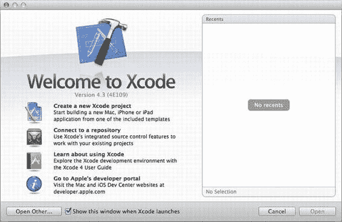
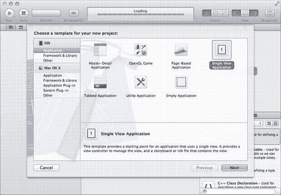
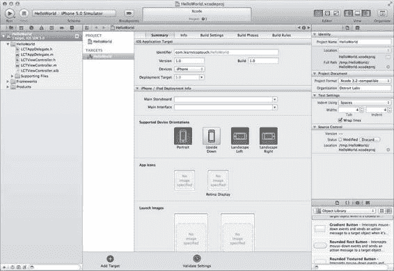
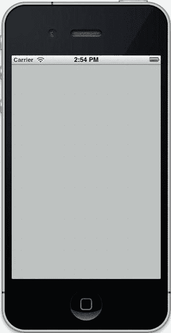
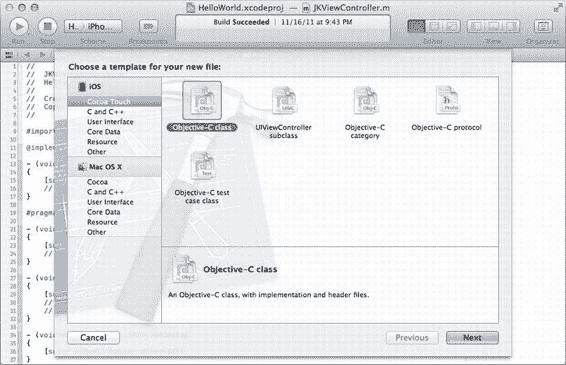
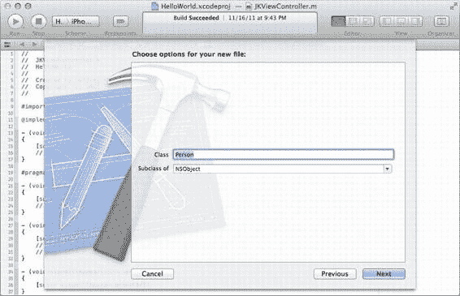

# iOS 开发入门

ARM 处理器。因此，在发布应用之前，务必在真机上进行测试，以确保不存在任何特定于设备的错误。

`Xcode` 允许你下载完整文档集的本地副本，该文档集通常可从 [`developer.apple.com`](http://developer.apple.com) 获取；这些文档能让你在编写代码时，在 `Xcode` 内联查看帮助信息。

最后，该工具集包含编译器、链接器以及将代码转换为实际可运行应用所需的其他工具。如果你熟悉命令行，现在就可以使用 `gcc` 及相关工具来编译应用程序。`Xcode 4` 已将 `GCC` 替换为运行于 `LLVM` 架构上的 `Clang`，这是一种更现代的编译器，也是新的默认选项。在大多数情况下，`LLVM` 可以替代 `GCC` 且不会损失功能——事实上，在最新的工具集发行版中，`gcc` 命令行工具实际上只是指向 `LLVM` 的符号链接。

要开始，请启动 `Xcode`。默认路径为 `/Applications/Xcode.app`。安装并启动 `Xcode` 后，让我们来制作第一个应用程序。

## 你好，世界！

首次启动 `Xcode` 时，你会看到一个欢迎界面（图 1-1）。在此界面中，你可以打开最近的项目、访问 Apple 开发者网站、打开 `Xcode` 用户指南（你绝对应该找个时间阅读）、从版本控制系统下载源代码，以及创建新项目。由于我们尚未创建项目，请点击“Create a new Xcode project”。

[www.it-ebooks.info](http://www.it-ebooks.info/)



**图 1-1.** *Xcode 欢迎界面*

当你创建新项目时，`Xcode` 会显示一个向导（如图 1-2 所示），该向导从列出其能够创建的项目类型开始。`Xcode` 使用模板来加速常见类型应用的开发。在左侧，你可以看到当前已安装的模板类别。如果尚未选择，请选择左侧 `iOS` 下的 `Application`，以显示所有 iOS 模板。我们的简单应用将只有一个屏幕，因此选择 `Single View Application`，然后点击 `Next`。

[www.it-ebooks.info](http://www.it-ebooks.info/)



**图 1-2.** *从 Xcode 新项目向导中选择模板*

下一个屏幕为你提供了一些选项，用于设置项目的元数据，并进一步细化 `Xcode` 使用的模板。由于这是我们的第一个项目，我们将创建一个“Hello, World!” iOS 应用。“Hello, World!” 是一项几乎与编程本身一样古老的传统，你在一种新语言或新平台上做的第一件事就是创建一个向用户显示“Hello, World!”文字的程序。在 `Product Name` 中输入 `HelloWorld`。`Company Identifier` 值应为你的公司名称的反向 DNS 标签（如果你有公司的话）。如果没有，使用你的个人网站即可。如果没有个人网站，建议在向 App Store 发布任何应用之前先申请一个。由于我的网站是 [`learncocoatouch.com`](http://learncocoatouch.com)，我使用 `com.learncocoatouch` 作为我的公司标识符。这种反向 DNS 样式的列表在 iOS 中常用于区分应用和其他可识别的事物，通常会在末尾附加你的应用 ID。对我来说，`HelloWorld` 项目的标识符为 `com.learncocoatouch.HelloWorld`。应用 ID 在 App Store 中必须是唯一的，如果在设备上安装与应用 ID 相同的另一个应用，则会覆盖现有的应用。

`class prefix`（类前缀）用于标识你创建的代码，并将其与他人编写的代码区分开来。通常你会使用你的姓名首字母。这对于确保两个开发者不会创建同名的事物非常重要。如果你的姓名首字母恰好与另一位开发者或系统框架使用的前缀相同，你可以使用三个字母、公司名称中的字母，或任何你喜欢的字母组合。对于 Learn Cocoa Touch，我将使用 `LCT`。

**注意：** 你可以在 [www.cocoadev.com/index.pl?ChooseYourOwnPrefix](http://www.cocoadev.com/index.pl?ChooseYourOwnPrefix) 找到一份非官方的“已声明”前缀列表。现在就去声明你的吧！

接下来的选项会影响项目将使用的模板。暂时将 `Device Family` 设置为 `iPhone`。如果你正在为 iPad 或支持两种设备的通用应用创建应用，就在这里进行设置。取消勾选 `Use Storyboard` 和 `Include Unit Tests`，但勾选 `Automatic Reference Counting`。我们稍后会详细介绍它们的含义。设置完成后，我们终于可以创建应用了。你的屏幕应如图 1-3 所示。点击 `Next`。

**图 1-3.** *为新项目选择选项*

[www.it-ebooks.info](http://www.it-ebooks.info/)



`Xcode` 会提示你在硬盘上选择项目的位置，并允许你在创建项目时选择创建本地 `Git` 仓库。如果你了解并使用 `Git`，可以自由选择该选项；否则，对于本项目来说并非必需。在阅读本书的过程中，你可能会发现，在你的 Home 文件夹中为我们将编写的各种应用创建一个单独的目录会很有用，例如 `~/Projects/Learn Cocoa Touch/`。

选择位置后，`Xcode` 会创建你的项目。初始界面（如图 1-4 所示）会显示你的项目设置。在这里，我们可以修改项目元数据，例如支持的屏幕分辨率、项目将运行的 iOS 版本、应用的版本号、支持的设备方向、要使用的图标等。我们现在暂时不做修改。

**图 1-4.** *创建项目后 Xcode 窗口的初始布局*

要在 iOS 模拟器中运行你的应用，请点击 `Xcode` 窗口左上角的 `Run` 按钮（看起来像 iTunes 播放按钮的那个）。由于我们还没有修改代码，所以看起来没什么内容。图 1-5 显示了此时运行应用时应看到的内容。

[www.it-ebooks.info](http://www.it-ebooks.info/)



**注意：** 如果 `Run` 按钮右侧的文字显示为 `iOS Device`，请将选择更改为 `iPhone Simulator`。

**图 1-5.** *我们的第一个 iOS 应用在模拟器中运行*

现在我们已经设置好应用并准备进行修改，让我们看看本应用的目标：

**目标：** 构建一个向用户显示“Hello, world!”的应用。

准备好修改应用了吗？很好。退出 iOS 模拟器并返回 `Xcode`。按 `Command+1` 打开左侧窗格中的 `File` 浏览器。找到 `HelloWorld` 下以 `ViewController.xib` 结尾的文件并选中它。请注意，文件名会以你的类前缀开头——在我的例子中，它默认名为 `LCTViewController.xib`。该文件将在 Interface Builder 视图中打开：这是应用界面的可视化布局。目前，它和你在 iOS 模拟器中看到的灰色视图一样。让我们来改变它。屏幕右下角包含 `Object Library`（对象库），这是一个可添加到视图中的用户界面元素集合。你可以按 `Control+Option+Command+3` 切换到其搜索字段。图 1-6 显示了启用 `Object Library` 后你的屏幕应该呈现的样子。

**图 1-6.** *使用 Interface Builder 且对象库可见的 Xcode 窗口。*


## 添加对象到视图

要向视图中添加对象，可以从对象库（Object Library）中将其拖拽到视图，或双击它。拖拽两个对象到视图：一个标签（Label）和一个圆角矩形按钮（Round Rect Button）。双击按钮添加标题；我们让这个按钮显示“Say Hello”。注意，添加标题时按钮会自动调整大小。你可以通过按`Command+=`让标签和按钮根据内容自动调整大小。

双击标签并删除文本，然后让它横向拉伸覆盖视图。删除文本后，标签将变得不可见；如果找不到它，请点击`Editor` ➤ `Canvas` ➤ `Show Bounds Rectangles`，这将为标签显示轮廓。完成后，它应该看起来像图 1-7。如果是这样，现在是个保存工作的好时机。`Xcode`并不完美，如果它崩溃了，你未保存的更改也会丢失，因此养成经常保存的习惯是值得推荐的。

---

## 第一章：入门

**图 1-7.** *为“Hello, World”应用设置的视图*

现在让我们为这个应用添加一些代码。我们希望当用户按下按钮时，标签显示“Hello, World!”。为此，我们将向视图控制器（view controller）添加一个方法。**方法**（Method）是 Objective-C 中函数的叫法。如果你熟悉面向对象编程，那么方法对你来说不会陌生。如果不熟悉，请跟着本章的步骤操作；我们将在后面更详细地讨论 Objective-C。

视图控制器的头文件（header file）是描述它的文件。头文件是你代码的“公开”部分；它们描述代码将做什么，而不实际展示其工作原理。当你收到已编译的源代码时，通常也会收到相关的头文件。在文件浏览器中，选择以`ViewController.h`结尾且带有前缀的文件。

在头文件中，我们定义将要创建的方法。默认情况下，它应该看起来像这样（顶部有一些注释）：

```
//
//  LCTViewController.h
//  HelloWorld
//
//  Created by Jeff Kelley on 1/28/12.
//  Copyright (c) 2012 Jeff Kelley. All rights reserved.
//

#import <UIKit/UIKit.h>

@interface LCTViewController : UIViewController

@end
```

创建方法的第一步是**声明**它，即告诉代码将会有一个方法。因此，在`@interface`和`@end`行之间添加以下行并保存更改：

```
- (IBAction)sayHelloButtonPressed:(id)sender;
```

我们稍后将详细讨论这行代码中每个部分的含义。现在，你应该知道方法的名字是`sayHelloButtonPressed:`。既然我们已经声明了它，就可以回到视图，告诉我们的应用在按钮按下时运行这个方法。通过打开`LCTViewController.xib`回到视图，并选择按钮。打开右侧实用工具面板到连接检查器（Connections Inspector），可以点击面板顶部最右侧的图标，或按`Command+Option+6`。你会在“已发送事件”（Sent Events）列表的右侧看到一列空圆圈。我们关注的是`Touch Up Inside`事件。这些事件代表用户与按钮交互的不同时刻。当用户第一次将手指放在按钮上时，会触发`Touch Down`事件；当用户抬起手指时，会触发`Touch Up Inside`事件。在 iOS 上，我们通常使用`Touch Up Inside`事件进行用户交互；这样，用户可以通过移开手指来取消按下按钮的操作。

要将`Touch Up Inside`事件连接到我们创建的方法，点击它旁边的空圆圈并拖动。我们将其连接到名为“File's Owner”的对象，它看起来像一个透明框，位于视图左侧。当“File's Owner”高亮显示时，松开鼠标按钮，会弹出一个方法列表。我们创建的方法应该是列表中唯一的一个。选择它，按钮就连接到方法了。它应该看起来像图 1-8。

---

**图 1-8.** *将按钮连接到方法后的连接检查器视图*

下一步是编写按下按钮时要执行的代码。

首先，我们需要创建一种从代码访问标签的方式。就像创建方法一样，我们先修改头文件，然后将视图连接到它。修改头文件，添加以下行：

```
#import <UIKit/UIKit.h>

@interface JKViewController : UIViewController {
    IBOutlet UILabel *helloWorldLabel;
}

- (IBAction)sayHelloButtonPressed:(id)sender;

@end
```

现在，我们需要将视图中的标签连接到我们创建的`IBOutlet`。在视图中选择标签，然后打开连接检查器。将`New Referencing Outlet`旁边的圆圈拖到“File's Owner”并选择`helloWorldLabel`。完成此操作后，我们就可以在代码中使用`helloWorldLabel`来引用标签了。

我们为方法做好了所有准备，现在来创建它。我们在视图控制器的实现文件（implementation file）中定义方法，该文件以`.m`结尾。打开该文件，并添加加粗的行：

```
#import "JKViewController.h"

@implementation JKViewController

// Other methods will be defined here

- (IBAction)sayHelloButtonPressed:(id)sender
{
    [helloWorldLabel setText:@"Hello, World!"];
}

@end
```

这段代码在你的标签上调用了一个方法`setText:`，并传入文本"Hello, World!"。

现在我们已经实现了方法，再次点击“运行”（Run）来运行应用。`Xcode`将构建应用并在 iOS 模拟器中运行它。你会看到按钮。点击它，标签将显示“Hello, World!”。

## 总结

虽然创建“Hello, World!”应用是任何语言中重要的初学者任务，但它不会在 App Store 上卖出太多份。它并没有真正访问设备的许多功能，也没有通过引人入胜的用户界面来突破界限。然而，这是迈向制作高质量应用的良好一步，这才是最重要的。在本章中，我们介绍了安装和使用`Xcode`，以及使用它进行编程的入门知识。既然我们已经在`Xcode`中创建了一个简单的应用，接下来让我们更详细地学习 Objective-C，这是我们在整本书中将要使用的编程语言。

---

## 第二章：Objective-C 精要

Objective-C 是使用 Cocoa Touch 创建 iOS 应用的主要语言。本章将带你了解这门语言的基础知识，涵盖其演变过程中的新发展以及已有数十年历史的久经考验的方法。在本书中，我假设你至少具备 C 编程语言的基本理解。如果你有 Java 或 C++ 背景，可能也能顺利理解，但如果你对类 C 语言完全是新手，我建议你先熟悉它。关于这个主题的一些优秀书籍有：《The C Programming Language》（Brian Kernighan 和已故的 Dennis Ritchie 所著，后者正是该语言的设计者）；《Programming in C》（Stephen Kochan 著）；《C Programming》（K. N. King 著）；以及《Learn C on the Mac》（Dave Mark 著）。

## 面向对象编程

Objective-C 是一种面向对象的语言，Java 和 C++ 也是，但 Objective-C 的独特之处在于它是 C 的超集；也就是说，任何在 C 中有效的内容在 Objective-C 中也是有效的。C++ 很接近，但并未完全达到。这意味着如果你已经有用 C 编写的代码，你可以直接将其用于 iOS。你还可以使用现有的 C 数据结构、函数和预处理器宏。然而，更有趣的部分是 Objective-C 添加的那些将 C 转变为面向对象编程语言的内容。


Objective-C 中的对象使用方式与 C 语言中的其他数据类型（整型、浮点型、字符等）类似，但通常你会使用指针来引用它。以下是在 Objective-C 中创建对象的示例：

`NSString *myString = @"Hello, World!";`

在这一行中，我们创建了对象`myString`。它的类（即对象的种类）是`NSString`。`myString`是`NSString`的一个实例。星号（`*`）表示我们正在创建一个指针——严格来说，`myString`不是对象本身，而是指向`NSString`实例的指针。

**注意：** 我们将`myString`创建为常量字符串。`@`后跟引号中的字符串会向编译器表明这一点。

要声明一个类，请使用以下语法：

```
@interface ClassName : SuperClassName
```

`@interface`是一个编译器指令——即发送给编译器的特殊命令，指示它如何编译你的代码。这里，`@interface`开始一个类的类定义。`SuperClassName`是另一个类的名称，你正在创建的类将继承其变量和方法。你将创建的大多数对象的根对象是`NSObject`（`NS`代表 NeXTStep，即 NeXT 的操作系统）。虽然技术上存在其他基类，但你可以自由创建自己的基类。暂时我们将使用`NSObject`；它包含 Cocoa Touch 所依赖的许多函数。

**注意：** `NS`前缀之所以从 NeXTStep 保留下来，与 Mac OS X 的历史有关。Apple 于 1996 年收购了 NeXT Software, Inc.，NeXTStep 操作系统构成了 2001 年推出的 Mac OS X 的基础。iOS 与 Mac OS X 共享了许多系统级框架，包括 Objective-C 和 Foundation 框架（其中包含`NSObject`和其他基本类），从而继承了 NeXTStep 的`NS`前缀这一共同遗产。这样做的一个好处是，在大多数情况下，以`NS`前缀开头的类在 Mac 上也可用。因此，如果你对 Cocoa（Mac OS X 上相当于 Cocoa Touch 的框架）编程感兴趣，学习 Cocoa Touch 将是一个绝佳起点。

为了帮助解释这一点，我们将设定一个目标，而不是一直进行抽象讨论。我们的目标是创建一个通讯录。让我们创建一个表示通讯录条目的类。每个条目对应一个人，因此我们将该类命名为`Person`：

```
@interface Person : NSObject
```

现在，我们应该在通讯录中存储什么？显而易见的候选是人的姓氏和名字。我们可以使用之前使用过的 Objective-C 类`NSString`将这些值存储为字符串。要添加变量，请使用以下语法：

```
@interface Person : NSObject {
    NSString *firstName;
    NSString *lastName;
}
@end
```

在最后一个示例中，有几个新的语法细节需要说明。首先，注意变量是在花括号（`{`和`}`）内声明的。这些变量被称为实例变量，意为`Person`的每个实例——即我们创建的每个`Person`对象——都将拥有与之关联的`firstName`和`lastName`变量。Objective-C 没有类级存储，因此实例变量是你为对象创建的唯一变量类型。其次，在我们新的语法中，是变量本身的定义；你会注意到名称前的`*`字符。这将这些变量声明为指针。`firstName`不是存储一个`NSString`对象，而是一个指向`NSString`对象的指针。这意味着`firstName`包含一个`NSString`对象的内存地址。这个概念起初可能难以理解，但现在只需记住，始终使用指针来引用 Objective-C 对象。你几乎从不需要在没有指针的情况下引用它们。最后，注意`@end`编译器指令；这表示类定义已完成。

对象可以拥有基本数据类型的实例变量。假设我们想存储一个人的出生年份。我们可以将其存储为整数。虽然`int`可以用来声明整数（就像在 C 语言中一样），但 Apple 平台支持使用`NSInteger`，它不是对象。相反，`NSInteger`是一种在不同架构上使用更安全的整数定义方式。暂时不用担心这一点；只需知道`NSInteger`尽管带有`NS`前缀，但它不是对象。让我们为`Person`对象添加一个出生年份：

```
@interface Person : NSObject {
    NSString *firstName;
    NSString *lastName;
    NSInteger birthYear;
}
@end
```

很好。你可以使用任何基本 C 类型作为 Objective-C 类中的实例变量，甚至是自定义的结构体、联合体和数组。

那么，我们如何使用创建的这个对象呢？我们将创建`Person`类的一个实例并将其命名为`someone`：

`Person *someone = [[Person alloc] init];`

与其他语言相比，方括号通常是程序员最先注意到 Objective-C “怪异”的地方。这就是在 Objective-C 中发送消息的方式，其模式定义为`[receiver message]`。当你发送消息时，Objective-C 运行时会查找接收者类中对应的方法（如果存在）并执行它。因此，消息发送类似于调用函数，但关键区别在于，在 Objective-C 中，函数直到运行时才会被解析。在前面的示例中，我们首先评估内部消息调用：`[Person alloc]`。这是向`Person`类发送的`alloc`消息，它为一个新的`Person`对象分配足够的内存并返回一个指向它的指针。然后，下一个消息`init`被发送到由`alloc`返回的指针所指向的对象。如果我们愿意，也可以这样写：

```
Person *someone = [Person alloc];
someone = [someone init];
```

**注意：** 这种调用`alloc`和`init`的模式非常常见，以至于 Objective-C 支持使用`new`消息来同时完成这两步，但在实践中很少使用。几乎不会只使用其中一个而不用另一个，因此除非你有非常充分的理由（即使有），你可能也不应该分离调用。

现在我们已经完成了这些，可以使用新对象了。但我们可以向它发送哪些消息呢？由于`Person`继承自`NSObject`，我们可以向它发送`NSObject`定义的任何消息，但这并不令人兴奋。让我们在类中添加一个方法，以便可以在对象上调用它。我们在实例变量声明之后（花括号外部）、`@end`符号之前，在类声明中添加方法。我们将添加一个名为`displayName`的方法，该方法将返回一个包含姓氏和名字的字符串。注意，方法名以小写字母开头并使用驼峰命名法；这不是语言要求，只是一种约定。类似地，它被命名为`displayName`，而不是像其他语言中可能看到的`getDisplayName`。以下是声明的样子：

```
@interface Person : NSObject {
    NSString *firstName;
    NSString *lastName;
    NSInteger birthYear;
}
- (NSString *)displayName;
@end
```

第一个字符是连字符（`-`），因为`displayName`是一个实例方法，即发送给类实例的消息。直接在类上调用的类方法（如`alloc`）以加号（`+`）开头。接下来，在括号中，是方法的返回类型。在这个方法中，我们返回一个指向`NSString`对象的指针。最后，是方法名，以分号结尾。这个方法不接受任何参数——我们稍后会介绍带参数的方法。

要实现这些，即使是没有任何方法的空类，我们也需要定义类的实现。我们使用`@interface`编译器指令制作了接口，因此实现以`@implementation`开头并不令人意外。以下是实现我们的类以及该方法的代码：


```objc
@implementation Person

- (NSString *)displayName
{
    NSString *name = [NSString stringWithFormat:@"%@, %@", lastName, firstName];
    return name;
}

@end
```

我们已经为这个类编写了接口和实现部分，但还没有真正对它们进行任何操作。让我们来改变这一点。打开你的“Hello, World!”示例项目，点击**文件 → 新建 → 文件…**（或直接按 `⌘+N`）。当新文件对话框出现时，在左侧栏选择**Cocoa Touch**，然后在右侧选择**Objective-C Class**（参见图 2-1）。

[www.it-ebooks.info](http://www.it-ebooks.info/)



**图 2-1.** *新文件对话框*

在下一个屏幕上，在**类**字段输入`Person`，在**子类**字段输入`NSObject`。点击**下一步**，然后选择路径（默认路径目前即可）。（参见图 2-2。）

[www.it-ebooks.info](http://www.it-ebooks.info/)



**图 2-2.** *在新文件对话框中填写类信息*

Xcode 已经贴心地帮我们在两个文件中填写了一些基本内容：`Person.h` 和 `Person.m`。前者 `Person.h` 是头文件，用于放置我们的 `@interface` 代码块。后者 `Person.m` 是实现文件（因此文件名中有 `m`），包含我们的 `@implementation` 代码块。为了完善这个类的其余部分，请打开 `Person.h` 并添加加粗的行：

```objc
//
//  Person.h
//  HelloWorld
//
//  Created by Jeff Kelley on 1/28/12.
//  Copyright (c) 2012 Jeff Kelley. All rights reserved.
//

#import <Foundation/Foundation.h>

@interface Person : NSObject {
    NSString *firstName;
    NSString *lastName;
    NSInteger birthYear;
}

- (NSString *)displayName;

@end
```

[www.it-ebooks.info](http://www.it-ebooks.info/)

接下来，打开 `Person.m` 并添加 `displayName` 的实现（加粗部分）：

```objc
//
//  Person.m
//  HelloWorld
//
//  Created by Jeff Kelley on 1/28/12.
//  Copyright (c) 2012 Jeff Kelley. All rights reserved.
//

#import "Person.h"

@implementation Person

- (NSString *)displayName
{
    NSString *name = [NSString stringWithFormat:@"%@, %@", lastName, firstName];
    return name;
}

@end
```

我们想要修改应用程序，使其显示 `displayName` 方法的结果，而不是“Hello, World!”。然而，要做到这一点，我们需要能够看到 `Person` 对象的姓和名。一种方法是创建一个新的 `init` 方法。这将被称作我们类的**指定初始化器**，即我们在默认情况下创建新的 `Person` 对象时使用的初始化器。该方法将接收三个参数：名、姓和出生年份。以下是我们如何在接口中声明此方法。请将以下方法声明添加到 `Person.h` 中，放在 `displayName` 声明之前：

```objc
- (id)initWithFirstName:(NSString *)firstName lastName:(NSString *)lastName birthYear:(NSInteger)birthYear;
```

你可能注意到返回类型是 `id`，而不是你可能期望的对象指针。实际上，`id` 就是一个对象指针；当你可能使用任何对象时，它是一个很好的替代品。我们在 `init` 方法中使用它，这样如果创建了一个继承自 `Person` 的类，我们就不必重新定义返回类型。我们也可以将此声明拆分为多行以获得更好的视觉效果（按照惯例，我们对齐冒号，如果你在参数名称前按**回车**键插入换行符，Xcode 会自动为你完成对齐。如果你修改了文本发现对齐错乱，选中代码后按 `Control+I`，Xcode 会修正对齐。）

```objc
- (id)initWithFirstName:(NSString *)firstName
               lastName:(NSString *)lastName
              birthYear:(NSInteger)birthYear;
```

你可能还注意到这三个参数在冒号前都有文本，括号内是类型，然后是一个名称。冒号前的部分实际上是方法名称的一部分。我们会称这个方法为 `initWithFirstName:lastName:birthYear:`。这三个参数都有名称。


根据文本类型后的内容直到遇到空格。要实现该方法，请在`Person.m`中的`@end`编译器指令前添加以下代码行：

```
- (id)initWithFirstName:(NSString *)fName
lastName:(NSString *)lName
birthYear:(NSInteger)bYear
{
    self = [super init];
    if (self) {
        firstName = fName;
        lastName = lName;
        birthYear = bYear;
    }
    return self;
}
```

**注意：** 在实现中，我更改了方法参数名称以避免与实例变量名称冲突。一种解决此问题的约定是给实例变量添加下划线（`_`）前缀。但请小心：任何以双下划线开头的前缀都是苹果公司保留的，如果你不小心选择了苹果已经使用的名称，可能会导致应用以神秘方式崩溃。由于 Objective-C 缺少命名空间，即使你不使用双下划线前缀也可能发生这种情况，因此必须小心避免重复名称。

该方法的第一个行包含两个你尚未见过的名称：`self`和`super`。由于这是一个实例方法（它对`Person`的实例进行操作），`self`表示收到消息的实例。`super`表示`Person`继承自的类——在本例中是`NSObject`。然而，这并非调用类方法；当你调用`[super init]`时，你是在向与接收当前消息的同一个对象发送消息，但使用的是其超类的`init`方法。我们将这个值赋值回`self`，以防超类的实现返回一个被修改过的值。

---

[www.it-ebooks.info](http://www.it-ebooks.info/)

## 第 2 章：Objective-C 概要

下一段代码检查`self`是否不为`nil`，如果不为`nil`，则根据参数设置实例变量。最后，它返回`self`。我们可以这样在代码中使用此方法：

```
Person *person = [[Person alloc] initWithFirstName:@"Jeff"
    lastName:@"Kelley"
    birthYear:1986];
```

这会创建并返回一个包含我的姓名和出生年份的`Person`新实例。

调用`[person displayName]`将返回字符串"Kelley, Jeff"。让我们实际运用一下。在第一章的"Hello, World!"示例项目中，打开主视图控制器的实现文件（`LCTViewController.m`）。在文件顶部，添加这行代码：

```
#import "Person.h"
```

这让我们可以在该文件中使用`Person`类。如果不导入头文件，编译器将无法识别这个类。现在，修改名为`sayHelloButtonPressed:`的方法以创建一个`Person`对象：

```
- (IBAction)sayHelloButtonPressed:(id)sender
{
    Person *person = [[Person alloc] initWithFirstName:@"Jeff"
        lastName:@"Kelley"
        birthYear:1986];
    [helloWorldLabel setText:[person displayName]];
}
```

构建并运行应用。当你点击"Hello, World!"按钮时，文本字段应显示格式为"姓, 名"的人员姓名。

## 获取和设置数据

你可能注意到`Person`类的一个问题：从类外部无法访问其实例变量（`firstName`、`lastName`和`birthYear`）。为了获取和设置这些变量，我们可以向类中添加一些方法。打开`Person.h`并在`@end`指令前添加这些方法：

```
@interface Person : NSObject {
    NSString *firstName;
    NSString *lastName;
    NSInteger birthYear;
}

- (id)initWithFirstName:(NSString *)firstName
    lastName:(NSString *)lastName
    birthYear:(NSInteger)birthYear;

- (NSString *)firstName;
- (NSString *)lastName;
- (NSInteger)birthYear;
- (NSString *)displayName;

@end
```

方法名称与实例变量名称相同不会导致命名冲突。要实现这些方法，请在`Person.m`中添加以下代码：

```
@implementation Person

- (id)initWithFirstName:(NSString *)fName
    lastName:(NSString *)lName
    birthYear:(NSInteger)bYear
{
    self = [super init];
    if (self) {
        firstName = fName;
        lastName = lName;
        birthYear = bYear;
    }
    return self;
}

- (NSString *)displayName
{
```


