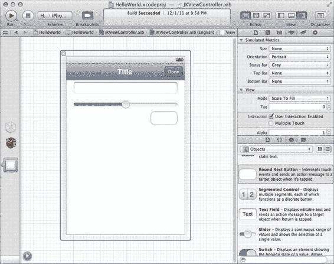
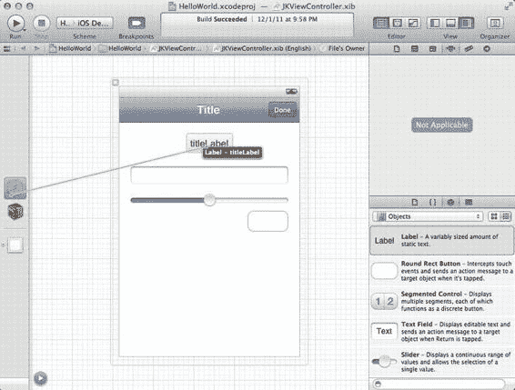
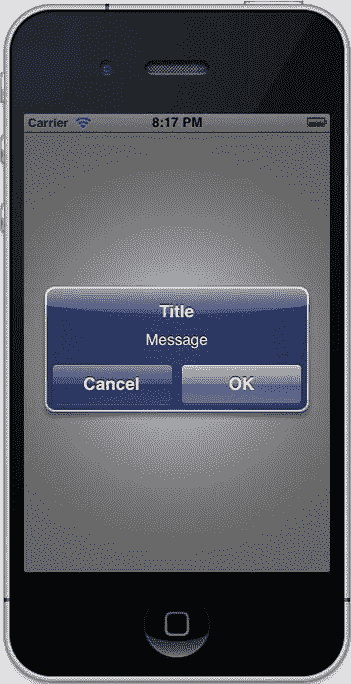

# 第 3 章：使用视图控制器管理屏幕内容

总的来说，iOS 应用每次只处理一个屏幕的内容。例如，通讯录应用在一个屏幕上显示联系人列表。它的功能只有一个：显示联系人列表。当你点击某个联系人时，便会显示另一个屏幕的内容，此次展示的是你选中的联系人详情。Safari 浏览器每次显示一个网页，设置应用每次显示一组设置，而邮件应用每次显示一个文件夹，当你选择一封邮件时再显示其内容。在像 iPhone 这样的小屏幕上处理内容时，每次只显示一个屏幕的内容是必要的；由于分辨率仅有 320x480，根本容不下多组信息。

iOS 应用中出现的屏幕具有一些共同特征。通常，应用顶部会有一个导航栏，显示当前屏幕的名称，左侧有一个返回按钮。其他应用则在底部使用黑色标签栏来切换不同屏幕。某些行为是所有内容屏幕共有的：在需要时加载它们，在不需要时释放它们，并将它们呈现给用户。

这些共同的行为和任务被封装在 Cocoa Touch 中最重要的一个类里：`UIViewController`。视图控制器管理单个视图，通常是一个屏幕的内容。这个视图可以拥有一个复杂层级中的许多子视图，但视图控制器直接处理一个视图——它的 `view` 属性——作为其主要内容。

[www.it-ebooks.info](http://www.it-ebooks.info/)

第 3 章：使用视图控制器管理屏幕内容 42

在本章中，我们将全面介绍 `UIViewController`，学习如何以及何时使用它们，以及 UIKit 中的一些子类，这些子类让你能够利用框架代码，而无需自行编写。我们将涵盖所有主要的视图控制器类型，以及用于从你创建的文件中为视图控制器加载用户界面的 nib 加载系统。我们还将开始构建 MyStuff 应用，这是一个我们将在后续几章中持续开发的家庭库存管理系统。

## 视图控制器生命周期

视图控制器的生命周期始于你的应用创建它的那一刻。你可能会认为，在创建过程中，视图控制器会创建其视图。实际上，为了节省内存，视图只在最后一刻才被创建；如果你创建了 1000 个视图控制器，但只向用户展示其中一个，那么只会创建一个视图。创建视图控制器很简单：

```
UIViewController *viewController = [[UIViewController alloc]
initWithNibName:@"MyViewController" nibBundle:nil];
```

其中“nib 名称”部分指的是 Cocoa Touch 开发者手中最强大的工具之一：Interface Builder。Interface Builder 最初是 Xcode 之外的一个独立应用，现在则指你在 Xcode 中处理应用 UI 时所看到的界面。一个 nib 文件（现在扩展名为 `.xib`）是一个以 XML 格式存档到磁盘的视图。当视图控制器需要其视图时，它会打开该 XML 文件并从中加载视图。

然而，通过 Interface Builder 创建的 nib 的真正优势在于创建它们的方式。无需编写繁琐的 UI 布局代码来手动定位视图层级中的每个元素，Interface Builder 允许你手动将用户界面元素拖放到视图的实时表示中，如图 3-1 所示。你可以直接修改视图的属性，调整设置，并即时获得视觉反馈，了解它在应用中的显示效果。

[www.it-ebooks.info](http://www.it-ebooks.info/)



第 3 章：使用视图控制器管理屏幕内容

**图 3-1.** 使用 Interface Builder 创建视图控制器的 UI

无需编写一行代码即可布局视图已经足够方便，但 Interface Builder 更进一步。当你创建视图并将其添加到界面时，有时需要在代码中获取指向它的指针。其他时候，特别是对于按钮、滑块和开关等用户界面元素，你需要视图在被按下或其值改变时调用一个方法。Interface Builder 使用两个特殊关键字来表示这些用例：`IBOutlet` 和 `IBAction`。`IBOutlet` 是一个指针，将在 nib 加载时被填充。

要创建一个 `IBOutlet`，只需在属性声明中添加 `IBOutlet`：

```
@property (strong, nonatomic) IBOutlet UILabel *titleLabel;
```

**注意：** 你也可以在声明实例变量时使用 `IBOutlet` 关键字。

一旦定义了输出口，你就可以使用 Interface Builder 来“填充它”。只需按住 Control 键，从视图左侧的“文件所有者”（File's Owner）拖动到你的输出口，如图 3-2 所示。这就在视图和你的代码之间建立了连接。现在，当 nib 被加载时，它会在你的视图控制器上调用 `setTitleLabel:` 方法，并传入你创建的标签。

[www.it-ebooks.info](http://www.it-ebooks.info/)



第 3 章：使用视图控制器管理屏幕内容

**图 3-2.** 将视图控制器连接到标题标签

使用 `IBOutlet` 使我们能够动态地更改用户界面元素，这对于有效的 UI 设计至关重要。当需要从 UI 转向代码时，我们使用 `IBAction`。将方法返回类型中的 `void` 替换为 `IBAction`：

```
- (IBAction)doneButtonPressed:(id)sender;
```

方法中的参数 `sender` 将是指向被按下按钮的指针。就像你将视图控制器连接到标题标签以绑定属性一样，你从按钮连接到视图控制器以将其绑定到方法。Xcode 会自动将该方法链接到适当的控件事件，并在用户按下按钮时调用你的方法。

一旦你的视图在 Interface Builder 中创建并加载到视图控制器的 `view` 属性中，视图控制器生命周期的其余部分就开始了。然而，并非所有视图控制器的视图都是在 Interface Builder 中创建的。如果你更喜欢在代码中创建视图，你可以在 `UIViewController` 的子类中实现 `loadView` 方法，并在此处进行创建。有时，在代码中创建视图更容易，尤其是当视图内容高度动态或你使用许多自定义的 `UIView` 子类时。

无论你如何加载视图，生命周期的下一步都是 `viewDidLoad` 方法。你可以使用此方法对视图进行任何进一步的设置，例如使用对象中的值填充标签，或启动网络请求。

**注意：** 在你于 `UIViewController` 子类中实现的所有视图控制器生命周期方法中，务必调用父类的实现。例如，对于 `viewDidLoad`，你应该调用 `[super viewDidLoad]`。

还有几个地方可以自定义视图控制器的行为。生命周期方法 `viewWillAppear:`、`viewDidAppear:`、`viewWillDisappear:` 和 `viewDidDisappear:` 的含义不言而喻。

[www.it-ebooks.info](http://www.it-ebooks.info/)


通常，当视图显示在屏幕上时，若要执行自定义动画，你应在 `viewWillAppear:` 方法中执行这些操作，然后在 `viewDidAppear:` 方法中开始动画。如果你的视图包含长时间运行或重复执行的动画，可以在 `viewDidDisappear:` 中停止它们。大多数情况下，即使不实现这些方法也能正常运行，但在需要时它们始终可用。

当视图被卸载时，视图控制器子类将收到 `viewDidUnload` 消息。这是视图控制器中需要重写的最重要方法之一，因为一个视图控制器在其生命周期中可能会多次加载和卸载其视图。在 `viewDidLoad` 中设置的任何内容都必须撤销，同样，在 nib 文件中设置的内容（如你的连接口）也必须撤销。在 iOS 5 之前，必须在 `viewDidUnload` 方法中将所有连接口设为 `nil`，以便在视图被释放时释放它们。如果你使用 ARC 且仅针对 iOS 5 及更高版本，可以为你的 `IBOutlets` 使用弱引用：

```objectivec
@property (weak) IBOutlet UILabel *myLabel;
```

一旦你的视图被释放，该标签也会被释放，而当它依次被释放时，指向它的弱指针会被重置为 `nil`。这样你就不必为了实现所有连接口的释放而编写庞大的 `viewDidUnload` 实现。

如果你通过 Control 拖拽创建连接口，Xcode 会在你的 `viewDidUnload` 方法中将这些连接口设为 `nil`，但你自己并不需要这样做。

你可能会问，什么时候视图控制器会释放其视图但不会被销毁？答案是当内存压力迫使其这样做时。由于 iOS 设备的内存远小于台式计算机，内存是一种非常有限的资源。系统会抓住一切机会回收内存。当内存不足时，系统会发送通知，所有视图控制器都会通过调用自己的 `didReceiveMemoryWarning` 方法来响应。

该方法可以判断视图控制器的视图是否在屏幕上；如果不在屏幕上，则视图控制器将释放其视图以回收内存。

`UIViewController` 的子类可以实现 `didReceiveMemoryWarning` 方法来抓住机会释放大型对象。如果你有易于重新创建的大型对象，请使用此方法释放它们并将其指针设为 `nil`，以帮助应用回收一些内存。如果你释放的内存不够，当系统没有足够的内存运行时，它将退出你的应用。

我们要讨论的最后一个视图控制器生命周期方法是 `shouldAutorotateToInterfaceOrientation:`。当用户旋转设备时，会调用这个名称较长的方法。它的参数是 `interfaceOrientation`，表示四种方向之一。要支持旋转，只需为你的视图控制器支持的方向返回 `YES`，为不支持的方向返回 `NO`。系统会在旋转期间负责动画处理你的视图，但如果你需要对此过程有更多控制，例如需要根据旋转调整视图布局，你可以实现多种方法来管理它。

**注意：** 对于 iPhone，通常不支持 `UIInterfaceOrientationPortraitUpsideDown` 方向，但对于 iPad，你应该尽量支持所有四个方向。

## 通过控件实现应用逻辑

视图控制器在你的应用行为中扮演着核心角色。iOS 应用响应用户对按钮、滑块等用户界面元素的触摸。你不应该在视图本身中实现响应这些触摸的逻辑，而应使用视图控制器来接收这些用户操作并做出响应。这使得用户界面元素更具可重用性，将特定于应用的逻辑保留在视图控制器中。

Apple 的用户界面元素支持这种模式，并通过抽象类 `UIControl` 实现。常见的例子包括 `UIButton`、`UISlider`、`UISwitch`，以及 iOS 5 中的 `UIStepper`。

Apple 的控件使用“目标”和“动作”的概念，在用户与之交互时回调你的代码。当你使用 Interface Builder 时，这会自动设置，但在代码中设置也相当简单。要让一个按钮调用我们代码中的 `didTapButton:` 方法，我们会编写以下代码：

```objectivec
[myButton addTarget:self
             action:@selector(didTapButton:)
   forControlEvents:UIControlEventTouchUpInside];
```

最后一个参数是控件事件的位掩码。对于按钮，惯例是使用 `UIControlEventTouchUpInside`，该事件在用户触摸按钮后手指离开设备时触发。另一个常见事件是 `UIControlEventValueChanged`，例如，当用户调整滑块的值时会调用该事件。

`UIButton` 类易于自定义。它有多种控制状态，允许你根据用户当前与按钮交互的方式来自定义其行为。要使按钮默认显示红色文本，但触摸时显示蓝色文本，两行代码就足够了：

```objectivec
[button setTitleColor:[UIColor redColor] forState:UIControlStateNormal];
[button setTitleColor:[UIColor blueColor] forState:UIControlStateHighlighted];
```

**注意：** `UIColor` 类定义了多个有用的类方法，可以快速创建常见颜色。

创建按钮也很容易。大多数情况下，你的设计师会想要一个自定义按钮，因为 iOS 的典型按钮往往缺乏吸引力。使用背景图像是实现这一目标的最佳方式。创建按钮时，你需要使用 `UIButton` 的 `buttonWithType:` 类方法，并传入几种类型之一。

使用背景图像创建自定义按钮非常简单：

```objectivec
UIButton *myButton = [UIButton buttonWithType:UIButtonTypeCustom];
[myButton setBackgroundImage:myBackgroundImage forState:UIControlStateNormal];
```

默认情况下，iOS 会在用户点击按钮时使按钮变暗，但你也可以为 `UIControlStateHighlighted` 指定一个图像来自定义该行为。

需要一个带有多个分段的按钮吗？使用 `UISegmentedControl`。你不需要提供一个标题，而是提供多个标题，每个标题对应控件上的一个分段。

另一个典型的用户界面元素是 `UISlider`。滑块有一个按钮（称为滑块按钮），在轨道上从最小值移动到最大值。因此，如果你想制作一个滑块来改变 1 到 100 之间的值，并在其值改变时调用 `sliderValueChanged:` 方法，你可以编写以下代码：

```objectivec
UISlider *slider = [[UISlider alloc] init];
[slider setMinimumValue:0];
[slider setMaximumValue:100];
[slider addTarget:self
            action:@selector(sliderValueChanged:)
  forControlEvents:UIControlEventValueChanged];
```

当用户调整滑块时，你会不断收到消息，除非你将 `continuous` 属性设置为 `NO`。你还可以自定义滑块的外观，为滑块按钮、最小值轨道（滑块按钮左侧）和最大值轨道提供自定义图像。在 iOS 5 及更高版本中，你还可以更改滑块的色调颜色以匹配你的应用配色方案。

有时你需要中断用户操作以获取输入。在这些情况下，你可以使用 `UIAlertView` 类向用户显示一个弹窗。弹窗视图使用标题、消息和一个或多个按钮创建，你可以在图 3-3 中看到示例。要接收用户选择的按钮，请实现 `UIAlertViewDelegate` 协议。创建弹窗视图很简单：

```objectivec
UIAlertView *alert = [[UIAlertView alloc] initWithTitle:@"标题"
                                                message:@"消息"
                                               delegate:self
                                      cancelButtonTitle:@"取消"
                                      otherButtonTitles:@"确定", nil];
```




