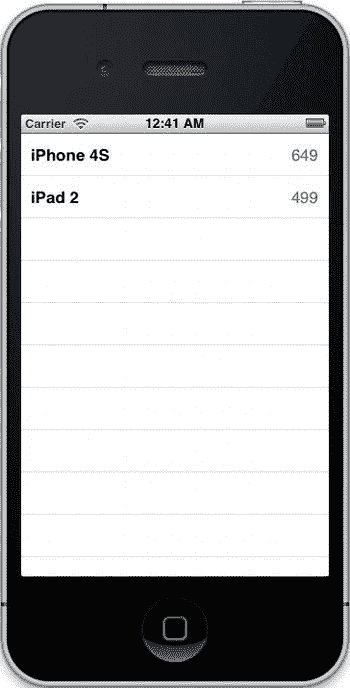
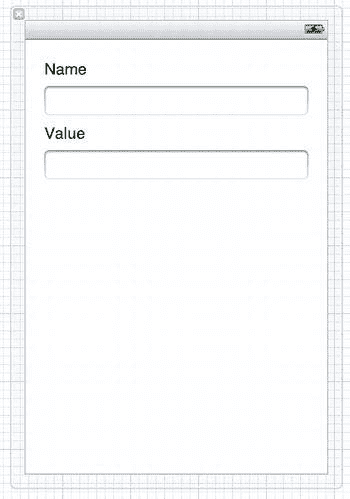
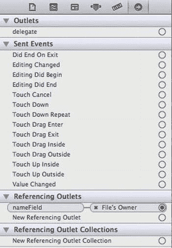

# 第 3 章：使用视图控制器管理屏幕内容

**图 3-3.** *一个带有两个按钮的 `UIAlertView`*

显示警告视图就像调用其 `show` 方法一样简单。当用户点击按钮时，它会调用其委托的 `alertView:clickedButtonAtIndex:` 方法，并传入用户点击的按钮索引。警告视图最适合在需要用户在继续操作前从两到三个操作中选择的场景中使用。过多地将其用作通知只会让用户感到厌烦。

## 使用表格视图提供内容列表

在 iOS 应用开发中，你将用到的最基础的界面之一就是表格视图，它在 `UITableView` 类中实现。几乎所有包含用户需要从中选择的列表项的应用都会使用表格视图，原因很充分：它们性能出色、易于创建，并且提供了用户期望的通用行为。一个表格视图由多个分区组成，每个分区包含零个或多个行。每一行都使用 `UITableViewCell` 这个可重用类来绘制，该类负责每行的绘制工作。表格视图只有一列，因此请务必最大限度地利用你所使用数据的水平空间。每个单元格占用的垂直空间越多，屏幕上能容纳的单元格就越少。表格视图有两种样式，如图 3-4 所示。

**图 3-4.** *一个原型 `UITableView`。左侧是“平铺”样式的表格视图，右侧是“分组”样式。*

我们并不需要继承 `UITableView`，而是要实现两个协议：`UITableViewDataSource` 和 `UITableViewDelegate`。由于完全由一个表格视图组成并同时实现这两个协议的视图控制器是一种非常常见的模式，因此你可以使用内置的子类 `UITableViewController`，它会为你执行初始设置。实现表格视图协议方法遵循着一种适用于所有表格视图的模式。

首先，会调用数据源方法 `numberOfSectionsInTableView:`。与所有表格视图协议方法一样，第一个参数是指向表格视图的指针。接着，在 `tableView:numberOfRowsInSection:` 方法中，表格视图获取其各分区中的行数。最后，我们准备创建单元格。表格视图会调用其数据源上的 `tableView:cellForRowAtIndexPath:` 方法，该方法返回一个 `UITableViewCell` 对象。然而，由于表格视图性能至关重要，这个过程经过了高度优化。即使在用户尽可能快地滚动浏览数百个单元格时，表格视图也应当保持流畅和响应迅速，因此此方法中的操作需要尽可能快。这里采用的一项优化措施是，当用户滚动时，表格视图的单元格会被重用。当一个单元格移出屏幕顶部时，它会被重用作从底部进入的下一个单元格。为了实现这一点，每个单元格都有一个名为 `reuseIdentifier` 的字符串属性，该属性对于表格视图中的每种单元格应是唯一的。当创建单元格时，首先尝试获取一个已准备好重用的单元格。这个方法的一个典型实现可能如下所示：

```
- (UITableViewCell *)tableView:(UITableView *)tableView
cellForRowAtIndexPath:(NSIndexPath *)indexPath
{
UITableViewCell *cell = [tableView
dequeueReusableCellWithIdentifier:@"CellIdentifier"];
if (cell == nil) {
cell = [[UITableViewCell alloc]
initWithStyle:UITableViewCellStyleDefault
reuseIdentifier:@"CellIdentifier"];
}
[[cell textLabel] setText:[NSString stringWithFormat:@"Row %d", [indexPath row]]];
return cell;
}
```

**注意：** 表格视图使用带有特定于表格视图扩展的 `NSIndexPath` 类来表示表格中的一行。使用 `section` 和 `row` 方法来获取所需的值。

通过在表格视图上调用 `dequeueReusableCellWithIdentifier:`，我们可能会得到一个已准备好使用的单元格。如果没有，我们会得到 nil 返回值，并且必须自己创建一个。有几种内置的样式可供使用，或者你也可以使用你自己的 `UITableViewCell` 子类。通过重用这些单元格，表格视图避免了创建和销毁它们带来的高昂开销。

一旦表格视图的内容数量增长到超过合理范围，用户将难以浏览。一种解决方案是在表格视图顶部添加一个搜索栏，用于将内容列表缩小到与用户搜索词匹配的部分。另一种解决方案是按字母对内容进行分隔，例如按姓氏对人的列表进行排序，然后允许用户点击表格视图右侧边距上的字母，以跳转到该字母对应的分区。为此，需要在数据源的 `sectionIndexTitlesForTableView:` 方法中提供一个字母数组，并在 `tableView:sectionForSectionIndexTitle:` 方法中指定哪些标题对应哪些分区。这是一种快速简单的方法，可以帮助用户浏览你的应用，而不会因看似无止境的滚动而感到沮丧。

为用户提供更多信息的另一种方法是使用 `tableView:titleForHeaderInSection:` 和 `tableView:titleForFooterInSection:` 方法为分区提供页眉和页脚文本。根据表格视图的样式，标题的呈现方式有所不同；默认情况下，“平铺”样式的表格视图会将最顶部分区的页眉固定在表格视图的顶部。你还可以使用表格视图委托的 `tableView:viewForHeaderInSection:` 和 `tableView:viewForFooterInSection` 方法为页眉和页脚指定自定义视图。

到目前为止，我们只使用了数据源方法，但当我们想要响应用户的操作时，我们需要使用委托方法。最常实现的是 `tableView:didSelectRowAtIndexPath:`，它在用户点击一行时被调用。在许多应用中，这是你过渡到新的视图控制器以显示用户所点击项的详细信息的地方。让用户知道他们可以选择一行很重要，一种常见的方法是使用表格视图单元格的 `accessoryType` 属性。将其设置为 `UITableViewCellAccessoryDisclosureIndicator` 会在单元格右侧添加一个图标，向用户指示点击该单元格将触发一个操作。

### 为你的表格视图提供数据

表格视图的一种常见模式是存储一个对象数组，每个对象对应一行。数组中的对象数量就是表格视图第一个（通常是唯一一个）分区中的行数。

通过将数据存储在数组中，你可以利用其有序特性，让数组代表表格视图的状态，并通过调用 `[myArray objectAtIndex:[indexPath row]]` 来获取你的对象。当你要编辑数据时，这种方法仍然有效，因为你对数组所做的更改可以反映在表格视图中，反之亦然。

这些方法足以提供出色的表格视图，让用户能够快速浏览信息，但有时你需要修改表格视图的内容。也许你正在后台与云端同步，列表中添加了更多项目，或者用户需要删除某个项目。每当需要修改表格视图的顺序或管理其内容时，都需要执行两步操作：首先，告知表格视图将要进行哪些更改；其次，修改数据以反映这些更改。具体的顺序无关紧要，但当你重新排序表格视图时，它从数据源接收到的值必须匹配；如果你在分区 2 中删除了一行，那么你为分区 2 返回的单元格数量就必须少一个。


删除一个单元格或插入一个单元格只需在表视图上调用一个方法：`deleteRowsAtIndexPaths:withRowAnimation:` 或 `insertRowsAtIndexPaths:withRowAnimation:`。如果你有多个不同的更改，可以通过在开头发送 `beginUpdates` 方法并在结尾发送 `endUpdates` 方法，来让表视图等待执行更改。你也可以选择在表视图上调用 `reloadData` 来重新加载所有数据，但这效率较低且没有动画效果。最后，如果需要移动单元格，请使用 `moveRowAtIndexPath:toIndexPath:` 方法，或者对于大量更改，使用 `moveSection:toSection:` 方法。

表视图可以通过在单元格右侧显示一个重新排序控件来支持行的重新排序。为此，表视图必须进入“编辑”模式，通过在表视图上调用 `setEditing:animated:` 来实现。对于每一行，表视图会调用数据源方法 `tableView:canMoveRowAtIndexPath:`，如果返回 `YES`，则显示该控件。当用户拖动单元格进行重新排序并释放时，表视图将调用其数据源方法 `tableView:moveRowAtIndexPath:toIndexPath:`，在此方法中，数据源应更新数据模型（在我们的案例中为对象数组）以反映用户的更改。当用户拖动单元格时，你可以通过在你的表视图委托中实现 `tableView:targetIndexPathForMoveFromRowAtIndexPath:toProposedIndexPath:` 来限制它可以移动到的位置。

编辑模式还允许你显示删除按钮、添加按钮，并进一步调整表视图的外观。要了解有关这些自定义的更多信息，请参阅 `UITableView`、`UITableViewDataSource` 和 `UITableViewDelegate` 的文档。

## 提供自定义表视图单元格

虽然苹果提供的表视图单元格足以满足许多用途，但通常你会希望表视图具有特定的外观或高度自定义的内部视图层次结构。在这种情况下，你有两个选择：创建 `UITableViewCell` 的子类，或在 nib 中实现表视图单元格。如果你要创建 `UITableViewCell` 的子类，可以在 `initWithStyle:reuseIdentifier:` 方法中添加子视图。与任何其他自定义 `UIView` 子类非常相似，重写 `layoutSubviews` 以编程方式布局你的单元格。对于表视图单元格来说，一个额外的步骤是 `prepareForReuse` 方法，当表视图准备将你的单元格重用于新行时，会调用该方法。在此方法中，你应将表视图单元格恢复到其初始状态。如果表视图单元格并非始终使用相同的子视图，这一点尤其重要；你不希望来自某一行的信息显示在其他地方。

无论你是通过代码还是在 nib 中创建单元格，该单元格都有一个可通过 `contentView` 属性访问的子视图。你的子视图应插入到内容视图中，当表视图进入编辑模式或适应单元格附件时，该内容视图会调整大小。

如果你需要调整高度，有两种方法。第一种（也是最简单）的方法是使用 `UITableView` 上的 `rowHeight` 属性。当你希望每个单元格具有相同高度时，这很简单且效果很好。你可能认为为每个单元格指定动态高度会很容易。这并非不可能，但这样做可能相当复杂。第一步是在表视图的委托中实现 `tableView:heightForRowAtIndexPath:` 方法。在此方法中，你将返回该特定单元格高度的正确值。

但是，如果你试图根据文本内容来调整单元格大小，你必须根据表视图的宽度来计算文本的高度。对于复杂的布局，你基本上需要布局单元格的子视图来确定单元格需要多高。这个问题没有简单的解决方案——如果内容已本地化，情况会更糟——但幸运的是，使用带有大量文本的表视图并不常见。

## Nib 加载深入解析

如果你需要从 nib 加载表视图单元格，有几种方法可以做到。在具体讨论表视图单元格之前，我们先谈谈 nib 的工作原理。正如我们之前所述，每个 nib 都是数组中一个或多个视图的集合，以 XML 格式的 `.xib` 文件存档到磁盘上。当你的应用程序为发布而编译时，`.xib` 文件会被编译成 `.nib` 文件，这就是它被称为 nib 的原因。当你在 Xcode 中打开 `.xib` 文件时，它在界面左侧显示的对象中，有一个对象的图标具有空灵、近乎透明的样式，名称为“File's Owner”。图标的样式表明该对象不存在于 nib 中，而是从外部引用的。这个对象是 nib 加载时的“所有者”。对于视图控制器，你会注意到“File's Owner”对象被设置为你的视图控制器子类的一个成员。

当视图由视图控制器加载时，它会连接通过 Interface Builder 设置的输出口和操作。当你手动加载 nib 时也会发生同样的事情，但你必须指定所有者：

```
[[NSBundle mainBundle] loadNibNamed:@"MyNib"
                              owner:self
                            options:nil];
```

通过将 `self` 作为所有者传递，我们可以指定如何建立来自 Interface Builder 的连接。

### 从 Nib 加载表视图单元格

对于表视图单元格，一种常见的模式是使用 `IBOutlet` 作为表视图单元格的临时存储，这允许你使用 Interface Builder 将单元格连接到输出口。在你的表视图控制器的头文件中，为单元格添加一个属性：

```
@property (strong) IBOutlet UITableViewCell *incomingCell;
```

然后，当需要创建单元格时，从 nib 加载它：

```
- (UITableViewCell *)tableView:(UITableView *)tableView
         cellForRowAtIndexPath:(NSIndexPath *)indexPath
{
    UITableViewCell *cell = [tableView
        dequeueReusableCellWithIdentifier:@"CellIdentifier"];
    if (cell == nil) {
        [[NSBundle mainBundle] loadNibNamed:@"MyCellNib"
                                      owner:self
                                    options:nil];
        cell = [self incomingCell];
        [self setIncomingCell:nil];
    }
    return cell;
}
```

这可能一开始令人困惑，主要是因为 `incomingCell` 扮演着奇怪的角色。它是用于捕获 nib 中输出口的单元格的临时存储区域。一旦你获得了单元格，你就将其赋值给 `cell`，然后将 `incomingCell` 设置为 `nil`，因为你已经用完了它。一种稍微更直接的方法依赖于 `loadNibName:owner:options:` 方法返回 nib 中顶层对象的 `NSArray`：

```
- (UITableViewCell *)tableView:(UITableView *)tableView
         cellForRowAtIndexPath:(NSIndexPath *)indexPath
{
    UITableViewCell *cell = [tableView
        dequeueReusableCellWithIdentifier:@"CellIdentifier"];
    if (cell == nil) {
        NSArray *nibObjects = [[NSBundle mainBundle] loadNibNamed:@"MyCellNib"
                                                            owner:nil
                                                          options:nil];
        cell = [nibObjects objectAtIndex:0];
    }
    return cell;
}
```

此方法依赖于单元格是 nib 中唯一的对象，但它不像前一种方法那样使用任何关于输出口的技巧。我更喜欢这样做，但无论哪种方式，最终效果都是一样的：你可以使用一个 nib 来调整单元格的布局，而无需花费所有时间编写布局代码。

### iPhone 和 iPad Nib


当你开发一款同时适用于 iPhone 和 iPad 的应用时，通常会重复使用某些视图控制器。然而，你往往需要调整视图控制器的布局，使其更好地适配当前运行的设备。通过代码实现这一点很简单：`UIDevice` 类中有一个名为 `userInterfaceIdiom` 的属性，它可以告诉你当前设备是否为 iPad，从而允许你根据当前设备的类别手动布局视图。对于视图控制器视图的 nib 文件，操作更为简便：只需提供两个 nib 文件即可。事实上，`UIViewController` 的默认实现会自动查找 nib 文件。如果你的视图控制器类名为 `MyViewController`，请将适用于 iPhone 的 nib 文件命名为 `MyViewController.xib`，适用于 iPad 的 nib 文件命名为 `MyViewController~ipad.xib`。然后，在创建视图控制器时，无需指定名称：

```
[[MyViewController alloc] initWithNibName:nil bundle:nil];
```

由于 nib 文件命名正确，它们会被自动加载。这样一来，你无需编写任何代码就能为每种设备管理用户界面。

[www.it-ebooks.info](http://www.it-ebooks.info/)

## 第 3 章：使用视图控制器管理屏幕内容 57

**父视图控制器与子视图控制器**

到目前为止，本章一直在聚焦于单个视图控制器。然而，在应用中，只使用一个视图控制器的情况很少见，你需要一种在它们之间切换的方法。一种方式是在应用窗口上调用 `setRootViewController:`，但这既无法提供动画效果，也无法保留对两个视图控制器的引用。根据你的需求，在 Cocoa Touch 中有三种内置方式可以在视图控制器之间切换，同时还有其他关于父视图控制器和子视图控制器的用法。

**模态视图控制器**

如果你希望一个视图控制器以模态形式显示在当前视图控制器之上，`UIViewController` 提供了一个内置方法 `presentModalViewController:animated:`，可以精确实现此功能。由于模态视图控制器会阻止用户访问第一个视图控制器，因此它们最适合用于用户必须采取行动才能继续的场景，例如网络服务的登录界面。模态视图控制器会从屏幕底部以动画形式出现，在 iPhone 上会完全覆盖屏幕。在 iPad 上，你可以设置 `modalPresentationStyle` 属性来调整其显示方式。当使用完该视图控制器后，在父视图控制器上调用 `dismissModalViewControllerAnimated:`，它会以动画方式移除模态视图控制器，显示其下方的第一个视图控制器。你也可以在模态视图控制器上调用 `dismissModalViewControllerAnimated:`，该消息会被转发给父视图控制器，但由于消息最终必须到达父视图控制器，因此最好直接在父视图控制器上调用。

**注意：** 你可以通过视图控制器的 `modalTransitionStyle` 属性指定其进入屏幕时的动画效果。

**导航控制器**

导航控制器可能是 Cocoa Touch 中最常用的视图控制器。它们提供了许多应用共有的功能：屏幕顶部的标题栏、允许用户在视图控制器层级中返回的“返回”按钮，以及视图控制器之间的动画切换。`UINavigationController` 类提供了这些功能，并为你管理视图控制器视图的呈现。导航控制器维护着一个视图控制器栈，当前可见的视图控制器位于栈顶。要切换到新的视图控制器，请在导航控制器上调用 `pushViewController:animated:`；要返回，则调用 `popViewControllerAnimated:`。按下内置的“返回”按钮会自动将当前视图控制器弹出栈。这些过渡动画最出色的一点是它们都是内置的，因此在用户使用的所有应用中行为都保持一致。

如果你需要手动管理视图控制器层级（例如将其初始化到已知状态），导航控制器暴露了一个 `viewControllers` 数组，你可以直接用它来修改视图控制器栈。如果你需要一直返回到起始位置，可以调用 `popToRootViewControllerAnimated:`。

导航控制器还通过 `UINavigationItem` 对象与 `UIViewController` 集成在一起。导航项由视图控制器按需创建，并自定义视图控制器与导航控制器的交互方式。最常见的用途是它的 `title` 属性，该属性控制导航控制器导航栏（导航控制器视图顶部的栏）上显示的标题，以及当该视图控制器在导航控制器视图控制器层级中处于次顶层时，“返回”按钮的默认文本。你还可以指定 `leftBarButtonItem` 和 `rightBarButtonItem` 属性来控制导航栏上显示的按钮。与 `UIButton` 类似，这些 `UIBarButtonItem` 类的实例使用目标-动作范式来发送消息。创建它们有两种方式：使用系统提供的栏按钮项，或使用自定义标题。

导航项还允许你管理“返回”按钮的行为。当某个视图控制器位于栈中顶层视图控制器的后面时，会显示其对应的“返回”按钮，因为这是用户点击返回按钮后将要显示的界面。将 `backBarButtonItem` 属性设置为带有自定义图像或标题的栏按钮项，即可自定义“返回”按钮的外观。

**标签栏控制器**

标签栏控制器使用频率稍低，但仍然是用于在视图控制器之间导航的流行对象。一个 `UITabBarController` 维护着一个视图控制器数组，每个视图控制器由一个 `UITabBarItem` 表示。它会在其视图底部显示代表每个视图控制器的按钮。点击按钮会使它们高亮，并在标签栏上方显示该视图控制器的视图。如果标签栏控制器由于屏幕宽度限制无法为每个视图控制器都显示一个按钮，它会将最后一个可显示的按钮替换为“更多”按钮。点击此按钮会显示一个视图控制器，允许用户在剩余的视图控制器中进行选择，并编辑它们在各个位置上的排列顺序。使用标签栏控制器的一个典型例子是 iOS 上的音乐应用。

你常常需要结合使用导航控制器和标签栏控制器。这通常效果良好，但应确保根视图控制器是标签栏控制器，而不是导航控制器。切换标签应该在不同的导航控制器之间进行，以使它们各自维护自己的导航层级。iPhone 上的电话应用就是这样的行为。

**分屏视图控制器**

在 iPad 上，相比 iPhone 更大的屏幕空间放宽了此前建立的“每屏内容对应一个视图控制器”的规则。屏幕大到足以同时显示两组信息。分屏视图控制器就是这种用法的一个常见例子。当 iPad 处于横屏方向时，分屏视图控制器在左侧以表格视图显示项目列表，在右侧显示详情视图。在竖屏方向下，左侧列表默认消失，但可以通过详情视图导航栏上的一个按钮再次调出。iPad 上的邮件应用是这种行为的典型例子，也是该控制器理想用法的良好示范：在一边浏览项目列表，同时在另一边以大幅详情视图逐个查看它们。

**页面视图控制器**


## 另一个内置视图控制器：`UIPageViewController`

另一个管理多个视图控制器的内置视图控制器是 `UIPageViewController`。它是 iOS 5 新增的组件，允许你在两个视图控制器之间像 iBooks 中的书籍一样翻页，而无需编写复杂的 OpenGL 代码来实现页面卷曲效果。与表格视图类似，页面视图控制器也拥有 `dataSource` 和 `delegate` 属性。不同之处在于，`UIPageViewController` 的数据源提供的是视图控制器而非数据行，每个页面对应一个视图控制器。页面视图控制器的数据源协议不涉及索引路径或类似概念，而是由两个方法组成：

- `pageViewController:viewControllerBeforeViewController:`
- `pageViewController:viewControllerAfterViewController:`

你需要自行跟踪这些视图控制器，并确定应传递哪一个——如果在其发送的视图控制器之前或之后没有其他视图控制器，只需返回 `nil` 即可。

页面视图控制器的另一个巧妙之处在于，它会向你暴露部分内部机制，让你可以进一步自定义其行为。它拥有管理用户交互的对象，这些对象被称为手势识别器。这些识别器可以被添加到其他视图中，从而允许你在一个框架内创建页面视图控制器，用户可以通过从框架拖拽到页面的方式进行交互。我们稍后会详细讨论手势识别器。

## 在视图控制器之间传递数据

如你所见，向用户展示不同视图控制器的方式有很多种。构建优秀应用的下一步是在视图控制器之间传递数据。同样，这里也存在一些常见模式，具体取决于视图控制器之间的关系。一个值得铭记的目标是降低耦合度，即尽可能避免你的视图控制器类直接嵌入到另一个视图控制器类中。通常，视图控制器使用其自身创建的视图控制器所特有的方法是允许的——毕竟它需要创建它们——但应避免反向操作。接下来，我们将通过一个将花数章篇幅构建的典型主从应用来了解其工作原理：一个名为 `MyStuff` 的家庭库存管理系统。

打开 Xcode 并创建一个新项目。在模板选择器中，选择**空应用程序**。在**产品名称**处输入 `MyStuff`。输入你的类前缀；我在本书中将使用 `LCT`。对于**设备系列**，选择 **iPhone**。勾选**使用自动引用计数**复选框，但不要勾选另外两个。将项目保存到硬盘，然后我们就准备开始！

正如定义所示，该项目既没有视图控制器，也没有数据。让我们创建一个新类来表示家中的一件物品。在 Xcode 中，选择**文件 ➤ 新建 ➤ 新建文件...**，在弹出的对话框中，选择左侧的 **Cocoa Touch**，然后选择右侧的 **Objective-C 类**。点击**下一步**，在类名处输入 `Possession`。对于**子类**，指定为 `NSObject`。将其保存到磁盘，它会在 Xcode 中打开。

在 `Possession.h` 中，添加两个属性：

```objc
#import <Foundation/Foundation.h>

@interface Possession : NSObject

@property (copy) NSString *name;
@property (strong) NSNumber *value;

@end
```

在 `Possession.m` 中实现这些属性：

```objc
#import "Possession.h"

@implementation Possession

@synthesize name = _name;
@synthesize value = _value;

@end
```

如你所见，这是一个非常简单的类，但对我们来说是一个很好的起点。

接下来，我们创建一个视图控制器作为主列表视图控制器。创建一个新文件，但这次选择 **UIViewController 子类**，而不是 **Objective-C 类**。将其命名为 `PossessionListViewController`，并设为 `UITableViewController` 的子类。取消勾选**带有 XIB 用户界面**复选框。对于这样一个简单的视图控制器，其视图基本上就是一个表格视图，因此我们无需进一步自定义。在实现文件（`PossessionListViewController.m`）中，通过添加以下粗体行来导入 `Possession` 头文件，以便使用 `Possession` 类：

```objc
#import "PossessionListViewController.h"
#import "Possession.h"
```

接下来，我们创建一个数组来存储我们的物品。其他类无需访问此数组，因此我们不将其设为属性，而是通过类扩展将其作为实例变量添加到实现文件中。我们还将添加一个方法，用于按索引从数组中获取物品。在现有的 `@implementation` 行之前添加以下所有行：

```objc
@interface PossessionListViewController() {
    NSMutableArray *_possessions;
}

- (Possession *)possessionAtIndex:(NSUInteger)index;

@end
```

我们将其设为可变数组，以便稍后添加内容，而 `_` 前缀是实例变量的约定命名方式。接下来，让我们实现表格视图方法，以获得一个基本的实现。删除 `@implementation` 和 `@end` 之间的现有方法，并用以下粗体行替换它们：

```objc
@implementation PossessionListViewController

- (NSInteger)numberOfSectionsInTableView:(UITableView *)tableView
{
    return 1;
}

- (NSInteger)tableView:(UITableView *)tableView
 numberOfRowsInSection:(NSInteger)section
{
    return [_possessions count];
}

- (UITableViewCell *)tableView:(UITableView *)tableView
         cellForRowAtIndexPath:(NSIndexPath *)indexPath
{
    NSString *cellIdentifier = @"PossessionCell";
    UITableViewCell *cell = [tableView
        dequeueReusableCellWithIdentifier:cellIdentifier];

    if (cell == nil) {
        cell = [[UITableViewCell alloc]
            initWithStyle:UITableViewCellStyleValue1
          reuseIdentifier:cellIdentifier];
    }

    Possession *possession = [self possessionAtIndex:[indexPath row]];
    [[cell textLabel] setText:[possession name]];
    [[cell detailTextLabel] setText:[[possession value] stringValue]];

    return cell;
}

- (Possession *)possessionAtIndex:(NSUInteger)index
{
    return [_possessions objectAtIndex:index];
}

@end
```

在 Xcode 中，点击**运行**……你会看到一个白屏。我们需要将视图控制器添加到视图层级中。点击 Xcode 中的**停止**，打开应用委托的实现文件（记住，如果你使用了类前缀，文件名会包含它；我的文件是 `LCTAppDelegate.m`），并导入视图控制器的头文件：

```objc
#import "LCTAppDelegate.h"
#import "PossessionListViewController.h"
```

在 `application:didFinishLaunchingWithOptions:` 方法中，`return YES;` 行之前，添加以下代码来创建并显示你的视图控制器：

```objc
PossessionListViewController *listViewController =
    [[PossessionListViewController alloc] initWithNibName:nil
                                                   bundle:nil];
[[self window] setRootViewController:listViewController];
```

现在，当你点击 Xcode 中的**运行**时，会看到一个空的表格视图。这在意料之中，因为我们从未向列表中添加任何项目！回到 `PossessionListViewController.m`，在 `@implementation` 行之后实现一个 `init` 方法：

```objc
@implementation PossessionListViewController;

- (id)initWithNibName:(NSString *)nibNameOrNil
               bundle:(NSBundle *)nibBundleOrNil
{
    self = [super initWithNibName:nibNameOrNil
                           bundle:nibBundleOrNil];
    if (self) {
        Possession *iPhone = [[Possession alloc] init];
        [iPhone setName:@"iPhone 4S"];
        [iPhone setValue:[NSNumber numberWithInt:649]];

        Possession *iPad = [[Possession alloc] init];
        [iPad setName:@"iPad 2"];
        [iPad setValue:[NSNumber numberWithInt:499]];
```


```markdown
`_possessions = [NSMutableArray arrayWithObjects:iPhone, iPad, nil];`

```  
}  

return self;  

}  
```

这将初始化我们的数组，使其包含两个示例项目。你可以随意在数组中放入你喜欢的任何值。点击“运行”，正如你在图 3-5 中所见，成功了！

[www.it-ebooks.info](http://www.it-ebooks.info/)



# 第 3 章：使用视图控制器管理屏幕内容

**图 3-5.** *我们的应用显示了一些数据*

如你所见，我们物品的值显示正确，但目前用户界面略显简约。让我们稍微改进一下。首先，将其嵌入到导航控制器中。打开应用委托（对我来说是 `LCTAppDelegate.m`），删除被划掉的代码行，并在 `application:didFinishLaunchingWithOptions:` 中添加粗体显示的代码：

```  
PossessionListViewController *listViewController =  
    [[PossessionListViewController alloc] initWithNibName:nil  
                                                  bundle:nil];  

UINavigationController *navigationController =  
    [[UINavigationController alloc]  
        initWithRootViewController:listViewController];  

[[self window] setRootViewController:listViewController];  
[[self window] setRootViewController:navigationController];  

return YES;  
```

[www.it-ebooks.info](http://www.it-ebooks.info/)

# 第 3 章：使用视图控制器管理屏幕内容 65

现在屏幕顶部有了一个导航栏，但它没有标题。在我们的视图控制器中，将粗体显示的行添加到 `init` 方法中：

```  
- (id)initWithNibName:(NSString *)nibNameOrNil  
               bundle:(NSBundle *)nibBundleOrNil  
{  
    self = [super initWithNibName:nibNameOrNil  
                           bundle:nibBundleOrNil];  
    if (self) {  
        [self setTitle:@"Item Details"];  
    }  
    return self;  
}  
```

现在，我们有了导航栏和标题。看起来已经好多了！再做一些微调，我们就可以准备获取风险投资了……

接下来要创建的是我们的详情视图控制器。这个屏幕应该允许我们编辑物品的名称和其价值。在 Xcode 中，通过选择 **File** ➤ **New** ➤ **New File…** 创建一个新的视图控制器，将其命名为 `PossessionDetailViewController`，并创建为 `UIViewController` 的子类。这次勾选创建 XIB 的复选框。将其保存到磁盘，并打开名为 `PossessionDetailViewController.xib` 的 nib 文件。从右侧的对象列表中拖拽两个标签到视图上，再拖拽两个文本字段。如果你看不到对象列表，请按下 `⌘+Option+1` 或选择 **View** ➤ **Utilities** ➤ **Show Object Library**；对象库将出现在 Xcode 窗口右侧的实用工具面板的下半部分。将标签的文本修改为 **Name** 和 **Value**（可以通过双击标签，或者选中标签后在实用工具面板中打开属性检查器——按下 `⌘+Option+4` 或选择 **View** ➤ **Utilities** ➤ **Show Attributes Inspector**——然后更改 **Text** 的值），并按图 3-6 所示进行布局。

[www.it-ebooks.info](http://www.it-ebooks.info/)



# 第 3 章：使用视图控制器管理屏幕内容

**图 3-6.** *我们精美的详情页面布局*

接下来，在你的头文件中为文本字段创建两个 `IBOutlets`：

```  
@interface PossessionDetailViewController : UIViewController  

@property (weak) IBOutlet UITextField *nameField;  
@property (weak) IBOutlet UITextField *valueField;  

@end  
```

别忘了在你的实现文件（`PossessionDetailViewController.m`）中添加对应的 `@synthesize` 调用：

```  
@implementation PossessionDetailViewController  

@synthesize nameField = _nameField;  
@synthesize valueFeild = _valueField;  
```

接下来，在 nib 文件中将这些视图连接到这些 outlets。为此，请打开 nib 文件（`PossessionDetailViewController.xib`）。按住 **Control** 键，从编辑器窗口左侧的 **File's Owner** 对象拖拽到你的文本字段，一次一个。当你松开鼠标按钮时，你会看到一个窗口出现，其中显示了连接的各种目标。为 **Name** 标签旁边的文本字段选择 `nameField`，为 **Value** 旁边的文本字段选择 `valueField`。

[www.it-ebooks.info](http://www.it-ebooks.info/)


```


