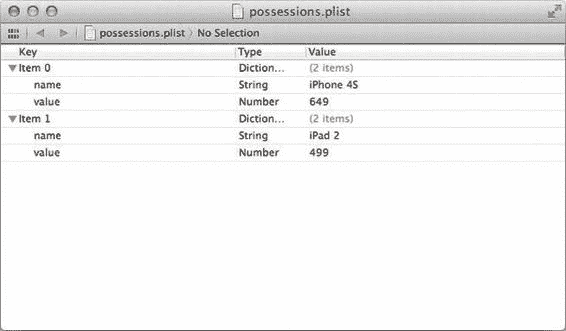
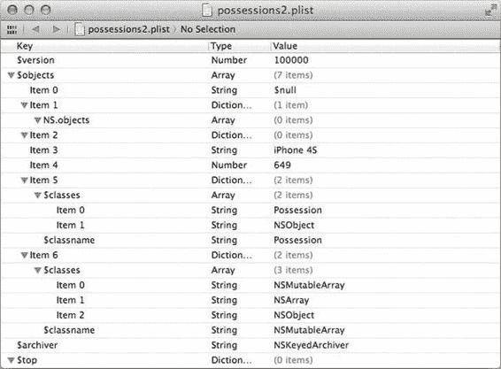

# 第 4 章：在应用中保存内容

如你所见，两个字典在数组中依次出现。数组中的对象之间没有特殊语法，只是一系列对象。

### 使用用户默认设置保存应用数据

让我们修改 MyStuff，使用 `NSUserDefaults` 将数据保存到磁盘。在 Xcode 中打开 `PossessionListViewController.m`。我们将在类扩展中声明两个新方法。添加以下粗体行：

```
@interface PossessionListViewController() {
    NSMutableArray *_possessions;
}
- (void)addItemButtonPressed:(id)sender;
- (Possession *)possessionAtIndex:(NSUInteger)index;
- (void)savePossessionsToDisk;
- (void)loadPossessionsFromDisk;
@end
```

首先，我们将实现 `savePossessionsToUserDefaults`。由于无法将 `Possession` 对象直接保存到用户默认设置，我们将先将其转换为 `NSDictionary`。在文件的 `@implementation` 块中添加新方法：

```
- (void)savePossessionsToDisk
{
    NSMutableArray *possessionsAsDictionaries =
        [NSMutableArray arrayWithCapacity:[_possessions count]];
    for (Possession *possession in _possessions) {
        NSDictionary *possessionRepresentation =
            [NSDictionary dictionaryWithObjectsAndKeys:
                [possession name], @"name",
                [possession value], @"value", nil];
        [possessionsAsDictionaries addObject:possessionRepresentation];
    }
    [[NSUserDefaults standardUserDefaults] setObject:possessionsAsDictionaries forKey:@"possessions"];
    [[NSUserDefaults standardUserDefaults] synchronize];
}
```

这段代码创建了一个可变数组，其容量足以容纳每个物品。可变数组是指在创建后可以修改的数组。接下来，我们遍历物品数组。对于每个物品，我们创建一个字典，其中的键与对象的属性相匹配。然后我们将该字典添加到可变数组中，并继续处理下一个物品。全部完成后，我们将数组保存到用户默认设置数据库中，键为 `possessions`。我们将在加载方法中使用该键。最后，我们向用户默认设置单例发送 `synchronize` 方法。这会强制它将我们的更改保存到磁盘。如果你省略这一步，可能会发现在系统终止应用之前，你的更改尚未保存。


`NSUserDefaults` 会定期将其内存中的缓存写入文件系统。调用 `synchronize` 可以强制持久化你的更改。这在调试应用时特别有用，因为在 `NSUserDefaults` 自动保存之前，关闭 iPhone 模拟器几乎总会先退出应用。

从用户默认设置加载物品的方法同样简单。在前一个方法之后添加此方法：

```
- (void)loadPossessionsFromDisk
{
    NSArray *possessionDictionaries =
        [[NSUserDefaults standardUserDefaults] objectForKey:@"possessions"];
    _possessions = [NSMutableArray array];
    for (NSDictionary *dictionary in possessionDictionaries) {
        Possession *possession = [[Possession alloc] init];
        [possession setName:[dictionary objectForKey:@"name"]];
        [possession setValue:[dictionary objectForKey:@"value"]];
        [_possessions addObject:possession];
    }
}
```

在此方法中，首先我们从 `NSUserDefaults` 加载物品数组。尽管我们是从 `NSMutableArray` 中保存的，但它实际上是以不可变数组的形式保存的。接下来，我们将 `_possessions` 设置为一个空的可变数组，以便准备加载我们的物品。我们遍历 `NSUserDefaults` 数组中的字典，为每个字典创建一个新的 `Possession` 值，从字典中填充其值，然后将其添加到我们的物品数组中。

现在我们已经写好了这个数组，我们需要保存它。修改 `possessionDetailViewController:didEditPossession:` 方法来保存数组：

```
- (void)possessionDetailViewController:(PossessionDetailViewController
                                          *)detailViewController
                  didEditPossession:(Possession *)possession
{
    if ([_possessions containsObject:possession] == NO) {
        [_possessions addObject:possession];
        NSIndexPath *newIndexPath = [NSIndexPath indexPathForRow:[_possessions
            indexOfObject:possession]
                                                     inSection:0];
        NSArray *indexPaths = [NSArray arrayWithObject:newIndexPath];
        [[self tableView] insertRowsAtIndexPaths:indexPaths
                                withRowAnimation:UITableViewRowAnimationAutomatic];
    }
    [self savePossessionsToDisk];
}
```

接下来，我们需要在应用启动时加载我们的物品。修改 `initWithNibName:bundle:` 来实现这一点，并移除之前测试数据：

```
- (id)initWithNibName:(NSString *)nibNameOrNil
               bundle:(NSBundle *)nibBundleOrNil
{
    self = [super initWithNibName:nibNameOrNil
                           bundle:nibBundleOrNil];
    if (self) {
        Possession *iPhone = [[Possession alloc] init];
        [iPhone setName:@"iPhone 4S"];
        [iPhone setValue:[NSNumber numberWithInt:649]];
        Possession *iPad = [[Possession alloc] init];
        [iPad setName:@"iPad 2"];
        [iPad setValue:[NSNumber numberWithInt:499]];
        _possessions = [NSMutableArray arrayWithObjects:iPhone, iPad, nil];
        [self loadPossessionsFromDisk];
        [self setTitle:@"我的物品"];
        UIBarButtonItem *addItemButton =
            [[UIBarButtonItem alloc]
                initWithBarButtonSystemItem:UIBarButtonSystemItemAdd
                                     target:self
                                     action:@selector(addItemButtonPressed:)];
        [[self navigationItem] setRightBarButtonItem:addItemButton];
    }
    return self;
}
```

再次运行应用，你会注意到物品列表是空的。添加一个新物品，然后关闭 iPhone 模拟器。再次运行应用，你的物品就在那里了！现在你拥有了一个可以在不同启动间持久保存数据的应用。如果你添加了两个示例物品并检查了偏好设置文件，它会看起来像这样：

```
<?xml version="1.0" encoding="UTF-8"?>
<!DOCTYPE plist PUBLIC "-//Apple//DTD PLIST 1.0//EN"
 "http://www.apple.com/DTDs/PropertyList-1.0.dtd">
<plist version="1.0">
<dict>
    <key>possessions</key>
    <array>
        <dict>
            <key>name</key>
            <string>iPhone 4S</string>
            <key>value</key>
            <integer>649</integer>
        </dict>
        <dict>
            <key>name</key>
            <string>iPad 2</string>
            <key>value</key>
            <integer>499</integer>
        </dict>
    </array>
</dict>
</plist>
```


请注意，财产数组本身位于一个字典中。所有偏好设置文件的顶层对象都是一个字典。这是属性列表中嵌套结构的典型示例，因为我们在另一个字典中的一个数组里包含了两个字典。

使用 `NSUserDefaults` 来持久化数据虽然效果不错，但它并非为存储应用程序的所有数据而设计。如果能将我们的财产归档到单独的文件中，让 `NSUserDefaults` 仅用于存储应用偏好设置，那会更好。实际上这相当容易实现，因为 `NSArray` 和 `NSDictionary` 均支持将其内容直接以属性列表的形式写入磁盘。不过，这仍然意味着我们无法直接保存自定义对象，因此仍需将 `Possession` 对象转换为 `NSDictionary` 对象。首先，我们需要一个保存文件的位置。在 `PossessionsListViewController.m` 的类扩展中添加一个新的方法声明，请添加以下粗体行：

```objectivec
@interface PossessionListViewController() {

NSMutableArray *_possessions;

}

@property (strong) NSMutableArray *possessions;

- (void)addItemButtonPressed:(id)sender;

- (Possession *)possessionAtIndex:(NSUInteger)index;

- (NSString *)possessionsArchivePath;

- (void)savePossessionsToDisk;

- (void)loadPossessionsFromDisk;

@end
```

接下来，在类实现中添加以下粗体行来实现该方法：

```objectivec
- (NSString *)possessionsArchivePath

{

NSString *documentsPath =

[NSSearchPathForDirectoriesInDomains(NSDocumentDirectory,

NSUserDomainMask,

YES) objectAtIndex:0];

return [documentsPath

stringByAppendingPathComponent:@"possessions.plist"];

}
```

要将对象保存到磁盘，我们只需在已创建的临时字典数组上调用一个方法即可。修改 `savePossessionsToDisk` 方法，删除被划掉的代码行并添加粗体行：

```objectivec
- (void)savePossessionsToDisk

{

NSMutableArray *possessionsAsDictionaries =

[NSMutableArray arrayWithCapacity:[_possessions count]];

for (Possession *possession in _possessions) {

NSDictionary *possessionRepresentation =

[NSDictionary dictionaryWithObjectsAndKeys:

[possession name], @"name",

[possession value], @"value", nil];

[possessionsAsDictionaries addObject:possessionRepresentation];

}

[[NSUserDefaults standardUserDefaults] setObject:possessionsAsDictionaries forKey:@"possessions"];

[[NSUserDefaults standardUserDefaults] synchronize];

[possessionsAsDictionaries writeToFile:[self possessionsArchivePath]

atomically:YES];

}
```

`NSArray` 的 `writeToFile:atomically` 方法会负责为你创建一个属性列表文件。`atomically` 参数如果传入 `YES`，则会在临时位置创建文件，待完成后将其移动到最终位置。这有助于避免在保存出错时该位置出现未完成的文件，从而防止加载文件时产生进一步的错误。

从该文件加载数据只需快速改动。修改 `loadPossessionsFromDisk` 方法，删除被划掉的代码行并添加粗体行：

```objectivec
- (void)loadPossessionsFromDisk

{

NSArray *possessionDictionaries =

[[NSUserDefaults standardUserDefaults] objectForKey:@"possessions"];

NSArray *possessionDictionaries =

[NSArray arrayWithContentsOfFile:[self possessionsArchivePath]];

_possessions = [NSMutableArray array];

for (NSDictionary *dictionary in possessionDictionaries) {

Possession *possession = [[Possession alloc] init];

[possession setName:[dictionary objectForKey:@"name"]];

[possession setValue:[dictionary objectForKey:@"value"]];

[_possessions addObject:possession];

}

}
```

就这样，我们实现了向自己的文件保存和加载数据。实际上，你甚至可以在 Mac 上打开并编辑该文件。运行应用程序，向其中保存一些内容，然后退出 iPhone 模拟器。保存的文件位于你的文件系统中，但在 Lion 系统中它默认隐藏在你的 `Library` 文件夹中。


在 Mac 上打开一个 Finder 窗口，选择菜单栏中的 **前往** ➔ **前往文件夹…** ，或按下 `Shift+⌘+G`；然后在弹出的对话框中输入 `~/Library/Application Support/iPhone Simulator`。选择与你使用的 iOS 版本匹配的子文件夹（如果不确定，请查看 Xcode），然后进入其中的 `Applications` 文件夹。iPhone Simulator 中的所有应用都以一个文件夹的形式呈现，其名称是一个很长且无意义的 UUID。逐一查看这些文件夹，直到找到包含 `MyStuff` 的那个。在该文件夹中，查找 `Documents` 子文件夹，你会看到 `possessions.plist`。你可以在 Xcode 中打开此文件，Xcode 提供了属性列表的编辑模式。图 4-1 显示了在 Xcode 中打开的文件。

[www.it-ebooks.info](http://www.it-ebooks.info/)



**第四章：在应用中保存内容**

**图 4-1.** *Xcode 的属性列表编辑器，其中打开了 `possessions.plist`*  
你可以看到，每个字典左侧都有一个下拉元素，展开后其下列出了各个条目。对于字典，你可以在 Xcode 中编辑键、类型和值。自己试试看——修改其中一个值，保存文件，然后从 Xcode 运行你的应用。这种打开属性列表并直接编辑值的能力是一个极好的调试工具。

---

### `NSCoding`

尽管我们的文件保存方案已经很不错，但在保存时我们仍需费周折地将对象转换为 `NSDictionary`，并在加载时从字典转换回对象。幸运的是，有一个我们可以遵循的协议——`NSCoding`——它对此有所帮助。我们仍需做一些工作，但不必创建任何临时数组或字典。让我们在 `MyStuff` 中实现 `NSCoding`，以简化文件的保存和加载过程。打开 `Possession` 的头文件 `Possession.h`，并通过添加以下粗体代码来声明你对这个协议的遵循：

```objectivec
@interface Possession : NSObject <NSCoding>
```

在 `Possession.m` 中需要实现两个方法。首先，我们将设置一些字符串常量以便引用。这些常量是我们用于将属性归档到磁盘的键。在 `implementation` 之前添加以下粗体行：

```objectivec
static NSString * const kNameKey = @"name";
static NSString * const kValueKey = @"value";
```

[www.it-ebooks.info](http://www.it-ebooks.info/)

**第四章：在应用中保存内容**

```objectivec
@implementation Possession
```

然后，我们将实现 `initWithCoder:`，该方法用于从磁盘加载对象。在实现中添加以下粗体代码：

```objectivec
- (id)initWithCoder:(NSCoder *)aDecoder
{
    self = [self init];
    if (self) {
        [self setName:[aDecoder decodeObjectForKey:kNameKey]];
        [self setValue:[aDecoder decodeObjectForKey:kValueKey]];
    }
    return self;
}
```

你会注意到，除了这个 `NSCoder` 参数之外，它看起来就像一个普通的 init 方法。`NSCoder` 是一个辅助对象，负责将文件中的值传输到你的对象。保存对象则更简短。在实现中，于 `initWithCoder:` 之后添加一个 `encodeWithCoder:` 方法，代码如下（粗体部分）：

```objectivec
- (void)encodeWithCoder:(NSCoder *)aCoder
{
    [aCoder encodeObject:[self name] forKey:kNameKey];
    [aCoder encodeObject:[self value] forKey:kValueKey];
}
```

**注意：** 当你要将许多属性保存到磁盘时，出现拼写错误的可能性很高。建议为所有键使用字符串常量，这样即使出现拼写错误，也能保持一致性。没有任何规则要求你必须将属性保存到与其名称匹配的键上，因此如果你拼写错误，编译器不会报错。

要将你的对象写入磁盘，打开 `PossessionListViewController.m`，并修改 `savePossesionsToDisk` 方法：

```objectivec
- (void)savePossessionsToDisk
{
    [NSKeyedArchiver archiveRootObject:_possessions
                                toFile:[self possessionsArchivePath]];

    NSMutableArray *possessionsAsDictionaries =
```

[www.it-ebooks.info](http://www.it-ebooks.info/)

**第四章：在应用中保存内容**

```objectivec
    [NSMutableArray arrayWithCapacity:[_possessions count]];
    for (Possession *possession in _possessions) {
```


```objectivec
NSDictionary *possessionRepresentation =
[NSDictionary dictionaryWithObjectsAndKeys:
 [possession name], @"name",
 [possession value], @"value", nil];
[possessionsAsDictionaries addObject:possessionRepresentation];
}
[possessionsAsDictionaries writeToFile:[self possessionsArchivePath]
                           atomically:YES];
}
```

这里引入了 `NSKeyedArchiver` 对象，你可以将其与任何遵循 `NSCoding` 协议的类配合使用。当我们向它传递财产数组时，它会简单地遍历这些财产，并使用我们编写的 `NSCoding` 方法将它们归档到文件中。正如你所见，用这种方法写入文件所需的代码量大幅减少了。从文件加载对象的情况也类似。按如下方式修改 `loadPossessionsFromDisk` 方法：

```objectivec
- (void)loadPossessionsFromDisk
{
    NSArray *possessionDictionaries =
        [NSArray arrayWithContentsOfFile:[self possessionsArchivePath]];
    _possessions = [NSMutableArray array];
    _possessions = [NSKeyedUnarchiver unarchiveObjectWithFile:[self
        possessionsArchivePath]];
    if (_possessions == nil) {
        _possessions = [NSMutableArray array];
    }
    for (NSDictionary *dictionary in possessionDictionaries) {
        Possession *possession = [[Possession alloc] init];
        [possession setName:[dictionary objectForKey:@"name"]];
        [possession setValue:[dictionary objectForKey:@"value"]];
        [_possessions addObject:possession];
    }
}
```

这段代码也变少了，但你会注意到我们在加载后添加了一个检查，判断 `_possessions` 是否为空。如果文件不存在，`NSKeyedUnarchiver` 对象将返回 nil，在这种情况下，我们创建一个空数组，以便仍然可以向其中添加内容。如果你现在运行应用，并且之前保存过数据，应用会崩溃，因为 `possessions.plist` 中原有的内容并非 `NSKeyedUnarchiver` 所期望的格式。这对于你的应用来说是一个很好的教训：在不同版本之间，如果你更改了文件名，一定要预判到旧文件名可能存在，且其格式可能不同。为了解决这个问题，让我们将文件扩展名从 plist 改为 archive。在 `PossessionListViewController.m` 文件中，删除被划掉的行，并在 `possessionsArchivePath` 方法中添加用粗体标记的那一行：

```objectivec
- (NSString *)possessionsArchivePath
{
    NSString *documentsPath =
        [NSSearchPathForDirectoriesInDomains(NSDocumentDirectory,
                                             NSUserDomainMask,
                                             YES) objectAtIndex:0];
    return [documentsPath stringByAppendingPathComponent:@"possessions.plist"];
    return [documentsPath
        stringByAppendingPathComponent:@"possessions.archive"];
}
```

从技术上讲，`NSKeyedArchiver` 保存的是一个属性列表，但你绝不会想要手动修改它。图 4-2 展示了在 Xcode 中打开的该属性列表。



**图 4-2.** *由 NSKeyedArchiver 保存的属性列表*

即使你能弄清楚 Apple 用于此属性列表的格式，也无法保证它在 Mac OS X 或 iOS 的下一个版本中不会发生大幅变化，因此试图自行解析它很可能徒劳无功。

以这种方式将文件保存到磁盘的过程称为序列化。其理念是，已序列化到磁盘的对象应与从磁盘反序列化得到的对象无法区分。对于实现了 `NSCoding` 的对象来说，情况通常如此，除非你在编码时没有编码关键信息。

nib 文件的工作方式也是如此；nib 只是一个包含序列化对象的 XML 属性列表。当你在应用中从磁盘加载 nib 文件时，视图只是从文件中反序列化出来。实际上，当你在 Xcode 中使用 nib 编辑器将标签拖到视图上时，你就是在直接创建该对象，然后将其保存为一种形式，以便在应用运行时可以从中恢复。

## 手动文件处理

使用 `NSCoding` 或属性列表对象将数据保存到磁盘具有一些重要优势。首先，这些代码经过了充分测试。由于 Apple 依赖它们来实现 iOS 框架，因此它们拥有配套的单元测试以及一整个能够修复问题的工程师团队。其次，它们是可移植的，这意味着无需将对象的二进制数据保存到文件，而是保存数据的一种表示形式，该表示形式与运行它的计算机的处理器架构无关。其中的细节相当高级，但足以让你了解：不同的处理器在内存中存储数据的方式不同，如果你试图直接按照处理器存储的方式将数据保存到磁盘，或者将数据按照处理器存储的方式传输到另一台计算机，你可能会尝试打开不符合计算机预期格式的数据。能解决这个问题的代码被称为可移植代码，而使用 `NSCoding` 方法保存数据就能实现这一点。

有时，出于性能原因、为了节省磁盘空间，或者为了使用专有文件格式，你可能希望直接读写磁盘上的文件，而不使用像 `NSKeyedArchiver` 这样的高级辅助对象。为此，你可以使用 `NSFileHandle` 对象，它允许你直接读写文件中的字节。虽然通常建议使用高级 API 来保存数据，但如果你无法做到，还有其他选择。

## SQLite 数据库

到目前为止，我们在应用中保存内容的方式存在几个重要的缺陷。随着应用变得更加复杂，你遇到的一个更严重的问题是，模型对象将开始消耗大量内存。虽然我们的财产数组只有少量对象，但如果有用户拥有大量物品——例如数百万个——就会带来问题。到了这个地步，我们需要实现一种解决方案，既能将对象保存到磁盘，又能允许我们一次只加载一部分对象，而无需加载整个数组。我们还需要能够保存财产数组，而无需将整个数组加载到内存中。

解决这个问题的一种方法是将每个财产保存到自己的文件中，然后使用包含这些文件的目录作为容器，而不是使用数组。然而，更好的实现方式是使用数据库技术来存储数据，而不是使用平面文件。iOS 原生支持 SQLite，因此如果你熟悉 SQL 数据库，就可以轻松地将该技术应用于你的 iOS 应用。这里我们不深入探讨，但在 MyStuff 中使用 SQLite 数据库将非常容易，使我们能够使用数据库而不是属性列表来持久化数据，从而让应用能够存储更多的数据。SQLite 在性能方面也非常出色，当你的应用达到需要添加 SQLite 来扩展规模的程度时，这一点将很重要。

## iOS 上的文件位置

我们已经讨论了很多关于文件的内容，但并没有真正涉及这些文件放在哪里。你可能在 Finder 中查看 iPhone 模拟器的文件时，已经看到过应用文件系统层次结构的一点片段。让我们退一步，讨论一下你的 iOS 应用将如何与文件交互。需要理解的一个重要概念是，你的应用处于沙盒中：它无法访问任何其他应用的文件、密码、偏好设置或图片。你的应用被允许保存文件的位置有明确定义，每个位置都有不同的含义和约定。随你的应用一起提供的文件位于应用包中。

### 应用包


