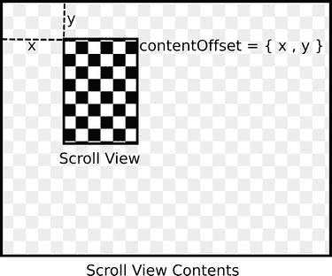

# 第 5 章：处理用户触摸

在实现中，我们将追踪用户的触摸点并维护一些状态，以确定手势当前所处的阶段。为此，我们将在实现文件中定义一些实例变量：

```
@implementation LCTGreaterThanGestureRecognizer {
    CGPoint        _beginningPoint;
    CGPoint        _midPoint;
    BOOL           _receivedDownRightSwipe;
    BOOL           _receivedDownLeftSwipe;
}
```

`_beginningPoint` 指的是用户开始触摸时的坐标点。我们将保存它，以便之后进行比较：

```
- (void)touchesBegan:(NSSet *)touches withEvent:(UIEvent *)event
{
    UITouch *touch = [touches anyObject];
    _beginningPoint = [touch locationInView:[self view]];
}
```

由于 `NSSet` 是无序的，不存在第一个或最后一个对象，因此我们使用其返回的第一个对象。获取起始点后，我们将后续点与之进行比较。为了匹配我们的手势，我们需要追踪两个动作：先向右下移动，再向左下移动。一旦用户向右下移动了最小距离，我们将 `_receivedDownRightSwipe` 标记为 `YES`，并将当前位置存入 `_midPoint`。不过，用户可能会继续朝这个方向移动，因此在他们持续向右下移动的过程中，我们会不断更新 `_midPoint`，直到他们改变方向。一旦改变方向，我们就可以开始追踪向左下的移动，直到手势完成。如果上述任何步骤未能发生，我们将手势识别器的状态设置为 `Failed`，从而结束触摸追踪：

```
#define CGPointDistanceFromPoint(p1, p2) (sqrtf(powf((p2.x - p1.x), 2.0f) + 
                                                  powf((p2.y - p1.y), 2.0f)))

// 用户手指必须移动的最小距离，以触发一半的滑动动作。
static const CGFloat kMinimumSwipeDistance = 50.0f;

- (void)touchesMoved:(NSSet *)touches withEvent:(UIEvent *)event
{
    UITouch *touch = [touches anyObject];
    CGPoint newPoint = [touch locationInView:[self view]];

    if (_receivedDownRightSwipe == NO) {
        if (newPoint.x >= _beginningPoint.x &&
            newPoint.y >= _beginningPoint.y) {
            [www.it-ebooks.info](http://www.it-ebooks.info/)

            第 5 章：处理用户触摸
            CGFloat distance = CGPointDistanceFromPoint(newPoint,
                                                        _beginningPoint);
            if (distance >= kMinimumSwipeDistance) {
                _midPoint = newPoint;
                _receivedDownRightSwipe = YES;
            }
        }
        else {
            [self setState:UIGestureRecognizerStateFailed];
        }
    }
    else if (newPoint.x >= _midPoint.x &&
             newPoint.y >= _midPoint.y) {
```


```objectivec
// 仍沿原方向前进，无需开始寻找新的距离。

_midPoint = newPoint;
}
else if (newPoint.x <= _midPoint.x &&
         newPoint.y >= _midPoint.y) {
    CGFloat distance = CGPointDistanceFromPoint(newPoint,
                                                _midPoint);
    if (distance >= kMinimumSwipeDistance) {
        _receivedDownLeftSwipe = YES;
    }
}
else
{
    [self setState:UIGestureRecognizerStateFailed];
}
```

在完成这个实现之前，还有几件事要做。首先，如果在触摸结束时`_receivedDownRightSwipe`和`_receivedDownLeftSwipe`都为`YES`，我们将手势标记为已识别；否则，标记为失败：

```objectivec
- (void)touchesEnded:(NSSet *)touches withEvent:(UIEvent *)event
{
    if (_receivedDownRightSwipe && _receivedDownLeftSwipe) {
        [self setState:UIGestureRecognizerStateRecognized];
    }
    else
    {
        [self setState:UIGestureRecognizerStateFailed];
    }
}
```

如果触摸被取消，则手势失败：

```objectivec
- (void)touchesCancelled:(NSSet *)touches withEvent:(UIEvent *)event
{
    [self setState:UIGestureRecognizerStateFailed];
}
```

最后，手势识别器将通过`reset`方法重置自身。我们将在其中重置状态，并确保调用父类的实现：

```objectivec
- (void)reset
{
    [super reset];
    _beginningPoint = CGPointZero;
    _midPoint = CGPointZero;
    _receivedDownRightSwipe = NO;
}
```

就这样，一个功能完备的、用于捕获自定义手势的手势识别器就完成了。虽然这看起来可能用途不大，但手势实际上可以为高级用户提供快捷操作，甚至可以用在游戏中！不过在大多数情况下，你会希望使用内置了手势识别器的标准用户界面组件。常用于交互的组件之一是`UIScrollView`。

## 滚动视图

`UIScrollView`是一种常见的`UIView`类型，用于在其内部滚动内容。我们之前介绍过的`UITableView`和`UIWebView`都使用`UIScrollView`来移动其内容。要使用`UIScrollView`，需要做两件事：首先，将你想要滚动的内容作为子视图添加到滚动视图中。其次，设置滚动视图的`contentSize`属性，使其与内容的尺寸相匹配。之后，当用户在滚动视图上移动手指时，其内容会自动跟随手指的移动而移动。滚动视图的`contentOffset`属性反映了它从起始位置移动了多少；你也可以通过编程方式设置该属性来滚动视图。

关于`UIScrollView`的工作原理，请参见图 5-1。如果你在 Mac OS X 上做过视图编程，可能会注意到 Mac OS X 与 iOS 的一个关键区别：在 iOS 中，坐标系的原点位于视图的左上角，而在 Mac OS X 中，原点位于视图的左下角。



**图 5-1.** *一个典型的滚动视图。滚动视图的`contentOffset`为`{ x, y }`，可见部分为滚动视图内部的深色棋盘格图案。*

`UIScrollView`的一个便捷功能是其`pagingEnabled`属性（可通过`isPagingEnabled`方法访问）。当该属性设置为`YES`时，滚动视图会在左右滚动时自动对齐到其宽度的整数倍，在上下滚动时对齐到其高度的整数倍。如果你使用滚动视图来显示多个相同尺寸的内容，可以利用此功能实现分页滚动效果。例如，如果你有一个名为`images`的图像数组，可以通过以下方式创建一个用于在图像间切换的滚动视图：

```objectivec
UIScrollView *scrollView = [[UIScrollView alloc] initWithFrame:CGRectMake(0.0f, 0.0f, 320.0f, 480.0f)];
[scrollView setPagingEnabled:YES];

CGFloat xValue = 0.0f;
for (UIImage *image in images) {
    UIImageView *imageView = [[UIImageView alloc] initWithFrame:CGRectMake(xValue, 0.0f, 320.0f, 480.0f)];
    [imageView setImage:image];
    [scrollView addSubview:imageView];
    xValue += 320.0f;
}
```


`[scrollView setContentSize:CGSizeMake([images count] * 320.0f, 480.0f)];` 这段代码示例将允许你水平滚动，并在图片之间分页切换。

这是 `UIScrollView` 一种非常典型的用法，它让你能够快速为图片、文本或应用显示的任何其他内容构建一个高度交互的布局。

[www.it-ebooks.info](http://www.it-ebooks.info/)

