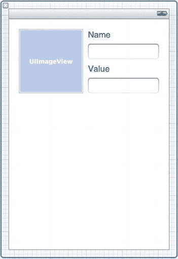
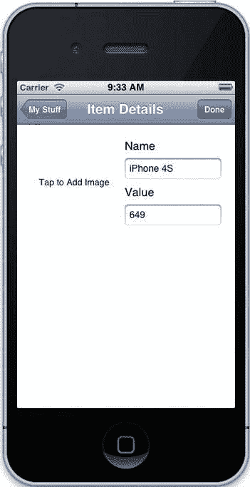

# 第 5 章：处理用户触摸

### **实现 UI 变更**

让我们在 MyStuff 中使用这个新获得的用户界面知识。目前我们的 UI 还很普通，而对于 iOS 应用，用户期望看到的是更具视觉冲击力的东西。仅仅做一个有用的应用是不够的；相反，我们应该努力打造一个既实用又美观的应用。首先，我们应该支持展示物品的图片。

#### 为物品添加图片

让我们为 `Possession` 添加一个图片属性。打开 `Possession.h` 并添加加粗的那行代码：

```
@interface Possession : NSObject <NSCoding>

@property (strong) UIImage *image;

@property (copy) NSString *name;

@property (strong) NSNumber *value;

@end
```

接下来，我们需要修改它保存到磁盘的方式。`UIImage` 是 UIKit 中用于表示多种格式图片的类，在 iOS 5 之前它并不遵循 `NSCoding` 协议。要在 iOS 4 上将其保存到磁盘，我们不能直接对它进行编码。幸运的是，我们可以将其转换为 `NSData` 对象，然后直接保存到磁盘。初次尝试保存时，我们会将其直接编码为数据。打开 `Possession.m` 并编辑 `NSCoding` 方法，添加加粗的代码行：

```
@synthesize image;

@synthesize name;

@synthesize value;

- (id)initWithCoder:(NSCoder *)aDecoder

{

self = [self init];

if (self) {

[self setImage:[UIImage imageWithData:[aDecoder

decodeObjectForKey:@"image"]]];

[self setName:[aDecoder decodeObjectForKey:@"name"]];

[self setValue:[aDecoder decodeObjectForKey:@"value"]];

}

return self;

}

- (void)encodeWithCoder:(NSCoder *)aCoder

{

[www.it-ebooks.info](http://www.it-ebooks.info/)

第 5 章：处理用户触摸

[aCoder encodeObject:UIImagePNGRepresentation([self image])

forKey:@"image"];

[aCoder encodeObject:[self name]

forKey:@"name"];

[aCoder encodeObject:[self value]

forKey:@"value"];

}
```

我们在这里使用的关键函数是 `UIImagePNGRepresentation()`。它从一张图片返回一个 `NSData` 对象，并将其转换为 PNG 表示。你也可以使用 `UIImageJPEGRepresentation()`，它接受图片作为第一个参数，并接受一个浮点值作为第二个参数来控制压缩质量：0.0 代表最高压缩（因此质量最低），而 1.0 代表最低压缩（因此质量最高）。

如果你只支持 iOS 5 及更新版本，可以直接对 `UIImage` 对象进行编码和解码，而无需先将其转换为 `NSData` 对象。

现在我们已经准备好为 `Possession` 对象添加图片了。当我们获得一张图片时，希望能在列表视图中显示它。打开 `PossessionListTableViewCell.m`，并添加加粗的代码行，以便在图片发生变化时接收键值观察通知：

```
static NSString * const kPossessionImageKeyPath = @"image";

static NSString * const kPossessionNameKeyPath = @"name";

static NSString * const kPossessionValueKeyPath = @"value";

- (void)dealloc

{

if (isObservingPossession == YES) {

[_possession removeObserver:self

forKeyPath:kPossessionImageKeyPath];

[_possession removeObserver:self forKeyPath:kPossessionNameKeyPath];

[_possession removeObserver:self forKeyPath:kPossessionValueKeyPath];

isObservingPossession = NO;

}

}

- (void)setPossession:(Possession *)possession

{

if (isObservingPossession == YES) {

[_possession removeObserver:self

forKeyPath:kPossessionImageKeyPath];

[_possession removeObserver:self forKeyPath:kPossessionNameKeyPath];

[_possession removeObserver:self forKeyPath:kPossessionValueKeyPath];

isObservingPossession = NO;

}

[www.it-ebooks.info](http://www.it-ebooks.info/)

第 5 章：处理用户触摸

_possession = possession;

if (_possession != nil) {

[_possession addObserver:self

forKeyPath:kPossessionImageKeyPath

options:(NSKeyValueObservingOptionInitial |

NSKeyValueObservingOptionNew)

context:NULL];
```


```objc
[_possession addObserver:self
             forKeyPath:kPossessionNameKeyPath
                options:(NSKeyValueObservingOptionInitial |
                         NSKeyValueObservingOptionNew)
                context:NULL];

[_possession addObserver:self
             forKeyPath:kPossessionValueKeyPath
                options:(NSKeyValueObservingOptionInitial |
                         NSKeyValueObservingOptionNew)
                context:NULL];

isObservingPossession = YES;
```

接下来，我们在观察方法中添加一行代码，以便将图像放入表格视图单元格中：

```objc
- (void)observeValueForKeyPath:(NSString *)keyPath
                      ofObject:(id)object
                        change:(NSDictionary *)change
                       context:(void *)context
{
    if (object == [self possession]) {
        if ([keyPath isEqualToString:kPossessionImageKeyPath]) {
            [[self imageView] setImage:[change
                objectForKey:NSKeyValueChangeNewKey]];
        }
        else if ([keyPath isEqualToString:kPossessionNameKeyPath]) {
            [[self textLabel] setText:[change
                objectForKey:NSKeyValueChangeNewKey]];
        }
        else if ([keyPath isEqualToString:kPossessionValueKeyPath]) {
            [[self detailTextLabel] setText:[[change
                objectForKey:NSKeyValueChangeNewKey] stringValue]];
        }
    }
}
```

现在我们已经添加了这些方法，图像将显示在表格视图中，并在设置时保存到归档文件中——我们只需要一种方法将图像添加到对象中。我们将在详情视图控制器中完成此操作。打开`PossessionDetailViewController.h`，并为将要用来显示图像的图像视图添加一个输出口：

```objc
@interface PossessionDetailViewController : UIViewController

@property (weak) IBOutlet UIImageView *imageView;
@property (weak) IBOutlet UITextField *nameField;
@property (weak) IBOutlet UITextField *valueField;
@property (strong) Possession *possession;
@property (getter = isModal) BOOL modal;
@property (weak) id <PossessionDetailViewControllerDelegate> delegate;

@end
```

接下来，你需要为`imageView`属性合成 setter 和 getter 方法。打开`PossessionDetailViewController.m`，并添加使用**粗体**标记的那一行代码：

```objc
@implementation PossessionDetailViewController

@synthesize imageView;
@synthesize nameField;
@synthesize valueField;
@synthesize possession;
@synthesize modal;
@synthesize delegate;
```

保存你的工作，然后打开 nib 文件`PossessionDetailViewController.xib`。打开屏幕右侧的“对象库”（如果未显示，你可以通过按 ⌘+Option+0 打开该面板）。找到“图像视图”对象，并将其拖入你的视图中。按住 Control 键并单击左侧的“文件所有者”，然后拖动到图像视图；当选项弹出时，将其连接到`imageView`属性。现在，按照图 5-2 所示重新排列界面对象。



**图 5-2.** *我们新的详情视图控制器 nib 文件*

让我们看看效果如何。构建并运行应用程序。如果你之前保存过对象或尝试添加项目，你会注意到程序会崩溃。崩溃的原因是我们的 KVO 方法正在观察`Possession`对象的图像值。

当我们从磁盘加载财物对象时，它没有图像，因此其`image`属性为`nil`。然而，键值观察方法会将值放入一个`NSDictionary`中传递给你的方法，而`nil`不能放入字典中，因为它不是一个对象。为了解决这个问题，键值观察方法会在其位置放入一个`NSNull`类的实例。我们编写的应用程序会尝试将该值放入图像视图，从而导致崩溃。要修复此问题，我们将为更改字典的新值创建一个临时变量，然后在遇到`NSNull`实例时将其设置为`nil`。打开`PossessionListTableViewCell.m`，并修改使用**粗体**标记的行：

```objc
- (void)observeValueForKeyPath:(NSString *)keyPath
                      ofObject:(id)object
                        change:(NSDictionary *)change
                       context:(void *)context
{
    id newObject = [change objectForKey:NSKeyValueChangeNewKey];
    if ([newObject isKindOfClass:[NSNull class]]) {
        newObject = nil;
    }
    
    if (object == [self possession]) {
        if ([keyPath isEqualToString:kPossessionImageKeyPath]) {
```


```objectivec
[[self imageView] setImage:[change
objectForKey:NSKeyValueChangeNewKey]];

[[self imageView] setImage:newObject];
}
else if ([keyPath isEqualToString:kPossessionNameKeyPath]) {
[[self textLabel] setText:[change
objectForKey:NSKeyValueChangeNewKey]];

[[self textLabel] setText:newObject];
}
else if ([keyPath isEqualToString:kPossessionValueKeyPath]) {
[[self detailTextLabel] setText:[[change
objectForKey:NSKeyValueChangeNewKey] stringValue]];

[[self detailTextLabel] setText:[newObject stringValue]];
}
}
}
```

这段代码更不容易导致崩溃。让我们重新构建并运行，然后查看某个物品的详情视图控制器。你会注意到没有图片。这并不完全出乎意料；我们一开始就没有添加图片！我们需要让用户能够点击图片视图来添加图片，但是，如图 5-3 所示，如果 `Possession` 对象中没有图片，它就不会显示。为了让用户知道他们可以添加图片，我们可以在图片视图下方添加一个标签。重新打开 nib 文件 `PossessionDetailViewController.xib`，并添加一个标签。将标签放置在图片视图的上方，并调整其大小，使其框架与图片视图相匹配。打开右侧窗格中的属性检查器，可以通过按下 `Option+⌘+4` 来访问。现在，标签的属性应该会列在窗口的右侧。选中标签后，将 `Text` 属性设置为 `Tap to Add Image`。接着，将 `Number of Lines` 属性设置为 `0`，这允许文本自动换行显示多行。在 `Alignment` 下，点击中间的按钮，使文本居中显示。字体大小有点大，因此点击 `Font` 右侧的向下箭头，直到大小为 `13.0`。最后，我们需要将这个标签移动到图片视图的后面，这样当存在图片时它就不会显示。选中标签后，选择 `Editor ➤ Arrange ➤ Send to Back`，这会将标签移至图片视图的后方。

下一步是配置详情视图控制器，使其在显示时展示物品的图片。打开 `PossessionDetailViewController.m`，并按如下方式修改其 `viewWillAppear:` 方法，添加以粗体显示的代码：

[www.it-ebooks.info](http://www.it-ebooks.info/)



