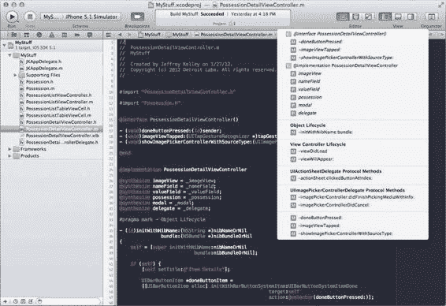
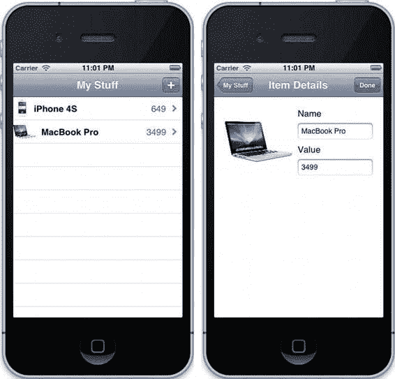
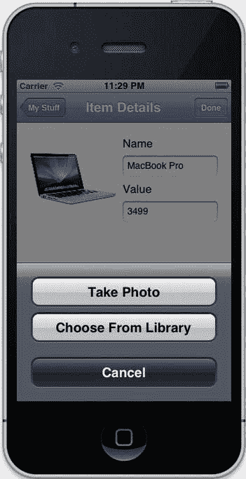

# 处理用户触摸操作

使用`#pragma mark`可以为代码段添加标签，功能类似于注释。你可以在编辑器中出现的方法下拉列表中看到这些部分，如图 5-4 所示。`#pragma mark - `会在列表中添加一条水平线，而`#pragma mark -`后跟文字标签则会在列表中显示该标签。如果使用类名或（如我们之前所做的）协议名，可以按住 Option 键点击该名称，然后点击弹出窗口右上角的书籍图标，直接跳转到该符号的文档。你也可以按住`⌘`键并点击`#pragma mark -`注释中的协议名称，直接跳转到该协议的定义位置。



**图 5-4.** Xcode 编辑器中的下拉列表（请注意，我的 Xcode 偏好设置将背景设为深色而非默认的白色）

这两个方法中的第二个仅在用户取消图像选择器时被调用，其实现仅涉及关闭模态视图控制器。第一个方法更有趣。首先，它确保存在一个用于存储图像的`Possession`对象；如果该对象不存在但用户已输入文本，则将该文本保存到新创建的对象中。然后，它从传入的`info`字典中获取用户选择的图像，并将其设置为当前`Possession`对象的图像属性。一旦我们设置了图像属性，之前设置的 KVO 方法会自动处理在详情视图控制器和列表视图控制器中显示该图像。我们在`Possession`中设置的`NSCoding`方法现在也会将该图像保存到磁盘，因此下次运行应用时，你设置的任何图像都会保留。构建并运行应用，为你的条目设置一些图像。完成后，你应该会在两个位置看到这些图像，如图 5-5 所示。



**图 5-5.** MyStuff 为产品设置了图像

太棒了！现在，我们有了一个可以让用户追踪其物品（包括每个物品的图片）的应用。然而，我们还没有完成。在创建图像选择器控制器时，我们假设用户希望使用相机（如果可用）拍照。但这不支持那些想为某些物品拍照、同时又想使用其他物品的已保存照片的用户。如果遗漏了这类功能，你肯定会在 App Store 上收获一堆一星评价。让我们改为给用户一个提示，让他们选择是使用相机拍照还是从照片库中选择图片。我们将使用一个名为`UIActionSheet`的 UIKit 对象，它会显示一个模态对话框，要求用户从几个选项中选择一个。

**注意：** 在配备高分辨率照片相机的设备上，你可能会注意到创建带图像的新物品时出现延迟。这种延迟是由于图像正在保存到磁盘。在后续章节中，我们将学习 iOS 上的性能和多线程技术。在此之前，这种延迟是正常的。

## 使用 UIActionSheet

创建`UIActionSheet`实例时需要提供可选的标题、一个用于接收点击事件的委托，以及一些按钮标题。我们需要让`PossesionDetailViewController`类成为其委托，这意味着要遵守另一个协议。打开其头文件，并添加新的声明：

```objectivec
@interface PossessionDetailViewController : UIViewController
<UIActionSheetDelegate, UIImagePickerControllerDelegate,
UINavigationControllerDelegate>
```

现在，我们准备添加操作表。不过，首先让我们考虑一下`imageViewTapped:`方法。目前，它创建并显示一个`UIImagePickerController`，我们仍需要这个功能，但希望在代码的不同位置进行。我们还希望用户指定使用哪种源类型（相机或照片库）。为此，让我们在类扩展中声明一个新方法：

```objectivec
- (void)showImagePickerControllerWithSourceType:(UIImagePickerControllerSourceType)sourceType;
```

在实现中，我们将执行与`imageViewTapped:`中大部分相同的操作，区别在于使用传入的源类型。输入以下方法实现代码：

```objectivec
- (void)showImagePickerControllerWithSourceType:(UIImagePickerControllerSourceType)sourceType
{
    UIImagePickerController *imagePickerController =
        [[UIImagePickerController alloc] init];
    [imagePickerController setSourceType:sourceType];
    [imagePickerController setDelegate:self];
    [self presentModalViewController:imagePickerController animated:YES];
}
```

完美。现在，我们可以随时调用此方法。回到`imageViewTapped:`的实现，删除其内容，并替换为以下代码：

```objectivec
- (void)imageViewTapped:(UITapGestureRecognizer *)tapGestureRecognizer
{
    if ([UIImagePickerController
            isSourceTypeAvailable:UIImagePickerControllerSourceTypeCamera] &&
        [UIImagePickerController
            isSourceTypeAvailable:UIImagePickerControllerSourceTypePhotoLibrary]) {
        UIActionSheet *actionSheet =
            [[UIActionSheet alloc] initWithTitle:nil
                                       delegate:self
                              cancelButtonTitle:@"取消"
                         destructiveButtonTitle:nil
                              otherButtonTitles:@"拍照", @"从相册选择", nil];
        [actionSheet showInView:[self view]];
    }
    else if ([UIImagePickerController
                 isSourceTypeAvailable:UIImagePickerControllerSourceTypePhotoLibrary]) {
        [self showImagePickerControllerWithSourceType:UIImagePickerControllerSourceTypePhotoLibrary];
    }
}
```

在此方法中，仅当`UIImagePickerController`有多个源类型可用时，我们才会创建操作表。如果用户使用的是早期型号的 iPod Touch 或 iPhone 模拟器（没有相机），我们会直接跳转到刚刚创建的用于显示图像选择器控制器的方法，因为用户没有选择余地。如果两者都不可用，则不执行任何操作。

接下来，我们需要编写响应操作表的代码。按钮的显示顺序如图 5-6 所示：先显示“拍照”，然后是“从相册选择”，最后是“取消”。



**图 5-6.** 使用操作表增加界面友好度

让我们实现`UIActionSheet`的委托方法`actionSheet:clickedButtonAtIndex:`。传递给委托的索引对应按钮的位置，从 0 开始。因此，0 对应“拍照”，1 对应“从相册选择”，2 对应“取消”。取消按钮的索引也是`UIActionSheet`的一个属性`cancelButtonIndex`。我们利用这个属性，在用户按下“取消”时提前结束方法。在`PossessionDetailViewController.m`中实现委托方法：

```objectivec
- (void)actionSheet:(UIActionSheet *)actionSheet
clickedButtonAtIndex:(NSInteger)buttonIndex
{
    if (buttonIndex == [actionSheet cancelButtonIndex]) {
        return;
    }
    else {
        UIImagePickerControllerSourceType sourceType;
        if (buttonIndex == 0) {
            sourceType = UIImagePickerControllerSourceTypeCamera;
        }
        else {
            sourceType = UIImagePickerControllerSourceTypePhotoLibrary;
        }
        [self showImagePickerControllerWithSourceType:sourceType];
    }
}
```

通过检查所选索引的值，我们可以确定要显示哪种类型的图像选择器控制器，并调用之前编写的辅助方法来实现。这个操作表增加了界面友好度，让用户能够自行选择而非替他们做决定。做这样的事情很重要，能让用户感觉一切尽在掌控之中，但我们的应用仍未完成。

## 为表格视图实现“编辑”功能


我们让`MyStuff`变得实用，并添加了一些细节打磨，但还缺少一项极其重要的功能：让用户能从自己的错误中恢复。如果用户误添加了一件物品，或者后来误删了它，我们目前没有方法让用户看到！幸运的是，`UITableView`支持一种“编辑”模式，可以在每一行旁边添加一个删除控件。要启用编辑模式，我们可以在列表视图控制器中，在导航栏的左侧添加一个“编辑”按钮。

打开`PossessionListViewController.m`，用粗体标记的代码行编辑`initWithNibName:bundle:`方法：

```objective-c
- (id)initWithNibName:(NSString *)nibNameOrNil
       bundle:(NSBundle *)nibBundleOrNil
{
    self = [super initWithNibName:nibNameOrNil
                         bundle:nibBundleOrNil];
    if (self) {
        [self loadPossessionsFromDisk];
        [self setTitle:@"My Stuff"];

        UIBarButtonItem *addItemButton =
        [[UIBarButtonItem alloc]
         initWithBarButtonSystemItem:UIBarButtonSystemItemAdd
         target:self
         action:@selector(addItemButtonPressed:)];

        [[self navigationItem] setRightBarButtonItem:addItemButton];
        [[self navigationItem] setLeftBarButtonItem:[self editButtonItem]];
    }
    return self;
}
```

新代码其实不多，对吧？`editButtonItem`是`UIViewController`的一个便捷方法，它会为你创建一个按钮。图 5-7 显示了视图控制器在编辑模式下的样子：

**图 5-7.** *我们的列表视图控制器处于编辑模式*

进入编辑模式会自动产生一些动画变化：

- 表格视图右侧的披露指示器会向右滑出屏幕。
- 单元格的文本会向右移动。
- 一个删除控件会从左侧淡入。

按下删除按钮会将单元格内容推向一旁，为红色的删除按钮腾出空间，但此时按下它还没有实际效果。要响应这个按钮，我们需要实现表视图数据源方法`tableView:commitEditingStyle:forRowAtIndexPath:`。将其添加到列表视图控制器（`PossessionListViewController.m`）中，实现代码如下：

```objective-c
- (void)tableView:(UITableView *)tableView
commitEditingStyle:(UITableViewCellEditingStyle)editingStyle
forRowAtIndexPath:(NSIndexPath *)indexPath
{
    if (editingStyle == UITableViewCellEditingStyleDelete) {
        [_possessions removeObjectAtIndex:[indexPath row]];
        NSArray *indexPaths = [NSArray arrayWithObject:indexPath];
        [tableView deleteRowsAtIndexPaths:indexPaths
                         withRowAnimation:UITableViewRowAnimationAutomatic];
        [self savePossessionsToDisk];
    }
}
```

删除项目是一个三步过程：首先，将其从我们的模型（即`_possessions`数组）中移除。接下来，告诉表视图删除该索引路径对应的单元格。最后，将物品列表保存到磁盘，这会更新归档文件以移除该项。

构建并运行，尝试删除一件物品。你会看到该行在动画中消失，而其他行则移动过来。这是我们可以为应用添加的又一个快速打磨，以提供更好的用户体验。删除功能让用户能够从错误中恢复，并且随着时间的推移调整他们的数据集。

接下来，我们将通过允许用户重新排序列表中的内容，赋予他们对数据展示方式更多的控制权。

### 实现表视图重排序

始终记住，应用中的数据并非你的，而是用户的。因此，用户可能希望更改数据的排序和显示方式。目前，`MyStuff`并没有以任何有意义的方式对数据进行排序，它只是按照输入的顺序显示。我们可以自己进行排序，无论是按字母顺序还是按价值，但这里我们选择让用户自己排序。我们将通过`UITableView`提供的另一个机制来实现：重排序控件。


